# Technical Specification

# 1. Introduction

This Technical Specification serves as the definitive reference for the **Connected Canal Corridor Amenities Information GovTech SuperApp Ecosystem Platform** — a Gov-as-a-Product (GaaP) digital solution designed and developed for the **Hillingdon.Gov.UK Hayes Impact** project. The platform addresses critical infrastructure, safety, and community engagement challenges along the 3-mile Hayes Towpath section of the Grand Union Canal's Paddington Arm, within the London Borough of Hillingdon. This document is produced as a deliverable of the Brunel University of London Impact Challenge (2nd–25th February 2026), in partnership with Hillingdon Council.

The Introduction section establishes the strategic planning framework, executive context, system overview, and scope boundaries that govern all subsequent technical sections of this specification.

---

## 1.1 PREAMBLE: STRATEGIC PLANNING FRAMEWORK

The strategic planning preamble provides the analytical foundation upon which the technical solution is built. It comprises two sub-sections: **Sub-Section A** presents the structured planning analysis using recognised project management tools, and **Sub-Section B** transforms the analysis into a compelling pitch narrative with a persona-driven story. Together, these sub-sections ensure that every architectural decision and technical capability documented in this specification is traceable to a validated problem, a measurable objective, and a real human need.

### 1.1.1 Sub-Section A: Planning Analysis

#### Guiding Questions

The following guiding questions — aligned with the Brunel Impact Challenge judging criteria — shaped the project's problem identification, solution design, and delivery strategy. Responses are grounded in field observations, census data, and the supporting documentation referenced in `README.md`.

**Understanding Hayes Town Centre**

| Guiding Question | Strategic Response |
|---|---|
| Why did you choose this problem in Hayes Town Centre? | Hayes Town Ward is undergoing active regeneration, yet the 3-mile canal towpath — a vital pedestrian, cycling, and recreation corridor — suffers from poor lighting, fragmented service information, and no smart infrastructure monitoring, as documented in the project supporting materials (`README.md`, lines 36–39). |
| What did you observe during your visit that confirmed this was a real issue? | Field observation confirmed unlit towpath stretches beyond Bulls Bridge junction, absence of wayfinding signage, no visible e-bike charging infrastructure, and limited awareness of water recreation activities among passers-by. Photographic evidence of these conditions is included in the pitch deck. |
| What makes your idea suitable for Hayes, rather than another town centre? | Hayes is uniquely positioned at the intersection of the Grand Union Canal Paddington Arm, the Elizabeth Line (providing Heathrow and Central London connectivity), and an ethnically diverse community of 15,000+ residents. The canal corridor is a designated section of Hillingdon Trail Walk 2 with 8 waypoint stages, providing a geographically bounded and culturally rich deployment context. |

**Problem and Solution Identification**

| Guiding Question | Strategic Response |
|---|---|
| Who is most affected by this problem and why? | Residents who commute along or recreate on the towpath — particularly women, families with children, elderly residents, and non-English-speaking community members (50.4% Asian, 13.1% Black per 2021 Census) — are disproportionately affected by poor lighting, absence of digital amenity information, and language barriers. |
| How does your idea directly address the problem you identified? | The SuperApp provides a unified digital platform combining CPS-monitored smart lighting, bioluminescent cycling lane visibility, multi-modal route planning with safety scoring, weekly-bookable rowing/canoe club sessions, e-bike charging station monitoring, and multilingual community services — all accessible via a PWA or native Flutter app. |
| What is the most important part of your idea and why? | The CPS Edge integration layer is the most critical differentiator: it transforms passive canal infrastructure into an intelligent, monitored ecosystem where lampposts, e-bike stations, bioluminescent paint sensors, and water activity terminals generate real-time telemetry that feeds directly into route safety scoring and community dashboards. |

**Feasibility and Delivery**

| Guiding Question | Strategic Response |
|---|---|
| How realistic is your idea to deliver within a short time frame? | The 5-phase implementation plan (`README.md`, lines 1313–1359) delivers an MVP within the 24-day challenge window using Docker-containerised microservices, an open-source technology stack, and simulated CPS telemetry data seeded from real Hayes geographic coordinates. |
| What would be the first small step to test this idea in real life? | Deploy the PWA with the route planning engine and community directory using real OpenStreetMap/Mapbox data for the Hayes Towpath, enabling residents to immediately discover safe routes and local amenities without any hardware installation. |
| What would you do if you had a very limited budget? | The entire stack is open-source (Flutter, Node.js, PostgreSQL, Redis, Kafka, Mosquitto). Cloud infrastructure can operate within free-tier limits for MVP. External APIs (Met Office DataPoint, TfL Unified, OpenCharge Map) are free for public sector use. |

**Community Engagement and Diversity**

| Guiding Question | Strategic Response |
|---|---|
| How would residents or local businesses be involved? | Community partners (sports, faith, youth, health, arts, environment organisations documented in the Community Groups directory) are integrated into the platform's searchable directory. Incident reporting enables crowd-sourced safety feedback. Local canoe clubs (The Sharks, Hillingdon Junior Canoe Club) gain digital booking capability. |
| How would you encourage engagement? | The PWA removes app-store barriers; multilingual support in 5 priority languages (English, Punjabi, Hindi, Urdu, Polish) addresses the community's linguistic diversity; XR-guided heritage tours create engaging discovery experiences along the towpath. |
| How does your idea respect community diversity? | The 5-language support directly reflects Hayes Town Ward census demographics. WCAG 2.1 AA compliance ensures accessibility. The platform serves all user groups — commuters, families, elderly, tourists — without requiring payment or personal data beyond minimum GDPR-compliant essentials. |

**Impact and Scalability**

| Guiding Question | Strategic Response |
|---|---|
| What positive change would this idea create? | Measurably safer nighttime towpath usage, increased participation in canal water recreation, higher community awareness of local services, sustainable transport uptake via e-bike infrastructure, and a replicable GovTech model for other canal corridors. |
| How would you know if your idea was successful? | KPIs include route calculation response time (<2s), CPS telemetry latency (<500ms), system uptime (99.5%), and user engagement metrics (active users, bookings made, incidents reported, routes planned). |
| Could this idea be used in other parts of the borough? | The architecture is designed for federation — the 3-mile Hayes Towpath MVP can extend to the full 20-mile Hillingdon Trail and potentially other London canal corridors, with the microservices and CPS Edge layer requiring only geographic data reconfiguration. |

#### Written Problem Statement

Hayes Town Ward, home to over 15,000 residents with significant ethnic diversity (50.4% Asian, 24.2% White, 13.1% Black per 2021 Census data referenced in `README.md`, lines 57–63), is situated along the 3-mile Hayes Towpath section of the Grand Union Canal's Paddington Arm — from Bulls Bridge junction in Southall (near UB2 4NH) to Yeading Lane at Grand Union Village (near UB4 0ES). Despite the canal corridor's substantial potential as a sustainable transport, recreation, and community hub, residents and visitors face a constellation of interconnected challenges that suppress its utilisation and compromise public safety.

Supporting documents explicitly note poor lighting along the canal towpath (`README.md`, line 36), creating hazardous conditions that deter nighttime pedestrian, cycling, and recreational use. Community services and amenities information remains fragmented across disparate analogue and digital sources, leaving residents unaware of the rich network of sports, faith, youth, health, arts, and environmental organisations operating within their ward. Cycling infrastructure along the towpath lacks both e-bike charging facilities and nighttime visibility solutions, despite the corridor forming part of established cycling routes. Existing water recreation activities — including weekly rowing and canoe sessions operated by The Sharks Canoe Club, Hillingdon Junior Canoe Club, and Hillingdon Canal Club — have no digital booking or scheduling infrastructure, limiting participation in canal-based recreation. No smart monitoring system exists for canal corridor assets, resulting in reactive-only maintenance with no real-time visibility of infrastructure health or environmental conditions. These deficiencies are compounded by language barriers in a linguistically diverse community, where no existing multilingual digital platform bridges the information gap.

The Hillingdon Council Strategy 2022-2026 outlines five commitments to residents: safe and strong communities; thriving, healthy households; a green and sustainable borough; a thriving economy; and a digital-enabled, modern, well-run council. The Council's stated vision is that "Hillingdon is a safe, inclusive, more digital borough with a strong economy." Furthermore, the Council acknowledged that "some groups may not be able to access digital information, may lack technical skills or may struggle to understand due to language barriers." Yet no integrated digital solution currently addresses these strategic objectives for the canal corridor context. The Connected Canal Corridor Amenities Information GovTech SuperApp Ecosystem Platform is designed to close this gap.

#### Problem Tree Analysis

The Problem Tree below maps the root causes of canal corridor underutilisation to their observable effects, with the core problem at the centre. This analysis is derived from the documented deficiencies in `README.md` (lines 8–39), field observations, and supporting regeneration data.

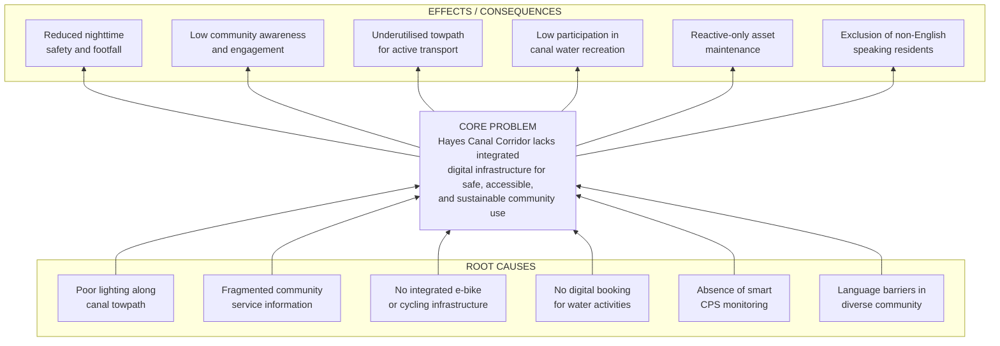

Each root cause has a direct causal chain to the core problem. Poor lighting (C1) and absence of CPS monitoring (C5) jointly produce the safety deficit. Fragmented information (C2) and language barriers (C6) combine to create community exclusion. Missing cycling infrastructure (C3) and water activity booking (C4) result in underutilised recreational assets. The SuperApp platform addresses all six root causes through its integrated architecture.

#### Objective Tree Analysis

The Objective Tree mirrors the Problem Tree, converting each root cause into an intervention (means), the core problem into a strategic objective, and each effect into a desired outcome (end). This transformation defines the solution's functional scope.

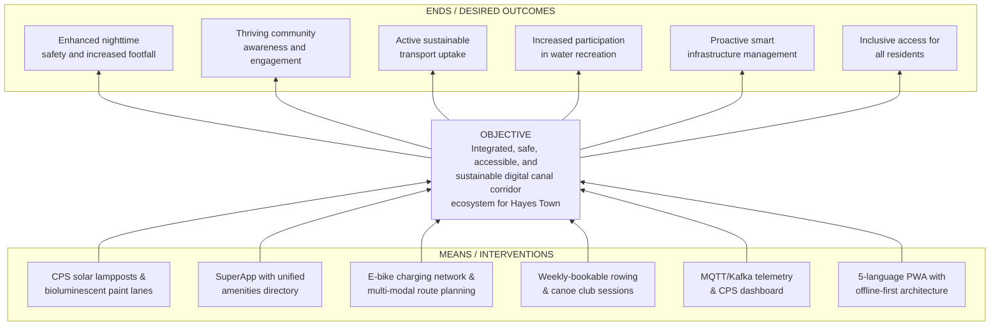

The Objective Tree demonstrates a one-to-one correspondence between identified causes and proposed interventions. Each means (M1–M6) is realised by specific microservices and CPS Edge nodes within the platform architecture, ensuring traceability from strategic objective to technical implementation.

#### SMART Objectives

All objectives are aligned with the Hillingdon Council Strategy 2022-2026 five commitments and are scoped to the MVP delivery window of the Brunel Impact Challenge.

| ID | SMART Objective | Council Commitment |
|---|---|---|
| SO-1 | **Safety:** Deploy CPS-monitored smart lamppost integration and bioluminescent cycling lane sensor network across the 3-mile Hayes Towpath, achieving <500ms telemetry latency and real-time safety scoring in the route planning engine, by 25th February 2026. | Safe and Strong Communities |
| SO-2 | **Community:** Launch a multilingual SuperApp (5 languages: English, Punjabi, Hindi, Urdu, Polish) with a searchable community partners directory and weekly-bookable rowing/canoe club sessions, serving 15,000+ Hayes Town Ward residents, by MVP delivery date. | Thriving, Healthy Households |
| SO-3 | **Sustainability:** Integrate an e-bike charging station monitoring network with real-time availability tracking via the CPS Edge layer, promoting zero-emission active transport along the canal corridor, within the project timeline. | Green and Sustainable Borough |
| SO-4 | **Digital:** Deliver a PWA-capable GovTech platform with <2s route planning response time, 99.5% uptime for core services, and WCAG 2.1 AA compliance, demonstrating the viability of a digital-enabled council service model. | Digital-Enabled Council |
| SO-5 | **Tourism:** Implement an XR Tour e-Guide covering all 8 stages of Hillingdon Trail Walk 2 with AR wayfinding at ≥30 FPS on mid-range devices, increasing visitor engagement with Hayes heritage sites along the towpath. | Thriving Economy |

Each SMART Objective is **Specific** (scoped to the 3-mile Hayes Towpath), **Measurable** (quantitative KPI targets), **Achievable** (using open-source technologies and simulated CPS data for MVP), **Relevant** (directly mapped to Council Strategy commitments), and **Time-bound** (25th February 2026 delivery).

#### Risk Analysis

The following risk matrix identifies key project risks, rated by likelihood (L) and impact (I) on a Low/Medium/High scale, with mitigation strategies grounded in the architectural decisions documented in `README.md`.

| Risk Description | Likelihood | Impact | Mitigation Strategy |
|---|---|---|---|
| **Towpath connectivity gaps** — Limited cellular coverage along canal sections disrupts real-time features | High | High | Offline-first architecture with local SQLite storage; service worker caching in PWA; pre-downloaded map tiles (`README.md`, lines 134–177) |
| **CPS hardware unavailability** — No physical lamppost or sensor hardware available for MVP demonstration | High | Medium | Software simulation layer with seeded telemetry data from real Hayes GPS coordinates; MQTT mock publishers for all CPS node types |
| **Community adoption barriers** — Diverse population may not engage with a new digital platform | Medium | High | PWA eliminates app-store friction; 5-language support; partnership with existing community groups and Canal & River Trust for distribution |
| **External API reliability** — Met Office, TfL, or Mapbox services experience downtime or rate limiting | Medium | Medium | Redis 7.4 caching layer with configurable TTL; graceful degradation to cached data; Kong Gateway rate-limiting and circuit-breaker patterns |
| **Scope creep from new features** — Rowing booking, e-bike monitoring, and bioluminescent sensors expand MVP beyond capacity | Medium | High | Phased implementation with strict MVP boundaries; new CPS Edge services implemented as independent microservices with MQTT topic isolation |
| **Timeline pressure** — 24-day delivery window (2nd–25th Feb 2026) constrains development capacity | High | Medium | Docker Compose local development; CI/CD via GitHub Actions; modular monorepo enabling parallel workstreams across team members |
| **GDPR/privacy compliance** — Location tracking and CPS telemetry raise data protection concerns | Low | High | No facial recognition; data minimisation by design; OAuth 2.0/OIDC authentication; UK Surveillance Camera Code adherence; privacy-by-default in all CPS data flows |
| **XR rendering performance** — Unity 6 AR module fails to meet 30 FPS target on mid-range devices | Medium | Medium | Progressive XR loading; fallback to 2D map overlays; device capability detection at runtime |

#### Cost-Benefit Analysis

**Estimated MVP Development Costs (24-Day Challenge Window)**

| Cost Category | Description | Estimate (GBP) |
|---|---|---|
| Development Labour | Student team (Brunel Impact Challenge) — no monetary cost | £0 (in-kind) |
| Cloud Infrastructure | Free-tier Kubernetes cluster (e.g., GKE free tier or local Docker Compose) | £0–£50 |
| Domain and SSL | Custom domain with Let's Encrypt SSL | £10–£15 |
| API Subscriptions | Met Office DataPoint (free), TfL Unified (free), Mapbox (free tier: 50k loads/month), OpenCharge Map (free) | £0 |
| CPS Simulation | MQTT mock publishers — software only | £0 |
| **Total MVP Cost** | | **£10–£65** |

**Estimated Real-World Deployment Costs (Post-MVP)**

| Cost Category | Description | Estimate (GBP) |
|---|---|---|
| Cloud Hosting | Managed K8s cluster with PostgreSQL, Redis, Kafka | £300–£600/month |
| Solar CCTV-Lamppost Nodes | Per unit (hardware + installation) | £2,000–£5,000/unit |
| E-Bike Charging Stations | Per station (hardware + electrical) | £5,000–£15,000/unit |
| Bioluminescent Paint | Per kilometre of cycling lane (LuminoKrom-class photoluminescent paint) | £8,000–£15,000/km |
| Ongoing Maintenance | Annual infrastructure + software support | £5,000–£10,000/year |

**Quantified Benefits**

| Benefit | Description | Impact |
|---|---|---|
| Nighttime Safety | CPS-monitored lighting + bioluminescent lanes visible for 80+ metres in darkness; zero energy consumption | Reduced safety incidents; increased footfall |
| Community Engagement | Unified digital directory for 7+ community group categories | Higher awareness of local services |
| Sustainable Transport | E-bike charging network promoting zero-emission commuting; photoluminescent lane paint is 50× cheaper than street lighting | Carbon reduction; cost savings |
| Water Recreation | Digital booking for weekly canoe/rowing sessions | Increased club membership and participation |
| Tourism Revenue | XR-guided heritage tours along 8 towpath stages | Increased visitor spend in Hayes |
| Council Efficiency | Real-time CPS dashboard replacing reactive inspection cycles | Reduced maintenance costs; data-driven planning |

### 1.1.2 Sub-Section B: Pitch Deck Narrative and Persona Story

This sub-section transforms the analytical framework of Sub-Section A into a human-centred narrative suitable for the 5-minute pitch deck presentation to Hillingdon Council. The persona, storyboard, and marketing message are designed to meet all judging criteria: clear storytelling, professional council-appropriate presentation, feasibility, and UN SDG alignment.

#### Persona Profile

| Attribute | Detail |
|---|---|
| **Name** | Priya Kaur |
| **Gender** | Female |
| **Age** | 34 |
| **Residence** | Hayes Town Ward, UB3 — near the Grand Union Canal towpath |
| **Education** | BSc in Business Administration |
| **Occupation** | Part-time administrative assistant; mother of two children (ages 7 and 10) |
| **Problems** | Feels unsafe walking the towpath after dark due to poor lighting; unaware of local rowing and canoe clubs for her children; struggles to find community health services in Punjabi for her elderly parents who live with her; no e-bike charging available near the towpath for her commute to Hayes & Harlington station; fragmented information about canal corridor amenities |
| **Hopes** | Safe, well-lit walking and cycling routes for daily commuting and weekend leisure; her children active in outdoor water sports; her parents independently accessing community services in their language; a connected, vibrant canal corridor she feels proud to call home |
| **Assistance Needed** | A single digital platform — accessible without app-store barriers — that provides safe route planning, activity booking, multilingual community information, and real-time infrastructure updates |
| **How the SuperApp Helps** | The PWA provides real-time safe route planning with lighting and risk scoring; bioluminescent cycling lane integration ensures nighttime visibility; weekly rowing/canoe sessions are bookable in-app for her children through The Sharks Canoe Club; e-bike charging station availability is monitored at towpath stations; her parents can browse the community directory in Punjabi |
| **Marketing Message** | *"Your Canal. Your Community. Your App. — Navigate Hayes Safely, Sustainably, and in Your Language."* |
| **SDGs Supported** | SDG 3 (Health), SDG 7 (Clean Energy), SDG 9 (Innovation), SDG 11 (Sustainable Cities), SDG 13 (Climate Action) |

#### Storyboard Narrative

The following storyboard follows the prescribed narrative arc: *person → problem → discovery → change → positive outcome*. It is designed for visual presentation across 5–6 pitch deck slides, each accompanied by field photography from Hayes Town Centre.

> **Priya walks along the Hayes Towpath after picking up her children from school.** The path ahead is dark — lampposts are sparse beyond Bulls Bridge. She hurries her children past unlit stretches, gripping their hands tightly. **She feels unsafe and rushed.**
>
> **One evening, a poster at Hayes & Harlington station introduces the Canal Corridor SuperApp.** She scans a QR code and the PWA opens instantly on her phone — no download needed.
>
> **The next day, everything changes.** The app shows her a safe, well-lit route home scored in real-time by CPS sensors. She notices a soft glow on the cycling lane — bioluminescent paint marking the path ahead, visible for over 80 metres without any electricity. She breathes easier.
>
> **She explores the app further.** She books her son into Saturday morning canoe sessions with The Sharks Canoe Club at the canal. She finds an e-bike charging station near the towpath and plans her commute. **Her mother opens the app in Punjabi and discovers a local health and wellbeing group she never knew existed.**
>
> **Priya feels safe, connected, and proud of her canal corridor.** She shares the app with her neighbours. Hayes Towpath is no longer a dark path to hurry through — it is her community's living, breathing spine.

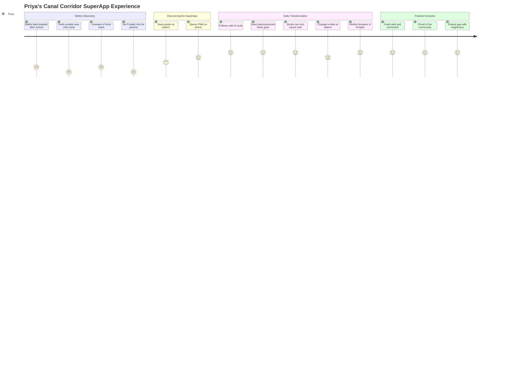

#### UN Sustainable Development Goals Alignment

The platform directly supports the following UN Sustainable Development Goals, with specific capabilities mapped to each goal.

| UN SDG | Platform Capability | Measurable Contribution |
|---|---|---|
| **SDG 3:** Good Health and Well-being | Rowing/canoe club booking; walking/running/cycling route planning; water recreation promotion | Increased physical activity participation via digital activity booking |
| **SDG 7:** Affordable and Clean Energy | Solar-powered CPS lampposts; e-bike charging stations; bioluminescent paint (zero energy consumption, charged by ambient light) | Renewable energy infrastructure; zero-emission nighttime wayfinding |
| **SDG 9:** Industry, Innovation and Infrastructure | CPS Edge-Fog-Cloud architecture; IoT/MQTT telemetry; GovTech SuperApp pattern | Smart infrastructure demonstrator for public sector innovation |
| **SDG 11:** Sustainable Cities and Communities | Multi-modal route planning; community directory; incident reporting; XR heritage tours; multilingual access | Inclusive, safe, resilient, and sustainable urban canal corridor |
| **SDG 13:** Climate Action | E-bike promotion; sustainable transport routing; solar-powered infrastructure; photoluminescent paint replacing energy-intensive lighting | Reduced carbon emissions from transport and infrastructure |
| **SDG 15:** Life on Land | Canal corridor ecology awareness via XR guide; wildlife information at towpath stages | Biodiversity awareness and protection along the canal ecosystem |

#### Pitch Readiness and Presentation Standards

The pitch deck adheres to the following standards, consistent with the Brunel Impact Challenge marking criteria and the professional expectations of a Hillingdon Council audience:

- **Team Identity:** "Urban Change Collective" displayed on every slide
- **Visual Theme:** Hillingdon Council brand-appropriate colours (blues, greens); consistent sans-serif typography; clean, uncluttered slide layouts
- **Content Discipline:** Maximum 5–6 bullet points per slide; visual-first design with field photographs from Hayes Town Centre
- **Narrative Structure:** Problem → Person Affected → Idea → Positive Change
- **Time Management:** 5-minute team relay; each member has a defined speaking section
- **Evidence-Based:** Analytical tools (Problem Tree, Objective Tree, SMART Objectives, Risk Matrix) included as visual evidence of rigorous planning
- **Accessibility:** High-contrast text; large readable fonts; no decorative animations

---

## 1.2 EXECUTIVE SUMMARY

### 1.2.1 Project Overview

The **Connected Canal Corridor Amenities Information GovTech SuperApp Ecosystem Platform** is a cross-platform digital solution encompassing a native Flutter mobile application (iOS/Android), a Progressive Web App (PWA) for browser-based access, a web administration dashboard, an IoT/CPS back-end integration layer, and XR (Extended Reality) rendering capabilities. It operates within the **XR Tour e-Guide SuperApp meta-ecosystem** paradigm, following the Gov-as-a-Product (GaaP) and eGov-as-a-Product (eGaaP) delivery pattern.

The platform is developed by the **Urban Change Collective** team as part of the Brunel University of London Impact Challenge (2nd–25th February 2026), in partnership with Hillingdon Council. The challenge requires teams to identify a real problem in Hayes Town Centre, design a digital solution, and present a 5-minute pitch to Hillingdon Council evaluators.

The geographic scope is the **3-mile Hayes Towpath** on the Paddington Arm of the Grand Union Canal — from Bulls Bridge junction in Southall (near UB2 4NH) to Yeading Lane at Grand Union Village (near UB4 0ES). This towpath corresponds to the 8 stages of Hillingdon Trail Walk 2 as documented in the trail guide attachment.

### 1.2.2 Core Business Problem

The canal corridor serving Hayes Town Ward faces six interconnected deficiencies that the platform is designed to resolve:

1. **Safety and Lighting Deficit** — Poor lighting along the canal towpath creates hazardous conditions, suppressing nighttime use and contributing to a perception of danger that deters residents and visitors.
2. **Fragmented Community Information** — Over 15,000 Hayes Town Ward residents lack a unified digital platform to discover route options, local amenities, community partner organisations, and scheduled activities.
3. **Disconnected Cycling Infrastructure** — The towpath corridor has no integrated e-bike charging network and no nighttime cycling lane visibility solutions, despite serving established cycling routes.
4. **Underutilised Water Recreation** — Existing rowing and canoe clubs (The Sharks Canoe Club, Hillingdon Junior Canoe Club, Hillingdon Canal Club) lack digital booking and scheduling infrastructure for their weekly sessions.
5. **Absence of Smart Monitoring** — No Cyber-Physical System (CPS) infrastructure exists to monitor canal corridor assets, environmental conditions, or infrastructure health in real time.
6. **Linguistic Exclusion** — Hayes Town Ward's ethnically diverse population (50.4% Asian, 24.2% White, 13.1% Black per 2021 Census) faces language barriers when accessing public services, with no multilingual digital platform available.

### 1.2.3 Key Stakeholders and Users

| Stakeholder Group | Role and Interest |
|---|---|
| **Hillingdon Council** | Primary client; pitch presentation audience; owns the Hayes Town Centre regeneration programme; strategy alignment authority |
| **Hayes Town Ward Residents** | 15,000+ primary end users seeking safe routes, amenities information, activity booking, and multilingual access |
| **Field Workers** | Council maintenance staff, Canal & River Trust volunteers, and Hillingdon Canal Partnership workers who benefit from CPS dashboards and incident data |
| **Visitors and Tourists** | Elizabeth Line commuters, heritage tourists, and leisure users discovering the Hayes Towpath via XR-guided tours |
| **Community Partner Organisations** | Sports & Leisure, Faith, Youth, Health, Arts & Culture, and Environment groups listed in the Community Groups directory |
| **Canal & River Trust** | Canal infrastructure custodian; organises the annual Hayes Canal Festival; data partner for waterway conditions |
| **Brunel University of London** | Academic partner; Impact Challenge programme host; assessment body |

### 1.2.4 Value Proposition and Expected Impact

The platform delivers a unified, intelligent, and inclusive digital gateway to the Hayes Canal Corridor, generating value across five dimensions:

- **Safety Transformation:** CPS-monitored smart lampposts combined with bioluminescent photoluminescent paint on cycling lanes provide continuous nighttime visibility — the paint charges from ambient light and glows for up to 10 hours with zero energy consumption and zero CO₂ emissions, at an estimated cost 50 times lower than traditional street lighting.
- **Community Connection:** A searchable, multilingual directory of community partners across 7+ categories, combined with weekly-bookable rowing and canoe club sessions, transforms passive information consumption into active community participation.
- **Sustainable Mobility:** An e-bike charging station network with real-time availability monitoring, integrated into the multi-modal route planning engine (walking, running, cycling), promotes zero-emission active transport along the canal corridor.
- **Intelligent Infrastructure:** The CPS Edge-Fog-Cloud continuum — with MQTT telemetry flowing from solar lampposts, e-bike stations, bioluminescent sensors, and water activity terminals through Apache Kafka to the microservices layer — enables proactive, data-driven infrastructure management.
- **Strategic Alignment:** The platform directly supports the Hillingdon Council Strategy 2022-2026 five commitments: safe and strong communities; thriving, healthy households; a green and sustainable borough; a thriving economy; and a digital-enabled, modern, well-run council.

---

## 1.3 SYSTEM OVERVIEW

### 1.3.1 Project Context

#### Business and Geographic Context

Hayes Town Centre operates within the "Smart Airport Hub Suburbia" context — Hayes & Harlington is proximate to London Heathrow Airport and serves as a western gateway to Central London via the Elizabeth Line. The Hayes Town Centre regeneration programme, managed by Hillingdon Council, is actively investing in infrastructure improvements, making this an optimal moment to introduce a digital layer to the canal corridor.

The platform's geographic scope — the 3-mile Hayes Towpath from Bulls Bridge junction to Grand Union Village — provides a bounded, manageable deployment zone with rich cultural, ecological, and historical significance across its 8 waypoint stages. This containment enables MVP validation before potential expansion to the full 20-mile Hillingdon Trail.

#### Current System Limitations

No existing digital platform serves the canal corridor in a unified capacity. Current limitations include:

- No integrated route planning considering real-time safety, lighting, weather, and incident data
- No digital booking system for canal water recreation activities
- No CPS/IoT monitoring of towpath infrastructure assets
- No multilingual community services platform
- No XR-enhanced heritage or wayfinding experience
- No e-bike charging infrastructure monitoring along the towpath
- No nighttime cycling lane visibility beyond sporadic street lighting

#### Enterprise Landscape Integration

The platform integrates with the existing Hillingdon Council digital landscape through alignment with Council Strategy 2022-2026 priorities, consumption of Hillingdon Council Open Data, and adherence to UK public sector standards including GDPR, the UK Surveillance Camera Code of Practice, and WCAG 2.1 AA accessibility requirements. The Council's Strategic Climate Action Plan supports the ambition to "live in a sustainable borough that is carbon neutral" and is linked to transport strategies including the Electric Vehicle Charging Strategy.

### 1.3.2 High-Level System Description

#### Primary System Capabilities

The platform delivers thirteen core capabilities organised across four functional domains:

**Navigation and Route Planning**
1. Dynamic Optimal Route Planning Engine — modified A* pathfinding with multi-criteria cost functions across walking, running, and cycling modes, incorporating open times, risk markers, live traffic, weather, lighting conditions, and incident data
2. XR Tour e-Guide — AR wayfinding with heritage information and wildlife guides across the 8 stages of Hillingdon Trail Walk 2
3. Live Weather and Environment Alerting — Met Office DataPoint integration for real-time conditions

**Community and Amenities**
4. Community Partners Directory — searchable, categorised directory of local organisations across 7+ categories
5. Amenities Information Service — real-time open/close status for canal corridor amenities
6. AI-Personalised Errands Scheduler — itinerary optimisation based on user preferences and time constraints
7. Weekly-Bookable Rowing and Canoe Club Sessions — digital scheduling for canal water recreation activities via CPS Edge terminals

**Safety and Infrastructure**
8. CPS-Monitored Smart Lamppost Network — solar-powered CCTV-lamppost integration with real-time telemetry
9. Bioluminescent Paint Cycling Lane Monitoring — photoluminescent sensor network for nighttime lane visibility tracking
10. E-Bike Charging Station Network — multiple stations with real-time availability monitoring via CPS Edge and OpenCharge Map API
11. Incident Reporting System — community-sourced safety reporting with geolocation and photo evidence

**Platform and Administration**
12. Planning Document Auto-Generation Engine — automated documentation output
13. Progressive Web App (PWA) Deployment — browser-based access alongside native Flutter mobile, eliminating app-store barriers

#### Major System Architecture

The architecture follows a layered SuperApp meta-ecosystem pattern with event-driven microservices, as documented in the canonical architecture flowchart (`1st-Hayes-Impact-Govtech-App-Architecture-FlowChart-v260208c.svg`).

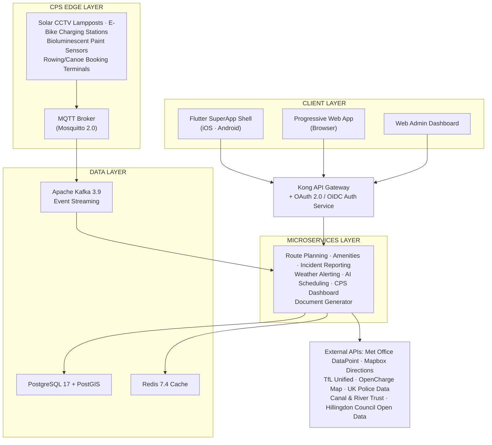

| Architecture Layer | Key Technologies | Responsibility |
|---|---|---|
| **Client Layer** | Flutter 3.27.x / Dart 3.6.x, PWA (Service Workers), Unity 6 (XR) | User interface, offline caching, AR rendering |
| **API Gateway** | Kong, OAuth 2.0/OIDC | Routing, authentication, rate limiting, circuit breaking |
| **Microservices** | Node.js 22.x LTS / TypeScript 5.7.x | Business logic, domain services, API endpoints |
| **Data Layer** | PostgreSQL 17 + PostGIS, Redis 7.4, Apache Kafka 3.9 | Persistence, spatial queries, caching, event streaming |
| **CPS Edge** | MQTT (Mosquitto 2.0), Solar-powered sensor nodes | IoT telemetry ingestion, edge data collection |
| **External** | REST APIs (Met Office, Mapbox, TfL, OpenCharge Map, UK Police) | Third-party data enrichment |

#### Core Technical Approach

The system employs three complementary communication paradigms:

- **Synchronous (REST/GraphQL):** Client-to-microservice requests via Kong API Gateway for route planning queries, amenity lookups, and community directory searches
- **Asynchronous (MQTT → Kafka → WebSocket):** CPS Edge telemetry flows from physical sensor nodes through the MQTT broker into Apache Kafka topics, processed by microservices, and pushed to clients via WebSocket for real-time dashboard updates
- **Offline-First:** Service worker caching (PWA) and local SQLite storage (Flutter) ensure core functionality persists through canal towpath connectivity gaps

### 1.3.3 Success Criteria and Key Performance Indicators

The following KPIs define measurable success for the MVP delivery, as specified in `README.md` (lines 1476–1483).

| KPI Category | Metric | Target |
|---|---|---|
| **Route Planning** | Route calculation response time (95th percentile) | < 2 seconds |
| **XR Rendering** | AR overlay frame rate on mid-range devices | ≥ 30 FPS |
| **CPS Telemetry** | End-to-end latency (MQTT to dashboard) | < 500 milliseconds |
| **Availability** | Core services uptime | 99.5% |
| **Map Performance** | Tile loading (cached / first load) | < 1s / < 3s |
| **Gateway** | API Gateway added latency | < 50 milliseconds |
| **Offline Mode** | Local storage data retrieval | < 200 milliseconds |
| **Accessibility** | WCAG 2.1 AA compliance | Full compliance |
| **Internationalisation** | Language support | 5 languages (EN, PA, HI, UR, PL) |
| **Test Coverage** | Core logic unit/integration coverage | ≥ 90% |

---

## 1.4 SCOPE

### 1.4.1 In-Scope Features and Functionalities

The MVP scope encompasses the following core features, organised by functional domain.

| Domain | In-Scope Capability |
|---|---|
| **Route Planning** | Multi-modal (walk/run/cycle) A* pathfinding with safety scoring, open times, weather, lighting, and incident integration |
| **XR Tourism** | AR wayfinding and heritage guide for 8 stages of Hillingdon Trail Walk 2 |
| **CPS Monitoring** | Solar CCTV-lamppost telemetry; e-bike charging station availability; bioluminescent paint sensor status; rowing/canoe terminal data |
| **Community** | Searchable partner directory (7+ categories); amenities with real-time status; AI errands scheduler |
| **Water Recreation** | Weekly-bookable rowing and canoe club sessions (The Sharks, Hillingdon Junior Canoe Club) |
| **Cycling** | E-bike charging station network with real-time availability; bioluminescent cycling lane monitoring and wayfinding |
| **Safety** | Incident reporting with geolocation and photo evidence; real-time weather alerting |
| **Platform** | Flutter native app (iOS/Android); PWA (browser); web admin dashboard |
| **Internationalisation** | 5 priority languages: English, Punjabi, Hindi, Urdu, Polish |
| **Documentation** | Planning sheet (problem statement, trees, SMART objectives, risk, cost); pitch deck; OpenAPI spec; architecture documentation |

**Primary User Workflows:**
1. **Route Discovery:** Resident opens PWA → selects destination/mode → receives optimised route with real-time safety, lighting, and weather scoring → follows AR wayfinding on towpath
2. **Activity Booking:** Parent browses water recreation → selects rowing or canoe club → books weekly session for child → receives confirmation and calendar entry
3. **E-Bike Commute:** Cyclist checks e-bike charging station availability → plans route via nearest available station → charges e-bike → continues commute
4. **Community Discovery:** Resident (or non-English-speaking family member) switches to preferred language → browses community directory → discovers local health/faith/youth group → accesses contact details and directions
5. **Incident Reporting:** User encounters towpath hazard → opens incident module → tags geolocation and photo → submits report → council field workers receive alert via CPS dashboard

### 1.4.2 Implementation Boundaries

| Boundary Dimension | Scope Definition |
|---|---|
| **Geographic** | 3-mile Hayes Towpath (Bulls Bridge junction to Grand Union Village) on the Paddington Arm of the Grand Union Canal |
| **User Groups** | Hayes Town Ward residents; visitors/tourists; council field workers; community partner administrators |
| **Market** | London Borough of Hillingdon (single-borough deployment) |
| **Data Domains** | Route/spatial data (PostGIS); amenity metadata; CPS telemetry; incident reports; community partner records; weather data; user authentication tokens |
| **Infrastructure** | Monorepo: Flutter client, Node.js/TypeScript microservices, CPS Edge simulation layer; Docker/K8s orchestration; Terraform IaC; GitHub Actions CI/CD |
| **Security** | OAuth 2.0/OIDC; GDPR compliance; UK Surveillance Camera Code; MQTT TLS encryption; no facial recognition |
| **Integrations** | Met Office DataPoint, Mapbox Directions, TfL Unified API, Canal & River Trust data, Hillingdon Council Open Data, UK Police Data API, OpenCharge Map API |

### 1.4.3 Out-of-Scope Elements

The following items are explicitly excluded from the MVP delivery, with rationale for deferral.

| Excluded Element | Rationale |
|---|---|
| Full 20-mile Hillingdon Trail coverage | MVP scoped to 3-mile Hayes Towpath; trail extension is a future-phase objective |
| Advanced AI/ML model training | Rule-based optimisation sufficient for MVP; deep learning deferred to post-challenge |
| Production CCTV video storage and retrieval | Real-time telemetry only; no long-term video archival in MVP |
| Physical hardware procurement | Software integration layer with simulated CPS data; no lamppost/sensor installation |
| Smartwatch or wearable companion app | Mobile (Flutter) and web (PWA) clients only |
| Advanced analytics dashboard | Basic CPS dashboard for MVP; full analytics suite deferred |
| Multi-borough federation | Hillingdon-only deployment; federation architecture documented but not implemented |
| Internationalisation beyond 5 languages | Priority languages (EN, PA, HI, UR, PL) based on census demographics; additional languages deferred |
| Payment processing | Free public service; no financial transactions |
| Social features (messaging, forums) | Information and navigation focus; community interaction via partner organisations |
| Formal WCAG accessibility audit certification | Design-level WCAG 2.1 AA compliance; third-party audit deferred to pre-production |
| Load testing infrastructure | Functional testing only for MVP; load/stress testing deferred |
| Canal & River Trust internal system integration | External open data consumption only; no write-back to Trust systems |

### 1.4.4 Implementation Phases

The 5-phase implementation plan maps to the 24-day delivery window, as defined in `README.md` (lines 1313–1359).

| Phase | Focus Area | Key Deliverables |
|---|---|---|
| **Phase 1 — Foundation** | Repository structure, containerisation, shell applications | Monorepo scaffold; Docker Compose; Flutter SuperApp shell; Kong Gateway; Auth service; shared libraries; CI pipeline |
| **Phase 2 — Core Logic** | Domain services, data persistence, CPS integration | Route Planning service (A* engine); CPS Dashboard service; Amenities service; Incident Reporting service; Weather Alerting service; PostgreSQL + PostGIS migrations and seeds |
| **Phase 3 — Interfaces** | User-facing modules, real-time communication, new CPS Edge services | UI modules (route, XR, incidents, community, errands); Unity/XR bridge; WebSocket push notifications; rowing/canoe booking; e-bike monitoring; bioluminescent sensor integration; PWA service worker |
| **Phase 4 — Testing** | Quality assurance across all layers | Unit tests; widget tests; API integration tests; E2E tests; test fixtures seeded from real Hayes geographic data; ≥90% core logic coverage |
| **Phase 5 — Documentation** | Specification, planning, and presentation deliverables | Planning sheet (Sub-Section A); pitch deck (Sub-Section B); OpenAPI specification; architecture documentation; deployment guides |

---

## 1.5 REFERENCES

#### Repository Files Examined

- `README.md` (lines 1–1483) — Primary technical charter containing mission statement, architecture specification, technology stack, component definitions, data models, API contracts, implementation phases, and project attachments index. Serves as both the product requirements document and technical specification source.
- `1st-Hayes-Impact-Govtech-App-Architecture-FlowChart-v260208c.svg` — Canonical SVG architecture flowchart depicting all system layers (Client, API Gateway, Microservices, Data, CPS Edge, External Integrations) and their directional connections.

#### Supporting Attachments Referenced

| # | Document | Relevance |
|---|---|---|
| 1 | Project Brief | Brunel Impact Challenge context, scope, team requirements, deliverables |
| 2 | Marking Criteria | Assessment dimensions, scoring rubric, judge questions |
| 3 | Community Groups Directory | Hayes Town organisations by category (Sports, Faith, Youth, Health, Arts, Environment) |
| 4 | Council Strategy 2022-2026 | Strategic priorities, five commitments, SMART objectives alignment context |
| 5 | Hillingdon Trail Walk 2 Guide | 8-step towpath route, landmarks, waypoints for XR Tour stages |
| 6 | RRP Annual Update 2025 | Regeneration data, demographics, deprivation indices |
| 7 | Planning Sheet Template | Blank template for problem statement, trees, SWOT, risk, cost analysis |
| 8 | Supporting Info — Regeneration | Maps, 2021 Census data, transport connectivity, development plans |

#### Web Sources Consulted

- **Hillingdon Council Strategy 2022-2026** — Official council website confirming five commitments: safe and strong communities; thriving, healthy households; a green and sustainable borough; a thriving economy; a digital-enabled, modern, well-run council. Source: `hillingdon.gov.uk/council-strategy`
- **Hayes Canal Corridor Rowing and Canoe Activities** — Confirmed existing clubs (The Sharks Canoe Club, Hillingdon Junior Canoe Club, Hillingdon Canal Club) operating weekly sessions along the Grand Union Canal
- **Bioluminescent/Photoluminescent Paint for Cycling Lanes** — LuminoKrom and StarPath products providing zero-energy nighttime cycling lane visibility, charged by ambient light, glowing for 10+ hours
- **E-Bike Charging Station Infrastructure** — Hillingdon Council Electric Vehicle Infrastructure Strategy (approved July 2023); OpenCharge Map API for charging point data; National Cycle Network deployment precedents
- **UN Sustainable Development Goals Alignment** — SDG 3 (Health), SDG 7 (Clean Energy), SDG 9 (Innovation), SDG 11 (Sustainable Cities), SDG 13 (Climate Action), SDG 15 (Life on Land) — mapping verified against official UN SDG framework

# 2. Product Requirements

This section provides a complete, testable product requirements specification for the Connected Canal Corridor Amenities Information GovTech SuperApp Ecosystem Platform. Every feature, functional requirement, and dependency documented herein is traceable to the strategic planning framework (Section 1.1), the core business problems (Section 1.2), and the system capabilities (Section 1.3) defined in the preceding sections. The platform delivers thirteen core capabilities and one cross-cutting authentication service, organised across four functional domains, targeting the 3-mile Hayes Towpath from Bulls Bridge junction to Grand Union Village.

---

## 2.1 FEATURE CATALOG

The feature catalog enumerates all discrete product features with standardised metadata, descriptions, and dependency mappings. Features are grouped by functional domain as defined in Section 1.3.2.

### 2.1.1 Navigation and Route Planning Domain

---

#### F-001: Dynamic Optimal Route Planning Engine

| Attribute | Detail |
|---|---|
| **Feature ID** | F-001 |
| **Feature Name** | Dynamic Optimal Route Planning Engine |
| **Category** | Navigation and Route Planning |
| **Priority Level** | Critical |
| **Status** | Approved |

**Overview**
The Dynamic Optimal Route Planning Engine provides multi-modal route calculation (walking, running, cycling) from Hayes & Harlington station to canal corridor destinations. It implements a modified A* pathfinding algorithm with multi-criteria cost functions that incorporate real-time data from CPS telemetry, weather services, incident reports, and amenity schedules. The engine resides in `src/server/services/route-planning/src/` and exposes four REST API endpoints via the Kong API Gateway.

**Business Value**
This feature directly addresses root cause C1 (poor lighting along canal towpath) and root cause C3 (no integrated cycling infrastructure) identified in the Problem Tree (Section 1.1.1). By integrating safety scoring derived from CPS lamppost telemetry, bioluminescent lane sensor data, incident risk markers, and live weather conditions, the engine transforms route planning from a static mapping exercise into a dynamic safety-aware navigation system. It aligns with SMART Objective SO-4 (digital-enabled council service model) and SMART Objective SO-1 (real-time safety scoring in the route planning engine).

**User Benefits**
Residents such as the primary persona Priya Kaur (Section 1.1.2) receive optimised routes scored in real time for lighting quality, surface conditions, CCTV coverage, and environmental hazards. Cyclists benefit from integration with e-bike charging station availability and bioluminescent lane visibility data. All users benefit from weather-adjusted routing that accounts for towpath conditions.

**Technical Context**
The engine exposes the following interfaces: `PathfindingService.calculateRoute(origin, destination, mode, preferences)`, `LightingService.evaluateCorridorLighting(segments, timeOfDay)`, `TrafficService.getLiveConditions(bbox)`, and `RouteController.getOptimalRoute(req, res)`. Spatial graph queries are executed against PostGIS with GiST indices on all geometry columns, using the WGS84 (EPSG:4326) coordinate system bounded to the Hayes corridor (lat: 51.49–51.52, lon: −0.37 to −0.42).

**Dependencies**

| Dependency Type | Detail |
|---|---|
| **Prerequisite Features** | F-008 (CPS Lamppost Network), F-009 (Bioluminescent Paint Monitoring), F-010 (E-Bike Charging Stations), F-011 (Incident Reporting), F-003 (Weather Alerting) |
| **System Dependencies** | PostgreSQL 17 with PostGIS extension, Redis 7.4 for cached route segments, Node.js 22.x LTS / TypeScript 5.7.x |
| **External Dependencies** | Mapbox Directions API (base route calculations and map tiles), Met Office DataPoint API (weather conditions), UK Police Data API (crime statistics for risk scoring) |
| **Integration Requirements** | Kafka consumer for CPS telemetry events, REST integration with Amenities Service for open-time data, WebSocket push for real-time risk marker updates |

---

#### F-002: XR Tour e-Guide Module

| Attribute | Detail |
|---|---|
| **Feature ID** | F-002 |
| **Feature Name** | XR Tour e-Guide Module |
| **Category** | Navigation and Route Planning |
| **Priority Level** | High |
| **Status** | Approved |

**Overview**
The XR Tour e-Guide delivers AR wayfinding overlays along the Hayes Towpath, providing heritage information, wildlife guides, directional markers, and points of interest (POIs) across the 8 stages of Hillingdon Trail Walk 2. The client module resides in `src/client/lib/modules/xr_guide/` and leverages Unity 6 via a platform channel bridge to the Flutter SuperApp shell.

**Business Value**
This feature aligns with SMART Objective SO-5 (XR Tour e-Guide covering all 8 stages at ≥30 FPS on mid-range devices) and supports the Hillingdon Council Strategy commitment to a thriving economy by increasing visitor engagement with Hayes heritage sites. It contributes to SDG 15 (Life on Land) through canal ecology awareness and SDG 11 (Sustainable Cities) through heritage preservation.

**User Benefits**
Visitors and tourists discover canal corridor heritage through immersive AR overlays, while residents gain new appreciation for local ecology and historical landmarks. The XR guide transforms the towpath walk into an engaging educational experience suitable for families, including Priya Kaur's children (ages 7 and 10).

**Technical Context**
Key interfaces include `ARSessionService.initializeSession(trailSegment)`, `POIService.getNearbyPOIs(location, radius)`, and `XRController.onMarkerDetected(markerId)`. The module uses ARCore (Android) and ARKit (iOS) via AR Foundation, with a Mapbox 2D fallback for devices lacking AR capability. An offline POI cache ensures functionality through towpath connectivity gaps.

**Dependencies**

| Dependency Type | Detail |
|---|---|
| **Prerequisite Features** | F-001 (Route Planning for navigation context) |
| **System Dependencies** | Unity 6 (6000.x), ARCore/ARKit via AR Foundation, Flutter 3.27.x platform channel bridge |
| **External Dependencies** | Mapbox GL for 2D fallback rendering |
| **Integration Requirements** | POI and XR_MARKER data from PostgreSQL; offline cache synchronisation via SQLite |

---

#### F-003: Live Weather and Environment Alerting

| Attribute | Detail |
|---|---|
| **Feature ID** | F-003 |
| **Feature Name** | Live Weather and Environment Alerting |
| **Category** | Navigation and Route Planning |
| **Priority Level** | High |
| **Status** | Approved |

**Overview**
The Live Weather and Environment Alerting service provides real-time weather alerts affecting towpath conditions through integration with the Met Office DataPoint API. The service resides in `src/server/services/weather/src/` and feeds weather condition data into the route planning cost function.

**Business Value**
Weather-adjusted routing prevents residents from being caught in hazardous towpath conditions (flooding, ice, high winds) and provides advance alerting for outdoor recreation planning. This supports SDG 3 (Good Health and Well-being) and the Council's commitment to safe and strong communities.

**User Benefits**
Users receive proactive alerts about weather conditions affecting their planned routes or booked activities. Parents booking canal water recreation sessions (F-007) are informed of conditions that may affect session safety.

**Technical Context**
The service integrates with the Met Office DataPoint API via REST/HTTPS with JSON responses. Weather data is cached in Redis 7.4 with configurable TTL to mitigate external API reliability risks. Graceful degradation to cached data is implemented via Kong Gateway circuit-breaker patterns, as documented in the Risk Analysis (Section 1.1.1).

**Dependencies**

| Dependency Type | Detail |
|---|---|
| **Prerequisite Features** | None |
| **System Dependencies** | Node.js 22.x LTS / TypeScript 5.7.x, Redis 7.4 for caching |
| **External Dependencies** | Met Office DataPoint API (REST/HTTPS, JSON) — free for public sector use |
| **Integration Requirements** | Weather data consumed by F-001 (Route Planning) for cost function adjustment |

---

### 2.1.2 Community and Amenities Domain

---

#### F-004: Community Partners Directory

| Attribute | Detail |
|---|---|
| **Feature ID** | F-004 |
| **Feature Name** | Community Partners Directory |
| **Category** | Community and Amenities |
| **Priority Level** | Medium |
| **Status** | Approved |

**Overview**
The Community Partners Directory provides a searchable, categorised directory of Hayes Town community groups, local businesses, faith centres, leisure facilities, and social infrastructure. It spans 7+ categories (Sports & Leisure, Faith, Youth, Health, Arts & Culture, Environment) as documented in the Community Groups supporting attachment. The service resides in `src/server/services/community/src/`.

**Business Value**
This feature directly addresses root cause C2 (fragmented community service information) from the Problem Tree and supports SMART Objective SO-2 (multilingual SuperApp with searchable community partners directory). It enables the 15,000+ Hayes Town Ward residents to discover the rich network of organisations operating within their ward, driving community engagement (SDG 11).

**User Benefits**
Priya Kaur's elderly parents can browse the directory in Punjabi (one of the 5 supported languages) to discover local health and wellbeing groups. All residents gain a single access point for community services that were previously fragmented across disparate analogue and digital sources.

**Technical Context**
Key interfaces include `PartnerService.searchPartners(query, category, location)` implementing full-text and geospatial search, `PartnerService.getPartnerById(partnerId)`, and `PartnerController.listPartners(req, res)`. PostgreSQL full-text search indices on `community_partner.name` and PostGIS spatial indices enable combined keyword and proximity queries.

**Dependencies**

| Dependency Type | Detail |
|---|---|
| **Prerequisite Features** | F-014 (Authentication — optional for enhanced features) |
| **System Dependencies** | PostgreSQL 17 with full-text search and PostGIS, Node.js 22.x LTS |
| **External Dependencies** | Hillingdon Council Open Data (amenity listings, events) |
| **Integration Requirements** | Consumed by F-006 (AI Errands Scheduler) for partner offerings |

---

#### F-005: Amenities Information Service

| Attribute | Detail |
|---|---|
| **Feature ID** | F-005 |
| **Feature Name** | Amenities Information Service |
| **Category** | Community and Amenities |
| **Priority Level** | Medium |
| **Status** | Approved |

**Overview**
The Amenities Information Service delivers real-time open/close status, service availability, and accessibility information for canal corridor and town centre amenities. The service resides in `src/server/services/amenities/src/` and supports proximity-based search via PostGIS spatial queries.

**Business Value**
Fragmented amenity information (root cause C2) is consolidated into a single real-time source of truth, enabling users to plan activities with confidence. The service provides the foundational amenity data layer consumed by the AI Errands Scheduler (F-006).

**User Benefits**
Users can check opening hours, accessibility features, and real-time availability before visiting amenities. Proximity search enables discovery of nearby facilities during towpath walks.

**Technical Context**
The service manages the AMENITY, AMENITY_CATEGORY, and OPENING_HOURS entities with PostGIS-enabled location queries. All spatial columns use WGS84 (EPSG:4326) with GiST indices. The `is_accessible` flag and `metadata` JSONB column support detailed accessibility information.

**Dependencies**

| Dependency Type | Detail |
|---|---|
| **Prerequisite Features** | None |
| **System Dependencies** | PostgreSQL 17 with PostGIS, Node.js 22.x LTS |
| **External Dependencies** | Hillingdon Council Open Data, Canal & River Trust Open Data |
| **Integration Requirements** | Consumed by F-006 (AI Errands Scheduler) for open-time validation and F-001 (Route Planning) for open-time cost factors |

---

#### F-006: AI-Personalised Errands Scheduler

| Attribute | Detail |
|---|---|
| **Feature ID** | F-006 |
| **Feature Name** | AI-Personalised Errands Scheduler |
| **Category** | Community and Amenities |
| **Priority Level** | Medium |
| **Status** | Approved |

**Overview**
The AI-Personalised Errands Scheduler recommends and sequences personalised errand itineraries based on user preferences, amenity open times, route optimisation between stops, and community partner offerings. The service resides in `src/server/services/scheduler/src/` and uses rule-based optimisation for the MVP, with deep learning deferred to post-challenge.

**Business Value**
By combining route cost data, amenity schedules, and user preferences into an intelligent itinerary, this feature increases both the efficiency and enjoyment of canal corridor visits. It supports the Council's commitment to a digital-enabled, modern service model (SMART Objective SO-4).

**User Benefits**
Residents can plan multi-stop errands that respect opening hours and optimal walking/cycling routes, reducing wasted trips and improving the experience of navigating Hayes Town Centre and the towpath corridor.

**Technical Context**
Key interfaces include `SchedulerService.generateItinerary(userId, errands, constraints)`, `PreferenceService.updatePreferences(userId, feedback)`, and `SchedulerController.createItinerary(req, res)`. The service queries Route Planning (F-001) for path costs between errand stops and Amenities (F-005) for open-time validation. User preferences are stored in PostgreSQL via the USER_PREFERENCE entity.

**Dependencies**

| Dependency Type | Detail |
|---|---|
| **Prerequisite Features** | F-001 (Route Planning for path costs), F-005 (Amenities for open times), F-014 (Authentication — required) |
| **System Dependencies** | PostgreSQL 17, Node.js 22.x LTS |
| **External Dependencies** | None |
| **Integration Requirements** | REST calls to Route Planning and Amenities microservices; user preference persistence |

---

#### F-007: Weekly-Bookable Rowing and Canoe Club Sessions

| Attribute | Detail |
|---|---|
| **Feature ID** | F-007 |
| **Feature Name** | Weekly-Bookable Rowing and Canoe Club Sessions |
| **Category** | Community and Amenities |
| **Priority Level** | High |
| **Status** | Approved |

**Overview**
This feature provides digital scheduling and booking for canal water recreation activities operated by The Sharks Canoe Club, Hillingdon Junior Canoe Club, and Hillingdon Canal Club. It is delivered via CPS Edge booking terminals at canalside locations, integrated into the SuperApp and PWA interfaces. This feature directly addresses root cause C4 (no digital booking for water activities) from the Problem Tree and Objective Tree intervention M4.

**Business Value**
Existing rowing and canoe clubs lack digital booking infrastructure, limiting participation in canal-based recreation (Business Problem #4, Section 1.2.2). Digital scheduling increases club membership and participation — a quantified benefit in the Cost-Benefit Analysis (Section 1.1.1). This feature supports SMART Objective SO-2 (weekly-bookable rowing/canoe club sessions) and SDG 3 (Good Health and Well-being).

**User Benefits**
Priya Kaur can book her son into Saturday morning canoe sessions with The Sharks Canoe Club directly through the SuperApp. Parents receive booking confirmation and calendar entries. The user workflow (Section 1.4.1, Workflow #2) follows: parent browses water recreation → selects rowing or canoe club → books weekly session for child → receives confirmation and calendar entry.

**Technical Context**
CPS Edge booking terminals at canalside locations communicate via the MQTT broker (Mosquitto 2.0) through dedicated MQTT topics. Terminal telemetry flows through Apache Kafka 3.9 into the CPS Dashboard microservice. The booking workflow integrates with the Authentication service (F-014) for user identity and the Weather Alerting service (F-003) for session safety conditions.

**Dependencies**

| Dependency Type | Detail |
|---|---|
| **Prerequisite Features** | F-008 (CPS Lamppost Network — shared CPS Edge infrastructure), F-014 (Authentication — required for booking) |
| **System Dependencies** | MQTT Broker (Mosquitto 2.0), Apache Kafka 3.9, PostgreSQL 17, Node.js 22.x LTS |
| **External Dependencies** | None (club partnership data managed internally) |
| **Integration Requirements** | MQTT topic isolation for booking terminal telemetry; Kafka consumer in CPS Dashboard; calendar entry generation |

---

### 2.1.3 Safety and Infrastructure Domain

---

#### F-008: CPS-Monitored Smart Lamppost Network

| Attribute | Detail |
|---|---|
| **Feature ID** | F-008 |
| **Feature Name** | CPS-Monitored Smart Lamppost Network |
| **Category** | Safety and Infrastructure |
| **Priority Level** | Critical |
| **Status** | Approved |

**Overview**
The CPS-Monitored Smart Lamppost Network ingests, processes, and visualises telemetry from solar-powered CCTV-lamppost sensor nodes along the Hayes Towpath. Telemetry types include IR sensor triggers, battery/solar charge levels, CCTV status, and motion detection events. The backend service resides in `src/server/services/cps/src/`, with CPS Edge firmware in `src/cps/firmware/` (C language: `ir_sensor_handler.c`, `mqtt_publisher.c`, `solar_battery_monitor.c`) and edge processing in `src/cps/edge-processor/` (Python: `motion_detector.py`, `occupancy_counter.py`).

**Business Value**
This is the platform's most critical differentiator, as stated in the Strategic Response to the Guiding Questions (Section 1.1.1): the CPS Edge integration layer transforms passive canal infrastructure into an intelligent, monitored ecosystem. It directly addresses root causes C1 (poor lighting) and C5 (absence of smart CPS monitoring) and aligns with SMART Objective SO-1. The feature supports SDG 7 (Clean Energy) via solar-powered infrastructure and SDG 9 (Innovation) via the CPS Edge-Fog-Cloud architecture.

**User Benefits**
Council field workers gain real-time visibility of infrastructure health via CPS dashboards and WebSocket telemetry streams. Residents benefit indirectly through safety scoring that feeds into route planning (F-001). The system enables proactive maintenance, replacing reactive-only inspection cycles (Business Problem #5, Section 1.2.2).

**Technical Context**
Key interfaces include `TelemetryService.consumeStream(kafkaTopic)` as a Kafka consumer, `AssetService.getLamppostStatus(lamppostId)`, `AssetService.getCorridorOverview(corridorId)`, and `CPSController.getAssetDashboard(req, res)`. Telemetry flows through MQTT topics `corridor/lamppost/{id}/telemetry` and `corridor/lamppost/{id}/command` into the MQTT broker (Mosquitto 2.0), then Apache Kafka 3.9, and finally into the microservices layer. The LAMPPOST and TELEMETRY_EVENT entities use TimescaleDB hypertables for time-series optimised storage. No facial recognition is implemented — only aggregate occupancy and motion detection, in compliance with the UK Surveillance Camera Code.

**Dependencies**

| Dependency Type | Detail |
|---|---|
| **Prerequisite Features** | None (foundational CPS Edge service) |
| **System Dependencies** | MQTT Broker (Mosquitto 2.0), Apache Kafka 3.9, PostgreSQL 17 with TimescaleDB, Redis 7.4, Node.js 22.x LTS |
| **External Dependencies** | None (simulated CPS telemetry for MVP) |
| **Integration Requirements** | Telemetry consumed by F-001 (Route Planning) for lighting/safety scoring; correlates with F-011 (Incident Reporting) |

---

#### F-009: Bioluminescent Paint Cycling Lane Monitoring

| Attribute | Detail |
|---|---|
| **Feature ID** | F-009 |
| **Feature Name** | Bioluminescent Paint Cycling Lane Monitoring |
| **Category** | Safety and Infrastructure |
| **Priority Level** | High |
| **Status** | Approved |

**Overview**
The Bioluminescent Paint Cycling Lane Monitoring feature provides a photoluminescent sensor network for nighttime cycling lane visibility tracking along the canal towpath. The paint (LuminoKrom / StarPath class products) charges from ambient light and glows for up to 10 hours, with zero energy consumption and zero CO₂ emissions. CPS Edge sensors monitor paint luminosity levels, ambient light conditions, and lane visibility status, feeding telemetry into the CPS Dashboard and Route Planning engine.

**Business Value**
This feature addresses root cause C3 (no integrated cycling infrastructure) and Objective Tree intervention M1 (CPS solar lampposts and bioluminescent paint lanes). At an estimated cost of £8,000–£15,000 per kilometre, bioluminescent paint is approximately 50 times cheaper than traditional street lighting (Section 1.2.4). Paint is visible for 80+ metres in darkness, providing continuous nighttime wayfinding without electrical infrastructure. This supports SMART Objective SO-1, SDG 7 (Clean Energy), and SDG 13 (Climate Action).

**User Benefits**
Cyclists and pedestrians experience continuous nighttime lane visibility along the towpath. Priya Kaur's storyboard (Section 1.1.2) describes noticing "a soft glow on the cycling lane — bioluminescent paint marking the path ahead, visible for over 80 metres without any electricity." Lane visibility data feeds into Route Planning (F-001) nighttime safety scoring.

**Technical Context**
Bioluminescent Paint Sensors operate as CPS Edge nodes, transmitting luminosity telemetry via the MQTT broker through dedicated topics. Sensor data flows through the same Edge-Fog-Cloud continuum as lamppost telemetry: MQTT → Kafka → CPS microservice → Route Planning safety score integration. For MVP, sensor data is simulated from real Hayes Towpath GPS coordinates.

**Dependencies**

| Dependency Type | Detail |
|---|---|
| **Prerequisite Features** | F-008 (CPS Lamppost Network — shared CPS Edge infrastructure and Kafka pipeline) |
| **System Dependencies** | MQTT Broker (Mosquitto 2.0), Apache Kafka 3.9, PostgreSQL 17 |
| **External Dependencies** | None (simulated CPS telemetry for MVP; real-world: LuminoKrom/StarPath paint products) |
| **Integration Requirements** | Luminosity data consumed by F-001 (Route Planning) for nighttime safety scoring; MQTT topic isolation from lamppost telemetry |

---

#### F-010: E-Bike Charging Station Network

| Attribute | Detail |
|---|---|
| **Feature ID** | F-010 |
| **Feature Name** | E-Bike Charging Station Network |
| **Category** | Safety and Infrastructure |
| **Priority Level** | High |
| **Status** | Approved |

**Overview**
The E-Bike Charging Station Network provides multiple charging stations along the towpath corridor with real-time availability monitoring via the CPS Edge layer and OpenCharge Map API integration. Stations operate as CPS Edge sensor nodes, transmitting occupancy, charge status, and fault telemetry. This feature addresses root cause C3 and Objective Tree intervention M3, aligning with SMART Objective SO-3 (e-bike charging station monitoring network with real-time availability tracking).

**Business Value**
The Hillingdon Council Electric Vehicle Infrastructure Strategy (approved July 2023) and the Strategic Climate Action Plan support zero-emission transport infrastructure. At an estimated cost of £5,000–£15,000 per unit (hardware + electrical), the stations promote sustainable commuting along an established cycling corridor. This feature supports SDG 7 (Clean Energy) and SDG 13 (Climate Action).

**User Benefits**
The user workflow (Section 1.4.1, Workflow #3) follows: cyclist checks e-bike charging station availability → plans route via nearest available station → charges e-bike → continues commute. Priya Kaur's persona (Section 1.1.2) identifies the absence of e-bike charging near the towpath as a specific problem affecting her commute to Hayes & Harlington station.

**Technical Context**
Charging stations as CPS Edge nodes transmit telemetry via MQTT, flowing through the Kafka pipeline to the CPS Dashboard. The OpenCharge Map API (REST/HTTPS, JSON) provides supplementary data on nearby public charging points. Station availability is integrated into the Route Planning engine's cycling mode for station-aware route optimisation.

**Dependencies**

| Dependency Type | Detail |
|---|---|
| **Prerequisite Features** | F-008 (CPS Lamppost Network — shared CPS Edge infrastructure) |
| **System Dependencies** | MQTT Broker (Mosquitto 2.0), Apache Kafka 3.9, PostgreSQL 17, Redis 7.4 |
| **External Dependencies** | OpenCharge Map API (REST/HTTPS, JSON — free for public use) |
| **Integration Requirements** | Charging availability consumed by F-001 (Route Planning) for cycling mode optimisation; MQTT topic isolation |

---

#### F-011: Incident Reporting System

| Attribute | Detail |
|---|---|
| **Feature ID** | F-011 |
| **Feature Name** | Incident Reporting System |
| **Category** | Safety and Infrastructure |
| **Priority Level** | High |
| **Status** | Approved |

**Overview**
The Incident Reporting System enables community-sourced incident reporting with geolocation tagging, photo evidence, categorisation (safety, obstruction, lighting failure, environmental hazard), and real-time propagation to field workers. The service resides in `src/server/services/incidents/src/`. Reported incidents create risk markers that feed into the Route Planning engine's cost function.

**Business Value**
Crowd-sourced safety feedback enables proactive community engagement and supports the Council's commitment to safe and strong communities. Incident correlation with CPS telemetry (via `CorrelationService.correlateWithCPS(incident, telemetryEvents)`) creates a data-driven safety feedback loop. This supports the user workflow (Section 1.4.1, Workflow #5) and SDG 11 (Sustainable Cities).

**User Benefits**
Users encountering towpath hazards can report issues with geolocation and photo evidence directly through the SuperApp. Council field workers receive real-time alerts via the CPS dashboard. All users benefit from updated risk markers in route planning.

**Technical Context**
Key interfaces include `IncidentService.submitReport(incidentData)`, `CorrelationService.correlateWithCPS(incident, telemetryEvents)`, and `IncidentController.createIncident(req, res)`. Events are published to Kafka for asynchronous propagation. The INCIDENT_REPORT entity includes a `correlated_lamppost_id` FK for CPS cross-referencing. The RISK_MARKER entity (severity score normalised to 0.0–1.0) is created from validated incident reports and fed into route segment cost calculations.

**Dependencies**

| Dependency Type | Detail |
|---|---|
| **Prerequisite Features** | F-008 (CPS Lamppost Network — for incident-telemetry correlation), F-014 (Authentication — required for submission) |
| **System Dependencies** | Apache Kafka 3.9, PostgreSQL 17 with PostGIS, Node.js 22.x LTS |
| **External Dependencies** | None |
| **Integration Requirements** | Kafka event publishing for real-time propagation; risk marker updates consumed by F-001 (Route Planning); WebSocket feed for field worker dashboards |

---

### 2.1.4 Platform and Administration Domain

---

#### F-012: Planning Document Auto-Generation Engine

| Attribute | Detail |
|---|---|
| **Feature ID** | F-012 |
| **Feature Name** | Planning Document Auto-Generation Engine |
| **Category** | Platform and Administration |
| **Priority Level** | Medium |
| **Status** | Approved |

**Overview**
The Planning Document Auto-Generation Engine auto-generates completed planning sheet documentation including problem statements, objective trees, SWOT analyses, risk matrices, and cost-benefit analyses. The service resides in `src/server/services/doc-generator/src/` and utilises templates (`planning-sheet.template.ts`, `swot-analysis.template.ts`, `business-canvas.template.ts`).

**Business Value**
Automated document generation supports Phase 5 (Documentation) deliverables and enables rapid production of planning materials for Hillingdon Council presentation. This aligns with the Brunel Impact Challenge requirement for evidence-based analytical deliverables.

**User Benefits**
Team members and administrators can generate standardised planning documentation without manual formatting, ensuring consistency across the planning sheet, pitch deck, and specification documents.

**Technical Context**
Template-based generation using TypeScript templates that populate data from the PostgreSQL data layer. The engine produces formatted output consistent with the Planning Sheet Template referenced in the supporting attachments (Section 1.5).

**Dependencies**

| Dependency Type | Detail |
|---|---|
| **Prerequisite Features** | None |
| **System Dependencies** | Node.js 22.x LTS / TypeScript 5.7.x, PostgreSQL 17 |
| **External Dependencies** | None |
| **Integration Requirements** | Reads project data from core microservices for template population |

---

#### F-013: Progressive Web App (PWA) Deployment

| Attribute | Detail |
|---|---|
| **Feature ID** | F-013 |
| **Feature Name** | Progressive Web App (PWA) Deployment |
| **Category** | Platform and Administration |
| **Priority Level** | Critical |
| **Status** | Approved |

**Overview**
The PWA provides browser-based access to all user-facing SuperApp features alongside the native Flutter mobile application, eliminating app-store barriers for community adoption. The PWA uses Service Workers for offline caching and local SQLite storage to ensure core functionality persists through canal towpath connectivity gaps. It is identified in the architecture (Section 1.3.2) as part of the Client Layer alongside the Flutter SuperApp Shell and Web Admin Dashboard.

**Business Value**
The PWA is the primary delivery mechanism for community access, as stated in Section 1.1.1: "Deploy the PWA with the route planning engine and community directory using real OpenStreetMap/Mapbox data for the Hayes Towpath" is the first step to test the idea in real life. The PWA removes app-store barriers, a critical factor for community adoption given that "some groups may not be able to access digital information, may lack technical skills or may struggle to understand due to language barriers" (Hillingdon Council Strategy 2022-2026). This supports SMART Objective SO-4 (PWA-capable GovTech platform) and SDG 11 (Sustainable Cities).

**User Benefits**
Priya Kaur's storyboard (Section 1.1.2) describes scanning a QR code at Hayes & Harlington station and the PWA opening instantly — "no download needed." The offline-first architecture ensures that route planning, community directory access, and cached amenity information remain available through towpath connectivity gaps, a high-likelihood risk identified in the Risk Analysis.

**Technical Context**
The PWA is part of the Flutter client build with Service Worker registration for offline caching. Map tiles are pre-downloadable for offline navigation. Local SQLite storage persists route data, community directory entries, and user preferences. The PWA connects to the same Kong API Gateway and microservices layer as the native Flutter app.

**Dependencies**

| Dependency Type | Detail |
|---|---|
| **Prerequisite Features** | F-014 (Authentication — for personalised features) |
| **System Dependencies** | Flutter 3.27.x / Dart 3.6.x, Service Workers, SQLite |
| **External Dependencies** | Mapbox GL for map tile rendering |
| **Integration Requirements** | Full REST API access via Kong API Gateway; offline-first synchronisation with backend services on reconnection |

---

#### F-014: Authentication and Authorisation Service

| Attribute | Detail |
|---|---|
| **Feature ID** | F-014 |
| **Feature Name** | Authentication and Authorisation Service |
| **Category** | Platform and Administration |
| **Priority Level** | Critical |
| **Status** | Approved |

**Overview**
The Authentication and Authorisation Service implements OAuth 2.0 / OpenID Connect (OIDC) with role-based access control (RBAC) across four user roles: resident, visitor, field_worker, and admin. It governs access to all authenticated API endpoints and enforces rate limiting across three tiers.

**Business Value**
Secure, privacy-compliant access control is essential for GDPR compliance, UK Surveillance Camera Code adherence, and responsible CPS telemetry access. The RBAC model ensures field workers access CPS dashboards with elevated permissions while residents access personalised features with minimal data collection (privacy-by-default).

**User Benefits**
Residents and visitors can access basic features (route planning, amenity lookup, community directory) anonymously, with optional registration for personalised features (itineraries, incident reporting). Field workers access the CPS dashboard with council-issued credentials and MFA. Admin users have full platform access with audit logging and IP allowlisting.

**Technical Context**
Access levels are defined as follows: residents/visitors receive anonymous access for basic route planning with optional registration for personalised features; field workers authenticate with council-issued credentials plus MFA for elevated CPS dashboard permissions; admin users have full platform access with audit logging and IP allowlisting. Rate limiting is enforced at: Public 100 req/min per IP, Authenticated 300 req/min per user, Route calculation 20 req/min per user, and CPS telemetry on a dedicated pool exempt from general limits.

**Dependencies**

| Dependency Type | Detail |
|---|---|
| **Prerequisite Features** | None (foundational cross-cutting service) |
| **System Dependencies** | Kong API Gateway (OAuth 2.0/OIDC enforcement), PostgreSQL 17 (USER entity), Redis 7.4 (session/token caching) |
| **External Dependencies** | None |
| **Integration Requirements** | All microservices validate tokens via Kong; RBAC policies enforced at API Gateway level |

---

## 2.2 FUNCTIONAL REQUIREMENTS

This section specifies testable functional requirements for each feature, organised with unique requirement IDs, acceptance criteria, and technical specifications. Tables are constrained to a maximum of 4 columns for readability.

### 2.2.1 F-001: Route Planning Requirements

| Requirement ID | Description |
|---|---|
| **F-001-RQ-001** | Calculate optimal multi-modal routes (walking, running, cycling) between any two points within the Hayes corridor bounding box |
| **F-001-RQ-002** | Incorporate real-time CPS lamppost lighting scores into route segment safety evaluation |
| **F-001-RQ-003** | Integrate bioluminescent lane visibility data into nighttime cycling route scoring |
| **F-001-RQ-004** | Factor live weather conditions from Met Office DataPoint into route cost functions |
| **F-001-RQ-005** | Include incident-derived risk markers (severity 0.0–1.0) in route segment costs |
| **F-001-RQ-006** | Integrate e-bike charging station availability for cycling mode route optimisation |
| **F-001-RQ-007** | Return route results as GeoJSON with waypoints, segments, and aggregate safety score |

**Acceptance Criteria and Priority**

| Requirement ID | Acceptance Criteria | Priority |
|---|---|---|
| F-001-RQ-001 | Route calculated within <2s (95th percentile); valid GeoJSON response with distance and estimated duration | Must-Have |
| F-001-RQ-002 | Lighting score derived from TELEMETRY_EVENT data within last 15 minutes; score reflected in segment safety_score | Must-Have |
| F-001-RQ-003 | Bioluminescent sensor luminosity above threshold increases nighttime safety score; below threshold triggers alternative route suggestion | Should-Have |
| F-001-RQ-004 | Weather alerts received within 5 minutes of Met Office publication; route warnings displayed for hazardous conditions | Must-Have |
| F-001-RQ-005 | Active risk markers (not expired) within 50m of route segment increase segment cost proportionally to severity | Must-Have |
| F-001-RQ-006 | Cycling routes include nearest available charging station when battery-level preference is set | Should-Have |
| F-001-RQ-007 | Response includes route_geojson, waypoints array, safety_score (0.0–1.0), and estimated_duration_seconds | Must-Have |

**Technical Specifications**

| Requirement ID | Input Parameters | Output/Response |
|---|---|---|
| F-001-RQ-001 | origin (point), destination (point), mode (enum), preferences (object) | Route object with GeoJSON, distance_metres, estimated_duration_seconds |
| F-001-RQ-002 | route segments, lamppost telemetry events | lighting_score per segment (0.0–1.0) |
| F-001-RQ-003 | route segments, bioluminescent sensor telemetry | lane_visibility_score per segment |
| F-001-RQ-004 | route bounding box, Met Office weather data | weather_warning flags, adjusted cost weights |
| F-001-RQ-005 | route segments, active risk markers within bbox | risk_adjustment per segment |
| F-001-RQ-006 | origin, destination, battery_level preference | route with charging station waypoint |
| F-001-RQ-007 | Calculated route object | Full Route entity as JSON with nested waypoints and segments |

**Validation and Performance Rules**

| Rule Category | Specification |
|---|---|
| **Coordinate Validation** | All coordinates must be WGS84 within Hayes corridor bounding box (lat: 51.49–51.52, lon: −0.37 to −0.42) |
| **Performance** | Route calculation <2 seconds (95th percentile); map tile loading <1s cached / <3s first load |
| **Data Freshness** | CPS telemetry data must be <15 minutes old for lighting scores; weather data cached with configurable TTL |
| **Security** | Optional authentication; public access for basic routing; authenticated access for saved routes |

---

### 2.2.2 F-002: XR Tour e-Guide Requirements

| Requirement ID | Description |
|---|---|
| **F-002-RQ-001** | Initialise AR sessions for each of the 8 Hillingdon Trail Walk 2 stages |
| **F-002-RQ-002** | Display POI overlays with heritage information, wildlife guides, and directional markers |
| **F-002-RQ-003** | Detect and respond to XR markers anchored at POI locations |
| **F-002-RQ-004** | Provide 2D Mapbox fallback for devices without AR capability |
| **F-002-RQ-005** | Cache POI data locally for offline towpath access |

**Acceptance Criteria and Priority**

| Requirement ID | Acceptance Criteria | Priority |
|---|---|---|
| F-002-RQ-001 | AR session initialises within 3 seconds; camera permission requested and handled gracefully | Must-Have |
| F-002-RQ-002 | POIs displayed within 50m radius of user location; heritage info includes text, image, and audio content | Must-Have |
| F-002-RQ-003 | Marker detection triggers content overlay within 500ms; content matches marker_asset_url configuration | Should-Have |
| F-002-RQ-004 | 2D fallback renders all POI locations on Mapbox map when AR is unavailable; device capability detected at runtime | Must-Have |
| F-002-RQ-005 | Offline POI cache updated on each online session; local retrieval <200ms | Must-Have |

**Technical Specifications**

| Requirement ID | Performance Criteria | Complexity |
|---|---|---|
| F-002-RQ-001 | ≥30 FPS on mid-range devices (last 3 years) | High |
| F-002-RQ-002 | POI query radius configurable; result set limited to 20 POIs | Medium |
| F-002-RQ-003 | Marker detection uses AR Foundation marker tracking | High |
| F-002-RQ-004 | Fallback detection based on device AR capability check | Low |
| F-002-RQ-005 | SQLite local storage; sync delta on reconnection | Medium |

---

### 2.2.3 F-003: Weather Alerting Requirements

| Requirement ID | Description |
|---|---|
| **F-003-RQ-001** | Ingest real-time weather data from Met Office DataPoint API for the Hayes corridor |
| **F-003-RQ-002** | Generate weather alerts for conditions affecting towpath safety (rain, ice, wind, flooding) |
| **F-003-RQ-003** | Cache weather data in Redis with configurable TTL for API reliability mitigation |

**Acceptance Criteria and Priority**

| Requirement ID | Acceptance Criteria | Priority |
|---|---|---|
| F-003-RQ-001 | Weather data refreshed at Met Office publication intervals; valid JSON response parsed without error | Must-Have |
| F-003-RQ-002 | Alert conditions defined for wind speed, rainfall, temperature (ice risk); alerts pushed via WebSocket | Must-Have |
| F-003-RQ-003 | Cached data served when Met Office API is unavailable; staleness indicator displayed to user | Should-Have |

---

### 2.2.4 F-004: Community Partners Directory Requirements

| Requirement ID | Description |
|---|---|
| **F-004-RQ-001** | Provide full-text search across community partner names and descriptions |
| **F-004-RQ-002** | Support category-based filtering across 7+ categories (Sports & Leisure, Faith, Youth, Health, Arts & Culture, Environment) |
| **F-004-RQ-003** | Enable geospatial proximity search for partners near user location |
| **F-004-RQ-004** | Deliver all content in 5 supported languages (EN, PA, HI, UR, PL) |

**Acceptance Criteria and Priority**

| Requirement ID | Acceptance Criteria | Priority |
|---|---|---|
| F-004-RQ-001 | Search results returned within 500ms; relevance-ranked using PostgreSQL full-text search | Must-Have |
| F-004-RQ-002 | Category list matches Community Groups directory; filterable via query parameter | Must-Have |
| F-004-RQ-003 | Proximity search accepts lat/lon/radius parameters; results ordered by distance | Should-Have |
| F-004-RQ-004 | Language parameter in request headers; all partner metadata available in 5 languages | Must-Have |

---

### 2.2.5 F-005: Amenities Information Requirements

| Requirement ID | Description |
|---|---|
| **F-005-RQ-001** | List amenities with real-time open/close status based on OPENING_HOURS data |
| **F-005-RQ-002** | Provide detailed amenity profiles including accessibility information |
| **F-005-RQ-003** | Support proximity-based amenity search using PostGIS spatial queries |

**Acceptance Criteria and Priority**

| Requirement ID | Acceptance Criteria | Priority |
|---|---|---|
| F-005-RQ-001 | Open/close status computed against current time and OPENING_HOURS entries; status returned in amenity list response | Must-Have |
| F-005-RQ-002 | Amenity detail includes is_accessible flag, metadata JSONB, opening hours, and contact information | Must-Have |
| F-005-RQ-003 | Proximity search accepts lat/lon/radius; spatial query uses GiST index on location column | Should-Have |

---

### 2.2.6 F-006: AI Errands Scheduler Requirements

| Requirement ID | Description |
|---|---|
| **F-006-RQ-001** | Generate personalised itineraries based on user errands, preferences, and time constraints |
| **F-006-RQ-002** | Validate all errand amenity targets have confirmed opening hours for scheduled times |
| **F-006-RQ-003** | Optimise errand sequence using route planning path costs between stops |
| **F-006-RQ-004** | Support itinerary modification and re-optimisation after initial generation |

**Acceptance Criteria and Priority**

| Requirement ID | Acceptance Criteria | Priority |
|---|---|---|
| F-006-RQ-001 | Itinerary generated within 5 seconds; includes ordered errands with scheduled arrival times | Must-Have |
| F-006-RQ-002 | Itinerary errands must reference amenities with confirmed opening hours; validation error returned if hours unavailable | Must-Have |
| F-006-RQ-003 | Optimisation uses rule-based sequencing (MVP); total travel time minimised | Should-Have |
| F-006-RQ-004 | PATCH endpoint modifies errand list; POST optimise endpoint re-sequences remaining errands | Should-Have |

**Validation Rules**

| Rule | Specification |
|---|---|
| **Errand-Amenity Validation** | Itinerary errands must reference amenities with confirmed opening hours for scheduled time |
| **Authentication** | All itinerary endpoints require authenticated user (OAuth 2.0 token) |
| **Time Constraints** | start_time must precede end_time; total errand durations must fit within time window |

---

### 2.2.7 F-007: Rowing and Canoe Club Sessions Requirements

| Requirement ID | Description |
|---|---|
| **F-007-RQ-001** | Display available weekly rowing and canoe sessions for registered clubs (The Sharks, Hillingdon Junior Canoe Club, Hillingdon Canal Club) |
| **F-007-RQ-002** | Enable authenticated users to book weekly sessions for themselves or dependants |
| **F-007-RQ-003** | Generate booking confirmation with calendar entry |
| **F-007-RQ-004** | Ingest CPS Edge booking terminal telemetry via MQTT |

**Acceptance Criteria and Priority**

| Requirement ID | Acceptance Criteria | Priority |
|---|---|---|
| F-007-RQ-001 | Session list displays club name, day, time, age restrictions, availability count | Must-Have |
| F-007-RQ-002 | Booking creates confirmed reservation; duplicate booking for same session/user prevented | Must-Have |
| F-007-RQ-003 | Confirmation includes session details, location, and downloadable calendar entry (ICS format) | Should-Have |
| F-007-RQ-004 | Terminal telemetry consumed via dedicated Kafka topic; booking status synchronised between app and terminal | Should-Have |

---

### 2.2.8 F-008: CPS Smart Lamppost Network Requirements

| Requirement ID | Description |
|---|---|
| **F-008-RQ-001** | Consume MQTT telemetry from solar CCTV-lamppost sensor nodes (IR trigger, battery level, solar charge, CCTV status, motion detected) |
| **F-008-RQ-002** | Store telemetry events in TimescaleDB hypertable for time-series optimised queries |
| **F-008-RQ-003** | Provide real-time WebSocket telemetry stream for field worker dashboards |
| **F-008-RQ-004** | Expose corridor health overview aggregating all lamppost statuses |
| **F-008-RQ-005** | Process motion detection and occupancy counting at the edge |

**Acceptance Criteria and Priority**

| Requirement ID | Acceptance Criteria | Priority |
|---|---|---|
| F-008-RQ-001 | Telemetry events consumed within <500ms end-to-end (MQTT to dashboard); valid lamppost asset tag reference required | Must-Have |
| F-008-RQ-002 | TimescaleDB hypertable partitioned by time; query performance acceptable for 30-day historical views | Must-Have |
| F-008-RQ-003 | WebSocket connection established within 2s; events pushed in real-time; field_worker role required | Must-Have |
| F-008-RQ-004 | Corridor overview returns operational/degraded/offline counts and percentage health score | Should-Have |
| F-008-RQ-005 | Edge processors (`motion_detector.py`, `occupancy_counter.py`) emit aggregate events only — no facial recognition | Must-Have |

**Security Requirements**

| Rule | Specification |
|---|---|
| **MQTT Encryption** | MQTT TLS 1.3 for all CPS communication |
| **No Facial Recognition** | Aggregate occupancy and motion detection only; compliant with UK Surveillance Camera Code |
| **Data Protection** | GDPR-compliant telemetry processing; data minimisation by design |
| **Access Control** | CPS dashboard endpoints restricted to field_worker and admin roles |

---

### 2.2.9 F-009: Bioluminescent Paint Monitoring Requirements

| Requirement ID | Description |
|---|---|
| **F-009-RQ-001** | Ingest luminosity telemetry from bioluminescent paint CPS Edge sensors |
| **F-009-RQ-002** | Classify lane visibility status (high/medium/low/insufficient) based on luminosity thresholds |
| **F-009-RQ-003** | Feed lane visibility data into Route Planning nighttime safety scoring |

**Acceptance Criteria and Priority**

| Requirement ID | Acceptance Criteria | Priority |
|---|---|---|
| F-009-RQ-001 | Sensor telemetry consumed via MQTT topic with <500ms latency; stored in telemetry time-series | Must-Have |
| F-009-RQ-002 | Visibility classification thresholds configurable; classification updated per sensor reading | Should-Have |
| F-009-RQ-003 | Route Planning engine queries current visibility status for cycling route segments during nighttime calculations | Must-Have |

---

### 2.2.10 F-010: E-Bike Charging Station Requirements

| Requirement ID | Description |
|---|---|
| **F-010-RQ-001** | Monitor real-time charging station availability via CPS Edge sensor telemetry |
| **F-010-RQ-002** | Integrate with OpenCharge Map API for supplementary public charging point data |
| **F-010-RQ-003** | Feed station availability into Route Planning cycling mode optimisation |
| **F-010-RQ-004** | Display station locations, availability, and fault status on map interface |

**Acceptance Criteria and Priority**

| Requirement ID | Acceptance Criteria | Priority |
|---|---|---|
| F-010-RQ-001 | Station telemetry (occupancy, charge status, faults) consumed via MQTT with <500ms latency | Must-Have |
| F-010-RQ-002 | OpenCharge Map data refreshed hourly; cached in Redis; graceful degradation on API failure | Should-Have |
| F-010-RQ-003 | Cycling routes include nearest available station when user indicates charging need | Must-Have |
| F-010-RQ-004 | Map markers show real-time availability; colour-coded (available/in-use/fault) | Should-Have |

---

### 2.2.11 F-011: Incident Reporting Requirements

| Requirement ID | Description |
|---|---|
| **F-011-RQ-001** | Submit incident reports with geolocation, photo evidence, and category selection |
| **F-011-RQ-002** | Correlate user-submitted incidents with CPS lamppost telemetry events |
| **F-011-RQ-003** | Generate risk markers from validated incidents for route planning integration |
| **F-011-RQ-004** | Provide real-time WebSocket incident feed for field workers |
| **F-011-RQ-005** | Support incident status lifecycle (submitted → acknowledged → resolved/dismissed) |

**Acceptance Criteria and Priority**

| Requirement ID | Acceptance Criteria | Priority |
|---|---|---|
| F-011-RQ-001 | Incident requires either geolocation OR manual address entry; photo upload supported; authenticated user required | Must-Have |
| F-011-RQ-002 | Correlation matches incident location to nearest lamppost(s); telemetry events within ±15 minutes of incident time linked | Should-Have |
| F-011-RQ-003 | Risk marker created with severity score (0.0–1.0); expires after configurable TTL; route planning queries active markers | Must-Have |
| F-011-RQ-004 | WebSocket feed pushes new incidents in real-time; filterable by category and location | Should-Have |
| F-011-RQ-005 | Status transitions enforced (submitted→acknowledged by field_worker; acknowledged→resolved/dismissed by field_worker/admin) | Must-Have |

---

### 2.2.12 F-012: Document Auto-Generation Requirements

| Requirement ID | Description |
|---|---|
| **F-012-RQ-001** | Generate completed planning sheet documents from project data |
| **F-012-RQ-002** | Support multiple template types (planning-sheet, swot-analysis, business-canvas) |
| **F-012-RQ-003** | Produce formatted output suitable for Hillingdon Council presentation |

**Acceptance Criteria and Priority**

| Requirement ID | Acceptance Criteria | Priority |
|---|---|---|
| F-012-RQ-001 | Generated document includes problem statement, objective tree, risk matrix, cost-benefit analysis | Must-Have |
| F-012-RQ-002 | Template selection via parameter; each template produces distinct output format | Should-Have |
| F-012-RQ-003 | Output is clean, professional, and matches council-appropriate presentation standards | Should-Have |

---

### 2.2.13 F-013: PWA Deployment Requirements

| Requirement ID | Description |
|---|---|
| **F-013-RQ-001** | Deploy all user-facing features via browser-accessible PWA |
| **F-013-RQ-002** | Implement Service Worker for offline caching of core application assets and data |
| **F-013-RQ-003** | Pre-download map tiles for offline towpath navigation |
| **F-013-RQ-004** | Support installability (Add to Home Screen) on mobile browsers |
| **F-013-RQ-005** | Deliver identical feature parity with Flutter native app for user-facing modules |

**Acceptance Criteria and Priority**

| Requirement ID | Acceptance Criteria | Priority |
|---|---|---|
| F-013-RQ-001 | PWA accessible via standard URL; no app-store download required; QR code launch supported | Must-Have |
| F-013-RQ-002 | Service Worker caches application shell, route data, community directory; offline retrieval <200ms | Must-Have |
| F-013-RQ-003 | Map tiles for Hayes Towpath corridor pre-downloadable; offline map renders correctly | Must-Have |
| F-013-RQ-004 | PWA manifest includes icons, name, theme colour; Add to Home Screen prompt displayed | Should-Have |
| F-013-RQ-005 | Route planning, community directory, amenities, incident reporting, and booking features functional in PWA | Must-Have |

---

### 2.2.14 F-014: Authentication and Authorisation Requirements

| Requirement ID | Description |
|---|---|
| **F-014-RQ-001** | Implement OAuth 2.0 / OIDC authentication with JWT token issuance and refresh |
| **F-014-RQ-002** | Enforce RBAC across four roles: resident, visitor, field_worker, admin |
| **F-014-RQ-003** | Apply rate limiting at three tiers (Public, Authenticated, Specialised) |
| **F-014-RQ-004** | Require MFA for field_worker and admin roles |
| **F-014-RQ-005** | Enable IP allowlisting for admin access |

**Acceptance Criteria and Priority**

| Requirement ID | Acceptance Criteria | Priority |
|---|---|---|
| F-014-RQ-001 | Registration, login, token refresh, and profile endpoints functional; JWT tokens issued with configurable expiry | Must-Have |
| F-014-RQ-002 | Public endpoints accessible without authentication; personalised endpoints require resident+ role; CPS dashboards require field_worker+ role | Must-Have |
| F-014-RQ-003 | Public: 100 req/min per IP; Authenticated: 300 req/min per user; Route calculation: 20 req/min per user; CPS telemetry: dedicated pool, exempt from general limits | Must-Have |
| F-014-RQ-004 | field_worker and admin login flows include MFA challenge; council-issued credentials validated | Must-Have |
| F-014-RQ-005 | Admin endpoints reject requests from non-allowlisted IPs; audit logging for all admin actions | Should-Have |

**Security and Compliance Rules**

| Rule Category | Specification |
|---|---|
| **GDPR Compliance** | Data minimisation by design; no personal data collection beyond minimum essentials; privacy-by-default |
| **Token Security** | JWT tokens with short expiry; refresh tokens with rotation; secure cookie storage |
| **Audit Trail** | All admin actions logged with user ID, timestamp, action, and IP address |
| **Password Policy** | Minimum complexity requirements; bcrypt hashing; no plaintext storage |

---

## 2.3 FEATURE RELATIONSHIPS

This section documents the verified inter-feature dependencies, integration points, shared components, and common services as evidenced in the system architecture (Section 1.3.2) and service interfaces documented in `README.md`.

### 2.3.1 Feature Dependency Map

The following diagram illustrates the directional dependency relationships between all fourteen features. An arrow from Feature A to Feature B indicates that Feature A consumes data or services from Feature B.

```mermaid
flowchart TB
    subgraph NavigationDomain["NAVIGATION & ROUTE PLANNING"]
        F001["F-001<br/>Route Planning Engine"]
        F002["F-002<br/>XR Tour e-Guide"]
        F003["F-003<br/>Weather Alerting"]
    end

    subgraph CommunityDomain["COMMUNITY & AMENITIES"]
        F004["F-004<br/>Community Directory"]
        F005["F-005<br/>Amenities Service"]
        F006["F-006<br/>AI Errands Scheduler"]
        F007["F-007<br/>Rowing/Canoe Booking"]
    end

    subgraph SafetyDomain["SAFETY & INFRASTRUCTURE"]
        F008["F-008<br/>CPS Lamppost Network"]
        F009["F-009<br/>Bioluminescent Paint"]
        F010["F-010<br/>E-Bike Charging"]
        F011["F-011<br/>Incident Reporting"]
    end

    subgraph PlatformDomain["PLATFORM & ADMINISTRATION"]
        F012["F-012<br/>Document Generator"]
        F013["F-013<br/>PWA Deployment"]
        F014["F-014<br/>Authentication"]
    end

    F008 -->|lighting scores| F001
    F009 -->|lane visibility| F001
    F010 -->|station availability| F001
    F011 -->|risk markers| F001
    F003 -->|weather conditions| F001
    F001 -->|navigation context| F002
    F001 -->|path costs| F006
    F005 -->|open times| F006
    F005 -->|open times| F001
    F004 -->|partner offerings| F006
    F008 -->|CPS correlation| F011
    F008 -->|shared CPS Edge| F009
    F008 -->|shared CPS Edge| F010
    F008 -->|shared CPS Edge| F007
    F014 -->|auth tokens| F006
    F014 -->|auth tokens| F007
    F014 -->|auth tokens| F011
    F014 -->|auth tokens| F013
end
```

### 2.3.2 Integration Points

The following table documents verified inter-feature integration points observed in the system architecture and API contracts.

| Integration Point | Source Feature | Target Feature | Mechanism |
|---|---|---|---|
| Lighting safety scores | F-008 (CPS Lamppost) | F-001 (Route Planning) | Kafka consumer → segment score |
| Lane visibility data | F-009 (Bioluminescent) | F-001 (Route Planning) | Kafka consumer → night score |
| Station availability | F-010 (E-Bike Charging) | F-001 (Route Planning) | Kafka consumer → cycling route |
| Risk marker updates | F-011 (Incidents) | F-001 (Route Planning) | Kafka event → cost adjustment |
| Weather conditions | F-003 (Weather) | F-001 (Route Planning) | REST call → cost function |
| Path costs | F-001 (Route Planning) | F-006 (Errands Scheduler) | REST call → errand sequencing |
| Amenity open times | F-005 (Amenities) | F-006 (Errands Scheduler) | REST call → time validation |
| Amenity open times | F-005 (Amenities) | F-001 (Route Planning) | REST call → open-time factor |
| CPS telemetry correlation | F-008 (CPS Lamppost) | F-011 (Incidents) | Correlation service query |
| Shared CPS Edge infra | F-008 (CPS Lamppost) | F-009, F-010, F-007 | MQTT broker + Kafka pipeline |

### 2.3.3 Shared Components

| Shared Component | Consuming Features | Purpose |
|---|---|---|
| Kong API Gateway | All features (F-001 through F-014) | Routing, OAuth 2.0/OIDC enforcement, rate limiting, circuit breaking |
| PostgreSQL 17 + PostGIS | F-001, F-002, F-004–F-008, F-010–F-012, F-014 | Primary relational data persistence with spatial queries |
| Redis 7.4 | F-001, F-003, F-008, F-010, F-014 | Caching (route segments, weather data, charging data, session tokens) |
| Apache Kafka 3.9 | F-007, F-008, F-009, F-010, F-011 | CPS telemetry event streaming and asynchronous event propagation |

### 2.3.4 Common Services

| Common Service | Description | Consuming Features |
|---|---|---|
| MQTT Broker (Mosquitto 2.0) | IoT/CPS lightweight messaging with TLS 1.3 | F-007, F-008, F-009, F-010 (all CPS Edge services) |
| WebSocket Push Service | Real-time event delivery to client applications | F-008 (telemetry stream), F-011 (incident feed), F-003 (weather alerts) |
| Internationalisation (i18n) | 5-language content delivery (EN, PA, HI, UR, PL) | F-004 (Community Directory), F-005 (Amenities), F-013 (PWA), all user-facing features |
| Offline Sync Service | Service Worker + SQLite synchronisation for connectivity gaps | F-001 (cached routes), F-002 (POI cache), F-004 (directory cache), F-013 (PWA shell) |

---

## 2.4 IMPLEMENTATION CONSIDERATIONS

This section documents the technical constraints, performance requirements, scalability factors, security implications, and maintenance needs for each feature domain.

### 2.4.1 Navigation and Route Planning Domain (F-001, F-002, F-003)

| Consideration | Detail |
|---|---|
| **Technical Constraints** | Modified A* pathfinding requires PostGIS spatial graph with GiST indices; WGS84 (EPSG:4326) coordinate system bounded to Hayes corridor; Unity 6 XR module requires platform channel bridge to Flutter shell |
| **Performance Requirements** | Route calculation <2s (95th percentile); XR overlay ≥30 FPS on mid-range devices (last 3 years); map tile loading <1s cached / <3s first load; offline data retrieval <200ms |
| **Scalability** | Architecture supports geographic expansion from 3-mile Hayes Towpath to 20-mile Hillingdon Trail via PostGIS data reconfiguration; route planning service scales horizontally as a stateless microservice behind Kong |
| **Security** | Route planning endpoints publicly accessible (optional auth); XR content served over HTTPS; weather API keys secured via environment configuration |
| **Maintenance** | Map tile cache refresh on upstream Mapbox updates; POI content updates via admin dashboard; Met Office API endpoint version monitoring |

### 2.4.2 Community and Amenities Domain (F-004, F-005, F-006, F-007)

| Consideration | Detail |
|---|---|
| **Technical Constraints** | Full-text search indices on partner/amenity name fields; 5-language content requires translation management; rule-based optimisation for MVP scheduler (deep learning deferred); rowing/canoe booking terminal MQTT integration requires topic isolation |
| **Performance Requirements** | Search results within 500ms; itinerary generation within 5 seconds; booking confirmation within 2 seconds |
| **Scalability** | Community partner directory extensible to additional categories and boroughs; scheduler rule set configurable without code changes; booking system supports additional clubs via configuration |
| **Security** | Community directory publicly accessible; errands scheduler and booking require authentication; booking data subject to GDPR data minimisation |
| **Maintenance** | Community partner data requires periodic refresh from council open data; amenity opening hours updated via admin interface; club session schedules managed by partner administrators |

### 2.4.3 Safety and Infrastructure Domain (F-008, F-009, F-010, F-011)

| Consideration | Detail |
|---|---|
| **Technical Constraints** | CPS telemetry <500ms end-to-end latency; MQTT TLS 1.3 mandatory; TimescaleDB hypertable for time-series data; no facial recognition — aggregate occupancy and motion detection only; UK Surveillance Camera Code compliance; simulated CPS data for MVP (no physical hardware procurement) |
| **Performance Requirements** | Telemetry latency <500ms MQTT to dashboard; WebSocket connection establishment <2s; 30-day historical query performance acceptable |
| **Scalability** | Event-driven microservices with Kubernetes horizontal scaling; MQTT topic isolation enables independent CPS Edge node addition; Kafka partitioning supports increased telemetry volume from trail expansion |
| **Security** | CPS dashboard restricted to field_worker/admin roles; all MQTT communication encrypted via TLS 1.3; GDPR-compliant telemetry processing with data minimisation; no CCTV video storage |
| **Maintenance** | CPS simulation layer maintained alongside real hardware integration path; sensor firmware updates via MQTT command topics; bioluminescent sensor calibration for luminosity threshold adjustment |

### 2.4.4 Platform and Administration Domain (F-012, F-013, F-014)

| Consideration | Detail |
|---|---|
| **Technical Constraints** | PWA Service Worker lifecycle management; Flutter-to-PWA build pipeline; OAuth 2.0/OIDC token management; rate limiting configuration across three tiers; document template versioning |
| **Performance Requirements** | API Gateway added latency <50ms; offline mode data retrieval <200ms; token validation <100ms |
| **Scalability** | Kong API Gateway supports horizontal scaling; PWA distributable via URL/QR without app-store dependency; authentication service stateless with Redis-backed session store |
| **Security** | OAuth 2.0/OIDC with JWT; MFA for field_worker/admin; IP allowlisting for admin; audit logging; GDPR privacy-by-default; rate limiting protects against abuse |
| **Maintenance** | Token rotation policies; rate limit tuning based on usage patterns; PWA Service Worker cache invalidation strategy; SSL certificate renewal (Let's Encrypt) |

---

## 2.5 TRACEABILITY MATRIX

The traceability matrix maps each feature to its originating business problem (Section 1.2.2), root cause (Problem Tree, Section 1.1.1), SMART objective, UN SDG alignment, and implementation phase.

### 2.5.1 Feature-to-Problem Traceability

| Feature ID | Business Problem | Root Cause |
|---|---|---|
| F-001 | #1 Safety/Lighting; #3 Cycling | C1, C3 |
| F-002 | #2 Fragmented Information | C2 |
| F-003 | #1 Safety/Lighting | C1 |
| F-004 | #2 Fragmented Information; #6 Linguistic Exclusion | C2, C6 |
| F-005 | #2 Fragmented Information | C2 |
| F-006 | #2 Fragmented Information | C2 |
| F-007 | #4 Underutilised Water Recreation | C4 |
| F-008 | #1 Safety/Lighting; #5 No Smart Monitoring | C1, C5 |
| F-009 | #1 Safety/Lighting; #3 Cycling | C1, C3 |
| F-010 | #3 Cycling Infrastructure | C3 |
| F-011 | #1 Safety/Lighting; #5 No Smart Monitoring | C1, C5 |
| F-012 | Supporting deliverable | — |
| F-013 | #6 Linguistic Exclusion; #2 Information | C2, C6 |
| F-014 | Cross-cutting security | — |

### 2.5.2 Feature-to-Objective Traceability

| Feature ID | SMART Objective | Objective Tree Intervention |
|---|---|---|
| F-001 | SO-1 (Safety), SO-4 (Digital) | M1, M3 |
| F-002 | SO-5 (Tourism) | M2 |
| F-003 | SO-1 (Safety) | M1 |
| F-004 | SO-2 (Community) | M2 |
| F-005 | SO-4 (Digital) | M2 |
| F-006 | SO-4 (Digital) | M2 |
| F-007 | SO-2 (Community) | M4 |
| F-008 | SO-1 (Safety) | M1, M5 |
| F-009 | SO-1 (Safety), SO-3 (Sustainability) | M1 |
| F-010 | SO-3 (Sustainability) | M3 |
| F-011 | SO-1 (Safety) | M1, M5 |
| F-012 | SO-4 (Digital) | — |
| F-013 | SO-4 (Digital), SO-2 (Community) | M6 |
| F-014 | SO-4 (Digital) | — |

### 2.5.3 Feature-to-SDG and Phase Traceability

| Feature ID | UN SDGs | Implementation Phase |
|---|---|---|
| F-001 | SDG 3, SDG 11, SDG 13 | Phase 2 |
| F-002 | SDG 11, SDG 15 | Phase 3 |
| F-003 | SDG 3, SDG 11 | Phase 2 |
| F-004 | SDG 11 | Phase 2 |
| F-005 | SDG 11 | Phase 2 |
| F-006 | SDG 11 | Phase 3 |
| F-007 | SDG 3 | Phase 3 |
| F-008 | SDG 7, SDG 9 | Phase 2 |
| F-009 | SDG 7, SDG 13 | Phase 3 |
| F-010 | SDG 7, SDG 13 | Phase 3 |
| F-011 | SDG 11 | Phase 2 |
| F-012 | — | Phase 5 |
| F-013 | SDG 11 | Phase 3 |
| F-014 | — | Phase 1 |

---

## 2.6 API ENDPOINT SUMMARY

The following tables consolidate all REST API endpoints by feature, as documented in `README.md` (lines 972–1036).

### 2.6.1 Route Planning Endpoints (F-001)

| Method | Endpoint | Auth |
|---|---|---|
| POST | `/api/v1/routes/calculate` | Optional |
| GET | `/api/v1/routes/{id}` | Optional |
| GET | `/api/v1/routes/segments/{segmentId}/lighting` | Public |
| GET | `/api/v1/routes/risk-markers?bbox={bbox}` | Public |

### 2.6.2 Amenities Endpoints (F-005)

| Method | Endpoint | Auth |
|---|---|---|
| GET | `/api/v1/amenities` | Public |
| GET | `/api/v1/amenities/{id}` | Public |
| GET | `/api/v1/amenities/nearby?lat={lat}&lon={lon}&radius={r}` | Public |

### 2.6.3 Incident Reporting Endpoints (F-011)

| Method | Endpoint | Auth |
|---|---|---|
| POST | `/api/v1/incidents` | Required |
| GET | `/api/v1/incidents` | Public |
| PATCH | `/api/v1/incidents/{id}/status` | Field Worker |
| GET | `/api/v1/incidents/feed` | Optional (WS) |

### 2.6.4 CPS Dashboard Endpoints (F-008)

| Method | Endpoint | Auth |
|---|---|---|
| GET | `/api/v1/cps/lampposts` | Field Worker |
| GET | `/api/v1/cps/lampposts/{id}` | Field Worker |
| GET | `/api/v1/cps/corridor/{id}/status` | Field Worker |
| GET | `/api/v1/cps/telemetry/stream` | Field Worker (WS) |

### 2.6.5 Errands Scheduler Endpoints (F-006)

| Method | Endpoint | Auth |
|---|---|---|
| POST | `/api/v1/itineraries` | Required |
| GET | `/api/v1/itineraries/{id}` | Required |
| PATCH | `/api/v1/itineraries/{id}` | Required |
| POST | `/api/v1/itineraries/{id}/optimise` | Required |

### 2.6.6 Community Directory Endpoints (F-004)

| Method | Endpoint | Auth |
|---|---|---|
| GET | `/api/v1/partners` | Public |
| GET | `/api/v1/partners/{id}` | Public |
| GET | `/api/v1/partners/categories` | Public |

### 2.6.7 Authentication Endpoints (F-014)

| Method | Endpoint | Auth |
|---|---|---|
| POST | `/api/v1/auth/register` | Public |
| POST | `/api/v1/auth/login` | Public |
| POST | `/api/v1/auth/refresh` | Required |
| GET | `/api/v1/auth/profile` | Required |

---

## 2.7 NON-FUNCTIONAL REQUIREMENTS SUMMARY

The following non-functional requirements apply across all features, as specified in `README.md` (lines 24–39, 1466–1483) and the KPI table in Section 1.3.3.

### 2.7.1 Performance Targets

| Metric | Target | Applicable Features |
|---|---|---|
| Route calculation (95th percentile) | < 2 seconds | F-001 |
| Map tile loading (cached / first load) | < 1s / < 3s | F-001, F-002, F-013 |
| XR overlay rendering | ≥ 30 FPS | F-002 |
| CPS telemetry end-to-end latency | < 500ms | F-008, F-009, F-010, F-007 |
| API Gateway added latency | < 50ms | All features via Kong |
| Offline mode data retrieval | < 200ms | F-013 |

### 2.7.2 Quality and Compliance Targets

| Category | Target |
|---|---|
| Core services uptime | 99.5% |
| Core logic test coverage | ≥ 90% |
| API controller test coverage | ≥ 80% |
| Widget test coverage | ≥ 70% |
| Accessibility compliance | WCAG 2.1 AA |
| Touch targets | Minimum 44×44dp |
| Language support | 5 languages (EN, PA, HI, UR, PL) |
| Data protection | GDPR-compliant |
| CCTV compliance | UK Surveillance Camera Code |
| CPS communication encryption | MQTT TLS 1.3 |

### 2.7.3 Scalability Requirements

| Dimension | Specification |
|---|---|
| Geographic expansion | Architecture supports extension from 3-mile Hayes Towpath to 20-mile Hillingdon Trail via PostGIS data reconfiguration |
| Horizontal scaling | Event-driven microservices with Kubernetes orchestration; stateless services behind Kong API Gateway |
| CPS Edge expansion | MQTT topic isolation enables independent addition of sensor nodes without service reconfiguration |
| Multi-borough federation | Federation architecture documented but not implemented in MVP; single-borough deployment scope |

---

## 2.8 ASSUMPTIONS AND CONSTRAINTS

### 2.8.1 Assumptions

| ID | Assumption |
|---|---|
| A-001 | The Brunel Impact Challenge delivery window (2nd–25th February 2026) is a fixed 24-day timeline |
| A-002 | CPS Edge telemetry will be simulated from real Hayes Towpath GPS coordinates for MVP; no physical hardware available |
| A-003 | External APIs (Met Office DataPoint, TfL Unified, Mapbox, OpenCharge Map) remain available at free-tier levels |
| A-004 | The 5 priority languages (EN, PA, HI, UR, PL) are sufficient for initial community coverage based on 2021 Census demographics |
| A-005 | The Sharks Canoe Club, Hillingdon Junior Canoe Club, and Hillingdon Canal Club are willing partners for digital booking integration |
| A-006 | Hillingdon Council Open Data endpoints remain stable and accessible throughout development |

### 2.8.2 Constraints

| ID | Constraint |
|---|---|
| C-001 | All technologies must be open-source to remain within MVP budget (£10–£65) |
| C-002 | No payment processing — the platform is a free public service |
| C-003 | No facial recognition in any CPS component — aggregate occupancy and motion detection only |
| C-004 | No CCTV video storage or retrieval — real-time telemetry only for MVP |
| C-005 | Geographic scope limited to the 3-mile Hayes Towpath (Bulls Bridge to Grand Union Village) |
| C-006 | No social features (messaging, forums) — information and navigation focus |
| C-007 | No advanced AI/ML model training — rule-based optimisation sufficient for MVP |
| C-008 | No formal WCAG accessibility audit certification — design-level compliance for MVP |

---

## 2.9 REFERENCES

#### Files and Folders Examined

- `README.md` (lines 1–1484) — Primary technical charter containing all requirements, architecture specification, technology stack, component definitions, data models, API contracts, implementation phases, external dependencies, quality standards, and project attachments index
- `1st-Hayes-Impact-Govtech-App-Architecture-FlowChart-v260208c.svg` — Canonical SVG architecture flowchart depicting all system layers and their directional connections
- `src/server/services/route-planning/src/` — Route Planning microservice: A* pathfinding engine, lighting service, traffic service, route controller
- `src/server/services/weather/src/` — Weather Alerting microservice: Met Office DataPoint integration
- `src/server/services/community/src/` — Community Partners Directory microservice: full-text search, category management
- `src/server/services/amenities/src/` — Amenities Information microservice: real-time status, proximity search
- `src/server/services/scheduler/src/` — AI Errands Scheduler microservice: itinerary generation, preference management
- `src/server/services/cps/src/` — CPS Dashboard microservice: telemetry consumption, asset management, corridor overview
- `src/server/services/incidents/src/` — Incident Reporting microservice: submission, correlation, risk marker generation
- `src/server/services/doc-generator/src/` — Document Auto-Generation microservice: template-based document production
- `src/cps/firmware/` — CPS Edge firmware (C language): `ir_sensor_handler.c`, `mqtt_publisher.c`, `solar_battery_monitor.c`
- `src/cps/edge-processor/` — Edge processing layer (Python): `motion_detector.py`, `occupancy_counter.py`
- `src/client/lib/modules/xr_guide/` — XR Tour e-Guide Flutter module: AR session management, POI service, marker detection

#### Technical Specification Cross-References

- Section 1.1 — Strategic Planning Framework (Problem Tree, Objective Tree, SMART Objectives, Risk Analysis, Cost-Benefit Analysis, Persona, Storyboard, SDG Alignment)
- Section 1.2 — Executive Summary (Core Business Problems, Stakeholders, Value Proposition)
- Section 1.3 — System Overview (13 Capabilities, Architecture Diagram, KPIs)
- Section 1.4 — Scope (In-Scope Features, Implementation Boundaries, Out-of-Scope Elements, Implementation Phases, User Workflows)
- Section 1.5 — References (Repository Files, Supporting Attachments, Web Sources)

# 3. Technology Stack

This section documents the complete technology stack of the Connected Canal Corridor Amenities Information GovTech SuperApp Ecosystem Platform. Every technology selection is grounded in the project's strategic objectives (Section 1.1.1), constrained by the open-source mandate and £10–£65 MVP budget (Constraint C-001, Section 2.8.2), and validated against the performance KPIs defined in Section 1.3.3. The stack spans five architectural layers — Client, API Gateway, Microservices, Data, and CPS Edge — and integrates seven external data APIs, all operating within a monorepo structure orchestrated by Docker, Kubernetes, and Terraform.

> **Critical Note on Default Stack Deviations:** The technology choices documented herein reflect the actual system architecture as specified in `README.md` and the canonical architecture flowchart. Several selections differ significantly from the suggested default stack (React, Python/Flask, MongoDB, Auth0, LangChain, AWS). Section 3.7 provides a detailed deviation register with technical and strategic justifications for each divergence.

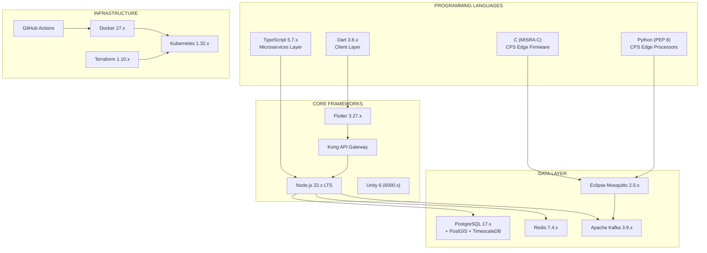

## 3.1 PROGRAMMING LANGUAGES

The platform employs four programming languages, each selected for a specific architectural layer based on type safety requirements, runtime performance characteristics, and ecosystem maturity. No language is used across more than one layer boundary, enforcing clear separation of concerns.

### 3.1.1 Language Selection by Platform

| Language | Version | Platform / Component | Runtime Environment | Primary Purpose |
|---|---|---|---|---|
| **Dart** | 3.6.x | Client Layer — Flutter SuperApp Shell | Flutter Engine (Skia/Impeller) | Cross-platform UI (iOS, Android, Web/PWA), XR-lite overlays, map-based route visualisation |
| **TypeScript** | 5.7.x (strict mode) | Microservices Layer — Backend API Services | Node.js 22.x LTS | Type-safe business logic for route algorithms, scheduling engine, CPS dashboard, and all API controllers |
| **C** | N/A (MISRA C guidelines) | CPS Edge Layer — Embedded Firmware | ARM-based lamppost hardware (bare-metal / RTOS) | IR sensor handling, MQTT telemetry publishing, solar battery monitoring on resource-constrained edge devices |
| **Python** | N/A (PEP 8 + ruff) | CPS Edge Layer — Edge Processors | Python interpreter on edge compute nodes | Video analytics motion detection, occupancy counting on CPS nodes |
| **JavaScript / HTML / CSS** | ES2022+ / HTML5 / CSS3 | PWA Deployment | Browser (via Flutter web build + Service Workers) | Progressive Web App shell, offline caching, service worker lifecycle management |

### 3.1.2 Selection Criteria and Justification

#### Dart 3.6.x — Client Layer

Dart is the native language for the Flutter framework and provides the single-codebase capability that enables simultaneous deployment to iOS, Android, and Web/PWA from a unified source tree (`src/client/`). Key selection factors include sound null safety (enforced since Dart 2.12), ahead-of-time (AOT) compilation for production builds delivering near-native performance, and tight integration with Flutter's custom rendering engine (Skia for rasterisation, Impeller for next-generation GPU composition). The language's strong type system supports the complex state management required for real-time CPS telemetry visualisation and XR overlay rendering at the ≥30 FPS target defined in Section 1.3.3.

#### TypeScript 5.7.x — Microservices Layer

TypeScript in strict mode (`strict: true` in per-service `tsconfig.json`) provides enterprise-grade type safety for the backend domain services. The `no implicit any` policy ensures that the route planning algorithms, scheduling logic, CPS telemetry processing, and API request/response contracts are fully typed at compile time. TypeScript's structural type system and union type support align with the complex data models required for multi-criteria route cost functions (integrating lighting scores, weather conditions, incident risk markers, and charging station availability). The Node.js 22.x LTS runtime provides the event-driven, non-blocking I/O model essential for handling concurrent CPS telemetry streams via Kafka consumers and WebSocket push connections.

#### C (MISRA C) — CPS Edge Firmware

C is required for the embedded firmware components (`src/cps/firmware/`) that run on ARM-based lamppost hardware with limited RAM and processing capacity. The MISRA C coding guidelines ensure safety-critical reliability for the solar-powered CPS sensor nodes that operate continuously in outdoor environments. Three firmware modules — `ir_sensor_handler.c`, `mqtt_publisher.c`, and `solar_battery_monitor.c` — manage sensor trigger logic, telemetry publishing to the MQTT broker, and power management respectively. C's minimal runtime overhead and deterministic memory management are essential for edge devices where power consumption directly impacts the solar battery lifecycle.

#### Python (PEP 8 + ruff) — CPS Edge Processors

Python is deployed for edge processing scripts (`src/cps/edge-processor/`) that perform video analytics motion detection (`motion_detector.py`) and occupancy counting (`occupancy_counter.py`). These processors require rapid prototyping capability and access to computer vision libraries while running on moderately resourced edge compute nodes. The ruff linter enforces PEP 8 compliance. Critically, no facial recognition is implemented in any Python processor — only aggregate motion detection and occupancy estimation, in compliance with Constraint C-003 and the UK Surveillance Camera Code of Practice.

### 3.1.3 Language Constraints and Dependencies

| Constraint | Language | Impact | Mitigation |
|---|---|---|---|
| Dart AOT compilation required for production Flutter builds | Dart 3.6.x | Increases build time; restricts dynamic code loading | Multi-stage Docker builds for backend; Fastlane for mobile distribution |
| TypeScript strict mode (`noImplicitAny`, `strictNullChecks`) | TypeScript 5.7.x | All interfaces and API contracts must be explicitly typed | Zod runtime validation at service boundaries; freezed code generation for Dart models |
| MISRA C compliance for embedded firmware | C | Restricts use of dynamic memory allocation, recursion, and certain pointer operations | Static analysis tooling in CI pipeline; pre-allocated memory buffers |
| No advanced ML model training (Constraint C-007) | Python | Edge processors limited to rule-based detection algorithms | OpenCV-based motion detection; threshold-based occupancy counting |
| Flutter web build generates JavaScript | Dart → JS | PWA performance dependent on Dart-to-JS compilation quality | Service Worker caching optimises repeat loads; offline-first architecture reduces network dependency |

---

## 3.2 FRAMEWORKS AND LIBRARIES

### 3.2.1 Core Frameworks

The platform is built upon four core frameworks, each serving a distinct architectural layer. Together, they implement the layered SuperApp meta-ecosystem pattern with event-driven microservices described in Section 1.3.2.

#### Flutter 3.27.x — Cross-Platform SuperApp Shell

| Attribute | Detail |
|---|---|
| **Version** | 3.27.x |
| **Scope** | Client Layer — iOS, Android, Web/PWA |
| **Source** | `src/client/` (pubspec.yaml, lib/, android/, ios/, web/) |
| **Rendering Engine** | Skia (rasterisation) / Impeller (next-gen GPU composition) |

Flutter serves as the unified client framework, delivering native-quality user interfaces across iOS, Android, and Web/PWA from a single Dart codebase. The framework's custom rendering engine bypasses platform-native UI widgets entirely, enabling pixel-perfect consistency for the XR-lite map overlays, CPS telemetry dashboards, and multilingual community directory interfaces. The micro-frontend SuperApp module pattern (`src/client/lib/modules/`) enables independent development and deployment of feature modules (route planning, XR guide, incidents, community, errands, CPS dashboard) within the shared shell. Flutter's widget system replaces traditional CSS frameworks — no TailwindCSS or equivalent is required.

**Justification:** Flutter's single-codebase deployment to three platforms (iOS, Android, Web) directly addresses the budget constraint C-001 by eliminating the need for separate native development teams. The Skia/Impeller rendering pipeline delivers the ≥30 FPS XR overlay performance required by KPI SO-5 on mid-range devices manufactured within the last three years.

## Node.js 22.x LTS — Backend API Runtime

| Attribute | Detail |
|---|---|
| **Version** | 22.x LTS (Long-Term Support) |
| **Scope** | Microservices Layer — All backend API services |
| **Source** | `src/server/services/*/` (8 microservices, each with own package.json) |
| **Architecture** | Event-driven, non-blocking I/O |

Node.js 22.x LTS provides the runtime environment for all eight backend microservices. The event-driven architecture is specifically selected for handling concurrent CPS telemetry streams — Kafka consumers, MQTT bridge processing, and WebSocket push connections require efficient asynchronous I/O without thread-per-connection overhead. The LTS designation ensures long-term stability appropriate for council infrastructure, with security patches guaranteed through the Node.js release schedule.

**Justification:** Node.js replaces the default Python/Flask stack because the event-driven model is architecturally aligned with the real-time CPS telemetry pipeline (MQTT → Kafka → WebSocket). TypeScript strict mode on Node.js provides the enterprise type safety required for route planning algorithms and scheduling logic that Python's dynamic typing cannot guarantee at compile time.

#### Unity 6 (6000.x) — XR Rendering Engine

| Attribute | Detail |
|---|---|
| **Version** | 6000.x |
| **Scope** | Client Layer — AR/MR features (F-002: XR Tour e-Guide) |
| **Source** | `src/client/lib/unity_bridge/` |
| **AR SDK** | AR Foundation (abstracts ARCore + ARKit) |

Unity 6 provides the most mature XR rendering pipeline for mobile AR, delivering heritage information overlays, wildlife guides, and directional markers along the 8 stages of Hillingdon Trail Walk 2. AR Foundation abstracts the underlying platform differences between ARCore (Android) and ARKit (iOS), enabling a single XR implementation across both mobile platforms. Unity 6 is embedded within the Flutter SuperApp shell via platform channel bridges, allowing seamless transition between standard Flutter UI and immersive AR experiences.

**Justification:** Unity 6 is the industry standard for mobile AR rendering with the widest device compatibility. The AR Foundation abstraction layer eliminates the need for separate ARCore and ARKit implementations, aligning with the single-codebase principle.

#### Kong — API Gateway

| Attribute | Detail |
|---|---|
| **Version** | Latest stable release |
| **Scope** | API Gateway Layer — routing, security, rate limiting |
| **Source** | `src/server/gateway/` |
| **Capabilities** | OAuth 2.0/OIDC enforcement, rate limiting (3 tiers), circuit breaking, DDoS protection |

Kong serves as the centralised API Gateway through which all client requests are routed to backend microservices. It enforces OAuth 2.0/OIDC authentication, implements three-tier rate limiting (Public: 100 req/min per IP; Authenticated: 300 req/min per user; Route calculation: 20 req/min per user), provides circuit-breaking for external API fault tolerance, and offers DDoS protection across all endpoints. Kong also serves as the routing layer for the dedicated GraphQL endpoint used for flexible amenity and community partner queries.

**Justification:** Kong replaces Auth0 from the default stack, providing self-hosted authentication at zero licensing cost — essential for the £10–£65 budget constraint (C-001). As an open-source API gateway (Apache 2.0 licence), Kong delivers enterprise-grade gateway capabilities without proprietary dependencies.

### 3.2.2 Supporting Libraries and Tools

The following supporting libraries are used across the client and server layers, as documented in `README.md` (lines 1401–1449).

#### Client-Side Libraries (Flutter / Dart)

| Library | Purpose | Scope |
|---|---|---|
| **Riverpod** | Reactive state management with compile-time safety | All Flutter feature modules; manages CPS telemetry state, route data, UI state |
| **freezed** | Immutable data model code generation with union types and pattern matching | All Dart data models; ensures immutability of route segments, telemetry events, and API response objects |
| **Mapbox SDK for Flutter** | Custom-styled canal corridor maps with vector tiles and offline tile support | Route visualisation (F-001), POI mapping (F-002, F-005), charging station locations (F-010) |
| **flutter_lints** | Dart code style enforcement aligned with Flutter team conventions | All client-side code in `src/client/` |

#### Server-Side Libraries (Node.js / TypeScript)

| Library | Purpose | Scope |
|---|---|---|
| **Zod** | Runtime request/response schema validation with TypeScript type inference | All API controller input validation; ensures runtime safety at service boundaries beyond compile-time checks |
| **Pino** | Structured JSON logging with automatic correlation ID propagation | All microservices; enables distributed tracing across the service mesh via unique request correlation IDs |
| **@typescript-eslint/recommended** | TypeScript-aware linting with strict rule enforcement | All backend service code in `src/server/services/` |
| **Prettier** | Opinionated code formatting for consistent style | All TypeScript/JavaScript files in the server layer |
| **Mapbox GL JS** | Web-based map rendering with vector tiles for admin dashboard | Web Admin Dashboard (`src/client/web/`) |

#### CPS Edge Libraries

| Library / Tool | Purpose | Scope |
|---|---|---|
| **ruff** | Python linting and formatting (PEP 8 enforcement) | All edge processor scripts in `src/cps/edge-processor/` |

### 3.2.3 Compatibility Requirements

The following cross-framework compatibility requirements govern integration between the core frameworks.

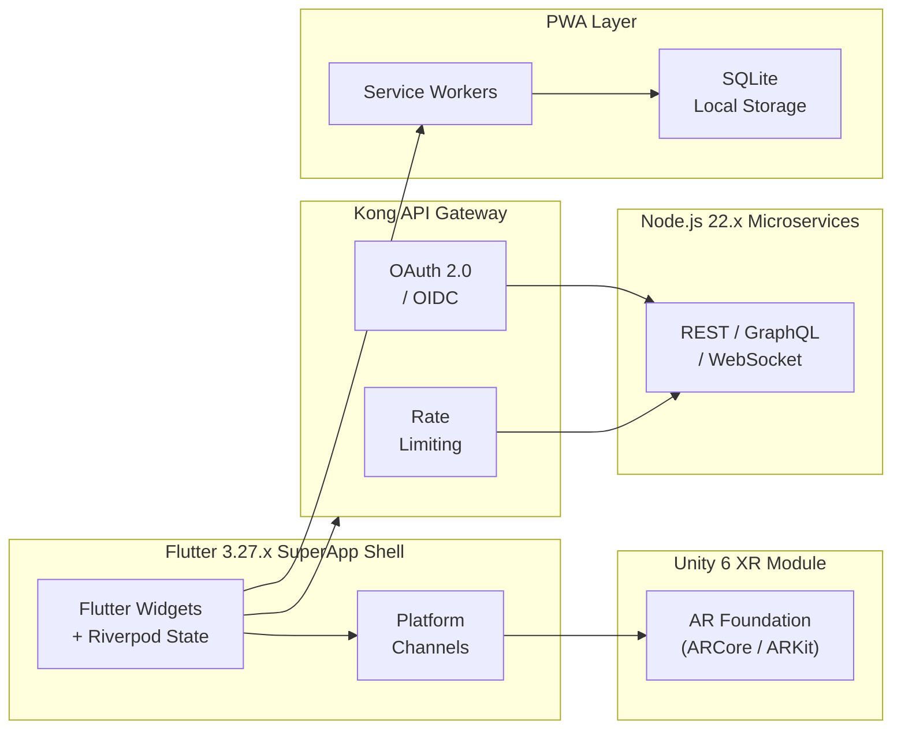

| Compatibility Requirement | Source | Target | Mechanism |
|---|---|---|---|
| Unity 6 XR module must communicate with Flutter shell | Flutter 3.27.x | Unity 6 (6000.x) | Platform channel bridge (`src/client/lib/unity_bridge/`) |
| ARCore and ARKit platform differences must be abstracted | Unity 6 | Android / iOS native AR layers | AR Foundation SDK within Unity |
| Flutter web builds must support PWA Service Worker lifecycle | Flutter 3.27.x (web target) | Browser PWA runtime | Service Worker registration in `src/client/web/` |
| Flutter client targets mid-range devices from the last 3 years | Flutter 3.27.x | ARCore/ARKit-capable devices | Device capability detection; 2D Mapbox fallback for non-AR devices |
| All microservices must expose OpenAPI 3.1 compliant contracts | Node.js 22.x / TypeScript 5.7.x | Kong API Gateway | OpenAPI 3.1 specification with Swagger UI (`docs/api/`) |
| Zod schemas must align with Dart freezed data models | TypeScript 5.7.x | Dart 3.6.x | Shared type definitions in `src/server/shared/types/` mirrored in `src/client/lib/core/` |

---

## 3.3 OPEN SOURCE DEPENDENCIES

### 3.3.1 Open-Source Mandate

Constraint C-001 (Section 2.8.2) establishes that all technologies must be open-source to remain within the MVP budget of £10–£65. This constraint drives every technology selection documented in this section and is the primary reason for multiple deviations from the default stack (see Section 3.7). The entire platform — from client framework to database engine to CPS Edge messaging — operates without proprietary licensing fees.

### 3.3.2 Dependency Inventory

The following table enumerates all primary open-source dependencies with their versions, licence types, and source registries.

#### Runtime Dependencies

| Technology | Version | Licence | Registry / Source | Layer |
|---|---|---|---|---|
| Flutter | 3.27.x | BSD-3-Clause | flutter.dev | Client |
| Dart | 3.6.x | BSD-3-Clause | dart.dev | Client |
| Node.js | 22.x LTS | MIT | nodejs.org | Microservices |
| TypeScript | 5.7.x | Apache 2.0 | npm (npmjs.com) | Microservices |
| PostgreSQL | 17.x | PostgreSQL License (BSD-like) | postgresql.org | Data |
| PostGIS | (extension for PostgreSQL 17) | GPL-2.0 | postgis.net | Data |
| TimescaleDB | (extension for PostgreSQL 17) | Apache 2.0 / Timescale License | timescale.com | Data |
| Redis | 7.4.x | BSD-3-Clause / SSPL | redis.io | Data |
| Apache Kafka | 3.9.x | Apache 2.0 | kafka.apache.org | Data / Streaming |
| Eclipse Mosquitto | 2.0.x | EPL / EDL | mosquitto.org | CPS Edge |
| Kong | Latest stable | Apache 2.0 | konghq.com | API Gateway |
| Unity 6 | 6000.x | Unity License (proprietary, free tier available) | unity.com | Client / XR |

> **Note on Unity 6 Licensing:** Unity 6 operates under the Unity License rather than a traditional open-source licence. The free Personal tier is used for the MVP, which permits use for entities with revenue below the Unity threshold. This is the sole exception to the fully open-source mandate, justified by the absence of any comparable open-source mobile AR rendering engine with AR Foundation's cross-platform abstraction capability.

#### Infrastructure Dependencies

| Technology | Version | Licence | Registry / Source | Purpose |
|---|---|---|---|---|
| Docker | 27.x | Apache 2.0 | docker.com | Containerisation |
| Kubernetes | 1.32.x | Apache 2.0 | kubernetes.io | Container orchestration |
| Terraform | 1.10.x | MPL-2.0 / BSL 1.1 | terraform.io | Infrastructure as Code |
| Helm | (compatible with K8s 1.32.x) | Apache 2.0 | helm.sh | Kubernetes package management |

### 3.3.3 Package Registries and Version Management

Each platform layer maintains dependencies through its dedicated package registry, with version pinning enforced across all environments.

| Layer | Package Registry | Manifest File | Lock File |
|---|---|---|---|
| **Client (Flutter/Dart)** | pub.dev | `src/client/pubspec.yaml` | `src/client/pubspec.lock` |
| **Microservices (Node.js/TypeScript)** | npm (npmjs.com) | `src/server/services/*/package.json` | `src/server/services/*/package-lock.json` |
| **CPS Edge (Python)** | pip (PyPI) | `src/cps/edge-processor/requirements.txt` | N/A (pinned versions in requirements.txt) |

Dependency vulnerability scanning is automated via GitHub Dependabot and Snyk within the CI pipeline (see Section 3.6.4), ensuring that all open-source dependencies are continuously monitored for known security vulnerabilities.

---

## 3.4 THIRD-PARTY SERVICES

### 3.4.1 External Data APIs

The platform integrates with seven external REST APIs to enrich the canal corridor experience with real-time environmental, transit, safety, and infrastructure data. All selected APIs provide free-tier access sufficient for the MVP, satisfying Assumption A-003 (Section 2.8.1).

| Service | Purpose | Protocol | Data Format | Cost | Consuming Features |
|---|---|---|---|---|---|
| **Met Office DataPoint API** | Real-time weather alerts and conditions for towpath safety | REST / HTTPS | JSON | Free (public sector) | F-001 (Route Planning), F-003 (Weather Alerting), F-007 (Booking safety conditions) |
| **Mapbox Directions API** | Base route calculations, vector map tiles, offline tile support | REST / HTTPS | GeoJSON | Free tier (50,000 loads/month) | F-001 (Route Planning), F-002 (XR Guide), F-013 (PWA maps) |
| **TfL Unified API** | Live transit data for Hayes & Harlington station integration | REST / HTTPS | JSON | Free | F-001 (Route Planning — multi-modal transit context) |
| **Canal & River Trust Open Data** | Canal condition updates, stoppage notices, waterway status | REST / HTTPS | JSON / XML | Free | F-005 (Amenities), F-001 (Route Planning — obstruction data) |
| **Hillingdon Council Open Data** | Amenity listings, planning information, council events, community data | REST / HTTPS | JSON | Free | F-004 (Community Directory), F-005 (Amenities) |
| **UK Police Data API** | Crime statistics for route risk scoring by geographic area | REST / HTTPS | JSON | Free | F-001 (Route Planning — risk marker generation) |
| **OpenCharge Map API** | EV and e-bike charging point locations and availability near canal corridor | REST / HTTPS | JSON | Free | F-010 (E-Bike Charging Stations) |

#### External API Resilience Strategy

External API reliability is identified as a medium-likelihood, medium-impact risk in the Risk Analysis (Section 1.1.1). The mitigation strategy employs:

- **Redis 7.4 caching** with configurable TTL for all external API responses (weather data, charging data, transit data)
- **Kong Gateway circuit-breaker patterns** for graceful degradation to cached data when external services are unavailable
- **Rate limit awareness** in API client implementations to remain within free-tier quotas

### 3.4.2 Authentication Services

The platform implements self-hosted authentication rather than a third-party authentication provider. This is a deliberate deviation from the default Auth0 recommendation, driven by the open-source budget constraint (C-001).

| Component | Technology | Scope |
|---|---|---|
| **Authentication Protocol** | OAuth 2.0 / OpenID Connect (OIDC) | All authenticated API endpoints |
| **Token Format** | JWT (JSON Web Token) with short expiry + refresh token rotation | All services; validated at Kong Gateway |
| **Authentication Enforcement** | Kong API Gateway (built-in OAuth 2.0/OIDC plugin) | Gateway-level enforcement before microservice routing |
| **Session/Token Caching** | Redis 7.4.x | Stateless authentication with Redis-backed session store |
| **User Data Storage** | PostgreSQL 17.x (USER entity) | Credential and role persistence |

**Role-Based Access Control (RBAC):**

| Role | Access Level | Security Requirements |
|---|---|---|
| **resident** | Personalised features (itineraries, preferences, bookings) | Standard OAuth 2.0 authentication |
| **visitor** | Anonymous access to public features (route planning, amenity lookup, community directory) | No authentication required |
| **field_worker** | CPS dashboard, telemetry streams, incident management | OAuth 2.0 + Multi-Factor Authentication (MFA) |
| **admin** | Full platform access, configuration management, audit functions | OAuth 2.0 + MFA + IP allowlisting + audit logging |

### 3.4.3 Monitoring and Security Tools

| Tool | Purpose | Integration Point | Cost |
|---|---|---|---|
| **GitHub Dependabot** | Automated dependency vulnerability scanning and PR generation | GitHub repository; runs on all branches | Free (included with GitHub) |
| **Snyk** | Security vulnerability scanning for open-source dependencies | CI pipeline (`security-scan.yml` GitHub Actions workflow) | Free tier |
| **Let's Encrypt** | Automated SSL/TLS certificate provisioning and renewal | All HTTPS endpoints; Kong API Gateway termination | Free |
| **Pino Logger** | Structured JSON logging with correlation ID propagation | All Node.js microservices; enables distributed tracing | Free (open-source) |

### 3.4.4 Cloud and Infrastructure Services

The platform is designed to be cloud-agnostic, deploying via Terraform Infrastructure as Code and Kubernetes orchestration. This departs from the default AWS recommendation due to the budget constraint.

| Service | Technology | MVP Strategy | Production Strategy |
|---|---|---|---|
| **Container Orchestration** | Kubernetes 1.32.x | Local Docker Compose for development | Managed K8s cluster (GKE free tier or equivalent) |
| **Infrastructure Provisioning** | Terraform 1.10.x | Local state; Docker Compose target | Cloud provider modules (networking, database, k8s, monitoring) |
| **SSL/TLS** | Let's Encrypt | Automated certificate management | Automated renewal via cert-manager on K8s |
| **DNS** | Custom domain | Single domain with Let's Encrypt SSL (£10–£15) | Production DNS with CDN integration |

---

## 3.5 DATABASES AND STORAGE

The data persistence strategy employs a polyglot storage architecture optimised for the platform's distinct data access patterns: spatial queries for route planning, time-series ingestion for CPS telemetry, low-latency caching for real-time features, durable event streaming for telemetry pipelines, and offline-first client storage for towpath connectivity gaps.

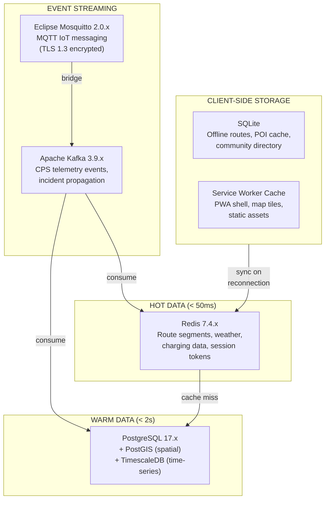

### 3.5.1 Primary Database — PostgreSQL 17.x with PostGIS

| Attribute | Detail |
|---|---|
| **Version** | 17.x |
| **Extensions** | PostGIS (spatial), TimescaleDB (time-series) |
| **Coordinate System** | WGS84 (EPSG:4326) |
| **Geographic Bounds** | Hayes corridor: lat 51.49–51.52, lon −0.37 to −0.42 |
| **Index Strategy** | GiST spatial indices on all geometry columns; full-text search indices on `community_partner.name` and amenity name fields |
| **Source** | `src/server/shared/database/` (migrations, seeds) |

PostgreSQL 17 with the PostGIS extension serves as the primary relational database for all persistent data. PostGIS provides the spatial query capabilities essential for multi-modal route planning (modified A* pathfinding across a spatial graph), proximity-based amenity search, geofenced incident correlation, and e-bike charging station location queries. All spatial columns use the WGS84 coordinate system (EPSG:4326) with GiST indices for sub-second spatial query performance.

**Justification:** PostgreSQL with PostGIS replaces MongoDB from the default stack because spatial queries are a foundational requirement — the route planning engine (F-001) executes PostGIS spatial graph queries for every route calculation. MongoDB's geospatial capabilities are insufficient for the complex spatial graph traversal required by the modified A* algorithm. Additionally, PostgreSQL's ACID compliance is essential for a GovTech platform handling booking transactions (F-007), incident reports (F-011), and user authentication data (F-014) in a council-facing context.

**Key Data Entities Stored:**
- Route segments and spatial graph (ROUTE_SEGMENT with geometry columns)
- Amenity and community partner records (AMENITY, COMMUNITY_PARTNER with PostGIS locations)
- CPS asset records (LAMPPOST, CHARGING_STATION, BIOLUMINESCENT_SENSOR)
- User accounts and preferences (USER, USER_PREFERENCE)
- Incident reports with geolocation (INCIDENT_REPORT with PostGIS coordinates)
- Booking records (BOOKING for rowing/canoe sessions)
- Risk markers (RISK_MARKER with severity scores normalised 0.0–1.0)
- XR points of interest (XR_MARKER with spatial coordinates)

### 3.5.2 Time-Series Storage — TimescaleDB

| Attribute | Detail |
|---|---|
| **Type** | PostgreSQL extension (hypertable) |
| **Table** | `telemetry_events` |
| **Optimisation** | Time-series partitioned storage for CPS telemetry data |
| **Retention** | 30-day query performance for historical telemetry |

TimescaleDB operates as a PostgreSQL extension, converting the `telemetry_events` table into a hypertable with automatic time-based partitioning. This optimisation is specifically designed for the high-volume CPS telemetry ingestion pattern: solar CCTV-lamppost nodes, e-bike charging stations, bioluminescent paint sensors, and rowing/canoe booking terminals all generate continuous telemetry events that flow through the Kafka pipeline into this hypertable.

**Justification:** Standard PostgreSQL table performance degrades with high-volume time-series inserts. TimescaleDB's automatic partitioning maintains consistent write throughput as telemetry volume scales with CPS Edge node expansion, while providing acceptable 30-day historical query performance for the CPS Dashboard (F-008).

### 3.5.3 Caching Layer — Redis 7.4.x

| Attribute | Detail |
|---|---|
| **Version** | 7.4.x |
| **Licence** | BSD-3-Clause / SSPL |
| **Primary Role** | In-memory cache with configurable TTL |
| **Secondary Role** | Pub/sub for real-time incident alert propagation |

Redis 7.4 serves a dual-purpose role in the architecture:

1. **Caching:** Route segments, weather data (from Met Office DataPoint), charging station availability (from OpenCharge Map), and session tokens are cached with configurable TTL to reduce database load and external API call frequency. This caching layer is critical for achieving the <2-second route calculation target (Section 1.3.3) and for the external API resilience strategy (Section 3.4.1).

2. **Pub/Sub:** Redis pub/sub channels propagate real-time incident alerts (F-011) to connected WebSocket clients, enabling immediate notification to field workers when new incidents are reported.

**Consuming Features:** F-001 (cached route segments), F-003 (cached weather data), F-008 (CPS telemetry cache), F-010 (charging station cache), F-014 (session/token caching).

### 3.5.4 Event Streaming — Apache Kafka 3.9.x

| Attribute | Detail |
|---|---|
| **Version** | 3.9.x |
| **Licence** | Apache 2.0 |
| **Architecture Pattern** | Partitioned commit log with consumer groups |
| **Durability** | Guaranteed delivery with replay capability |

Apache Kafka 3.9 provides the durable event streaming backbone for all CPS telemetry data and asynchronous event propagation. The partitioned log model ensures no telemetry data loss even during service restarts, and replay capability enables re-processing of historical telemetry for analytics.

**Telemetry Event Types:**
- IR sensor triggers from smart lampposts (F-008)
- Solar battery/charge levels from lamppost nodes (F-008)
- CCTV operational status from lamppost nodes (F-008)
- Motion detection events from edge processors (F-008)
- Bioluminescent paint luminosity levels (F-009)
- E-bike charging station occupancy and charge status (F-010)
- Rowing/canoe booking terminal session data (F-007)
- Incident report events for asynchronous propagation (F-011)

**Justification:** Kafka's durable, partitioned event log is essential for the CPS telemetry pipeline where data loss is unacceptable — missed lamppost battery alerts or charging station faults could create infrastructure blind spots. The consumer group model enables multiple microservices (CPS Dashboard, Route Planning, Incident Correlation) to independently consume the same telemetry stream.

### 3.5.5 MQTT Broker — Eclipse Mosquitto 2.0.x

| Attribute | Detail |
|---|---|
| **Version** | 2.0.x |
| **Licence** | EPL / EDL |
| **Encryption** | TLS 1.3 mandatory (all CPS communication) |
| **Topic Structure** | `corridor/lamppost/{id}/telemetry` (upstream), `corridor/lamppost/{id}/command` (downstream) |

Eclipse Mosquitto 2.0 serves as the MQTT broker for all CPS Edge device communication. The lightweight MQTT protocol is specifically designed for resource-constrained IoT devices operating on limited bandwidth and power — characteristics of the solar-powered lamppost nodes and canalside booking terminals. All MQTT communication is encrypted with TLS 1.3 as mandated by the security architecture (Section 2.4.3).

**CPS Edge Node Types Connected:**

| Node Type | Telemetry Published | Features Served |
|---|---|---|
| Solar CCTV-Lamppost Nodes | IR triggers, battery levels, solar charge, CCTV status, motion detection | F-008, F-001 |
| E-Bike Charging Stations | Occupancy, charge status, fault alerts | F-010, F-001 |
| Bioluminescent Paint Sensors | Luminosity levels, ambient light conditions, lane visibility status | F-009, F-001 |
| Rowing/Canoe Booking Terminals | Session booking telemetry, terminal status | F-007 |

### 3.5.6 Client-Side Storage

| Technology | Platform | Purpose | Data Stored |
|---|---|---|---|
| **SQLite** | Flutter app (iOS, Android) | Local offline database | Cached routes, POI data, community directory entries, user preferences |
| **SQLite** | PWA (via browser API) | Offline data persistence | Same as Flutter app, synchronised on reconnection |
| **Service Workers** | PWA (browser) | Application shell caching and asset management | PWA shell, map tiles (pre-downloadable), static assets, cached API responses |

Client-side storage implements the offline-first architecture that mitigates the high-likelihood, high-impact risk of towpath connectivity gaps identified in Section 1.1.1. Core functionality — route planning with cached segments, community directory browsing, and amenity information lookup — persists through cellular connectivity gaps along the canal towpath, with data retrieval from local storage achieving the <200ms KPI target.

### 3.5.7 Data Persistence Strategy Summary

| Data Temperature | Technology | Access Pattern | TTL / Retention | Use Cases |
|---|---|---|---|---|
| **Hot** | Redis 7.4.x | Sub-millisecond key-value lookup | Configurable TTL per data type | Route segment cache, weather cache, session tokens, charging data |
| **Warm** | PostgreSQL 17.x + PostGIS | Indexed relational + spatial queries | Permanent (with archival policy) | All relational data, spatial graphs, user records, bookings |
| **Time-Series** | TimescaleDB (hypertable) | Time-range partitioned queries | 30-day query performance window | CPS telemetry events (all sensor types) |
| **Streaming** | Apache Kafka 3.9.x | Partitioned consumer groups | Configurable retention (7+ days) | CPS telemetry stream, incident event propagation |
| **Edge** | MQTT (Mosquitto 2.0.x) | Lightweight pub/sub | Transient (bridge to Kafka) | CPS device telemetry ingestion, command dispatch |
| **Offline** | SQLite + Service Workers | Local file-based queries | Until sync | Cached routes, POI, community directory, map tiles |

---

## 3.6 DEVELOPMENT AND DEPLOYMENT

### 3.6.1 Development Tools

| Tool | Version / Specification | Purpose |
|---|---|---|
| **VS Code** | Latest stable | Primary IDE with Flutter/Dart extensions, TypeScript language server, Docker extension |
| **Android Studio** | Latest stable | XR/AR debugging for Unity 6 integration; Android emulator for CPS dashboard testing |
| **OpenAPI 3.1** | 3.1 specification | API contract definition with Swagger UI for interactive documentation (`docs/api/`) |
| **Mapbox Studio** | N/A (web-based) | Custom map style authoring for canal corridor vector tiles |
| **Docker Desktop** | Compatible with Docker 27.x | Local container development and Docker Compose orchestration |

### 3.6.2 Build System

The build system spans three distinct compilation pipelines corresponding to the platform's language layers.

| Pipeline | Source Language | Build Tool | Output | Optimisation |
|---|---|---|---|---|
| **Flutter Client** | Dart 3.6.x | Flutter CLI (`flutter build`) | AOT-compiled iOS/Android binaries; JavaScript bundle (web) | Tree shaking, AOT compilation, Impeller GPU rendering |
| **Backend Services** | TypeScript 5.7.x | TypeScript compiler (`tsc`) | JavaScript (Node.js 22.x runtime) | Strict mode compilation (`strict: true`); per-service `tsconfig.json` |
| **CPS Firmware** | C (MISRA C) | ARM cross-compiler toolchain | ARM binary firmware images | MISRA C static analysis; minimal runtime overhead |
| **CPS Edge Processors** | Python (PEP 8) | pip (dependency installation) | Python scripts with dependencies | ruff linting; requirements.txt version pinning |
| **Docker Images** | Dockerfile per service | Docker 27.x multi-stage builds | Minimal production container images | Multi-stage builds; layer caching; alpine base images |

### 3.6.3 Containerisation

#### Docker 27.x — Container Runtime

All backend microservices are containerised with individual Dockerfiles, enabling independent deployment and scaling. Multi-stage Docker builds separate the TypeScript compilation stage from the production Node.js runtime stage, producing minimal container images.

**Containerised Services (8 microservices):**
- Route Planning Service (`src/server/services/route-planning/Dockerfile`)
- CPS Dashboard Service (`src/server/services/cps/Dockerfile`)
- Amenities Service (`src/server/services/amenities/Dockerfile`)
- Community Service (`src/server/services/community/Dockerfile`)
- Incident Reporting Service (`src/server/services/incidents/Dockerfile`)
- Weather Alerting Service (`src/server/services/weather/Dockerfile`)
- AI Scheduler Service (`src/server/services/scheduler/Dockerfile`)
- Document Generator Service (`src/server/services/doc-generator/Dockerfile`)

#### Docker Compose — Local Development Orchestration

Docker Compose (`docker-compose.yml` at repository root) orchestrates the complete local development environment, including all microservices, PostgreSQL 17 with PostGIS and TimescaleDB, Redis 7.4, Apache Kafka 3.9, and Eclipse Mosquitto 2.0. Environment-specific overrides are provided via `docker-compose.dev.yml`.

#### Kubernetes 1.32.x — Production Orchestration

| Attribute | Detail |
|---|---|
| **Version** | 1.32.x |
| **Package Manager** | Helm Charts (`infrastructure/helm/`) |
| **Scaling** | Horizontal pod autoscaling for stateless microservices |
| **Service Mesh** | Kong API Gateway as ingress controller |

Kubernetes provides container orchestration for staging and production environments, supporting horizontal scaling of stateless microservices behind the Kong API Gateway. Helm Charts are organised into four deployment packages:

| Helm Chart | Services | Purpose |
|---|---|---|
| `superapp-gateway` | Kong API Gateway, OAuth 2.0/OIDC service | Ingress, authentication, rate limiting |
| `route-planning` | Route Planning, Weather Alerting | Navigation domain services |
| `cps-service` | CPS Dashboard, Incident Reporting | Safety and infrastructure domain services |
| `shared-infra` | PostgreSQL, Redis, Kafka, Mosquitto | Data layer infrastructure |

### 3.6.4 CI/CD Pipeline

The continuous integration and deployment pipeline is implemented via GitHub Actions with four dedicated workflows stored in `.github/workflows/`.

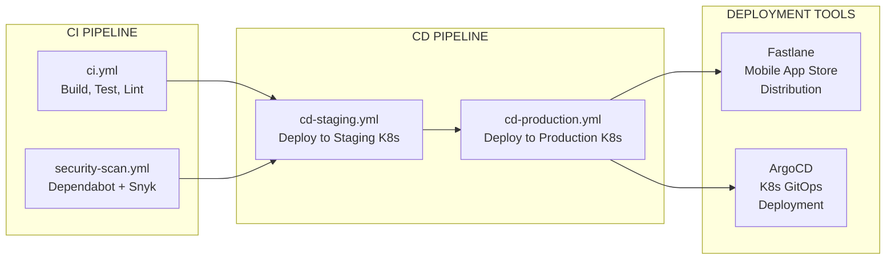

| Workflow | Trigger | Actions | Quality Gates |
|---|---|---|---|
| **`ci.yml`** | Push to any branch; PR to main | Build all services; run Flutter tests, Jest tests, Cypress E2E; lint (flutter_lints, @typescript-eslint, ruff) | ≥90% core logic coverage; ≥80% API controller coverage; ≥70% widget coverage; zero lint errors |
| **`security-scan.yml`** | Scheduled + PR trigger | GitHub Dependabot scan; Snyk vulnerability analysis | No critical/high vulnerabilities in production dependencies |
| **`cd-staging.yml`** | Merge to staging branch | Docker image build + push; Helm upgrade to staging K8s cluster | All CI checks passed; staging smoke tests |
| **`cd-production.yml`** | Merge to main (with approval) | Docker image build + push; Helm upgrade to production K8s cluster | All staging tests passed; manual approval gate |

**Additional Deployment Tools:**

| Tool | Purpose | Target |
|---|---|---|
| **Fastlane** | Automated mobile app store distribution (iOS App Store, Google Play) | Flutter iOS/Android builds |
| **ArgoCD** | GitOps-based Kubernetes deployment management with declarative configuration | Staging and production K8s clusters |

### 3.6.5 Infrastructure as Code — Terraform 1.10.x

| Attribute | Detail |
|---|---|
| **Version** | 1.10.x |
| **Licence** | MPL-2.0 / BSL 1.1 |
| **Source** | `infrastructure/terraform/` |
| **State** | Local state for MVP; remote state backend for production |

Terraform provisions all cloud infrastructure through declarative configuration, ensuring reproducible environments across development, staging, and production.

**Terraform Module Structure:**

| Module | Purpose | Resources Managed |
|---|---|---|
| `infrastructure/terraform/modules/networking/` | Network infrastructure | VPC, subnets, security groups, load balancers |
| `infrastructure/terraform/modules/database/` | Data layer provisioning | Managed PostgreSQL, Redis instances |
| `infrastructure/terraform/modules/kubernetes/` | K8s cluster configuration | Cluster provisioning, node pools, RBAC |
| `infrastructure/terraform/modules/monitoring/` | Observability infrastructure | Logging, alerting, health check endpoints |

**Environment Configuration:**

| Environment | Variables File | Target Infrastructure |
|---|---|---|
| Development | `.env.development` + `docker-compose.dev.yml` | Local Docker Compose |
| Staging | `.env.staging` + `staging.tfvars` | Staging K8s cluster |
| Production | `.env.production` + `production.tfvars` | Production K8s cluster |
| Template | `.env.example` | All required variables (no values committed) |

### 3.6.6 Testing Frameworks

| Framework | Language | Scope | Coverage Target |
|---|---|---|---|
| **Flutter Test** | Dart | Widget unit testing for all client-side modules | ≥70% widget coverage |
| **Flutter Integration Test** | Dart | End-to-end client-side integration testing | Key user workflows |
| **Jest** | TypeScript | Node.js microservice unit and integration testing | ≥90% core logic; ≥80% API controllers |
| **Cypress** | JavaScript | Web admin dashboard end-to-end testing | Critical admin workflows |

---

## 3.7 KEY DEVIATIONS FROM DEFAULT STACK

The following table documents every deviation from the suggested default technology stack, with evidence-based justification grounded in the project's architectural requirements, budget constraints, and performance targets.

| Default Component | Actual Selection | Strategic Justification |
|---|---|---|
| **Python / Flask** (backend) | **Node.js 22.x LTS / TypeScript 5.7.x** | Event-driven I/O model handles concurrent CPS telemetry streams (Kafka consumers, WebSocket push); TypeScript strict mode provides compile-time type safety for route algorithms and scheduling logic; LTS stability for council infrastructure |
| **React with TypeScript** (web) | **Flutter 3.27.x / Dart 3.6.x** (cross-platform) | Single codebase for iOS, Android, and Web/PWA; custom Skia/Impeller rendering engine enables XR-lite overlays at ≥30 FPS; eliminates need for separate web and mobile teams under budget constraint C-001 |
| **TailwindCSS** (CSS framework) | **Flutter Widgets** (no CSS framework) | Flutter's widget-based rendering system replaces traditional DOM/CSS styling entirely; no browser CSS is generated for native mobile builds |
| **React-Native** (mobile) | **Flutter 3.27.x** | Superior animation and XR rendering via Skia/Impeller engine; Unity 6 platform channel integration is more mature for Flutter than React-Native; stronger offline-first patterns via native SQLite integration |
| **Auth0** (authentication) | **Self-hosted OAuth 2.0/OIDC via Kong** | Zero licensing cost satisfies budget constraint C-001 (£10–£65); Kong's built-in OAuth 2.0/OIDC plugin provides equivalent functionality without third-party dependency; all authentication logic remains under platform control |
| **MongoDB** (database) | **PostgreSQL 17.x + PostGIS + TimescaleDB** | PostGIS spatial queries are foundational for route planning (modified A* on spatial graph with GiST indices); TimescaleDB handles CPS time-series telemetry; ACID compliance required for GovTech booking/incident transactions; MongoDB lacks comparable spatial graph traversal capability |
| **LangChain AI** (AI framework) | **Rule-based optimisation** (no AI/ML framework) | Constraint C-007 explicitly excludes advanced AI/ML model training from MVP; A* pathfinding with multi-criteria cost functions and rule-based errand scheduling are sufficient; deep learning deferred to post-challenge |
| **AWS** (cloud platform) | **Cloud-agnostic (Kubernetes + Terraform)** | Budget constraint C-001 precludes AWS commercial services; Terraform IaC enables deployment to any K8s-compatible provider (GKE free tier, local Docker Compose); no vendor lock-in |
| **ElectronJS** (desktop) | **Not required** | No desktop application requirement exists; Flutter covers all client platforms (iOS, Android, Web/PWA); web admin dashboard served via browser |
| **Swift** (iOS native) | **Flutter 3.27.x / Dart 3.6.x** | Flutter's cross-platform compilation eliminates the need for native iOS development; single Dart codebase produces iOS binary via AOT compilation |
| **Kotlin** (Android native) | **Flutter 3.27.x / Dart 3.6.x** | Same rationale as iOS; Flutter AOT-compiled Android APK/AAB from shared Dart codebase |
| **Objective-C** (macOS) | **Not required** | No macOS native application in scope; web admin dashboard provides all administrative functionality via browser |

---

## 3.8 COMMUNICATION PROTOCOLS

The platform employs four complementary communication paradigms, each selected for a specific data flow pattern within the architecture.

### 3.8.1 Protocol Overview

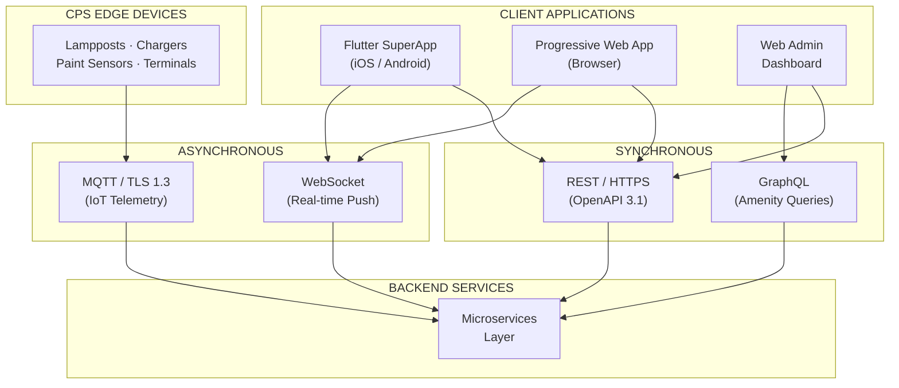

### 3.8.2 Protocol Specifications

| Protocol | Purpose | Endpoints / Topics | Data Format | Security |
|---|---|---|---|---|
| **REST (HTTPS)** | Client-to-microservice requests; all external API integrations | All `/api/v1/*` endpoints via Kong Gateway | JSON; OpenAPI 3.1 specification | OAuth 2.0/OIDC via Kong; HTTPS TLS termination |
| **GraphQL** | Flexible amenity and community partner queries (variable field selection) | Dedicated endpoint via Kong Gateway | GraphQL schema | Same OAuth 2.0/OIDC enforcement as REST |
| **WebSocket** | Real-time push: CPS telemetry streams, incident alerts, weather updates | `/api/v1/incidents/feed`, `/api/v1/cps/telemetry/stream` | JSON over WebSocket | Authenticated WebSocket upgrade; JWT validation |
| **MQTT** | CPS Edge device communication (lightweight IoT pub/sub) | `corridor/lamppost/{id}/telemetry` (upstream), `corridor/lamppost/{id}/command` (downstream) | Binary/JSON payload over MQTT | TLS 1.3 mandatory; device certificate authentication |

### 3.8.3 End-to-End Telemetry Flow

The complete CPS telemetry flow traverses all four protocols in sequence:

**Edge Device** → **MQTT** (Mosquitto 2.0, TLS 1.3) → **Apache Kafka 3.9** (durable streaming) → **CPS Dashboard Microservice** (Kafka consumer) → **WebSocket** (real-time push) → **Client Application**

This pipeline achieves the <500ms end-to-end telemetry latency target defined in Section 1.3.3, validated from MQTT publish at the edge device to WebSocket delivery at the client.

---

## 3.9 SECURITY TECHNOLOGY STACK

### 3.9.1 Defence-in-Depth Architecture

Security is implemented as a layered defence across all architectural tiers, ensuring compliance with GDPR, the UK Surveillance Camera Code of Practice, and public sector security expectations.

| Security Layer | Technology | Scope | Compliance Driver |
|---|---|---|---|
| **Authentication** | OAuth 2.0 / OIDC via Kong API Gateway | All authenticated endpoints | GDPR; data access control |
| **Token Management** | JWT with short expiry + refresh token rotation | All services | Session hijacking mitigation |
| **Multi-Factor Authentication** | MFA (TOTP/SMS) | field_worker and admin roles only | Elevated-privilege access protection |
| **Transport Encryption** | HTTPS (TLS) via Let's Encrypt | All client-server communication | Data in transit protection |
| **IoT Encryption** | MQTT TLS 1.3 | All CPS Edge device communication | UK Surveillance Camera Code compliance |
| **Rate Limiting** | Kong (3 tiers: 100/300/20 req/min) | All API endpoints | DDoS protection; abuse prevention |
| **Circuit Breaking** | Kong API Gateway | External API integrations | Service resilience; graceful degradation |
| **IP Allowlisting** | Kong configuration | Admin dashboard access only | Administrative access restriction |
| **Audit Logging** | All admin actions logged with timestamps and user IDs | Admin endpoints | Accountability; compliance trail |
| **Content Security Policy** | CSP headers | Web admin dashboard | XSS and injection prevention |
| **Dependency Scanning** | GitHub Dependabot + Snyk | CI pipeline (all dependencies) | Supply chain vulnerability mitigation |
| **Secrets Management** | Environment variables (never committed to repository) | All services and environments | Credential protection |
| **Data Minimisation** | Privacy-by-default design | All personal data processing | GDPR Article 5(1)(c) |
| **No Facial Recognition** | Aggregate occupancy and motion detection only | All CPS components | Constraint C-003; UK Surveillance Camera Code |
| **DSAR Support** | Data Subject Access Request capability | User data endpoints | GDPR Articles 15–22 |

### 3.9.2 Security Constraints

| Constraint ID | Security Constraint | Technology Impact |
|---|---|---|
| C-003 | No facial recognition in any CPS component | Python edge processors (`motion_detector.py`, `occupancy_counter.py`) implement aggregate-only detection |
| C-004 | No CCTV video storage or retrieval | Real-time telemetry only; no persistent video streams in PostgreSQL or object storage |
| GDPR | Data minimisation; privacy-by-default | Minimal user data collection; OAuth 2.0 scopes limit data exposure per role |

---

## 3.10 TECHNOLOGY-TO-FEATURE TRACEABILITY

The following matrix maps each core technology to the specific features it supports, ensuring that every technology selection is justified by at least one feature requirement.

| Technology | F-001 | F-002 | F-003 | F-004 | F-005 | F-006 | F-007 | F-008 | F-009 | F-010 | F-011 | F-012 | F-013 | F-014 |
|---|---|---|---|---|---|---|---|---|---|---|---|---|---|---|
| Flutter 3.27.x | ✓ | ✓ | ✓ | ✓ | ✓ | ✓ | ✓ | ✓ | ✓ | ✓ | ✓ | — | ✓ | ✓ |
| Node.js 22.x / TS 5.7.x | ✓ | — | ✓ | ✓ | ✓ | ✓ | ✓ | ✓ | ✓ | ✓ | ✓ | ✓ | — | ✓ |
| Unity 6 | — | ✓ | — | — | — | — | — | — | — | — | — | — | — | — |
| Kong API Gateway | ✓ | ✓ | ✓ | ✓ | ✓ | ✓ | ✓ | ✓ | ✓ | ✓ | ✓ | ✓ | ✓ | ✓ |
| PostgreSQL 17 + PostGIS | ✓ | ✓ | — | ✓ | ✓ | ✓ | ✓ | ✓ | ✓ | ✓ | ✓ | ✓ | — | ✓ |
| TimescaleDB | — | — | — | — | — | — | ✓ | ✓ | ✓ | ✓ | — | — | — | — |
| Redis 7.4.x | ✓ | — | ✓ | — | — | — | — | ✓ | — | ✓ | — | — | — | ✓ |
| Apache Kafka 3.9.x | — | — | — | — | — | — | ✓ | ✓ | ✓ | ✓ | ✓ | — | — | — |
| Mosquitto 2.0.x | — | — | — | — | — | — | ✓ | ✓ | ✓ | ✓ | — | — | — | — |
| SQLite | ✓ | ✓ | — | ✓ | — | — | — | — | — | — | — | — | ✓ | — |

---

## 3.11 PERFORMANCE-DRIVEN TECHNOLOGY MAPPING

Each KPI target defined in Section 1.3.3 is achieved through a specific combination of technologies. The following table documents the technology chain responsible for each performance commitment.

| KPI | Target | Technology Chain | Optimisation Mechanism |
|---|---|---|---|
| Route calculation (P95) | < 2 seconds | PostGIS GiST indices → Redis cached segments → Modified A* algorithm (Node.js) | Spatial index eliminates full table scan; cache hits bypass database entirely |
| XR overlay rendering | ≥ 30 FPS | Unity 6 rendering engine → AR Foundation → Flutter platform channels | GPU-accelerated rendering; device capability detection with 2D fallback |
| CPS telemetry latency | < 500ms | MQTT (Mosquitto 2.0) → Apache Kafka 3.9 → Node.js consumer → WebSocket push | Lightweight MQTT protocol; Kafka zero-copy reads; direct WebSocket delivery |
| Core services uptime | 99.5% | Kubernetes 1.32.x horizontal scaling → Kong circuit breaking → Redis failover | Stateless microservices; health check probes; graceful degradation |
| Map tile loading | < 1s cached / < 3s first | Mapbox vector tiles → Service Worker cache → SQLite offline storage | Pre-downloadable tiles; Service Worker intercept for cached responses |
| API Gateway latency | < 50ms | Kong API Gateway (lightweight proxy) | Minimal middleware chain; in-memory OAuth token validation |
| Offline retrieval | < 200ms | SQLite local storage → Service Worker cache | Local file-based queries; no network dependency |

---

## 3.12 REFERENCES

#### Files and Folders Examined

- `README.md` (lines 1–1484) — Complete technology stack specification, architecture design, component definitions, data models, API contracts, implementation standards, quality requirements, and monorepo structure
- `1st-Hayes-Impact-Govtech-App-Architecture-FlowChart-v260208c.svg` — Canonical architecture flowchart confirming all system layers and technology component relationships
- `src/client/` — Flutter SuperApp client source (Dart 3.6.x, pubspec.yaml, platform configurations)
- `src/server/services/` — Eight Node.js/TypeScript microservices, each with Dockerfile and package.json
- `src/server/gateway/` — Kong API Gateway configuration
- `src/server/shared/` — Shared database migrations, middleware, utilities, and type definitions
- `src/cps/firmware/` — C language CPS Edge firmware (ir_sensor_handler.c, mqtt_publisher.c, solar_battery_monitor.c)
- `src/cps/edge-processor/` — Python edge processing scripts (motion_detector.py, occupancy_counter.py)
- `src/cps/config/` — MQTT topic configuration (mqtt_topics.yml)
- `infrastructure/terraform/` — Terraform IaC modules (networking, database, kubernetes, monitoring)
- `infrastructure/helm/` — Kubernetes Helm charts (superapp-gateway, route-planning, cps-service, shared-infra)
- `.github/workflows/` — GitHub Actions CI/CD workflows (ci.yml, cd-staging.yml, cd-production.yml, security-scan.yml)
- `docker-compose.yml` — Local development orchestration configuration
- `docs/api/` — OpenAPI 3.1 specification and Swagger UI configuration
- `config/` — Environment configuration files (.env.development, .env.staging, .env.production, .env.example)

#### Technical Specification Sections Cross-Referenced

- Section 1.1 — Preamble: Strategic Planning Framework (budget constraints, risk analysis, SMART objectives, persona requirements)
- Section 1.2 — Executive Summary (business problems, value proposition)
- Section 1.3 — System Overview (architecture layers, KPIs, technology mapping, communication paradigms)
- Section 1.4 — Scope (in-scope features, implementation phases, boundaries)
- Section 2.1 — Feature Catalog (all 14 features with technology dependencies per feature)
- Section 2.3 — Feature Relationships (shared components, integration points, common services)
- Section 2.4 — Implementation Considerations (technical constraints, performance/scalability/security per domain)
- Section 2.5 — Traceability Matrix (feature-to-technology traceability)
- Section 2.7 — Non-Functional Requirements Summary (performance targets, quality/compliance targets, scalability requirements)
- Section 2.8 — Assumptions and Constraints (open-source mandate C-001, no facial recognition C-003, no AI/ML C-007, budget £10–£65)

# 4. Process Flowchart

This section presents the comprehensive process flows, state transitions, integration workflows, and error recovery paths that govern the Hayes & Hillingdon Waterways SuperApp platform. Every diagram maps directly to the layered SuperApp meta-ecosystem architecture defined in Section 1.3.2, the fourteen features catalogued in Section 2.1, and the communication protocols specified in Section 3.8. Together, these flowcharts serve as the definitive reference for understanding how user actions, CPS Edge sensor events, and administrative operations traverse the system from initiation to resolution — including all decision points, authorization checkpoints, timing constraints, and fallback paths.

The platform's three communication paradigms — synchronous REST/GraphQL, asynchronous MQTT-to-Kafka-to-WebSocket, and offline-first local storage — are reflected throughout. Each workflow identifies the architectural layer boundaries crossed, the validation rules enforced at each step, and the SLA targets that govern acceptable performance.

---

## 4.1 HIGH-LEVEL SYSTEM WORKFLOW

### 4.1.1 End-to-End Platform Interaction Overview

The following diagram illustrates the complete request and data flow across all six architectural layers of the platform. Client applications at the top submit requests through the Kong API Gateway, which enforces authentication, rate limiting, and circuit breaking before routing to one of eight independent microservices. Concurrently, CPS Edge devices at the canal corridor publish telemetry through the MQTT broker, which bridges into Apache Kafka for durable event streaming consumed by multiple microservices. External APIs enrich route calculations with weather, mapping, transit, and charging data.

```mermaid
flowchart TB
    subgraph ClientLayer["CLIENT LAYER"]
        FlApp["Flutter SuperApp<br/>(iOS / Android)"]
        PWAApp["Progressive Web App<br/>(Browser)"]
        AdminUI["Web Admin Dashboard"]
    end

    subgraph GatewayLayer["API GATEWAY LAYER"]
        KongGW["Kong API Gateway<br/>Rate Limiting · Circuit Breaking"]
        AuthSvc["OAuth 2.0 / OIDC<br/>Auth Service"]
    end

    subgraph MicroSvcLayer["MICROSERVICES LAYER"]
        RouteSvc["Route Planning<br/>Service"]
        WeatherSvc["Weather Alerting<br/>Service"]
        AmenitySvc["Amenities<br/>Service"]
        CommSvc["Community Partners<br/>Service"]
        IncidentSvc["Incident Reporting<br/>Service"]
        CPSSvc["CPS Dashboard<br/>Service"]
        SchedSvc["AI Errands<br/>Scheduler"]
        BookSvc["Rowing / Canoe<br/>Booking Service"]
    end

    subgraph DataLayer["DATA LAYER"]
        PGDB["PostgreSQL 17<br/>+ PostGIS"]
        RedisDB["Redis 7.4<br/>Cache"]
        KafkaMQ["Apache Kafka 3.9<br/>Event Stream"]
        TSDB["TimescaleDB<br/>Hypertable"]
    end

    subgraph EdgeLayer["CPS EDGE LAYER"]
        MQTTBr["MQTT Broker<br/>(Mosquitto 2.0)"]
        LampN["Solar CCTV<br/>Lampposts"]
        EBikeN["E-Bike Charging<br/>Stations"]
        BioN["Bioluminescent<br/>Paint Sensors"]
        BookT["Rowing / Canoe<br/>Booking Terminals"]
    end

    subgraph ExtLayer["EXTERNAL INTEGRATIONS"]
        MetOfc["Met Office<br/>DataPoint"]
        MapboxDir["Mapbox<br/>Directions"]
        TfLApi["TfL Unified<br/>API"]
        OCMapApi["OpenCharge<br/>Map API"]
    end

    FlApp -->|"REST / GraphQL / WebSocket"| KongGW
    PWAApp -->|"REST / GraphQL / WebSocket"| KongGW
    AdminUI -->|"REST / GraphQL"| KongGW
    KongGW -->|"Token Validation"| AuthSvc
    KongGW --> RouteSvc
    KongGW --> WeatherSvc
    KongGW --> AmenitySvc
    KongGW --> CommSvc
    KongGW --> IncidentSvc
    KongGW --> CPSSvc
    KongGW --> SchedSvc
    KongGW --> BookSvc

    RouteSvc --> PGDB
    RouteSvc --> RedisDB
    AmenitySvc --> PGDB
    CommSvc --> PGDB
    IncidentSvc --> PGDB
    CPSSvc --> TSDB
    SchedSvc --> PGDB
    BookSvc --> PGDB
    WeatherSvc --> RedisDB

    LampN -->|"MQTT TLS 1.3"| MQTTBr
    EBikeN -->|"MQTT TLS 1.3"| MQTTBr
    BioN -->|"MQTT TLS 1.3"| MQTTBr
    BookT -->|"MQTT TLS 1.3"| MQTTBr
    MQTTBr -->|"Bridge"| KafkaMQ
    KafkaMQ -->|"Consumer Group"| CPSSvc
    KafkaMQ -->|"Consumer Group"| RouteSvc
    KafkaMQ -->|"Consumer Group"| IncidentSvc

    RouteSvc -->|"REST"| MetOfc
    RouteSvc -->|"REST"| MapboxDir
    RouteSvc -->|"REST"| TfLApi
    RouteSvc -->|"REST"| OCMapApi

    CPSSvc -->|"WebSocket Push"| KongGW
    IncidentSvc -->|"WebSocket Push"| KongGW
```

The architecture reflects a clear separation of concerns: the Kong API Gateway acts as the single ingress point for all client traffic, enforcing OAuth 2.0/OIDC authentication, three-tier rate limiting (100/300/20 requests per minute), and circuit-breaker patterns for external API resilience. The CPS Edge layer operates on a parallel ingestion path — sensor telemetry never traverses the API Gateway but instead flows through the dedicated MQTT broker directly into Kafka, ensuring the sub-500ms end-to-end telemetry target is achievable. WebSocket connections for real-time pushes (CPS telemetry stream at `/api/v1/cps/telemetry/stream` and incident feed at `/api/v1/incidents/feed`) are upgraded through Kong with JWT validation.

### 4.1.2 Communication Paradigm Decision Flow

Every interaction with the platform follows one of three communication paradigms. The paradigm is determined by the source and nature of the request: user-initiated queries follow the synchronous REST/GraphQL path, CPS Edge sensor events follow the asynchronous MQTT-to-Kafka-to-WebSocket pipeline, and connectivity-impaired scenarios activate the offline-first path with local storage.

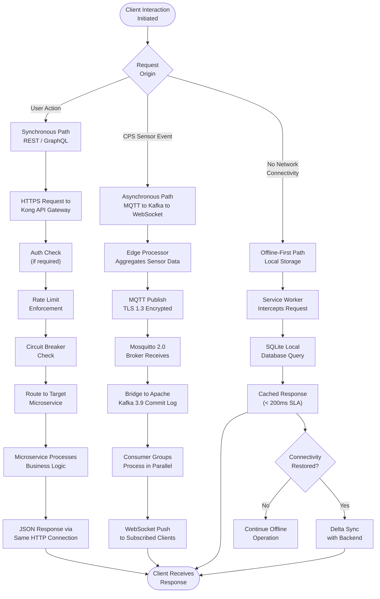

The three paradigms ensure that every conceivable interaction scenario is handled: real-time user queries receive sub-two-second responses via REST; CPS Edge telemetry from solar CCTV lampposts, e-bike charging stations, bioluminescent paint sensors, and rowing/canoe booking terminals flows at sub-500ms latency through the event pipeline; and towpath connectivity gaps — identified as a high-likelihood, high-impact risk in the Strategic Planning Framework (Section 1.1.1) — are mitigated through Service Worker caching and local SQLite storage, delivering cached data within 200ms.

### 4.1.3 Request Lifecycle Timing Constraints

The following table consolidates all SLA targets that govern process flow timing across the platform. These targets are referenced as decision thresholds within individual workflow diagrams throughout this section.

| Operation | SLA Target | Governing Feature | Measurement Point |
|---|---|---|---|
| Route calculation | < 2 seconds (95th percentile) | F-001 Route Planning | Request receipt to GeoJSON response |
| Map tile loading (cached) | < 1 second | F-001, F-002, F-013 | Tile request to render |
| Map tile loading (first load) | < 3 seconds | F-001, F-002, F-013 | Cold cache tile request to render |
| CPS telemetry end-to-end | < 500 milliseconds | F-008, F-009, F-010, F-007 | MQTT publish to WebSocket delivery |
| API Gateway overhead | < 50 milliseconds | All features | Gateway ingress to service routing |
| Offline data retrieval | < 200 milliseconds | F-013 PWA | SQLite/Service Worker query to response |
| Search results | < 500 milliseconds | F-004, F-005 | Query submission to ranked results |
| Itinerary generation | < 5 seconds | F-006 AI Scheduler | Request receipt to optimised sequence |
| Booking confirmation | < 2 seconds | F-007 Rowing/Canoe | Booking submission to confirmation |
| AR session initialisation | < 3 seconds | F-002 XR Tour | Session start to first AR frame |
| Marker detection response | < 500 milliseconds | F-002 XR Tour | Marker detected to content overlay |
| Token validation | < 100 milliseconds | F-014 Auth | JWT presented to validation result |
| XR overlay rendering | ≥ 30 FPS | F-002 XR Tour | Continuous frame rate on mid-range devices |

---

## 4.2 CORE BUSINESS PROCESS FLOWS

This section documents the five primary user journeys identified in Section 1.4.1, each representing a distinct end-to-end interaction that a resident, visitor, parent, or cyclist undertakes within the Hayes Towpath corridor. Each flow identifies all decision points, validation rules, authorization checkpoints, data sources consulted, error paths, and performance targets.

### 4.2.1 Route Discovery and Navigation

The Route Discovery workflow is the platform's most complex user journey, orchestrating data from seven sources into a single optimised route via the modified A* pathfinding algorithm. This flow serves the persona of Priya Kaur — a Hayes resident navigating the 3-mile towpath from Bulls Bridge junction to Grand Union Village — who needs a safe, well-lit, weather-aware route for walking, running, or cycling.

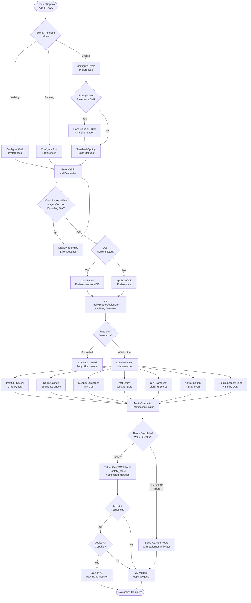

#### Decision Points and Validation Rules

The Route Discovery flow enforces the following validation rules at each decision checkpoint:

| Decision Point | Validation Rule | Error Response |
|---|---|---|
| **Transport Mode Selection** | Must be one of: `walking`, `running`, `cycling` | Schema validation error (Zod) |
| **Battery Preference** | Optional; cycling mode only; triggers e-bike station inclusion via CPS Edge + OpenCharge Map data | Standard route if not set |
| **Coordinate Validation** | All coordinates must be WGS84 within Hayes corridor bounding box (lat: 51.49–51.52, lon: −0.37 to −0.42) | RFC 7807 error: coordinates out of bounds |
| **Authentication Check** | Optional for basic routing; required for saved routes and preferences | Anonymous access permitted with defaults |
| **Rate Limit** | Route calculation endpoint limited to 20 requests per minute per user | 429 with Retry-After header |
| **Data Freshness** | CPS lamppost telemetry must be < 15 minutes old for lighting scores; bioluminescent sensor data must be current reading | Stale data flagged; cached fallback |
| **Risk Marker Activity** | Only active (non-expired) risk markers within 50m of route segments applied | Expired markers excluded from cost function |

#### Data Source Integration Matrix

The multi-criteria A* optimization engine consults seven data sources in parallel to compute the optimal route. Each source contributes a specific cost function weight:

| Data Source | Cost Function Contribution | Access Mechanism | Freshness Requirement |
|---|---|---|---|
| PostGIS Spatial Graph | Distance, surface quality, path geometry | Direct SQL query via GiST indices | Persistent graph data |
| Redis Cached Segments | Pre-computed segment scores | Sub-millisecond key lookup | Configurable TTL |
| Mapbox Directions API | Base route geometry, turn-by-turn directions | REST via Kong circuit breaker | Real-time; cached on failure |
| Met Office DataPoint | Weather exposure, rain/ice/wind warnings | REST via Weather Alerting Service | 5-minute publication intervals |
| CPS Lamppost Telemetry | Lighting score per segment (0.0–1.0) | Kafka consumer → Redis cache | < 15 minutes old |
| Incident Risk Markers | Severity-weighted cost increase (0.0–1.0) | PostgreSQL query within bounding box | Active (not expired), within 50m |
| Bioluminescent Lane Sensors | Nighttime visibility classification | Kafka consumer → Redis cache | Current sensor reading |

### 4.2.2 Rowing and Canoe Club Session Booking

The Rowing and Canoe Club Session Booking workflow enables parents and residents to book weekly water recreation sessions at three registered canal clubs — The Sharks, Hillingdon Junior Canoe Club, and Hillingdon Canal Club. This flow integrates CPS Edge booking terminal telemetry via the MQTT-to-Kafka pipeline and incorporates weather safety advisories from the Weather Alerting Service (F-003).

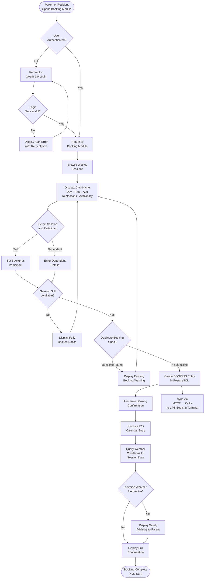

#### Booking Validation Rules

| Validation Rule | Enforcement Point | Error Handling |
|---|---|---|
| **Authentication Required** | Kong API Gateway; OAuth 2.0 token mandatory | 401 Unauthorized; redirect to login |
| **Session Availability** | PostgreSQL BOOKING table count vs capacity | User-friendly "fully booked" message |
| **Duplicate Prevention** | Unique constraint on user + session combination | Warning with link to existing booking |
| **Age Restriction Validation** | Client-side and server-side age check against session rules | Age-ineligible sessions greyed out |
| **Weather Safety Advisory** | Weather Alerting Service (F-003) queried for session date conditions | Advisory displayed; booking not blocked |
| **GDPR Data Minimisation** | Only essential booking data collected; no unnecessary personal information | Privacy-by-default design |

The CPS Edge booking terminal integration operates bidirectionally: when a booking is created through the app, the confirmation is propagated via Kafka to the physical terminal at the canalside, ensuring that walk-up availability displays remain accurate. Conversely, terminal-originated telemetry (session status, terminal health) flows upstream through MQTT to the CPS Dashboard Service.

### 4.2.3 E-Bike Commute and Charging Station Integration

The E-Bike Commute workflow demonstrates the real-time integration between CPS Edge charging station sensors, the OpenCharge Map external API, and the Route Planning Engine. Cyclists who set a battery-level preference receive routes optimised to include the nearest available charging station as a waypoint. Station availability is determined by merging CPS Edge telemetry (occupancy, charge status, fault alerts) with supplementary OpenCharge Map data (refreshed hourly into Redis).

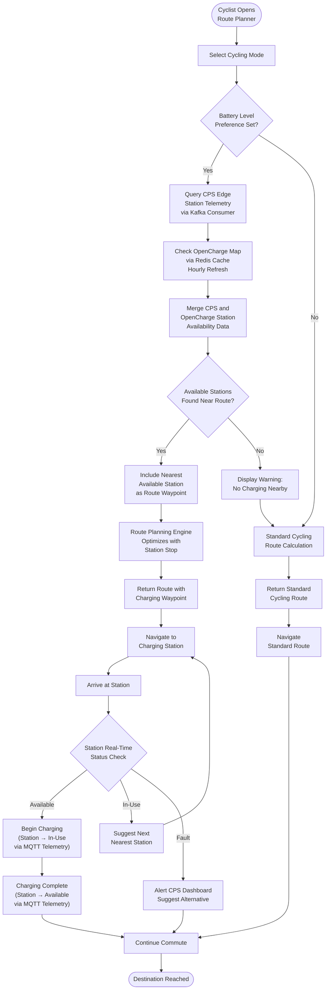

#### Station Status Management

E-Bike charging station status is maintained through a dual-source data pipeline. CPS Edge sensors at each station publish occupancy and fault telemetry via MQTT on a dedicated topic, bridged into Kafka for durable streaming. Simultaneously, the OpenCharge Map API provides supplementary data about public charging points beyond the platform's own stations, cached in Redis with an hourly refresh cycle. The Route Planning Service consumes both data streams to maintain a real-time availability picture, colour-coded on the map interface as available (green), in-use (amber), or fault (red). The CPS Dashboard Service stores all station telemetry in TimescaleDB for 30-day historical availability analysis.

### 4.2.4 Community Discovery and Multilingual Access

The Community Discovery workflow serves the platform's diverse Hayes community — including Punjabi, Hindi, Urdu, and Polish-speaking residents — by providing a fully internationalised community directory with full-text search, category filtering, and geospatial proximity queries. This flow is designed as a public-access feature requiring no authentication, lowering barriers for community engagement.

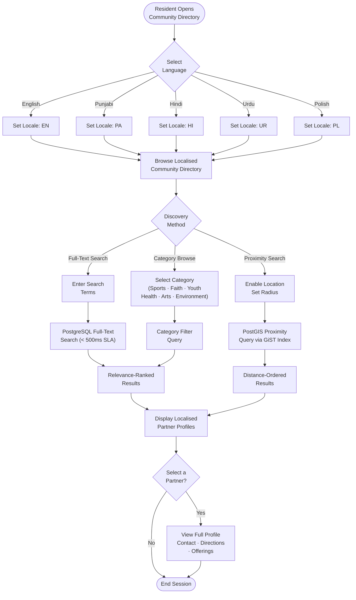

#### Search and Filter Mechanisms

Community discovery leverages PostgreSQL's built-in full-text search with indices on `community_partner.name` and description fields, delivering relevance-ranked results within the 500ms SLA target. The PostGIS GiST spatial index powers proximity search, accepting latitude, longitude, and radius parameters to return distance-ordered results. All partner metadata is stored with translations in five languages (EN, PA, HI, UR, PL), selected via the `Accept-Language` request header. Category filtering supports seven or more categories aligned with the Community Groups directory maintained by Hillingdon Council.

### 4.2.5 Incident Reporting and Resolution

The Incident Reporting workflow enables authenticated users to report towpath hazards, triggering an asynchronous event propagation chain that updates route planning safety scores, correlates with CPS lamppost telemetry, and delivers real-time alerts to council field workers. This workflow crosses three system boundaries — the client application, the Incident Reporting microservice, and the Kafka event bus — with downstream effects on the Route Planning Service, CPS Dashboard Service, and WebSocket-connected clients.

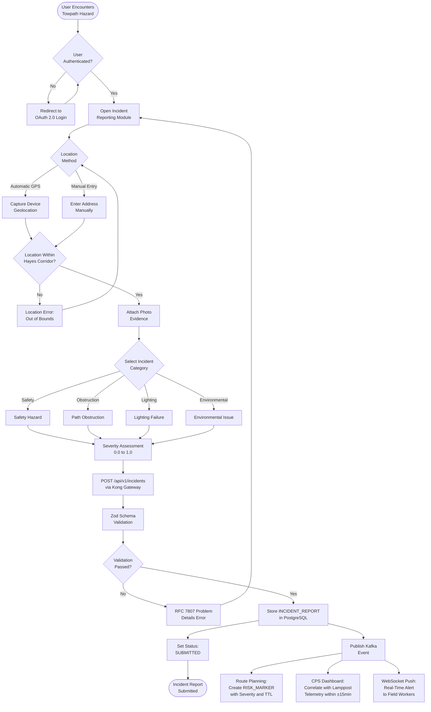

#### Event Propagation Workflow

Upon successful incident submission, the Incident Reporting Service publishes an event to Apache Kafka, which is consumed by three independent services:

1. **Route Planning Service** — Creates a `RISK_MARKER` entity with the incident severity score (normalised 0.0–1.0) and a configurable time-to-live (TTL). Active risk markers within 50 metres of route segments increase segment cost proportionally to severity in the A* cost function.

2. **CPS Dashboard Service** — Executes a correlation query matching the incident geolocation to the nearest lamppost(s) and linking telemetry events within a ±15-minute window of the incident timestamp. This correlation enables field workers to cross-reference user reports with sensor data.

3. **WebSocket Feed** — Pushes the incident in real-time to all subscribed field worker clients via the `/api/v1/incidents/feed` WebSocket endpoint, enabling immediate triage. The feed is filterable by category and location.

The incident status lifecycle — `submitted → acknowledged → resolved/dismissed` — is enforced through RBAC: only `field_worker` and `admin` roles can transition from `submitted` to `acknowledged`, and from `acknowledged` to `resolved` or `dismissed`.

---

## 4.3 INTEGRATION WORKFLOWS

This section documents the cross-service integration patterns that connect the platform's fourteen features into a cohesive system. Each workflow demonstrates how data flows between services, the protocols employed, and the event processing sequences that maintain system-wide consistency.

### 4.3.1 CPS Edge Telemetry Pipeline

The CPS Edge Telemetry Pipeline is the backbone of the platform's real-time safety and infrastructure monitoring capability. It connects all four CPS Edge device types — solar CCTV lampposts, e-bike charging stations, bioluminescent paint sensors, and rowing/canoe booking terminals — through a unified MQTT-to-Kafka-to-WebSocket pipeline with a target end-to-end latency of less than 500 milliseconds.

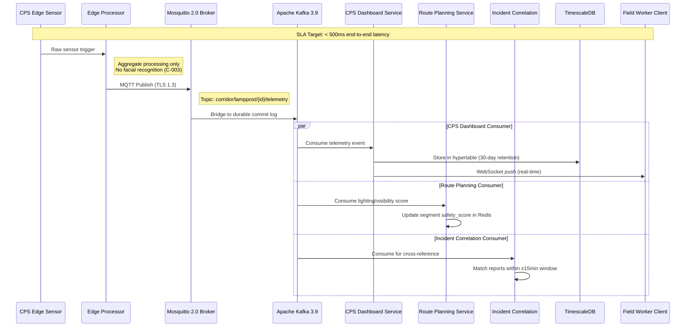

#### Telemetry Event Types by CPS Edge Device

| CPS Edge Device | Telemetry Events | Kafka Consumer(s) | Downstream Impact |
|---|---|---|---|
| **Solar CCTV Lampposts** | `ir_trigger`, `battery_level`, `solar_charge`, `cctv_status`, `motion_detected` | CPS Dashboard, Route Planning, Incident Correlation | Lighting safety scores, corridor health status, incident cross-reference |
| **E-Bike Charging Stations** | `occupancy`, `charge_status`, `fault_alert` | CPS Dashboard, Route Planning | Station availability markers, cycling route optimisation |
| **Bioluminescent Paint Sensors** | `luminosity_level`, `ambient_light`, `lane_visibility` | CPS Dashboard, Route Planning | Nighttime visibility classification (high/medium/low/insufficient), cycling lane safety scoring |
| **Rowing/Canoe Booking Terminals** | `session_status`, `terminal_health` | CPS Dashboard, Booking Service | Booking synchronisation between app and terminal |

All telemetry events include UTC timestamps and asset identifiers for traceability. Edge processors (`motion_detector.py`, `occupancy_counter.py`) implement aggregate-only detection in compliance with Constraint C-003 (no facial recognition) and the UK Surveillance Camera Code of Practice. MQTT communication is encrypted with TLS 1.3 using device certificate authentication.

### 4.3.2 Authentication and Authorization Flow

The Authentication and Authorization flow implements a defence-in-depth security architecture with four user roles (visitor, resident, field_worker, admin), progressive security escalation through MFA and IP allowlisting, and three-tier rate limiting enforced at the Kong API Gateway.

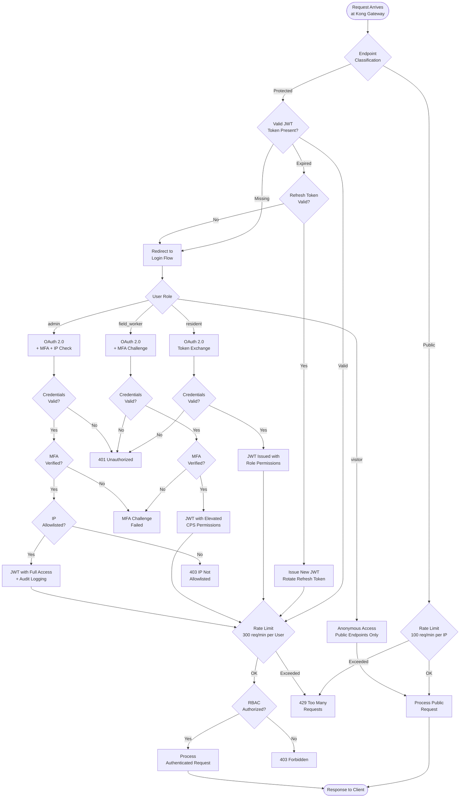

#### RBAC Authorization Matrix

The RBAC gate in the authentication flow enforces the following permission matrix at every protected endpoint:

| Endpoint Category | visitor | resident | field_worker | admin |
|---|---|---|---|---|
| Route Planning (basic) | ✓ | ✓ | ✓ | ✓ |
| Saved Routes / Preferences | ✗ | ✓ | ✓ | ✓ |
| Community Directory (read) | ✓ | ✓ | ✓ | ✓ |
| Itinerary / Booking | ✗ | ✓ | ✓ | ✓ |
| Incident Submission | ✗ | ✓ | ✓ | ✓ |
| Incident Management | ✗ | ✗ | ✓ | ✓ |
| CPS Dashboard | ✗ | ✗ | ✓ | ✓ |
| CPS Telemetry Stream | ✗ | ✗ | ✓ | ✓ |
| Admin Configuration | ✗ | ✗ | ✗ | ✓ |

Token validation is performed via Redis-backed session caching with a sub-100ms validation target. JWT tokens use short expiry with refresh token rotation to mitigate session hijacking. All admin actions are logged with timestamps, user IDs, action descriptions, and IP addresses for accountability and GDPR compliance.

### 4.3.3 AI Errands Scheduling Integration

The AI Errands Scheduling workflow orchestrates cross-service integration between three microservices: the AI Scheduling Service queries the Route Planning Service for path costs between errand stops and the Amenities Service for opening hour validation, then applies rule-based optimisation to generate a time-minimised itinerary.

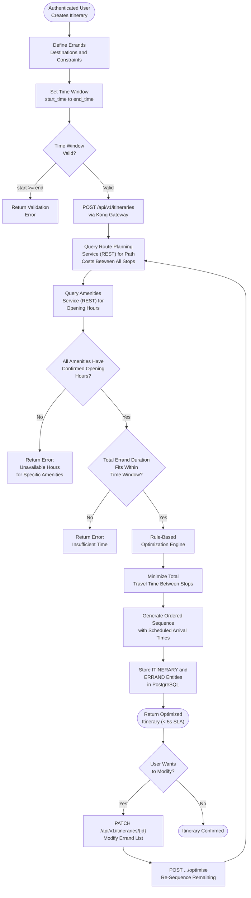

#### Cross-Service Dependencies

| Integration | Source Service | Target Service | Protocol | Data Exchanged |
|---|---|---|---|---|
| Path cost retrieval | AI Scheduling | Route Planning | Synchronous REST | Origin/destination pairs → distance and duration per pair |
| Opening hour validation | AI Scheduling | Amenities | Synchronous REST | Amenity IDs → confirmed opening hours for requested time slots |
| Itinerary persistence | AI Scheduling | PostgreSQL | Direct query | ITINERARY and ERRAND entity creation/update |
| Itinerary modification | Client | AI Scheduling | REST PATCH | Modified errand list → re-optimisation trigger |

The rule-based optimisation approach is selected for the MVP (deep learning deferred to future phases), ensuring predictable performance within the 5-second SLA. The scheduler validates that every target amenity has confirmed opening hours for the scheduled arrival time before including it in the sequence — if hours are unavailable, a specific error identifies the problematic amenities.

### 4.3.4 XR Tour e-Guide Session Flow

The XR Tour e-Guide Session workflow manages the augmented reality experience across the 8 stages of Hillingdon Trail Walk 2, including device capability detection, camera permission handling, POI loading with offline fallback, and marker-triggered content overlays. The Unity 6 XR engine communicates with the Flutter shell via a platform channel bridge.

```mermaid
flowchart TD
    A([User Launches<br/>XR Tour Mode]) --> B{Device AR<br/>Capability Check}

    B -->|"AR Supported"| C[Initialize Unity 6<br/>via Platform Channel<br/>Bridge to Flutter]
    B -->|"AR Not Supported"| D[Fallback to 2D<br/>Mapbox Map View]

    C --> E{Camera Permission<br/>Requested}
    E -->|"Granted"| F["Start AR Session<br/>(< 3s SLA)"]
    E -->|"Denied"| G[Display Permission<br/>Required Message]
    G --> D

    F --> H[Load Trail Segment<br/>Stages 1-8 of<br/>Hillingdon Trail Walk 2]

    H --> I["Query POIs Within<br/>50m Radius (Max 20)"]

    I --> J{Network<br/>Connectivity?}
    J -->|"Online"| K[Fetch POIs from<br/>Backend API]
    J -->|"Offline"| L["Retrieve from SQLite<br/>Cache (< 200ms)"]

    K --> M[Update Local<br/>SQLite POI Cache]
    M --> N["Render AR Overlays<br/>Wayfinding · Heritage<br/>· Wildlife (≥ 30 FPS)"]
    L --> N

    N --> O{XR Marker<br/>Detected?}
    O -->|"Yes"| P["Display Content<br/>Overlay (< 500ms)"]
    O -->|"No"| Q[Continue AR<br/>Navigation]

    P --> R{More Trail<br/>Stages?}
    Q --> R
    R -->|"Yes"| S[Progress to<br/>Next Stage]
    S --> H
    R -->|"No"| T([Trail Tour<br/>Complete])

    D --> U[Display All POIs<br/>on 2D Mapbox Map]
    U --> T
```

#### Offline Capability

The XR Tour implements a robust offline strategy for the canal towpath environment where cellular connectivity is unreliable. POI data is cached in the local SQLite database and updated on each online session. When offline, the AR experience continues with locally cached POIs retrieved within 200ms. Upon reconnection, a delta synchronisation updates the local cache with any new or modified POI content. This ensures that Priya Kaur and other residents can enjoy the full heritage trail experience regardless of network conditions along the 3-mile towpath corridor.

### 4.3.5 PWA Offline-First Synchronization

The Progressive Web App (PWA) Offline-First workflow ensures that all user-facing features remain functional through towpath connectivity gaps. The Service Worker manages application shell caching, map tile pre-downloading, and data synchronisation, while SQLite provides structured offline data access. This workflow is critical because the PWA is the primary low-barrier access channel — residents access it via QR code or direct URL without requiring an app store download.

```mermaid
flowchart TD
    A(["User Accesses PWA<br/>via QR Code or URL"]) --> B[Service Worker<br/>Registers]

    B --> C[Cache Application Shell<br/>Map Tiles · Route Data<br/>Community Directory]

    C --> D{Network<br/>Connectivity?}

    D -->|"Online"| E[Fetch Live Data<br/>from Backend APIs]
    E --> F[Update Local<br/>SQLite Storage]
    F --> G[Pre-Download Map Tiles<br/>for Offline Navigation]
    G --> H[Render Full<br/>Online Application]

    D -->|"Offline"| I[Service Worker<br/>Intercepts All Requests]
    I --> J["Serve Cached<br/>Assets (< 200ms)"]
    J --> K[SQLite Provides<br/>Routes · POIs · Amenities<br/>· Community Directory]
    K --> L[Render Offline<br/>Application]

    H --> M{User Performs<br/>Action}
    L --> M

    M --> N{Action Requires<br/>Server Write?}
    N -->|"No"| O[Serve from<br/>Local Cache]
    N -->|"Yes"| P{Currently<br/>Online?}

    P -->|"Yes"| Q[Submit to<br/>Backend API]
    P -->|"No"| R[Queue Action<br/>for Sync]

    Q --> S[Update Local<br/>Cache with Response]

    R --> T{Connectivity<br/>Restored?}
    T -->|"Yes"| U[Delta Sync<br/>with Backend]
    U --> V[Synchronize<br/>SQLite Data]
    T -->|"No"| W[Continue Offline<br/>with Cached Data]

    S --> X([Continue Using App])
    V --> X
    W --> X
    O --> X

    H --> Y{Add to Home<br/>Screen Prompt?}
    Y -->|"Accepted"| Z[Install PWA via<br/>Manifest Configuration]
    Y -->|"Dismissed"| X
    Z --> X
```

#### Service Worker Lifecycle

The PWA Service Worker implements a cache-first strategy for static assets (application shell, map tiles, icons) and a network-first strategy for dynamic data (route calculations, amenity status, incident feeds). The PWA manifest includes application icons, name, and theme colour configuration — aligned with Hillingdon Council's visual identity — and enables the Add to Home Screen prompt for a native-like experience. Pre-downloaded map tiles for the Hayes Towpath corridor ensure that offline map rendering functions correctly across all 8 trail stages, with the map centred on the Hayes corridor bounding box (lat: 51.49–51.52, lon: −0.37 to −0.42).

---

## 4.4 ERROR HANDLING AND RECOVERY FLOWS

The platform implements layered error handling across all architectural tiers, from client-side user-friendly messaging to backend RFC 7807 Problem Details responses, CPS Edge store-and-forward buffering, and external API circuit-breaker resilience. This section documents the error handling flows that ensure graceful degradation under all failure conditions.

### 4.4.1 External API Resilience Pattern

All external API integrations — Met Office DataPoint, Mapbox Directions, TfL Unified, and OpenCharge Map — are protected by the Kong API Gateway circuit-breaker pattern combined with Redis caching. This flow ensures that external service failures never cascade into user-facing errors, instead falling back to cached data with appropriate staleness indicators.

```mermaid
flowchart TD
    A([Microservice Requests<br/>External API Data]) --> B{Redis Cache<br/>Hit?}

    B -->|"Cache Hit"| C{Cache Data<br/>Fresh?}
    C -->|"Fresh - Within TTL"| D[Return Cached<br/>Response Immediately]
    C -->|"Stale - Expired TTL"| E[Attempt Live<br/>API Call]

    B -->|"Cache Miss"| E

    E --> F{Kong Circuit<br/>Breaker Status}
    F -->|"Closed"| G[Forward Request<br/>to External API]
    F -->|"Open"| H{Stale Cache<br/>Available?}

    G --> I{API Response<br/>Received?}
    I -->|"Success 2xx"| J[Update Redis Cache<br/>with New TTL]
    J --> K[Return Fresh<br/>Response]

    I -->|"Failure or Timeout"| L[Increment Circuit<br/>Breaker Failure Counter]
    L --> M{Failure Threshold<br/>Exceeded?}
    M -->|"Yes"| N[Trip Circuit Breaker<br/>to Open State]
    M -->|"No"| O[Retry with<br/>Exponential Backoff]
    O --> G

    N --> H
    H -->|"Yes"| P[Serve Stale Cache<br/>with Staleness Indicator<br/>Displayed to User]
    H -->|"No"| Q[Return Graceful<br/>Degradation Response]

    I -->|"Rate Limited 429"| R[Respect Retry-After<br/>Header]
    R --> S[Log Rate Limit<br/>Event for Quota Monitoring]
    S --> H

    K --> T([Response to Client])
    D --> T
    P --> T
    Q --> T
```

#### Circuit Breaker Configuration

The circuit-breaker pattern ensures that the platform remains within free-tier API quotas while providing resilience against external service outages. Rate limit awareness in API clients monitors usage against quota thresholds — particularly important for the Met Office DataPoint and Mapbox Directions APIs, which have defined free-tier limits. When a circuit breaker trips, the system transparently serves cached data with a visual staleness indicator displayed to the user, maintaining functionality while preventing cascading failures.

### 4.4.2 CPS Edge Error Recovery

CPS Edge devices operate in challenging environmental conditions — solar-powered nodes along the canal towpath must handle intermittent connectivity, low battery states, and MQTT broker unavailability. The store-and-forward pattern ensures that no telemetry data is lost during these conditions.

```mermaid
flowchart TD
    A([CPS Edge Sensor<br/>Generates Telemetry]) --> B{MQTT Broker<br/>Connection Active?}

    B -->|"Connected"| C[Publish Telemetry<br/>via MQTT TLS 1.3]
    C --> D[Mosquitto Broker<br/>Receives Message]
    D --> E[Bridge to<br/>Apache Kafka]
    E --> F([Normal Processing<br/>Pipeline])

    B -->|"Disconnected"| G[Buffer Telemetry<br/>in Local Storage]
    G --> H{Battery Level<br/>Check}

    H -->|"Normal"| I[Continue Buffering<br/>at Standard Frequency]
    H -->|"Low Battery"| J[Reduce Publishing<br/>Frequency to Conserve]
    J --> I

    I --> K{MQTT Connection<br/>Restored?}
    K -->|"Yes"| L[Flush Buffered<br/>Telemetry to Broker]
    L --> M[Attach UTC Timestamps<br/>and Asset Identifiers]
    M --> C
    K -->|"No"| N[Continue Retry<br/>Attempts]
    N --> G

    C --> O{Publish<br/>Acknowledged?}
    O -->|"ACK Received"| F
    O -->|"NACK or Timeout"| P[Add to<br/>Retry Queue]
    P --> Q[Automatic Retry<br/>on Next Cycle]
    Q --> C
```

#### Store-and-Forward Pattern

The CPS Edge error recovery implements a priority-based store-and-forward strategy:

1. **Normal Operation** — Telemetry is published immediately via MQTT with TLS 1.3 encryption to the Mosquitto broker and bridged into Kafka.
2. **Connectivity Loss** — Telemetry is buffered locally on the edge device with UTC timestamps and asset identifiers preserved for temporal ordering when replayed.
3. **Low Battery State** — Publishing frequency is dynamically reduced to conserve the solar battery charge, prioritising critical events (fault alerts, CCTV status changes) over routine readings (periodic battery levels).
4. **Connection Restoration** — All buffered telemetry is flushed to the broker in chronological order, ensuring the CPS Dashboard and Route Planning services receive a complete and ordered event history.
5. **Publish Failure** — Individual publish failures trigger an automatic retry queue with backoff, ensuring no telemetry event is silently dropped.

### 4.4.3 Backend Error Response Standards

All backend microservices implement a consistent error handling strategy through the global error handler middleware (`src/server/shared/middleware/error-handler.middleware.ts`).

#### Error Response Format

| Standard | Implementation |
|---|---|
| **Error Format** | RFC 7807 Problem Details JSON for all error conditions |
| **Input Validation** | Zod schema validation at controller boundaries for runtime request/response validation |
| **Logging** | Structured JSON logging via Pino logger with correlation IDs propagated across all services |
| **Client Messaging** | User-friendly error messages with retry options; technical details logged to remote crash reporting |
| **Circuit Breaking** | Kong Gateway circuit-breaker patterns for all external API integrations |
| **Offline Fallback** | Service Worker serves cached assets when backend is unavailable; local SQLite provides cached data |

The error handling middleware catches all unhandled exceptions and formats them as RFC 7807 Problem Details responses, ensuring clients receive consistent, machine-parseable error information regardless of which microservice generates the error. Correlation IDs are injected at the Kong API Gateway and propagated through all downstream service calls, enabling end-to-end request tracing for debugging and monitoring.

---

## 4.5 STATE TRANSITION DIAGRAMS

This section documents the state machines governing the lifecycle of key domain entities across the platform. Each state transition is enforced through application-level business rules and, where applicable, RBAC authorization checks.

### 4.5.1 Incident Report Lifecycle

The incident report progresses through three terminal states, with transitions governed by RBAC roles. Only `field_worker` and `admin` roles can advance an incident beyond the `submitted` state.

```mermaid
stateDiagram-v2
    [*] --> Submitted : User submits incident report
    Submitted --> Acknowledged : Field worker reviews report
    Acknowledged --> Resolved : Issue confirmed fixed
    Acknowledged --> Dismissed : Report invalid or duplicate
    Resolved --> [*]
    Dismissed --> [*]
```

| Transition | Trigger | Authorized Roles | Side Effects |
|---|---|---|---|
| `[*] → Submitted` | User submits via API | `resident`, `field_worker`, `admin` | Kafka event published; RISK_MARKER created; WebSocket push to field workers |
| `Submitted → Acknowledged` | Field worker reviews | `field_worker`, `admin` | Status update persisted; notification to reporter |
| `Acknowledged → Resolved` | Issue confirmed fixed | `field_worker`, `admin` | RISK_MARKER TTL adjusted; incident archived |
| `Acknowledged → Dismissed` | Report deemed invalid | `field_worker`, `admin` | RISK_MARKER deactivated; reason logged |

### 4.5.2 CPS Infrastructure Asset States

CPS Edge devices maintain operational states that are updated via telemetry events flowing through the MQTT-to-Kafka pipeline. Each device type has a distinct state machine reflecting its operational characteristics.

#### Smart Lamppost States

```mermaid
stateDiagram-v2
    [*] --> Operational : Initial deployment
    Operational --> Degraded : Component failure detected
    Degraded --> Offline : Critical system failure
    Degraded --> Operational : Maintenance repair completed
    Offline --> Operational : Full restoration
    Offline --> Degraded : Partial recovery
```

Smart lampposts transition to `Degraded` when individual components fail (e.g., IR sensor offline while CCTV remains active) and to `Offline` when the node becomes completely unresponsive. The CPS Dashboard aggregates all lamppost statuses into a corridor health overview displaying operational, degraded, and offline counts with a percentage health score.

#### E-Bike Charging Station States

```mermaid
stateDiagram-v2
    [*] --> Available : Station deployed
    Available --> InUse : User begins charging
    InUse --> Available : Charging complete
    Available --> Fault : Hardware fault detected
    InUse --> Fault : Fault during active charge
    Fault --> Available : Fault cleared by technician
```

Charging station state transitions are published as MQTT telemetry events and consumed by both the CPS Dashboard (for field worker monitoring) and the Route Planning Service (for real-time cycling route optimisation). Map interface markers are colour-coded: green for `Available`, amber for `InUse`, and red for `Fault`.

#### Bioluminescent Lane Visibility States

```mermaid
stateDiagram-v2
    [*] --> HighVisibility : Optimal luminosity
    HighVisibility --> MediumVisibility : Luminosity decreasing
    MediumVisibility --> LowVisibility : Further decrease
    LowVisibility --> Insufficient : Below safety threshold
    Insufficient --> LowVisibility : Partial luminosity recovery
    LowVisibility --> MediumVisibility : Luminosity recovering
    MediumVisibility --> HighVisibility : Full luminosity restored
```

Bioluminescent paint sensor visibility classification is determined by configurable luminosity thresholds. When a cycling lane segment is classified as `Insufficient`, the Route Planning Service triggers an alternative route suggestion for nighttime cyclists, rerouting them to segments with adequate lighting from smart lampposts or higher-visibility bioluminescent lanes. This bidirectional state machine reflects the natural luminosity cycles of the bioluminescent paint — decreasing through the night and recovering with UV exposure during daylight.

### 4.5.3 Itinerary Lifecycle

The AI-generated itinerary transitions through four states, supporting modification and re-optimisation at any point before completion.

```mermaid
stateDiagram-v2
    [*] --> Draft : User creates itinerary request
    Draft --> Confirmed : Optimization complete and accepted
    Confirmed --> InProgress : User begins errands
    InProgress --> Completed : All errands finished
    Confirmed --> Draft : User modifies errand list
    InProgress --> Draft : User re-optimizes remaining errands
    Completed --> [*]
```

| Transition | Trigger | API Endpoint |
|---|---|---|
| `[*] → Draft` | Itinerary creation | `POST /api/v1/itineraries` |
| `Draft → Confirmed` | Optimisation accepted | `POST /api/v1/itineraries/{id}/optimise` |
| `Confirmed → InProgress` | First errand started | Client-side state update |
| `InProgress → Completed` | Last errand completed | Client-side state update with server sync |
| `Confirmed → Draft` | Errand list modified | `PATCH /api/v1/itineraries/{id}` |
| `InProgress → Draft` | Mid-journey re-optimisation | `PATCH` followed by `POST .../optimise` |

---

## 4.6 CI/CD PIPELINE WORKFLOW

### 4.6.1 Continuous Integration and Deployment Flow

The CI/CD pipeline is implemented via four GitHub Actions workflows stored in `.github/workflows/`, orchestrating the complete path from code commit to production deployment. The pipeline enforces strict quality gates at each stage, with manual approval required for production releases.

```mermaid
flowchart LR
    subgraph TriggerPhase["TRIGGER"]
        Push["Push to Branch<br/>or PR to Main"]
    end

    subgraph CIPhase["CI PIPELINE"]
        Build["Build All<br/>Services"]
        Test["Run Tests<br/>Flutter · Jest · Cypress"]
        Lint["Lint Check<br/>flutter_lints · eslint · ruff"]
        SecScan["Security Scan<br/>Dependabot + Snyk"]
    end

    subgraph GatePhase["QUALITY GATES"]
        CovGate["Coverage:<br/>≥90% Core Logic<br/>≥80% API · ≥70% Widget"]
        VulnGate["Vulnerabilities:<br/>No Critical or High"]
        LintGate["Lint: Zero<br/>Errors"]
    end

    subgraph StagingPhase["CD — STAGING"]
        DockerStg["Docker Image<br/>Build and Push"]
        HelmStg["Helm Upgrade<br/>to Staging K8s"]
        SmokeStg["Staging<br/>Smoke Tests"]
    end

    subgraph ProdPhase["CD — PRODUCTION"]
        ApproveGate["Manual<br/>Approval Gate"]
        DockerProd["Docker Image<br/>Build and Push"]
        HelmProd["Helm Upgrade<br/>to Production K8s"]
    end

    subgraph ToolPhase["DEPLOYMENT TOOLS"]
        FastlaneTool["Fastlane:<br/>iOS and Android<br/>App Store Distribution"]
        ArgoCDTool["ArgoCD:<br/>K8s GitOps<br/>Deployment"]
    end

    Push --> Build
    Push --> SecScan
    Build --> Test
    Test --> Lint
    Lint --> LintGate
    Test --> CovGate
    SecScan --> VulnGate

    LintGate --> DockerStg
    CovGate --> DockerStg
    VulnGate --> DockerStg

    DockerStg --> HelmStg
    HelmStg --> SmokeStg

    SmokeStg --> ApproveGate
    ApproveGate --> DockerProd
    DockerProd --> HelmProd

    HelmProd --> FastlaneTool
    HelmProd --> ArgoCDTool
```

### 4.6.2 Quality Gates and Deployment Stages

| Pipeline Stage | Workflow File | Trigger | Quality Gates |
|---|---|---|---|
| **CI — Build and Test** | `ci.yml` | Push to any branch; PR to main | Build success for all services; Flutter, Jest, Cypress tests pass |
| **CI — Security Scan** | `security-scan.yml` | Scheduled + PR trigger | No critical or high vulnerabilities in production dependencies |
| **Quality Gate — Coverage** | `ci.yml` | Post-test analysis | ≥ 90% core logic; ≥ 80% API controller; ≥ 70% widget coverage |
| **Quality Gate — Lint** | `ci.yml` | Post-lint analysis | Zero lint errors across flutter_lints, @typescript-eslint, and ruff |
| **CD — Staging** | `cd-staging.yml` | Merge to staging branch | All CI checks passed; Docker multi-stage build success; Helm upgrade success; staging smoke tests pass |
| **CD — Production** | `cd-production.yml` | Merge to main with approval | All staging tests passed; manual approval from authorised team member |
| **Mobile Distribution** | Fastlane | Post-production deploy | iOS App Store and Google Play automated submission |
| **K8s Management** | ArgoCD | Post-production deploy | GitOps reconciliation of declarative Kubernetes state |

The containerisation strategy uses Docker 27.x multi-stage builds to separate the TypeScript compilation stage from the production Node.js 22.x runtime, producing minimal Alpine-based container images for each of the eight microservices. Kubernetes 1.32.x provides production orchestration with horizontal pod autoscaling for stateless services, managed through four Helm Charts: `superapp-gateway` (Kong + Auth), `route-planning` (Route Planning + Weather), `cps-service` (CPS Dashboard + Incidents), and `shared-infra` (PostgreSQL, Redis, Kafka, Mosquitto). Terraform 1.10.x provisions all cloud infrastructure through declarative modules for networking, database, Kubernetes cluster, and monitoring resources.

---

#### References

The following sources were examined and cited in the construction of this Process Flowchart section:

- `README.md` — Canonical system architecture (lines 178–266), communication paradigms (lines 272–274), technology stack, API endpoint specifications (lines 968–1036), error handling patterns (lines 1426–1431), and performance KPIs (lines 1476–1483)
- `1st-Hayes-Impact-Govtech-App-Architecture-FlowChart-v260208c.svg` — Visual architecture reference for all six layers and inter-layer connections
- `src/server/shared/middleware/error-handler.middleware.ts` — Global error handler middleware implementing RFC 7807 Problem Details responses
- `src/server/shared/database/` — Database migrations and seed data for all entity schemas
- `.github/workflows/` — CI/CD pipeline workflow definitions (ci.yml, security-scan.yml, cd-staging.yml, cd-production.yml)
- `infrastructure/helm/` — Helm Charts for Kubernetes deployment (superapp-gateway, route-planning, cps-service, shared-infra)
- `infrastructure/terraform/` — Terraform modules for cloud infrastructure provisioning
- `docker-compose.yml` — Local development orchestration of all services and data infrastructure
- **Tech Spec Section 1.1** — Strategic Planning Framework: problem/objective trees, persona (Priya Kaur), risk analysis
- **Tech Spec Section 1.3** — System Overview: high-level architecture, communication paradigms, KPI targets
- **Tech Spec Section 1.4** — Scope: five primary user workflows, implementation boundaries
- **Tech Spec Section 2.1** — Feature Catalog: all fourteen features with technical context and dependencies
- **Tech Spec Section 2.2** — Functional Requirements: acceptance criteria, validation rules, performance specifications for F-001 through F-014
- **Tech Spec Section 2.3** — Feature Relationships: integration points, shared components, common services
- **Tech Spec Section 2.4** — Implementation Considerations: technical constraints, scalability, security, maintenance per domain
- **Tech Spec Section 2.6** — API Endpoint Summary: all REST endpoint paths and methods
- **Tech Spec Section 2.7** — Non-Functional Requirements Summary: performance targets and quality standards
- **Tech Spec Section 3.5** — Databases and Storage: polyglot persistence strategy, data temperature model, six storage tiers
- **Tech Spec Section 3.6** — Development and Deployment: CI/CD pipeline, containerisation, Kubernetes orchestration, Terraform IaC
- **Tech Spec Section 3.8** — Communication Protocols: four protocol specifications, end-to-end telemetry flow
- **Tech Spec Section 3.9** — Security Technology Stack: defence-in-depth layers, RBAC matrix, compliance constraints

# 5. System Architecture

## 5.1 HIGH-LEVEL ARCHITECTURE

### 5.1.1 System Overview

The Hayes Towpath GovTech SuperApp is architected as a **layered SuperApp meta-ecosystem** backed by an event-driven microservices API layer and a Cyber-Physical Systems (CPS) Edge-Fog-Cloud data pipeline. This architecture style was selected to unify thirteen distinct capabilities — spanning navigation, community services, safety infrastructure, and canal recreation — into a single cohesive platform accessible to residents, visitors, field workers, and council administrators across the 3-mile Hayes Towpath from Bulls Bridge junction to Grand Union Village.

The architecture is organised into **six discrete layers**, each with a clear responsibility boundary and well-defined integration contracts:

1. **Client Layer** — A Flutter-based SuperApp Shell (iOS and Android), a Progressive Web App for low-barrier browser access, and a Web Admin Dashboard provide the user-facing interfaces. The PWA is the primary low-barrier delivery mechanism, accessible via QR code at Hayes & Harlington station without requiring an app store download.
2. **API Gateway Layer** — Kong API Gateway serves as the single ingress point for all client traffic, enforcing OAuth 2.0/OIDC authentication, three-tier rate limiting, and circuit-breaker resilience patterns.
3. **Microservices Layer** — Eight independent Node.js/TypeScript microservices handle all business logic, domain services, and API endpoints.
4. **Data Layer** — A polyglot storage architecture comprising PostgreSQL 17 with PostGIS, Redis 7.4, Apache Kafka 3.9, and TimescaleDB serves distinct data access patterns.
5. **CPS Edge Layer** — MQTT Broker (Mosquitto 2.0) connects four CPS Edge device types: solar CCTV-lampposts, e-bike charging stations, bioluminescent paint sensors, and rowing/canoe booking terminals.
6. **External Integrations** — Seven free-tier REST APIs (Met Office DataPoint, Mapbox Directions, TfL Unified, Canal & River Trust, Hillingdon Council Open Data, UK Police Data, and OpenCharge Map) enrich the platform with real-time environmental, transit, safety, and charging data.

The system employs **three complementary communication paradigms** to serve every interaction scenario:

- **Synchronous (REST/GraphQL):** User-initiated queries travel through the Kong API Gateway to microservices for route planning, amenity lookups, community directory searches, and booking operations.
- **Asynchronous (MQTT → Kafka → WebSocket):** CPS Edge telemetry from physical sensor nodes flows through the MQTT broker into Apache Kafka, is processed by parallel consumer groups, and pushed to clients via WebSocket for real-time dashboard updates.
- **Offline-First:** Service Worker caching (PWA) and local SQLite storage (Flutter) ensure core functionality persists through canal towpath connectivity gaps — a high-likelihood, high-impact risk identified in the Strategic Planning Framework.

A **critical architectural decision** is that CPS Edge telemetry **never traverses the API Gateway**. Instead, it flows through the dedicated MQTT broker directly into Kafka, ensuring the sub-500ms end-to-end telemetry latency target is achievable. WebSocket connections for real-time push notifications (CPS telemetry stream at `/api/v1/cps/telemetry/stream` and incident feed at `/api/v1/incidents/feed`) are upgraded through Kong with JWT validation.

```mermaid
flowchart TB
    subgraph ClientLayer["CLIENT LAYER"]
        FlApp["Flutter SuperApp<br/>(iOS / Android)"]
        PWAApp["Progressive Web App<br/>(Browser — QR Access)"]
        AdminUI["Web Admin Dashboard"]
    end

    subgraph GatewayLayer["API GATEWAY LAYER"]
        KongGW["Kong API Gateway<br/>Rate Limiting · Circuit Breaking"]
        AuthSvc["OAuth 2.0 / OIDC<br/>Auth Service"]
    end

    subgraph MicroSvcLayer["MICROSERVICES LAYER"]
        RouteSvc["Route Planning<br/>Service"]
        WeatherSvc["Weather Alerting<br/>Service"]
        AmenitySvc["Amenities<br/>Service"]
        CommSvc["Community Partners<br/>Service"]
        IncidentSvc["Incident Reporting<br/>Service"]
        CPSSvc["CPS Dashboard<br/>Service"]
        SchedSvc["AI Errands<br/>Scheduler"]
        BookSvc["Rowing / Canoe<br/>Booking Service"]
    end

    subgraph DataLayer["DATA LAYER"]
        PGDB["PostgreSQL 17<br/>+ PostGIS"]
        RedisDB["Redis 7.4<br/>Cache"]
        KafkaMQ["Apache Kafka 3.9<br/>Event Stream"]
        TSDB["TimescaleDB<br/>Hypertable"]
    end

    subgraph EdgeLayer["CPS EDGE LAYER"]
        MQTTBr["MQTT Broker<br/>(Mosquitto 2.0)"]
        LampN["Solar CCTV<br/>Lampposts"]
        EBikeN["E-Bike Charging<br/>Stations"]
        BioN["Bioluminescent<br/>Paint Sensors"]
        BookT["Rowing / Canoe<br/>Booking Terminals"]
    end

    subgraph ExtLayer["EXTERNAL INTEGRATIONS"]
        MetOfc["Met Office<br/>DataPoint"]
        MapboxDir["Mapbox<br/>Directions"]
        TfLApi["TfL Unified<br/>API"]
        OCMapApi["OpenCharge<br/>Map API"]
    end

    FlApp -->|"REST / GraphQL / WebSocket"| KongGW
    PWAApp -->|"REST / GraphQL / WebSocket"| KongGW
    AdminUI -->|"REST / GraphQL"| KongGW
    KongGW -->|"Token Validation"| AuthSvc
    KongGW --> RouteSvc
    KongGW --> WeatherSvc
    KongGW --> AmenitySvc
    KongGW --> CommSvc
    KongGW --> IncidentSvc
    KongGW --> CPSSvc
    KongGW --> SchedSvc
    KongGW --> BookSvc

    RouteSvc --> PGDB
    RouteSvc --> RedisDB
    AmenitySvc --> PGDB
    CommSvc --> PGDB
    IncidentSvc --> PGDB
    CPSSvc --> TSDB
    SchedSvc --> PGDB
    BookSvc --> PGDB
    WeatherSvc --> RedisDB

    LampN -->|"MQTT TLS 1.3"| MQTTBr
    EBikeN -->|"MQTT TLS 1.3"| MQTTBr
    BioN -->|"MQTT TLS 1.3"| MQTTBr
    BookT -->|"MQTT TLS 1.3"| MQTTBr
    MQTTBr -->|"Bridge"| KafkaMQ
    KafkaMQ -->|"Consumer Group"| CPSSvc
    KafkaMQ -->|"Consumer Group"| RouteSvc
    KafkaMQ -->|"Consumer Group"| IncidentSvc

    RouteSvc -->|"REST"| MetOfc
    RouteSvc -->|"REST"| MapboxDir
    RouteSvc -->|"REST"| TfLApi
    RouteSvc -->|"REST"| OCMapApi

    CPSSvc -->|"WebSocket Push"| KongGW
    IncidentSvc -->|"WebSocket Push"| KongGW
```

### 5.1.2 Core Components

The following table identifies every major architectural component, its primary responsibility, dependencies, and integration points within the platform.

| Component | Primary Responsibility | Key Dependencies |
|---|---|---|
| **Flutter SuperApp Shell** | Cross-platform mobile UI (iOS/Android) with XR overlays | Dart 3.6.x, Flutter 3.27.x, Unity 6 (XR), Riverpod |
| **Progressive Web App (PWA)** | Browser-based access with offline-first capability; QR code entry point | Service Workers, SQLite, Mapbox GL |
| **Web Admin Dashboard** | Administrative configuration and monitoring interface | Browser-based, Kong REST/GraphQL |
| **Kong API Gateway** | Single ingress: authentication, rate limiting, circuit breaking, routing | OAuth 2.0/OIDC, Let's Encrypt TLS |
| **Auth Service** | OAuth 2.0/OIDC authentication and RBAC token management | Kong plugin, PostgreSQL, Redis |
| **Route Planning Service** | Multi-criteria A* pathfinding (walk/run/cycle) with safety scoring | PostGIS, Redis, Mapbox, TfL, Met Office, Kafka |
| **CPS Dashboard Service** | Real-time telemetry visualisation and CPS asset management | Kafka consumer, TimescaleDB, WebSocket |
| **Amenities Service** | Amenity CRUD and geospatial proximity search | PostgreSQL + PostGIS |
| **Community Partners Service** | Full-text and geospatial partner directory search | PostgreSQL with full-text + PostGIS |

| Component | Primary Responsibility | Key Dependencies |
|---|---|---|
| **Incident Reporting Service** | Community-sourced incident submission with CPS correlation | Kafka publisher, PostgreSQL + PostGIS, WebSocket |
| **Weather Alerting Service** | Met Office DataPoint integration with Redis caching | Redis cache, Met Office API |
| **AI Scheduling Service** | Rule-based errand itinerary optimisation (not ML) | REST to Route Planning and Amenities, PostgreSQL |
| **Rowing/Canoe Booking Service** | Weekly session booking for three canal clubs | PostgreSQL, MQTT-Kafka pipeline, Weather alerts |
| **Document Generator Service** | Automated planning document output from templates | PostgreSQL, templates |
| **MQTT Broker (Mosquitto 2.0)** | Lightweight IoT/CPS pub/sub messaging with TLS 1.3 | Device certificates, Kafka bridge |
| **Apache Kafka 3.9** | Durable event streaming for telemetry and incident propagation | MQTT bridge, consumer group microservices |
| **PostgreSQL 17 + PostGIS** | Primary relational and spatial persistence | PostGIS, TimescaleDB extensions |
| **Redis 7.4** | In-memory cache and pub/sub for real-time alerts | Configurable TTL per data type |

### 5.1.3 Data Flow Architecture

The platform implements five primary data flow patterns, each engineered for a specific interaction scenario. These flows collectively ensure real-time safety monitoring, intelligent route optimisation, offline resilience, and seamless canal recreation booking.

#### Route Planning Flow

When a user requests a route, the client application submits the request through the Kong API Gateway to the Route Planning Service. The service executes a modified A* pathfinding algorithm that queries PostGIS for the spatial graph of towpath segments, Redis for cached segment safety scores, and up to four external APIs concurrently: Mapbox Directions for base routing geometry, TfL Unified for live transit conditions at Hayes & Harlington station, Met Office DataPoint for weather impact factors, and OpenCharge Map (via Redis cache) for e-bike charging station availability when cycling mode is selected. The algorithm also integrates CPS telemetry data — lamppost lighting scores, bioluminescent lane visibility classifications, and active incident risk markers — to produce a multi-criteria optimised GeoJSON response including `safety_score` and `estimated_duration`. The entire calculation must complete within the 2-second SLA at the 95th percentile.

#### CPS Telemetry Flow

The CPS telemetry pipeline is the backbone of the platform's real-time safety infrastructure. Sensor readings from all four CPS Edge device types — IR sensor triggers, solar battery levels, charging station occupancy, bioluminescent luminosity levels, and booking terminal status — are aggregated by edge processors and published via MQTT with TLS 1.3 encryption to the Mosquitto 2.0 broker. The broker bridges these events into Apache Kafka 3.9's durable commit log. Three parallel consumer groups independently process the telemetry stream: the CPS Dashboard Service stores events in a TimescaleDB hypertable (30-day retention) and pushes real-time updates via WebSocket to field worker clients; the Route Planning Service updates segment safety scores in Redis; and the Incident Correlation engine cross-references telemetry with incident reports within a ±15-minute correlation window. The end-to-end pipeline target is sub-500ms from MQTT publish to WebSocket delivery.

#### Incident Reporting Flow

User-submitted incident reports with geolocation data traverse the Kong Gateway to the Incident Reporting Service, which persists the report in PostgreSQL and publishes a Kafka event. Three parallel consumers process the event: the Route Planning Service creates a RISK_MARKER entity with a normalised severity score (0.0–1.0) and a configurable TTL; the CPS Dashboard Service correlates the incident with the nearest lamppost telemetry via the `correlated_lamppost_id` foreign key; and the WebSocket feed delivers real-time alerts to field workers subscribed to the incident stream at `/api/v1/incidents/feed`.

#### Booking Flow (Rowing/Canoe Sessions)

The booking flow serves three canal clubs — The Sharks Canoe Club, Hillingdon Junior Canoe Club, and Hillingdon Canal Club — via weekly-bookable sessions. An authenticated user selects a session, the system verifies availability, performs duplicate booking prevention, and persists a BOOKING entity in PostgreSQL with GDPR-minimal data collection. An ICS calendar entry is generated, and a weather safety advisory check is performed against the Weather Alerting Service. The booking is synchronised to the canalside CPS Edge booking terminal via the MQTT-Kafka pipeline, ensuring physical terminal displays reflect current booking state. Confirmation must complete within the 2-second SLA.

#### Offline-First Flow (PWA and Flutter)

When connectivity is unavailable — a high-likelihood scenario on the canal towpath — the Service Worker intercepts all requests and serves cached assets and data from the local SQLite database within the 200ms SLA. Map tiles for the entire Hayes corridor (bounding box: lat 51.49–51.52, lon −0.37 to −0.42) are pre-downloadable for offline navigation. Upon connectivity restoration, a delta synchronisation process reconciles local changes with the backend, ensuring eventual consistency without data loss. This pattern is critical for the PWA, which serves as the primary low-barrier access channel for residents via QR code.

```mermaid
flowchart TD
    A([Client Interaction<br/>Initiated]) --> B{Request<br/>Origin}

    B -->|"User Action"| C[Synchronous Path<br/>REST / GraphQL]
    B -->|"CPS Sensor Event"| D[Asynchronous Path<br/>MQTT to Kafka to WebSocket]
    B -->|"No Network"| E[Offline-First Path<br/>Local Storage]

    C --> F[HTTPS Request to<br/>Kong API Gateway]
    F --> G["Auth Check<br/>(JWT Validation)"]
    G --> H[Rate Limit<br/>Enforcement]
    H --> I[Circuit Breaker<br/>Check]
    I --> J[Route to Target<br/>Microservice]
    J --> K[Microservice Processes<br/>Business Logic]
    K --> L["JSON Response<br/>(SLA: 2s Route, 500ms Search)"]

    D --> M[Edge Processor<br/>Aggregates Sensor Data]
    M --> N[MQTT Publish<br/>TLS 1.3 Encrypted]
    N --> O[Mosquitto 2.0<br/>Broker Receives]
    O --> P[Bridge to Apache<br/>Kafka 3.9 Commit Log]
    P --> Q[Consumer Groups<br/>Process in Parallel]
    Q --> R["WebSocket Push<br/>(SLA: 500ms End-to-End)"]

    E --> S[Service Worker<br/>Intercepts Request]
    S --> T[SQLite Local<br/>Database Query]
    T --> U["Cached Response<br/>(SLA: 200ms)"]
    U --> V{Connectivity<br/>Restored?}
    V -->|"Yes"| W[Delta Sync<br/>with Backend]
    V -->|"No"| X[Continue Offline<br/>Operation]

    L --> Y([Client Receives<br/>Response])
    R --> Y
    U --> Y
    W --> Y
```

### 5.1.4 External Integration Points

The platform integrates with seven external REST APIs, all operating at free-tier access levels in compliance with budget constraint C-001 (£10–£65). Every external integration is protected by the Kong Gateway circuit-breaker pattern combined with Redis caching to ensure that external service failures never cascade into user-facing errors.

| System Name | Integration Type | Data Exchange Pattern |
|---|---|---|
| **Met Office DataPoint API** | Weather alerts and conditions | REST/HTTPS request-response; JSON; cached in Redis with configurable TTL; 5-min publication intervals |
| **Mapbox Directions API** | Route calculations and map tiles | REST/HTTPS request-response; GeoJSON; offline tile cache; free tier (50,000 loads/month) |
| **TfL Unified API** | Live transit data (Hayes & Harlington) | REST/HTTPS request-response; JSON; enriches multi-modal route planning |
| **Canal & River Trust** | Canal conditions and stoppages | REST/HTTPS request-response; JSON/XML; feeds route obstruction data |
| **Hillingdon Council Open Data** | Amenity listings and events | REST/HTTPS request-response; JSON; feeds community directory and amenities services |
| **UK Police Data API** | Crime statistics for risk scoring | REST/HTTPS request-response; JSON; generates geographic risk markers |
| **OpenCharge Map API** | E-bike charging point availability | REST/HTTPS request-response; JSON; hourly Redis cache refresh; dual-source with CPS Edge |

#### External API Resilience Strategy

All external API integrations implement a four-layer resilience strategy defined in the platform's error handling architecture:

- **Redis 7.4 caching** with configurable TTL for all external API responses, reducing call frequency and providing fallback data
- **Kong Gateway circuit-breaker patterns** that trip after configurable failure thresholds, transparently serving stale cached data with a visual staleness indicator displayed to the user
- **Rate limit awareness** in all API client implementations to remain within free-tier quotas, monitoring 429 Retry-After headers
- **Exponential backoff** on retry attempts for transient failures, with automatic circuit-breaker recovery when services resume

---

## 5.2 COMPONENT DETAILS

### 5.2.1 Client Layer

#### Flutter SuperApp Shell

The Flutter SuperApp Shell (Dart 3.6.x / Flutter 3.27.x) serves as the native mobile client for iOS and Android, providing a single codebase that compiles to AOT-optimised platform binaries via the Skia/Impeller custom rendering engine. The shell employs a modular mini-app architecture where each service domain is implemented as a self-contained feature package.

- **State Management:** Riverpod with a repository pattern for clean data abstraction
- **Code Generation:** `freezed` for immutable data models with compile-time safety
- **Feature Modules:** `route_planning/`, `xr_guide/`, `incident_reporting/`, `ai_errands/`, `community/`, `cps_dashboard/` — each independently testable and deployable
- **Core Services:** `api_client.dart` (HTTP/GraphQL), `auth_service.dart` (OAuth 2.0/OIDC), `websocket_service.dart` (real-time push), `offline_cache_service.dart`, `location_service.dart`
- **XR Integration:** Unity 6 (6000.x) embedded via platform channel bridge for augmented reality rendering using ARCore (Android) and ARKit (iOS) via AR Foundation, targeting ≥30 FPS on mid-range devices
- **Offline Storage:** Local SQLite database caches routes, POIs, community directory entries, and user preferences for towpath connectivity gaps

#### Progressive Web App (PWA)

The PWA is the platform's **primary low-barrier delivery mechanism**, enabling residents to access the full application via QR code at Hayes & Harlington station or direct URL without requiring an app store download. It implements the same offline-first architecture as the Flutter app through browser-native technologies.

- **Service Workers:** Cache application shell, pre-download map tiles for the Hayes corridor, and manage offline/online transitions
- **Caching Strategy:** Cache-first for static assets (application shell, map tiles, icons); network-first for dynamic data (route calculations, amenity status, incident feeds)
- **SQLite Storage:** Offline data persistence for routes, POIs, community directory, and user preferences with <200ms retrieval SLA
- **Add to Home Screen:** Manifest configuration with Hillingdon Council visual identity, enabling a native-like experience
- **Pre-downloadable Map Tiles:** Full offline navigation coverage for the Hayes corridor bounding box (lat: 51.49–51.52, lon: −0.37 to −0.42)
- **Accessibility:** WCAG 2.1 AA compliance, 5 languages (English, Punjabi, Hindi, Urdu, Polish), high-contrast/night mode for low-light towpath navigation, minimum 44×44dp touch targets

### 5.2.2 API Gateway Layer

#### Kong API Gateway

Kong API Gateway acts as the single ingress point for all client traffic, configured declaratively via `src/server/gateway/kong.yml`. It enforces a layered security architecture before routing requests to downstream microservices.

- **Authentication Enforcement:** OAuth 2.0/OIDC via built-in Kong plugin; JWT validation for all protected endpoints; WebSocket upgrade authentication
- **Rate Limiting (Three Tiers):**
  - Public: 100 requests/minute per IP
  - Authenticated: 300 requests/minute per user
  - Route calculation: 20 requests/minute per user
  - CPS telemetry: Exempt on dedicated pool
- **Circuit Breaking:** External API resilience with configurable failure thresholds and automatic recovery
- **CORS Handling:** Configured for client application domains
- **IP Allowlisting:** Admin dashboard access restricted by source IP
- **TLS Termination:** Automated via Let's Encrypt certificate provisioning
- **Overhead SLA:** < 50ms added latency per request

### 5.2.3 Microservices Layer

All eight microservices are built on Node.js 22.x LTS with TypeScript 5.7.x in strict mode and share a common set of engineering standards defined across the platform.

#### Shared Microservice Standards

- **TypeScript Strict Mode:** `strict: true` with no implicit `any` across all services
- **Health Probes:** `/health` and `/ready` endpoints on every service for Kubernetes liveness and readiness probes
- **Input Validation:** Zod for runtime request/response schema validation at controller boundaries
- **Logging:** Structured JSON via Pino logger with correlation IDs propagated from the Kong Gateway
- **Error Responses:** RFC 7807 Problem Details JSON for all error conditions, handled by `error-handler.middleware.ts`
- **Database Access:** Parameterised queries exclusively — no SQL string concatenation
- **External Calls:** Circuit-breaker patterns for all outbound API integrations
- **Containerisation:** Individual Dockerfiles with multi-stage builds (TypeScript compilation stage → minimal Node.js production runtime)

#### Service-Specific Details

**Route Planning Service** — The most complex service, implementing a modified A* pathfinding algorithm with multi-criteria cost functions. Key interfaces include `PathfindingService.calculateRoute()`, `LightingService.evaluateCorridorLighting()`, and `TrafficService.getLiveConditions()`. Consumes Kafka telemetry for real-time safety score updates. Integrates with four external APIs (Mapbox, TfL, Met Office, OpenCharge Map). Stores and retrieves spatial graph data from PostGIS with GiST-indexed geometry columns. Caches route segments and safety scores in Redis.

**CPS Dashboard Service** — Primary Kafka consumer for all CPS Edge telemetry. Stores events in TimescaleDB hypertable with 30-day retention. Provides corridor health overview (operational/degraded/offline asset counts with percentage health score). Pushes real-time updates to subscribed field worker clients via WebSocket at `/api/v1/cps/telemetry/stream`. Interfaces include `TelemetryService.consumeStream()`, `AssetService.getLamppostStatus()`, and `AssetService.getCorridorOverview()`.

**Rowing/Canoe Booking Service** — Manages weekly-bookable sessions for The Sharks Canoe Club, Hillingdon Junior Canoe Club, and Hillingdon Canal Club. Implements duplicate booking prevention and GDPR-minimal data collection. Generates ICS calendar entries. Integrates with the Weather Alerting Service for session safety advisories. Synchronises booking state to CPS Edge booking terminals via the MQTT-Kafka pipeline.

**Incident Reporting Service** — Accepts community-sourced incident reports with geolocation and photo evidence. Publishes Kafka events for parallel processing. Implements `CorrelationService.correlateWithCPS()` for cross-referencing incidents with the nearest lamppost telemetry. Creates RISK_MARKER entities with severity scores (0.0–1.0) and configurable TTL for Route Planning integration.

**AI Scheduling Service** — Implements rule-based errand itinerary optimisation (constraint C-007 excludes advanced ML from MVP). Interfaces include `SchedulerService.generateItinerary()` and `PreferenceService.updatePreferences()`. Queries the Route Planning Service for path costs between stops and the Amenities Service for opening hour validation. Must complete optimisation within the 5-second SLA.

**Weather Alerting, Amenities, Community Partners, and Document Generator Services** — Each provides focused domain capability: weather data caching from Met Office, geospatial amenity CRUD with PostGIS proximity search, full-text partner directory search, and template-based planning document output, respectively.

```mermaid
sequenceDiagram
    participant User as User Client
    participant Kong as Kong Gateway
    participant Route as Route Planning Service
    participant PostGIS as PostgreSQL + PostGIS
    participant Redis as Redis Cache
    participant Mapbox as Mapbox API
    participant Met as Met Office API
    participant Kafka as Kafka (CPS Telemetry)

    User->>Kong: POST /api/v1/routes (origin, destination, mode)
    Kong->>Kong: JWT Validation + Rate Limit Check
    Kong->>Route: Forward Authenticated Request

    par Spatial Graph Query
        Route->>PostGIS: SELECT route_segments WHERE ST_Within(bbox)
    and External API Enrichment
        Route->>Redis: GET cached:weather:{corridor_id}
        alt Cache Miss
            Route->>Met: GET /val/wxfcs/all/json/{location}
            Met-->>Route: Weather conditions JSON
            Route->>Redis: SET cached:weather:{corridor_id} (TTL)
        end
        Route->>Mapbox: GET /directions/v5/{profile}/{coords}
        Mapbox-->>Route: GeoJSON route geometry
    and CPS Safety Scores
        Route->>Redis: GET cps:safety_score:{segment_ids}
    end

    PostGIS-->>Route: Spatial graph segments
    Redis-->>Route: Cached safety scores + weather data

    Route->>Route: Execute Modified A* Algorithm<br/>(multi-criteria cost function)
    Route-->>Kong: GeoJSON Response (safety_score, estimated_duration)
    Kong-->>User: 200 OK (SLA target: < 2s 95th percentile)
```

### 5.2.4 Data Layer

The platform employs a **polyglot storage architecture** with six data temperature tiers, each optimised for a specific access pattern. This deliberate separation ensures that spatial queries, time-series ingestion, low-latency caching, durable event streaming, IoT messaging, and offline storage each operate at their optimal performance characteristics.

#### PostgreSQL 17 + PostGIS + TimescaleDB

PostgreSQL 17 with the PostGIS extension serves as the **primary relational and spatial database** for all persistent data. PostGIS enables the spatial query capabilities foundational to the modified A* pathfinding algorithm, proximity-based amenity search, geofenced incident correlation, and e-bike charging station location queries. All spatial columns use the WGS84 coordinate system (EPSG:4326) with GiST indices for sub-second spatial query performance. Full-text search indices support partner name and amenity name queries in the Community Partners and Amenities services.

TimescaleDB operates as a PostgreSQL extension, converting the `telemetry_events` table into a hypertable with automatic time-based partitioning optimised for high-volume CPS telemetry ingestion with a 30-day query performance retention window.

**Key Data Entities:**

| Entity Category | Entities | Storage Characteristics |
|---|---|---|
| **User Domain** | USER, USER_PREFERENCE | UUID primary keys; role enum (resident, visitor, field_worker, admin) |
| **Navigation Domain** | ROUTE, WAYPOINT, ROUTE_SEGMENT, RISK_MARKER | Linestring geometry columns; lighting_score; has_cctv_coverage; severity 0.0–1.0 with TTL |
| **Community Domain** | AMENITY, COMMUNITY_PARTNER, PARTNER_SERVICE | PostGIS locations; full-text indices; opening hours |
| **CPS Domain** | LAMPPOST, CHARGING_STATION, BIOLUMINESCENT_SENSOR, TELEMETRY_EVENT | Asset metadata; JSONB telemetry payload; TimescaleDB hypertable |
| **Booking Domain** | BOOKING, ITINERARY, ERRAND | Session scheduling; sequence_order; scheduled_arrival; GDPR-minimal data |
| **XR Domain** | POI, XR_MARKER | Spatial coordinates; ar_content_config; anchor_location |

#### Redis 7.4, Apache Kafka 3.9, Mosquitto 2.0, and Client-Side Storage

Redis 7.4 serves a dual-purpose role: (1) in-memory cache with configurable TTL for route segments, weather data, charging station availability, and session tokens; and (2) pub/sub channels for real-time incident alert propagation to connected WebSocket clients. Apache Kafka 3.9 provides the durable event streaming backbone with partitioned commit logs, consumer group isolation, and replay capability — ensuring no telemetry data loss even during service restarts. Mosquitto 2.0 handles lightweight MQTT pub/sub for resource-constrained solar-powered CPS Edge devices with TLS 1.3 mandatory encryption and device certificate authentication. Client-side SQLite and Service Worker caches provide offline-first data persistence on both Flutter and PWA clients.

### 5.2.5 CPS Edge Layer

The CPS Edge Layer connects four distinct device types deployed along the 3-mile Hayes Towpath corridor, each generating continuous telemetry that feeds into the platform's safety scoring, infrastructure monitoring, and service delivery capabilities.

| CPS Edge Device | Telemetry Events | MQTT Topics |
|---|---|---|
| **Solar CCTV-Lampposts** | ir_trigger, battery_level, solar_charge, cctv_status, motion_detected | `corridor/lamppost/{id}/telemetry`, `corridor/lamppost/{id}/command` |
| **E-Bike Charging Stations** | occupancy, charge_status, fault_alert | Dedicated charging topic |
| **Bioluminescent Paint Sensors** | luminosity_level, ambient_light, lane_visibility | Dedicated luminosity topic |
| **Rowing/Canoe Booking Terminals** | session_status, terminal_health | Dedicated booking topic |

**Edge Software Stack:**
- **Firmware (C, MISRA C guidelines):** `ir_sensor_handler.c`, `mqtt_publisher.c`, `solar_battery_monitor.c` — compiled via ARM cross-compiler toolchain with MISRA C static analysis for safety-critical sensor handling
- **Edge Processors (Python, PEP 8):** `motion_detector.py`, `occupancy_counter.py` — aggregate-only detection in strict compliance with constraint C-003 (no facial recognition) and the UK Surveillance Camera Code of Practice
- **Power Management:** Publishing frequency dynamically reduces during low battery states, prioritising critical events (fault alerts, CCTV status changes) over routine readings
- **Store-and-Forward:** Telemetry is buffered locally during connectivity loss with UTC timestamps and asset identifiers preserved, then flushed chronologically upon reconnection to ensure the CPS Dashboard receives complete, ordered event history

**Bioluminescent Paint Cycling Lanes** — LuminoKrom/StarPath class photoluminescent products that charge from ambient light and glow for 10+ hours with zero energy consumption and zero CO₂ emissions. Visible at 80+ metres in darkness, these lanes are approximately 50 times cheaper than traditional street lighting (£8,000–£15,000/km). CPS Edge sensors monitor luminosity levels and classify lane visibility into four states (high, medium, low, insufficient), feeding nighttime safety scoring into the Route Planning Service.

**E-Bike Charging Stations** — Multiple stations along the towpath provide dual-source availability data: CPS Edge sensors for real-time occupancy, charge status, and fault telemetry, combined with OpenCharge Map API data refreshed hourly in Redis. Map interface markers are colour-coded: green (available), amber (in-use), red (fault). The Route Planning Service integrates station availability into cycling mode route optimisation, including the nearest available station as a route waypoint when requested.

```mermaid
stateDiagram-v2
    [*] --> Available : Station deployed
    Available --> InUse : User begins charging
    InUse --> Available : Charging complete
    Available --> Fault : Hardware fault detected
    InUse --> Fault : Fault during active charge
    Fault --> Available : Fault cleared by technician

    note right of Available : Map marker: Green
    note right of InUse : Map marker: Amber
    note right of Fault : Map marker: Red
```

```mermaid
stateDiagram-v2
    [*] --> HighVisibility : Optimal luminosity
    HighVisibility --> MediumVisibility : Luminosity decreasing
    MediumVisibility --> LowVisibility : Further decrease
    LowVisibility --> Insufficient : Below safety threshold
    Insufficient --> LowVisibility : Partial recovery
    LowVisibility --> MediumVisibility : Luminosity recovering
    MediumVisibility --> HighVisibility : Full luminosity restored

    note right of Insufficient : Route Planning triggers<br/>alternative route suggestion
```

---

## 5.3 TECHNICAL DECISIONS

### 5.3.1 Architecture Style Decisions

Every technology selection is justified against the project's unique constraints: an open-source budget of £10–£65 (C-001), a 24-day delivery window, a GovTech public sector audience, and the need to serve a geographically bounded canal corridor with CPS infrastructure and offline resilience. The following architecture decision records document each deviation from the suggested default technology stack with evidence-based rationale.

| Decision Area | Selection | Rejected Default |
|---|---|---|
| **Backend Runtime** | Node.js 22.x LTS / TypeScript 5.7.x | Python / Flask |
| **Client Framework** | Flutter 3.27.x / Dart 3.6.x | React / React-Native |
| **Database** | PostgreSQL 17 + PostGIS + TimescaleDB | MongoDB |
| **Authentication** | Self-hosted OAuth 2.0/OIDC via Kong | Auth0 |
| **Cloud Platform** | Cloud-agnostic (Kubernetes + Terraform) | AWS |
| **AI/ML** | Rule-based optimisation | LangChain |
| **CSS Framework** | Flutter Widgets | TailwindCSS |

#### ADR-001: Node.js over Python/Flask

Node.js 22.x LTS was selected over the default Python/Flask for the backend runtime because its event-driven I/O model is architecturally suited for handling concurrent CPS telemetry streams from multiple Kafka consumer groups and WebSocket push connections simultaneously. TypeScript 5.7.x strict mode provides compile-time type safety critical for complex route planning algorithms and scheduling logic, while the LTS release provides the stability expected for council infrastructure.

#### ADR-002: Flutter over React/React-Native

Flutter 3.27.x enables a single Dart codebase to compile native iOS, Android, and Web/PWA binaries — eliminating the need for separate mobile and web development teams under budget constraint C-001. The Skia/Impeller custom rendering engine delivers ≥30 FPS for XR-lite overlay rendering, and the Unity 6 platform channel integration for AR (ARCore/ARKit) is more mature for Flutter than React-Native. Flutter's native SQLite integration supports the offline-first architecture more robustly than browser-only approaches.

#### ADR-003: PostgreSQL + PostGIS over MongoDB

PostgreSQL with PostGIS was selected because spatial queries are a foundational requirement — the Route Planning Service executes PostGIS spatial graph queries with GiST indices for every route calculation. MongoDB's geospatial capabilities are insufficient for the complex spatial graph traversal required by the modified A* algorithm. PostgreSQL's ACID compliance is also essential for a GovTech platform handling booking transactions, incident reports, and user authentication in a council-facing context.

#### ADR-004: Self-Hosted OAuth 2.0 over Auth0

Self-hosted OAuth 2.0/OIDC via the Kong built-in plugin achieves zero licensing cost, satisfying budget constraint C-001. Kong's native OAuth 2.0/OIDC plugin provides equivalent functionality to Auth0 for the platform's four-role RBAC model without introducing a third-party authentication dependency.

```mermaid
flowchart TD
    Start([Technology Decision<br/>Required]) --> Cost{Budget Constraint<br/>C-001: £10-£65?}

    Cost -->|"Free/Open Source"| Spatial{Spatial Query<br/>Requirement?}
    Cost -->|"Commercial License"| RejectCost[Reject: Budget<br/>Constraint Violation]

    Spatial -->|"Yes — Foundational"| PostGIS[Select PostgreSQL 17<br/>+ PostGIS + TimescaleDB]
    Spatial -->|"No"| IO{Concurrent I/O<br/>Pattern?}

    IO -->|"Event-Driven Streams"| NodeJS[Select Node.js 22.x LTS<br/>+ TypeScript 5.7.x]
    IO -->|"Request-Response Only"| Python[Python Acceptable<br/>but Node.js Preferred]

    PostGIS --> XPlatform{Cross-Platform<br/>Client Need?}
    NodeJS --> XPlatform

    XPlatform -->|"iOS + Android + PWA"| Flutter[Select Flutter 3.27.x<br/>Single Codebase]
    XPlatform -->|"Web Only"| React[React Acceptable]

    Flutter --> Auth{Auth Licensing<br/>Cost?}
    Auth -->|"Zero Cost Required"| Kong[Self-Hosted OAuth 2.0<br/>via Kong Plugin]
    Auth -->|"Budget Available"| Auth0Opt[Auth0 Acceptable]

    Kong --> Cloud{Cloud Vendor<br/>Lock-in Acceptable?}
    Cloud -->|"No — Budget"| K8sTF[Cloud-Agnostic<br/>Kubernetes + Terraform]
    Cloud -->|"Yes"| AWS[AWS Acceptable]

    K8sTF --> ML{ML Model<br/>Training Needed?}
    ML -->|"No — C-007"| RuleBased[Rule-Based Optimisation<br/>A* + Scheduling]
    ML -->|"Yes"| LangChain[LangChain Deferred<br/>Post-MVP]

    RejectCost --> Start
```

### 5.3.2 Communication Pattern Choices

The platform's three communication paradigms were selected based on the nature of each data flow, latency requirements, and reliability constraints.

| Pattern | Protocol | Justification |
|---|---|---|
| **Synchronous** | REST (OpenAPI 3.1) + GraphQL | Standard for user-initiated request-response queries; GraphQL specifically selected for flexible amenity and community partner queries requiring variable field selection |
| **Asynchronous** | MQTT → Kafka → WebSocket | MQTT optimised for solar-powered IoT devices with limited bandwidth and battery; Kafka provides durable commit log with replay for zero telemetry loss; WebSocket enables real-time push to subscribed clients |
| **Offline-First** | Service Worker + SQLite | High-likelihood towpath connectivity gaps demand full offline operation; <200ms local retrieval ensures seamless user experience |

The decision to keep CPS Edge telemetry on a dedicated pathway (MQTT → Kafka) separate from the synchronous API Gateway pathway is the platform's most consequential communication architecture choice. This separation ensures that telemetry latency is not impacted by user request volume, and conversely, that high telemetry throughput from expanding CPS Edge nodes does not consume API Gateway rate limiting capacity.

### 5.3.3 Data Storage Rationale

The polyglot storage architecture deliberately avoids a single-database approach because the platform's six data access patterns have fundamentally different performance characteristics:

- **Sub-millisecond key-value lookups** (route segment cache, session tokens) demand Redis's in-memory architecture
- **Complex spatial graph traversal** (A* pathfinding) requires PostGIS's GiST-indexed spatial queries — a capability MongoDB cannot match
- **High-volume time-series ingestion** (CPS telemetry) requires TimescaleDB's automatic time-based partitioning to maintain consistent write throughput as sensor volume scales
- **Durable event streaming** (telemetry pipeline, incident propagation) requires Kafka's partitioned commit log with consumer group isolation and replay capability
- **Lightweight IoT messaging** (solar-powered edge devices) requires MQTT's minimal bandwidth and battery footprint
- **Offline client storage** (towpath connectivity gaps) requires SQLite's file-based local persistence

### 5.3.4 Caching Strategy

Redis 7.4 implements a multi-tier caching strategy that serves both performance optimisation and system resilience:

- **Route Segments:** Cached with configurable TTL to avoid repeated PostGIS spatial queries for frequently requested corridors
- **Weather Data:** Met Office DataPoint responses cached to reduce external API call frequency (5-minute publication intervals)
- **Charging Station Data:** OpenCharge Map responses refreshed hourly; CPS Edge telemetry updates cached in real-time
- **Session Tokens:** JWT validation cached for sub-100ms token verification at Kong
- **Stale Cache Fallback:** When external API circuit breakers trip, Redis transparently serves stale cached data with a visual staleness indicator, maintaining functionality during external outages
- **Pub/Sub:** Redis channels propagate real-time incident alerts to WebSocket-connected clients

### 5.3.5 Security Mechanism Selection

Security is implemented as a **15-layer defence-in-depth architecture** driven by three compliance frameworks: GDPR, the UK Surveillance Camera Code of Practice, and public sector security expectations for council-facing platforms. Self-hosted OAuth 2.0/OIDC via Kong was selected over Auth0 to satisfy the zero-licensing-cost constraint while maintaining equivalent authentication capability. MQTT TLS 1.3 was mandated for all CPS Edge communication to comply with UK Surveillance Camera Code requirements for data-in-transit protection. The no-facial-recognition constraint (C-003) and no-CCTV-storage constraint (C-004) are enforced at the edge processor level, ensuring that only aggregate occupancy and motion detection data enters the platform.

---

## 5.4 CROSS-CUTTING CONCERNS

### 5.4.1 Monitoring and Observability

The platform's observability strategy spans all six architectural layers, providing end-to-end visibility from client interactions through the API Gateway, microservices, data stores, and CPS Edge telemetry pipeline.

#### Correlation ID Propagation

Correlation IDs are generated at the Kong API Gateway for every inbound request and propagated through all downstream microservice calls. This enables end-to-end request tracing from client to database and back, critical for debugging multi-service interactions such as the Route Planning flow that spans PostGIS, Redis, and up to four external APIs in a single request.

#### Health Probes

Every microservice exposes `/health` (liveness) and `/ready` (readiness) endpoints consumed by Kubernetes probes. Liveness probes detect unresponsive services for automatic restart; readiness probes prevent traffic routing to services that have not yet completed initialisation (database connection establishment, Kafka consumer group joining).

#### Infrastructure Monitoring

The `infrastructure/terraform/modules/monitoring/` Terraform module provisions the observability stack for all environments, ensuring consistent monitoring configuration from staging through production. CPS telemetry is logged separately from application logs to support independent retention policies and compliance requirements.

#### Security Scanning

Continuous dependency scanning via GitHub Dependabot and Snyk in the CI pipeline (`security-scan.yml`) ensures no critical or high vulnerabilities in production dependencies. All admin actions are logged with timestamps, user IDs, action descriptions, and IP addresses for accountability and GDPR audit trail compliance.

### 5.4.2 Logging and Tracing Strategy

| Concern | Implementation | Scope |
|---|---|---|
| **Structured Logging** | Pino logger with JSON output | All 8 Node.js microservices |
| **Correlation IDs** | Generated at Kong, propagated downstream | All service-to-service calls |
| **CPS Telemetry Logs** | Separate stream with independent retention | All Kafka consumer events |
| **PII Protection** | User IDs only — no names or emails in logs | All log output |
| **Audit Logging** | Timestamped admin actions with IP addresses | Admin endpoints only |

### 5.4.3 Error Handling Patterns

Error handling is implemented as a layered strategy across all architectural tiers, ensuring graceful degradation under every failure condition. The global error handler middleware (`src/server/shared/middleware/error-handler.middleware.ts`) catches all unhandled exceptions and formats them as RFC 7807 Problem Details responses with full correlation context.

```mermaid
flowchart TD
    A([Error Occurs in<br/>Platform]) --> B{Error<br/>Origin}

    B -->|"Client-Side"| C[Display User-Friendly<br/>Message with Retry Option]
    C --> D[Log Technical Details<br/>to Remote Crash Reporting]

    B -->|"Backend Service"| E[Catch via Global<br/>Error Handler Middleware]
    E --> F[Format as RFC 7807<br/>Problem Details JSON]
    F --> G[Attach Correlation ID<br/>from Kong Gateway]
    G --> H[Log via Pino<br/>Structured JSON]
    H --> I[Return Error Response<br/>to Client]

    B -->|"External API"| J{Redis Cache<br/>Available?}
    J -->|"Fresh Cache"| K[Return Cached<br/>Response Immediately]
    J -->|"Stale Cache"| L[Serve Stale Data with<br/>Staleness Indicator to User]
    J -->|"No Cache"| M[Return Graceful<br/>Degradation Response]

    B -->|"CPS Edge Device"| N{MQTT Broker<br/>Reachable?}
    N -->|"Yes"| O[Publish via<br/>Normal Pipeline]
    N -->|"No"| P[Buffer in Local<br/>Store-and-Forward]
    P --> Q{Battery Level<br/>Status}
    Q -->|"Normal"| R[Continue Standard<br/>Frequency Buffering]
    Q -->|"Low"| S[Reduce Frequency<br/>Prioritise Critical Events]
    R --> T{Connection<br/>Restored?}
    S --> T
    T -->|"Yes"| U[Flush Buffered Telemetry<br/>Chronologically to Broker]
    T -->|"No"| V[Continue Retry<br/>Attempts]
```

#### Error Handling by Layer

- **Client-Side:** User-friendly error messages with contextual retry options; technical details routed to remote crash reporting services only
- **Backend Services:** RFC 7807 Problem Details JSON for all errors; Zod schema validation at controller boundaries prevents malformed requests from reaching business logic
- **External APIs:** Circuit breaker (Kong) + Redis stale cache fallback with staleness indicator displayed to user; exponential backoff on retries; 429 Retry-After header respect for rate limit awareness
- **CPS Edge Devices:** Store-and-forward buffering with UTC timestamps preserved for temporal ordering; priority-based frequency reduction during low battery states (critical events prioritised over routine readings); automatic chronological flush on reconnection
- **Offline Fallback:** Service Worker serves cached assets when the backend is unavailable; local SQLite provides structured data for core features

### 5.4.4 Authentication and Authorization Framework

The platform implements a defence-in-depth security architecture with **four user roles**, progressive security escalation, and three-tier rate limiting enforced at the Kong API Gateway.

#### RBAC Role Hierarchy

| Role | Auth Method | Access Scope |
|---|---|---|
| **visitor** | Anonymous (no auth) | Public endpoints: route planning, amenity lookup, community directory |
| **resident** | OAuth 2.0 token exchange | Personalised features: saved routes, preferences, bookings, incident submission |
| **field_worker** | OAuth 2.0 + MFA (TOTP/SMS) | CPS dashboard, telemetry streams, incident management |
| **admin** | OAuth 2.0 + MFA + IP allowlist | Full platform access, configuration, audit functions |

#### Security Layers

The 15-layer defence architecture includes: OAuth 2.0/OIDC authentication, JWT with short expiry and refresh token rotation, MFA for elevated roles, HTTPS via Let's Encrypt, MQTT TLS 1.3 for IoT encryption, three-tier rate limiting, circuit breaking, IP allowlisting for admin access, audit logging with timestamps and IPs, Content Security Policy headers, Dependabot and Snyk dependency scanning, environment-variable secrets management, privacy-by-default data minimisation, no facial recognition enforcement (C-003), and DSAR (Data Subject Access Request) support for GDPR Articles 15–22.

```mermaid
flowchart TD
    Start([Request Arrives<br/>at Kong Gateway]) --> EndpointType{Endpoint<br/>Type}

    EndpointType -->|"Public"| PubRate{Rate Limit<br/>100 req/min}
    EndpointType -->|"Protected"| TokenChk{Valid JWT<br/>Present?}

    PubRate -->|"OK"| ProcessPub[Process Public<br/>Request]
    PubRate -->|"Exceeded"| Rej429[429 Too Many<br/>Requests]

    TokenChk -->|"Valid"| AuthRate{Rate Limit<br/>300 req/min}
    TokenChk -->|"Expired"| RefreshChk{Refresh Token<br/>Valid?}
    TokenChk -->|"Missing"| LoginReq[Redirect to<br/>Login Flow]

    RefreshChk -->|"Yes"| NewTok[Issue New JWT<br/>Rotate Refresh Token]
    RefreshChk -->|"No"| LoginReq
    NewTok --> AuthRate

    LoginReq --> RoleSel{User Role}
    RoleSel -->|"resident"| ResOAuth[OAuth 2.0<br/>Token Exchange]
    RoleSel -->|"field_worker"| WrkOAuth[OAuth 2.0<br/>+ MFA Challenge]
    RoleSel -->|"admin"| AdmOAuth[OAuth 2.0<br/>+ MFA + IP Check]

    ResOAuth --> CredChk{Credentials<br/>Valid?}
    CredChk -->|"Yes"| JWTIss[JWT Issued<br/>with Role Permissions]
    CredChk -->|"No"| AuthFail[401 Unauthorized]

    WrkOAuth --> WrkCred{Credentials<br/>Valid?}
    WrkCred -->|"Yes"| MFAChk{MFA<br/>Verified?}
    WrkCred -->|"No"| AuthFail
    MFAChk -->|"Yes"| JWTElev[JWT with Elevated<br/>CPS Permissions]
    MFAChk -->|"No"| MFAFail[MFA Challenge<br/>Failed]

    AdmOAuth --> AdmCred{Credentials<br/>Valid?}
    AdmCred -->|"Yes"| AdmMFA{MFA<br/>Verified?}
    AdmCred -->|"No"| AuthFail
    AdmMFA -->|"Yes"| IPChk{IP<br/>Allowlisted?}
    AdmMFA -->|"No"| MFAFail
    IPChk -->|"Yes"| JWTAdm[JWT Full Access<br/>+ Audit Logging]
    IPChk -->|"No"| IPDen[403 IP Not<br/>Allowlisted]

    JWTIss --> AuthRate
    JWTElev --> AuthRate
    JWTAdm --> AuthRate

    AuthRate -->|"OK"| RBACGate{RBAC<br/>Authorized?}
    AuthRate -->|"Exceeded"| Rej429
    RBACGate -->|"Yes"| ProcessAuth[Process Authenticated<br/>Request]
    RBACGate -->|"No"| Forbidden[403 Forbidden]

    ProcessPub --> Response([Response])
    ProcessAuth --> Response
```

### 5.4.5 Performance Requirements and SLAs

The following SLA targets govern all architectural and implementation decisions across the platform. These targets are validated from the measurement points specified and enforced through monitoring infrastructure.

| Operation | SLA Target | Measurement Point |
|---|---|---|
| Route calculation (95th pctl) | < 2 seconds | Request receipt → GeoJSON response |
| Map tile loading (cached) | < 1 second | Tile request → render complete |
| Map tile loading (first load) | < 3 seconds | Cold cache tile request → render |
| CPS telemetry end-to-end | < 500 milliseconds | MQTT publish → WebSocket delivery |
| API Gateway overhead | < 50 milliseconds | Gateway ingress → service routing |
| Offline data retrieval | < 200 milliseconds | SQLite/Service Worker query → response |
| Search results | < 500 milliseconds | Query submission → ranked results |
| Itinerary generation | < 5 seconds | Request receipt → optimised sequence |
| Booking confirmation | < 2 seconds | Booking submission → confirmation |
| AR session initialisation | < 3 seconds | Session start → first AR frame |
| Marker detection response | < 500 milliseconds | Marker detected → content overlay |
| Token validation | < 100 milliseconds | JWT presented → validation result |
| XR overlay rendering | ≥ 30 FPS | Continuous on mid-range devices |
| Core services uptime | 99.5% | Aggregate availability target |

### 5.4.6 Scalability Architecture

The platform is designed for controlled geographic and capacity expansion from the MVP's 3-mile Hayes Towpath scope.

- **Geographic Expansion:** The PostGIS spatial graph supports extension from the 3-mile Hayes Towpath to the full 20-mile Hillingdon Trail via data reconfiguration without architectural changes. The bounding box (lat: 51.49–51.52, lon: −0.37 to −0.42) is configurable, not hard-coded.
- **Horizontal Scaling:** All eight microservices are stateless and containerised, supporting Kubernetes Horizontal Pod Autoscaling (HPA) behind the Kong API Gateway. Event-driven architecture ensures that scaling one service does not require scaling others.
- **CPS Edge Expansion:** MQTT topic isolation (`corridor/lamppost/{id}/telemetry`) enables independent addition of sensor nodes without service reconfiguration or deployment. New e-bike charging stations, bioluminescent lane segments, and booking terminals self-register through their MQTT topic structure.
- **Multi-Borough Federation:** The architecture documents federation patterns for potential expansion to additional Hillingdon boroughs, though this is explicitly deferred beyond MVP scope.

### 5.4.7 Disaster Recovery and Offline Resilience

The platform's disaster recovery strategy prioritises data preservation and continued operation across all failure modes, with particular emphasis on the offline scenarios inherent to canal towpath deployment.

| Failure Scenario | Recovery Mechanism | Data Loss Risk |
|---|---|---|
| **Towpath connectivity gap** | PWA Service Worker + SQLite offline operation; delta sync on reconnection | None (cached data served; writes queued) |
| **CPS Edge broker disconnection** | Store-and-forward buffering with chronological flush | None (all telemetry buffered with UTC timestamps) |
| **CPS Edge low battery** | Dynamic frequency reduction; critical events prioritised | Minimal (routine readings deferred) |
| **External API outage** | Circuit breaker + stale Redis cache with staleness indicator | None (degraded freshness, not availability) |
| **Kafka service restart** | Durable commit log with replay capability | None (consumer offsets preserved) |
| **Microservice crash** | K8s automatic restart via liveness probes; stateless design | None (no in-memory state to lose) |
| **Database unavailability** | Redis cache serves hot data; clients serve offline data | Writes queued until recovery |

### 5.4.8 Deployment Architecture

The platform is containerised and orchestrated across three deployment environments, managed through Infrastructure as Code.

- **Local Development:** Docker Compose (`docker-compose.yml` at repository root) orchestrates all microservices, PostgreSQL 17 + PostGIS + TimescaleDB, Redis 7.4, Apache Kafka 3.9, and Eclipse Mosquitto 2.0 with environment-specific overrides via `docker-compose.dev.yml`
- **Staging:** Kubernetes 1.32.x cluster with Helm Charts deployed via `cd-staging.yml` GitHub Actions workflow; all CI checks must pass before promotion
- **Production:** Kubernetes 1.32.x cluster with Helm Charts deployed via `cd-production.yml` with **manual approval gate**; ArgoCD provides GitOps-based deployment management

**Helm Chart Organisation:**

| Helm Chart | Services Deployed |
|---|---|
| `superapp-gateway` | Kong API Gateway, OAuth 2.0/OIDC service |
| `route-planning` | Route Planning Service, Weather Alerting Service |
| `cps-service` | CPS Dashboard Service, Incident Reporting Service |
| `shared-infra` | PostgreSQL, Redis, Kafka, Mosquitto |

**Infrastructure as Code:** Terraform 1.10.x provisions all cloud infrastructure through four declarative modules: `networking/` (VPC, subnets, security groups, load balancers), `database/` (managed PostgreSQL, Redis instances), `kubernetes/` (cluster provisioning, node pools, RBAC), and `monitoring/` (logging, alerting, health check endpoints). The cloud-agnostic design enables deployment to any Kubernetes-compatible provider, with local state for MVP and remote state backend for production.

### 5.4.9 Assumptions and Constraints

The architecture is bounded by six critical assumptions and eight constraints that shape every technical decision.

**Key Constraints:**

| ID | Constraint | Architectural Impact |
|---|---|---|
| C-001 | All open-source; budget £10–£65 | Eliminates Auth0, AWS commercial services; mandates Kong self-hosted OAuth, K8s + Terraform |
| C-002 | No payment processing | No Stripe/payment gateway integration; platform is free public service |
| C-003 | No facial recognition | Edge processors implement aggregate-only detection; Python code enforces this boundary |
| C-004 | No CCTV video storage | Real-time telemetry only; no persistent video streams in any data store |
| C-005 | Geographic scope: 3-mile Hayes Towpath | PostGIS bounding box configurable for expansion; MVP-scoped data seeding |
| C-007 | No advanced AI/ML | Rule-based A* optimisation and errand scheduling; LangChain deferred post-MVP |

**Key Assumptions:**

| ID | Assumption | Risk Mitigation |
|---|---|---|
| A-002 | CPS Edge telemetry simulated for MVP | Architecture supports real hardware via same MQTT topic structure |
| A-003 | External APIs remain at free-tier levels | Redis caching + rate limit awareness reduces call frequency |
| A-005 | Canal clubs willing partners for booking | Three clubs identified; BOOKING entity ready for integration |

---

## 5.5 REFERENCES

#### Technical Specification Sections Retrieved

- `Section 1.3 SYSTEM OVERVIEW` — System context, capabilities, architecture layers, KPIs
- `Section 2.7 NON-FUNCTIONAL REQUIREMENTS SUMMARY` — Performance targets, quality/compliance, scalability dimensions
- `Section 2.8 ASSUMPTIONS AND CONSTRAINTS` — 6 assumptions, 8 constraints shaping architecture
- `Section 3.4 THIRD-PARTY SERVICES` — 7 external APIs, authentication services, monitoring tools, cloud strategy
- `Section 3.5 DATABASES AND STORAGE` — Complete polyglot storage architecture (6 tiers) with justifications
- `Section 3.6 DEVELOPMENT AND DEPLOYMENT` — Build systems, Docker, Kubernetes, CI/CD, Terraform, testing frameworks
- `Section 3.7 KEY DEVIATIONS FROM DEFAULT STACK` — 11 technology deviation justifications with evidence
- `Section 3.8 COMMUNICATION PROTOCOLS` — 4 protocol specifications with endpoint details
- `Section 3.9 SECURITY TECHNOLOGY STACK` — 15-layer defence-in-depth architecture, security constraints
- `Section 4.1 HIGH-LEVEL SYSTEM WORKFLOW` — 6-layer workflow diagram, communication paradigm decision flow, SLA table
- `Section 4.3 INTEGRATION WORKFLOWS` — CPS telemetry pipeline, auth/authz flow, AI scheduling, XR session, PWA offline sync
- `Section 4.4 ERROR HANDLING AND RECOVERY FLOWS` — External API resilience, CPS Edge recovery, backend error standards
- `Section 4.5 STATE TRANSITION DIAGRAMS` — Incident, CPS asset, e-bike, bioluminescent, and itinerary state machines

#### Repository Files Examined

- `README.md` — Primary technical charter: architecture, technology stack, repository structure, data models, API specifications, implementation guidelines
- `1st-Hayes-Impact-Govtech-App-Architecture-FlowChart-v260208c.svg` — Canonical SVG architecture flowchart of complete system layers

#### Architectural Artefacts Referenced

- `src/server/gateway/kong.yml` — Kong API Gateway declarative configuration
- `src/server/shared/middleware/error-handler.middleware.ts` — Global error handler middleware
- `src/server/shared/database/` — PostgreSQL migrations and seed data
- `infrastructure/terraform/modules/` — Terraform IaC modules (networking, database, kubernetes, monitoring)
- `infrastructure/helm/` — Helm Charts for Kubernetes deployment (4 packages)
- `.github/workflows/` — CI/CD pipeline workflows (ci.yml, security-scan.yml, cd-staging.yml, cd-production.yml)
- `docker-compose.yml` — Local development orchestration configuration

# 6. SYSTEM COMPONENTS DESIGN

## 6.1 Core Services Architecture

The Hayes Towpath GovTech SuperApp is architected as a **layered SuperApp meta-ecosystem** backed by eight independent Node.js/TypeScript microservices, an event-driven Cyber-Physical Systems (CPS) Edge-Fog-Cloud data pipeline, and a polyglot storage architecture. This platform spans six discrete architectural layers — Client, API Gateway, Microservices, Data, CPS Edge, and External Integrations — unifying thirteen distinct capabilities into a single cohesive system accessible across the 3-mile Hayes Towpath corridor from Bulls Bridge junction to Grand Union Village.

This section provides the authoritative reference for the platform's core services architecture, detailing every service component, inter-service communication pattern, scalability mechanism, and resilience strategy that collectively enable the system's 99.5% uptime target and sub-second response SLAs.

```mermaid
flowchart TB
    subgraph ClientLayer["CLIENT LAYER"]
        FlApp["Flutter SuperApp<br/>(iOS / Android)"]
        PWAApp["Progressive Web App<br/>(QR Code Access)"]
        AdminUI["Web Admin<br/>Dashboard"]
    end

    subgraph GatewayLayer["API GATEWAY LAYER"]
        KongGW["Kong API Gateway<br/>Auth · Rate Limit · Circuit Break"]
        AuthSvc["OAuth 2.0 / OIDC<br/>Auth Service"]
    end

    subgraph MicroSvcLayer["MICROSERVICES LAYER"]
        direction LR
        RouteSvc["Route Planning<br/>Service"]
        WeatherSvc["Weather Alerting<br/>Service"]
        AmenitySvc["Amenities<br/>Service"]
        CommSvc["Community Partners<br/>Service"]
        IncidentSvc["Incident Reporting<br/>Service"]
        CPSSvc["CPS Dashboard<br/>Service"]
        SchedSvc["AI Errands<br/>Scheduler"]
        BookSvc["Rowing / Canoe<br/>Booking Service"]
    end

    subgraph DataLayer["DATA LAYER"]
        PGDB["PostgreSQL 17<br/>+ PostGIS"]
        RedisDB["Redis 7.4<br/>Cache + Pub/Sub"]
        KafkaMQ["Apache Kafka 3.9<br/>Event Stream"]
        TSDB["TimescaleDB<br/>Hypertable"]
    end

    subgraph EdgeLayer["CPS EDGE LAYER"]
        MQTTBr["Mosquitto 2.0<br/>MQTT Broker"]
        LampN["Solar CCTV<br/>Lampposts"]
        EBikeN["E-Bike Charging<br/>Stations"]
        BioN["Bioluminescent<br/>Paint Sensors"]
        BookT["Rowing/Canoe<br/>Booking Terminals"]
    end

    subgraph ExtLayer["EXTERNAL INTEGRATIONS"]
        MetOfc["Met Office<br/>DataPoint"]
        MapboxDir["Mapbox<br/>Directions"]
        TfLApi["TfL Unified<br/>API"]
        OCMapApi["OpenCharge<br/>Map API"]
    end

    FlApp -->|"REST / GraphQL / WebSocket"| KongGW
    PWAApp -->|"REST / GraphQL / WebSocket"| KongGW
    AdminUI -->|"REST / GraphQL"| KongGW
    KongGW -->|"Token Validation"| AuthSvc
    KongGW --> RouteSvc
    KongGW --> WeatherSvc
    KongGW --> AmenitySvc
    KongGW --> CommSvc
    KongGW --> IncidentSvc
    KongGW --> CPSSvc
    KongGW --> SchedSvc
    KongGW --> BookSvc

    RouteSvc --> PGDB
    RouteSvc --> RedisDB
    AmenitySvc --> PGDB
    CommSvc --> PGDB
    IncidentSvc --> PGDB
    CPSSvc --> TSDB
    SchedSvc --> PGDB
    BookSvc --> PGDB
    WeatherSvc --> RedisDB

    LampN -->|"MQTT TLS 1.3"| MQTTBr
    EBikeN -->|"MQTT TLS 1.3"| MQTTBr
    BioN -->|"MQTT TLS 1.3"| MQTTBr
    BookT -->|"MQTT TLS 1.3"| MQTTBr
    MQTTBr -->|"Bridge"| KafkaMQ
    KafkaMQ -->|"Consumer Group"| CPSSvc
    KafkaMQ -->|"Consumer Group"| RouteSvc
    KafkaMQ -->|"Consumer Group"| IncidentSvc

    RouteSvc -->|"REST"| MetOfc
    RouteSvc -->|"REST"| MapboxDir
    RouteSvc -->|"REST"| TfLApi
    RouteSvc -->|"REST"| OCMapApi

    CPSSvc -->|"WebSocket Push"| KongGW
    IncidentSvc -->|"WebSocket Push"| KongGW
```

---

### 6.1.1 Service Components

#### 6.1.1.1 Service Inventory and Domain Boundaries

The platform organises its eight core microservices and two supporting services into four distinct domain boundaries. Each service maps to a single, well-defined domain responsibility with clearly bounded data ownership, ensuring that no two services share the same data entity write paths.

#### Core Microservices

| Service | Domain | Location | Responsibility |
|---|---|---|---|
| **Route Planning** | Navigation | `src/server/services/route-planning/` | Multi-criteria A* pathfinding (walk/run/cycle) with real-time safety scoring |
| **Weather Alerting** | Navigation | `src/server/services/weather/` | Met Office DataPoint integration with Redis-cached conditions |
| **Amenities** | Community | `src/server/services/amenities/` | Amenity CRUD and geospatial proximity search via PostGIS |
| **Community Partners** | Community | `src/server/services/community/` | Full-text and geospatial partner directory search |
| **AI Scheduling** | Community | `src/server/services/scheduler/` | Rule-based errand itinerary optimisation (Constraint C-007) |
| **Rowing/Canoe Booking** | Community | Defined in Tech Spec | Weekly session booking for three canal clubs |
| **CPS Dashboard** | Safety | `src/server/services/cps/` | Real-time telemetry visualisation and CPS asset management |
| **Incident Reporting** | Safety | `src/server/services/incidents/` | Community-sourced incident submission with CPS correlation |

#### Supporting Services

| Service | Domain | Location | Responsibility |
|---|---|---|---|
| **Auth Service** | Platform | `src/server/services/auth/` | Self-hosted OAuth 2.0/OIDC token management via Kong (Constraint C-001: zero licensing cost) |
| **Document Generator** | Platform | `src/server/services/doc-generator/` | Template-based planning document output |

#### Domain Boundary Architecture

The four domains enforce strict separation of concerns, with each domain owning its data entities and exposing them to other domains exclusively through well-defined API contracts or Kafka event streams.

| Domain | Services | Data Entities Owned | Integration Style |
|---|---|---|---|
| **Navigation** | Route Planning, Weather Alerting | ROUTE, WAYPOINT, ROUTE_SEGMENT, RISK_MARKER | Consumes Kafka events; provides REST |
| **Community** | Amenities, Community Partners, AI Scheduling, Booking | AMENITY, COMMUNITY_PARTNER, BOOKING, ITINERARY, ERRAND | Synchronous REST between services |
| **Safety** | CPS Dashboard, Incident Reporting | LAMPPOST, CHARGING_STATION, BIOLUMINESCENT_SENSOR, TELEMETRY_EVENT, INCIDENT_REPORT | Publishes/consumes Kafka events |
| **Platform** | Auth, Document Generator | USER, USER_PREFERENCE | Cross-cutting via Kong Gateway |

The **Route Planning Service** is the platform's most interconnected service, consuming data from five other services and four external APIs. It integrates CPS lighting safety scores via Kafka, weather conditions via Redis-cached REST calls, risk markers via Kafka incident events, and bioluminescent lane visibility via Kafka telemetry — all to produce multi-criteria optimised GeoJSON route responses within the 2-second SLA at the 95th percentile.

The **Rowing/Canoe Booking Service** serves three specific canal clubs — The Sharks Canoe Club, Hillingdon Junior Canoe Club, and Hillingdon Canal Club — providing weekly-bookable sessions with duplicate booking prevention, GDPR-minimal data collection, ICS calendar generation, and weather safety advisory integration. Booking state is synchronised bidirectionally: app bookings propagate to canalside CPS Edge booking terminals via the MQTT-Kafka pipeline, and terminal telemetry flows back through the same pipeline to the CPS Dashboard.

#### 6.1.1.2 Shared Engineering Standards

All eight core microservices are built on a unified technology foundation with mandatory engineering standards that ensure consistency, observability, and resilience across the entire microservices layer.

| Standard | Implementation | Enforcement |
|---|---|---|
| **Runtime** | Node.js 22.x LTS, TypeScript 5.7.x strict mode | `strict: true`; no implicit `any` |
| **Health Probes** | `/health` (liveness) and `/ready` (readiness) | K8s probe configuration per service |
| **Input Validation** | Zod runtime schema validation | Controller boundary enforcement |
| **Logging** | Structured JSON via Pino logger | Correlation IDs from Kong propagated |
| **Error Format** | RFC 7807 Problem Details JSON | `error-handler.middleware.ts` middleware |
| **Database Access** | Parameterised queries exclusively | No SQL string concatenation permitted |
| **External Calls** | Circuit-breaker patterns mandatory | Kong Gateway + Redis fallback |
| **Containerisation** | Docker 27.x multi-stage builds | TypeScript compilation → minimal Alpine Node.js runtime |

Each service exposes two Kubernetes health endpoints: `/health` for liveness detection (triggering automatic restart when unresponsive) and `/ready` for readiness gating (preventing traffic routing during initialisation — database connection establishment, Kafka consumer group joining). Structured JSON logging via Pino with correlation IDs propagated from the Kong Gateway enables end-to-end request tracing across multi-service interactions.

#### 6.1.1.3 Inter-Service Communication Patterns

The platform employs three complementary communication paradigms, each engineered for a specific data flow pattern. A critical architectural decision is that CPS Edge telemetry **never traverses the API Gateway** — it flows through the dedicated MQTT broker directly into Kafka, ensuring the sub-500ms telemetry latency target is achievable while preventing telemetry bursts from impacting user-facing API latency.

```mermaid
flowchart TD
    A([Client Interaction<br/>Initiated]) --> B{Request<br/>Origin}

    B -->|"User Action"| C[Synchronous Path<br/>REST / GraphQL]
    B -->|"CPS Sensor Event"| D[Asynchronous Path<br/>MQTT → Kafka → WebSocket]
    B -->|"No Network"| E[Offline-First Path<br/>Service Worker + SQLite]

    C --> F[HTTPS Request via<br/>Kong API Gateway]
    F --> G["Auth Check<br/>(JWT Validation)"]
    G --> H[Rate Limit<br/>Enforcement]
    H --> I[Circuit Breaker<br/>Check]
    I --> J[Route to Target<br/>Microservice]
    J --> K[Service Processes<br/>Business Logic]
    K --> L["JSON Response<br/>(SLA: 2s Route · 500ms Search)"]

    D --> M[Edge Processor<br/>Aggregates Sensor Data]
    M --> N[MQTT Publish<br/>TLS 1.3 Encrypted]
    N --> O[Mosquitto 2.0<br/>Broker Receives]
    O --> P[Bridge to Kafka 3.9<br/>Durable Commit Log]
    P --> Q[Consumer Groups<br/>Process in Parallel]
    Q --> R["WebSocket Push<br/>(SLA: 500ms End-to-End)"]

    E --> S[Service Worker<br/>Intercepts Request]
    S --> T[SQLite Local<br/>Database Query]
    T --> U["Cached Response<br/>(SLA: 200ms)"]
    U --> V{Connectivity<br/>Restored?}
    V -->|"Yes"| W[Delta Sync<br/>with Backend]
    V -->|"No"| X[Continue Offline<br/>Operation]

    L --> Y([Client Receives<br/>Response])
    R --> Y
    U --> Y
    W --> Y
```

#### Paradigm 1: Synchronous Communication (REST / GraphQL)

All user-initiated request-response queries traverse the Kong API Gateway to downstream microservices via REST (OpenAPI 3.1) or GraphQL. REST serves the majority of endpoints at `/api/v1/*`, while GraphQL is specifically selected for flexible amenity and community partner queries requiring variable field selection.

| Protocol | Endpoints | Format | Security |
|---|---|---|---|
| **REST (HTTPS)** | All `/api/v1/*` via Kong | JSON; OpenAPI 3.1 | OAuth 2.0/OIDC; HTTPS TLS |
| **GraphQL** | Dedicated endpoint via Kong | GraphQL schema | Same OAuth 2.0/OIDC |
| **WebSocket** | `/api/v1/incidents/feed`, `/api/v1/cps/telemetry/stream` | JSON over WebSocket | JWT-authenticated upgrade |

#### Paradigm 2: Asynchronous Communication (MQTT → Kafka → WebSocket)

CPS Edge telemetry from all four device types flows through a dedicated pipeline entirely separate from the API Gateway path. MQTT is optimised for solar-powered IoT devices with limited bandwidth and battery; Kafka provides a durable commit log with replay for zero telemetry loss; and WebSocket enables real-time push delivery to subscribed clients.

| Protocol | Topics / Endpoints | Format | Security |
|---|---|---|---|
| **MQTT** | `corridor/lamppost/{id}/telemetry` (upstream), `corridor/lamppost/{id}/command` (downstream) | Binary/JSON payload | TLS 1.3; device certificate auth |

Three parallel Kafka consumer groups independently process the telemetry stream, each serving a distinct purpose:

1. **CPS Dashboard Service** — Stores events in TimescaleDB hypertable (30-day retention) and pushes real-time updates to field workers via WebSocket at `/api/v1/cps/telemetry/stream`
2. **Route Planning Service** — Updates segment safety scores in Redis, feeding the A* pathfinding cost function
3. **Incident Correlation Engine** — Cross-references telemetry with incident reports within a ±15-minute correlation window via the `correlated_lamppost_id` foreign key

#### Paradigm 3: Offline-First Communication (Service Worker + SQLite)

The PWA — the platform's primary low-barrier delivery mechanism accessed via QR code at Hayes & Harlington station — implements cache-first for static assets and network-first for dynamic data. Map tiles for the entire Hayes corridor bounding box (lat: 51.49–51.52, lon: −0.37 to −0.42) are pre-downloadable, enabling offline navigation with sub-200ms local retrieval from SQLite.

#### Inter-Service REST Dependency Map

The following table documents all verified synchronous service-to-service dependencies, each representing a direct REST call between microservices.

| Source Service | Target Service | Protocol | Data Exchanged |
|---|---|---|---|
| AI Scheduling | Route Planning | Synchronous REST | Path costs between errand stops |
| AI Scheduling | Amenities | Synchronous REST | Opening hour validation for scheduled arrival times |
| Route Planning | Weather Alerting | REST via Redis cache | Weather conditions for A* cost function |
| Booking | Weather Alerting | Synchronous REST | Session safety advisory check |

The following table documents all verified asynchronous event-driven dependencies, each representing a Kafka event stream between services.

| Source Service | Target Service | Event Type | Downstream Impact |
|---|---|---|---|
| Incident Reporting | Route Planning | Kafka event | RISK_MARKER creation (severity 0.0–1.0 with configurable TTL) |
| CPS Dashboard | Route Planning | Kafka consumer → Redis | Lighting/visibility safety score updates |
| Booking | CPS Dashboard | MQTT-Kafka pipeline | Terminal booking state synchronisation |

#### 6.1.1.4 Service Discovery and API Gateway

#### Kong API Gateway — Single Ingress

Kong API Gateway acts as the single ingress point for all client traffic, configured declaratively via `src/server/gateway/kong.yml`. It enforces a layered security architecture before routing requests to downstream microservices and provides the platform's primary service discovery mechanism.

| Capability | Configuration |
|---|---|
| **Authentication** | OAuth 2.0/OIDC via built-in Kong plugin; JWT validation; WebSocket upgrade authentication |
| **TLS Termination** | Automated via Let's Encrypt certificate provisioning |
| **IP Allowlisting** | Admin dashboard access restricted by source IP |
| **CORS** | Configured for client application domains |
| **Overhead SLA** | < 50ms added latency per request |

#### Three-Tier Rate Limiting Strategy

| Tier | Rate Limit | Scope |
|---|---|---|
| **Public** | 100 requests/minute | Per IP address |
| **Authenticated** | 300 requests/minute | Per authenticated user |
| **Route Calculation** | 20 requests/minute | Per user (computation-intensive) |
| **CPS Telemetry** | Exempt | Dedicated pool (separate from API Gateway path) |

CPS telemetry is exempt from rate limiting because it flows through the dedicated MQTT → Kafka pipeline, never consuming API Gateway capacity.

#### Kubernetes Service Discovery

Kubernetes 1.32.x provides internal service discovery and orchestration through native DNS-based service resolution. All eight microservices are deployed as stateless pods with Horizontal Pod Autoscaling (HPA) behind the Kong ingress.

| Helm Chart | Services Deployed |
|---|---|
| `superapp-gateway` | Kong API Gateway, OAuth 2.0/OIDC Service |
| `route-planning` | Route Planning Service, Weather Alerting Service |
| `cps-service` | CPS Dashboard Service, Incident Reporting Service |
| `shared-infra` | PostgreSQL, Redis, Kafka, Mosquitto |

Services within the same Helm chart communicate via Kubernetes internal DNS (e.g., `route-planning-svc.default.svc.cluster.local`), while cross-chart communication is routed through Kong for authentication enforcement and observability.

#### 6.1.1.5 Load Balancing Strategy

The load balancing architecture operates at two levels, ensuring even traffic distribution across all service instances while maintaining session affinity where required for WebSocket connections.

**External Load Balancing:** Terraform's `networking/` module provisions cloud-provider load balancers that distribute incoming HTTPS traffic to Kong API Gateway instances. TLS termination occurs at Kong with Let's Encrypt certificates, ensuring encrypted transit from client to gateway.

**Internal Load Balancing:** Kubernetes Services provide L4 load balancing across pod replicas for each microservice. Because all eight microservices are stateless (no in-memory session state), any pod replica can handle any request. WebSocket connections for CPS telemetry streaming and incident feeds are upgraded through Kong with JWT validation, and Kubernetes maintains connection affinity for the lifetime of each WebSocket session.

**CPS Edge Load Distribution:** MQTT topic isolation (`corridor/lamppost/{id}/telemetry`) inherently distributes telemetry processing load across Kafka partitions. Each CPS Edge device publishes to its own MQTT topic, which Mosquitto bridges into Kafka's partitioned commit log. The three consumer groups independently read from these partitions, enabling parallel processing without contention.

#### 6.1.1.6 Circuit Breaker and Retry Patterns

All external API integrations and outbound service calls implement a four-layer resilience strategy that ensures external failures never cascade into user-facing errors.

```mermaid
flowchart TD
    A([Microservice Requests<br/>External API Data]) --> B{Redis Cache<br/>Hit?}

    B -->|"Cache Hit"| C{Cache Data<br/>Fresh?}
    C -->|"Fresh — Within TTL"| D[Return Cached<br/>Response Immediately]
    C -->|"Stale — Expired TTL"| E[Attempt Live<br/>API Call]

    B -->|"Cache Miss"| E

    E --> F{Kong Circuit<br/>Breaker Status}
    F -->|"Closed — Normal"| G[Forward Request<br/>to External API]
    F -->|"Open — Tripped"| H{Stale Cache<br/>Available?}

    G --> I{API Response<br/>Received?}
    I -->|"Success 2xx"| J[Update Redis Cache<br/>with New TTL]
    J --> K[Return Fresh<br/>Response]

    I -->|"Failure or Timeout"| L[Increment Circuit<br/>Breaker Failure Counter]
    L --> M{Failure Threshold<br/>Exceeded?}
    M -->|"Yes"| N[Trip Circuit Breaker<br/>to Open State]
    M -->|"No"| O[Retry with<br/>Exponential Backoff]
    O --> G

    N --> H
    H -->|"Yes"| P[Serve Stale Cache<br/>with Staleness Indicator]
    H -->|"No"| Q[Return Graceful<br/>Degradation Response]

    I -->|"Rate Limited 429"| R[Respect Retry-After<br/>Header]
    R --> S[Log Rate Limit Event<br/>for Quota Monitoring]
    S --> H

    K --> T([Response to Client])
    D --> T
    P --> T
    Q --> T
```

#### Four-Layer Resilience Strategy

| Layer | Mechanism | Purpose |
|---|---|---|
| **Layer 1: Redis Caching** | Configurable TTL per data type | Reduces external API call frequency; provides fallback data |
| **Layer 2: Circuit Breaker** | Kong Gateway trips after configurable failure threshold | Prevents cascading failures; serves stale cache with visual staleness indicator |
| **Layer 3: Rate Limit Awareness** | Monitors 429 Retry-After headers | Maintains free-tier API quota compliance |
| **Layer 4: Exponential Backoff** | Progressive retry delays on transient failures | Automatic recovery when services resume |

This strategy protects all seven external API integrations (Met Office DataPoint, Mapbox Directions, TfL Unified, Canal & River Trust, Hillingdon Council Open Data, UK Police Data, and OpenCharge Map), all operating at free-tier access levels in compliance with budget constraint C-001 (£10–£65).

---

### 6.1.2 Scalability Design

#### 6.1.2.1 Horizontal Scaling Approach

The platform's horizontal scaling architecture is founded on three design principles: stateless microservices, event-driven decoupling, and container-native orchestration.

**Stateless Service Design:** All eight core microservices maintain zero in-memory state. Session data is stored in Redis, persistent data in PostgreSQL, and telemetry events in Kafka's durable commit log. This stateless design means any pod replica can handle any request, enabling Kubernetes HPA to scale individual services independently based on their specific resource consumption patterns.

**Event-Driven Decoupling:** The Kafka-based event streaming architecture ensures that scaling one service does not require scaling others. The CPS Dashboard Service, Route Planning Service, and Incident Correlation Engine each consume the same telemetry stream through independent consumer groups, allowing each to scale horizontally without affecting the others.

**Container-Native Orchestration:** Docker 27.x multi-stage builds produce minimal Alpine-based container images for each microservice. Kubernetes 1.32.x provides Horizontal Pod Autoscaling that monitors CPU utilisation and request queue depth, automatically adjusting pod counts within configured minimum and maximum bounds.

```mermaid
flowchart TB
    subgraph KubeCluster["KUBERNETES 1.32.x CLUSTER"]
        subgraph GatewayPods["superapp-gateway Chart"]
            KongPod1["Kong Pod 1"]
            KongPod2["Kong Pod 2"]
            AuthPod["Auth Pod"]
        end

        subgraph RoutePods["route-planning Chart"]
            RoutePod1["Route Planning<br/>Pod 1"]
            RoutePod2["Route Planning<br/>Pod 2"]
            WeatherPod["Weather Alerting<br/>Pod"]
        end

        subgraph CPSPods["cps-service Chart"]
            CPSPod1["CPS Dashboard<br/>Pod 1"]
            CPSPod2["CPS Dashboard<br/>Pod 2"]
            IncPod["Incident Reporting<br/>Pod"]
        end

        subgraph InfraPods["shared-infra Chart"]
            PGPod["PostgreSQL 17<br/>+ PostGIS"]
            RedisPod["Redis 7.4"]
            KafkaPod["Kafka 3.9"]
            MQTTPod["Mosquitto 2.0"]
        end

        HPA["Horizontal Pod<br/>Autoscaler"]
    end

    subgraph Terraform["TERRAFORM 1.10.x IaC"]
        NetMod["networking/<br/>VPC · Subnets · LB"]
        DBMod["database/<br/>PostgreSQL · Redis"]
        K8sMod["kubernetes/<br/>Cluster · Nodes · RBAC"]
        MonMod["monitoring/<br/>Logging · Alerts"]
    end

    HPA -.->|"Scale based on<br/>CPU / queue depth"| RoutePods
    HPA -.->|"Scale based on<br/>CPU / queue depth"| CPSPods
    HPA -.->|"Scale based on<br/>CPU / queue depth"| GatewayPods

    Terraform -->|"Provisions"| KubeCluster
```

#### Deployment Environment Scaling Configuration

| Environment | Orchestration | Scaling Strategy |
|---|---|---|
| **Local Development** | Docker Compose (`docker-compose.yml`, `docker-compose.dev.yml`) | Single instance per service |
| **Staging** | K8s 1.32.x + Helm via `cd-staging.yml` GitHub Actions | Minimum replicas; all CI checks enforced |
| **Production** | K8s 1.32.x + Helm via `cd-production.yml` + ArgoCD GitOps | HPA enabled; manual approval gate for deployments |

#### 6.1.2.2 Geographic Expansion Strategy

The platform is designed for controlled geographic and capacity expansion from the MVP's 3-mile Hayes Towpath scope without requiring architectural changes.

**PostGIS Spatial Graph Extension:** The PostGIS spatial graph supports extension from the 3-mile Hayes Towpath to the full 20-mile Hillingdon Trail via data reconfiguration alone. The bounding box (lat: 51.49–51.52, lon: −0.37 to −0.42) is maintained as a configurable parameter — not hard-coded — enabling geographic expansion through data seeding and configuration updates.

**Multi-Borough Federation:** The architecture documents federation patterns for potential expansion to additional Hillingdon boroughs. This capability is explicitly deferred beyond MVP scope but the service isolation and Kafka event-driven patterns support multi-tenant borough data segmentation without service refactoring.

#### 6.1.2.3 CPS Edge Expansion

MQTT topic isolation (`corridor/lamppost/{id}/telemetry`) enables independent addition of CPS Edge sensor nodes without service reconfiguration or deployment. New devices self-register through their MQTT topic structure, and Kafka's partitioned commit log automatically distributes incoming telemetry across consumer groups.

| CPS Edge Device Type | Expansion Mechanism | Self-Registration |
|---|---|---|
| **Solar CCTV-Lampposts** | New `corridor/lamppost/{new_id}/telemetry` topic | MQTT topic auto-discovery |
| **E-Bike Charging Stations** | New station publishes to dedicated charging topic | CPS Dashboard registers asset |
| **Bioluminescent Paint Sensors** | New lane segment publishes luminosity data | Route Planning adds segment score |
| **Rowing/Canoe Booking Terminals** | New terminal publishes to dedicated booking topic | Booking Service registers terminal |

#### 6.1.2.4 Performance Optimisation Techniques

Each performance KPI target is achieved through a specific technology chain, with optimisation mechanisms at every layer of the architecture.

| KPI | Target | Technology Chain | Optimisation |
|---|---|---|---|
| Route calculation (P95) | < 2 seconds | PostGIS GiST indices → Redis cached segments → Modified A* (Node.js) | Spatial index eliminates full table scan; cache hits bypass database |
| CPS telemetry latency | < 500ms | MQTT → Kafka zero-copy reads → Node.js consumer → WebSocket push | Lightweight MQTT; Kafka zero-copy; direct WebSocket delivery |
| Core services uptime | 99.5% | K8s HPA → Kong circuit breaking → Redis failover | Stateless services; health probes; graceful degradation |
| API Gateway overhead | < 50ms | Kong lightweight proxy; in-memory OAuth token validation | Minimal middleware chain; Redis-backed JWT cache |

**Redis Multi-Tier Caching Strategy:** Redis 7.4 implements differentiated caching that serves both performance and resilience objectives. Route segments are cached with configurable TTL to avoid repeated PostGIS spatial queries. Weather data from Met Office DataPoint is cached to reduce external API frequency (5-minute publication intervals). Charging station availability from OpenCharge Map is refreshed hourly while CPS Edge telemetry updates are cached in real-time. JWT session tokens are cached for sub-100ms validation at Kong.

#### 6.1.2.5 Capacity Planning Guidelines

The platform operates under strict budget and scope constraints that directly shape capacity planning decisions.

| Constraint | ID | Capacity Impact |
|---|---|---|
| Open-source budget: £10–£65 | C-001 | Eliminates commercial cloud services; mandates self-hosted OAuth, K8s + Terraform |
| Geographic scope: 3-mile Hayes Towpath | C-005 | PostGIS bounding box configurable for expansion; MVP-scoped data seeding |
| No advanced AI/ML | C-007 | Rule-based A* optimisation and scheduling; predictable compute requirements |
| No payment processing | C-002 | No Stripe/payment gateway; platform is free public service |

**External API Quota Management:** All seven external API integrations operate at free-tier levels. Redis caching combined with rate limit awareness (monitoring 429 Retry-After headers) reduces call frequency to remain within quotas — particularly critical for Mapbox Directions (50,000 loads/month free tier) and Met Office DataPoint.

**Storage Growth Projections:** TimescaleDB's 30-day retention policy for the `telemetry_events` hypertable provides automatic storage management for CPS telemetry. PostgreSQL spatial data grows only with geographic expansion (new route segments, amenities, partners), which is controlled via data reconfiguration. Redis memory is bounded by TTL expiration policies.

---

### 6.1.3 Resilience Patterns

#### 6.1.3.1 Fault Tolerance Mechanisms

The platform implements fault tolerance through four complementary mechanisms, each addressing a specific failure domain within the six-layer architecture.

```mermaid
flowchart TD
    A([Fault Occurs<br/>in Platform]) --> B{Fault<br/>Domain}

    B -->|"Client-Side<br/>Connectivity Loss"| C[Service Worker<br/>Intercepts Requests]
    C --> D["SQLite Serves Cached<br/>Routes · POIs · Directory"]
    D --> E["< 200ms Response<br/>Offline Operation Continues"]
    E --> F{Connectivity<br/>Restored?}
    F -->|"Yes"| G[Delta Sync<br/>Reconciles Changes]
    F -->|"No"| H[Continue Offline<br/>Indefinitely]

    B -->|"CPS Edge Device<br/>Failure"| I{MQTT Broker<br/>Reachable?}
    I -->|"Yes"| J[Normal MQTT<br/>Publish Pipeline]
    I -->|"No"| K[Store-and-Forward<br/>Local Buffering]
    K --> L{Battery<br/>Level?}
    L -->|"Normal"| M[Buffer at Standard<br/>Frequency]
    L -->|"Low"| N[Reduce Frequency<br/>Prioritise Critical Events]
    M --> O{Connection<br/>Restored?}
    N --> O
    O -->|"Yes"| P[Chronological Flush<br/>UTC Timestamps Preserved]
    O -->|"No"| Q[Continue Retry<br/>with Backoff]

    B -->|"External API<br/>Outage"| R[Circuit Breaker<br/>Trips at Kong]
    R --> S{Stale Redis<br/>Cache Available?}
    S -->|"Yes"| T[Serve Stale Data<br/>with Staleness Indicator]
    S -->|"No"| U[Graceful Degradation<br/>Response]

    B -->|"Microservice<br/>Crash"| V[K8s Liveness Probe<br/>Detects Failure]
    V --> W[Automatic Pod<br/>Restart]
    W --> X[Readiness Probe<br/>Gates Traffic]
    X --> Y[Service Resumes<br/>No Data Loss]
```

#### Mechanism 1: Offline-First Resilience (Client Layer)

The PWA Service Worker implements a cache-first strategy for static assets (application shell, map tiles, icons) and a network-first strategy for dynamic data (route calculations, amenity status, incident feeds). When network connectivity is unavailable along the towpath — identified as a high-likelihood, high-impact risk — SQLite provides structured offline data for core features including cached routes, POIs, community directory entries, and user preferences. All data is retrievable within the 200ms SLA. Upon connectivity restoration, a delta synchronisation process reconciles local changes with the backend without data loss.

#### Mechanism 2: CPS Edge Store-and-Forward (Edge Layer)

CPS Edge devices implement a priority-based store-and-forward strategy for the challenging environmental conditions of solar-powered canal towpath deployment.

| State | Behaviour | Data Preservation |
|---|---|---|
| **Normal Operation** | MQTT publish with TLS 1.3 to Mosquitto | Real-time delivery |
| **Connectivity Loss** | Buffer locally with UTC timestamps and asset IDs | All telemetry preserved |
| **Low Battery** | Dynamic frequency reduction; critical events prioritised | Fault alerts, CCTV status changes maintained |
| **Connection Restored** | Chronological flush of all buffered telemetry | Complete ordered history delivered |
| **Publish Failure** | Automatic retry queue with backoff | No telemetry silently dropped |

Edge processors (`motion_detector.py`, `occupancy_counter.py`) implement aggregate-only detection in strict compliance with Constraint C-003 (no facial recognition) and the UK Surveillance Camera Code of Practice. No facial recognition data or CCTV video storage (Constraint C-004) ever enters the platform — only aggregate occupancy and motion detection data.

#### Mechanism 3: External API Circuit Breaking (Gateway Layer)

The Kong API Gateway circuit-breaker pattern combined with Redis caching ensures that external service failures never cascade into user-facing errors, as detailed in Section 6.1.1.6. When a circuit breaker trips, stale cached data is served with a visual staleness indicator displayed to the user, maintaining functionality during external outages.

#### Mechanism 4: Kubernetes Self-Healing (Infrastructure Layer)

Every microservice exposes `/health` and `/ready` endpoints consumed by Kubernetes probes. Liveness probes detect unresponsive services for automatic restart. Readiness probes prevent traffic routing to services that have not completed initialisation (database connection establishment, Kafka consumer group joining). Because all services are stateless, pod restarts incur zero data loss.

#### 6.1.3.2 Disaster Recovery Procedures

The platform's disaster recovery strategy prioritises data preservation and continued operation across all failure modes, with particular emphasis on the offline scenarios inherent to canal towpath deployment.

| Failure Scenario | Recovery Mechanism | Data Loss Risk | Recovery Time |
|---|---|---|---|
| **Towpath connectivity gap** | PWA Service Worker + SQLite; delta sync on reconnection | None (cached data served; writes queued) | Immediate (offline mode) |
| **CPS Edge broker disconnection** | Store-and-forward buffering with chronological flush | None (all telemetry buffered with UTC timestamps) | Automatic on reconnection |
| **CPS Edge low battery** | Dynamic frequency reduction; critical events prioritised | Minimal (routine readings deferred) | Solar recharge cycle |
| **External API outage** | Circuit breaker + stale Redis cache with staleness indicator | None (degraded freshness, not availability) | Automatic circuit breaker recovery |
| **Kafka service restart** | Durable commit log with replay capability | None (consumer offsets preserved) | Pod restart time |
| **Microservice crash** | K8s automatic restart via liveness probes; stateless design | None (no in-memory state) | Seconds (K8s restart) |
| **Database unavailability** | Redis cache serves hot data; clients serve offline data | Writes queued until recovery | Database recovery time |

**Kafka Durability Guarantee:** Apache Kafka 3.9's partitioned commit log with consumer group isolation ensures no telemetry data loss even during service restarts. Consumer offsets are preserved, enabling replay capability for re-processing historical telemetry. This is essential for the CPS telemetry pipeline where missed lamppost battery alerts or charging station faults could create infrastructure blind spots.

#### 6.1.3.3 Data Redundancy Approach

The polyglot storage architecture implements six data temperature tiers, each providing appropriate redundancy for its access pattern.

```mermaid
flowchart TB
    subgraph HotTier["HOT TIER — Sub-millisecond"]
        Redis["Redis 7.4<br/>Route segments · Weather<br/>Charging data · Session tokens"]
    end

    subgraph WarmTier["WARM TIER — Sub-2-second"]
        PostgreSQL["PostgreSQL 17 + PostGIS<br/>All relational data<br/>Spatial graphs · Users · Bookings"]
    end

    subgraph TimeSeriesTier["TIME-SERIES TIER"]
        TimescaleDB["TimescaleDB Hypertable<br/>30-day retention<br/>CPS telemetry events"]
    end

    subgraph StreamingTier["STREAMING TIER"]
        Kafka["Apache Kafka 3.9<br/>Partitioned commit log<br/>7+ day retention"]
    end

    subgraph EdgeTier["EDGE TIER"]
        MQTT["Mosquitto 2.0<br/>MQTT TLS 1.3<br/>Bridge to Kafka"]
    end

    subgraph OfflineTier["OFFLINE TIER — Sub-200ms"]
        SQLite["SQLite + Service Workers<br/>Cached routes · POIs<br/>Community directory · Map tiles"]
    end

    OfflineTier -->|"Delta sync<br/>on reconnection"| Redis
    Redis -->|"Cache miss"| PostgreSQL
    MQTT -->|"Bridge"| Kafka
    Kafka -->|"Consumer groups"| TimescaleDB
    Kafka -->|"Consumer groups"| Redis
```

| Data Temperature | Technology | Retention | Redundancy Mechanism |
|---|---|---|---|
| **Hot** | Redis 7.4 | Configurable TTL per type | Stale cache fallback during outages |
| **Warm** | PostgreSQL 17 + PostGIS | Permanent (with archival) | ACID compliance; backup policies |
| **Time-Series** | TimescaleDB hypertable | 30-day query window | Automatic time-based partitioning |
| **Streaming** | Apache Kafka 3.9 | 7+ day configurable retention | Partitioned commit log with replay |
| **Edge** | Mosquitto 2.0 MQTT | Transient (bridge to Kafka) | Store-and-forward at device level |
| **Offline** | SQLite + Service Workers | Until sync | Client-side cache; delta sync reconciliation |

#### 6.1.3.4 Failover Configurations

**API Gateway Failover:** Multiple Kong API Gateway pods behind Kubernetes Services ensure that gateway failures do not disrupt client access. If a Kong pod fails, Kubernetes automatically routes traffic to healthy replicas while the failed pod is restarted.

**Kafka Consumer Group Failover:** Kafka's consumer group protocol automatically redistributes partitions when a consumer instance fails. If the CPS Dashboard Service pod crashes, its Kafka partition assignments are rebalanced across remaining healthy consumer instances, ensuring no telemetry gap in the processing pipeline.

**Redis Failover:** When Redis is unavailable, microservices fall back to direct database queries (cache miss path). The architecture accepts increased latency during Redis failure rather than service unavailability. External API integrations degrade to direct API calls without caching, operating within rate limits.

**CPS Edge Failover:** Solar CCTV-Lampposts implement power-aware failover — during low battery states, the publishing frequency dynamically reduces to conserve solar charge while prioritising critical events (fault alerts, CCTV status changes) over routine readings (periodic battery levels). Bioluminescent paint sensors that report insufficient luminosity trigger alternative route suggestions in the Route Planning Service, providing a user-facing failover for degraded cycling lane visibility.

#### 6.1.3.5 Service Degradation Policies

The platform implements progressive service degradation, ensuring that core functionality remains available even when individual components or external dependencies fail.

| Degradation Level | Trigger | User Impact | Services Affected |
|---|---|---|---|
| **Level 0: Full Operation** | All services healthy | Complete feature set available | None |
| **Level 1: Stale External Data** | External API circuit breaker trips | Data served with staleness indicator; functionality preserved | Route Planning (weather/transit enrichment) |
| **Level 2: Degraded CPS Telemetry** | Kafka or CPS Edge partial outage | Delayed safety score updates; historical scores used | CPS Dashboard, Route Planning (safety scoring) |
| **Level 3: Offline Mode** | Towpath connectivity loss | Cached routes, POIs, directory available; writes queued | All services (client operates independently) |
| **Level 4: Core-Only Mode** | Database partially unavailable | Redis-cached hot data served; new writes queued | All write-dependent operations |

**Bioluminescent Lane Degradation:** CPS Edge sensors classify lane visibility into four states — High, Medium, Low, and Insufficient. When visibility degrades to Insufficient (below safety threshold), the Route Planning Service automatically triggers an alternative route suggestion, diverting users away from poorly illuminated cycling lanes. This is a safety-critical degradation policy unique to the platform's bioluminescent paint infrastructure.

**E-Bike Charging Station Degradation:** Charging station availability is dual-sourced from CPS Edge real-time telemetry and OpenCharge Map API (hourly Redis refresh). If CPS Edge telemetry is unavailable, the system degrades to OpenCharge Map data alone (stale but functional). If both sources fail, stations are displayed with an "Unknown" status rather than being hidden from the map. Colour-coded map markers (green: available, amber: in-use, red: fault) clearly communicate the current state to users.

---

### 6.1.4 CPS Edge Services Integration

The CPS Edge Layer represents a distinctive architectural element connecting four physical device types deployed along the Hayes Towpath corridor, each generating continuous telemetry that feeds into the platform's safety scoring, infrastructure monitoring, and service delivery capabilities. This section documents the CPS Edge services as integral components of the core services architecture.

#### 6.1.4.1 CPS Edge Device Inventory

| Device Type | Telemetry Events | MQTT Topics | Features Served |
|---|---|---|---|
| **Solar CCTV-Lampposts** | ir_trigger, battery_level, solar_charge, cctv_status, motion_detected | `corridor/lamppost/{id}/telemetry`, `corridor/lamppost/{id}/command` | F-008, F-001 |
| **E-Bike Charging Stations** | occupancy, charge_status, fault_alert | Dedicated charging topic | F-010, F-001 |
| **Bioluminescent Paint Sensors** | luminosity_level, ambient_light, lane_visibility | Dedicated luminosity topic | F-009, F-001 |
| **Rowing/Canoe Booking Terminals** | session_status, terminal_health | Dedicated booking topic | F-007 |

#### 6.1.4.2 Edge Software Stack

The CPS Edge software operates in two layers, each with distinct technology choices suited to their runtime environment.

**Firmware Layer (C, MISRA C guidelines):** Safety-critical sensor handling is implemented in `ir_sensor_handler.c`, `mqtt_publisher.c`, and `solar_battery_monitor.c`, compiled via ARM cross-compiler toolchain with MISRA C static analysis for reliability on resource-constrained hardware.

**Edge Processor Layer (Python, PEP 8):** `motion_detector.py` and `occupancy_counter.py` implement aggregate-only detection — strictly enforcing Constraint C-003 (no facial recognition) and Constraint C-004 (no CCTV video storage). Only aggregate occupancy counts and motion detection flags enter the platform.

**Power Management:** Publishing frequency dynamically adapts to solar battery state, with critical events (fault alerts, CCTV status changes) always prioritised over routine readings (periodic battery levels, ambient light measurements).

#### 6.1.4.3 Bioluminescent Paint Cycling Lanes

The bioluminescent cycling lanes use LuminoKrom/StarPath class photoluminescent products that charge from ambient light and glow for 10+ hours with zero energy consumption and zero CO₂ emissions. Visible at 80+ metres in darkness, these lanes are approximately 50 times cheaper than traditional street lighting (£8,000–£15,000/km).

CPS Edge sensors monitor luminosity levels and classify lane visibility into four progressive states, with each state feeding directly into the Route Planning Service's nighttime safety scoring algorithm:

| Visibility State | Route Planning Impact | User Notification |
|---|---|---|
| **High** | Full cycling route optimisation | Normal route display |
| **Medium** | Reduced safety score for affected segments | Informational advisory |
| **Low** | Significant safety score reduction | Caution advisory |
| **Insufficient** | Alternative route suggestion triggered | Active reroute recommendation |

#### 6.1.4.4 E-Bike Charging Station Integration

E-Bike charging stations provide dual-source availability data for maximum resilience: CPS Edge sensors deliver real-time occupancy, charge status, and fault telemetry, while the OpenCharge Map API provides hourly Redis-cached backup data. Map markers are colour-coded: green (available), amber (in-use), red (fault). The Route Planning Service integrates station availability into cycling mode route optimisation, offering the nearest available station as a route waypoint when requested.

#### 6.1.4.5 Rowing/Canoe Booking Terminal Integration

Booking terminals at canalside locations for The Sharks Canoe Club, Hillingdon Junior Canoe Club, and Hillingdon Canal Club implement bidirectional synchronisation: application bookings propagate to physical terminals via the MQTT-Kafka pipeline, and terminal telemetry (session status, terminal health) flows back through the same pipeline to the CPS Dashboard for infrastructure monitoring.

---

### 6.1.5 Security Architecture Integration

#### 6.1.5.1 Defence-in-Depth Overview

The platform implements a 15-layer defence-in-depth security architecture driven by three compliance frameworks: GDPR, the UK Surveillance Camera Code of Practice, and public sector security expectations for council-facing platforms.

#### 6.1.5.2 Role-Based Access Control

Four user roles enforce progressive security escalation across all service endpoints.

| Role | Auth Method | Access Scope |
|---|---|---|
| **visitor** | Anonymous (no auth) | Public: route planning, amenity lookup, community directory |
| **resident** | OAuth 2.0 token exchange | Personalised: saved routes, preferences, bookings, incidents |
| **field_worker** | OAuth 2.0 + MFA (TOTP/SMS) | Elevated: CPS dashboard, telemetry streams, incident management |
| **admin** | OAuth 2.0 + MFA + IP allowlist | Full: platform configuration, audit functions |

Token validation is performed via Redis-backed session caching with a sub-100ms validation target. JWT tokens use short expiry with refresh token rotation to mitigate session hijacking. All admin actions are logged with timestamps, user IDs, action descriptions, and IP addresses for GDPR audit trail compliance.

#### 6.1.5.3 CPS Edge Security

All MQTT communication is encrypted with TLS 1.3 using device certificate authentication, as mandated by the UK Surveillance Camera Code of Practice. Edge processors enforce that only aggregate occupancy and motion detection data enters the platform — no facial recognition (Constraint C-003) and no persistent CCTV video streams (Constraint C-004) are stored in any data store.

---

### 6.1.6 External Integration Services

#### 6.1.6.1 Seven Free-Tier API Integrations

All external integrations operate at free-tier access levels in compliance with budget constraint C-001 (£10–£65 total project budget). Every integration is protected by the four-layer resilience strategy documented in Section 6.1.1.6.

| API | Purpose | Caching | Consuming Service |
|---|---|---|---|
| **Met Office DataPoint** | Weather alerts/conditions | Redis; 5-min intervals | Weather Alerting, Route Planning |
| **Mapbox Directions** | Route calculations + map tiles | Offline tile cache; 50K loads/month | Route Planning |
| **TfL Unified** | Live transit (Hayes & Harlington) | REST request-response | Route Planning |
| **Canal & River Trust** | Canal conditions/stoppages | REST; obstruction data | Route Planning |
| **Hillingdon Council Open Data** | Amenities/events | REST; community feed | Amenities, Community Partners |
| **UK Police Data** | Crime stats for risk scoring | REST; geographic risk markers | Route Planning |
| **OpenCharge Map** | E-bike charging availability | Hourly Redis refresh | Route Planning |

---

#### References

The following sources were examined and cited in the construction of this Core Services Architecture section:

- `src/server/services/route-planning/` — Route Planning Service implementation: A* pathfinding, safety scoring, external API integration
- `src/server/services/cps/` — CPS Dashboard Service: Kafka consumer, TimescaleDB storage, WebSocket push
- `src/server/services/incidents/` — Incident Reporting Service: Kafka publisher, CPS correlation, risk marker creation
- `src/server/services/scheduler/` — AI Scheduling Service: rule-based optimisation, cross-service REST dependencies
- `src/server/services/weather/` — Weather Alerting Service: Met Office DataPoint integration, Redis caching
- `src/server/services/amenities/` — Amenities Service: geospatial CRUD, PostGIS proximity search
- `src/server/services/community/` — Community Partners Service: full-text search, geospatial directory
- `src/server/services/auth/` — Auth Service: self-hosted OAuth 2.0/OIDC via Kong plugin
- `src/server/services/doc-generator/` — Document Generator Service: template-based output
- `src/server/gateway/kong.yml` — Kong API Gateway declarative configuration
- `src/server/shared/middleware/error-handler.middleware.ts` — RFC 7807 global error handler middleware
- `src/server/shared/database/` — Database migrations and seed data for all entity schemas
- `infrastructure/helm/` — Helm Charts: `superapp-gateway`, `route-planning`, `cps-service`, `shared-infra`
- `infrastructure/terraform/` — Terraform 1.10.x modules: networking, database, kubernetes, monitoring
- `.github/workflows/` — CI/CD pipeline: `ci.yml`, `security-scan.yml`, `cd-staging.yml`, `cd-production.yml`
- `docker-compose.yml` — Local development orchestration of all services and infrastructure
- `README.md` — Canonical system architecture, technology stack, API specifications, data models
- **Tech Spec Section 5.1** — HIGH-LEVEL ARCHITECTURE: 6-layer architecture, 8 microservices, 5 data flows, external integrations
- **Tech Spec Section 5.2** — COMPONENT DETAILS: Client layer, Kong gateway, microservice details, data layer, CPS Edge devices
- **Tech Spec Section 5.3** — TECHNICAL DECISIONS: 4 ADRs, communication patterns, data storage rationale, caching strategy
- **Tech Spec Section 5.4** — CROSS-CUTTING CONCERNS: Monitoring, logging, error handling, auth/RBAC, performance SLAs, scalability, disaster recovery, deployment
- **Tech Spec Section 4.4** — ERROR HANDLING AND RECOVERY FLOWS: Circuit breaker configuration, CPS Edge recovery, backend error standards
- **Tech Spec Section 4.3** — INTEGRATION WORKFLOWS: CPS telemetry pipeline, auth flow, scheduling integration, PWA offline sync
- **Tech Spec Section 3.8** — COMMUNICATION PROTOCOLS: 4 protocol specifications, end-to-end telemetry flow
- **Tech Spec Section 3.5** — DATABASES AND STORAGE: Polyglot persistence strategy, 6 data temperature tiers
- **Tech Spec Section 3.11** — PERFORMANCE-DRIVEN TECHNOLOGY MAPPING: KPI-to-technology chains
- **Tech Spec Section 2.7** — NON-FUNCTIONAL REQUIREMENTS SUMMARY: Performance targets, quality/compliance targets, scalability requirements
- **Tech Spec Section 2.3** — FEATURE RELATIONSHIPS: Dependency map, 10 integration points, 4 shared components, 4 common services
- **Tech Spec Section 4.6** — CI/CD PIPELINE WORKFLOW: 4 GitHub Actions workflows, quality gates, deployment stages

## 6.2 Database Design

The Hayes Towpath GovTech SuperApp employs a **polyglot storage architecture** deliberately engineered around six distinct data access patterns — spatial graph traversal for route planning, high-volume time-series ingestion for CPS telemetry, sub-millisecond key-value caching for real-time features, durable event streaming for telemetry pipelines, lightweight IoT messaging for edge devices, and offline-first client storage for towpath connectivity gaps. This section serves as the authoritative reference for the platform's complete database design, documenting every entity, relationship, index, constraint, and data management policy across the full persistence stack.

PostgreSQL 17 with PostGIS was selected as the primary relational database following Architecture Decision Record ADR-003, which replaced the default MongoDB from the suggested technology stack. The decision was driven by the foundational requirement for complex spatial graph traversal: the Route Planning Service executes PostGIS spatial graph queries using a modified A* algorithm for every route calculation — a capability that MongoDB's geospatial features cannot match. Additionally, PostgreSQL's ACID compliance is essential for a GovTech platform handling booking transactions, incident reports, and user authentication data in a council-facing context (Constraint C-001: open-source budget £10–£65).

---

### 6.2.1 Schema Design

The database schema is organised across four bounded domain contexts — Navigation, Community, Safety, and Platform — with strict data ownership ensuring no two services share the same entity write paths. All spatial columns use the WGS84 coordinate system (EPSG:4326), geographically bounded to the Hayes Towpath corridor (latitude 51.49–51.52, longitude −0.37 to −0.42) as a configurable parameter supporting future extension to the full 20-mile Hillingdon Trail.

#### 6.2.1.1 Entity-Relationship Model

The canonical entity-relationship model encompasses twenty-four entities across four domain boundaries, connected through well-defined foreign key relationships. The following diagram presents the unified ERD showing all entity relationships across the platform.

```mermaid
erDiagram
    USER ||--o{ USER_PREFERENCE : "has"
    USER ||--o{ ITINERARY : "creates"
    USER ||--o{ INCIDENT_REPORT : "submits"
    USER ||--o{ BOOKING : "books"

    ROUTE ||--|{ WAYPOINT : "contains"
    ROUTE ||--|{ ROUTE_SEGMENT : "comprises"
    ROUTE_SEGMENT ||--o{ RISK_MARKER : "flagged_with"

    AMENITY }o--|| AMENITY_CATEGORY : "belongs_to"
    AMENITY ||--o{ OPENING_HOURS : "scheduled_with"
    COMMUNITY_PARTNER }o--|| PARTNER_CATEGORY : "belongs_to"
    COMMUNITY_PARTNER ||--o{ PARTNER_SERVICE : "offers"
    ITINERARY ||--|{ ERRAND : "contains"
    ERRAND }o--|| AMENITY : "targets"

    LAMPPOST ||--|{ TELEMETRY_EVENT : "generates"
    LAMPPOST ||--o{ MAINTENANCE_LOG : "tracked_by"
    CHARGING_STATION ||--o{ TELEMETRY_EVENT : "generates"
    BIOLUMINESCENT_SENSOR ||--o{ TELEMETRY_EVENT : "generates"
    INCIDENT_REPORT }o--o| LAMPPOST : "correlates_with"
    INCIDENT_REPORT }o--|| INCIDENT_CATEGORY : "categorised_as"

    POI }o--|| POI_CATEGORY : "belongs_to"
    POI ||--o{ XR_MARKER : "anchored_by"
```

#### Domain Data Ownership

Each domain boundary enforces strict separation of concerns, with data entities exposed to other domains exclusively through well-defined API contracts or Kafka event streams — never through shared database access.

| Domain | Owning Services | Data Entities Owned |
|---|---|---|
| **Navigation** | Route Planning, Weather Alerting | ROUTE, WAYPOINT, ROUTE_SEGMENT, RISK_MARKER |
| **Community** | Amenities, Community Partners, AI Scheduling, Booking | AMENITY, COMMUNITY_PARTNER, BOOKING, ITINERARY, ERRAND |
| **Safety** | CPS Dashboard, Incident Reporting | LAMPPOST, CHARGING_STATION, BIOLUMINESCENT_SENSOR, TELEMETRY_EVENT, INCIDENT_REPORT |
| **Platform** | Auth, Document Generator | USER, USER_PREFERENCE |

Points of Interest (POI, XR_MARKER) and their associated categories are shared reference data consumed by the Navigation and Community domains for the XR Tour e-Guide heritage trail across the 8 stages of Hillingdon Trail Walk 2.

#### 6.2.1.2 Navigation Domain Entities

The Navigation domain encompasses all entities required for the multi-modal route planning engine, which implements a modified A* pathfinding algorithm across the PostGIS spatial graph. These entities support walking, running, and cycling mode calculations with real-time safety scoring derived from CPS telemetry, weather conditions, and community-reported incidents.

**ROUTE** — Represents a calculated path between two points within the Hayes corridor.

| Attribute | Type | Constraint | Description |
|---|---|---|---|
| id | uuid | PK | Unique route identifier |
| origin | point | NOT NULL | Starting coordinate (WGS84 EPSG:4326) |
| destination | point | NOT NULL | Ending coordinate (WGS84) |
| mode | enum | NOT NULL | Transport mode: walking, running, cycling |
| distance_metres | float | NOT NULL | Total route distance |
| estimated_duration_seconds | int | NOT NULL | Calculated travel time |
| route_geojson | jsonb | NOT NULL | Full GeoJSON route geometry |
| safety_score | float | CHECK 0.0–1.0 | Aggregate safety rating |
| calculated_at | timestamp | NOT NULL | Route calculation timestamp |

**WAYPOINT** — Ordered navigation point along a route.

| Attribute | Type | Constraint | Description |
|---|---|---|---|
| id | uuid | PK | Unique waypoint identifier |
| route_id | uuid | FK → ROUTE | Parent route reference |
| sequence_order | int | NOT NULL | Position in route sequence |
| location | point | NOT NULL | Waypoint coordinate (WGS84) |
| label | string | — | Display label |
| description | string | — | Waypoint description |

**ROUTE_SEGMENT** — Discrete section of a route carrying spatial geometry and safety attributes. Each segment stores a PostGIS LINESTRING geometry enabling GiST-indexed spatial queries for the A* cost function.

| Attribute | Type | Constraint | Description |
|---|---|---|---|
| id | uuid | PK | Unique segment identifier |
| route_id | uuid | FK → ROUTE | Parent route reference |
| segment_order | int | NOT NULL | Position in route sequence |
| geometry | linestring | NOT NULL, GiST | PostGIS segment geometry |
| lighting_score | float | CHECK 0.0–1.0 | CPS-derived lighting quality |
| surface_quality_score | float | CHECK 0.0–1.0 | Surface condition rating |
| has_cctv_coverage | boolean | DEFAULT false | CCTV coverage indicator |

**RISK_MARKER** — Geospatial hazard indicator associated with a route segment, created from validated incident reports (severity 0.0–1.0) with configurable time-to-live expiry.

| Attribute | Type | Constraint | Description |
|---|---|---|---|
| id | uuid | PK | Unique risk marker identifier |
| segment_id | uuid | FK → ROUTE_SEGMENT | Associated route segment |
| location | point | NOT NULL | Marker coordinate (WGS84) |
| risk_type | enum | NOT NULL | safety, obstruction, lighting, environmental |
| severity_score | float | CHECK 0.0–1.0 | Normalised severity rating |
| reported_at | timestamp | NOT NULL | Creation timestamp |
| expires_at | timestamp | — | TTL-based automatic expiry |

#### 6.2.1.3 Community Domain Entities

The Community domain encompasses amenity management, community partner directory services, AI-powered errand scheduling, and the rowing/canoe booking system for three Hayes canal clubs — The Sharks Canoe Club, Hillingdon Junior Canoe Club, and Hillingdon Canal Club.

**AMENITY** — Local business or facility with geospatial location and accessibility metadata. PostGIS POINT geometry enables proximity search via GiST index.

| Attribute | Type | Constraint | Description |
|---|---|---|---|
| id | uuid | PK | Unique amenity identifier |
| name | string | NOT NULL | Amenity display name |
| category_id | uuid | FK → AMENITY_CATEGORY | Category classification |
| location | point | NOT NULL, GiST | Geospatial coordinates (WGS84) |
| address | string | — | Street address |
| phone | string | — | Contact number |
| website | string | — | Website URL |
| is_accessible | boolean | DEFAULT false | Wheelchair/mobility accessibility flag |
| metadata | jsonb | — | Extended attributes |

**COMMUNITY_PARTNER** — Community organisation or group registered in the directory, supporting full-text search on the `name` field and PostGIS geospatial proximity queries. Content is available in 5 supported languages (EN, PA, HI, UR, PL) per 2021 Census demographics.

| Attribute | Type | Constraint | Description |
|---|---|---|---|
| id | uuid | PK | Unique partner identifier |
| name | string | NOT NULL, FTS | Partner name (full-text indexed) |
| category_id | uuid | FK → PARTNER_CATEGORY | Category classification |
| location | point | NOT NULL, GiST | Geospatial coordinates (WGS84) |
| address | string | — | Street address |
| phone | string | — | Contact telephone |
| website | string | — | Partner website URL |
| description | text | — | Detailed partner description |
| metadata | jsonb | — | Extended multilingual attributes |

**ITINERARY** — AI-generated errand schedule with lifecycle state management supporting modification and re-optimisation at any point before completion.

| Attribute | Type | Constraint | Description |
|---|---|---|---|
| id | uuid | PK | Unique itinerary identifier |
| user_id | uuid | FK → USER | Creating user reference |
| scheduled_date | date | NOT NULL | Planned execution date |
| start_time | timestamp | NOT NULL | Window start |
| end_time | timestamp | NOT NULL | Window end; must follow start_time |
| route_geojson | jsonb | — | Optimised route geometry |
| status | enum | NOT NULL | draft, confirmed, in_progress, completed |

**ERRAND** — Individual task within an itinerary, referencing a target amenity with validated opening hours for the scheduled arrival time.

| Attribute | Type | Constraint | Description |
|---|---|---|---|
| id | uuid | PK | Unique errand identifier |
| itinerary_id | uuid | FK → ITINERARY | Parent itinerary |
| amenity_id | uuid | FK → AMENITY | Target amenity |
| sequence_order | int | NOT NULL | Optimised visit order |
| task_description | string | — | Errand description |
| estimated_duration_minutes | int | NOT NULL | Time allocated |
| scheduled_arrival | timestamp | — | Computed arrival time |

**BOOKING** — Rowing/canoe club session reservation with GDPR-minimal data collection, duplicate booking prevention, and ICS calendar generation. Booking state synchronises bidirectionally between the app and canalside CPS Edge booking terminals via the MQTT-Kafka pipeline.

| Attribute | Type | Constraint | Description |
|---|---|---|---|
| id | uuid | PK | Unique booking identifier |
| user_id | uuid | FK → USER | Booking user reference |
| club_name | string | NOT NULL | The Sharks, HJCC, or HCC |
| session_type | string | NOT NULL | Session activity description |
| session_date | date | NOT NULL | Session date |
| session_time | time | NOT NULL | Session start time |
| duration_minutes | int | NOT NULL | Session duration |
| status | enum | NOT NULL | confirmed, cancelled |
| created_at | timestamp | NOT NULL | Booking creation timestamp |

#### Community Reference Entities

| Entity | Key Attributes | Foreign Keys | Purpose |
|---|---|---|---|
| AMENITY_CATEGORY | id (PK), name | — | Amenity type classification |
| OPENING_HOURS | id (PK), day_of_week, opens_at, closes_at | amenity_id → AMENITY | Weekly schedule per amenity |
| PARTNER_CATEGORY | id (PK), name | — | 7+ categories (Sports, Faith, Youth, Health, etc.) |
| PARTNER_SERVICE | id (PK), service_name, description | partner_id → COMMUNITY_PARTNER | Services offered by partner |

#### 6.2.1.4 Safety Domain Entities

The Safety domain encompasses all CPS (Cyber-Physical Systems) infrastructure assets, telemetry event storage, and incident reporting. This domain receives continuous telemetry from four CPS Edge device types deployed along the Hayes Towpath corridor, stored in a TimescaleDB hypertable for optimised time-series queries.

**LAMPPOST** — Solar CCTV-lamppost asset record representing a physical CPS Edge node. Each lamppost publishes telemetry to MQTT topic `corridor/lamppost/{id}/telemetry`.

| Attribute | Type | Constraint | Description |
|---|---|---|---|
| id | uuid | PK | Unique lamppost identifier |
| asset_tag | string | UNIQUE, NOT NULL | Physical asset reference tag |
| location | point | NOT NULL, GiST | Installation coordinate (WGS84) |
| solar_panel_wattage | float | — | Solar panel capacity |
| battery_capacity_wh | float | — | Battery capacity (watt-hours) |
| has_cctv | boolean | DEFAULT false | CCTV camera equipped |
| has_ir_sensor | boolean | DEFAULT false | IR sensor equipped |
| status | enum | NOT NULL | operational, degraded, offline |
| installed_at | timestamp | NOT NULL | Installation date |

**CHARGING_STATION** — E-bike charging station CPS asset with real-time availability tracking. Dual-sourced data from CPS Edge telemetry and OpenCharge Map API provides maximum resilience. Map markers are colour-coded: green (available), amber (in_use), red (fault).

| Attribute | Type | Constraint | Description |
|---|---|---|---|
| id | uuid | PK | Unique station identifier |
| asset_tag | string | UNIQUE, NOT NULL | Physical asset reference |
| location | point | NOT NULL, GiST | Station coordinate (WGS84) |
| status | enum | NOT NULL | available, in_use, fault |
| port_count | int | NOT NULL | Number of charging ports |
| power_rating_kw | float | — | Power output rating |
| installed_at | timestamp | NOT NULL | Installation date |

**BIOLUMINESCENT_SENSOR** — CPS Edge sensor monitoring LuminoKrom/StarPath class photoluminescent cycling lane segments. Visibility classification feeds directly into the Route Planning Service's nighttime safety scoring algorithm.

| Attribute | Type | Constraint | Description |
|---|---|---|---|
| id | uuid | PK | Unique sensor identifier |
| asset_tag | string | UNIQUE, NOT NULL | Physical asset reference |
| location | point | NOT NULL, GiST | Sensor coordinate (WGS84) |
| lane_segment_ref | string | NOT NULL | Associated cycling lane segment |
| luminosity_threshold | float | NOT NULL | Configurable visibility threshold |
| installed_at | timestamp | NOT NULL | Installation date |

**TELEMETRY_EVENT** — TimescaleDB hypertable storing all CPS Edge telemetry with automatic time-based partitioning. This table receives high-volume events from all four device types through the MQTT → Kafka → Consumer Group pipeline.

| Attribute | Type | Constraint | Description |
|---|---|---|---|
| id | uuid | PK | Unique event identifier |
| device_id | uuid | FK (polymorphic) | Reference to source CPS device |
| device_type | enum | NOT NULL | lamppost, charging_station, bioluminescent_sensor, booking_terminal |
| event_type | enum | NOT NULL | ir_trigger, battery_level, solar_charge, cctv_status, motion_detected, occupancy, charge_status, fault_alert, luminosity_level, session_status |
| payload | jsonb | NOT NULL | Device-specific event data |
| recorded_at | timestamp | NOT NULL, PARTITION KEY | Event timestamp (UTC); hypertable partition key |

**INCIDENT_REPORT** — Community-sourced incident submission with geolocation, CPS lamppost correlation within a ±15-minute window, and RBAC-enforced lifecycle state management. Requires either geolocation OR manual address entry.

| Attribute | Type | Constraint | Description |
|---|---|---|---|
| id | uuid | PK | Unique incident identifier |
| reporter_id | uuid | FK → USER | Submitting user |
| category_id | uuid | FK → INCIDENT_CATEGORY | Incident classification |
| correlated_lamppost_id | uuid | FK → LAMPPOST (nullable) | CPS correlation reference |
| location | point | NOT NULL, GiST | Incident coordinate (WGS84) |
| title | string | NOT NULL | Incident summary |
| description | text | — | Detailed description |
| photo_url | string | — | Evidence photograph URL |
| status | enum | NOT NULL | submitted, acknowledged, resolved, dismissed |
| created_at | timestamp | NOT NULL | Submission timestamp |

#### Safety Reference Entities

| Entity | Key Attributes | Foreign Keys | Purpose |
|---|---|---|---|
| INCIDENT_CATEGORY | id (PK), name, description | — | Incident type classification |
| MAINTENANCE_LOG | id (PK), description, action_type, performed_at | lamppost_id → LAMPPOST | CPS asset maintenance records |

#### 6.2.1.5 Platform and Heritage Domain Entities

The Platform domain provides cross-cutting identity and preference management consumed by all other domains through the Kong API Gateway authentication layer. The Heritage domain supports the XR Tour e-Guide across the 8 stages of Hillingdon Trail Walk 2.

**USER** — Platform identity with role-based access control. Four roles enforce progressive security escalation: visitor (anonymous), resident (OAuth 2.0), field_worker (OAuth 2.0 + MFA), admin (OAuth 2.0 + MFA + IP allowlist).

| Attribute | Type | Constraint | Description |
|---|---|---|---|
| id | uuid | PK | Unique user identifier |
| email | string | UNIQUE, NOT NULL | Authentication email |
| display_name | string | NOT NULL | Public display name |
| role | enum | NOT NULL | visitor, resident, field_worker, admin |
| home_location | point | GiST | Optional home coordinate (WGS84) |
| created_at | timestamp | NOT NULL | Account creation timestamp |

**POI** — Point of interest along the heritage trail with AR content anchoring and offline caching for towpath connectivity gaps.

| Attribute | Type | Constraint | Description |
|---|---|---|---|
| id | uuid | PK | Unique POI identifier |
| name | string | NOT NULL | POI display name |
| category_id | uuid | FK → POI_CATEGORY | Heritage category |
| location | point | NOT NULL, GiST | POI coordinate (WGS84) |
| description | text | FTS | Detailed description (full-text indexed) |
| historical_info | text | — | Heritage narrative |
| image_url | string | — | Associated image |
| trail_step_number | int | — | Stage 1–8 position |

**XR_MARKER** — Augmented reality anchor point at a POI location, enabling Unity 6 content overlays via Flutter platform channel bridge with target detection response under 500ms.

| Attribute | Type | Constraint | Description |
|---|---|---|---|
| id | uuid | PK | Unique marker identifier |
| poi_id | uuid | FK → POI | Associated POI reference |
| anchor_location | point | NOT NULL, GiST | AR anchor coordinate (WGS84) |
| anchor_altitude | float | — | Elevation for 3D placement |
| marker_asset_url | string | NOT NULL | AR asset resource URL |
| ar_content_config | jsonb | — | AR overlay configuration |

#### Platform and Heritage Reference Entities

| Entity | Key Attributes | Foreign Keys | Purpose |
|---|---|---|---|
| USER_PREFERENCE | id (PK), preference_key, preference_value (jsonb) | user_id → USER | User personalisation settings |
| POI_CATEGORY | id (PK), name | — | Heritage trail category classification |

---

### 6.2.2 Indexing and Partitioning Strategy

The indexing strategy is architected to achieve the platform's stringent performance SLAs — sub-2-second route calculations, sub-500ms search results, and sub-500ms CPS telemetry end-to-end latency — through purpose-built spatial, full-text, and time-series index types.

#### 6.2.2.1 GiST Spatial Indices

PostgreSQL GiST (Generalised Search Tree) spatial indices are applied to **all geometry columns** across the schema, enabling sub-second spatial query performance for PostGIS operations including the A* pathfinding cost function, proximity-based amenity search, and geofenced incident correlation.

| Entity | Column | Geometry Type | Query Pattern |
|---|---|---|---|
| ROUTE_SEGMENT | geometry | LINESTRING | A* spatial graph traversal |
| ROUTE | origin, destination | POINT | Route endpoint lookups |
| WAYPOINT | location | POINT | Waypoint proximity queries |
| RISK_MARKER | location | POINT | Risk proximity to segments |
| AMENITY | location | POINT | Proximity-based amenity search |
| COMMUNITY_PARTNER | location | POINT | Geospatial directory search |
| LAMPPOST | location | POINT | CPS asset location queries |
| CHARGING_STATION | location | POINT | Nearest available station |
| BIOLUMINESCENT_SENSOR | location | POINT | Lane segment correlation |
| INCIDENT_REPORT | location | POINT | Incident geolocation queries |
| USER | home_location | POINT | User location preferences |
| POI | location | POINT | Heritage trail proximity |
| XR_MARKER | anchor_location | POINT | AR anchor positioning |

The GiST index on ROUTE_SEGMENT.geometry is the most performance-critical index in the schema, as it eliminates full table scans during every route calculation — the Route Planning Service performs spatial graph traversal across all segments within the Hayes corridor bounding box for each pathfinding request.

#### 6.2.2.2 Full-Text Search Indices

PostgreSQL full-text search indices enable sub-500ms ranked text search across the community directory and heritage content, supporting the five priority languages (English, Punjabi, Hindi, Urdu, Polish).

| Entity | Column | Index Type | Search Pattern |
|---|---|---|---|
| COMMUNITY_PARTNER | name | GIN (tsvector) | Partner name ranked search |
| AMENITY | name | GIN (tsvector) | Amenity name lookup |
| POI | description | GIN (tsvector) | Heritage content search |

#### 6.2.2.3 TimescaleDB Hypertable Partitioning

The TELEMETRY_EVENT table is converted into a TimescaleDB hypertable with automatic time-based partitioning on the `recorded_at` column. This partitioning strategy is specifically engineered for the high-volume CPS telemetry ingestion pattern where standard PostgreSQL table performance degrades with write-heavy time-series workloads.

| Configuration | Value | Rationale |
|---|---|---|
| Partition Key | recorded_at (timestamp) | Time-range queries dominate telemetry access |
| Retention Window | 30-day query performance | CPS Dashboard historical views |
| Chunk Interval | Auto-managed by TimescaleDB | Optimised for ingestion throughput |

CPS Edge device types contributing telemetry include solar CCTV-lamppost nodes, e-bike charging stations, bioluminescent paint sensors, and rowing/canoe booking terminals — all flowing through the unified MQTT → Kafka → Consumer Group pipeline into this single hypertable.

#### 6.2.2.4 Constraints and Validation Rules

All data integrity constraints are enforced at the database level in conjunction with Zod runtime schema validation at controller boundaries. Parameterised queries are used exclusively — SQL string concatenation is prohibited across all microservices.

| Constraint | Scope | Enforcement |
|---|---|---|
| WGS84 coordinate bounds | All POINT/LINESTRING columns | CHECK: lat 51.49–51.52, lon −0.37 to −0.42 |
| Severity score range | RISK_MARKER.severity_score | CHECK: 0.0 ≤ value ≤ 1.0 |
| Safety score range | ROUTE.safety_score, ROUTE_SEGMENT.lighting_score | CHECK: 0.0 ≤ value ≤ 1.0 |
| Valid asset tag | TELEMETRY_EVENT.device_id | FK referencing CPS asset entity |
| Incident location | INCIDENT_REPORT.location | NOT NULL (geolocation OR manual address required) |
| Errand-amenity hours | ERRAND.scheduled_arrival | Application: amenity must have confirmed opening hours |
| Duplicate booking prevention | BOOKING (user_id, session_date, session_time) | UNIQUE composite constraint |
| Itinerary time window | ITINERARY.start_time, end_time | CHECK: start_time < end_time |
| Status enum validity | All status columns | CHECK: value IN valid enum set |

#### Entity State Machines

Five entities implement database-enforced lifecycle state machines with allowed transition paths validated at the application layer.

```mermaid
stateDiagram-v2
    state "Incident Report" as IR {
        [*] --> submitted
        submitted --> acknowledged
        acknowledged --> resolved
        acknowledged --> dismissed
    }

    state "Lamppost Status" as LS {
        [*] --> operational
        operational --> degraded
        degraded --> offline
        degraded --> operational
        offline --> operational
    }

    state "Charging Station" as CS {
        [*] --> available
        available --> in_use
        in_use --> available
        available --> fault
        in_use --> fault
        fault --> available
    }

    state "Itinerary" as IT {
        [*] --> draft
        draft --> confirmed
        confirmed --> in_progress
        in_progress --> completed
        confirmed --> draft
        in_progress --> draft
    }
```

| Entity | States | Transition Governance |
|---|---|---|
| INCIDENT_REPORT | submitted → acknowledged → resolved/dismissed | RBAC: field_worker/admin advance beyond submitted |
| LAMPPOST | operational → degraded → offline | CPS telemetry: component failure triggers transition |
| CHARGING_STATION | available → in_use → fault | CPS telemetry: occupancy and fault events |
| ITINERARY | draft → confirmed → in_progress → completed | User action: supports mid-journey re-optimisation |
| BIOLUMINESCENT visibility | high → medium → low → insufficient | Computed: luminosity threshold classification |

Bioluminescent lane visibility is a **computed classification** derived from the latest TELEMETRY_EVENT luminosity readings, not a persisted database column. When visibility degrades to "insufficient," the Route Planning Service automatically triggers alternative route suggestions for nighttime cyclists.

---

### 6.2.3 Data Management

#### 6.2.3.1 Polyglot Storage Architecture

The platform implements six data temperature tiers, each optimised for a specific access pattern. Data flows between tiers through well-defined synchronisation and caching mechanisms.

```mermaid
flowchart TB
    subgraph Sources["DATA SOURCES"]
        UserAct["User Actions<br/>(REST / GraphQL)"]
        CPSDev["CPS Edge Devices<br/>(4 device types)"]
        ExtAPIs["External APIs<br/>(7 free-tier integrations)"]
    end

    subgraph Ingestion["INGESTION LAYER"]
        KongGW["Kong API Gateway<br/>Auth + Rate Limit"]
        MQTTBr["Mosquitto 2.0<br/>MQTT TLS 1.3"]
        CircBreak["Circuit Breaker<br/>+ Retry"]
    end

    subgraph Processing["PROCESSING LAYER"]
        MSvc["Microservices<br/>(Node.js 22.x)"]
        KafkaCG["Kafka 3.9<br/>Consumer Groups"]
    end

    subgraph PrimaryStore["WARM TIER — PostgreSQL 17 + PostGIS"]
        RelData["Relational Data<br/>Users · Amenities · Partners<br/>Bookings · Incidents · Routes"]
        SpatialGraph["Spatial Graph<br/>Route Segments · POIs<br/>CPS Asset Locations"]
    end

    subgraph TimeStore["TIME-SERIES TIER — TimescaleDB"]
        Hypertable["telemetry_events Hypertable<br/>30-day Retention Window"]
    end

    subgraph CacheStore["HOT TIER — Redis 7.4"]
        RouteCache["Route Segment Cache"]
        WeatherCache["Weather Data Cache"]
        SessionCache["JWT Session Tokens"]
        ChargingCache["Charging Station Cache"]
    end

    subgraph ClientStore["OFFLINE TIER — SQLite + Service Workers"]
        OfflineDB["Cached Routes · POIs<br/>Community Directory<br/>Map Tiles · Preferences"]
    end

    UserAct --> KongGW
    CPSDev --> MQTTBr
    ExtAPIs --> CircBreak

    KongGW --> MSvc
    MQTTBr -->|"Bridge"| KafkaCG
    CircBreak --> CacheStore

    MSvc --> PrimaryStore
    MSvc --> CacheStore
    KafkaCG -->|"Consumer 1:<br/>CPS Dashboard"| TimeStore
    KafkaCG -->|"Consumer 2:<br/>Route Planning"| CacheStore
    KafkaCG -->|"Consumer 3:<br/>Incident Correlation"| PrimaryStore

    CacheStore -->|"Cache miss"| PrimaryStore
    PrimaryStore -->|"Delta sync"| ClientStore
    CacheStore -->|"Sync on<br/>reconnection"| ClientStore
```

#### Data Temperature Summary

| Tier | Technology | Access Latency | Retention |
|---|---|---|---|
| **Hot** | Redis 7.4.x | Sub-millisecond | Configurable TTL per type |
| **Warm** | PostgreSQL 17 + PostGIS | Sub-2-second | Permanent with archival |
| **Time-Series** | TimescaleDB hypertable | Partition-optimised | 30-day query window |
| **Streaming** | Apache Kafka 3.9.x | Consumer group lag | 7+ day configurable |
| **Edge** | Mosquitto 2.0.x MQTT | Transient | Bridge to Kafka |
| **Offline** | SQLite + Service Workers | Sub-200ms local | Until delta sync |

#### 6.2.3.2 Migration and Seed Infrastructure

Database schema management follows a migration-first approach with version-controlled migration scripts and seed data for initial dataset provisioning, managed through the shared database infrastructure at `src/server/shared/database/`.

| Component | Location | Purpose |
|---|---|---|
| Connection Pool | `src/server/shared/database/connection.ts` | PostgreSQL connection management |
| Migrations | `src/server/shared/database/migrations/` | Version-controlled schema evolution |
| Seeds | `src/server/shared/database/seeds/` | Amenities, partners, trail waypoints |
| Terraform Module | `infrastructure/terraform/modules/database/` | Managed PostgreSQL and Redis provisioning |

The migration and seed infrastructure supports three deployment environments:

| Environment | Database Provisioning | Migration Execution |
|---|---|---|
| Local Development | Docker Compose: PostgreSQL 17 + PostGIS + TimescaleDB, Redis 7.4, Kafka 3.9, Mosquitto 2.0 | Automatic on container startup |
| Staging | Helm chart `shared-infra` deploys all data services to K8s 1.32.x | CI pipeline via `cd-staging.yml` |
| Production | Terraform `database/` module provisions managed instances | CI pipeline via `cd-production.yml` with manual approval gate |

Kubernetes readiness probes (`/ready`) gate traffic to each microservice until database connection establishment and Kafka consumer group joining are confirmed, preventing requests from reaching services with incomplete data layer initialisation.

#### 6.2.3.3 Caching Policies

Redis 7.4 implements a differentiated multi-tier caching strategy that serves both performance optimisation and system resilience through stale cache fallback when external API circuit breakers trip.

| Cache Target | TTL Policy | Invalidation Trigger | Feature |
|---|---|---|---|
| Route segments | Configurable TTL | New risk markers, CPS score updates | F-001 Route Planning |
| Weather data | 5-minute refresh | Met Office DataPoint publication | F-003 Weather Alerting |
| Charging station data | Hourly (API) + real-time (CPS) | CPS Edge telemetry events | F-010 E-Bike Charging |
| JWT session tokens | Short expiry + refresh rotation | Logout, token rotation | F-014 Authentication |
| CPS telemetry cache | Real-time | New Kafka consumer events | F-008 CPS Dashboard |

**Stale Cache Fallback:** When an external API circuit breaker trips at the Kong Gateway, Redis transparently serves stale cached data to clients. A visual staleness indicator is displayed in the client application, maintaining functionality during external outages while communicating data freshness to the user.

**Pub/Sub Channel:** Redis pub/sub channels propagate real-time incident alerts to WebSocket-connected clients at `/api/v1/incidents/feed`, enabling immediate field worker notification when new incidents are submitted.

#### 6.2.3.4 Archival and Retention Policies

| Data Category | Retention Policy | Archival Mechanism |
|---|---|---|
| CPS telemetry | 30-day query window | TimescaleDB automatic chunk management |
| Kafka event log | 7+ day configurable | Partitioned commit log with replay |
| Relational data | Permanent | PostgreSQL with backup policy |
| Redis cache | TTL-based eviction | Automatic memory management |
| SQLite offline | Until delta sync | Client-side cache replacement |
| MQTT messages | Transient | Bridge to Kafka for durability |

---

### 6.2.4 Replication and Backup Architecture

The platform's data redundancy strategy operates across six temperature tiers, with each tier providing appropriate redundancy mechanisms for its specific access pattern and durability requirements.

#### 6.2.4.1 Data Redundancy Architecture

```mermaid
flowchart TB
    subgraph EdgeRedundancy["EDGE REDUNDANCY"]
        StoreForward["Store-and-Forward<br/>UTC Timestamps Preserved<br/>Priority-Based Buffering"]
    end

    subgraph StreamRedundancy["STREAMING REDUNDANCY"]
        KafkaLog["Kafka Durable Commit Log<br/>Consumer Offsets Preserved<br/>Replay Capability"]
    end

    subgraph HotRedundancy["HOT TIER REDUNDANCY"]
        RedisStale["Redis Stale Cache Fallback<br/>Configurable TTL per Type<br/>Pub/Sub Channel Persistence"]
    end

    subgraph WarmRedundancy["WARM TIER REDUNDANCY"]
        PGACID["PostgreSQL ACID Compliance<br/>Terraform-Provisioned Backups<br/>Full Relational Integrity"]
    end

    subgraph TSRedundancy["TIME-SERIES REDUNDANCY"]
        TSPartition["TimescaleDB Auto-Partitioning<br/>30-Day Chunk Retention<br/>Write Throughput Scaling"]
    end

    subgraph OfflineRedundancy["OFFLINE REDUNDANCY"]
        DeltaSync["SQLite + Service Worker<br/>Delta Sync Reconciliation<br/>Pre-Downloaded Map Tiles"]
    end

    EdgeRedundancy -->|"Chronological flush<br/>on reconnection"| StreamRedundancy
    StreamRedundancy -->|"Consumer Group 1"| TSRedundancy
    StreamRedundancy -->|"Consumer Group 2"| HotRedundancy
    StreamRedundancy -->|"Consumer Group 3"| WarmRedundancy
    HotRedundancy -->|"Cache miss"| WarmRedundancy
    WarmRedundancy -->|"Delta sync"| OfflineRedundancy
    HotRedundancy -->|"Sync on reconnect"| OfflineRedundancy
```

| Tier | Redundancy Mechanism | Data Loss Risk |
|---|---|---|
| **Edge (MQTT)** | Store-and-forward with UTC timestamps; priority-based buffering during low battery | None (all telemetry preserved) |
| **Streaming (Kafka)** | Partitioned commit log with consumer group isolation; offsets preserved on restart | None (replay capability) |
| **Hot (Redis)** | Stale cache fallback during outages; TTL-managed eviction | None (degraded freshness only) |
| **Warm (PostgreSQL)** | ACID compliance; Terraform-provisioned managed instances | None (writes queued during unavailability) |
| **Time-Series (TimescaleDB)** | Automatic time-based partitioning; consistent write throughput | None (30-day retention policy) |
| **Offline (SQLite)** | Client-side cache; delta sync reconciliation on connectivity restoration | None (queued writes synced) |

#### 6.2.4.2 Disaster Recovery Mechanisms

The platform's disaster recovery strategy is designed around the high-likelihood, high-impact risk of towpath connectivity gaps inherent to canal corridor deployment. Every failure scenario has a documented recovery mechanism with zero or minimal data loss.

| Failure Scenario | Recovery Mechanism | Recovery Time |
|---|---|---|
| Towpath connectivity gap | PWA Service Worker + SQLite offline; delta sync on reconnection | Immediate (offline mode) |
| CPS Edge broker disconnection | Store-and-forward buffering; chronological flush | Automatic on reconnection |
| CPS Edge low battery | Dynamic frequency reduction; critical events prioritised | Solar recharge cycle |
| External API outage | Circuit breaker + stale Redis cache with staleness indicator | Automatic circuit recovery |
| Kafka service restart | Durable commit log; consumer offset preservation | Pod restart time (seconds) |
| Microservice crash | K8s automatic restart; stateless design (zero in-memory state) | Seconds (K8s restart) |
| Database unavailability | Redis serves hot data; clients serve offline data; writes queued | Database recovery time |

**Kafka Durability Guarantee:** Apache Kafka 3.9's partitioned commit log with consumer group isolation ensures no telemetry data loss even during service restarts. Consumer offsets are preserved, enabling replay for re-processing historical telemetry — essential for the CPS pipeline where missed lamppost battery alerts or charging station faults could create infrastructure blind spots.

**CPS Edge Store-and-Forward:** Solar-powered CPS Edge devices implement power-aware failover. During low battery states, publishing frequency dynamically reduces to conserve solar charge while prioritising critical events (fault alerts, CCTV status changes) over routine readings (periodic battery levels). All buffered telemetry is flushed chronologically with UTC timestamps preserved upon connection restoration.

#### 6.2.4.3 Storage Growth Projections

| Storage Component | Growth Driver | Management Mechanism |
|---|---|---|
| TimescaleDB hypertable | CPS Edge node count × event frequency | 30-day retention auto-manages storage |
| PostgreSQL spatial data | Geographic expansion (new segments, amenities) | Controlled via data reconfiguration |
| Redis memory | Active cache entry count | Bounded by TTL expiration policies |
| Kafka commit log | Telemetry and event volume | 7+ day configurable retention |
| SQLite client storage | Cached routes, POIs, directory | Replaced on delta sync cycles |

The PostGIS spatial graph supports extension from the MVP 3-mile Hayes Towpath to the full 20-mile Hillingdon Trail via data reconfiguration alone. The bounding box (lat: 51.49–51.52, lon: −0.37 to −0.42) is maintained as a configurable parameter — not hard-coded — enabling geographic expansion through data seeding and configuration updates without architectural changes.

---

### 6.2.5 Compliance Considerations

Data compliance is architected around three overlapping regulatory frameworks: GDPR (General Data Protection Regulation), the UK Surveillance Camera Code of Practice, and public sector security expectations for Hillingdon Council-facing platforms.

#### 6.2.5.1 Data Retention Rules

| Data Category | Retention Period | Legal Basis |
|---|---|---|
| User account data | Account lifetime + DSAR window | GDPR Art. 5(1)(e): storage limitation |
| CPS telemetry | 30-day rolling window | Legitimate interest: infrastructure monitoring |
| Incident reports | Permanent (with anonymisation option) | Public safety record keeping |
| Booking records | Session date + GDPR retention window | Contractual: service delivery |
| Audit logs | Compliance retention period | GDPR accountability obligation |
| Cached data (Redis) | TTL-based automatic expiry | Performance: no long-term retention |

#### 6.2.5.2 Privacy Controls

The platform implements GDPR compliance through privacy-by-default and data minimisation-by-design principles (GDPR Article 5(1)(c)), enforced at every layer of the data architecture.

| Control | Implementation | Compliance |
|---|---|---|
| Data minimisation | No personal data beyond minimum essentials | GDPR Art. 5(1)(c) |
| No facial recognition | Aggregate occupancy and motion detection only (Constraint C-003) | UK Surveillance Camera Code |
| No CCTV video storage | Real-time telemetry only; no persistent video (Constraint C-004) | UK Surveillance Camera Code |
| GDPR-minimal booking data | Only essential fields for rowing/canoe session reservations | GDPR Art. 5(1)(c) |
| DSAR support | Data Subject Access Request capability for Articles 15–22 | GDPR Arts. 15–22 |
| PII protection in logs | User IDs only — no names or emails in log output | GDPR Art. 25 |
| No payment data | Platform is free public service (Constraint C-002) | Not applicable (eliminated) |

Edge processors (`motion_detector.py`, `occupancy_counter.py`) enforce that only aggregate occupancy counts and motion detection flags enter the platform — no facial recognition data or CCTV video streams are ever stored in PostgreSQL, Redis, or any other data store.

#### 6.2.5.3 Audit Mechanisms

| Mechanism | Scope | Implementation |
|---|---|---|
| Admin action logging | All admin endpoint operations | Timestamps, user IDs, action descriptions, IP addresses |
| Correlation ID tracing | All service-to-service calls | Generated at Kong Gateway; propagated downstream via Pino structured JSON |
| CPS telemetry logging | All Kafka consumer events | Separate log stream with independent retention |
| Dependency scanning | All production dependencies | GitHub Dependabot + Snyk in CI pipeline (`security-scan.yml`) |
| Security audit trail | Authentication events | Login attempts, token rotations, MFA challenges |

All correlation IDs are generated at the Kong API Gateway for every inbound request and propagated through all downstream microservice calls, enabling end-to-end request tracing from client to database across multi-service interactions.

#### 6.2.5.4 Access Controls

Database access is governed by the platform's four-role RBAC hierarchy, with token validation performed via Redis-backed session caching achieving the sub-100ms validation target.

| Role | Auth Method | Data Access Scope |
|---|---|---|
| **visitor** | Anonymous (no auth) | Read: public routes, amenities, community directory |
| **resident** | OAuth 2.0 | Read/Write: saved routes, preferences, bookings, incidents |
| **field_worker** | OAuth 2.0 + MFA | Read/Write: CPS dashboard, telemetry streams, incident management |
| **admin** | OAuth 2.0 + MFA + IP allowlist | Full: platform configuration, audit functions, all data |

| Security Layer | Data Protection |
|---|---|
| JWT short expiry + refresh rotation | Mitigates session hijacking; tokens cached in Redis |
| Parameterised queries | Prevents SQL injection; enforced across all microservices |
| Zod schema validation | Runtime input validation at controller boundaries |
| Environment variable secrets | Database credentials never committed to repository |
| bcrypt password hashing | No plaintext password storage |

---

### 6.2.6 Performance Optimisation

Every performance KPI target is achieved through a specific technology chain spanning the polyglot storage architecture, with optimisation mechanisms at every layer from the GiST spatial index through Redis caching to SQLite offline retrieval.

#### 6.2.6.1 Query Optimisation Patterns

| Operation | Target | Optimisation Pattern |
|---|---|---|
| Route calculation (P95) | < 2 seconds | GiST spatial index eliminates full table scan; Redis cache hits bypass PostgreSQL entirely |
| Amenity proximity search | < 500ms | PostGIS ST_DWithin on GiST-indexed POINT columns |
| Community partner search | < 500ms | GIN full-text index with ranked relevance scoring |
| CPS telemetry queries | 30-day window | TimescaleDB hypertable partitioning; time-range pruning |
| Incident correlation | ±15-minute window | Compound index on (location, created_at) for geotemporal queries |
| Offline data retrieval | < 200ms | SQLite local file-based queries; no network dependency |

The Route Planning Service's modified A* algorithm leverages a multi-stage optimisation pipeline: GiST spatial indices identify candidate route segments within the bounding box, Redis-cached segment scores eliminate redundant PostGIS queries for frequently traversed corridors, and the A* cost function integrates real-time lighting scores, bioluminescent lane visibility, weather conditions, and risk marker severity into a unified pathfinding calculation.

#### 6.2.6.2 Caching Strategy

Redis 7.4 implements differentiated caching across five data categories, each with access patterns and TTL policies tuned to their specific feature requirements.

| Cache Category | TTL | Bypass Condition | SLA Contribution |
|---|---|---|---|
| Route segments | Configurable | Risk marker update, CPS score change | < 2s route calculation |
| Weather data | 5-minute Met Office cycle | New publication received | Real-time weather alerts |
| Charging station availability | Hourly (API) + real-time (CPS) | CPS Edge telemetry event | Current station status |
| JWT session tokens | Short expiry | Logout, security rotation | < 100ms token validation |
| CPS telemetry summaries | Real-time | New Kafka consumer event | < 500ms dashboard update |

The stale cache fallback pattern ensures that when external API circuit breakers trip, clients continue to receive functional (though potentially outdated) data rather than error responses. All seven external API integrations (Met Office DataPoint, Mapbox Directions, TfL Unified, Canal & River Trust, Hillingdon Council Open Data, UK Police Data, and OpenCharge Map) are protected by this pattern, maintaining the platform's 99.5% uptime target even during external service outages.

#### 6.2.6.3 Connection Pooling

PostgreSQL connection pooling is managed through the shared database connection module at `src/server/shared/database/connection.ts`, providing efficient connection reuse across all eight microservices. Connection establishment is verified during service initialisation, with Kubernetes readiness probes (`/ready`) gating traffic until the database connection pool is fully established.

| Aspect | Configuration |
|---|---|
| Pool Manager | `src/server/shared/database/connection.ts` |
| Readiness Gate | K8s `/ready` probe blocks traffic until pool established |
| Service Design | Stateless: no in-memory session state; all state in PostgreSQL or Redis |
| Scaling | HPA scales pods independently; each pod manages its own pool |

Because all eight microservices are stateless (zero in-memory state), any pod replica can handle any request. Kubernetes Horizontal Pod Autoscaling adjusts pod counts based on CPU utilisation and request queue depth, with each new pod establishing its own connection pool during the readiness probe phase.

#### 6.2.6.4 Event Streaming and Batch Processing

Apache Kafka 3.9 replaces traditional batch processing with a real-time event streaming architecture. Three parallel consumer groups independently process the CPS telemetry stream, each serving a distinct purpose without contention.

| Consumer Group | Processing Target | Downstream Store |
|---|---|---|
| CPS Dashboard Service | Store + WebSocket push | TimescaleDB hypertable |
| Route Planning Service | Safety score updates | Redis cache |
| Incident Correlation Engine | ±15-minute cross-reference | PostgreSQL (RISK_MARKER) |

MQTT topic isolation (`corridor/lamppost/{id}/telemetry`) inherently distributes telemetry processing load across Kafka partitions. Each CPS Edge device publishes to its own MQTT topic, which Mosquitto bridges into Kafka's partitioned commit log. Kafka's zero-copy read capability contributes to the sub-500ms end-to-end telemetry latency target (MQTT publish → WebSocket delivery).

| CPS Device Type | Telemetry Events | MQTT Topic Pattern |
|---|---|---|
| Solar CCTV-Lampposts | ir_trigger, battery_level, solar_charge, cctv_status, motion_detected | `corridor/lamppost/{id}/telemetry` |
| E-Bike Charging Stations | occupancy, charge_status, fault_alert | Dedicated charging topic |
| Bioluminescent Paint Sensors | luminosity_level, ambient_light, lane_visibility | Dedicated luminosity topic |
| Rowing/Canoe Booking Terminals | session_status, terminal_health | Dedicated booking topic |

#### 6.2.6.5 Performance KPI Technology Chains

The following table documents the complete technology chain responsible for each database-related performance commitment, from data store through optimisation layer to SLA target.

| KPI | SLA Target | Technology Chain |
|---|---|---|
| Route calculation (P95) | < 2 seconds | PostGIS GiST → Redis cache → Modified A* (Node.js) |
| CPS telemetry E2E | < 500ms | MQTT → Kafka zero-copy → Node.js consumer → WebSocket |
| Search results | < 500ms | PostgreSQL GIN full-text index → ranked results |
| Offline retrieval | < 200ms | SQLite local storage → Service Worker cache |
| Token validation | < 100ms | Redis-backed JWT cache → Kong validation |
| API Gateway overhead | < 50ms | Kong lightweight proxy → in-memory token check |
| Booking confirmation | < 2 seconds | PostgreSQL ACID write → Redis cache invalidation |
| Itinerary generation | < 5 seconds | Cross-service REST → rule-based optimisation → PostgreSQL write |

---

#### References

The following sources were examined and cited in the construction of this Database Design section:

#### Repository Files

- `src/server/shared/database/connection.ts` — PostgreSQL connection pool management
- `src/server/shared/database/migrations/` — Version-controlled database migration scripts
- `src/server/shared/database/seeds/` — Seed data: amenities, community partners, trail waypoints
- `infrastructure/terraform/modules/database/` — Terraform module for managed PostgreSQL and Redis provisioning
- `docker-compose.yml` — Local development database orchestration (PostgreSQL 17 + PostGIS + TimescaleDB, Redis 7.4, Kafka 3.9, Mosquitto 2.0)
- `README.md` — Canonical ERD with 13 entity definitions, validation rules, database schema notes

#### Technical Specification Sections

- **Section 3.5 — DATABASES AND STORAGE** — Polyglot storage architecture, 6 data temperature tiers, technology specifications for PostgreSQL, TimescaleDB, Redis, Kafka, Mosquitto, client-side storage
- **Section 6.1 — Core Services Architecture** — 8 microservices, 4 domain boundaries with data ownership, inter-service communication, scalability design, resilience patterns, CPS Edge integration
- **Section 5.3 — TECHNICAL DECISIONS** — ADR-003 (PostgreSQL over MongoDB), data storage rationale, caching strategy
- **Section 5.4 — CROSS-CUTTING CONCERNS** — Monitoring, logging, authentication/RBAC framework, performance SLAs, disaster recovery
- **Section 4.5 — STATE TRANSITION DIAGRAMS** — Entity lifecycle state machines: incident reports, lampposts, charging stations, bioluminescent lanes, itineraries
- **Section 4.3 — INTEGRATION WORKFLOWS** — CPS telemetry pipeline, authentication flow, scheduling integration, PWA offline sync
- **Section 3.9 — SECURITY TECHNOLOGY STACK** — 15-layer defence-in-depth, GDPR compliance, security constraints C-003/C-004
- **Section 2.8 — ASSUMPTIONS AND CONSTRAINTS** — 6 assumptions and 8 constraints bounding architectural decisions
- **Section 2.2 — FUNCTIONAL REQUIREMENTS** — Feature-specific data requirements for all 14 features (F-001 through F-014)
- **Section 3.11 — PERFORMANCE-DRIVEN TECHNOLOGY MAPPING** — KPI-to-technology chains for all performance targets
- **Section 3.8 — COMMUNICATION PROTOCOLS** — 4 protocol specifications, end-to-end CPS telemetry flow

## 6.3 Integration Architecture

The Hayes Towpath GovTech SuperApp implements a comprehensive integration architecture that connects six discrete architectural layers — Client, API Gateway, Microservices, Data, CPS Edge, and External Integrations — into a unified platform serving the 3-mile Hayes Towpath corridor from Bulls Bridge junction to Grand Union Village. The integration architecture employs **three complementary communication paradigms** to address every interaction scenario across the platform's thirteen capabilities:

- **Synchronous (REST/GraphQL):** User-initiated queries traverse the Kong API Gateway to eight Node.js/TypeScript microservices for route planning, amenity lookups, community directory searches, and booking operations.
- **Asynchronous (MQTT → Kafka → WebSocket):** CPS Edge telemetry from four physical device types flows through a dedicated MQTT broker into Apache Kafka, is processed by parallel consumer groups, and pushed to clients via WebSocket for real-time dashboard updates.
- **Offline-First (Service Worker + SQLite):** PWA and Flutter clients maintain core functionality through towpath connectivity gaps — a high-likelihood, high-impact risk identified in the Strategic Planning Framework.

A **critical architectural decision** underpins the entire integration strategy: CPS Edge telemetry **never traverses the API Gateway**. Instead, it flows through the dedicated MQTT broker directly into Kafka, ensuring the sub-500ms end-to-end telemetry latency target is achievable while preventing telemetry bursts from impacting user-facing API latency. This separation is fundamental to the platform's ability to simultaneously serve Priya Kaur's route planning needs and field worker real-time safety monitoring without resource contention.

```mermaid
flowchart TB
    subgraph ClientLayer["CLIENT LAYER"]
        FlApp["Flutter SuperApp<br/>(iOS / Android)"]
        PWAApp["Progressive Web App<br/>(QR Code Access)"]
        AdminUI["Web Admin<br/>Dashboard"]
    end

    subgraph GatewayLayer["API GATEWAY LAYER"]
        KongGW["Kong API Gateway<br/>Auth · Rate Limit · Circuit Break"]
        AuthSvc["OAuth 2.0 / OIDC<br/>Auth Service"]
    end

    subgraph MicroSvcLayer["MICROSERVICES LAYER"]
        direction LR
        RouteSvc["Route Planning"]
        WeatherSvc["Weather Alerting"]
        AmenitySvc["Amenities"]
        CommSvc["Community Partners"]
        IncidentSvc["Incident Reporting"]
        CPSSvc["CPS Dashboard"]
        SchedSvc["AI Errands Scheduler"]
        BookSvc["Rowing/Canoe Booking"]
    end

    subgraph DataLayer["DATA LAYER"]
        PGDB["PostgreSQL 17<br/>+ PostGIS"]
        RedisDB["Redis 7.4<br/>Cache + Pub/Sub"]
        KafkaMQ["Apache Kafka 3.9<br/>Event Stream"]
        TSDB["TimescaleDB<br/>Hypertable"]
    end

    subgraph EdgeLayer["CPS EDGE LAYER"]
        MQTTBr["Mosquitto 2.0<br/>MQTT Broker"]
        LampN["Solar CCTV<br/>Lampposts"]
        EBikeN["E-Bike Charging<br/>Stations"]
        BioN["Bioluminescent<br/>Paint Sensors"]
        BookT["Rowing/Canoe<br/>Booking Terminals"]
    end

    subgraph ExtLayer["EXTERNAL INTEGRATIONS"]
        MetOfc["Met Office DataPoint"]
        MapboxDir["Mapbox Directions"]
        TfLApi["TfL Unified API"]
        OCMapApi["OpenCharge Map"]
        CRTApi["Canal & River Trust"]
        HCApi["Hillingdon Council"]
        UKPApi["UK Police Data"]
    end

    FlApp -->|"REST / GraphQL / WebSocket"| KongGW
    PWAApp -->|"REST / GraphQL / WebSocket"| KongGW
    AdminUI -->|"REST / GraphQL"| KongGW
    KongGW -->|"Token Validation"| AuthSvc
    KongGW --> RouteSvc
    KongGW --> WeatherSvc
    KongGW --> AmenitySvc
    KongGW --> CommSvc
    KongGW --> IncidentSvc
    KongGW --> CPSSvc
    KongGW --> SchedSvc
    KongGW --> BookSvc

    LampN -->|"MQTT TLS 1.3"| MQTTBr
    EBikeN -->|"MQTT TLS 1.3"| MQTTBr
    BioN -->|"MQTT TLS 1.3"| MQTTBr
    BookT -->|"MQTT TLS 1.3"| MQTTBr
    MQTTBr -->|"Bridge"| KafkaMQ
    KafkaMQ -->|"Consumer Group"| CPSSvc
    KafkaMQ -->|"Consumer Group"| RouteSvc
    KafkaMQ -->|"Consumer Group"| IncidentSvc

    RouteSvc -->|"REST"| MetOfc
    RouteSvc -->|"REST"| MapboxDir
    RouteSvc -->|"REST"| TfLApi
    RouteSvc -->|"REST"| OCMapApi
    RouteSvc -->|"REST"| CRTApi
    RouteSvc -->|"REST"| UKPApi
    AmenitySvc -->|"REST"| HCApi

    RouteSvc --> PGDB
    RouteSvc --> RedisDB
    CPSSvc --> TSDB
    BookSvc --> PGDB
    AmenitySvc --> PGDB
    WeatherSvc --> RedisDB
    IncidentSvc --> PGDB

    CPSSvc -->|"WebSocket Push"| KongGW
    IncidentSvc -->|"WebSocket Push"| KongGW
```

---

### 6.3.1 API Design

The platform's API architecture provides a unified contract layer through which all client applications access backend services. The Kong API Gateway (`src/server/gateway/kong.yml`) serves as the single ingress point, enforcing authentication, rate limiting, and circuit-breaker resilience patterns before routing requests to the eight core microservices.

#### 6.3.1.1 Protocol Specifications

Four communication protocols are employed across the platform, each selected for a specific data flow pattern within the architecture. The protocol selection ensures optimal performance for each interaction type — lightweight MQTT for solar-powered IoT devices, REST for standard request-response operations, GraphQL for flexible data queries, and WebSocket for real-time push delivery.

| Protocol | Purpose | Data Format | Security |
|---|---|---|---|
| **REST (HTTPS)** | Client-to-microservice requests; all external API integrations via `/api/v1/*` | JSON; OpenAPI 3.1 | OAuth 2.0/OIDC via Kong; HTTPS TLS termination |
| **GraphQL** | Flexible amenity and community partner queries with variable field selection | GraphQL schema | Same OAuth 2.0/OIDC enforcement as REST |
| **WebSocket** | Real-time push for CPS telemetry and incident alerts | JSON over WebSocket | JWT-authenticated WebSocket upgrade |
| **MQTT** | CPS Edge device IoT communication (lightweight pub/sub) | Binary/JSON payload | TLS 1.3 mandatory; device certificate authentication |

#### REST Endpoint Architecture

REST serves the majority of the 27 documented endpoints across seven endpoint groups, all accessed through the Kong Gateway at `/api/v1/*`. The following table summarises the endpoint groups, their associated features, and authentication requirements:

| Endpoint Group | Representative Endpoints | Auth Level |
|---|---|---|
| **Route Planning (F-001)** | `POST /api/v1/routes/calculate`, `GET /api/v1/routes/{id}` | Optional (visitor+) |
| **Amenities (F-005)** | `GET /api/v1/amenities`, `GET /api/v1/amenities/nearby` | Public |
| **Incident Reporting (F-011)** | `POST /api/v1/incidents`, `GET /api/v1/incidents/feed` (WS) | Required (resident+) |
| **CPS Dashboard (F-008)** | `GET /api/v1/cps/lampposts`, `GET /api/v1/cps/telemetry/stream` (WS) | Field Worker |
| **Errands Scheduler (F-006)** | `POST /api/v1/itineraries`, `POST /api/v1/itineraries/{id}/optimise` | Required (resident+) |
| **Community Directory (F-004)** | `GET /api/v1/partners`, `GET /api/v1/partners/categories` | Public |
| **Authentication (F-014)** | `POST /api/v1/auth/register`, `POST /api/v1/auth/login` | Public |

#### WebSocket Endpoint Architecture

Two WebSocket endpoints provide real-time push delivery, both upgraded through the Kong Gateway with JWT validation:

| WebSocket Endpoint | Purpose | Consumer |
|---|---|---|
| `/api/v1/cps/telemetry/stream` | Real-time CPS Edge telemetry push to field workers | CPS Dashboard clients |
| `/api/v1/incidents/feed` | Real-time incident alert delivery | Field workers and residents |

#### MQTT Topic Architecture

The MQTT protocol serves all CPS Edge device communication through structured topic hierarchies managed by the Mosquitto 2.0 broker. Topics are organised per device instance with clear upstream (telemetry) and downstream (command) separation:

| Topic Pattern | Direction | Device Type |
|---|---|---|
| `corridor/lamppost/{id}/telemetry` | Edge → Broker (upstream) | Solar CCTV-Lampposts |
| `corridor/lamppost/{id}/command` | Broker → Edge (downstream) | Solar CCTV-Lampposts |
| Dedicated charging topic | Edge → Broker (upstream) | E-Bike Charging Stations |
| Dedicated luminosity topic | Edge → Broker (upstream) | Bioluminescent Paint Sensors |
| Dedicated booking topic | Bidirectional | Rowing/Canoe Booking Terminals |

#### 6.3.1.2 Authentication Methods

The platform implements a self-hosted OAuth 2.0 / OpenID Connect (OIDC) authentication architecture, deliberately deviating from the default Auth0 recommendation due to budget constraint C-001 (£10–£65 total project budget, eliminating commercial licensing costs). Authentication is enforced at the Kong API Gateway layer via its built-in OAuth 2.0/OIDC plugin, ensuring that all requests are validated before reaching downstream microservices.

| Component | Technology | Purpose |
|---|---|---|
| **Authentication Protocol** | Self-hosted OAuth 2.0 / OIDC | All authenticated API endpoints |
| **Token Format** | JWT with short expiry + refresh token rotation | Session hijacking mitigation |
| **Gateway Enforcement** | Kong API Gateway built-in plugin | Gateway-level auth before microservice routing |
| **Session Caching** | Redis 7.4.x-backed session store | Sub-100ms token validation target |
| **User Persistence** | PostgreSQL 17.x (USER entity) | Credential and role persistence |

The authentication flow follows a defence-in-depth pattern with progressive security escalation based on user role. Token validation is performed via Redis-backed session caching to achieve the sub-100ms validation target, and JWT tokens use short expiry with refresh token rotation to mitigate session hijacking risks.

```mermaid
sequenceDiagram
    participant Client as Client Application
    participant Kong as Kong API Gateway
    participant Auth as Auth Service
    participant Redis as Redis 7.4
    participant PG as PostgreSQL 17

    Note over Client,PG: Authentication Flow with Progressive Security Escalation

    Client->>Kong: HTTPS Request with JWT
    Kong->>Redis: Validate JWT (< 100ms SLA)
    
    alt JWT Valid and Fresh
        Redis-->>Kong: Token Valid + Role Permissions
        Kong->>Kong: Rate Limit Check (per tier)
        Kong->>Kong: RBAC Authorization Gate
    else JWT Expired
        Kong->>Auth: Refresh Token Exchange
        Auth->>Redis: Validate Refresh Token
        Redis-->>Auth: Refresh Token Valid
        Auth->>Auth: Issue New JWT + Rotate Refresh Token
        Auth-->>Kong: New JWT Issued
    else No Token (Login Required)
        Kong-->>Client: 401 Redirect to Login
        Client->>Kong: POST /api/v1/auth/login
        Kong->>Auth: Credential Validation
        Auth->>PG: Verify User Credentials
        PG-->>Auth: User Record + Role
        
        alt field_worker or admin Role
            Auth->>Client: MFA Challenge (TOTP/SMS)
            Client->>Auth: MFA Response
            Auth->>Auth: Verify MFA
            
            alt admin Role
                Auth->>Auth: IP Allowlist Check
                Auth->>Auth: Enable Audit Logging
            end
        end
        
        Auth->>Redis: Cache JWT Session
        Auth-->>Kong: JWT with Role Permissions
    end

    Kong-->>Client: Authenticated Response
```

#### 6.3.1.3 Authorization Framework

The platform implements a Role-Based Access Control (RBAC) framework with four user roles enforcing progressive security escalation across all service endpoints. The RBAC gate is enforced at the Kong API Gateway after successful authentication, ensuring consistent authorization across all microservices.

| Role | Auth Method | Access Scope |
|---|---|---|
| **visitor** | Anonymous (no auth required) | Public: route planning, amenity lookup, community directory |
| **resident** | OAuth 2.0 token exchange | Personalised: saved routes, preferences, bookings, incident submission |
| **field_worker** | OAuth 2.0 + MFA (TOTP/SMS) | Elevated: CPS dashboard, telemetry streams, incident management |
| **admin** | OAuth 2.0 + MFA + IP allowlist + audit logging | Full: platform configuration, audit functions |

#### RBAC Endpoint Authorization Matrix

The following matrix documents the permission enforcement at every protected endpoint category, validated at the Kong API Gateway RBAC gate:

| Endpoint Category | visitor | resident | field_worker |
|---|---|---|---|
| Route Planning (basic) | ✓ | ✓ | ✓ |
| Saved Routes / Preferences | ✗ | ✓ | ✓ |
| Community Directory (read) | ✓ | ✓ | ✓ |
| Itinerary / Booking | ✗ | ✓ | ✓ |
| Incident Submission | ✗ | ✓ | ✓ |
| Incident Management | ✗ | ✗ | ✓ |
| CPS Dashboard | ✗ | ✗ | ✓ |
| CPS Telemetry Stream | ✗ | ✗ | ✓ |
| Admin Configuration | ✗ | ✗ | ✗ |

> **Note:** The **admin** role has full access (✓) to all nine endpoint categories. All admin actions are logged with timestamps, user IDs, action descriptions, and IP addresses for GDPR audit trail compliance.

#### 6.3.1.4 Rate Limiting Strategy

The platform enforces a three-tier rate limiting strategy at the Kong API Gateway, calibrated to protect backend services while supporting the expected user base across the Hayes Towpath corridor. CPS telemetry is explicitly exempt because it flows through the dedicated MQTT → Kafka pipeline, never consuming API Gateway capacity.

| Tier | Rate Limit | Scope |
|---|---|---|
| **Public** | 100 requests/minute | Per IP address |
| **Authenticated** | 300 requests/minute | Per authenticated user |
| **Route Calculation** | 20 requests/minute | Per user (computation-intensive PostGIS + A*) |
| **CPS Telemetry** | Exempt | Dedicated MQTT → Kafka pipeline (separate from API Gateway) |

The Route Calculation tier is intentionally restrictive at 20 requests/minute per user because each route calculation invokes the modified A* pathfinding algorithm with concurrent queries to PostGIS for spatial graph data, Redis for cached segment safety scores, and up to four external APIs (Mapbox Directions, TfL Unified, Met Office DataPoint, and OpenCharge Map). The 2-second SLA at P95 for this endpoint necessitates compute protection.

Rate limit exhaustion returns HTTP 429 (Too Many Requests) with a `Retry-After` header, consistent with RFC 6585 and the platform's RFC 7807 Problem Details error format.

#### 6.3.1.5 Versioning Approach

All REST API endpoints follow URL-based versioning with the `/api/v1/*` prefix, providing explicit version identification in every request path. This approach was selected for its simplicity, debuggability, and compatibility with the Kong API Gateway's routing configuration.

| Aspect | Specification |
|---|---|
| **Versioning Strategy** | URL-based: `/api/v1/*` prefix on all endpoints |
| **OpenAPI Specification** | OpenAPI 3.1 — machine-readable API contract |
| **Total Endpoint Groups** | 7 groups (Route Planning, Amenities, Incidents, CPS, Errands, Community, Auth) |
| **Total REST Endpoints** | 27 documented endpoints across all groups |

#### 6.3.1.6 Documentation Standards

The platform's API documentation follows industry-standard practices to ensure that all endpoints are comprehensively documented and consumable by client developers, field workers, and council administrators.

| Standard | Implementation |
|---|---|
| **API Specification** | OpenAPI 3.1 for all REST endpoints |
| **Error Format** | RFC 7807 Problem Details JSON for all error responses |
| **Input Validation** | Zod runtime schema validation at controller boundaries |
| **Structured Logging** | Pino logger with JSON output and correlation ID propagation |

All microservices implement the RFC 7807 Problem Details JSON format through the global error handler middleware (`src/server/shared/middleware/error-handler.middleware.ts`), ensuring clients receive consistent, machine-parseable error information regardless of which microservice generates the error. Correlation IDs generated at the Kong API Gateway are propagated through all downstream service calls, enabling end-to-end request tracing.

---

### 6.3.2 Message Processing

The platform's message processing architecture centres on an event-driven pipeline that connects CPS Edge devices to backend microservices via MQTT and Apache Kafka. This architecture ensures durable, ordered, and parallel processing of all telemetry events while maintaining the sub-500ms end-to-end latency target.

#### 6.3.2.1 Event Processing Patterns

The platform employs **real-time event streaming via Kafka** as its primary event processing pattern. Apache Kafka 3.9.x serves as the durable commit log with partitioned storage and consumer group isolation, enabling three independent consumer groups to process the CPS telemetry stream in parallel without contention.

```mermaid
sequenceDiagram
    participant Sensor as CPS Edge Device
    participant Edge as Edge Processor
    participant MQTT as Mosquitto 2.0
    participant Kafka as Apache Kafka 3.9
    participant CPS as CPS Dashboard Service
    participant Route as Route Planning Service
    participant Incident as Incident Correlation
    participant TSDB as TimescaleDB
    participant Redis as Redis 7.4
    participant Client as Field Worker Client

    Note over Sensor,Client: SLA Target: < 500ms end-to-end latency

    Sensor->>Edge: Raw sensor trigger
    Note right of Edge: Aggregate-only processing<br/>No facial recognition (C-003)
    Edge->>MQTT: MQTT Publish (TLS 1.3)
    Note right of MQTT: Topic: corridor/lamppost/{id}/telemetry
    MQTT->>Kafka: Bridge to durable commit log

    par CPS Dashboard Consumer
        Kafka->>CPS: Consume telemetry event
        CPS->>TSDB: Store in hypertable (30-day retention)
        CPS->>Client: WebSocket push via Kong
    and Route Planning Consumer
        Kafka->>Route: Consume lighting/visibility score
        Route->>Redis: Update segment safety_score
    and Incident Correlation Consumer
        Kafka->>Incident: Consume for cross-reference
        Note right of Incident: Match reports within ±15min window<br/>via correlated_lamppost_id FK
    end
```

#### Three Parallel Consumer Groups

Each Kafka consumer group independently processes the telemetry stream, serving a distinct downstream purpose:

| Consumer Group | Processing Logic | Storage Target |
|---|---|---|
| **CPS Dashboard Service** | Stores events; pushes real-time updates via WebSocket at `/api/v1/cps/telemetry/stream` | TimescaleDB hypertable (30-day retention) |
| **Route Planning Service** | Updates segment safety scores feeding the A* pathfinding cost function | Redis 7.4 cache (configurable TTL) |
| **Incident Correlation Engine** | Cross-references telemetry with incident reports within ±15-minute correlation window | PostgreSQL (via `correlated_lamppost_id` FK) |

Consumer group isolation is a fundamental design principle: each group maintains independent offsets in Kafka, enabling independent scaling, independent failure recovery, and independent replay capability. If the CPS Dashboard Service restarts, it resumes from its last committed offset without affecting Route Planning or Incident Correlation processing.

#### 6.3.2.2 Message Queue Architecture

The message queue architecture implements a two-stage pipeline: MQTT for lightweight IoT device communication, bridged into Apache Kafka for durable, scalable event streaming. This two-stage design is deliberate — MQTT is optimised for solar-powered devices with limited bandwidth and battery, while Kafka provides the durability, replay, and parallel processing capabilities required by backend services.

#### MQTT Layer (Mosquitto 2.0.x)

| Aspect | Configuration |
|---|---|
| **Broker** | Eclipse Mosquitto 2.0.x |
| **Encryption** | TLS 1.3 mandatory on all connections |
| **Authentication** | Device certificate authentication |
| **Topic Structure** | `corridor/lamppost/{id}/telemetry` (upstream), `corridor/lamppost/{id}/command` (downstream) |
| **Bridge** | MQTT-to-Kafka bridge for durable event streaming |

#### Kafka Layer (Apache Kafka 3.9.x)

| Aspect | Configuration |
|---|---|
| **Architecture** | Partitioned commit log with consumer groups |
| **Durability** | Guaranteed delivery with replay capability |
| **Retention** | 7+ day configurable retention |
| **Performance** | Zero-copy reads for sub-500ms latency |
| **Scaling** | Consumer group isolation enables independent horizontal scaling |

#### Telemetry Event Types by CPS Edge Device

The four CPS Edge device types generate distinct telemetry event types, each consumed by specific Kafka consumer groups for downstream processing:

| CPS Edge Device | Telemetry Events | Consuming Services |
|---|---|---|
| **Solar CCTV-Lampposts** | `ir_trigger`, `battery_level`, `solar_charge`, `cctv_status`, `motion_detected` | CPS Dashboard, Route Planning, Incident Correlation |
| **E-Bike Charging Stations** | `occupancy`, `charge_status`, `fault_alert` | CPS Dashboard, Route Planning |
| **Bioluminescent Paint Sensors** | `luminosity_level`, `ambient_light`, `lane_visibility` | CPS Dashboard, Route Planning |
| **Rowing/Canoe Booking Terminals** | `session_status`, `terminal_health` | CPS Dashboard, Booking Service |

All telemetry events include UTC timestamps and asset identifiers for traceability. Edge processors (`motion_detector.py`, `occupancy_counter.py`) implement aggregate-only detection in compliance with Constraint C-003 (no facial recognition) and the UK Surveillance Camera Code of Practice.

#### 6.3.2.3 Stream Processing Design

The end-to-end telemetry stream traverses four protocols in sequence, achieving the sub-500ms pipeline SLA from edge device to client application:

**Edge Device** → **MQTT** (Mosquitto 2.0, TLS 1.3) → **Apache Kafka 3.9** (durable streaming) → **CPS Dashboard Microservice** (Kafka consumer) → **WebSocket** (real-time push via Kong) → **Client Application**

```mermaid
flowchart LR
    subgraph EdgeDevices["CPS EDGE DEVICES"]
        Lamp["Solar CCTV<br/>Lampposts"]
        EBike["E-Bike Charging<br/>Stations"]
        Bio["Bioluminescent<br/>Sensors"]
        BookTerm["Booking<br/>Terminals"]
    end

    subgraph MQTTStage["MQTT STAGE"]
        Mosquitto["Mosquitto 2.0<br/>TLS 1.3 Encryption<br/>Device Cert Auth"]
    end

    subgraph KafkaStage["KAFKA STAGE"]
        KafkaLog["Apache Kafka 3.9<br/>Partitioned Commit Log<br/>7+ Day Retention"]
    end

    subgraph ConsumerStage["CONSUMER GROUPS"]
        CG1["CPS Dashboard<br/>→ TimescaleDB<br/>→ WebSocket Push"]
        CG2["Route Planning<br/>→ Redis Safety<br/>Score Update"]
        CG3["Incident Correlation<br/>→ ±15min Window<br/>Cross-Reference"]
    end

    subgraph ClientStage["CLIENT DELIVERY"]
        WS["WebSocket<br/>Real-time Push"]
    end

    Lamp --> Mosquitto
    EBike --> Mosquitto
    Bio --> Mosquitto
    BookTerm --> Mosquitto
    Mosquitto --> KafkaLog
    KafkaLog --> CG1
    KafkaLog --> CG2
    KafkaLog --> CG3
    CG1 --> WS
```

#### Load Distribution

MQTT topic isolation (`corridor/lamppost/{id}/telemetry`) inherently distributes processing load across Kafka partitions. Each CPS Edge device publishes to its own MQTT topic, which Mosquitto bridges into Kafka's partitioned commit log. The three consumer groups independently read from these partitions, enabling parallel processing without contention — a design that supports CPS Edge expansion through new device registration without any service reconfiguration.

#### Bioluminescent Lane Visibility Processing

Bioluminescent paint sensor telemetry receives specialised processing within the Route Planning consumer group. Lane visibility is classified into four progressive states, each directly feeding the nighttime safety scoring algorithm:

| Visibility State | Route Planning Impact | User Notification |
|---|---|---|
| **High** | Full cycling route optimisation | Normal route display |
| **Medium** | Reduced safety score for affected segments | Informational advisory |
| **Low** | Significant safety score reduction | Caution advisory |
| **Insufficient** | Alternative route suggestion triggered | Active reroute recommendation |

When visibility degrades to **Insufficient** (below safety threshold), the Route Planning Service automatically triggers an alternative route suggestion, diverting users away from poorly illuminated cycling lanes — a safety-critical stream processing decision unique to the platform's bioluminescent paint infrastructure.

#### 6.3.2.4 Error Handling Strategy

The message processing error handling strategy implements defence-in-depth across both the CPS Edge layer and the Kafka streaming layer, ensuring **zero telemetry data loss** under all failure conditions.

#### CPS Edge Store-and-Forward Pattern

CPS Edge devices operate in challenging environmental conditions — solar-powered nodes along the canal towpath must handle intermittent connectivity, low battery states, and MQTT broker unavailability. The priority-based store-and-forward pattern ensures no telemetry is silently dropped:

| State | Behaviour | Data Preservation |
|---|---|---|
| **Normal Operation** | MQTT publish with TLS 1.3 to Mosquitto broker | Real-time delivery |
| **Connectivity Loss** | Buffer locally with UTC timestamps and asset IDs | All telemetry preserved |
| **Low Battery** | Dynamic frequency reduction; critical events prioritised | Fault alerts, CCTV status maintained |
| **Connection Restored** | Chronological flush of all buffered telemetry | Complete ordered history delivered |
| **Publish Failure** | Automatic retry queue with exponential backoff | No telemetry silently dropped |

```mermaid
flowchart TD
    A(["CPS Edge Sensor<br/>Generates Telemetry"]) --> B{"MQTT Broker<br/>Connected?"}

    B -->|"Connected"| C["Publish via MQTT<br/>TLS 1.3 Encrypted"]
    C --> D{"Publish<br/>Acknowledged?"}
    D -->|"ACK Received"| E(["Normal Processing<br/>Pipeline"])
    D -->|"NACK or Timeout"| F["Add to Retry Queue<br/>with Backoff"]
    F --> C

    B -->|"Disconnected"| G["Buffer Telemetry<br/>in Local Storage"]
    G --> H{"Battery<br/>Level?"}
    H -->|"Normal"| I["Continue Buffering<br/>Standard Frequency"]
    H -->|"Low"| J["Reduce Frequency<br/>Prioritise Critical Events"]
    J --> I

    I --> K{"Connection<br/>Restored?"}
    K -->|"Yes"| L["Flush All Buffered<br/>Telemetry Chronologically"]
    L --> M["Attach UTC Timestamps<br/>and Asset Identifiers"]
    M --> C
    K -->|"No"| N["Continue Retry<br/>Attempts"]
    N --> G
```

#### Kafka Durability Guarantees

Apache Kafka 3.9's partitioned commit log with consumer group isolation ensures no telemetry data loss even during service restarts. Consumer offsets are preserved within Kafka, enabling replay capability for re-processing historical telemetry. This is essential for the CPS telemetry pipeline where missed lamppost battery alerts or charging station faults could create infrastructure blind spots along the towpath corridor.

#### Backend Error Response Standards

All backend microservices implement consistent error handling through the global error handler middleware (`src/server/shared/middleware/error-handler.middleware.ts`):

| Standard | Implementation |
|---|---|
| **Error Format** | RFC 7807 Problem Details JSON for all error conditions |
| **Input Validation** | Zod schema validation at controller boundaries |
| **Logging** | Structured JSON via Pino with correlation IDs from Kong |
| **Client Messaging** | User-friendly messages with retry options; technical details logged only |

---

### 6.3.3 External Systems

The platform integrates with seven external REST APIs, all operating at free-tier access levels in compliance with budget constraint C-001 (£10–£65 total project budget). Every external integration is protected by a four-layer resilience strategy that ensures external service failures never cascade into user-facing errors.

#### 6.3.3.1 Third-Party Integration Patterns

All seven external APIs follow a consistent integration pattern: REST/HTTPS request-response with JSON data exchange (except Canal & River Trust, which supports JSON/XML), protected by Redis caching and Kong Gateway circuit-breaker resilience.

| API | Purpose | Consuming Service |
|---|---|---|
| **Met Office DataPoint** | Weather alerts and conditions for towpath safety | Weather Alerting, Route Planning |
| **Mapbox Directions** | Route calculations, vector map tiles, offline tile support | Route Planning |
| **TfL Unified** | Live transit data for Hayes & Harlington station | Route Planning |
| **Canal & River Trust** | Canal conditions, stoppages, waterway status | Route Planning |
| **Hillingdon Council Open Data** | Amenity listings, council events, community data | Amenities, Community Partners |
| **UK Police Data** | Crime statistics for geographic risk scoring | Route Planning |
| **OpenCharge Map** | E-bike charging point locations and availability | Route Planning |

#### External API Caching Strategy

Each external API integration implements Redis-backed caching with data-type-specific TTLs to reduce call frequency and maintain free-tier quota compliance:

| API | Caching Strategy | Refresh Pattern |
|---|---|---|
| **Met Office DataPoint** | Redis with configurable TTL | 5-minute publication intervals |
| **Mapbox Directions** | Offline tile cache + computation cache | 50,000 loads/month free tier |
| **TfL Unified** | REST request-response caching | Per-request with TTL |
| **Canal & River Trust** | REST response caching | Obstruction data with TTL |
| **Hillingdon Council Open Data** | REST response caching | Community feed with TTL |
| **UK Police Data** | REST response caching | Geographic risk markers with TTL |
| **OpenCharge Map** | Hourly Redis cache refresh | Dual-source with CPS Edge telemetry |

The **OpenCharge Map** integration is noteworthy for its dual-source resilience pattern: CPS Edge sensors deliver real-time e-bike charging station telemetry (occupancy, charge status, fault alerts), while the OpenCharge Map API provides hourly Redis-cached backup data. If CPS Edge telemetry is unavailable, the system degrades to OpenCharge Map data alone (stale but functional). If both sources fail, stations are displayed with an "Unknown" status rather than being hidden from the map.

```mermaid
flowchart TD
    A(["Microservice Requests<br/>External API Data"]) --> B{"Redis Cache<br/>Hit?"}

    B -->|"Cache Hit"| C{"Cache Data<br/>Fresh?"}
    C -->|"Fresh Within TTL"| D["Return Cached<br/>Response Immediately"]
    C -->|"Stale Expired TTL"| E["Attempt Live<br/>API Call"]

    B -->|"Cache Miss"| E

    E --> F{"Kong Circuit<br/>Breaker Status"}
    F -->|"Closed Normal"| G["Forward Request<br/>to External API"]
    F -->|"Open Tripped"| H{"Stale Cache<br/>Available?"}

    G --> I{"API Response<br/>Received?"}
    I -->|"Success 2xx"| J["Update Redis Cache<br/>with New TTL"]
    J --> K["Return Fresh<br/>Response"]

    I -->|"Failure or Timeout"| L["Increment Circuit<br/>Breaker Counter"]
    L --> M{"Threshold<br/>Exceeded?"}
    M -->|"Yes"| N["Trip Circuit Breaker<br/>to Open State"]
    M -->|"No"| O["Retry with<br/>Exponential Backoff"]
    O --> G

    N --> H
    H -->|"Yes"| P["Serve Stale Cache<br/>with Staleness Indicator"]
    H -->|"No"| Q["Graceful Degradation<br/>Response"]

    I -->|"Rate Limited 429"| R["Respect Retry-After<br/>Header"]
    R --> S["Log Rate Limit Event<br/>for Quota Monitoring"]
    S --> H

    K --> T(["Response to Client"])
    D --> T
    P --> T
    Q --> T
```

#### 6.3.3.2 API Gateway Configuration

Kong API Gateway serves as the **single ingress point** for all client traffic, configured declaratively via `src/server/gateway/kong.yml`. It enforces a layered security architecture before routing requests to downstream microservices and provides the platform's primary service discovery mechanism.

| Capability | Configuration |
|---|---|
| **Authentication** | OAuth 2.0/OIDC via built-in plugin; JWT validation; WebSocket upgrade auth |
| **TLS Termination** | Automated via Let's Encrypt certificate provisioning |
| **Rate Limiting** | Three-tier: 100/300/20 requests/minute (Public/Auth/Route Calculation) |
| **Circuit Breaking** | External API resilience with configurable failure thresholds |
| **IP Allowlisting** | Admin dashboard access restricted by source IP |
| **CORS** | Configured for client application domains |
| **Overhead SLA** | < 50ms added latency per request |

#### Kubernetes Service Discovery

Kubernetes 1.32.x provides internal service discovery through native DNS-based service resolution. All eight microservices are deployed as stateless pods with Horizontal Pod Autoscaling (HPA) behind the Kong ingress. Services within the same Helm chart communicate via Kubernetes internal DNS (e.g., `route-planning-svc.default.svc.cluster.local`), while cross-chart communication is routed through Kong for authentication enforcement and observability.

| Helm Chart | Services Deployed |
|---|---|
| `superapp-gateway` | Kong API Gateway, OAuth 2.0/OIDC Service |
| `route-planning` | Route Planning Service, Weather Alerting Service |
| `cps-service` | CPS Dashboard Service, Incident Reporting Service |
| `shared-infra` | PostgreSQL, Redis, Kafka, Mosquitto |

#### 6.3.3.3 External Service Contracts

All external API integrations are protected by a four-layer resilience strategy that ensures graceful degradation rather than cascading failure:

| Layer | Mechanism | Purpose |
|---|---|---|
| **Layer 1: Redis Caching** | Configurable TTL per data type | Reduces API call frequency; provides fallback data |
| **Layer 2: Circuit Breaker** | Kong trips after configurable failure threshold | Prevents cascading failures; serves stale cache with staleness indicator |
| **Layer 3: Rate Limit Awareness** | Monitors 429 `Retry-After` headers | Maintains free-tier quota compliance |
| **Layer 4: Exponential Backoff** | Progressive retry delays on transient failures | Automatic recovery when services resume |

This resilience strategy is particularly critical for the platform's free-tier API dependencies. Mapbox Directions operates at 50,000 loads/month, and Met Office DataPoint publishes weather data at 5-minute intervals — Redis caching combined with rate limit awareness reduces call frequency to remain within these quotas while providing immediate fallback data during outages.

#### 6.3.3.4 Inter-Service Communication Contracts

Beyond external API integrations, the platform's eight microservices communicate through well-defined synchronous REST and asynchronous Kafka contracts. Data entities are exposed between domains exclusively through API contracts or Kafka event streams — never through shared database access.

#### Synchronous REST Dependencies

| Source Service | Target Service | Data Exchanged |
|---|---|---|
| AI Scheduling | Route Planning | Path costs between errand stops |
| AI Scheduling | Amenities | Opening hour validation for scheduled arrival times |
| Route Planning | Weather Alerting | Weather conditions (via Redis cache) for A* cost function |
| Booking | Weather Alerting | Session safety advisory check |

#### Asynchronous Kafka Event Dependencies

| Source Service | Target Service | Downstream Impact |
|---|---|---|
| Incident Reporting | Route Planning | RISK_MARKER creation (severity 0.0–1.0 with configurable TTL) |
| CPS Dashboard | Route Planning | Lighting/visibility safety score updates in Redis |
| Booking | CPS Dashboard | Terminal booking state synchronisation via MQTT-Kafka |

```mermaid
flowchart TB
    subgraph NavigationDomain["NAVIGATION DOMAIN"]
        RP["Route Planning<br/>Service"]
        WA["Weather Alerting<br/>Service"]
    end

    subgraph CommunityDomain["COMMUNITY DOMAIN"]
        AM["Amenities<br/>Service"]
        CP["Community Partners<br/>Service"]
        AI["AI Errands<br/>Scheduler"]
        BK["Rowing/Canoe<br/>Booking Service"]
    end

    subgraph SafetyDomain["SAFETY DOMAIN"]
        CPS["CPS Dashboard<br/>Service"]
        IR["Incident Reporting<br/>Service"]
    end

    subgraph PlatformDomain["PLATFORM DOMAIN"]
        AUTH["Auth Service"]
        DOC["Document Generator"]
    end

    subgraph ExternalAPIs["EXTERNAL APIs"]
        MetOfc["Met Office"]
        Mapbox["Mapbox"]
        TfL["TfL"]
        CRT["Canal and River Trust"]
        HC["Hillingdon Council"]
        UKP["UK Police"]
        OCM["OpenCharge Map"]
    end

    AI -->|"REST: Path Costs"| RP
    AI -->|"REST: Opening Hours"| AM
    RP -->|"REST via Redis"| WA
    BK -->|"REST: Safety Advisory"| WA

    IR -->|"Kafka: Risk Markers"| RP
    CPS -->|"Kafka to Redis: Safety Scores"| RP
    BK -->|"MQTT-Kafka: Booking State"| CPS

    RP -->|"REST"| MetOfc
    RP -->|"REST"| Mapbox
    RP -->|"REST"| TfL
    RP -->|"REST"| CRT
    RP -->|"REST"| UKP
    RP -->|"REST"| OCM
    AM -->|"REST"| HC
    CP -->|"REST"| HC
```

#### Domain Boundary Architecture

The four domains enforce strict separation of concerns, with each domain owning its data entities:

| Domain | Services | Integration Style |
|---|---|---|
| **Navigation** | Route Planning, Weather Alerting | Consumes Kafka events; provides REST; queries external APIs |
| **Community** | Amenities, Community Partners, AI Scheduling, Booking | Synchronous REST between services |
| **Safety** | CPS Dashboard, Incident Reporting | Publishes and consumes Kafka events |
| **Platform** | Auth, Document Generator | Cross-cutting via Kong Gateway |

---

### 6.3.4 CPS Edge Integration

The CPS Edge Layer represents a distinctive architectural element connecting four physical device types deployed along the Hayes Towpath corridor. Each device generates continuous telemetry that feeds into the platform's safety scoring, infrastructure monitoring, and service delivery capabilities — directly supporting the persona Priya Kaur's need for safe, well-lit, and accessible routes along the canal.

#### 6.3.4.1 Device Integration Architecture

All four CPS Edge device types follow a unified integration pattern through the MQTT-to-Kafka pipeline, with specialised processing for each device type's unique telemetry events:

| Device Type | Features Served | Bidirectional |
|---|---|---|
| **Solar CCTV-Lampposts** | F-008 (CPS Dashboard), F-001 (Route Planning) | Yes (telemetry up, commands down) |
| **E-Bike Charging Stations** | F-010 (Charging), F-001 (Route Planning) | Telemetry upstream only |
| **Bioluminescent Paint Sensors** | F-009 (Lane Visibility), F-001 (Route Planning) | Telemetry upstream only |
| **Rowing/Canoe Booking Terminals** | F-007 (Booking) | Yes (bidirectional sync) |

#### 6.3.4.2 Edge Software Stack

The CPS Edge software operates in two layers, each with distinct technology choices suited to the resource-constrained runtime environment of solar-powered canal towpath hardware:

**Firmware Layer (C, MISRA C Guidelines):** Safety-critical sensor handling is implemented in `ir_sensor_handler.c`, `mqtt_publisher.c`, and `solar_battery_monitor.c`, compiled via ARM cross-compiler toolchain with MISRA C static analysis for reliability. This layer manages hardware interfaces, MQTT publishing, and solar battery monitoring.

**Edge Processor Layer (Python, PEP 8):** `motion_detector.py` and `occupancy_counter.py` implement aggregate-only detection, strictly enforcing Constraint C-003 (no facial recognition) and Constraint C-004 (no CCTV video storage). Only aggregate occupancy counts and motion detection flags enter the platform — no facial recognition data or persistent CCTV video streams are stored in any data store.

#### 6.3.4.3 Booking Terminal Bidirectional Synchronisation

The Rowing/Canoe Booking Terminals serve three specific canal clubs — The Sharks Canoe Club, Hillingdon Junior Canoe Club, and Hillingdon Canal Club — providing weekly-bookable sessions. These terminals implement a full bidirectional synchronisation pattern:

```mermaid
sequenceDiagram
    participant User as Authenticated User
    participant Kong as Kong API Gateway
    participant Book as Booking Service
    participant PG as PostgreSQL 17
    participant Weather as Weather Alerting
    participant Kafka as Apache Kafka 3.9
    participant MQTT as Mosquitto 2.0
    participant Term as Canalside Terminal

    Note over User,Term: Booking Flow: App → Terminal Synchronisation

    User->>Kong: POST /api/v1/bookings (JWT)
    Kong->>Book: Route to Booking Service
    Book->>PG: Check session availability
    Book->>PG: Duplicate booking prevention
    Book->>Weather: Safety advisory check
    Weather-->>Book: Weather conditions OK
    Book->>PG: Persist BOOKING entity (GDPR-minimal)
    Book->>Book: Generate ICS calendar entry
    Book-->>Kong: Booking confirmation (< 2s SLA)
    Kong-->>User: Confirmation with ICS

    Book->>Kafka: Publish booking event
    Kafka->>MQTT: Bridge to terminal topic
    MQTT->>Term: Update terminal display

    Note over Term,Kafka: Terminal → App Telemetry Flow

    Term->>MQTT: session_status, terminal_health
    MQTT->>Kafka: Bridge to commit log
    Kafka->>Book: Booking state update
    Kafka->>Book: Terminal health monitoring
```

The booking flow enforces GDPR-minimal data collection, generates an ICS calendar entry for the user, and performs a weather safety advisory check against the Weather Alerting Service before confirmation. Booking state is synchronised to canalside CPS Edge booking terminals via the MQTT-Kafka pipeline, ensuring physical terminal displays reflect current booking state. The entire confirmation flow must complete within the 2-second SLA.

#### 6.3.4.4 E-Bike Charging Station Integration

E-bike charging stations along the bioluminescent cycling lanes provide dual-source availability data for maximum resilience:

| Data Source | Delivery Mechanism | Freshness |
|---|---|---|
| **CPS Edge Sensors** | Real-time via MQTT → Kafka pipeline | Real-time (sub-500ms) |
| **OpenCharge Map API** | Hourly Redis cache refresh | Hourly |

Map markers are colour-coded to communicate charging station state to users: **green** (available), **amber** (in-use), **red** (fault). The Route Planning Service integrates station availability into cycling mode route optimisation, offering the nearest available station as a route waypoint when requested. This integration directly serves users like Priya Kaur who cycle the towpath and need reliable charging infrastructure.

---

### 6.3.5 Offline-First Integration

The Offline-First integration pattern is critical for the Hayes Towpath deployment, where cellular connectivity gaps along the canal are identified as a high-likelihood, high-impact risk. The PWA — the platform's primary low-barrier delivery mechanism accessible via QR code at Hayes & Harlington station without requiring an app store download — implements comprehensive offline support.

#### 6.3.5.1 PWA Offline-First Synchronisation

The Service Worker manages application shell caching, map tile pre-downloading, and data synchronisation, while SQLite provides structured offline data access. This ensures that residents and visitors can access route planning, amenity lookups, and community directory features even without network connectivity.

| Caching Strategy | Asset Type | SLA Target |
|---|---|---|
| **Cache-First** | Static assets: application shell, map tiles, icons | Immediate |
| **Network-First** | Dynamic data: route calculations, amenity status, incident feeds | < 200ms offline fallback |
| **Pre-Downloaded** | Map tiles for Hayes corridor (lat: 51.49–51.52, lon: −0.37 to −0.42) | Full offline navigation |

#### 6.3.5.2 Delta Synchronisation Pattern

Upon connectivity restoration, a delta synchronisation process reconciles local changes with the backend, ensuring eventual consistency without data loss:

```mermaid
flowchart TD
    A(["User Accesses PWA<br/>via QR Code or URL"]) --> B["Service Worker<br/>Registers"]
    B --> C["Cache Application Shell<br/>Map Tiles and Route Data"]

    C --> D{"Network<br/>Connectivity?"}

    D -->|"Online"| E["Fetch Live Data<br/>from Backend APIs"]
    E --> F["Update Local<br/>SQLite Storage"]
    F --> G["Pre-Download Map Tiles<br/>Hayes Corridor"]
    G --> H["Render Full<br/>Online Application"]

    D -->|"Offline"| I["Service Worker<br/>Intercepts All Requests"]
    I --> J["Serve Cached Assets<br/>SLA: < 200ms"]
    J --> K["SQLite Provides Routes<br/>POIs and Amenities"]
    K --> L["Render Offline<br/>Application"]

    H --> M{"User Performs<br/>Write Action?"}
    L --> M

    M -->|"No"| N["Serve from<br/>Local Cache"]
    M -->|"Yes"| O{"Currently<br/>Online?"}

    O -->|"Yes"| P["Submit to<br/>Backend API"]
    O -->|"No"| Q["Queue Action<br/>for Delta Sync"]

    Q --> R{"Connectivity<br/>Restored?"}
    R -->|"Yes"| S["Delta Sync<br/>Reconcile with Backend"]
    S --> T["Update SQLite<br/>with Server State"]
    R -->|"No"| U["Continue Offline<br/>with Cached Data"]

    P --> V(["Continue Using App"])
    T --> V
    U --> V
    N --> V
```

The PWA manifest configuration aligns with Hillingdon Council's visual identity and enables the Add to Home Screen prompt for a native-like experience, supporting the platform's goal of reaching the diverse Hayes community — including residents like Priya Kaur — through the lowest possible barrier to access.

---

### 6.3.6 Performance SLAs and Service Degradation

#### 6.3.6.1 Integration Performance Targets

Every integration point in the platform operates under defined SLA targets, validated from specific measurement points and enforced through monitoring infrastructure:

| Operation | SLA Target | Technology Chain |
|---|---|---|
| Route calculation (P95) | < 2 seconds | PostGIS GiST → Redis cache → A* (Node.js) |
| CPS telemetry end-to-end | < 500 milliseconds | MQTT → Kafka zero-copy → WebSocket push |
| API Gateway overhead | < 50 milliseconds | Kong lightweight proxy → in-memory JWT validation |
| Offline data retrieval | < 200 milliseconds | SQLite + Service Worker local query |
| Search results | < 500 milliseconds | PostgreSQL full-text → Redis cache |
| Token validation | < 100 milliseconds | Redis-backed JWT session cache |
| Itinerary generation | < 5 seconds | AI Scheduling → Route Planning → Amenities REST |
| Booking confirmation | < 2 seconds | Booking → PostgreSQL → MQTT-Kafka sync |
| Core services uptime | 99.5% | K8s HPA → Kong circuit breaking → Redis failover |

#### 6.3.6.2 Progressive Service Degradation

The platform implements five progressive degradation levels, ensuring that core functionality remains available even when individual components or external dependencies fail:

| Level | Trigger | User Impact |
|---|---|---|
| **Level 0: Full Operation** | All services healthy | Complete feature set available |
| **Level 1: Stale External Data** | External API circuit breaker trips | Data served with staleness indicator; functionality preserved |
| **Level 2: Degraded CPS Telemetry** | Kafka or CPS Edge partial outage | Delayed safety score updates; historical scores used |
| **Level 3: Offline Mode** | Towpath connectivity loss | Cached routes, POIs, directory available; writes queued |
| **Level 4: Core-Only Mode** | Database partially unavailable | Redis-cached hot data served; new writes queued |

#### 6.3.6.3 Integration Security Summary

The integration architecture is secured through a 15-layer defence-in-depth strategy driven by GDPR, the UK Surveillance Camera Code of Practice, and public sector security expectations. The security layers span all integration points:

| Integration Point | Security Mechanism |
|---|---|
| Client ↔ Kong Gateway | OAuth 2.0/OIDC, JWT, HTTPS (Let's Encrypt), CORS, CSP headers |
| Kong ↔ Microservices | K8s internal DNS, correlation ID propagation |
| CPS Edge ↔ MQTT Broker | TLS 1.3 mandatory, device certificate authentication |
| Microservices ↔ External APIs | Circuit breaker, rate limit awareness, Redis caching |
| Admin Access | MFA + IP allowlisting + audit logging |
| Data at Rest | GDPR data minimisation, no facial recognition (C-003), no video storage (C-004) |

---

### 6.3.7 Technology Version Summary

The following table documents the specific technology versions employed across all integration points, ensuring reproducibility and compatibility verification:

| Technology | Version | Integration Role |
|---|---|---|
| Kong API Gateway | Latest stable | Single ingress point; auth, rate limiting, circuit breaking |
| Apache Kafka | 3.9.x | Durable event streaming backbone |
| Eclipse Mosquitto | 2.0.x | Lightweight MQTT IoT broker |
| PostgreSQL + PostGIS | 17.x | Primary relational and spatial persistence |
| TimescaleDB | Extension for PG 17 | Time-series CPS telemetry storage |
| Redis | 7.4.x | Caching, session store, pub/sub |
| Node.js | 22.x LTS | Microservice runtime for all 8 services |
| TypeScript | 5.7.x strict | Type-safe service implementation |
| Kubernetes | 1.32.x | Container orchestration and service discovery |
| Docker | 27.x | Multi-stage containerisation |
| Terraform | 1.10.x | Infrastructure as Code provisioning |

---

#### References

The following sources were examined and cited in the construction of this Integration Architecture section:

- `src/server/gateway/kong.yml` — Kong API Gateway declarative configuration: authentication, rate limiting, circuit breaking, CORS
- `src/server/services/route-planning/` — Route Planning Service: A* pathfinding, safety scoring, external API integration, Kafka consumer
- `src/server/services/cps/` — CPS Dashboard Service: Kafka consumer, TimescaleDB storage, WebSocket push delivery
- `src/server/services/incidents/` — Incident Reporting Service: Kafka publisher, CPS correlation, risk marker creation
- `src/server/services/weather/` — Weather Alerting Service: Met Office DataPoint integration, Redis caching
- `src/server/services/amenities/` — Amenities Service: geospatial CRUD, PostGIS proximity search
- `src/server/services/community/` — Community Partners Service: full-text search, geospatial directory
- `src/server/services/scheduler/` — AI Scheduling Service: rule-based optimisation, cross-service REST dependencies
- `src/server/services/auth/` — Auth Service: self-hosted OAuth 2.0/OIDC via Kong plugin
- `src/server/shared/middleware/error-handler.middleware.ts` — RFC 7807 global error handler middleware
- `infrastructure/helm/` — Helm Charts: `superapp-gateway`, `route-planning`, `cps-service`, `shared-infra`
- `infrastructure/terraform/` — Terraform 1.10.x modules: networking, database, kubernetes, monitoring
- `ir_sensor_handler.c`, `mqtt_publisher.c`, `solar_battery_monitor.c` — CPS Edge firmware layer (C, MISRA C)
- `motion_detector.py`, `occupancy_counter.py` — CPS Edge processor layer (Python, PEP 8)
- `README.md` — Canonical system architecture, technology stack, API specifications, data models
- **Tech Spec Section 2.6** — API Endpoint Summary: 27 REST endpoints across 7 endpoint groups
- **Tech Spec Section 3.4** — Third-Party Services: 7 external APIs, authentication services, monitoring tools
- **Tech Spec Section 3.8** — Communication Protocols: 4 protocol specifications, end-to-end telemetry flow
- **Tech Spec Section 3.9** — Security Technology Stack: 15-layer defence-in-depth, security constraints
- **Tech Spec Section 3.11** — Performance-Driven Technology Mapping: KPI-to-technology chains
- **Tech Spec Section 4.3** — Integration Workflows: CPS telemetry pipeline, auth flow, scheduling, PWA offline sync
- **Tech Spec Section 4.4** — Error Handling and Recovery Flows: circuit breaker, CPS Edge recovery, RFC 7807 format
- **Tech Spec Section 5.1** — High-Level Architecture: 6-layer architecture, 3 communication paradigms, 5 data flows
- **Tech Spec Section 5.2** — Component Details: client layer, Kong gateway, microservice details, CPS Edge
- **Tech Spec Section 5.4** — Cross-Cutting Concerns: monitoring, logging, auth/RBAC, performance SLAs, deployment
- **Tech Spec Section 6.1** — Core Services Architecture: 8 microservices, domain boundaries, inter-service communication, scalability, resilience, CPS Edge, security, external integrations

## 6.4 Security Architecture

The Hayes Towpath GovTech SuperApp implements a **15-layer defence-in-depth security architecture** driven by three compliance frameworks: the **General Data Protection Regulation (GDPR)**, the **UK Surveillance Camera Code of Practice**, and **public sector security expectations** for Hillingdon Council-facing platforms. Security is a first-class architectural concern, with dedicated enforcement mechanisms embedded at every layer of the six-layer system architecture — from CPS Edge device firmware through the API Gateway to client-side offline storage.

This section serves as the definitive reference for the platform's authentication framework, role-based authorisation system, data protection controls, security zone architecture, and compliance posture. Every security decision documented here is traceable to a specific constraint, regulatory requirement, or architectural decision record within the Technical Specification.

---

### 6.4.1 Defence-in-Depth Architecture

#### 6.4.1.1 Layered Security Model

The platform's security posture is realised through fifteen discrete security layers, each addressing a specific threat vector across the system's six architectural tiers. This layered approach ensures that no single point of compromise can grant an attacker unrestricted access to the platform's data or infrastructure.

```mermaid
flowchart TB
    subgraph Layer1["PERIMETER SECURITY"]
        L1A["HTTPS TLS via<br/>Let's Encrypt"]
        L1B["MQTT TLS 1.3 for<br/>CPS Edge Devices"]
        L1C["Device Certificate<br/>Authentication"]
    end

    subgraph Layer2["GATEWAY SECURITY"]
        L2A["OAuth 2.0 / OIDC<br/>Authentication"]
        L2B["Three-Tier<br/>Rate Limiting"]
        L2C["Circuit Breaking"]
        L2D["IP Allowlisting<br/>Admin Only"]
        L2E["CORS Policy<br/>Enforcement"]
    end

    subgraph Layer3["APPLICATION SECURITY"]
        L3A["JWT Short Expiry +<br/>Refresh Rotation"]
        L3B["MFA TOTP/SMS for<br/>Elevated Roles"]
        L3C["Zod Schema<br/>Validation"]
        L3D["Parameterised<br/>Queries Only"]
        L3E["CSP Headers on<br/>Admin Dashboard"]
    end

    subgraph Layer4["DATA SECURITY"]
        L4A["bcrypt Password<br/>Hashing"]
        L4B["GDPR Data<br/>Minimisation"]
        L4C["No Facial Recognition<br/>C-003"]
        L4D["No CCTV Storage<br/>C-004"]
    end

    subgraph Layer5["OPERATIONAL SECURITY"]
        L5A["Audit Logging with<br/>Timestamps and IPs"]
        L5B["Dependabot +<br/>Snyk Scanning"]
        L5C["Env Variable<br/>Secrets Management"]
        L5D["DSAR Support<br/>GDPR Arts. 15-22"]
    end

    Layer1 --> Layer2
    Layer2 --> Layer3
    Layer3 --> Layer4
    Layer4 --> Layer5
```

#### 6.4.1.2 Complete Security Layer Matrix

The following matrix documents all fifteen security layers, their implementing technology, enforcement scope, and the compliance driver that mandates their inclusion.

| # | Security Layer | Technology | Scope |
|---|---|---|---|
| 1 | Authentication | OAuth 2.0/OIDC via Kong | All authenticated endpoints |
| 2 | Token Management | JWT short expiry + refresh rotation | All services |
| 3 | Multi-Factor Auth | MFA (TOTP/SMS) | field_worker and admin roles |
| 4 | Transport Encryption | HTTPS TLS via Let's Encrypt | All client-server communication |
| 5 | IoT Encryption | MQTT TLS 1.3 | All CPS Edge device communication |
| 6 | Rate Limiting | Kong 3-tier (100/300/20 req/min) | All API endpoints |
| 7 | Circuit Breaking | Kong API Gateway | External API integrations |
| 8 | IP Allowlisting | Kong configuration | Admin dashboard access |
| 9 | Audit Logging | Admin actions with timestamps/IPs | Admin endpoints |
| 10 | Content Security Policy | CSP headers | Web admin dashboard |
| 11 | Dependency Scanning | Dependabot + Snyk | CI pipeline |
| 12 | Secrets Management | Environment variables | All services and environments |
| 13 | Data Minimisation | Privacy-by-default design | All personal data processing |
| 14 | No Facial Recognition | Aggregate detection only | All CPS components |
| 15 | DSAR Support | Data Subject Access Request | User data endpoints |

| Compliance Driver | Layers Addressed |
|---|---|
| GDPR | 1, 2, 3, 9, 12, 13, 15 |
| UK Surveillance Camera Code | 5, 14 |
| Public Sector Expectations | 4, 6, 7, 8, 10, 11 |

#### 6.4.1.3 Security Constraints

The platform's security architecture is bounded by five critical constraints that eliminate entire categories of risk while simultaneously restricting available technology choices.

| Constraint ID | Security Constraint | Architectural Impact |
|---|---|---|
| C-001 | All open-source; budget £10–£65 | Eliminates Auth0 and commercial services; mandates self-hosted OAuth 2.0 via Kong |
| C-002 | No payment processing | Platform is a free public service — eliminates PCI-DSS scope entirely |
| C-003 | No facial recognition in any CPS component | Python edge processors implement aggregate-only detection |
| C-004 | No CCTV video storage or retrieval | Real-time telemetry only; no persistent video in any store |
| GDPR | Data minimisation; privacy-by-default | Minimal user data collection; OAuth scopes limit data exposure per role |

Constraint C-002 is architecturally significant because it eliminates the entire payment card security domain (PCI-DSS), reducing both the attack surface and compliance burden. Constraint C-003 and C-004 together ensure that the most privacy-sensitive data types — facial recognition imagery and CCTV video — never enter the platform at any layer.

---

### 6.4.2 Authentication Framework

#### 6.4.2.1 Identity Management

The platform implements a self-hosted OAuth 2.0 / OpenID Connect (OIDC) authentication architecture, a deliberate deviation from the default Auth0 recommendation documented in Architecture Decision Record ADR-004. This decision was driven by budget constraint C-001 (£10–£65 total project budget), which eliminates all commercial authentication licensing costs while retaining equivalent functionality through Kong's native OAuth 2.0/OIDC plugin.

| Component | Technology | Purpose |
|---|---|---|
| Authentication Protocol | Self-hosted OAuth 2.0 / OIDC | All authenticated API endpoints |
| Gateway Enforcement | Kong API Gateway built-in plugin | Gateway-level auth before microservice routing |
| Auth Service | `src/server/services/auth/` | Token management and credential validation |
| Kong Configuration | `src/server/gateway/kong.yml` | Declarative security policy configuration |
| User Persistence | PostgreSQL 17 (USER entity) | Credential and role storage |
| Session Caching | Redis 7.4.x-backed session store | Sub-100ms token validation target |

The USER entity in PostgreSQL 17 stores identity attributes with role-based access classification:

| Attribute | Type | Purpose |
|---|---|---|
| id | uuid (PK) | Unique user identifier |
| email | string (UNIQUE) | Authentication credential |
| display_name | string | Public display name |
| role | enum | visitor, resident, field_worker, admin |
| home_location | point (GiST) | Optional home coordinate (WGS84) |
| created_at | timestamp | Account creation timestamp |

The `superapp-gateway` Helm chart deploys the Kong API Gateway and OAuth 2.0/OIDC Service together as a co-located unit within the Kubernetes cluster, ensuring that authentication enforcement is always available at the single ingress point.

#### 6.4.2.2 Four-Role Security Hierarchy

The platform enforces a progressive security escalation model across four user roles. Each successive role inherits the permissions of all lower roles and adds additional authentication requirements proportional to its access privileges.

| Role | Auth Method | Access Scope |
|---|---|---|
| **visitor** | Anonymous (no auth required) | Public endpoints: route planning, amenity lookup, community directory |
| **resident** | OAuth 2.0 token exchange | Personalised features: saved routes, preferences, bookings, incident submission |
| **field_worker** | OAuth 2.0 + MFA (TOTP/SMS) | CPS dashboard, telemetry streams, incident management |
| **admin** | OAuth 2.0 + MFA + IP allowlist + audit logging | Full platform access, configuration, audit functions |

The visitor role operates without any authentication, enabling Hayes residents and tourists to access core public features — route planning, amenity discovery, and the community directory — without creating an account. This zero-barrier access design is critical to the platform's community engagement strategy, particularly for the PWA accessed via QR code at Hayes & Harlington station.

#### 6.4.2.3 Multi-Factor Authentication

Multi-factor authentication is scoped exclusively to elevated-privilege roles, balancing security with usability for the platform's diverse user base.

| MFA Aspect | Configuration |
|---|---|
| Scope | Required for `field_worker` and `admin` roles only |
| Methods Supported | TOTP (Time-based One-Time Password) and SMS |
| Justification | Elevated-privilege access protection for CPS infrastructure and platform configuration |
| Admin Enhancement | IP allowlisting additionally required beyond MFA |

The MFA challenge is issued after successful credential validation but before JWT token issuance. For admin users, a subsequent IP allowlist check provides a third authentication factor, ensuring that administrative access can only originate from pre-approved network locations.

#### 6.4.2.4 Session and Token Management

Token management implements a defence-in-depth strategy against session hijacking through short-lived JWT tokens with mandatory refresh token rotation.

| Token Aspect | Implementation |
|---|---|
| Token Format | JWT (JSON Web Token) |
| Expiry Strategy | Short expiry with refresh token rotation |
| Validation SLA | < 100 milliseconds (Redis-backed cache) |
| Storage | Secure cookie storage |
| Refresh Flow | Expired JWT → refresh token exchange → new JWT + new refresh token → Redis cache update |

Authentication endpoints are exposed as public REST endpoints through the Kong API Gateway:
- `POST /api/v1/auth/register` — New user registration
- `POST /api/v1/auth/login` — Credential validation and JWT issuance

Redis 7.4 backs the session store with sub-millisecond read performance, enabling the Kong API Gateway to validate JWT tokens within the 100ms SLA without introducing latency into the request pipeline. The API Gateway overhead SLA of less than 50ms per request includes this token validation step.

#### 6.4.2.5 Password Policies

| Policy | Implementation |
|---|---|
| Hashing Algorithm | bcrypt (no plaintext storage) |
| Complexity | Minimum complexity requirements enforced |
| Secrets Management | Environment variables — never committed to repository |
| Credential Storage | PostgreSQL 17 USER entity with bcrypt-hashed passwords |

#### 6.4.2.6 Authentication Flow

The following sequence diagram illustrates the complete authentication flow with progressive security escalation based on user role. Token validation is performed via Redis-backed session caching, and JWT tokens use short expiry with refresh token rotation to mitigate session hijacking risks.

```mermaid
sequenceDiagram
    participant Client as Client Application
    participant Kong as Kong API Gateway
    participant Auth as Auth Service
    participant Redis as Redis 7.4
    participant PG as PostgreSQL 17

    Note over Client,PG: Authentication Flow with Progressive Security Escalation

    Client->>Kong: HTTPS Request with JWT
    Kong->>Redis: Validate JWT (< 100ms SLA)

    alt JWT Valid and Fresh
        Redis-->>Kong: Token Valid + Role Permissions
        Kong->>Kong: Rate Limit Check (per tier)
        Kong->>Kong: RBAC Authorization Gate
    else JWT Expired
        Kong->>Auth: Refresh Token Exchange
        Auth->>Redis: Validate Refresh Token
        Redis-->>Auth: Refresh Token Valid
        Auth->>Auth: Issue New JWT + Rotate Refresh Token
        Auth-->>Kong: New JWT Issued
    else No Token (Login Required)
        Kong-->>Client: 401 Redirect to Login
        Client->>Kong: POST /api/v1/auth/login
        Kong->>Auth: Credential Validation
        Auth->>PG: Verify User Credentials
        PG-->>Auth: User Record + Role

        alt field_worker or admin Role
            Auth->>Client: MFA Challenge (TOTP/SMS)
            Client->>Auth: MFA Response
            Auth->>Auth: Verify MFA

            alt admin Role
                Auth->>Auth: IP Allowlist Check
                Auth->>Auth: Enable Audit Logging
            end
        end

        Auth->>Redis: Cache JWT Session
        Auth-->>Kong: JWT with Role Permissions
    end

    Kong-->>Client: Authenticated Response
```

---

### 6.4.3 Authorisation System

#### 6.4.3.1 Role-Based Access Control Framework

The platform implements a Role-Based Access Control (RBAC) framework enforced at the Kong API Gateway after successful authentication. This centralised enforcement point ensures consistent authorisation across all eight microservices, preventing any microservice from independently implementing divergent access control logic.

#### RBAC Endpoint Authorisation Matrix

The following matrix documents the permission enforcement at every protected endpoint category. The admin role has full access (✓) to all nine endpoint categories.

| Endpoint Category | visitor | resident | field_worker |
|---|---|---|---|
| Route Planning (basic) | ✓ | ✓ | ✓ |
| Saved Routes / Preferences | ✗ | ✓ | ✓ |
| Community Directory (read) | ✓ | ✓ | ✓ |
| Itinerary / Booking | ✗ | ✓ | ✓ |
| Incident Submission | ✗ | ✓ | ✓ |
| Incident Management | ✗ | ✗ | ✓ |
| CPS Dashboard | ✗ | ✗ | ✓ |
| CPS Telemetry Stream | ✗ | ✗ | ✓ |
| Admin Configuration | ✗ | ✗ | ✗ |

#### Endpoint Group Authentication Requirements

| Endpoint Group | Representative Endpoints | Auth Level |
|---|---|---|
| Route Planning (F-001) | `POST /api/v1/routes/calculate` | Optional (visitor+) |
| Amenities (F-005) | `GET /api/v1/amenities/nearby` | Public |
| Incident Reporting (F-011) | `POST /api/v1/incidents` | Required (resident+) |
| CPS Dashboard (F-008) | `GET /api/v1/cps/telemetry/stream` (WS) | Field Worker |
| Community Directory (F-004) | `GET /api/v1/partners` | Public |
| Authentication (F-014) | `POST /api/v1/auth/login` | Public |

#### 6.4.3.2 Policy Enforcement Points

Security policies are enforced at multiple architectural layers, creating a defence-in-depth authorisation posture that validates requests at every boundary crossing.

| Enforcement Point | Mechanism | Scope |
|---|---|---|
| Kong API Gateway | Single ingress for all client traffic; enforces authentication, RBAC, rate limiting, circuit breaking | All client-facing requests |
| Kubernetes DNS | Same-chart services communicate via K8s internal DNS; cross-chart routed through Kong | Inter-service communication |
| Zod Validation | Runtime schema validation at controller boundaries | All microservice input |
| Parameterised Queries | Exclusively used; SQL string concatenation prohibited | All database access |
| WebSocket Auth | JWT-authenticated upgrade required | `/api/v1/cps/telemetry/stream` and `/api/v1/incidents/feed` |

Services within the same Helm chart (for example, Route Planning and Weather Alerting within the `route-planning` chart) communicate via Kubernetes internal DNS (e.g., `route-planning-svc.default.svc.cluster.local`). Cross-chart communication is routed through the Kong API Gateway, ensuring authentication enforcement and observability for all inter-domain service calls.

#### 6.4.3.3 Authorisation Flow

The following flowchart illustrates the complete request authorisation lifecycle, from arrival at the Kong API Gateway through endpoint classification, rate limiting, token validation, role-based login flows with progressive MFA escalation, and the final RBAC authorisation gate.

```mermaid
flowchart TD
    Start(["Request Arrives<br/>at Kong Gateway"]) --> EndpointType{"Endpoint<br/>Type?"}

    EndpointType -->|"Public"| PubRate{"Rate Limit<br/>100 req/min?"}
    EndpointType -->|"Protected"| TokenChk{"Valid JWT<br/>Present?"}

    PubRate -->|"OK"| ProcessPub["Process Public<br/>Request"]
    PubRate -->|"Exceeded"| Rej429["429 Too Many<br/>Requests"]

    TokenChk -->|"Valid"| AuthRate{"Rate Limit<br/>300 req/min?"}
    TokenChk -->|"Expired"| RefreshChk{"Refresh Token<br/>Valid?"}
    TokenChk -->|"Missing"| LoginReq["Redirect to<br/>Login Flow"]

    RefreshChk -->|"Yes"| NewTok["Issue New JWT<br/>Rotate Refresh Token"]
    RefreshChk -->|"No"| LoginReq
    NewTok --> AuthRate

    LoginReq --> RoleSel{"User Role?"}
    RoleSel -->|"resident"| ResOAuth["OAuth 2.0<br/>Token Exchange"]
    RoleSel -->|"field_worker"| WrkOAuth["OAuth 2.0<br/>+ MFA Challenge"]
    RoleSel -->|"admin"| AdmOAuth["OAuth 2.0<br/>+ MFA + IP Check"]

    ResOAuth --> CredChk{"Credentials<br/>Valid?"}
    CredChk -->|"Yes"| JWTIss["JWT Issued with<br/>Role Permissions"]
    CredChk -->|"No"| AuthFail["401 Unauthorized"]

    WrkOAuth --> WrkCred{"Credentials<br/>Valid?"}
    WrkCred -->|"Yes"| MFAChk{"MFA<br/>Verified?"}
    WrkCred -->|"No"| AuthFail
    MFAChk -->|"Yes"| JWTElev["JWT with Elevated<br/>CPS Permissions"]
    MFAChk -->|"No"| MFAFail["MFA Challenge<br/>Failed"]

    AdmOAuth --> AdmCred{"Credentials<br/>Valid?"}
    AdmCred -->|"Yes"| AdmMFA{"MFA<br/>Verified?"}
    AdmCred -->|"No"| AuthFail
    AdmMFA -->|"Yes"| IPChk{"IP<br/>Allowlisted?"}
    AdmMFA -->|"No"| MFAFail
    IPChk -->|"Yes"| JWTAdm["JWT Full Access<br/>+ Audit Logging"]
    IPChk -->|"No"| IPDen["403 IP Not<br/>Allowlisted"]

    JWTIss --> AuthRate
    JWTElev --> AuthRate
    JWTAdm --> AuthRate

    AuthRate -->|"OK"| RBACGate{"RBAC<br/>Authorised?"}
    AuthRate -->|"Exceeded"| Rej429
    RBACGate -->|"Yes"| ProcessAuth["Process Authenticated<br/>Request"]
    RBACGate -->|"No"| Forbidden["403 Forbidden"]

    ProcessPub --> Response(["Response"])
    ProcessAuth --> Response
```

#### 6.4.3.4 Three-Tier Rate Limiting Strategy

The platform enforces a three-tier rate limiting strategy at the Kong API Gateway, calibrated to protect backend services while supporting the expected user base across the Hayes Towpath corridor.

| Tier | Rate Limit | Scope |
|---|---|---|
| **Public** | 100 requests/minute | Per IP address |
| **Authenticated** | 300 requests/minute | Per authenticated user |
| **Route Calculation** | 20 requests/minute | Per user (computation-intensive) |
| **CPS Telemetry** | Exempt | Dedicated MQTT → Kafka pipeline |

The Route Calculation tier is intentionally restrictive because each route calculation invokes the modified A* pathfinding algorithm with concurrent queries to PostGIS, Redis, and up to four external APIs (Mapbox Directions, TfL Unified, Met Office DataPoint, and OpenCharge Map). CPS telemetry is explicitly exempt from rate limiting because it flows through the dedicated MQTT → Kafka pipeline, never consuming API Gateway capacity.

Rate limit exhaustion returns HTTP 429 (Too Many Requests) with a `Retry-After` header, consistent with RFC 6585 and the platform's RFC 7807 Problem Details error format. All error responses include correlation IDs generated at the Kong Gateway for end-to-end traceability.

#### 6.4.3.5 Audit Logging

All administrative and security-sensitive operations are captured through a comprehensive audit logging infrastructure that supports GDPR accountability obligations and security incident investigation.

| Mechanism | Scope | Data Captured |
|---|---|---|
| Admin action logging | All admin endpoint operations | Timestamps, user IDs, action descriptions, IP addresses |
| Correlation ID tracing | All service-to-service calls | Generated at Kong, propagated via Pino structured JSON |
| CPS telemetry logging | All Kafka consumer events | Separate log stream with independent retention |
| Security audit trail | Authentication events | Login attempts, token rotations, MFA challenges |
| Dependency scanning | All production dependencies | Dependabot + Snyk in CI pipeline (`security-scan.yml`) |

**PII Protection in Logs:** Log output across all eight Node.js microservices records user IDs only — no names, email addresses, or other personally identifiable information appear in any log stream. This enforcement is mandated by GDPR Article 25 (data protection by design and by default).

**Correlation ID Propagation:** Correlation IDs are generated at the Kong API Gateway for every inbound request and propagated through all downstream microservice calls via the Pino structured JSON logger. This enables end-to-end request tracing from client to database, critical for security incident reconstruction across multi-service interactions.

---

### 6.4.4 Data Protection

#### 6.4.4.1 Encryption Standards

The platform implements transport-layer encryption across all communication channels, with protocol selection tailored to each integration point's specific security requirements.

| Security Layer | Technology | Scope |
|---|---|---|
| Transport Encryption | HTTPS TLS via Let's Encrypt | All client-server communication |
| IoT Encryption | MQTT TLS 1.3 | All CPS Edge device communication |
| WebSocket Security | JWT-authenticated WebSocket upgrade | Real-time push endpoints |
| Device Authentication | Device certificate authentication | MQTT connections from CPS Edge devices |

#### Protocol Security Specifications

| Protocol | Data Format | Security Mechanism |
|---|---|---|
| REST (HTTPS) | JSON; OpenAPI 3.1 | OAuth 2.0/OIDC via Kong; HTTPS TLS termination |
| GraphQL | GraphQL schema | Same OAuth 2.0/OIDC enforcement as REST |
| WebSocket | JSON over WebSocket | JWT-authenticated WebSocket upgrade |
| MQTT | Binary/JSON payload | TLS 1.3 mandatory; device certificate authentication |

#### 6.4.4.2 Key Management

| Key Type | Management Approach | Lifecycle |
|---|---|---|
| TLS Certificates | Let's Encrypt automated provisioning and renewal; cert-manager on Kubernetes | Automated rotation |
| Device Certificates | MQTT device certificate authentication for CPS Edge nodes | Provisioned per device |
| Application Secrets | Environment variables — never committed to repository | Managed per environment |
| JWT Signing Keys | Managed by self-hosted OAuth 2.0/OIDC service within Kong | Configurable rotation |
| Database Credentials | Environment variable injection into containerised services | Per-deployment configuration |

External load balancing is provisioned through Terraform's `networking/` module, with TLS termination occurring at the Kong API Gateway. Automated certificate renewal via Let's Encrypt eliminates manual certificate management overhead.

#### 6.4.4.3 Data Privacy Controls — GDPR Compliance

The platform implements GDPR compliance through privacy-by-default and data minimisation-by-design principles (GDPR Article 5(1)(c)), enforced at every layer of the data architecture.

| Control | Implementation | Compliance Reference |
|---|---|---|
| Data minimisation | No personal data beyond minimum essentials | GDPR Article 5(1)(c) |
| No facial recognition | Aggregate occupancy and motion detection only | Constraint C-003; UK Surveillance Camera Code |
| No CCTV video storage | Real-time telemetry only; no persistent video | Constraint C-004; UK Surveillance Camera Code |
| GDPR-minimal booking data | Only essential fields for rowing/canoe sessions | GDPR Article 5(1)(c) |
| DSAR support | Data Subject Access Request capability | GDPR Articles 15–22 |
| PII protection in logs | User IDs only — no names or emails | GDPR Article 25 |
| No payment data | Platform is free public service | Constraint C-002 (eliminated risk) |
| Privacy-by-default | Applied to all personal data processing | GDPR Article 25 |

Edge processors (`motion_detector.py`, `occupancy_counter.py`) enforce that only aggregate occupancy counts and motion detection flags enter the platform. No facial recognition data or CCTV video streams are ever stored in PostgreSQL, Redis, TimescaleDB, or any other data store. This enforcement is architecturally guaranteed at the CPS Edge firmware and processor layers, before any data enters the MQTT-to-Kafka pipeline.

#### 6.4.4.4 Data Retention Rules

| Data Category | Retention Period | Legal Basis |
|---|---|---|
| User account data | Account lifetime + DSAR window | GDPR Art. 5(1)(e): storage limitation |
| CPS telemetry | 30-day rolling window | Legitimate interest: infrastructure monitoring |
| Incident reports | Permanent (with anonymisation option) | Public safety record keeping |
| Booking records | Session date + GDPR retention window | Contractual: service delivery |
| Audit logs | Compliance retention period | GDPR accountability obligation |
| Cached data (Redis) | TTL-based automatic expiry | Performance: no long-term retention |
| Kafka event log | 7+ day configurable retention | Event replay capability |
| SQLite offline data | Until delta sync | Client-side cache replacement |

TimescaleDB's automatic time-based partitioning on the `telemetry_events` hypertable enforces the 30-day retention window for CPS telemetry, ensuring that storage growth is bounded and historical data beyond the retention window is automatically purged.

#### 6.4.4.5 Database Access Security

Multiple security layers protect data at rest and in transit across the polyglot storage architecture.

| Security Layer | Implementation |
|---|---|
| JWT short expiry + refresh rotation | Mitigates session hijacking; tokens cached in Redis |
| Parameterised queries | Prevents SQL injection; enforced across ALL 8 microservices |
| Zod schema validation | Runtime input validation at controller boundaries |
| Environment variable secrets | Database credentials never committed to repository |
| bcrypt password hashing | No plaintext password storage |
| Content Security Policy | CSP headers on web admin dashboard (XSS/injection prevention) |
| ACID compliance | PostgreSQL 17 transactional integrity for booking and incident data |
| Coordinate bounds validation | CHECK constraint: lat 51.49–51.52, lon −0.37 to −0.42 on all spatial columns |

Zod runtime schema validation at controller boundaries (`src/server/shared/middleware/`) prevents malformed or malicious requests from reaching business logic. Combined with the exclusive use of parameterised queries across all eight Node.js/TypeScript microservices, these controls eliminate the most common web application injection attack vectors. The global error handler middleware (`src/server/shared/middleware/error-handler.middleware.ts`) ensures that internal error details are never exposed to clients — all errors are formatted as RFC 7807 Problem Details JSON with correlation IDs but without stack traces or internal state.

---

### 6.4.5 Security Zone Architecture

#### 6.4.5.1 Zone Definitions

The platform's six architectural layers define six distinct security zones, each with clearly defined trust boundaries, enforcement mechanisms, and permitted data flows.

```mermaid
flowchart TB
    subgraph PublicZone["PUBLIC ZONE — Client Layer"]
        ClientZoneEntry["Flutter SuperApp<br/>PWA via QR Code<br/>Web Admin Dashboard"]
        ClientSec["HTTPS TLS<br/>Offline SQLite<br/>Service Worker Cache"]
    end

    subgraph GatewayZone["GATEWAY ZONE — Kong API Gateway"]
        GWEntry["Kong API Gateway<br/>+ Auth Service"]
        GWSec["OAuth 2.0/OIDC<br/>Rate Limiting 3-tier<br/>IP Allowlist · Circuit Break<br/>CORS · CSP · TLS Termination"]
    end

    subgraph ServiceZone["SERVICE ZONE — 8 Microservices"]
        SvcEntry["Route Planning · Weather<br/>Amenities · Community<br/>CPS · Incidents<br/>Scheduler · Booking"]
        SvcSec["K8s Internal DNS<br/>Correlation IDs<br/>Zod Validation<br/>Parameterised Queries"]
    end

    subgraph DataZone["DATA ZONE — Persistence Layer"]
        DataEntry["PostgreSQL 17 · Redis 7.4<br/>Apache Kafka 3.9<br/>TimescaleDB"]
        DataSec["ACID Compliance<br/>TTL Policies<br/>Encrypted Transport<br/>Env Variable Secrets"]
    end

    subgraph EdgeZone["EDGE ZONE — CPS Devices"]
        EdgeEntry["MQTT Broker<br/>Solar Lampposts<br/>E-Bike Stations<br/>Bio Sensors · Terminals"]
        EdgeSec["TLS 1.3 Mandatory<br/>Device Certificates<br/>Aggregate-Only Processing<br/>No Video Storage"]
    end

    subgraph ExternalZone["EXTERNAL ZONE — Third-Party APIs"]
        ExtEntry["Met Office · Mapbox<br/>TfL · Canal Trust<br/>Hillingdon · UK Police<br/>OpenCharge Map"]
        ExtSec["Circuit Breakers<br/>Redis Cache Fallback<br/>Rate Limit Awareness<br/>Exponential Backoff"]
    end

    PublicZone -->|"HTTPS"| GatewayZone
    GatewayZone -->|"Authenticated"| ServiceZone
    ServiceZone -->|"Parameterised"| DataZone
    EdgeZone -->|"MQTT TLS 1.3"| DataZone
    ServiceZone -->|"Circuit-Protected"| ExternalZone
```

#### 6.4.5.2 Security Zone Matrix

| Zone | Layer | Security Boundary |
|---|---|---|
| **Public Zone** | Client Layer (Flutter, PWA, Admin UI) | HTTPS TLS; offline SQLite; Service Worker |
| **Gateway Zone** | Kong API Gateway + Auth Service | OAuth 2.0/OIDC; rate limiting; IP allowlist; circuit breaking; CORS; CSP |
| **Service Zone** | 8 Microservices Layer | K8s internal DNS; correlation IDs; Zod validation; parameterised queries |
| **Data Zone** | PostgreSQL, Redis, Kafka, TimescaleDB | ACID compliance; TTL policies; encrypted transport |
| **Edge Zone** | MQTT Broker + CPS Edge Devices | TLS 1.3; device certificates; aggregate-only processing; no video storage |
| **External Zone** | 7 External REST APIs | Circuit breakers; Redis cache fallback; rate limit awareness |

#### 6.4.5.3 Critical Security Boundary: CPS Telemetry Isolation

A critical architectural decision underpins the security zone model: CPS Edge telemetry **never traverses the API Gateway**. Instead, it flows through a dedicated MQTT → Kafka pipeline entirely separate from the client-facing API path. This separation provides three security benefits:

1. **Resource Isolation:** Telemetry bursts from expanding CPS Edge nodes cannot consume API Gateway rate limiting capacity, preventing denial-of-service against user-facing endpoints
2. **Authentication Separation:** CPS Edge devices authenticate via TLS 1.3 device certificates through the MQTT broker, while user clients authenticate via OAuth 2.0/OIDC through Kong — two independent authentication domains with no cross-contamination
3. **Blast Radius Containment:** A compromise of a CPS Edge device or the MQTT broker cannot grant access to user data, API endpoints, or administrative functions — the attack surface is confined to the telemetry pipeline

```mermaid
flowchart LR
    subgraph UserPath["USER TRAFFIC PATH"]
        UserClient["Client App"] -->|"HTTPS"| KongAuth["Kong Gateway<br/>OAuth 2.0 + RBAC<br/>Rate Limiting"]
        KongAuth -->|"Validated"| Microservices["8 Microservices"]
    end

    subgraph TelemetryPath["CPS TELEMETRY PATH"]
        CPSDevice["CPS Edge<br/>Devices"] -->|"MQTT TLS 1.3<br/>Device Certs"| MQTTBroker["Mosquitto 2.0<br/>Broker"]
        MQTTBroker -->|"Bridge"| KafkaStream["Apache Kafka 3.9"]
        KafkaStream -->|"Consumer Groups"| Consumers["CPS Dashboard<br/>Route Planning<br/>Incident Correlation"]
    end
```

---

### 6.4.6 CPS Edge Security

#### 6.4.6.1 Edge Device Security Architecture

The CPS Edge Layer connects four physical device types deployed along the Hayes Towpath corridor, each generating continuous telemetry that must be secured against interception, tampering, and privacy violations under the UK Surveillance Camera Code of Practice.

| Device Type | Encryption | Authentication | Privacy Control |
|---|---|---|---|
| Solar CCTV-Lampposts | MQTT TLS 1.3 | Device certificate | Aggregate motion detection only |
| E-Bike Charging Stations | MQTT TLS 1.3 | Device certificate | Occupancy and fault data only |
| Bioluminescent Paint Sensors | MQTT TLS 1.3 | Device certificate | Luminosity readings only |
| Rowing/Canoe Booking Terminals | MQTT TLS 1.3 | Device certificate | Session status and health only |

#### 6.4.6.2 Edge Software Security Layers

The CPS Edge software operates in two layers, each enforcing specific security controls:

**Firmware Layer (C, MISRA C Guidelines):** Safety-critical sensor handling in `ir_sensor_handler.c`, `mqtt_publisher.c`, and `solar_battery_monitor.c` is compiled via the ARM cross-compiler toolchain with MISRA C static analysis. MISRA C guidelines ensure reliability and safety in the resource-constrained runtime environment of solar-powered canal towpath hardware. The firmware enforces TLS 1.3 for all MQTT publish operations and manages device certificate authentication.

**Edge Processor Layer (Python, PEP 8):** `motion_detector.py` and `occupancy_counter.py` implement aggregate-only detection, strictly enforcing Constraint C-003 (no facial recognition) and Constraint C-004 (no CCTV video storage). These processors transform raw sensor data into aggregate counts and flags before any data enters the MQTT pipeline. No facial recognition data or persistent CCTV video streams are ever transmitted, stored, or processed at any layer of the platform.

#### 6.4.6.3 Edge Power-Aware Security

Solar-powered CPS Edge devices implement dynamic security behaviour based on battery state, ensuring that security-critical telemetry is never silently dropped even during adverse power conditions.

| Power State | Security Behaviour |
|---|---|
| Normal | Full TLS 1.3 encryption; standard frequency publishing |
| Low Battery | Reduced frequency; critical events (fault alerts, CCTV status) prioritised over routine readings |
| Connectivity Loss | Buffered locally with UTC timestamps; automatic retry queue with backoff |
| Connection Restored | Chronological flush of all buffered telemetry with full TLS 1.3 encryption |

---

### 6.4.7 Security in the CI/CD Pipeline

#### 6.4.7.1 Continuous Security Scanning

Security scanning is integrated as a mandatory quality gate within the CI/CD pipeline at `.github/workflows/`, enforced before any code reaches staging or production environments.

| Tool | Purpose | Integration Point |
|---|---|---|
| **GitHub Dependabot** | Automated dependency vulnerability scanning + PR generation | GitHub repository; all branches |
| **Snyk** | Security vulnerability scanning for open-source dependencies | CI pipeline (`security-scan.yml` workflow) |
| **Quality Gate** | No critical or high vulnerabilities in production dependencies | Mandatory CI gate before staging deployment |

#### 6.4.7.2 Security Pipeline Integration

```mermaid
flowchart LR
    subgraph Trigger["TRIGGER"]
        Push["Push to Branch<br/>or PR to Main"]
    end

    subgraph SecurityCI["SECURITY CI"]
        SecScan["Security Scan<br/>Dependabot + Snyk"]
        VulnGate["Vulnerability Gate<br/>No Critical or High"]
    end

    subgraph QualityGates["QUALITY GATES"]
        CovGate["Coverage:<br/>≥90% Core · ≥80% API<br/>≥70% Widget"]
        LintGate["Lint: Zero Errors"]
    end

    subgraph Deployment["DEPLOYMENT"]
        Staging["CD Staging<br/>cd-staging.yml"]
        Approval["Manual<br/>Approval Gate"]
        Production["CD Production<br/>cd-production.yml"]
    end

    Push --> SecScan
    SecScan --> VulnGate
    VulnGate --> Staging
    CovGate --> Staging
    LintGate --> Staging
    Staging --> Approval
    Approval --> Production
```

#### 6.4.7.3 Pipeline Security Controls

| Pipeline Stage | Workflow File | Security Enforcement |
|---|---|---|
| CI — Security Scan | `security-scan.yml` | Scheduled + PR trigger; Dependabot + Snyk analysis |
| Vulnerability Gate | `security-scan.yml` | No critical or high vulnerabilities allowed |
| CD — Staging | `cd-staging.yml` | All CI checks passed; Docker multi-stage build |
| CD — Production | `cd-production.yml` | All staging tests passed; **manual approval required** |

The manual approval gate for production deployment (`cd-production.yml`) provides a human-in-the-loop security checkpoint, ensuring that no automated pipeline can push code to production without explicit authorisation from a team member. ArgoCD provides GitOps-based deployment reconciliation in production, ensuring that the Kubernetes cluster state always matches the declared configuration in the repository.

---

### 6.4.8 Compliance Framework

#### 6.4.8.1 Regulatory Compliance Matrix

The platform operates under three overlapping regulatory frameworks, with specific technical controls mapped to each requirement.

| Regulation | Requirement | Technical Control |
|---|---|---|
| GDPR Art. 5(1)(c) | Data minimisation | Minimal USER entity fields; GDPR-minimal BOOKING data |
| GDPR Art. 5(1)(e) | Storage limitation | Defined retention periods per data category |
| GDPR Art. 15–22 | Data subject rights | DSAR (Data Subject Access Request) capability |
| GDPR Art. 25 | Data protection by design | Privacy-by-default; PII excluded from logs |
| UK Surveillance Camera Code | Proportionate surveillance | No facial recognition (C-003); no video storage (C-004) |
| UK Surveillance Camera Code | Data-in-transit protection | MQTT TLS 1.3 mandatory on all CPS communications |
| Public Sector Expectations | Accountability and auditability | Admin action logging with timestamps, user IDs, IPs |
| Public Sector Expectations | Supply chain security | Dependabot + Snyk continuous dependency scanning |

#### 6.4.8.2 Functional Security Requirements (F-014)

The Authentication and Authorisation feature (F-014) defines the platform's mandatory security requirements with clear priority classifications.

| Req ID | Description | Priority |
|---|---|---|
| F-014-RQ-001 | OAuth 2.0/OIDC with JWT token issuance and refresh | Must-Have |
| F-014-RQ-002 | RBAC across four roles (visitor, resident, field_worker, admin) | Must-Have |
| F-014-RQ-003 | Three-tier rate limiting (100/300/20 req/min) | Must-Have |
| F-014-RQ-004 | MFA for field_worker and admin roles | Must-Have |
| F-014-RQ-005 | IP allowlisting for admin access | Should-Have |

#### F-014 Security and Compliance Rules

| Rule Category | Enforcement |
|---|---|
| GDPR | Data minimisation; privacy-by-default |
| Token | JWT short expiry; refresh rotation; secure cookie storage |
| Audit | All admin actions logged (user ID, timestamp, action, IP) |
| Password | Minimum complexity; bcrypt hashing; no plaintext storage |

#### 6.4.8.3 Non-Functional Security Targets

| Category | Target |
|---|---|
| Core services uptime | 99.5% |
| Data protection | GDPR-compliant |
| CCTV compliance | UK Surveillance Camera Code |
| CPS communication encryption | MQTT TLS 1.3 |
| Accessibility compliance | WCAG 2.1 AA |
| Token validation latency | < 100 milliseconds |

#### 6.4.8.4 Security Risk Analysis

The following risk matrix, derived from the Strategic Planning Framework, identifies security-specific risks with their likelihood, impact, and mitigation strategies.

| Risk | Likelihood | Impact | Mitigation |
|---|---|---|---|
| GDPR/privacy compliance (location tracking and CPS telemetry) | Low | High | No facial recognition; data minimisation; OAuth 2.0/OIDC; UK Surveillance Camera Code; privacy-by-default |
| External API reliability (data integrity) | Medium | Medium | Redis caching + circuit breakers + rate limit awareness |
| Towpath connectivity gaps (offline data exposure) | High | High | Offline-first architecture; Service Worker + SQLite; cached data only |
| Supply chain vulnerabilities | Medium | High | Dependabot + Snyk scanning; no critical/high vulnerabilities allowed |
| Session hijacking | Low | High | JWT short expiry; refresh token rotation; secure cookie storage; Redis session cache |
| Admin account compromise | Low | Critical | OAuth 2.0 + MFA + IP allowlisting + comprehensive audit logging |

---

### 6.4.9 Security Control Summary

#### 6.4.9.1 Security Control Matrix by Zone

The following matrix provides a consolidated view of all security controls mapped to each security zone, enabling rapid assessment of the platform's security posture at each architectural boundary.

| Control | Public | Gateway | Service | Data |
|---|---|---|---|---|
| TLS Encryption | ✓ | ✓ | — | ✓ |
| OAuth 2.0/OIDC | — | ✓ | — | — |
| JWT Validation | — | ✓ | — | — |
| Rate Limiting | — | ✓ | — | — |
| RBAC Enforcement | — | ✓ | — | — |
| Zod Validation | — | — | ✓ | — |
| Parameterised Queries | — | — | ✓ | ✓ |
| Correlation IDs | — | ✓ | ✓ | — |

| Control | Edge | External |
|---|---|---|
| MQTT TLS 1.3 | ✓ | — |
| Device Certificates | ✓ | — |
| Circuit Breaking | — | ✓ |
| Rate Limit Awareness | — | ✓ |
| Aggregate-Only Processing | ✓ | — |
| Redis Cache Fallback | — | ✓ |

#### 6.4.9.2 ADR-004: Self-Hosted OAuth 2.0 Decision Record

| Decision Aspect | Detail |
|---|---|
| **Decision** | Self-hosted OAuth 2.0/OIDC via Kong built-in plugin |
| **Rejected Alternative** | Auth0 (default recommendation) |
| **Rationale** | Zero licensing cost satisfies budget constraint C-001 (£10–£65) |
| **Capability** | Kong's native OAuth 2.0/OIDC plugin provides equivalent functionality for four-role RBAC without third-party dependency |
| **Benefit** | All authentication logic remains under platform control |
| **Trade-off** | Self-managed security updates and configuration versus managed Auth0 service |

---

#### References

The following sources were examined and cited in the construction of this Security Architecture section:

#### Repository Files

- `src/server/services/auth/` — Auth Service: self-hosted OAuth 2.0/OIDC token management via Kong plugin
- `src/server/gateway/kong.yml` — Kong API Gateway declarative configuration: authentication, rate limiting, circuit breaking, IP allowlisting, CORS
- `src/server/shared/middleware/error-handler.middleware.ts` — RFC 7807 global error handler middleware with correlation ID propagation
- `src/server/shared/database/connection.ts` — PostgreSQL connection pool management with environment variable credential injection
- `ir_sensor_handler.c`, `mqtt_publisher.c`, `solar_battery_monitor.c` — CPS Edge firmware layer (C, MISRA C guidelines)
- `motion_detector.py`, `occupancy_counter.py` — CPS Edge processor layer enforcing aggregate-only detection (Python, PEP 8)
- `.github/workflows/security-scan.yml` — CI security scanning pipeline (Dependabot + Snyk)
- `.github/workflows/cd-production.yml` — Production deployment with manual approval gate
- `infrastructure/helm/` — Helm Charts: `superapp-gateway` (Kong + Auth), `route-planning`, `cps-service`, `shared-infra`
- `infrastructure/terraform/modules/networking/` — VPC, subnets, security groups, load balancers
- `infrastructure/terraform/modules/kubernetes/` — Cluster provisioning, node pools, RBAC

#### Technical Specification Sections

- **Section 3.9** — SECURITY TECHNOLOGY STACK: 15-layer defence-in-depth architecture; security constraints C-003, C-004
- **Section 5.4** — CROSS-CUTTING CONCERNS: RBAC hierarchy; authentication/authorisation flow diagram; performance SLAs; logging/tracing; monitoring
- **Section 6.1** — Core Services Architecture: 8 microservices with security integration; domain boundaries; CPS Edge security; rate limiting
- **Section 6.2** — Database Design: data protection; compliance controls; access controls; privacy controls; audit mechanisms; retention rules
- **Section 6.3** — Integration Architecture: authentication sequence diagram; authorisation matrix; rate limiting strategy; API security; CPS Edge security
- **Section 3.8** — COMMUNICATION PROTOCOLS: protocol security specifications (REST/HTTPS, GraphQL, WebSocket JWT, MQTT TLS 1.3)
- **Section 5.3** — TECHNICAL DECISIONS: ADR-004 (self-hosted OAuth 2.0 over Auth0); security mechanism selection rationale
- **Section 3.7** — KEY DEVIATIONS FROM DEFAULT STACK: Auth0 rejection rationale; Kong built-in plugin selection
- **Section 2.8** — ASSUMPTIONS AND CONSTRAINTS: security constraints C-001 through C-008
- **Section 2.7** — NON-FUNCTIONAL REQUIREMENTS SUMMARY: compliance targets (GDPR, WCAG, MQTT TLS 1.3, UK Surveillance Camera Code)
- **Section 4.6** — CI/CD PIPELINE WORKFLOW: security scanning pipeline; quality gates; deployment stages
- **Section 5.1** — HIGH-LEVEL ARCHITECTURE: six-layer security zones; integration points; data flow security
- **Section 1.1** — PREAMBLE: risk analysis including GDPR/privacy risk; compliance context

## 6.5 Monitoring and Observability

The Hayes Towpath GovTech SuperApp's monitoring and observability architecture provides end-to-end visibility across all six architectural layers — Client, API Gateway, Microservices, Data, CPS Edge, and External Integrations. The observability strategy must accommodate a distinctive dual-pipeline topology: user-facing application traffic routed through the Kong API Gateway, and CPS Edge telemetry flowing through a dedicated MQTT → Kafka pipeline that never traverses the Gateway. This architectural separation, documented in Section 6.1.1.3, mandates two independent monitoring streams unified through a single open-source observability stack.

Every technology selection in this section is governed by budget constraint C-001 (£10–£65 total project budget, all technologies open-source), which eliminates all commercial monitoring platforms (Datadog, New Relic, Splunk, PagerDuty). The monitoring infrastructure is provisioned declaratively through the `infrastructure/terraform/modules/monitoring/` Terraform module, ensuring consistent observability configuration from staging through production, as specified in Section 5.4.1.

---

### 6.5.1 Observability Strategy

#### 6.5.1.1 Three Pillars of Observability

The platform's observability architecture is founded on three complementary pillars — Logs, Metrics, and Traces — each implemented using purpose-selected open-source tooling that integrates natively with the Kubernetes 1.32.x orchestration layer.

| Pillar | Technology | Purpose |
|---|---|---|
| **Logs** | Pino Logger + Grafana Loki | Structured JSON log capture, aggregation, and querying across all 8 microservices |
| **Metrics** | Prometheus | Time-series metrics collection via scraping `/metrics` endpoints and database exporters |
| **Traces** | Correlation ID Propagation | End-to-end request tracing via Kong-generated IDs propagated through Pino structured JSON |

**Pino Logger** is the sole application-level logging framework, explicitly selected in the Technical Specification (Section 5.4.2) as a mandatory shared engineering standard across all eight Node.js/TypeScript microservices. Pino outputs structured JSON to stdout, which is collected by Grafana Alloy agents running as DaemonSets within the Kubernetes cluster and pushed to Grafana Loki for indexed aggregation and querying via LogQL.

**Prometheus** provides pull-based metrics collection, scraping `/metrics` endpoints exposed by every microservice, the Kong API Gateway, and dedicated exporters for PostgreSQL 17, Redis 7.4, and Apache Kafka 3.9. Prometheus stores metrics as time-series data with PromQL enabling flexible querying, alerting, and recording rules that directly validate the platform's 14 SLA performance targets.

**Correlation IDs** serve as the platform's lightweight distributed tracing mechanism. Generated at the Kong API Gateway for every inbound request, these IDs are propagated through all downstream microservice calls via Pino's structured JSON logger (Section 5.4.1). This approach achieves end-to-end request traceability without the operational overhead of a dedicated tracing backend such as Jaeger or Zipkin — a design choice aligned with budget constraint C-001.

#### 6.5.1.2 Open-Source Monitoring Stack

The complete observability stack consists of six open-source components, all deployable via Helm charts on Kubernetes 1.32.x at zero licensing cost.

| Component | Role | Licence |
|---|---|---|
| **Prometheus** | Metrics collection, storage, alerting rules | Apache 2.0 |
| **Grafana** | Unified dashboard visualisation and exploration | AGPL-3.0 (OSS) |
| **Grafana Loki** | Log aggregation with label-based indexing | AGPL-3.0 |
| **Grafana Alloy** | Log collection agent (DaemonSet) | Apache 2.0 |
| **Prometheus Alertmanager** | Alert routing, grouping, deduplication | Apache 2.0 |
| **Pino Logger** | Application-level structured JSON logging | MIT |

Grafana Loki is architecturally suited to this platform because it indexes only log metadata labels rather than full log text, making it significantly more resource-efficient than alternatives such as the ELK Stack (Elasticsearch, Logstash, Kibana). Loki natively integrates with Prometheus labels, enabling seamless correlation between metrics and logs within Grafana dashboards — operators can pivot from a Prometheus metric spike directly to the corresponding Loki log stream using shared Kubernetes pod labels. Grafana Alloy serves as the log collection agent, replacing the legacy Promtail collector, and runs as a Kubernetes DaemonSet to capture stdout from all pods.

#### 6.5.1.3 Dual-Pipeline Monitoring Architecture

The platform's monitoring architecture mirrors the two independent data flow paths defined in the Core Services Architecture (Section 6.1.1.3). This dual-pipeline design ensures that CPS Edge telemetry monitoring is fully isolated from application traffic monitoring, preventing telemetry burst events from impacting observability of user-facing services.

```mermaid
flowchart TB
    subgraph UserPath["APPLICATION TRAFFIC PATH"]
        KongGW["Kong API Gateway<br/>Correlation ID Generation<br/>/metrics Endpoint"]
        NodeSvcs["8 Node.js Microservices<br/>Pino JSON Logging<br/>/metrics Endpoints"]
    end

    subgraph CPSPath["CPS TELEMETRY PATH"]
        MQTTBroker["Mosquitto 2.0<br/>MQTT Broker"]
        KafkaStream["Apache Kafka 3.9<br/>Event Stream"]
        TSDBHyper["TimescaleDB<br/>30-Day Hypertable"]
    end

    subgraph DataLayer["DATA LAYER EXPORTERS"]
        PGExport["PostgreSQL<br/>Exporter"]
        RedisExport["Redis<br/>Exporter"]
        KafkaExport["Kafka<br/>Exporter"]
    end

    subgraph ObsStack["OBSERVABILITY STACK<br/>Provisioned by Terraform monitoring/ Module"]
        PromSvr["Prometheus<br/>Metrics Scraping<br/>+ PromQL"]
        LokiSvr["Grafana Loki<br/>Log Aggregation<br/>+ LogQL"]
        AlloyAgent["Grafana Alloy<br/>DaemonSet<br/>Log Collection"]
        AlertMgr["Prometheus<br/>Alertmanager<br/>Routing + Dedup"]
        GrafanaViz["Grafana<br/>Unified Dashboards"]
    end

    KongGW -->|"Scrape /metrics"| PromSvr
    NodeSvcs -->|"Scrape /metrics"| PromSvr
    PGExport -->|"Scrape"| PromSvr
    RedisExport -->|"Scrape"| PromSvr
    KafkaExport -->|"Scrape"| PromSvr

    KongGW -->|"Pino JSON stdout"| AlloyAgent
    NodeSvcs -->|"Pino JSON stdout"| AlloyAgent
    AlloyAgent -->|"Push"| LokiSvr

    PromSvr --> GrafanaViz
    LokiSvr --> GrafanaViz
    PromSvr -->|"Alert Rules"| AlertMgr
    LokiSvr -->|"LogQL Rules"| AlertMgr

    MQTTBroker -->|"Bridge"| KafkaStream
    KafkaStream -->|"Consumer"| TSDBHyper
    KafkaStream --> KafkaExport
```

**Application Traffic Path Monitoring:** All user-initiated requests flow through the Kong API Gateway (where correlation IDs are generated and rate limits are enforced) to the eight downstream microservices. Prometheus scrapes `/metrics` endpoints from Kong and every microservice pod. Grafana Alloy collects Pino JSON log output from pod stdout streams and pushes to Loki.

**CPS Telemetry Path Monitoring:** CPS Edge devices publish telemetry via MQTT TLS 1.3 to the Mosquitto 2.0 broker, which bridges events into Apache Kafka 3.9. Three parallel consumer groups (CPS Dashboard, Route Planning, Incident Correlation) process the telemetry stream. The Kafka exporter provides Prometheus with consumer lag, partition metrics, and throughput counters. CPS telemetry logs flow into a separate Loki stream with independent retention policies (Section 5.4.1).

---

### 6.5.2 Monitoring Infrastructure

#### 6.5.2.1 Terraform Monitoring Module

The `infrastructure/terraform/modules/monitoring/` Terraform module is the declarative provisioning mechanism for the entire observability stack. This module operates alongside the three other Terraform 1.10.x modules — `networking/`, `database/`, and `kubernetes/` — to ensure that monitoring infrastructure is version-controlled, reproducible, and consistent across all deployment environments.

The monitoring module provisions the following resources:

| Resource | Provisioned By | Purpose |
|---|---|---|
| Prometheus server | Helm release via Terraform | Metrics scraping and PromQL alerting |
| Grafana instance | Helm release via Terraform | Dashboard visualisation and exploration |
| Grafana Loki | Helm release via Terraform | Log aggregation and LogQL querying |
| Alertmanager | Helm release via Terraform | Alert routing, deduplication, notification |
| Grafana Alloy DaemonSet | Helm release via Terraform | Pod log collection across all nodes |
| Prometheus exporters | Helm release via Terraform | PostgreSQL, Redis, Kafka metrics export |
| Grafana dashboard configs | ConfigMap provisioning | Pre-built JSON dashboards for all three panels |
| Alerting rule configs | ConfigMap provisioning | PromQL and LogQL alert rule definitions |

Terraform state management follows the deployment architecture documented in Section 5.4.8: local state for MVP development and remote state backend for production, ensuring that monitoring infrastructure changes are tracked and auditable.

#### 6.5.2.2 Kubernetes-Native Monitoring

The monitoring stack integrates natively with Kubernetes 1.32.x through several platform-level mechanisms that provide infrastructure observability without custom instrumentation.

**Horizontal Pod Autoscaler (HPA) Metrics:** Kubernetes HPA monitors CPU utilisation and request queue depth for all microservice deployments (Section 6.1.2.1). Prometheus scrapes these metrics via the Kubernetes Metrics API, enabling dashboard visualisation of scaling events and capacity utilisation across the `superapp-gateway`, `route-planning`, `cps-service`, and `shared-infra` Helm charts.

**kube-state-metrics:** A dedicated Kubernetes component exposes cluster state metrics (pod phases, deployment replica counts, node conditions) to Prometheus. This provides real-time visibility into the health of all eight microservice pods, infrastructure pods (PostgreSQL, Redis, Kafka, Mosquitto), and the Kong API Gateway pods.

**cAdvisor Metrics:** Container-level resource metrics (CPU, memory, network I/O, filesystem) are automatically collected from each Kubernetes node via cAdvisor, which is integrated into the kubelet. These metrics are scraped by Prometheus to provide per-pod and per-container resource utilisation dashboards.

#### 6.5.2.3 Environment-Specific Configuration

The monitoring stack is deployed across three environments with progressively increasing observability scope, matching the deployment architecture specified in Section 5.4.8.

| Environment | Orchestration | Monitoring Scope |
|---|---|---|
| **Local Development** | Docker Compose (`docker-compose.yml` + `docker-compose.dev.yml`) | Pino console logging; `/health` and `/ready` endpoint verification; no Prometheus/Grafana stack |
| **Staging** | K8s 1.32.x via `cd-staging.yml` GitHub Actions | Full observability stack deployed; all alert rules active in test mode; dashboard validation |
| **Production** | K8s 1.32.x via `cd-production.yml` + ArgoCD GitOps | Full observability stack with live alerting; Alertmanager notifications enabled; retention policies enforced |

Environment-specific configuration is managed through Terraform variable files: `.env.development` + `docker-compose.dev.yml` for local, `.env.staging` + `staging.tfvars` for staging, and `.env.production` + `production.tfvars` for production. The staging environment serves as the validation ground for all monitoring configurations before promotion to production through the manual approval gate.

#### 6.5.2.4 Helm Chart Deployment Model

The observability stack is deployed as a dedicated Helm release separate from the four application Helm charts, ensuring that monitoring infrastructure lifecycle management does not interfere with application deployments.

| Helm Chart | Services | Monitoring Integration |
|---|---|---|
| `superapp-gateway` | Kong API Gateway, Auth Service | Prometheus scrape target; Pino log source |
| `route-planning` | Route Planning, Weather Alerting | Prometheus scrape target; Pino log source |
| `cps-service` | CPS Dashboard, Incident Reporting | Prometheus scrape target; Kafka consumer lag |
| `shared-infra` | PostgreSQL, Redis, Kafka, Mosquitto | Database exporter targets; broker metrics |

ArgoCD (production environment) monitors the Git repository for changes to monitoring configurations, automatically reconciling the Kubernetes cluster state with the declared observability stack configuration — a GitOps-based monitoring management approach.

---

### 6.5.3 Logging Architecture

#### 6.5.3.1 Structured Logging with Pino

Pino is the mandatory logging framework for all eight Node.js/TypeScript microservices, enforced as a shared engineering standard (Section 6.1.1.2). Every log statement produces a structured JSON object written to stdout, which Kubernetes captures as container logs for collection by Grafana Alloy.

| Logging Standard | Implementation |
|---|---|
| Format | Structured JSON via Pino |
| Output | stdout (Kubernetes-native) |
| Correlation | Kong-generated Correlation ID in every log entry |
| PII Protection | User IDs only — no names, emails, or personal data |
| Error Format | RFC 7807 Problem Details with correlation context |
| Validation | Zod schema errors logged at controller boundary |

#### Pino Log Entry Structure

Each Pino JSON log entry includes the following fields, enabling powerful querying via Grafana Loki's LogQL:

| Field | Source | Purpose |
|---|---|---|
| `level` | Pino log level | Severity classification (trace, debug, info, warn, error, fatal) |
| `time` | Pino timestamp | Millisecond-precision UTC timestamp |
| `correlationId` | Kong API Gateway | End-to-end request tracing identifier |
| `service` | Microservice name | Service identification for log filtering |
| `msg` | Application code | Human-readable log message |

#### PII Protection in Logs

Log output across all eight microservices records user IDs only — no names, email addresses, or other personally identifiable information appear in any log stream. This enforcement is mandated by GDPR Article 25 (data protection by design and by default) and documented as a cross-cutting concern in Section 5.4.2. The global error handler middleware (`src/server/shared/middleware/error-handler.middleware.ts`) ensures that internal error details, stack traces, and internal state are never exposed in log output destined for external systems — all errors are formatted as RFC 7807 Problem Details JSON with correlation IDs but without sensitive internal context.

#### 6.5.3.2 Log Aggregation with Grafana Loki

Grafana Loki serves as the centralised log aggregation system, receiving structured JSON logs from all platform components via the Grafana Alloy collection agent. Loki's label-based indexing model — indexing only metadata labels rather than full log text — aligns with the platform's resource-efficiency requirements under budget constraint C-001.

#### Log Collection Pipeline

| Stage | Component | Action |
|---|---|---|
| **Emission** | Pino Logger (8 microservices) | Structured JSON written to stdout |
| **Capture** | Kubernetes kubelet | Container stdout captured as pod logs |
| **Collection** | Grafana Alloy DaemonSet | Scrapes pod logs; applies Kubernetes labels |
| **Ingestion** | Grafana Loki | Indexes labels; stores compressed log streams |
| **Querying** | LogQL via Grafana | Ad-hoc exploration, dashboards, and alert rules |

Grafana Alloy automatically enriches log streams with Kubernetes metadata labels — pod name, namespace, deployment, Helm chart — enabling operators to filter logs by service domain (Navigation, Community, Safety, Platform), by Helm chart (`route-planning`, `cps-service`), or by individual service. This label enrichment mirrors the Prometheus label taxonomy, enabling seamless pivot between metrics and logs within Grafana dashboards.

#### 6.5.3.3 Log Categories and Retention Policies

The platform defines four distinct log categories, each with a tailored retention policy aligned with its compliance and operational requirements.

| Log Category | Sources | Retention | Compliance Driver |
|---|---|---|---|
| **Application Logs** | 8 microservices, Kong Gateway, Auth Service | 30 days | Operational debugging |
| **CPS Telemetry Logs** | Kafka consumer events, MQTT bridge | 30 days (TimescaleDB hypertable) | Infrastructure monitoring |
| **Audit Logs** | Admin endpoint operations, authentication events | Compliance retention period | GDPR accountability (Art. 5) |
| **Security Logs** | Login attempts, token rotations, MFA challenges | Compliance retention period | Security incident investigation |

CPS telemetry logs are maintained as a **separate Loki stream** from application logs (Section 5.4.1), with independent retention policies. This separation ensures that high-volume telemetry from the four CPS Edge device types does not dilute application log queryability, and that compliance-driven retention windows can be independently managed.

TimescaleDB's automatic time-based partitioning on the `telemetry_events` hypertable enforces the 30-day rolling retention window for CPS telemetry (Section 6.4.4.4), ensuring bounded storage growth. Kafka's event log maintains 7+ day configurable retention for event replay capability (Section 6.1.3.3). Redis cached data is TTL-governed with automatic expiry, requiring no explicit retention management.

#### 6.5.3.4 Audit Logging

All administrative and security-sensitive operations are captured through a dedicated audit logging infrastructure that supports GDPR accountability obligations and security incident investigation, as documented in Section 6.4.3.5.

| Audit Mechanism | Scope | Data Captured |
|---|---|---|
| Admin action logging | All admin endpoint operations | Timestamps, user IDs, action descriptions, IP addresses |
| Correlation ID tracing | All service-to-service calls | Generated at Kong, propagated via Pino structured JSON |
| Security audit trail | Authentication events | Login attempts, token rotations, MFA challenges |
| Dependency scanning | All production dependencies | Dependabot + Snyk results in CI pipeline |

Admin actions for users with the `admin` role are logged with four mandatory fields — timestamp, user ID, action description, and source IP address — providing a complete accountability trail for platform configuration changes. These audit log entries are tagged with a distinct Loki label (`log_category=audit`) enabling dedicated dashboard panels and long-retention policies independent of general application logs.

---

### 6.5.4 Health Check Architecture

#### 6.5.4.1 Kubernetes Liveness and Readiness Probes

Every microservice exposes two Kubernetes health endpoints as a mandatory shared engineering standard (Section 6.1.1.2):

| Probe Type | Endpoint | Purpose | Failure Action |
|---|---|---|---|
| **Liveness** | `/health` | Detects unresponsive services | Kubernetes triggers automatic pod restart |
| **Readiness** | `/ready` | Gates traffic during initialisation | Kubernetes removes pod from Service load balancer |

**Liveness Probes** detect when a service process has become unresponsive (deadlocked, memory-exhausted, or otherwise non-functional). Kubernetes monitors the `/health` endpoint at a configurable interval; consecutive failures trigger an automatic pod restart. Because all eight microservices are stateless — session data in Redis, persistent data in PostgreSQL, telemetry in Kafka — pod restarts incur zero data loss (Section 6.1.3.2).

**Readiness Probes** prevent the Kubernetes Service from routing traffic to pods that have not completed initialisation. The `/ready` endpoint returns a successful response only after all startup dependencies are satisfied:
- PostgreSQL connection pool is fully established via `src/server/shared/database/connection.ts`
- Kafka consumer group joining is confirmed (for services consuming telemetry: CPS Dashboard, Route Planning, Incident Reporting)
- Redis connection is verified (for services using cache: Route Planning, Weather Alerting, Auth Service)

This readiness gating prevents transient errors during service startup from reaching clients and ensures that Horizontal Pod Autoscaler scaling events produce new pods that are fully operational before receiving traffic.

#### 6.5.4.2 Service Health Matrix

The following matrix documents the health check configuration for all platform services, with their specific readiness dependencies and the Helm chart that deploys them.

| Service | Helm Chart | Readiness Dependencies |
|---|---|---|
| **Route Planning** | `route-planning` | PostgreSQL, Redis, Kafka consumer |
| **Weather Alerting** | `route-planning` | Redis (Met Office cache) |
| **Amenities** | (shared deployment) | PostgreSQL |
| **Community Partners** | (shared deployment) | PostgreSQL |
| **AI Scheduling** | (shared deployment) | PostgreSQL |
| **Rowing/Canoe Booking** | (shared deployment) | PostgreSQL |
| **CPS Dashboard** | `cps-service` | TimescaleDB, Kafka consumer, WebSocket |
| **Incident Reporting** | `cps-service` | PostgreSQL, Kafka consumer |
| **Auth Service** | `superapp-gateway` | PostgreSQL (USER entity), Redis (session cache) |
| **Kong API Gateway** | `superapp-gateway` | Auth Service connectivity |

Prometheus scrapes the `/health` and `/ready` endpoints of all services, enabling health status to be visualised on Grafana dashboards and alerting on consecutive probe failures. The aggregate health of all services contributes to the platform's 99.5% core services uptime target (Section 5.4.5).

#### 6.5.4.3 CPS Edge Device Health Monitoring

CPS Edge devices operate outside the Kubernetes cluster and require a distinct health monitoring approach based on telemetry event analysis rather than HTTP health probes.

| Device Type | Health Indicators | Alertable States |
|---|---|---|
| **Solar CCTV-Lampposts** | `battery_level`, `solar_charge`, `cctv_status` | Low battery, offline, CCTV fault |
| **E-Bike Charging Stations** | `occupancy`, `charge_status`, `fault_alert` | Fault status, offline |
| **Bioluminescent Paint Sensors** | `luminosity_level`, `ambient_light`, `lane_visibility` | Insufficient visibility (safety-critical) |
| **Rowing/Canoe Booking Terminals** | `session_status`, `terminal_health` | Terminal offline, health degraded |

The CPS Dashboard Service (Section 6.1.4) maintains a corridor health overview displaying operational, degraded, and offline asset counts with a percentage health score. Each CPS Edge device transitions between three states — `operational`, `degraded`, and `offline` — based on its telemetry event frequency and content. A device that has not published telemetry within its expected heartbeat interval transitions to `degraded`; continued absence transitions it to `offline`, triggering an alert.

**Bioluminescent Lane Health:** A safety-critical monitoring path exists for bioluminescent paint sensor health. Sensors classify lane visibility into four states — High, Medium, Low, and Insufficient. When visibility degrades to "Insufficient," the Route Planning Service automatically triggers alternative route suggestions (Section 6.1.3.5), making this a safety-critical alert path that must be monitored with highest priority.

---

### 6.5.5 Metrics Collection

#### 6.5.5.1 Prometheus Metrics Architecture

Prometheus collects metrics through two complementary mechanisms: direct endpoint scraping for application-level metrics and dedicated exporters for data layer components.

| Scrape Target | Endpoint | Metrics Exposed |
|---|---|---|
| Kong API Gateway | `/metrics` | Request rate, latency histograms, auth events, rate limit counters, circuit breaker state |
| 8 Microservices | `/metrics` per pod | Request duration, error counts, active connections, business operation counters |
| PostgreSQL Exporter | Exporter endpoint | Connection pool usage, query duration, row counts, index utilisation |
| Redis Exporter | Exporter endpoint | Memory usage, cache hit/miss ratio, TTL expiration rate, connected clients |
| Kafka Exporter | Exporter endpoint | Consumer group lag, partition offsets, message throughput, broker health |

Prometheus scrape intervals are configured per target class: 15-second intervals for application endpoints (Kong, microservices) to ensure responsive SLA tracking, and 30-second intervals for data layer exporters to reduce scraping overhead on database systems.

#### 6.5.5.2 SLA Performance Metrics

The platform defines 14 SLA performance targets (Section 5.4.5) that must be continuously validated through Prometheus metrics and Grafana dashboards. Each target maps to a specific Prometheus metric and measurement methodology.

| SLA Operation | Target | Prometheus Metric |
|---|---|---|
| Route calculation (P95) | < 2 seconds | `http_request_duration_seconds{service="route-planning", quantile="0.95"}` |
| Map tile loading (cached) | < 1 second | Client-side performance metric (Service Worker timing) |
| Map tile loading (first load) | < 3 seconds | Client-side performance metric (network timing) |
| CPS telemetry end-to-end | < 500 milliseconds | `cps_telemetry_e2e_latency_seconds{quantile="0.95"}` |

| SLA Operation | Target | Prometheus Metric |
|---|---|---|
| API Gateway overhead | < 50 milliseconds | `kong_request_latency_ms{quantile="0.95"}` |
| Offline data retrieval | < 200 milliseconds | Client-side metric (SQLite query timing) |
| Search results | < 500 milliseconds | `http_request_duration_seconds{service="amenities", quantile="0.95"}` |
| Itinerary generation | < 5 seconds | `http_request_duration_seconds{service="scheduler", quantile="0.95"}` |

| SLA Operation | Target | Prometheus Metric |
|---|---|---|
| Booking confirmation | < 2 seconds | `http_request_duration_seconds{service="booking", quantile="0.95"}` |
| AR session initialisation | < 3 seconds | Client-side metric (AR Foundation timing) |
| Marker detection response | < 500 milliseconds | Client-side metric (AR marker processing) |
| Token validation | < 100 milliseconds | `kong_auth_validation_latency_ms{quantile="0.95"}` |

| SLA Operation | Target | Prometheus Metric |
|---|---|---|
| XR overlay rendering | ≥ 30 FPS | Client-side metric (Unity 6 frame rate) |
| Core services uptime | 99.5% | `up{job=~".*-service"}` aggregated availability |

The KPI-to-technology chains documented in Section 3.11 define the specific technology components contributing to each SLA target, enabling root-cause analysis when SLA breaches occur. For example, a Route Calculation P95 breach is diagnosed through the chain: PostGIS GiST indices → Redis cached segments → Modified A* algorithm (Node.js), with each stage independently measurable via Prometheus metrics.

#### 6.5.5.3 Business Metrics

Business metrics track the platform's community engagement and operational effectiveness, providing Hillingdon Council with measurable outcomes aligned with the UN Sustainable Development Goals supported by the platform.

| Business Metric | Collection Method | Dashboard Panel |
|---|---|---|
| Active users (daily/weekly/monthly) | Auth Service token issuance counter | User engagement trend line |
| Route calculations performed | Route Planning Service request counter | Feature adoption gauge |
| Bookings made | Rowing/Canoe Booking Service transaction counter | Club engagement metrics |
| Incidents reported | Incident Reporting Service submission counter | Community safety participation |
| Routes planned per mode (walk/run/cycle) | Route Planning Service mode parameter counter | Mode preference distribution |

| Business Metric | Collection Method | Dashboard Panel |
|---|---|---|
| PWA installations (QR code access) | Service Worker registration events | Digital inclusion adoption |
| Offline mode activations | Service Worker cache-first event counter | Towpath connectivity quality indicator |
| CPS corridor health score | CPS Dashboard aggregate health calculation | Infrastructure operational percentage |
| External API cache hit rate | Redis cache hit/miss ratio per external API | Cost optimisation effectiveness |

These business metrics are exposed as custom Prometheus counters and gauges within each microservice's `/metrics` endpoint, enabling Grafana dashboard visualisation alongside technical performance metrics.

#### 6.5.5.4 Infrastructure Metrics

Infrastructure metrics provide visibility into the underlying Kubernetes cluster, data layer components, and CPS Edge pipeline capacity.

| Infrastructure Component | Key Metrics |
|---|---|
| **Kubernetes Cluster** | Node CPU/memory utilisation, pod counts by state, HPA scaling events, deployment replica counts |
| **PostgreSQL 17 + PostGIS** | Connection pool utilisation, query duration histograms, index hit rate, table row counts |
| **Redis 7.4** | Memory usage, cache hit ratio, eviction rate, connected clients, TTL expiration rate |
| **Apache Kafka 3.9** | Consumer group lag per partition, message throughput, broker disk usage, partition count |
| **TimescaleDB** | Hypertable chunk count, 30-day retention compliance, compression ratio, query performance |
| **Mosquitto 2.0** | Connected clients (CPS devices), message rate, subscription count, retained messages |

#### 6.5.5.5 CPS Telemetry Pipeline Metrics

The CPS telemetry pipeline — MQTT → Kafka → Consumer Groups — requires dedicated metrics to validate the sub-500ms end-to-end latency SLA (Section 3.11).

| Pipeline Stage | Metric | Target |
|---|---|---|
| MQTT publish → Broker receive | `mqtt_message_receive_latency_ms` | < 50ms |
| Broker → Kafka bridge | `kafka_bridge_latency_ms` | < 50ms |
| Kafka → Consumer group processing | `kafka_consumer_lag` | Near-zero |
| Consumer → WebSocket push | `websocket_push_latency_ms` | < 100ms |
| **End-to-end** | `cps_telemetry_e2e_latency_seconds` | **< 500ms** |

Three parallel Kafka consumer groups (Section 6.1.1.3) — CPS Dashboard Service, Route Planning Service, and Incident Correlation Engine — are independently monitored for consumer lag. An increase in consumer lag for any group indicates processing bottlenecks that may delay safety score updates or real-time CPS dashboard feeds.

---

### 6.5.6 Distributed Tracing

#### 6.5.6.1 Correlation ID Propagation

Correlation IDs provide the platform's distributed tracing capability, enabling end-to-end request reconstruction across the multi-service architecture without the operational cost of a dedicated tracing backend.

```mermaid
flowchart LR
    subgraph Generation["ID GENERATION"]
        ClientReq["Client Request<br/>Arrives at Kong"]
        KongGen["Kong API Gateway<br/>Generates Correlation ID"]
    end

    subgraph Propagation["ID PROPAGATION"]
        SvcA["Microservice A<br/>Logs with Correlation ID"]
        SvcB["Microservice B<br/>Logs with Correlation ID"]
        DBQuery["Database Query<br/>Tagged with Correlation ID"]
        ExtAPI["External API Call<br/>Tagged with Correlation ID"]
    end

    subgraph Response["RESPONSE"]
        ErrResp["RFC 7807 Error Response<br/>Includes Correlation ID"]
        OKResp["Success Response<br/>Correlation ID in Headers"]
    end

    ClientReq --> KongGen
    KongGen --> SvcA
    SvcA --> SvcB
    SvcA --> DBQuery
    SvcB --> ExtAPI
    SvcA --> ErrResp
    SvcB --> OKResp
```

**Generation:** The Kong API Gateway generates a unique correlation ID for every inbound client request. This ID is injected into the request headers before routing to the target microservice.

**Propagation:** Each microservice extracts the correlation ID from incoming request headers and includes it in every Pino structured JSON log entry. When a microservice makes downstream calls — synchronous REST to other services, or database queries — the correlation ID is propagated in outgoing headers and log entries.

**Error Responses:** All RFC 7807 Problem Details error responses include the correlation ID (Section 4.4.3), enabling clients and support engineers to trace specific failures through the complete request lifecycle via Grafana Loki log queries.

#### 6.5.6.2 End-to-End Request Tracing

The Route Planning Service exemplifies the value of correlation ID tracing as the platform's most interconnected service. A single route calculation request may span:

| Request Stage | Services Involved |
|---|---|
| Kong auth + routing | Kong API Gateway, Auth Service (Redis JWT cache) |
| Spatial query | Route Planning → PostgreSQL 17 + PostGIS (GiST index) |
| Cache lookup | Route Planning → Redis 7.4 (cached segments) |
| Weather enrichment | Route Planning → Weather Alerting → Redis (Met Office cache) |
| External APIs | Route Planning → Mapbox Directions, TfL Unified, OpenCharge Map |

With correlation ID propagation, all log entries across these services share a single traceable identifier, enabling operators to reconstruct the complete request flow via a single Grafana Loki LogQL query: `{correlationId="<id>"}`.

#### 6.5.6.3 CPS Telemetry Tracing

CPS telemetry events do not pass through the Kong API Gateway and therefore do not receive Kong-generated correlation IDs. Instead, CPS telemetry traceability relies on two inherent identifiers:

| Tracing Field | Source | Purpose |
|---|---|---|
| `asset_id` | CPS Edge device identifier | Device-level event grouping |
| `timestamp` (UTC) | CPS Edge device clock | Temporal ordering and latency measurement |
| `kafka_offset` | Apache Kafka partition offset | Consumer position tracking and replay |

The store-and-forward buffering mechanism (Section 4.4.2) preserves UTC timestamps and asset identifiers during connectivity loss, ensuring that when buffered telemetry is chronologically flushed upon reconnection, the complete ordered history is reconstructable in TimescaleDB and Loki log queries.

---

### 6.5.7 Alert Management

#### 6.5.7.1 Alert Threshold Matrix

The following matrix defines alert thresholds for all monitored SLA targets, with warning and critical severity levels mapped to specific response actions.

| SLA Target | Warning Threshold | Critical Threshold |
|---|---|---|
| Route calculation P95 < 2s | > 1.5s sustained 5min | > 2.0s sustained 2min |
| CPS telemetry E2E < 500ms | > 400ms sustained 5min | > 500ms sustained 2min |
| API Gateway overhead < 50ms | > 40ms sustained 5min | > 50ms sustained 2min |
| Token validation < 100ms | > 80ms sustained 5min | > 100ms sustained 2min |

| SLA Target | Warning Threshold | Critical Threshold |
|---|---|---|
| Booking confirmation < 2s | > 1.5s sustained 5min | > 2.0s sustained 2min |
| Search results < 500ms | > 400ms sustained 5min | > 500ms sustained 2min |
| Itinerary generation < 5s | > 4s sustained 5min | > 5.0s sustained 2min |
| Core services uptime 99.5% | < 99.8% rolling 24h | < 99.5% rolling 24h |

| Infrastructure Metric | Warning Threshold | Critical Threshold |
|---|---|---|
| Pod CPU utilisation | > 75% sustained 10min | > 90% sustained 5min |
| Pod memory utilisation | > 80% sustained 10min | > 90% sustained 5min |
| Kafka consumer lag | > 1000 messages sustained 5min | > 5000 messages sustained 2min |
| PostgreSQL connection pool | > 80% pool utilisation | > 95% pool utilisation |

| Infrastructure Metric | Warning Threshold | Critical Threshold |
|---|---|---|
| Redis memory utilisation | > 75% configured max | > 90% configured max |
| TimescaleDB chunk count | Approaching retention limit | Retention policy failure |
| Health probe consecutive failures | 2 consecutive failures | 3 consecutive failures (pod restart) |
| CPS device heartbeat absence | 2× expected interval | 5× expected interval |

#### 6.5.7.2 Alert Flow Architecture

The alert flow architecture processes events from all monitoring sources through Prometheus Alertmanager, which provides deduplication, grouping, and routing to appropriate notification channels.

```mermaid
flowchart TD
    subgraph AlertSources["ALERT SOURCES"]
        SLABreachEvt["SLA Threshold<br/>Breach Detected"]
        CBTripEvt["Circuit Breaker<br/>State Change"]
        HealthFailEvt["Health Probe<br/>Consecutive Failure"]
        CPSFaultEvt["CPS Edge Device<br/>Fault or Offline"]
        RateLimitEvt["Rate Limit<br/>Exhaustion (429)"]
        AuthAnomalyEvt["Authentication<br/>Anomaly Detected"]
    end

    subgraph AlertEval["ALERT EVALUATION"]
        PromQLRules["Prometheus<br/>PromQL Alert Rules"]
        LogQLRules["Grafana Loki<br/>LogQL Alert Rules"]
    end

    subgraph AlertRouting["ALERT ROUTING via ALERTMANAGER"]
        AMReceiver["Alertmanager<br/>Receives Firing Alert"]
        AMDedup["Deduplication<br/>+ Grouping"]
        AMClassify["Severity<br/>Classification"]
    end

    subgraph NotifyChannels["NOTIFICATION CHANNELS"]
        P1Notify["P1 — CRITICAL<br/>Immediate Notification<br/>Uptime · CPS Safety"]
        P2Notify["P2 — WARNING<br/>Team Channel Alert<br/>Degradation · Circuits"]
        P3Notify["P3 — INFORMATIONAL<br/>Dashboard Annotation<br/>Quotas · Cache Rates"]
    end

    SLABreachEvt --> PromQLRules
    CBTripEvt --> PromQLRules
    HealthFailEvt --> PromQLRules
    RateLimitEvt --> PromQLRules
    CPSFaultEvt --> LogQLRules
    AuthAnomalyEvt --> LogQLRules

    PromQLRules --> AMReceiver
    LogQLRules --> AMReceiver
    AMReceiver --> AMDedup
    AMDedup --> AMClassify

    AMClassify -->|"Critical"| P1Notify
    AMClassify -->|"Warning"| P2Notify
    AMClassify -->|"Informational"| P3Notify
```

#### Alert Severity Classification

| Severity | Criteria | Response Time |
|---|---|---|
| **P1 — Critical** | Core services uptime breach, CPS safety-critical event (bioluminescent Insufficient), multiple health probe failures | Immediate investigation |
| **P2 — Warning** | Circuit breaker trips, SLA warning thresholds exceeded, Kafka consumer lag increase, CPS device degraded | Within 30 minutes |
| **P3 — Informational** | External API quota approaching limit, cache hit rate decline, scheduled maintenance events | Next business day review |

#### 6.5.7.3 Circuit Breaker and Rate Limit Alerts

The Kong API Gateway circuit breaker and rate limiting mechanisms generate alertable events that require monitoring, as documented in Section 6.1.1.6 and Section 4.4.1.

| Alert Event | Trigger | Severity |
|---|---|---|
| Circuit breaker trip (Closed → Open) | External API failure threshold exceeded | P2 — Warning |
| Circuit breaker recovery (Open → Closed) | External API health restored | P3 — Informational |
| Rate limit exhaustion (429 response) | Public, Authenticated, or Route Calculation tier exceeded | P3 — Informational |
| Rate limit sustained exhaustion | 429 responses for > 5 minutes continuously | P2 — Warning |

All seven external API integrations (Met Office DataPoint, Mapbox Directions, TfL Unified, Canal & River Trust, Hillingdon Council Open Data, UK Police Data, and OpenCharge Map) are monitored for circuit breaker state changes. Rate limit events (HTTP 429 responses with `Retry-After` headers) are logged by the Kong Gateway for quota monitoring compliance (Section 6.1.1.6), with Prometheus tracking the cumulative 429 response count per external API.

#### 6.5.7.4 CPS Edge Alertable Events

CPS Edge devices generate alerts through the telemetry pipeline rather than through direct Prometheus scraping. These alerts are evaluated via LogQL rules on the CPS telemetry Loki stream and forwarded to Alertmanager.

| CPS Alert | Device Type | Severity |
|---|---|---|
| Battery level below threshold | Solar CCTV-Lampposts | P2 — Warning |
| Connectivity loss (heartbeat absent) | All four device types | P2 — Warning |
| Charging station fault event | E-Bike Charging Stations | P2 — Warning |
| Bioluminescent visibility "Insufficient" | Bioluminescent Paint Sensors | P1 — Critical (safety) |
| Booking terminal offline | Rowing/Canoe Booking Terminals | P2 — Warning |
| Device state transition to offline | All four device types | P1 — Critical |

**Safety-Critical Alert Path:** The bioluminescent lane visibility degradation to "Insufficient" is classified as P1 — Critical because it directly affects cyclist safety on the towpath. When this alert fires, the Route Planning Service automatically triggers alternative route suggestions (Section 6.1.3.5), diverting users away from poorly illuminated cycling lanes. Monitoring must validate that this automated safety response activates correctly.

---

### 6.5.8 Dashboard Design

#### 6.5.8.1 Platform Operations Dashboard

The Platform Operations Dashboard is the primary Grafana dashboard providing a unified view of the entire Hayes Towpath SuperApp health and performance.

```mermaid
flowchart TB
    subgraph GrafHome["GRAFANA DASHBOARD HIERARCHY"]
        PlatformOverview["Platform Overview<br/>Uptime Gauge · Service Map<br/>Active Alerts · SLA Summary"]
    end

    subgraph OpsDashboards["OPERATIONS DASHBOARDS"]
        SLAPanel["SLA Compliance<br/>14 Performance Targets<br/>Latency Percentile Graphs"]
        ServicePanel["Service Health<br/>8 Microservices Status<br/>Pod Count · Error Rate"]
        GatewayPanel["API Gateway<br/>Request Throughput<br/>Auth · Rate Limits · Circuits"]
    end

    subgraph CPSEdgeDash["CPS EDGE DASHBOARDS"]
        CorridorPanel["Corridor Health Map<br/>Device Status Overlay<br/>Operational · Degraded · Offline"]
        TelemetryPanel["Telemetry Pipeline<br/>MQTT → Kafka Latency<br/>Consumer Group Lag"]
        DeviceDetail["Device Drilldown<br/>Battery · Solar · Connectivity<br/>Per-Device History"]
    end

    subgraph IntDashboards["INTEGRATION DASHBOARDS"]
        QuotaPanel["API Quota Usage<br/>7 Free-Tier APIs<br/>Monthly Consumption Gauges"]
        CircuitPanel["Circuit Breaker Matrix<br/>Open · Closed · Half-Open<br/>Per-API State"]
        CachePanel["Cache Performance<br/>Hit Rate · TTL Distribution<br/>Redis Memory Utilisation"]
    end

    PlatformOverview --> OpsDashboards
    PlatformOverview --> CPSEdgeDash
    PlatformOverview --> IntDashboards
```

#### Platform Overview Panel Layout

| Panel | Visualisation | Data Source |
|---|---|---|
| **Uptime Gauge** | Single-stat gauge showing 99.5% target | Prometheus: `up{}` aggregation |
| **Service Map** | Status matrix of all 10 services | Prometheus: health probe status per service |
| **Active Alerts** | Alert list with severity colour-coding | Alertmanager: active firing alerts |
| **SLA Summary** | Table of 14 SLA targets with current values | Prometheus: percentile metrics |

#### SLA Compliance Panel Layout

| Panel | Visualisation | Data Source |
|---|---|---|
| **Route Calculation Latency** | Histogram (P50, P95, P99) over time | Prometheus: `http_request_duration_seconds` |
| **CPS Telemetry Latency** | Time-series line graph | Prometheus: `cps_telemetry_e2e_latency_seconds` |
| **API Gateway Overhead** | Time-series with 50ms threshold line | Prometheus: `kong_request_latency_ms` |
| **Token Validation Latency** | Time-series with 100ms threshold line | Prometheus: `kong_auth_validation_latency_ms` |

#### 6.5.8.2 CPS Edge Operations Dashboard

The CPS Edge Operations Dashboard provides the field_worker role (Section 6.4.2.2) with real-time visibility into the Hayes Towpath corridor's physical infrastructure health.

| Panel | Visualisation | Data Source |
|---|---|---|
| **Corridor Health Score** | Percentage gauge: operational/total devices | TimescaleDB: device status aggregation |
| **Device Status Map** | Geospatial map with colour-coded markers | TimescaleDB: latest device state per asset |
| **Lamppost Battery Levels** | Multi-series time graph per lamppost | TimescaleDB: `battery_level` events |
| **Bioluminescent Visibility** | Four-state indicator per lane segment | TimescaleDB: `lane_visibility` classification |

| Panel | Visualisation | Data Source |
|---|---|---|
| **Charging Station Status** | Colour-coded status grid (green/amber/red) | TimescaleDB + OpenCharge Map (dual source) |
| **Booking Terminal Health** | Status indicators per terminal location | TimescaleDB: `terminal_health` events |
| **Kafka Consumer Lag** | Per-consumer-group lag graph | Prometheus: Kafka exporter metrics |
| **Telemetry Throughput** | Messages per second by device type | Prometheus: Kafka message rate |

The geospatial device status map overlays CPS Edge device locations along the 3-mile Hayes Towpath corridor (lat: 51.49–51.52, lon: −0.37 to −0.42), with marker colours indicating operational status: green (operational), amber (degraded), and red (offline). This mirrors the colour-coding pattern used for e-bike charging station availability in the client-facing application (Section 6.1.4.4).

#### 6.5.8.3 External API Integration Dashboard

The External API Integration Dashboard monitors the health, quota consumption, and circuit breaker state of all seven free-tier API integrations that the platform depends upon.

| Panel | Visualisation | Data Source |
|---|---|---|
| **API Quota Usage** | Per-API monthly consumption gauge | Prometheus: API call counters |
| **Circuit Breaker State Matrix** | Per-API state indicator (Closed/Open) | Prometheus: circuit breaker state metric |
| **Cache Hit Rates** | Per-API cache hit/miss ratio | Prometheus: Redis cache metrics |
| **API Response Times** | Per-API latency percentiles | Prometheus: external call duration |

Mapbox Directions (50,000 loads/month free tier) and Met Office DataPoint (5-minute publication intervals) require particular quota vigilance. The dashboard displays remaining monthly quota as both absolute counts and percentage consumption, with warning thresholds at 75% and critical thresholds at 90% of monthly allocation.

---

### 6.5.9 Service Degradation Monitoring

#### 6.5.9.1 Progressive Degradation Levels

The platform implements five progressive service degradation levels (Section 6.1.3.5), each with specific monitoring triggers and alert classifications. The degradation model ensures that core functionality remains available even when individual components or external dependencies fail.

| Level | Trigger Condition | Alert Severity |
|---|---|---|
| **Level 0: Full Operation** | All services healthy; all probes passing | No alerts |
| **Level 1: Stale External Data** | External API circuit breaker trips; stale Redis cache served | P2 — Warning |
| **Level 2: Degraded CPS Telemetry** | Kafka or CPS Edge partial outage; delayed safety scores | P2 — Warning |
| **Level 3: Offline Mode** | Towpath connectivity loss; PWA serves cached data | P1 — Critical (if widespread) |
| **Level 4: Core-Only Mode** | Database partially unavailable; Redis serves hot data only | P1 — Critical |

| Level | User Impact | Monitoring Indicator |
|---|---|---|
| **Level 0** | Complete feature set available | All service health probes green |
| **Level 1** | Data served with staleness indicator; functionality preserved | Circuit breaker state = Open for ≥ 1 external API |
| **Level 2** | Delayed safety score updates; historical scores used | Kafka consumer lag > threshold OR CPS heartbeat absent |
| **Level 3** | Cached routes, POIs, directory available; writes queued | Client-side Service Worker activation metrics spike |
| **Level 4** | Redis-cached hot data served; new writes queued | PostgreSQL health probe failure + Redis serving cached data |

#### 6.5.9.2 Degradation Detection and Alerting

Degradation level transitions are detected through a combination of Prometheus alert rules that evaluate multi-signal conditions. The following detection logic governs each level transition:

**Level 0 → Level 1:** Prometheus detects a circuit breaker state change from Closed to Open on any of the seven external API integrations. The alert includes which specific API has tripped and whether stale Redis cache is available as a fallback.

**Level 0/1 → Level 2:** Prometheus detects Kafka consumer lag exceeding the warning threshold (1000 messages sustained for 5 minutes) for any of the three telemetry consumer groups, OR Loki LogQL detects that multiple CPS Edge devices have not published telemetry within their expected heartbeat interval.

**Any → Level 3:** The monitoring system detects a significant increase in PWA offline mode activations (Service Worker cache-first events) correlated with a drop in backend API request volume, indicating widespread towpath connectivity loss.

**Any → Level 4:** Prometheus detects PostgreSQL health probe failure while Redis remains operational, indicating database unavailability with cache-only service mode. This is a P1 — Critical alert requiring immediate investigation.

---

### 6.5.10 Incident Response Framework

#### 6.5.10.1 Alert Routing

Prometheus Alertmanager routes alerts through a hierarchical configuration that maps alert severity to notification channels and response teams.

| Severity | Routing Target | Notification Method |
|---|---|---|
| **P1 — Critical** | On-call engineer (primary) | Immediate push notification + email |
| **P2 — Warning** | Development team channel | Team messaging notification |
| **P3 — Informational** | Grafana dashboard annotation | Dashboard display only |

Alert routing configuration is maintained as code within the `infrastructure/terraform/modules/monitoring/` module, ensuring that routing rules are version-controlled and change-tracked alongside the rest of the observability infrastructure.

#### 6.5.10.2 Escalation Procedures

Escalation procedures define time-bounded response expectations for each alert severity level.

| Severity | Acknowledge | Investigate | Resolve/Mitigate |
|---|---|---|---|
| **P1 — Critical** | 5 minutes | 15 minutes | 60 minutes (mitigation) |
| **P2 — Warning** | 30 minutes | 60 minutes | 4 hours |
| **P3 — Informational** | Next business day | Scheduled review | Planned maintenance |

If a P1 — Critical alert is not acknowledged within 5 minutes, Alertmanager automatically escalates to a secondary contact. P2 — Warning alerts that remain unresolved for 4 hours are automatically escalated to P1 severity with expanded notification scope.

#### 6.5.10.3 Runbook Catalog

Pre-defined runbooks are maintained for all anticipated failure scenarios, indexed by the specific alert that triggers them.

| Runbook | Trigger Alert | Key Investigation Steps |
|---|---|---|
| **RB-001: Service Pod Restart Loop** | Health probe consecutive failures | Check pod logs via Loki; verify database connectivity; inspect resource limits |
| **RB-002: External API Circuit Trip** | Circuit breaker Open state | Verify external API status; check Redis stale cache availability; confirm staleness indicator displayed |
| **RB-003: Kafka Consumer Lag** | Consumer lag > 5000 messages | Check consumer group health; verify partition assignment; inspect processing errors in Loki |
| **RB-004: CPS Device Offline** | Device heartbeat absent | Verify MQTT broker connectivity; check device battery status; inspect last telemetry event timestamp |

| Runbook | Trigger Alert | Key Investigation Steps |
|---|---|---|
| **RB-005: Bioluminescent Safety Alert** | Visibility = Insufficient | Confirm Route Planning alternative route activation; verify sensor calibration; check ambient light conditions |
| **RB-006: Database Unavailability** | PostgreSQL health probe failure | Check connection pool status; verify Terraform-provisioned database health; confirm Redis cache serving hot data |
| **RB-007: SLA Breach Investigation** | Any SLA target exceeded | Trace via correlation ID in Loki; identify bottleneck in KPI technology chain; check HPA scaling status |
| **RB-008: Security Incident** | Authentication anomaly detected | Review audit logs for admin actions; check for unusual login patterns; verify MFA challenge completion rates |

Each runbook references specific Grafana dashboard panels and Loki LogQL queries that provide the diagnostic data needed for investigation. The correlation ID propagation system (Section 6.5.6.1) is the primary debugging tool for all application-layer incidents.

#### 6.5.10.4 Post-Mortem Process

All P1 — Critical incidents and recurring P2 — Warning incidents follow a structured post-mortem process documented within the repository.

| Post-Mortem Phase | Activities |
|---|---|
| **Detection** | Timeline of alert firing, acknowledgement, and initial response actions |
| **Investigation** | Root cause analysis using Grafana dashboards, Loki log queries, and correlation ID tracing |
| **Resolution** | Description of fix or mitigation applied; time to resolution |
| **Prevention** | Identification of monitoring gaps; new alert rules or dashboard panels to add |
| **Follow-Up** | Action items with owners and deadlines; improvements tracked in repository issues |

Post-mortem documents are stored in the repository under version control, enabling trend analysis of incident frequency, root causes, and mean time to resolution (MTTR) over time.

#### 6.5.10.5 Improvement Tracking

Monitoring improvements identified through post-mortem analysis or routine dashboard review are tracked as standard repository issues with a dedicated `monitoring` label, ensuring they enter the normal development workflow and are subject to the same CI/CD quality gates (Section 4.6) as application code changes.

Improvement categories include:
- **New Alert Rules:** Gaps identified where an alert would have provided earlier detection
- **Dashboard Enhancements:** Additional panels or drill-down views requested during incident investigation
- **Threshold Tuning:** Alert thresholds adjusted based on observed system behaviour patterns
- **Runbook Updates:** Runbook steps refined based on actual incident resolution experience

---

### 6.5.11 CI/CD Pipeline Monitoring

#### 6.5.11.1 Security Scanning Observability

The four GitHub Actions workflows (Section 4.6) generate monitoring data that feeds into the observability stack for build and deployment health tracking.

| Workflow | File | Monitored Metrics |
|---|---|---|
| **CI Pipeline** | `ci.yml` | Build success/failure rate, test pass rate, lint error count |
| **Security Scan** | `security-scan.yml` | Vulnerability count by severity, Dependabot PR generation rate |
| **CD Staging** | `cd-staging.yml` | Deployment success rate, deployment duration, rollback frequency |
| **CD Production** | `cd-production.yml` | Deployment success rate, manual approval gate latency |

GitHub Dependabot and Snyk scan results are tracked as security posture indicators on a dedicated Grafana panel. The security quality gate — no critical or high vulnerabilities in production dependencies — is the mandatory CI gate before staging deployment (Section 6.4.7.1). Any vulnerability scan failure triggers a P2 — Warning alert to the development team.

#### 6.5.11.2 Quality Gate Monitoring

Test coverage quality gates are tracked as Grafana time-series panels to monitor code quality trends over time.

| Quality Gate | Target | Alert on Breach |
|---|---|---|
| Core logic test coverage | ≥ 90% | P2 — Warning |
| API controller test coverage | ≥ 80% | P2 — Warning |
| Widget test coverage | ≥ 70% | P3 — Informational |
| Lint errors | Zero | P2 — Warning |
| Security vulnerabilities (critical/high) | Zero | P2 — Warning |

---

### 6.5.12 Capacity Tracking

#### 6.5.12.1 Resource Utilisation Monitoring

Prometheus monitors Kubernetes cluster resource utilisation to enable proactive capacity planning and HPA validation.

| Resource | Monitoring Approach | Capacity Threshold |
|---|---|---|
| **CPU per pod** | cAdvisor metrics via Prometheus | Warning at 75%; HPA scaling trigger configurable |
| **Memory per pod** | cAdvisor metrics via Prometheus | Warning at 80%; OOM-kill prevention |
| **Disk (PostgreSQL)** | PostgreSQL exporter | Warning at 70% filesystem utilisation |
| **Disk (TimescaleDB)** | TimescaleDB chunk monitoring | 30-day retention policy compliance |

Horizontal Pod Autoscaler (HPA) events are tracked as Grafana annotations, enabling correlation between scaling events and changes in request latency, error rate, or resource utilisation. The stateless design of all eight microservices (Section 6.1.2.1) ensures that HPA scaling events do not introduce state inconsistencies.

#### 6.5.12.2 External API Quota Monitoring

All seven external API integrations operate at free-tier access levels (Section 6.1.6.1). Prometheus tracks cumulative API call counts per billing period, with dashboard gauges displaying remaining quota.

| External API | Free-Tier Limit | Alert Threshold |
|---|---|---|
| **Mapbox Directions** | 50,000 loads/month | Warning at 75% (37,500); Critical at 90% (45,000) |
| **Met Office DataPoint** | 5-minute publication intervals | Warning on consecutive cache misses requiring direct calls |
| **TfL Unified API** | Rate-limited per TfL policy | Warning on 429 response rate increase |
| **OpenCharge Map** | Hourly refresh cadence | Warning if refresh fails for > 2 hours |

Redis caching combined with rate limit awareness (monitoring 429 Retry-After headers) serves as the primary quota conservation mechanism (Section 6.1.2.5). The monitoring system tracks cache hit/miss ratios per external API to validate that caching is effectively reducing external call frequency.

#### 6.5.12.3 Storage Growth Projections

The polyglot storage architecture implements bounded growth through retention policies and TTL-based expiry across all six data temperature tiers (Section 6.1.3.3).

| Storage Component | Growth Model | Monitoring |
|---|---|---|
| **TimescaleDB** | Bounded by 30-day automatic retention | Chunk count and compression ratio |
| **Apache Kafka** | Bounded by 7+ day configurable retention | Disk usage per partition |
| **Redis** | Bounded by TTL-based automatic expiry | Memory utilisation and eviction rate |
| **PostgreSQL** | Grows with geographic expansion and user data | Table sizes and index bloat |

PostgreSQL spatial data growth is controlled by the geographic scope constraint (C-005: 3-mile Hayes Towpath). Storage grows only with geographic expansion (new route segments, amenities, partners) or user data accumulation, both of which are bounded by the MVP scope. The configurable bounding box (lat: 51.49–51.52, lon: −0.37 to −0.42) limits spatial data ingestion to the defined corridor.

---

### 6.5.13 Compliance Monitoring

#### 6.5.13.1 GDPR Observability Controls

Monitoring infrastructure itself must comply with GDPR requirements. The following controls ensure that the observability stack does not become a vector for privacy violations.

| Control | Implementation | Compliance Reference |
|---|---|---|
| PII-free logs | User IDs only in all log streams; no names or emails | GDPR Article 25 |
| Audit log retention | Compliance-period retention for admin action logs | GDPR Article 5(1)(e) |
| Log access control | Grafana role-based access; admin-only access to audit logs | GDPR accountability |
| No facial recognition data in telemetry | Aggregate-only CPS Edge processing | Constraint C-003 |

#### 6.5.13.2 UK Surveillance Camera Code Monitoring

CPS Edge monitoring validates continuous compliance with the UK Surveillance Camera Code of Practice.

| Compliance Check | Monitoring Method | Alert on Violation |
|---|---|---|
| MQTT TLS 1.3 encryption active | Mosquitto broker TLS connection metrics | P1 — Critical if unencrypted connection detected |
| Aggregate-only data processing | CPS telemetry payload structure validation | P1 — Critical if PII detected |
| No video storage | TimescaleDB and Kafka retention policy compliance | P1 — Critical if video data detected |
| Device certificate authentication | MQTT authentication success/failure metrics | P2 — Warning on authentication failure |

---

#### References

The following sources were examined and cited in the construction of this Monitoring and Observability section:

#### Repository Files

- `infrastructure/terraform/modules/monitoring/` — Terraform module for provisioning the observability stack (logging, alerting, health check endpoints)
- `infrastructure/terraform/modules/networking/` — VPC, subnets, security groups, load balancers (TLS termination context)
- `infrastructure/terraform/modules/database/` — Managed PostgreSQL, Redis instances (exporter targets)
- `infrastructure/terraform/modules/kubernetes/` — Cluster provisioning, node pools, RBAC (HPA and pod monitoring context)
- `infrastructure/helm/` — Helm Charts: `superapp-gateway`, `route-planning`, `cps-service`, `shared-infra` (deployment targets for monitoring)
- `src/server/shared/middleware/error-handler.middleware.ts` — RFC 7807 global error handler middleware with correlation ID propagation
- `src/server/shared/database/connection.ts` — PostgreSQL connection pool management (readiness probe dependency)
- `src/server/gateway/kong.yml` — Kong API Gateway declarative configuration (correlation ID generation, rate limiting, circuit breaking)
- `src/server/services/route-planning/` — Route Planning Service (most interconnected service; SLA validation target)
- `src/server/services/cps/` — CPS Dashboard Service (Kafka consumer, TimescaleDB storage, WebSocket push)
- `src/server/services/auth/` — Auth Service (session caching, JWT validation, audit logging)
- `.github/workflows/ci.yml` — CI pipeline (quality gate monitoring)
- `.github/workflows/security-scan.yml` — Security scanning pipeline (Dependabot + Snyk monitoring)
- `.github/workflows/cd-staging.yml` — Staging deployment (deployment success monitoring)
- `.github/workflows/cd-production.yml` — Production deployment with manual approval gate
- `docker-compose.yml` — Local development orchestration (development environment monitoring scope)
- `README.md` — Canonical system architecture reference

#### Technical Specification Sections

- **Section 5.4** — CROSS-CUTTING CONCERNS: Observability strategy, correlation IDs, health probes, logging/tracing strategy, SLA targets, deployment architecture
- **Section 6.1** — Core Services Architecture: 8 microservices inventory, shared engineering standards, inter-service communication, circuit breakers, scalability, resilience, CPS Edge integration, degradation levels
- **Section 6.4** — Security Architecture: 15-layer defence model, audit logging, compliance framework, security zone architecture, CPS Edge security, CI/CD security pipeline
- **Section 6.3** — Integration Architecture: API design standards, message processing, external API integrations, CPS Edge integration, rate limiting strategy
- **Section 4.4** — ERROR HANDLING AND RECOVERY FLOWS: Circuit breaker configuration, CPS Edge store-and-forward recovery, backend error response standards
- **Section 4.6** — CI/CD PIPELINE WORKFLOW: Quality gates, deployment stages, security scanning pipeline
- **Section 3.11** — PERFORMANCE-DRIVEN TECHNOLOGY MAPPING: KPI-to-technology chains for SLA validation
- **Section 2.8** — ASSUMPTIONS AND CONSTRAINTS: Budget constraint C-001 (£10–£65, all open-source); geographic scope C-005
- **Section 6.2** — Database Design: TimescaleDB retention policies, Kafka retention, Redis TTL configuration
- **Section 5.1** — HIGH-LEVEL ARCHITECTURE: Six-layer architecture overview, dual data flow paths
- **Section 3.4** — THIRD-PARTY SERVICES: External APIs, monitoring/security tools (Dependabot, Snyk, Pino)

#### Web References

- Prometheus (prometheus.io) — Open-source metrics collection and alerting toolkit; Apache 2.0 licence
- Grafana (grafana.com) — Open-source dashboard and visualisation platform; AGPL-3.0 OSS licence
- Grafana Loki (github.com/grafana/loki) — Open-source log aggregation system with label-based indexing; AGPL-3.0 licence
- Grafana Alloy — Log collection agent replacing legacy Promtail; recommended for Kubernetes pod log collection
- Prometheus Alertmanager — Alert routing, deduplication, and notification management; part of the Prometheus ecosystem

## 6.6 Testing Strategy

The Hayes Towpath GovTech SuperApp testing strategy is engineered to validate a six-layer architecture spanning a Flutter/Dart PWA client, Kong API Gateway, eight Node.js/TypeScript microservices, a polyglot data layer, a Cyber-Physical Systems (CPS) Edge telemetry pipeline, and seven free-tier external API integrations. The testing approach addresses the unique challenge of verifying a system that operates across synchronous REST/GraphQL, asynchronous MQTT→Kafka→WebSocket, and offline-first Service Worker communication paradigms — all under an open-source-only budget constraint (C-001: £10–£65) that prohibits commercial testing platforms.

This section serves as the authoritative reference for all testing activities, defining the frameworks, quality gates, automation pipelines, and specialised testing strategies required to achieve the platform's 99.5% uptime target and sub-second response SLAs across the 3-mile Hayes Towpath corridor from Bulls Bridge junction to Grand Union Village.

---

### 6.6.1 Testing Approach

#### 6.6.1.1 Testing Philosophy and Scope

The platform's testing strategy follows a **test pyramid model** adapted for the SuperApp's unique multi-paradigm architecture. Unit tests form the broad base for all business logic and widget components; integration tests validate API contracts, database operations, and message pipeline flows; and end-to-end tests confirm critical user journeys across the complete system stack.

A critical architectural constraint shapes the entire testing approach: **Assumption A-002** states that CPS Edge hardware is unavailable for MVP, meaning all telemetry from solar CCTV-lampposts, e-bike charging stations, bioluminescent paint sensors, and rowing/canoe booking terminals must be simulated via fixture files located in `tests/fixtures/`. This constraint applies uniformly across unit, integration, and end-to-end test levels.

```mermaid
flowchart TB
    subgraph TestPyramid["TEST PYRAMID"]
        direction TB
        E2E["End-to-End Tests<br/>User Journeys · Cross-Browser<br/>Cypress · Flutter Integration Test"]
        Integration["Integration Tests<br/>API · Database · Kafka · MQTT<br/>Jest · Docker Compose"]
        Unit["Unit Tests<br/>Business Logic · Widgets · Models<br/>Jest · Flutter Test"]
    end

    subgraph Coverage["COVERAGE TARGETS"]
        CoreCov["Core Logic<br/>≥ 90%"]
        APICov["API Controllers<br/>≥ 80%"]
        WidgetCov["Flutter Widgets<br/>≥ 70%"]
    end

    subgraph Enforcement["ENFORCEMENT"]
        CIPR["CI Pipeline<br/>PR Merge Block"]
        CDStg["CD Staging<br/>Deployment Block"]
        CDProd["CD Production<br/>Manual Approval"]
    end

    E2E --> Integration
    Integration --> Unit

    Unit --> CoreCov
    Unit --> APICov
    Unit --> WidgetCov

    CoreCov --> CIPR
    APICov --> CIPR
    WidgetCov --> CIPR
    CIPR --> CDStg
    CDStg --> CDProd
```

#### Testing Scope by Architectural Layer

| Architectural Layer | Test Types | Primary Framework |
|---|---|---|
| Client Layer (Flutter PWA) | Unit, Widget, Integration | Flutter Test |
| API Gateway (Kong) | Integration, Security | Jest, Cypress |
| Microservices (8 Node.js/TS) | Unit, Integration | Jest |
| Data Layer (PostgreSQL, Redis, Kafka) | Integration | Jest |
| CPS Edge (MQTT, Firmware, Processors) | Simulated Integration | Jest, Fixtures |
| External Integrations (7 APIs) | Mock-based Integration | Jest, HTTP Mocks |

---

#### 6.6.1.2 Unit Testing

Unit tests form the foundation of the testing strategy, verifying individual functions, classes, and components in isolation from external dependencies. All unit tests execute within the CI pipeline (`ci.yml`) on every push and pull request.

#### Testing Frameworks and Tools

| Framework | Language | Scope | Location |
|---|---|---|---|
| **Jest** | TypeScript 5.7.x | Backend microservice logic | `tests/server/unit/` |
| **Flutter Test** | Dart 3.6.x | Widget and logic tests | `tests/client/unit/` |
| **Zod** | TypeScript | Schema validation testing | Controller boundaries |
| **Freezed** | Dart | Immutable model testing | Model layer |

**Jest** serves as the primary backend testing framework for all eight Node.js/TypeScript microservices, providing built-in assertion matchers, mocking capabilities, and code coverage reporting. TypeScript strict mode (`strict: true` with no implicit `any`) ensures type safety propagates into test code, catching type-related errors before runtime.

**Flutter Test** (`flutter_test` package) provides widget testing and logic testing for the Dart client layer. The `freezed` code generation library produces immutable data models with union types, enabling exhaustive state representation testing through pattern matching.

#### Test Organisation Structure

The test directory structure mirrors the source code architecture with clear separation between client and server tests, and between unit, integration, and end-to-end scopes:

| Test Directory | Purpose | Priority |
|---|---|---|
| `tests/server/unit/route-planning/` | Pathfinding algorithm tests | High |
| `tests/server/unit/cps/` | CPS telemetry processing tests | High |
| `tests/server/unit/incidents/` | Incident service logic tests | High |
| `tests/client/unit/route_planning/` | Route planning widget tests | High |
| `tests/client/unit/xr_guide/` | XR guide module tests | Medium |
| `tests/client/unit/incident_reporting/` | Incident form widget tests | High |
| `tests/client/unit/ai_errands/` | AI scheduler widget tests | Medium |

#### Backend Unit Test Coverage Requirements

**Core Business Logic (≥ 90% line coverage):** The highest coverage tier targets computationally complex algorithms and safety-critical processing where defects pose the greatest risk to user experience and corridor safety.

| Service | Test File | Key Test Scenarios |
|---|---|---|
| Route Planning | `tests/server/unit/route-planning/pathfinding.test.ts` | Multi-criteria A* algorithm, safety scoring, gradient evaluation |
| CPS Telemetry | `tests/server/unit/cps/telemetry.test.ts` | Kafka consumer processing, device state transitions |
| Incident Correlation | `tests/server/unit/incidents/incident.test.ts` | ±15-minute correlation window, risk marker generation |
| Lighting Service | `src/server/services/route-planning/src/services/lighting.service.ts` | Bioluminescent sensor evaluation, visibility classification |
| Weather Service | `src/server/services/weather/src/services/weather.service.ts` | Met Office data parsing, cache fallback logic |
| Scheduler | `src/server/services/scheduler/src/services/scheduler.service.ts` | Rule-based itinerary optimisation, time constraint validation |

**API Controllers and Middleware (≥ 80% line coverage):** Controller-level tests validate request routing, Zod schema enforcement at controller boundaries, and error response formatting via the global error handler middleware (`src/server/shared/middleware/error-handler.middleware.ts`).

| Component | Test Scenarios |
|---|---|
| Auth Middleware (`src/server/shared/middleware/auth.middleware.ts`) | JWT validation, role extraction, token expiry handling |
| Error Handler (`src/server/shared/middleware/error-handler.middleware.ts`) | RFC 7807 formatting, correlation ID inclusion, stack trace suppression |
| Zod Validation | Schema rejection for malformed inputs, coordinate bounds validation (lat: 51.49–51.52, lon: −0.37 to −0.42) |
| Rate Limit Headers | 429 response formatting, Retry-After header generation |

#### Mocking Strategy

The backend mocking strategy isolates each microservice from its external dependencies using Jest's built-in mocking capabilities. No live database, message broker, or external API connections are required during unit test execution.

| Dependency | Mock Approach | Rationale |
|---|---|---|
| PostgreSQL/PostGIS | Mock connection pool (`src/server/shared/database/connection.ts`) | Isolate business logic from database I/O |
| Redis 7.4 | Mock Redis client (cache operations, TTL) | Test cache hit/miss logic independently |
| Apache Kafka 3.9 | Mock Kafka consumer/producer | Verify event processing without broker |
| External APIs | Fixture files in `tests/fixtures/` | Deterministic test data; no network dependency |
| MQTT Broker | Mock MQTT client | Simulated CPS Edge telemetry per A-002 |

#### Client Widget Test Coverage Requirements

**Critical Screens (≥ 70% widget test coverage):** Widget tests verify render correctness, user interaction handling, and state management through Riverpod's unidirectional data flow.

| Widget | Source File | Key Test Scenarios |
|---|---|---|
| Route Map Screen | `src/client/lib/modules/route_planning/views/route_map_screen.dart` | Map rendering, waypoint display, mode selection |
| Route Detail Screen | `src/client/lib/modules/route_planning/views/route_detail_screen.dart` | Safety score display, turn-by-turn directions |
| XR Camera Screen | `src/client/lib/modules/xr_guide/views/xr_camera_screen.dart` | AR session initialisation, 2D fallback |
| Incident Report Form | `src/client/lib/modules/incident_reporting/views/report_incident_screen.dart` | Photo upload, geolocation capture, form validation |
| CPS Overview Screen | `src/client/lib/modules/cps_dashboard/views/cps_overview_screen.dart` | Corridor health display, device status |

**Client Logic Tests:** Controller and service logic is tested independently from widget rendering.

| Component | Source File | Test Scenarios |
|---|---|---|
| Route Controller | `src/client/lib/modules/route_planning/controllers/route_controller.dart` | Route calculation state management |
| Offline Cache Service | `src/client/lib/core/services/offline_cache_service.dart` | SQLite read/write, cache invalidation |
| Auth Service | `src/client/lib/core/services/auth_service.dart` | Token storage, refresh flow |
| API Client | `src/client/lib/core/services/api_client.dart` | Retry logic, offline queue |
| Location Service | `src/client/lib/core/services/location_service.dart` | GPS coordinate handling |

#### Test Naming Conventions

| Convention | Pattern | Example |
|---|---|---|
| Backend (Jest) | `describe('ServiceName')` → `it('should [expected behaviour]')` | `it('should calculate route within 2s for walk mode')` |
| Client (Flutter) | `group('WidgetName')` → `testWidgets('[expected behaviour]')` | `testWidgets('renders safety score badge')` |
| Fixture Files | `snake_case.json` | `trail_waypoints.json`, `telemetry_events.json` |

---

#### 6.6.1.3 Integration Testing

Integration tests validate interactions between system components, including API endpoint behaviour, database query correctness, message broker processing, and external service contract compliance. All integration tests execute against containerised dependencies orchestrated via Docker Compose.

#### Service Integration Test Approach

**Test File:** `tests/server/integration/api.integration.test.ts`

Integration tests exercise the full request lifecycle from HTTP request through Kong routing to microservice processing, database persistence, and response formatting. The test environment uses Docker Compose (`docker-compose.yml` + `docker-compose.dev.yml`) to provision PostgreSQL 17 with PostGIS, Redis 7.4, Apache Kafka 3.9, and Eclipse Mosquitto 2.0 as local container instances.

#### API Testing Strategy

All API endpoints documented in the OpenAPI 3.1 specification are tested for both happy-path and primary error scenarios. The following matrix defines coverage across the eight microservice domains:

| API Group | Key Endpoints | Test Scenarios |
|---|---|---|
| Route Planning | `POST /api/v1/routes/calculate`, `GET /api/v1/routes/{id}` | Multi-criteria routing, PostGIS spatial queries, safety scoring |
| Amenities | `GET /api/v1/amenities`, `GET /api/v1/amenities/nearby` | Proximity search via GiST index, category filtering |
| CPS Dashboard | `GET /api/v1/cps/corridor/health`, WebSocket `/api/v1/cps/telemetry/stream` | Telemetry aggregation, device state transitions |
| Incidents | `POST /api/v1/incidents`, `GET /api/v1/incidents/feed` | Photo upload, event publishing, Kafka propagation |
| Weather | `GET /api/v1/weather/current`, `GET /api/v1/weather/alerts` | Redis cache hit, stale cache fallback with staleness indicator |
| Booking | `POST /api/v1/bookings/rowing`, `GET /api/v1/bookings/{id}` | Session booking, duplicate prevention, ICS generation |
| Auth | `POST /api/v1/auth/login`, `POST /api/v1/auth/refresh` | OAuth 2.0 flow, JWT issuance, RBAC enforcement |
| Community | `GET /api/v1/partners`, GraphQL queries | Full-text search, geospatial proximity filtering |

#### Database Integration Testing

The polyglot persistence layer requires integration tests across five distinct storage technologies, each with technology-specific validation requirements.

| Storage Technology | Integration Test Focus | Key Validations |
|---|---|---|
| PostgreSQL 17 + PostGIS | Spatial queries, GiST index performance, ACID transactions | Coordinate bounds check (lat: 51.49–51.52, lon: −0.37 to −0.42); booking transactional integrity |
| Redis 7.4 | Cache operations, TTL expiry, session management | Cache hit/miss paths, stale data serving, pub/sub messaging |
| TimescaleDB | Hypertable writes, 30-day retention, compression | Time-series insert performance, retention policy compliance |
| Apache Kafka 3.9 | Consumer group processing, partition offsets, message ordering | Three parallel consumer group independence, replay capability |
| SQLite (client) | Offline data storage, delta sync operations | Sub-200ms retrieval, sync conflict resolution |

Database migration scripts (`src/server/shared/database/migrations/`) and seed data (`src/server/shared/database/seeds/`) are validated to ensure schema consistency across test, staging, and production environments. The `scripts/seed-database.sh` script populates test databases with Hayes Towpath-specific seed data, and `scripts/generate-trail-data.ts` generates the 8-step waypoint trail data from `assets/trail-data/hayes_towpath_route.geojson`.

#### External Service Mocking

All seven free-tier external API integrations require HTTP-level mocking to ensure deterministic test behaviour without consuming API quotas or requiring network access.

| External API | Mock Strategy | Fixture File |
|---|---|---|
| Met Office DataPoint | HTTP mock + fixture response | `tests/fixtures/mock_weather.json` |
| Mapbox Directions | HTTP mock + route response | Dedicated fixture (planned) |
| TfL Unified API | HTTP mock + transport data | Dedicated fixture (planned) |
| Canal & River Trust | HTTP mock + canal data | Dedicated fixture (planned) |
| Hillingdon Council Open Data | HTTP mock + council data | Dedicated fixture (planned) |
| UK Police Data API | HTTP mock + crime data | Dedicated fixture (planned) |
| OpenCharge Map | HTTP mock + charging data | Dedicated fixture (planned) |

#### Circuit Breaker Integration Testing

The Kong API Gateway circuit breaker pattern requires explicit integration testing to verify the complete state machine lifecycle:

```mermaid
flowchart LR
    subgraph CircuitStates["CIRCUIT BREAKER STATE MACHINE"]
        Closed["Closed<br/>(Normal Operation)"]
        Open["Open<br/>(Tripped)"]
        HalfOpen["Half-Open<br/>(Probe)"]
    end

    Closed -->|"5 failures<br/>in 60s window"| Open
    Open -->|"30s recovery<br/>period elapsed"| HalfOpen
    HalfOpen -->|"Probe succeeds"| Closed
    HalfOpen -->|"Probe fails"| Open
```

| Test Scenario | Expected Behaviour |
|---|---|
| 5 consecutive failures within 60-second window | Circuit transitions from Closed to Open |
| Open state with stale Redis cache available | Stale data served with staleness indicator |
| Open state with no cache available | Graceful degradation response returned |
| 30-second recovery period elapsed | Circuit transitions to Half-Open, probe issued |
| Half-Open probe succeeds | Circuit transitions back to Closed |
| 429 rate limit response from external API | Retry-After header respected; event logged for quota monitoring |

#### Test Environment Management

| Environment | Infrastructure | Test Scope |
|---|---|---|
| **Local Development** | Docker Compose: PostgreSQL, Redis, Kafka, Mosquitto | Unit tests, integration tests, manual testing |
| **Staging** | K8s 1.32.x via `cd-staging.yml` | Full E2E, smoke tests, alert rule validation |
| **Production** | K8s 1.32.x via `cd-production.yml` + ArgoCD | Smoke tests only, live monitoring validation |

---

#### 6.6.1.4 End-to-End Testing

End-to-end tests validate complete user journeys from client interaction through the API Gateway, microservices, data layer, and back — confirming that all system components function correctly when composed together.

#### E2E Test Scenarios

**Test File:** `tests/server/e2e/user-journey.e2e.test.ts` and `tests/client/integration/app_test.dart`

Six mandatory E2E test scenarios map to the platform's core user workflows defined in the functional requirements (Features F-001 through F-014):

| E2E Scenario | User Journey | Features Validated |
|---|---|---|
| **Plan a Route** | Enter start/end → select mode (walk/run/cycle) → receive multi-criteria route with safety scoring | F-001 |
| **Report an Incident** | Submit incident with photo + geolocation → incident appears in live feed → Kafka event published | F-011 |
| **View CPS Dashboard** | Field worker views corridor health → device statuses → real-time telemetry via WebSocket | F-008, F-009, F-010 |
| **Book Rowing/Canoe Session** | Browse availability → book weekly session → receive ICS confirmation | F-007 |
| **XR Tour e-Guide** | Activate AR camera → detect markers → view historical/environmental overlays | F-002 |
| **Offline Navigation** | Lose connectivity on towpath → cached route data served within 200ms → Service Worker activates | F-013 |

#### UI Automation Approach

| Tool | Scope | Target |
|---|---|---|
| **Cypress** | Web Admin Dashboard E2E | Critical admin workflows, CPS dashboard, incident management |
| **Flutter Integration Test** | Mobile/PWA client E2E | Key user workflows on Flutter client |

Cypress provides JavaScript-based E2E testing for the Web Admin Dashboard, validating field worker and admin workflows including CPS corridor monitoring, incident management, and platform configuration. Flutter Integration Test (`integration_test` package) provides full-app integration testing for the mobile and PWA client, exercising the complete Flutter widget tree with real service interactions.

#### Test Data Setup and Teardown

E2E tests use a dedicated test data lifecycle managed through fixture files and database seeding scripts:

| Phase | Mechanism | Files |
|---|---|---|
| **Setup** | Database migration + seed scripts | `scripts/seed-database.sh`, `scripts/generate-trail-data.ts` |
| **Fixtures** | JSON fixture loading | `tests/fixtures/trail_waypoints.json`, `tests/fixtures/amenities.json` |
| **CPS Simulation** | Telemetry event injection | `tests/fixtures/telemetry_events.json` |
| **Teardown** | Database rollback + container reset | Docker Compose lifecycle management |

#### Cross-Browser Testing Strategy

The PWA must function across modern browsers for community accessibility. Testing is constrained by budget constraint C-001 to open-source tools only — no commercial platforms such as BrowserStack or Sauce Labs.

| Browser | Testing Approach | Requirement |
|---|---|---|
| Chrome | Primary Cypress target | Full E2E suite |
| Firefox | Secondary Cypress target | Core journey validation |
| Safari | Manual validation | PWA installation, offline mode |
| Edge | Manual validation | Core journey validation |

WCAG 2.1 AA accessibility compliance is validated through automated linting (flutter_lints accessibility rules) and manual testing of minimum 44×44dp touch targets across all interactive elements.

#### Performance Testing Requirements

The platform defines 14 SLA performance targets that must be validated, though per the README, systematic load testing infrastructure and benchmarking suites are explicitly excluded from MVP scope and deferred to pre-production phases. The following targets are defined for future validation:

| Operation | SLA Target | Test Method |
|---|---|---|
| Route calculation (P95) | < 2 seconds | Load testing with concurrent requests |
| Map tile loading (cached) | < 1 second | Client-side performance measurement |
| Map tile loading (first load) | < 3 seconds | Network throttling tests |
| CPS telemetry end-to-end | < 500 milliseconds | Pipeline latency measurement |
| API Gateway overhead | < 50 milliseconds | Kong request latency measurement |
| Offline data retrieval | < 200 milliseconds | SQLite query timing |
| Search results | < 500 milliseconds | Amenities search timing |
| Itinerary generation | < 5 seconds | Scheduler timing |
| Booking confirmation | < 2 seconds | Booking flow timing |
| Token validation | < 100 milliseconds | Auth overhead measurement |
| XR overlay rendering | ≥ 30 FPS | Frame rate monitoring |
| Core services uptime | 99.5% | Availability monitoring |

> **MVP Scope Note:** Load testing and systematic performance benchmarking are deferred to pre-production phases. Basic performance targets are validated through individual request timing during integration and E2E tests, but dedicated load testing infrastructure is not included in the MVP delivery.

---

### 6.6.2 CPS Edge Testing Strategy

The CPS Edge Layer represents a unique testing challenge: four physical device types generating continuous telemetry through an MQTT→Kafka pipeline that never traverses the API Gateway. Because physical CPS hardware is unavailable (Assumption A-002), all CPS testing relies on simulated telemetry sourced from `tests/fixtures/telemetry_events.json`.

#### 6.6.2.1 CPS Device Simulation

Each of the four CPS Edge device types requires simulated telemetry events that accurately represent their real-world output characteristics:

| Device Type | Simulated Telemetry Fields | Fixture Source |
|---|---|---|
| Solar CCTV-Lampposts | `battery_level`, `solar_charge`, `cctv_status`, `occupancy_count`, `motion_events` | `tests/fixtures/telemetry_events.json` |
| E-Bike Charging Stations | `occupancy`, `charge_status`, `fault_alert`, `available_slots` | `tests/fixtures/telemetry_events.json` |
| Bioluminescent Paint Sensors | `luminosity_level`, `ambient_light`, `lane_visibility` | `tests/fixtures/telemetry_events.json` |
| Rowing/Canoe Booking Terminals | `session_status`, `terminal_health` | `tests/fixtures/telemetry_events.json` |

#### 6.6.2.2 Device State Transition Testing

CPS Edge devices transition between three operational states — `operational`, `degraded`, and `offline` — based on heartbeat frequency and telemetry content. Each state transition must be tested to verify that the CPS Dashboard Service correctly tracks device health and that downstream services (Route Planning, Incident Correlation) respond appropriately.

```mermaid
stateDiagram-v2
    [*] --> Operational
    Operational --> Degraded: Heartbeat absent\n(2× expected interval)
    Degraded --> Offline: Continued absence\n(5× expected interval)
    Offline --> Operational: Telemetry resumes\n(Chronological flush)
    Degraded --> Operational: Heartbeat restored
    Operational --> Operational: Normal telemetry\nwithin interval
```

| Transition | Test Validation |
|---|---|
| Operational → Degraded | Heartbeat absence for 2× expected interval triggers degraded state |
| Degraded → Offline | Continued absence for 5× expected interval triggers offline state and P1 alert |
| Offline → Operational | Store-and-forward buffer flushes chronologically with UTC timestamps preserved |
| Low Battery | Publishing frequency reduces; critical events (faults, CCTV status) prioritised |

#### 6.6.2.3 Bioluminescent Lane Safety Testing

The bioluminescent cycling lane monitoring represents a safety-critical test path. Visibility degradation to "Insufficient" must trigger both a P1–Critical alert and an automated alternative route suggestion from the Route Planning Service.

| Visibility State | Expected Route Planning Behaviour | Alert Level |
|---|---|---|
| High | Full cycling route optimisation | None |
| Medium | Reduced safety score for affected segments | P3 — Informational |
| Low | Significant safety score reduction; caution advisory | P2 — Warning |
| Insufficient | Alternative route suggestion triggered automatically | P1 — Critical |

#### 6.6.2.4 MQTT and Kafka Pipeline Testing

| Pipeline Stage | Test Focus | Validation |
|---|---|---|
| MQTT TLS 1.3 | Encrypted connection establishment | Device certificate authentication verified |
| MQTT Topic Hierarchy | Topic structure per `src/cps/config/mqtt_topics.yml` | Correct topic routing for each device type |
| MQTT → Kafka Bridge | Mosquitto 2.0 bridge operation | Events arrive in Kafka within expected latency |
| Three Consumer Groups | CPS Dashboard, Route Planning, Incident Correlation | Independent processing without interference |
| Consumer Lag | Kafka consumer group monitoring | Near-zero lag under normal operation |
| Store-and-Forward | Connectivity loss buffering | Chronological flush on reconnection with timestamps preserved |

---

### 6.6.3 Security Testing Strategy

Security testing validates the platform's 15-layer defence-in-depth architecture across all six security zones — Public, Gateway, Service, Data, Edge, and External — driven by GDPR, UK Surveillance Camera Code, and public sector compliance requirements.

#### 6.6.3.1 Authentication and Authorisation Testing

| Test Category | Test Scenarios |
|---|---|
| OAuth 2.0/OIDC Flow | Login, token refresh, token revocation, expired token handling |
| RBAC Enforcement | All four roles (`visitor`, `resident`, `field_worker`, `admin`) validated against endpoint authorisation matrix |
| JWT Validation | Token expiry, invalid signature, missing token, Redis session cache validation (<100ms) |
| MFA Challenge | TOTP/SMS challenge for `field_worker` and `admin` roles; bypass attempt rejection |
| IP Allowlisting | Admin access from non-allowlisted IP returns 403 |
| Progressive Escalation | Each role inherits lower-role permissions correctly |

#### 6.6.3.2 Input Validation and Injection Prevention

| Attack Vector | Defensive Control | Test Approach |
|---|---|---|
| SQL Injection | Parameterised queries only (no string concatenation) | Inject SQL payloads into all input fields |
| XSS | Content Security Policy (CSP) headers on admin dashboard | Inject script payloads; verify CSP blocking |
| Schema Bypass | Zod runtime validation at controller boundaries | Submit malformed JSON payloads; verify Zod rejection |
| Coordinate Bounds | CHECK constraint on spatial columns | Submit coordinates outside Hayes corridor bounding box |

#### 6.6.3.3 CPS Edge Security Testing

| Security Control | Test Validation |
|---|---|
| MQTT TLS 1.3 | Verify all connections are encrypted; reject unencrypted connection attempts |
| Device Certificate Auth | Validate X.509 certificate authentication on MQTT connections |
| No PII in Telemetry | Confirm all telemetry payloads contain aggregate data only — no names, faces, or identifiable information |
| No Facial Recognition (C-003) | Validate edge processor outputs (`motion_detector.py`, `occupancy_counter.py`) emit aggregate counts only |
| No CCTV Storage (C-004) | Confirm no video data persisted in any data store (PostgreSQL, TimescaleDB, Kafka, Redis) |

#### 6.6.3.4 API Security Testing

| Test Area | Scenarios |
|---|---|
| Rate Limiting (Kong) | Public: 100 req/min per IP; Authenticated: 300 req/min per user; Route Calculation: 20 req/min per user |
| 429 Response | Verify Retry-After header inclusion, RFC 7807 Problem Details format |
| CORS Configuration | Validate allowed origins; reject cross-origin requests from unknown domains |
| HTTPS/TLS | All endpoints enforce TLS; reject non-TLS connections |
| WebSocket Auth | JWT-authenticated upgrade required for `/api/v1/cps/telemetry/stream` and `/api/v1/incidents/feed` |

#### 6.6.3.5 CI Security Scanning Pipeline

Automated security scanning is integrated as a mandatory quality gate within the CI/CD pipeline, enforced before any code reaches staging or production environments.

| Tool | Purpose | Integration Point |
|---|---|---|
| GitHub Dependabot | Dependency vulnerability scanning + automated PR generation | All branches |
| Snyk | Deep dependency analysis for open-source vulnerabilities | `security-scan.yml` workflow |
| Trivy | Docker container image vulnerability scanning | `security-scan.yml` workflow |
| CodeQL | GitHub-native static analysis (SAST) | PR annotation |
| GitHub Secret Scanning | Repository secret detection | Immediate alert on detection |

---

### 6.6.4 Offline-First Testing Strategy

The PWA's offline-first architecture requires dedicated testing to validate the platform's behaviour during the towpath connectivity gaps identified as a high-likelihood, high-impact risk.

#### 6.6.4.1 Service Worker Testing

| Test Scenario | Expected Behaviour | SLA |
|---|---|---|
| PWA installation via QR code | Service Worker registers, application shell cached | N/A |
| Complete connectivity loss | Cache-first strategy serves static assets; SQLite serves structured data | < 200ms retrieval |
| Map tile pre-download | Hayes Towpath corridor tiles (lat: 51.49–51.52, lon: −0.37 to −0.42) available offline | Sub-second render |
| Background sync | Queued writes (incidents, bookings) synchronised on reconnection | No data loss |
| Delta sync | Local changes reconciled with backend without conflicts | Automatic on reconnect |

#### 6.6.4.2 Offline Scenarios Matrix

| Scenario | Client Behaviour | Data Availability |
|---|---|---|
| Full connectivity loss | Service Worker intercepts requests; SQLite serves cached data | Routes, POIs, directory, map tiles |
| Intermittent connectivity | Network-first with cache fallback for dynamic data | Partial real-time data with cached supplement |
| Reconnection | Delta sync triggers; queued writes transmitted | Full data restoration |
| Conflict resolution | Server-side timestamp wins for concurrent modifications | Automatic merge |

---

### 6.6.5 Test Automation

#### 6.6.5.1 CI/CD Integration

The testing strategy is fully integrated into four GitHub Actions workflows stored in `.github/workflows/`, forming a continuous quality assurance pipeline from code commit through production deployment.

```mermaid
flowchart LR
    subgraph Trigger["TRIGGER"]
        Push["Push to Branch<br/>or PR to Main"]
    end

    subgraph CIPipeline["CI PIPELINE — ci.yml"]
        Lint["Lint Check<br/>flutter_lints · ESLint · ruff"]
        TypeChk["Type Check<br/>TypeScript strict · Dart analyzer"]
        UnitTest["Unit Tests<br/>Jest · Flutter Test"]
        IntTest["Integration Tests<br/>API + Database"]
        CovReport["Coverage Report<br/>Enforce Thresholds"]
    end

    subgraph SecurityPipeline["SECURITY — security-scan.yml"]
        DepScan["Dependabot +<br/>Snyk Scan"]
        ContScan["Trivy Container<br/>Scan"]
        SASTScan["CodeQL<br/>SAST Analysis"]
    end

    subgraph QualityGates["QUALITY GATES"]
        CovGate["Coverage:<br/>≥90% Core · ≥80% API<br/>≥70% Widget"]
        LintGate["Lint: Zero<br/>Errors"]
        VulnGate["Vulnerabilities:<br/>No Critical/High"]
        TestGate["Tests: 100%<br/>Pass Rate"]
    end

    subgraph CDPipeline["CD PIPELINE"]
        Staging["cd-staging.yml<br/>Deploy + Smoke Tests"]
        Approval["Manual<br/>Approval Gate"]
        Production["cd-production.yml<br/>Deploy + Smoke Tests"]
    end

    Push --> Lint
    Push --> DepScan
    Lint --> TypeChk
    TypeChk --> UnitTest
    UnitTest --> IntTest
    IntTest --> CovReport
    DepScan --> ContScan
    ContScan --> SASTScan

    CovReport --> CovGate
    CovReport --> TestGate
    Lint --> LintGate
    SASTScan --> VulnGate

    CovGate --> Staging
    LintGate --> Staging
    VulnGate --> Staging
    TestGate --> Staging

    Staging --> Approval
    Approval --> Production
```

#### 6.6.5.2 Automated Test Triggers

| Workflow | File | Trigger | Test Activities |
|---|---|---|---|
| CI Pipeline | `ci.yml` | Push to any branch; PR to main | Lint, type check, unit tests, integration tests, coverage |
| Security Scan | `security-scan.yml` | Scheduled + PR trigger | Dependabot, Snyk, Trivy, CodeQL |
| CD Staging | `cd-staging.yml` | Merge to staging branch | E2E smoke tests, alert rule validation |
| CD Production | `cd-production.yml` | Merge to main with approval | Post-deploy smoke tests, monitoring validation |

#### 6.6.5.3 CI Pipeline Stages

The CI pipeline executes eight sequential stages, each producing pass/fail gates that block progression:

| Stage | Actions | Failure Impact |
|---|---|---|
| 1. Checkout & Install | Dependency installation for all service layers | Pipeline abort |
| 2. Lint | ESLint (`@typescript-eslint/recommended`), flutter_lints, ruff (PEP 8) | PR merge blocked |
| 3. Type Check | TypeScript strict mode, Dart analyzer | PR merge blocked |
| 4. Unit Tests | Jest (backend), Flutter Test (client) | PR merge blocked |
| 5. Integration Tests | API integration tests with containerised databases | PR merge blocked |
| 6. Coverage Report | Enforce per-category coverage thresholds | PR merge blocked |
| 7. Security Scan | Dependabot + Snyk + Trivy + CodeQL | Staging deploy blocked |
| 8. Build Artifacts | Docker multi-stage images, Flutter web build | Pipeline abort |

#### 6.6.5.4 Parallel Test Execution

Test execution is parallelised across independent test suites to minimise pipeline duration:

| Parallel Stream | Tests | Estimated Duration |
|---|---|---|
| Backend Unit Tests | Jest across 8 microservice test suites | Medium |
| Client Unit Tests | Flutter Test across 4 module test suites | Medium |
| Security Scanning | Dependabot + Snyk + Trivy + CodeQL (parallel) | Medium |
| Integration Tests | API integration with Docker Compose services | Long |

#### 6.6.5.5 Failed Test Handling and Flaky Test Management

| Policy | Implementation |
|---|---|
| **Zero-Tolerance Failures** | 100% test pass rate required for PR merge; no exceptions |
| **Flaky Test Detection** | Tests failing intermittently are flagged and investigated within 24 hours |
| **Flaky Test Quarantine** | Identified flaky tests moved to quarantine suite; not blocking but tracked |
| **Root Cause Analysis** | All flaky tests require root cause documentation before re-enabling |
| **Test Reporting** | Jest and Flutter Test produce machine-readable coverage and test result reports |

---

### 6.6.6 Quality Metrics

#### 6.6.6.1 Code Coverage Targets

Coverage targets are enforced as CI quality gates, blocking PR merges when thresholds are not met. Coverage trends are tracked as Grafana time-series panels for long-term quality monitoring.

| Target Area | Minimum Coverage | Enforcement |
|---|---|---|
| Core business logic (pathfinding, telemetry, scheduling) | ≥ 90% line coverage | PR merge block |
| API controllers and middleware | ≥ 80% line coverage | PR merge block |
| Flutter UI widgets (critical screens) | ≥ 70% widget test coverage | PR merge block |
| Integration tests | All API endpoints (happy path + primary errors) | PR merge block |
| E2E tests | Core user journeys fully automated | Staging deploy gate |

#### 6.6.6.2 Quality Gates

| Gate | Requirement | Enforcement Point |
|---|---|---|
| Lint errors | **Zero** across flutter_lints, @typescript-eslint, ruff | PR merge block |
| Type errors | **Zero** (TypeScript strict, Dart analyzer) | PR merge block |
| Test pass rate | **100%** (all tests must pass) | PR merge block |
| Coverage thresholds | Per-category minimums as above | PR merge block |
| Security vulnerabilities (critical/high) | **Zero** in production dependencies | Staging deploy block |
| Manual approval | Authorised team member sign-off | Production deploy block |

#### 6.6.6.3 Quality Gate Monitoring

Quality gate metrics are continuously tracked through Grafana dashboards provisioned by the `infrastructure/terraform/modules/monitoring/` Terraform module, providing visibility into code quality trends over time.

| Quality Gate | Target | Alert on Breach |
|---|---|---|
| Core logic test coverage | ≥ 90% | P2 — Warning |
| API controller test coverage | ≥ 80% | P2 — Warning |
| Widget test coverage | ≥ 70% | P3 — Informational |
| Lint errors | Zero | P2 — Warning |
| Security vulnerabilities (critical/high) | Zero | P2 — Warning |

#### 6.6.6.4 Performance Test Thresholds

The following SLA thresholds are monitored via Prometheus metrics in staging and production environments. Systematic load testing is deferred beyond MVP scope, but individual request timing is validated during integration and E2E tests.

| Metric | Target | Prometheus Metric |
|---|---|---|
| Route calculation (P95) | < 2 seconds | `http_request_duration_seconds{service="route-planning", quantile="0.95"}` |
| CPS telemetry E2E | < 500 milliseconds | `cps_telemetry_e2e_latency_seconds{quantile="0.95"}` |
| API Gateway overhead | < 50 milliseconds | `kong_request_latency_ms{quantile="0.95"}` |
| Token validation | < 100 milliseconds | `kong_auth_validation_latency_ms{quantile="0.95"}` |

---

### 6.6.7 Test Data Management

#### 6.6.7.1 Fixture Files

All test data is managed through version-controlled fixture files in the `tests/fixtures/` directory, providing deterministic and reproducible test inputs across all test levels.

| Fixture File | Contents | Source |
|---|---|---|
| `tests/fixtures/trail_waypoints.json` | 8-step Hayes Towpath waypoint data (Hillingdon Trail Walk 2) | Real trail guide PDF |
| `tests/fixtures/amenities.json` | Sample amenity seed data with opening hours and accessibility info | Hillingdon Council Open Data |
| `tests/fixtures/telemetry_events.json` | Simulated CPS telemetry events for all 4 device types | Simulated per A-002 |
| `tests/fixtures/mock_weather.json` | Mock Met Office DataPoint API responses | Mock data |

#### 6.6.7.2 Database Seeding

| Seeding Component | File | Purpose |
|---|---|---|
| Migration scripts | `src/server/shared/database/migrations/` | Schema creation and versioning |
| Seed data | `src/server/shared/database/seeds/` | Initial data population |
| Seed script | `scripts/seed-database.sh` | Automated database preparation |
| Trail data generator | `scripts/generate-trail-data.ts` | Hayes Towpath waypoint generation |
| GeoJSON source | `assets/trail-data/hayes_towpath_route.geojson` | Canonical trail geometry |

#### 6.6.7.3 Test Environment Data Lifecycle

```mermaid
flowchart TD
    subgraph Setup["TEST DATA SETUP"]
        Migrate["Run Database<br/>Migrations"]
        Seed["Execute<br/>seed-database.sh"]
        Trail["Generate Trail Data<br/>generate-trail-data.ts"]
        Fixtures["Load Fixture Files<br/>tests/fixtures/"]
    end

    subgraph Execution["TEST EXECUTION"]
        UnitExec["Unit Tests<br/>Mock Dependencies"]
        IntegExec["Integration Tests<br/>Docker Compose Services"]
        E2EExec["E2E Tests<br/>Full Stack"]
    end

    subgraph Teardown["TEARDOWN"]
        Rollback["Database<br/>Rollback"]
        ContainerReset["Docker Container<br/>Reset"]
        CacheFlush["Redis Cache<br/>Flush"]
    end

    Migrate --> Seed
    Seed --> Trail
    Trail --> Fixtures
    Fixtures --> UnitExec
    Fixtures --> IntegExec
    Fixtures --> E2EExec
    UnitExec --> Rollback
    IntegExec --> ContainerReset
    E2EExec --> CacheFlush
```

---

### 6.6.8 Test Environment Architecture

#### 6.6.8.1 Environment Progression

The platform maintains three distinct test environments with progressively increasing scope, each orchestrated through a specific deployment mechanism:

```mermaid
flowchart LR
    subgraph LocalEnv["LOCAL DEVELOPMENT"]
        DevDocker["Docker Compose<br/>docker-compose.yml<br/>docker-compose.dev.yml"]
        DevTests["Unit Tests<br/>Integration Tests<br/>Manual Testing"]
    end

    subgraph StagingEnv["STAGING"]
        StgK8s["K8s 1.32.x<br/>cd-staging.yml<br/>Helm Charts"]
        StgTests["Full E2E Tests<br/>Smoke Tests<br/>Alert Rule Validation"]
    end

    subgraph ProdEnv["PRODUCTION"]
        ProdK8s["K8s 1.32.x<br/>cd-production.yml<br/>ArgoCD GitOps"]
        ProdTests["Smoke Tests<br/>Monitoring Validation<br/>No Test Data"]
    end

    LocalEnv -->|"All CI<br/>checks pass"| StagingEnv
    StagingEnv -->|"Manual<br/>approval gate"| ProdEnv
```

#### 6.6.8.2 Local Development Environment

The local development environment uses Docker Compose to orchestrate the complete platform infrastructure, enabling developers to run all test suites without external dependencies:

| Container | Image | Purpose |
|---|---|---|
| PostgreSQL 17 + PostGIS | Official PostgreSQL + PostGIS | Spatial data, relational storage |
| Redis 7.4 | Official Redis | Caching, session management |
| Apache Kafka 3.9 | Official Kafka | Event streaming |
| Eclipse Mosquitto 2.0 | Official Mosquitto | MQTT broker for CPS simulation |
| TimescaleDB | TimescaleDB extension | CPS telemetry time-series |

#### 6.6.8.3 Staging Environment

The staging Kubernetes cluster deploys the complete platform via four Helm Charts (`superapp-gateway`, `route-planning`, `cps-service`, `shared-infra`) and the full observability stack, providing a production-equivalent environment for E2E testing, smoke testing, and alert rule validation. All CI quality gates must pass before staging deployment via `cd-staging.yml`.

#### 6.6.8.4 Production Environment

Production testing is limited to post-deployment smoke tests and live monitoring validation. No test data is introduced into the production environment. The manual approval gate in `cd-production.yml` provides a human-in-the-loop safety checkpoint before any code reaches production users.

---

### 6.6.9 Testing Tools and Frameworks Summary

| Tool | Version | Purpose | Licence |
|---|---|---|---|
| Jest | Latest stable | Backend unit/integration testing | MIT |
| Flutter Test | SDK-bundled | Client widget/logic testing | BSD-3 |
| Cypress | Latest stable | Web E2E testing | MIT |
| ESLint | Latest stable | TypeScript linting | MIT |
| flutter_lints | Latest stable | Dart linting | BSD-3 |
| ruff | Latest stable | Python (PEP 8) linting | MIT |
| Zod | Latest stable | Runtime schema validation | MIT |
| Freezed | Latest stable | Immutable model generation | MIT |
| Docker Compose | 27.x compatible | Test infrastructure orchestration | Apache 2.0 |
| GitHub Dependabot | GitHub-native | Dependency vulnerability scanning | GitHub |
| Snyk | Free tier | Deep dependency analysis | Proprietary (free tier) |
| Trivy | Latest stable | Container image scanning | Apache 2.0 |
| CodeQL | GitHub-native | Static analysis (SAST) | GitHub |

> **Budget Compliance (C-001):** All testing tools are open-source or available at zero cost through GitHub-native integrations, maintaining the £10–£65 budget constraint. No commercial testing platforms (Sauce Labs, BrowserStack, Datadog Synthetics) are used.

---

### 6.6.10 Assumptions and Constraints Impacting Testing

| ID | Description | Testing Impact |
|---|---|---|
| A-002 | Physical CPS hardware unavailable for MVP | All CPS telemetry simulated via `tests/fixtures/telemetry_events.json` |
| C-001 | £10–£65 budget, all open-source | No commercial testing tools; open-source frameworks only |
| C-003 | No facial recognition in any CPS component | Validate edge processor outputs are aggregate-only |
| C-005 | Geographic scope: 3-mile Hayes Towpath | Test data bounded to lat: 51.49–51.52, lon: −0.37 to −0.42 |
| C-007 | No advanced AI/ML model training | Rule-based algorithms only; simpler, deterministic test patterns |
| MVP Scope | Load testing excluded from MVP | Performance targets defined but systematic benchmarking deferred to pre-production |
| A-001 | 24-day delivery window | Testing strategy prioritises critical paths; deferred test suites documented |

---

#### References

#### Repository Files

- `tests/server/unit/route-planning/pathfinding.test.ts` — Pathfinding algorithm unit tests
- `tests/server/unit/cps/telemetry.test.ts` — CPS telemetry processing unit tests
- `tests/server/unit/incidents/incident.test.ts` — Incident service unit tests
- `tests/server/integration/api.integration.test.ts` — API integration test suite
- `tests/server/e2e/user-journey.e2e.test.ts` — End-to-end user journey tests
- `tests/client/unit/route_planning/` — Route planning widget and logic tests
- `tests/client/unit/xr_guide/` — XR guide module tests
- `tests/client/unit/incident_reporting/` — Incident reporting widget tests
- `tests/client/unit/ai_errands/` — AI scheduler widget tests
- `tests/client/integration/app_test.dart` — Flutter integration test suite
- `tests/fixtures/trail_waypoints.json` — Hayes Towpath 8-step waypoint fixture data
- `tests/fixtures/amenities.json` — Sample amenity seed data
- `tests/fixtures/telemetry_events.json` — Simulated CPS telemetry events
- `tests/fixtures/mock_weather.json` — Mock Met Office API responses
- `src/client/pubspec.yaml` — Flutter dependency manifest
- `src/client/analysis_options.yaml` — Dart lint rules configuration
- `src/server/shared/middleware/auth.middleware.ts` — Authentication middleware
- `src/server/shared/middleware/error-handler.middleware.ts` — RFC 7807 global error handler
- `src/server/shared/database/connection.ts` — PostgreSQL connection pool
- `src/server/shared/database/migrations/` — Database migration scripts
- `src/server/shared/database/seeds/` — Database seed data
- `src/server/gateway/kong.yml` — Kong API Gateway declarative configuration
- `src/server/services/route-planning/src/services/pathfinding.service.ts` — A* pathfinding algorithm
- `src/server/services/cps/src/services/telemetry.service.ts` — CPS telemetry processing
- `src/server/services/incidents/src/services/correlation.service.ts` — Incident correlation engine
- `src/server/services/weather/src/services/weather.service.ts` — Met Office integration
- `src/server/services/route-planning/src/services/lighting.service.ts` — Bioluminescent paint evaluation
- `src/server/services/scheduler/src/services/scheduler.service.ts` — Rule-based itinerary optimisation
- `src/cps/config/mqtt_topics.yml` — MQTT topic hierarchy configuration
- `scripts/seed-database.sh` — Database seeding script
- `scripts/generate-trail-data.ts` — Trail data generation from GeoJSON
- `assets/trail-data/hayes_towpath_route.geojson` — Canonical trail geometry
- `.github/workflows/ci.yml` — CI pipeline workflow
- `.github/workflows/security-scan.yml` — Security scanning workflow
- `.github/workflows/cd-staging.yml` — Staging deployment workflow
- `.github/workflows/cd-production.yml` — Production deployment workflow
- `docker-compose.yml` — Local development orchestration
- `docker-compose.dev.yml` — Development environment overrides
- `infrastructure/helm/` — Helm Charts for Kubernetes deployment
- `infrastructure/terraform/modules/monitoring/` — Observability stack provisioning

#### Technical Specification Sections

- **Section 2.2** — Functional Requirements: acceptance criteria and validation rules for F-001 through F-014
- **Section 2.7** — Non-Functional Requirements Summary: performance targets, quality targets, compliance targets
- **Section 2.8** — Assumptions and Constraints: budget constraint C-001, hardware assumption A-002, scope constraints
- **Section 3.6** — Development and Deployment: testing frameworks (Jest, Cypress, Flutter Test), CI/CD pipeline, containerisation
- **Section 3.9** — Security Technology Stack: defence-in-depth layers, scanning tools, compliance constraints
- **Section 4.4** — Error Handling and Recovery Flows: circuit breaker configuration, store-and-forward, RFC 7807
- **Section 4.6** — CI/CD Pipeline Workflow: quality gates, deployment stages, security scanning pipeline
- **Section 5.4** — Cross-Cutting Concerns: observability, error handling, correlation IDs, performance SLAs
- **Section 6.1** — Core Services Architecture: 8 microservices, domain boundaries, CPS Edge integration, resilience patterns
- **Section 6.4** — Security Architecture: 15-layer defence model, RBAC, CPS Edge security, compliance framework
- **Section 6.5** — Monitoring and Observability: health checks, alert thresholds, quality gate monitoring, Grafana dashboards

# 7. User Interface Design

The User Interface Design section provides the definitive reference for all user-facing components of the Hayes Towpath GovTech SuperApp Ecosystem Platform. The platform delivers a unified digital experience across native mobile (iOS, Android), Progressive Web App (browser), and a browser-based administrative dashboard — all serving the 15,000+ residents of Hayes Town Ward along the 3-mile Grand Union Canal corridor. This section documents the core UI technologies, screen inventory, interaction models, backend integration boundaries, visual design standards, and accessibility mandates that govern the client layer architecture.

> **Note on UI Artefacts:** The repository contains no Figma mockups, wireframes, or UI screenshots. All screen specifications documented below are derived from the functional requirements in `README.md` (lines 1038–1058, 323–424), the feature catalog (Section 2.1), and business process flows (Section 4.2). The sole visual artefact is the architecture flowchart SVG (`1st-Hayes-Impact-Govtech-App-Architecture-FlowChart-v260208c.svg`). Source code files referenced below describe the planned module structure documented in `README.md` (lines 323–424) and are not yet implemented.

---

## 7.1 CORE UI TECHNOLOGIES

The client layer employs four complementary rendering technologies unified under a single SuperApp shell architecture, each addressing a distinct capability requirement of the canal corridor platform.

### 7.1.1 Flutter 3.27.x / Dart 3.6.x — Primary Application Framework

Flutter 3.27.x serves as the unified cross-platform client framework, delivering native-quality interfaces for iOS, Android, and Web/PWA from a single Dart 3.6.x codebase rooted at `src/client/`. The framework's custom rendering engine — Skia for rasterisation and Impeller for next-generation GPU composition — bypasses platform-native UI widgets entirely, enabling pixel-perfect visual consistency across all deployment targets without requiring traditional CSS frameworks such as TailwindCSS.

| Attribute | Specification |
|---|---|
| **Framework Version** | Flutter 3.27.x / Dart 3.6.x |
| **Deployment Targets** | iOS, Android, Web (PWA) |
| **Rendering Engine** | Skia (rasterisation) / Impeller (GPU composition) |
| **State Management** | Riverpod with repository pattern |
| **Code Generation** | `freezed` for immutable data models with compile-time safety |
| **Module Architecture** | Micro-frontend SuperApp pattern — each feature is a self-contained package in `src/client/lib/modules/` |
| **Source Root** | `src/client/` (`pubspec.yaml`, `lib/`, `android/`, `ios/`, `web/`) |

The micro-frontend SuperApp module pattern enables independent development, testing, and deployment of each feature module (route planning, XR guide, incident reporting, community directory, AI errands, CPS dashboard) within a shared application shell. Riverpod with the repository pattern provides clean data abstraction between UI widgets and backend data sources, supporting both online API consumption and offline SQLite retrieval transparently.

### 7.1.2 Progressive Web App (PWA) — Low-Barrier Community Access

The PWA is the platform's **primary low-barrier delivery mechanism**, enabling residents to access the full application by scanning a QR code at Hayes & Harlington station or navigating to a direct URL — with no app store download required. This directly addresses the Hillingdon Council observation that "some groups may not be able to access digital information, may lack technical skills or may struggle to understand due to language barriers."

| PWA Capability | Implementation |
|---|---|
| **Service Workers** | Cache application shell, pre-download map tiles for Hayes corridor, manage offline/online transitions |
| **Caching Strategy** | Cache-first for static assets (shell, tiles, icons); network-first for dynamic data (routes, amenities, incidents) |
| **Offline Storage** | SQLite persistence for routes, POIs, community directory, and user preferences with <200ms retrieval SLA |
| **Add to Home Screen** | Manifest configuration with Hillingdon Council visual identity for native-like experience |
| **Pre-Downloadable Tiles** | Full offline navigation for Hayes corridor bounding box (lat: 51.49–51.52, lon: −0.37 to −0.42) |
| **Feature Parity** | Identical feature parity with native Flutter app across all user-facing modules |

The PWA is critical for Priya Kaur's storyboard experience (Section 1.1.2): she discovers the platform via a QR code poster at the station and the PWA opens instantly on her phone without any download friction.

### 7.1.3 Unity 6 (6000.x) — XR Augmented Reality Rendering

The XR Tour e-Guide module embeds Unity 6 within the Flutter SuperApp shell via a platform channel bridge (`src/client/lib/unity_bridge/unity_ar_bridge.dart`). Unity's AR Foundation framework abstracts the differences between ARCore (Android) and ARKit (iOS), providing a unified AR rendering pipeline for wayfinding markers, heritage information overlays, and point-of-interest cards along the 8 stages of Hillingdon Trail Walk 2.

| XR Attribute | Target |
|---|---|
| **Rendering Target** | ≥30 FPS on mid-range devices manufactured within the last 3 years |
| **AR Session Initialisation** | <3 seconds from session start to first AR frame |
| **Marker Detection Response** | <500ms from marker detected to content overlay |
| **Fallback** | 2D Mapbox map navigation for devices lacking AR capability (runtime detection) |

A runtime device capability detection mechanism determines whether to launch the full AR wayfinding session or fall back to the 2D Mapbox overlay, ensuring all users receive navigation support regardless of hardware.

### 7.1.4 Mapbox GL — Vector Map Rendering

Mapbox GL provides vector tile rendering with offline tile support across all map-centric screens. Custom styling highlights the Hayes canal corridor context with specialised markers and overlays.

| Map Element | Visual Treatment |
|---|---|
| Hillingdon Trail waypoints | 8-stage trail markers with progress indicators |
| E-bike charging stations | Colour-coded: **green** (available), **amber** (in-use), **red** (fault) |
| Risk markers | Severity-weighted incident overlays (0.0–1.0 scale) |
| CPS lamppost locations | Status indicators: operational / degraded / offline |
| Bioluminescent lanes | Visibility classification overlay (high / medium / low / insufficient) |
| Weather conditions | Real-time weather warning overlays |

Map tiles are served within the Mapbox free tier (50,000 loads/month) and are pre-downloadable for the Hayes corridor bounding box to guarantee offline navigation through towpath connectivity gaps.

---

## 7.2 CLIENT-SIDE ARCHITECTURE

The Flutter client follows a structured modular architecture with clear separation between the SuperApp shell, shared core services, reusable widgets, and self-contained feature modules.

### 7.2.1 Module Tree Structure

All screen components, services, and models reside under `src/client/lib/`, organised as follows:

```mermaid
flowchart TD
    subgraph Shell["SuperApp Shell"]
        Main["main.dart<br/>Application Entry"]
        App["app.dart<br/>Bottom Navigation Shell"]
    end

    subgraph Core["core/"]
        Config["config/<br/>app_config · theme_config · route_config"]
        Services["services/<br/>api_client · auth · websocket<br/>offline_cache · location"]
        Models["models/<br/>user · geolocation · api_response"]
        Widgets["widgets/<br/>canal_map · weather_banner<br/>accessibility_wrapper"]
        Utils["utils/<br/>constants · extensions · validators"]
    end

    subgraph Modules["modules/"]
        RP["route_planning/<br/>3 screens"]
        XR["xr_guide/<br/>3 screens"]
        IR["incident_reporting/<br/>2 screens"]
        AI["ai_errands/<br/>2 screens"]
        CM["community/<br/>2 screens"]
        CPS["cps_dashboard/<br/>2 screens"]
    end

    subgraph Bridge["unity_bridge/"]
        UAR["unity_ar_bridge.dart<br/>Platform Channel to Unity XR"]
    end

    Main --> App
    App --> Core
    App --> Modules
    Modules --> Bridge
    Core --> Config
    Core --> Services
    Core --> Models
    Core --> Widgets
    Core --> Utils
end
```

### 7.2.2 Core Service Layer

The `src/client/lib/core/services/` directory contains five foundational services that all feature modules consume:

| Core Service | File | Responsibility |
|---|---|---|
| **API Client** | `api_client.dart` | HTTP/GraphQL client with automatic retry logic and offline request queueing |
| **Auth Service** | `auth_service.dart` | OAuth 2.0 / OIDC token management, login/logout flows, role-aware session handling |
| **WebSocket Service** | `websocket_service.dart` | Real-time push subscription for CPS telemetry alerts, incident feed, and weather warnings |
| **Offline Cache Service** | `offline_cache_service.dart` | Offline-first caching with SQLite persistence and delta synchronisation on reconnection |
| **Location Service** | `location_service.dart` | GPS geolocation, geofencing for Hayes corridor bounding box, and coordinate validation |

### 7.2.3 Shared Widget Library

Three shared widgets in `src/client/lib/core/widgets/` provide consistent cross-module UI elements:

| Widget | File | Description |
|---|---|---|
| **Canal Map Widget** | `canal_map_widget.dart` | Reusable Mapbox GL map component with custom canal corridor styling, marker layer management, and offline tile support |
| **Weather Banner Widget** | `weather_banner_widget.dart` | Persistent live weather alert banner displaying rain, ice, wind, and flooding warnings sourced from the Met Office DataPoint API |
| **Accessibility Wrapper** | `accessibility_wrapper.dart` | WCAG 2.1 AA compliance wrapper enforcing semantic widget tree structure, minimum touch targets, and screen reader compatibility |

---

## 7.3 SCREEN INVENTORY

The platform comprises **17+ distinct screens** distributed across seven feature modules, plus shared shell navigation and reusable components. Each screen is mapped to its source file within the planned repository structure.

### 7.3.1 SuperApp Shell and Authentication

The SuperApp shell (`app.dart`) provides the application's root navigation structure with bottom navigation bar access to all primary modules.

| Screen | Source File | Description |
|---|---|---|
| **Home Screen** | `app.dart` | Map-centric canal corridor view with quick-access cards for route planning, XR guide launch, incident reporting, community directory, and session booking |
| **Login Screen** | `auth_service.dart` | OAuth 2.0 authentication flow with role-aware access |
| **Registration Screen** | `auth_service.dart` | New user registration with GDPR-minimal data collection |
| **User Profile Screen** | `auth_service.dart` | Profile management, saved preferences, language selection |

### 7.3.2 Route Planning Module

The Route Planning module (`src/client/lib/modules/route_planning/`) provides the platform's most complex UI flow, supporting multi-modal route calculation with real-time safety scoring across seven parallel data sources.

| Screen | Source File | Key UI Elements |
|---|---|---|
| **Route Map Screen** | `route_map_screen.dart` | Interactive Mapbox map with origin/destination selection; transport mode toggle (walk/run/cycle); real-time overlays for lighting scores, risk markers, weather warnings, e-bike charging stations (green/amber/red), and bioluminescent lane visibility |
| **Route Detail Screen** | `route_detail_screen.dart` | Step-by-step turn-by-turn directions with `safety_score` indicator and `estimated_duration`; segment-level lighting and CCTV coverage annotations |
| **Route Preferences Screen** | `route_preferences_screen.dart` | User route preferences: battery level for cycling mode, lighting priority weighting, preferred transport modes, saved route management |

### 7.3.3 XR Tour e-Guide Module

The XR Guide module (`src/client/lib/modules/xr_guide/`) delivers augmented reality wayfinding along the Hayes Towpath's 8 heritage stages.

| Screen | Source File | Key UI Elements |
|---|---|---|
| **XR Camera Screen** | `xr_camera_screen.dart` | Full-screen AR camera view with overlaid wayfinding markers, POI information cards, 8-stage trail progress indicator; automatic 2D Mapbox fallback for non-AR-capable devices |
| **POI Detail Screen** | `poi_detail_screen.dart` | Point-of-interest detail sheet displaying heritage information, wildlife guides, and historical context with image galleries |
| **Trail Guide Screen** | `trail_guide_screen.dart` | Hillingdon Trail Walk 2 overview with 8-stage progress tracker, estimated walk duration, and stage-by-stage difficulty ratings |

### 7.3.4 Incident Reporting Module

The Incident Reporting module (`src/client/lib/modules/incident_reporting/`) enables crowd-sourced safety feedback with real-time propagation to field workers.

| Screen | Source File | Key UI Elements |
|---|---|---|
| **Report Incident Screen** | `report_incident_screen.dart` | Streamlined form: GPS auto-detect or manual location entry, category picker (safety / obstruction / lighting / environmental), photo capture, free-text description, severity slider (0.0–1.0) |
| **Incident Feed Screen** | `incident_feed_screen.dart` | Live incident feed with WebSocket real-time updates; filterable by category, location, and status; status badges (submitted / acknowledged / resolved / dismissed) |

### 7.3.5 AI Errands Scheduler Module

The AI Errands module (`src/client/lib/modules/ai_errands/`) supports intelligent multi-stop itinerary planning along the canal corridor.

| Screen | Source File | Key UI Elements |
|---|---|---|
| **Errands List Screen** | `errands_list_screen.dart` | Errand management list with add/edit/remove functionality; amenity open-time indicators; drag-to-reorder capability |
| **Itinerary Screen** | `itinerary_screen.dart` | Daily schedule view with sequenced errands, estimated travel times between stops, one-tap navigation launch; status lifecycle badges: draft → confirmed → in_progress → completed |

### 7.3.6 Community Partners Directory Module

The Community Directory module (`src/client/lib/modules/community/`) provides multilingual community service discovery.

| Screen | Source File | Key UI Elements |
|---|---|---|
| **Partners List Screen** | `partners_list_screen.dart` | Searchable, filterable list/grid with category tabs: Sports & Leisure, Faith, Youth, Health, Arts & Culture, Environment; full-text search bar with proximity toggle; 5-language content switching |
| **Partner Detail Screen** | `partner_detail_screen.dart` | Full partner profile: contact information, navigation directions via map, service offerings, opening hours, accessibility features |

### 7.3.7 CPS Dashboard Module (Field Workers)

The CPS Dashboard module (`src/client/lib/modules/cps_dashboard/`) provides real-time infrastructure monitoring restricted to `field_worker` and `admin` roles.

| Screen | Source File | Key UI Elements |
|---|---|---|
| **CPS Overview Screen** | `cps_overview_screen.dart` | Corridor asset map with colour-coded lamppost statuses (operational/degraded/offline); battery level and solar charge gauges; corridor health percentage indicator; real-time telemetry event timeline via WebSocket |
| **Lamppost Detail Screen** | `lamppost_detail_screen.dart` | Individual lamppost telemetry: IR trigger count, battery level gauge, solar charge status, CCTV operational status, motion detection event log, 30-day historical data chart from TimescaleDB |

### 7.3.8 Rowing/Canoe Booking Module

The Booking module interfaces span the community and CPS domains, enabling digital scheduling for weekly water recreation sessions at three canal clubs: The Sharks Canoe Club, Hillingdon Junior Canoe Club, and Hillingdon Canal Club.

| Screen | Key UI Elements |
|---|---|
| **Booking Session Browser** | Weekly session listing with club name, day, time, age restrictions, and live availability count; age-ineligible sessions greyed out |
| **Booking Form** | Participant selection (self or dependant); dependant detail entry; duplicate booking prevention warning; age restriction validation |
| **Booking Confirmation** | Confirmation receipt with ICS calendar entry generation; weather safety advisory display when adverse conditions are forecast for the session date |

---

## 7.4 USER INTERACTION FLOWS

The platform defines five primary user journeys, each representing a complete end-to-end interaction that maps directly to the persona of Priya Kaur — a 34-year-old Hayes Town Ward resident, part-time administrative assistant, and mother of two children (ages 7 and 10).

### 7.4.1 Journey 1: Route Discovery and Navigation

This is the platform's most complex user journey, orchestrating data from seven parallel sources into a single safety-optimised route.

```mermaid
flowchart TD
    A([User Opens<br/>App or PWA]) --> B{Select Transport<br/>Mode}
    B -->|Walking| C1[Configure Walk<br/>Preferences]
    B -->|Running| C2[Configure Run<br/>Preferences]
    B -->|Cycling| C3[Configure Cycle<br/>Preferences]

    C3 --> D{Battery Level<br/>Preference?}
    D -->|Yes| E[Include E-Bike<br/>Charging Station]
    D -->|No| F[Standard Cycling<br/>Route]
    E --> F

    C1 --> G[Enter Origin<br/>and Destination]
    C2 --> G
    F --> G

    G --> H{Within Hayes<br/>Corridor Bbox?}
    H -->|No| I[Boundary Error]
    I --> G
    H -->|Yes| J[Route Calculation<br/>via 7 Data Sources]

    J --> K{XR Tour<br/>Requested?}
    K -->|Yes| L{Device AR<br/>Capable?}
    K -->|No| M[2D Map<br/>Navigation]
    L -->|Yes| N[AR Wayfinding<br/>Session]
    L -->|No| M

    N --> O([Navigation<br/>Complete])
    M --> O
```

**Interaction Details:**

- **Transport mode selection** presents three toggles (walk/run/cycle) with mode-specific preference panels
- **Cycling mode** conditionally displays battery level preference, triggering e-bike charging station inclusion in the route via CPS Edge and OpenCharge Map data
- **Coordinate validation** enforces the Hayes corridor bounding box (lat: 51.49–51.52, lon: −0.37 to −0.42)
- **Route calculation** executes in <2 seconds (95th percentile), consulting PostGIS spatial graph, Redis cached segments, Mapbox Directions, Met Office weather, CPS lamppost lighting scores, active incident risk markers, and bioluminescent lane visibility data
- **XR fallback** automatically degrades to 2D Mapbox map when device AR capability is insufficient

### 7.4.2 Journey 2: Rowing/Canoe Club Session Booking

This journey enables parents and residents to book weekly water recreation sessions, integrating weather safety advisories and CPS Edge booking terminal synchronisation.

```mermaid
flowchart TD
    A([Open Booking<br/>Module]) --> B{Authenticated?}
    B -->|No| C[OAuth 2.0<br/>Login]
    C --> B
    B -->|Yes| D[Browse Weekly<br/>Sessions]

    D --> E[Display Sessions<br/>Club · Day · Time<br/>Age · Availability]

    E --> F{Select Session<br/>& Participant}
    F -->|Self| G[Set Booker<br/>as Participant]
    F -->|Dependant| H[Enter Dependant<br/>Details]

    G --> I{Available &<br/>No Duplicate?}
    H --> I
    I -->|No| J[Show Warning]
    J --> D
    I -->|Yes| K[Create BOOKING]

    K --> L[Generate ICS<br/>Calendar Entry]
    L --> M{Weather<br/>Advisory?}
    M -->|Yes| N[Display Safety<br/>Advisory]
    M -->|No| O[Full Confirmation]
    N --> O

    O --> P([Booking Complete<br/>SLA: < 2s])
end
```

**Interaction Details:**

- **Authentication required** — OAuth 2.0 login enforced before booking access
- **Session browser** displays club name, day, time, age restrictions, and real-time availability count
- **Duplicate prevention** checks unique constraint on user + session combination before creation
- **Age restriction validation** greys out ineligible sessions client-side and validates server-side
- **Weather advisory** is displayed when adverse conditions are forecast but does not block the booking
- **CPS Edge sync** propagates booking confirmation via MQTT-Kafka pipeline to physical canalside terminals

### 7.4.3 Journey 3: E-Bike Commute and Charging Station Integration

This journey demonstrates real-time CPS Edge integration for cycling commuters seeking e-bike charging along the towpath.

**Interaction Details:**

- Cyclist selects cycling mode and sets battery level preference
- System queries CPS Edge station telemetry (via Kafka consumer) and OpenCharge Map (via Redis cache, hourly refresh)
- Available stations are merged and the nearest available station is included as a route waypoint
- Map markers are colour-coded in real-time: **green** (available), **amber** (in-use), **red** (fault)
- On arrival, a real-time status check determines if the station is still available; if occupied or faulted, the UI suggests the next nearest alternative
- Charging station state transitions (Available → InUse → Available/Fault) are published as MQTT telemetry and reflected on the map in real-time

### 7.4.4 Journey 4: Community Discovery and Multilingual Access

This journey provides public-access community service discovery in five languages, requiring no authentication.

**Interaction Details:**

- **Language selection** offers five options: English, Punjabi, Hindi, Urdu, Polish — reflecting Hayes Town Ward demographics (50.4% Asian, 24.2% White, 13.1% Black per 2021 Census)
- **Three discovery methods**: full-text search (PostgreSQL full-text indices, <500ms SLA), category browse (Sports & Leisure, Faith, Youth, Health, Arts & Culture, Environment), and proximity search (PostGIS GiST spatial index with configurable radius)
- All partner metadata is stored with translations in five languages, selected via the `Accept-Language` header
- Partner profiles include localised contact information, map-based directions, and service offerings
- **No authentication required** — this is a public-access feature to maximise community engagement

### 7.4.5 Journey 5: Incident Reporting and Resolution

This journey enables authenticated users to report towpath hazards with real-time propagation to field workers.

**Interaction Details:**

- **Location capture** offers GPS auto-detection or manual address entry, validated against the Hayes corridor bounding box
- **Category selection** presents four options: safety, obstruction, lighting failure, environmental hazard
- **Photo evidence** capture with camera integration for visual documentation
- **Severity assessment** uses a slider from 0.0 (minor) to 1.0 (critical)
- **Submission** triggers a Kafka event consumed by three parallel processors: Route Planning (creates RISK_MARKER with TTL), CPS Dashboard (correlates with nearest lamppost telemetry within ±15 minutes), and WebSocket Feed (real-time push to field workers)
- **Status lifecycle** is reflected in the Incident Feed Screen: submitted → acknowledged → resolved/dismissed (role-based transitions)

---

## 7.5 UI / BACKEND INTERACTION BOUNDARIES

The client layer interacts with the backend through three distinct communication paradigms, with all traffic mediated by the Kong API Gateway as the single ingress point.

### 7.5.1 Communication Paradigm Architecture

```mermaid
flowchart TD
    subgraph ClientApps["CLIENT APPLICATIONS"]
        Flutter["Flutter SuperApp<br/>(iOS / Android)"]
        PWA["Progressive Web App<br/>(Browser)"]
        Admin["Web Admin<br/>Dashboard"]
    end

    subgraph Gateway["API GATEWAY"]
        Kong["Kong API Gateway"]
        Auth["OAuth 2.0/OIDC<br/>Token Validation"]
        Rate["Three-Tier<br/>Rate Limiting"]
        CB["Circuit<br/>Breaking"]
    end

    subgraph Backend["MICROSERVICES"]
        REST_EP["REST/GraphQL<br/>Endpoints"]
        WS_EP["WebSocket<br/>Endpoints"]
    end

    subgraph EdgePath["CPS EDGE PATH"]
        MQTT["MQTT Broker<br/>(Mosquitto 2.0)"]
        Kafka["Apache Kafka 3.9"]
    end

    Flutter -->|"Synchronous<br/>REST/GraphQL"| Kong
    PWA -->|"Synchronous<br/>REST/GraphQL"| Kong
    Admin -->|"Synchronous<br/>REST/GraphQL"| Kong
    Flutter -->|"WebSocket<br/>Upgrade"| Kong
    PWA -->|"WebSocket<br/>Upgrade"| Kong

    Kong --> Auth
    Auth --> Rate
    Rate --> CB
    CB --> REST_EP
    CB --> WS_EP

    MQTT -->|"Bridge<br/>(Bypasses Gateway)"| Kafka
    Kafka -->|"Consumer Groups"| REST_EP
```

| Communication Paradigm | Protocol | UI Use Cases | SLA Target |
|---|---|---|---|
| **Synchronous** | REST/GraphQL over HTTPS | Route planning, amenity lookup, community search, bookings, incident submission, itinerary generation | <2s (routes), <500ms (search), <2s (bookings), <5s (itineraries) |
| **Asynchronous** | WebSocket (via Kong JWT upgrade) | Real-time CPS telemetry dashboard, incident feed updates, weather alert banners | <500ms end-to-end |
| **Offline-First** | Service Worker + SQLite | Cached routes, POIs, community directory, map tiles during towpath connectivity gaps | <200ms local retrieval |

### 7.5.2 API Endpoint Consumption Map

The following table maps each UI screen to the specific backend API endpoints it consumes:

| UI Screen | API Endpoint | Method | Protocol |
|---|---|---|---|
| Route Map Screen | `/api/v1/routes/calculate` | POST | REST |
| Route Detail Screen | `/api/v1/routes/{id}` | GET | REST |
| Route Preferences Screen | `/api/v1/users/preferences` | GET/PATCH | REST |
| XR Camera Screen | `/api/v1/pois/nearby` | GET | REST |
| Partners List Screen | `/api/v1/partners` | GET | REST |
| Partner Detail Screen | `/api/v1/partners/{id}` | GET | REST |
| Report Incident Screen | `/api/v1/incidents` | POST | REST |
| Incident Feed Screen | `/api/v1/incidents/feed` | — | WebSocket |
| Errands List Screen | `/api/v1/itineraries` | POST/GET | REST |
| Itinerary Screen | `/api/v1/itineraries/{id}` | GET/PATCH | REST |
| CPS Overview Screen | `/api/v1/cps/lampposts` | GET | REST |
| CPS Overview Screen | `/api/v1/cps/telemetry/stream` | — | WebSocket |
| Lamppost Detail Screen | `/api/v1/cps/lampposts/{id}` | GET | REST |
| Booking Session Browser | `/api/v1/bookings/sessions` | GET | REST |
| Booking Form | `/api/v1/bookings` | POST | REST |
| Authentication Screens | `/api/v1/auth/*` | POST/GET | REST |
| Amenity Listings | `/api/v1/amenities` | GET | REST |
| Proximity Search | `/api/v1/amenities/nearby` | GET | REST |

### 7.5.3 Rate Limiting at UI Boundary

The Kong API Gateway enforces tiered rate limiting that directly impacts UI behaviour and error handling:

| Tier | Rate Limit | Scope | UI Error Handling |
|---|---|---|---|
| **Public** | 100 req/min per IP | Unauthenticated endpoints | Display retry countdown with user-friendly message |
| **Authenticated** | 300 req/min per user | Authenticated general endpoints | Contextual retry option with exponential backoff |
| **Route Calculation** | 20 req/min per user | Computationally intensive route endpoint | Throttle indicator with suggestion to review cached results |
| **CPS Telemetry** | Dedicated pool (exempt) | Real-time WebSocket stream | No rate limiting applied |

### 7.5.4 Offline-First Resilience Strategy

The offline-first architecture ensures core functionality persists through the high-likelihood scenario of towpath connectivity gaps:

| Offline Capability | Data Source | Sync Strategy |
|---|---|---|
| Route navigation | Pre-cached GeoJSON routes in SQLite | Delta sync on reconnection |
| Map rendering | Pre-downloaded Mapbox tiles for Hayes corridor bbox | Tile update check on connectivity |
| Community directory | Cached partner profiles and translations | Network-first with SQLite fallback |
| POI information | Cached XR markers and heritage content | Background sync when online |
| Incident drafts | Locally queued report submissions | Automatic POST on connectivity restoration |
| User preferences | SQLite-persisted preference data | Bidirectional merge on sync |

---

## 7.6 UI STATE MANAGEMENT SCHEMAS

The UI must reflect and manage multiple entity state machines that govern the lifecycle of key domain objects displayed across screens.

### 7.6.1 Entity State Machines

```mermaid
stateDiagram-v2
    state "Incident Report Lifecycle" as IRL {
        [*] --> Submitted : User submits report
        Submitted --> Acknowledged : Field worker reviews
        Acknowledged --> Resolved : Issue fixed
        Acknowledged --> Dismissed : Report invalid
        Resolved --> [*]
        Dismissed --> [*]
    }
```

```mermaid
stateDiagram-v2
    state "E-Bike Charging Station" as ECS {
        [*] --> Available : Station deployed
        Available --> InUse : Charging begins
        InUse --> Available : Charging complete
        Available --> Fault : Hardware fault
        InUse --> Fault : Mid-charge fault
        Fault --> Available : Technician clears
    }
```

```mermaid
stateDiagram-v2
    state "Bioluminescent Lane Visibility" as BLV {
        [*] --> HighVisibility : Optimal luminosity
        HighVisibility --> MediumVisibility : Decreasing
        MediumVisibility --> LowVisibility : Further decrease
        LowVisibility --> Insufficient : Below threshold
        Insufficient --> LowVisibility : Partial recovery
        LowVisibility --> MediumVisibility : Recovering
        MediumVisibility --> HighVisibility : Full restore
    }
```

```mermaid
stateDiagram-v2
    state "Itinerary Lifecycle" as ITL {
        [*] --> Draft : User creates request
        Draft --> Confirmed : Optimisation accepted
        Confirmed --> InProgress : First errand started
        InProgress --> Completed : All errands finished
        Confirmed --> Draft : User modifies list
        InProgress --> Draft : Re-optimise remaining
        Completed --> [*]
    }
```

### 7.6.2 State-to-UI Visual Mapping

Each entity state corresponds to a specific visual treatment in the UI:

| Entity | State | UI Visual Indicator |
|---|---|---|
| **Incident Report** | Submitted | 🟡 Amber badge — "Awaiting Review" |
| **Incident Report** | Acknowledged | 🔵 Blue badge — "Under Investigation" |
| **Incident Report** | Resolved | 🟢 Green badge — "Resolved" |
| **Incident Report** | Dismissed | ⚪ Grey badge — "Dismissed" |
| **Charging Station** | Available | 🟢 Green map marker |
| **Charging Station** | InUse | 🟡 Amber map marker |
| **Charging Station** | Fault | 🔴 Red map marker |
| **Bioluminescent Lane** | HighVisibility | Full-opacity green lane overlay |
| **Bioluminescent Lane** | MediumVisibility | Reduced-opacity amber lane overlay |
| **Bioluminescent Lane** | LowVisibility | Low-opacity orange lane overlay |
| **Bioluminescent Lane** | Insufficient | Dashed red lane overlay — triggers alternative route suggestion |
| **Smart Lamppost** | Operational | 🟢 Green status indicator |
| **Smart Lamppost** | Degraded | 🟡 Amber status indicator |
| **Smart Lamppost** | Offline | 🔴 Red status indicator |
| **Itinerary** | Draft | ✏️ Pencil icon — editable |
| **Itinerary** | Confirmed | ✅ Checkmark — locked schedule |
| **Itinerary** | InProgress | 🏃 Active indicator with progress bar |
| **Itinerary** | Completed | 🏁 Completion flag |

---

## 7.7 USER ROLE-BASED UI ACCESS PATTERNS

The platform implements four RBAC roles with progressive security escalation, each governing distinct UI access scopes.

### 7.7.1 Role-to-Screen Access Matrix

```mermaid
flowchart LR
    subgraph Roles["USER ROLES"]
        V["visitor<br/>(Anonymous)"]
        R["resident<br/>(OAuth 2.0)"]
        FW["field_worker<br/>(OAuth + MFA)"]
        ADM["admin<br/>(OAuth + MFA + IP)"]
    end

    subgraph PublicScreens["PUBLIC ACCESS"]
        RM["Route Map"]
        RD["Route Detail"]
        CM["Community Directory"]
        TG["Trail Guide"]
        AM["Amenity Listings"]
    end

    subgraph AuthScreens["AUTHENTICATED ACCESS"]
        RP["Route Preferences"]
        IR["Incident Reporting"]
        BK["Booking Module"]
        AE["AI Errands"]
        IT["Itinerary"]
    end

    subgraph ElevatedScreens["ELEVATED ACCESS"]
        CO["CPS Overview"]
        LD["Lamppost Detail"]
        IF["Incident Management"]
    end

    subgraph AdminScreens["ADMIN ACCESS"]
        WD["Web Admin Dashboard"]
        AU["Audit Functions"]
        CF["Configuration"]
    end

    V --> PublicScreens
    R --> PublicScreens
    R --> AuthScreens
    FW --> PublicScreens
    FW --> AuthScreens
    FW --> ElevatedScreens
    ADM --> PublicScreens
    ADM --> AuthScreens
    ADM --> ElevatedScreens
    ADM --> AdminScreens
```

### 7.7.2 Role Access Details

| Role | Auth Method | UI Scope | Key Restrictions |
|---|---|---|---|
| **visitor** | Anonymous (no auth) | Route planning, amenity lookup, community directory, trail guide, XR tour | Cannot save preferences, submit incidents, or make bookings |
| **resident** | OAuth 2.0 token exchange | All visitor features + saved routes, preferences, bookings, incident reporting, itinerary management | Cannot access CPS dashboard or manage incident statuses |
| **field_worker** | OAuth 2.0 + MFA (TOTP/SMS) | All resident features + CPS dashboard, telemetry streams, incident status transitions (submitted → acknowledged → resolved/dismissed) | Cannot access admin configuration or audit functions |
| **admin** | OAuth 2.0 + MFA + IP allowlist | Full platform access including web admin dashboard, configuration management, audit trail access | IP allowlist enforcement; all actions logged with timestamp, user ID, and IP |

---

## 7.8 VISUAL DESIGN CONSIDERATIONS

The visual design system is governed by Hillingdon Council presentation standards, WCAG 2.1 AA accessibility mandates, and performance-driven rendering targets appropriate for the canal towpath deployment context.

### 7.8.1 Council Brand and Presentation Standards

The UI adheres to professional council/public sector presentation standards suitable for the Hillingdon Council audience:

| Design Element | Specification |
|---|---|
| **Colour Palette** | Hillingdon Council brand-appropriate blues and greens as primary colours |
| **Typography** | Consistent sans-serif typeface throughout all screens |
| **Layout Philosophy** | Clean, uncluttered layouts with visual-first design; maximum 5–6 information elements per screen |
| **Team Identity** | "Urban Change Collective" team name displayed throughout the application |
| **Marketing Message** | *"Your Canal. Your Community. Your App. — Navigate Hayes Safely, Sustainably, and in Your Language."* |
| **Design Tone** | Professional, evidence-based, and accessible — appropriate for council and public sector audiences |

### 7.8.2 Accessibility Mandates (WCAG 2.1 AA)

Full WCAG 2.1 AA compliance is enforced across all screens through the `accessibility_wrapper.dart` widget and semantic Flutter widget tree construction:

| Accessibility Requirement | Implementation |
|---|---|
| **Colour Contrast** | Minimum 4.5:1 contrast ratio for normal text; 3:1 for large text |
| **Touch Targets** | Minimum 44×44dp for all interactive elements |
| **Screen Reader Support** | Semantic widget tree with meaningful labels for all interactive and informational elements |
| **High-Contrast Mode** | Dedicated high-contrast theme variant for users with visual impairments |
| **Night Mode** | Specialised dark theme optimised for low-light towpath navigation — a critical requirement given documented poor lighting along the canal corridor |
| **Keyboard Navigation** | Full keyboard navigability for PWA users |
| **Focus Indicators** | Visible focus indicators on all interactive elements |

### 7.8.3 Multi-Language Support

The platform supports five languages reflecting the demographic composition of Hayes Town Ward (2021 Census: 50.4% Asian, 24.2% White, 13.1% Black):

| Language | Locale Code | Script Direction | Community Served |
|---|---|---|---|
| English | EN | LTR | General population |
| Punjabi | PA | LTR (Gurmukhi) | South Asian community |
| Hindi | HI | LTR (Devanagari) | South Asian community |
| Urdu | UR | RTL (Nastaliq) | South Asian community |
| Polish | PL | LTR (Latin) | Eastern European community |

The language selection is available from the SuperApp shell and persists across all feature modules. All community partner metadata, interface labels, and navigation elements are stored with translations in all five languages. The Urdu RTL script direction requires layout mirroring handled by Flutter's built-in directionality support.

### 7.8.4 Theme Configuration

The `src/client/lib/core/config/theme_config.dart` file manages four distinct visual themes:

| Theme | Use Case | Key Characteristics |
|---|---|---|
| **Light Mode** | Daytime use in well-lit environments | Council-appropriate blues/greens; maximum readability |
| **Dark Mode** | Evening use and battery conservation | Reduced luminance; dark backgrounds with light text |
| **High-Contrast Mode** | Users with visual impairments | Maximum contrast ratios; bold outlines; enlarged text options |
| **Night Mode** | Low-light towpath navigation | Minimised blue light; red-shifted colour palette to preserve night vision; critical for towpath safety |

### 7.8.5 Performance-Driven UI Targets

All visual elements are bound by performance SLAs that ensure responsive interaction across the canal corridor's variable network conditions:

| UI Performance Metric | Target | Governing Feature |
|---|---|---|
| Map tile loading (cached) | <1 second | F-001, F-002, F-013 |
| Map tile loading (first load) | <3 seconds | F-001, F-002, F-013 |
| XR overlay rendering | ≥30 FPS continuous | F-002 |
| AR session initialisation | <3 seconds | F-002 |
| AR marker detection → content | <500ms | F-002 |
| Route calculation response | <2 seconds (95th pctl) | F-001 |
| Search results rendering | <500ms | F-004, F-005 |
| Offline data retrieval | <200ms | F-013 |
| Booking confirmation | <2 seconds | F-007 |
| Itinerary generation | <5 seconds | F-006 |
| API Gateway overhead | <50ms per request | All features |
| Token validation | <100ms | F-014 |

---

## 7.9 PERSONA-DRIVEN UI CONTEXT

The UI design is grounded in a primary persona and storyboard narrative that validates every screen and interaction against a real human need within the Hayes Town Ward context.

### 7.9.1 Primary Persona: Priya Kaur

| Attribute | Detail |
|---|---|
| **Name** | Priya Kaur |
| **Age** | 34 |
| **Gender** | Female |
| **Residence** | Hayes Town Ward, UB3 — near the Grand Union Canal towpath |
| **Education** | BSc in Business Administration |
| **Occupation** | Part-time administrative assistant; mother of two (ages 7, 10) |
| **Pain Points** | Unsafe dark towpath; unaware of local rowing/canoe clubs for children; no Punjabi information for elderly parents; no e-bike charging near towpath for commute |
| **Hopes** | Safe routes, children in outdoor water sports, parents accessing services in Punjabi, connected vibrant canal corridor |
| **SDG Alignment** | SDG 3 (Health), SDG 7 (Clean Energy), SDG 9 (Innovation), SDG 11 (Sustainable Cities), SDG 13 (Climate Action), SDG 15 (Life on Land) |
| **Marketing Message** | *"Your Canal. Your Community. Your App. — Navigate Hayes Safely, Sustainably, and in Your Language."* |

### 7.9.2 Storyboard-to-Screen Mapping

The following maps the storyboard narrative arc (person → problem → discovery → change → positive outcome) to the specific UI screens that deliver each transformation:

| Storyboard Beat | Screen(s) Activated | Persona Emotion |
|---|---|---|
| Priya walks dark towpath feeling unsafe | — (pre-app state) | Unsafe, rushed |
| Discovers SuperApp via QR code at Hayes & Harlington station | **PWA instant load** — no download required | Curious, hopeful |
| Finds safe, well-lit route scored by CPS sensors | **Route Map Screen** → **Route Detail Screen** with safety_score overlay | Relieved, confident |
| Notices bioluminescent paint glow on cycling lane | **Route Map Screen** with bioluminescent lane visibility overlay | Amazed, reassured |
| Books son into Saturday canoe sessions | **Booking Session Browser** → **Booking Form** → **Booking Confirmation** | Excited, engaged |
| Finds e-bike charging station for commute | **Route Map Screen** with green/amber/red charging markers | Practical, empowered |
| Mother browses community directory in Punjabi | **Partners List Screen** (locale: PA) → **Partner Detail Screen** | Connected, included |
| Feels safe, connected, proud — shares with neighbours | All screens — cumulative positive experience | Proud, community-minded |

```mermaid
journey
    title Priya's SuperApp Experience — Screen Journey
    section Problem Recognition
        Walks dark towpath: 2: Priya
        Feels unsafe near unlit canal: 1: Priya
    section App Discovery
        Scans QR at station: 3: Priya
        PWA loads instantly: 4: Priya
    section Core Interactions
        Views safe lit route on map: 5: Priya
        Sees bioluminescent lane glow: 5: Priya
        Books son into canoe club: 5: Priya
        Finds e-bike charging station: 4: Priya
        Mother browses in Punjabi: 5: Priya
    section Positive Outcome
        Feels safe and connected: 5: Priya
        Shares app with neighbours: 5: Priya
```

---

## 7.10 ARCHITECTURE VISUAL ARTEFACT

The sole visual artefact in the repository is the canonical architecture flowchart:

**File:** `1st-Hayes-Impact-Govtech-App-Architecture-FlowChart-v260208c.svg`

This SVG presents a neo-themed flowchart visualising all six architectural layers and their directional edge paths:

1. **Client Layer** — Flutter SuperApp modules (route planning, XR guide, incidents, community, errands, CPS dashboard)
2. **API Gateway Layer** — Kong API Gateway with OAuth 2.0/OIDC
3. **Microservices Layer** — Eight independent Node.js/TypeScript services
4. **Data Layer** — PostgreSQL + PostGIS, Redis, Apache Kafka, TimescaleDB
5. **CPS Edge Layer** — MQTT Broker with solar lampposts, e-bike charging stations, bioluminescent sensors, booking terminals
6. **External APIs** — Met Office, Mapbox, TfL, OpenCharge Map, UK Police Data, Canal & River Trust, Hillingdon Council Open Data

All directional edge paths trace connections from Flutter client modules through Kong to microservices, databases, and the CPS Edge layer, providing a complete visual reference for the UI-to-backend interaction architecture.

---

## 7.11 ERROR HANDLING IN THE UI

The client layer implements a layered error handling strategy that provides user-friendly degradation across all failure scenarios.

### 7.11.1 Error Handling by Scenario

| Error Scenario | UI Behaviour | Technical Detail |
|---|---|---|
| **Network unavailable** | Service Worker serves cached assets; offline indicator displayed; write operations queued | SQLite + Service Worker cache with <200ms retrieval |
| **API error (4xx)** | User-friendly message with contextual retry option | RFC 7807 Problem Details JSON parsed for error context |
| **API error (5xx)** | Generic error message with retry; technical details logged to crash reporting | Correlation ID from Kong preserved for debug tracing |
| **Rate limit exceeded (429)** | Retry countdown displayed; cached data served where available | `Retry-After` header parsed for countdown timer |
| **External API failure** | Stale cached data served with visible staleness indicator | Kong circuit breaker trips; Redis stale cache with TTL |
| **CPS telemetry delay** | Dashboard shows "last updated" timestamp; stale data highlighted | WebSocket reconnection with exponential backoff |
| **AR initialisation failure** | Automatic fallback to 2D Mapbox map navigation | Runtime device capability detection |
| **Authentication expiry** | Silent token refresh via refresh token rotation; re-login only on refresh failure | JWT short expiry + rotating refresh tokens |

---

#### References

#### Repository Files Examined

- `README.md` — Complete project charter including UI screens (lines 1038–1058), accessibility mandates (lines 1052–1058), repository module structure (lines 323–424), technology stack (lines 100–176), API specifications (lines 968–1036), and data models (lines 784–966)
- `1st-Hayes-Impact-Govtech-App-Architecture-FlowChart-v260208c.svg` — Canonical architecture flowchart showing all six layers and directional connections

#### Repository Folders Examined

- Root directory (`""`, depth: 0) — Contains README.md and SVG flowchart; no source code files implemented yet

#### Technical Specification Sections Referenced

- `1.1 PREAMBLE: STRATEGIC PLANNING FRAMEWORK` — Persona (Priya Kaur), storyboard narrative, SDG alignment, problem/objective trees, SMART objectives, risk analysis, cost-benefit analysis, pitch readiness standards
- `1.3 SYSTEM OVERVIEW` — Client Layer architecture, three communication paradigms, KPI targets, system capabilities
- `2.1 FEATURE CATALOG` — All 14 features (F-001 through F-014) with UI implications, dependencies, and technical context
- `2.7 NON-FUNCTIONAL REQUIREMENTS SUMMARY` — Performance targets, accessibility compliance, language support, scalability requirements
- `3.2 FRAMEWORKS AND LIBRARIES` — Flutter 3.27.x specification, Skia/Impeller rendering engine, widget system details
- `4.1 HIGH-LEVEL SYSTEM WORKFLOW` — End-to-end platform interaction, communication paradigm decision flow, SLA timing table
- `4.2 CORE BUSINESS PROCESS FLOWS` — All five user journeys with detailed flowcharts, validation rules, and data source integration matrices
- `4.5 STATE TRANSITION DIAGRAMS` — Incident report, CPS device, charging station, bioluminescent lane, and itinerary state machines
- `5.1 HIGH-LEVEL ARCHITECTURE` — Six-layer architecture, core components, data flow patterns, external integration points
- `5.2 COMPONENT DETAILS` — Flutter SuperApp Shell, PWA capabilities, Kong API Gateway, all microservices, CPS Edge layer, data layer
- `5.4 CROSS-CUTTING CONCERNS` — Auth/RBAC framework, error handling patterns, performance SLAs, offline resilience, deployment architecture

# 8. Infrastructure

The Hayes Canal Corridor GovTech SuperApp is a cloud-agnostic, open-source microservices platform designed for deployment on Kubernetes 1.32.x, provisioned via Terraform 1.10.x, and delivered through a GitHub Actions CI/CD pipeline. The infrastructure architecture spans six architectural layers — Client, API Gateway, Microservices, Data, CPS Edge, and External Integrations — supporting a dual-pipeline topology that separates user-facing application traffic from CPS Edge telemetry flows. All infrastructure decisions are governed by budget constraint C-001 (£10–£65 MVP budget), mandating exclusive use of open-source technologies with zero licensing costs, and by the platform's mission to serve the persona Priya Kaur and the 15,000+ residents of Hayes Town Ward with safe, accessible, and sustainable canal corridor services.

---

## 8.1 DEPLOYMENT ENVIRONMENT

### 8.1.1 Target Environment Assessment

#### Environment Type

The platform is designed as a **cloud-agnostic** system, capable of deployment on any Kubernetes-compatible environment. Architecture decisions ADR-001 through ADR-004 (documented in Section 5.3) explicitly prioritise open-source, cloud-agnostic design driven by budget constraint C-001. This ensures zero vendor lock-in and enables deployment on public cloud free tiers (e.g., GKE), self-hosted Kubernetes, or hybrid environments at the discretion of Hillingdon Council's IT infrastructure team.

#### Geographic Distribution

The platform operates as a **single-region deployment** scoped to the 3-mile Hayes Towpath corridor, defined by the geographic bounding box of latitude 51.49–51.52 and longitude −0.37 to −0.42 (from Bulls Bridge junction in Southall to Grand Union Village near Yeading Lane). This bounding box governs pre-downloadable map tile coverage for the PWA's offline-first capability, spatial query boundaries in PostGIS, and CPS Edge device GPS coordinate seeding. The architecture is designed for federation to the full 20-mile Hillingdon Trail and potentially other London canal corridors, requiring only geographic data reconfiguration within the existing microservices.

#### Resource Requirements

The following table summarises the infrastructure components and their resource profiles across all six architectural layers. Each component has been selected to operate within the extreme budget constraint while meeting the platform's 14 SLA performance targets.

| Component | Technology | Resource Profile |
|---|---|---|
| API Gateway | Kong (latest stable) | Low-latency proxy; <50ms overhead SLA |
| 8 Microservices | Node.js 22.x LTS / TypeScript 5.7.x | Stateless; HPA-enabled; individually containerised |
| Primary Database | PostgreSQL 17.x + PostGIS | Spatial queries with GiST indices; persistent storage |
| Time-Series DB | TimescaleDB (PG 17 extension) | 30-day retention hypertable for CPS telemetry |
| Cache Layer | Redis 7.4.x | In-memory; session store; pub/sub channels |
| Event Streaming | Apache Kafka 3.9.x | Partitioned commit log; 7+ day retention |
| MQTT Broker | Eclipse Mosquitto 2.0.x | Lightweight IoT messaging; TLS 1.3 mandatory |

#### Compliance and Regulatory Requirements

The infrastructure must satisfy the following regulatory frameworks, which directly influence technology selection, data handling, and monitoring architecture:

| Regulation | Infrastructure Impact |
|---|---|
| GDPR (Articles 5, 25) | Data minimisation by design; privacy-by-default; PII-free logging (user IDs only); compliance-period audit log retention |
| UK Surveillance Camera Code | No facial recognition data in any CPS telemetry stream (Constraint C-003); no CCTV video storage (Constraint C-004); aggregate-only processing |
| WCAG 2.1 AA | Accessible PWA deployment; Service Worker caching for offline access |
| 15-Layer Defence-in-Depth | TLS 1.3 on all MQTT connections; OAuth 2.0/OIDC at gateway; device certificate authentication; IP allowlisting for admin access |

### 8.1.2 Environment Management

#### Infrastructure as Code

All cloud infrastructure is provisioned declaratively through **Terraform 1.10.x** (`infrastructure/terraform/`), ensuring reproducible environments across development, staging, and production. The Terraform configuration is organised into four purpose-specific modules, each managing a distinct infrastructure concern:

| Terraform Module | Source Path | Resources Managed |
|---|---|---|
| Networking | `infrastructure/terraform/modules/networking/` | VPC, subnets, security groups, load balancers |
| Database | `infrastructure/terraform/modules/database/` | Managed PostgreSQL, Redis instances |
| Kubernetes | `infrastructure/terraform/modules/kubernetes/` | Cluster provisioning, node pools, RBAC |
| Monitoring | `infrastructure/terraform/modules/monitoring/` | Prometheus, Grafana, Loki, Alertmanager, exporters |

Terraform state management follows a progressive strategy: **local state** for MVP development environments and a **remote state backend** for production, ensuring that infrastructure changes are tracked and auditable.

#### Configuration Management

Kubernetes deployments are managed through **Helm Charts** (`infrastructure/helm/`), organised into four deployment packages that group services by domain boundary. This grouping enables independent lifecycle management per service domain.

| Helm Chart | Services Deployed | Purpose |
|---|---|---|
| `superapp-gateway` | Kong API Gateway, OAuth 2.0/OIDC Auth Service | Ingress, authentication, rate limiting, circuit breaking |
| `route-planning` | Route Planning Service, Weather Alerting Service | Navigation domain services |
| `cps-service` | CPS Dashboard Service, Incident Reporting Service | Safety and CPS infrastructure domain |
| `shared-infra` | PostgreSQL, Redis, Kafka, Mosquitto | Data layer infrastructure components |

#### Environment Promotion Strategy

The platform implements a three-environment promotion model, with progressive infrastructure sophistication from local development through production:

| Environment | Orchestration | Configuration | Purpose |
|---|---|---|---|
| Local Development | Docker Compose | `.env.development` + `docker-compose.dev.yml` | Developer workstations; hot-reload via Nodemon |
| Staging | Kubernetes 1.32.x | `.env.staging` + `staging.tfvars` | Integration testing; automated deployment via GitHub Actions |
| Production | Kubernetes 1.32.x | `.env.production` + `production.tfvars` | Live environment; GitOps via ArgoCD |

Docker Compose (`docker-compose.yml` at repository root with `docker-compose.dev.yml` overrides) orchestrates the complete local development environment, including all eight microservices, PostgreSQL 17 with PostGIS and TimescaleDB, Redis 7.4, Apache Kafka 3.9, and Eclipse Mosquitto 2.0. Environment-specific variables are managed through `.env.example` (template with no committed values), ensuring sensitive configuration never enters version control.

```mermaid
flowchart LR
    subgraph DevEnv["LOCAL DEVELOPMENT"]
        DC["Docker Compose<br/>docker-compose.yml<br/>+ docker-compose.dev.yml"]
        DevConf[".env.development"]
    end

    subgraph StagingEnv["STAGING"]
        SK8s["Kubernetes 1.32.x<br/>Helm Charts"]
        StagConf[".env.staging<br/>+ staging.tfvars"]
        GHCD1["GitHub Actions<br/>cd-staging.yml"]
    end

    subgraph ProdEnv["PRODUCTION"]
        PK8s["Kubernetes 1.32.x<br/>Helm Charts"]
        ProdConf[".env.production<br/>+ production.tfvars"]
        ArgoCD["ArgoCD<br/>GitOps Deployment"]
    end

    DC --> SK8s
    SK8s --> PK8s
    DevConf --> StagConf
    StagConf --> ProdConf
    GHCD1 --> ArgoCD
```

### 8.1.3 Backup and Disaster Recovery

The platform's disaster recovery strategy is built upon the stateless microservice architecture, event replay capabilities, and offline-first client design. Rather than traditional full-system backup-and-restore, the architecture employs multiple layers of data preservation and graceful degradation.

#### Data Durability Mechanisms

| Mechanism | Technology | Protection Provided |
|---|---|---|
| Event Replay | Apache Kafka 3.9 consumer group offset management | Re-processing of historical telemetry from committed offsets |
| Store-and-Forward | CPS Edge local buffering | Preserves telemetry during connectivity loss with UTC timestamps |
| Offline Caching | PWA Service Worker + Flutter SQLite | Client-side resilience for towpath connectivity gaps |
| Time-Series Retention | TimescaleDB 30-day automatic partitioning | Bounded CPS telemetry storage with automatic chunk management |
| Session Persistence | Redis 7.4 with configurable TTL | In-memory session store with automatic expiry |

#### Progressive Service Degradation

The platform defines five progressive degradation levels, ensuring core functionality remains available even when individual components or external dependencies fail:

| Level | Trigger Condition | User Impact |
|---|---|---|
| Level 0: Full Operation | All services healthy; all probes passing | Complete feature set available |
| Level 1: Stale External Data | External API circuit breaker trips | Data served with staleness indicator; functionality preserved |
| Level 2: Degraded CPS Telemetry | Kafka or CPS Edge partial outage | Delayed safety score updates; historical scores used |
| Level 3: Offline Mode | Towpath connectivity loss | Cached routes, POIs, directory available; writes queued for delta sync |
| Level 4: Core-Only Mode | Database partially unavailable | Redis-cached hot data served; new writes queued |

This degradation model is particularly critical for Priya Kaur's real-world usage scenario: when walking the towpath after dark with her children, Level 3 offline mode ensures she can still navigate using pre-downloaded map tiles and cached safety scores, even through the canal's documented cellular connectivity gaps.

---

## 8.2 CLOUD SERVICES

### 8.2.1 Cloud Provider Strategy

The platform is **deliberately cloud-agnostic** by design. Budget constraint C-001 (£10–£65 total MVP budget) and the open-source mandate eliminate all cloud-provider-specific managed services and proprietary tooling. All technologies — Flutter, Node.js, PostgreSQL, Redis, Kafka, Mosquitto, Kong, Prometheus, Grafana — are open-source and deployable on any Kubernetes-compatible infrastructure.

For the MVP phase, the platform can operate entirely within free-tier limits (e.g., Google Kubernetes Engine free tier) or via local Docker Compose on developer workstations, requiring zero cloud expenditure. Post-MVP production deployment targets a managed Kubernetes cluster from any major cloud provider, with the Terraform IaC modules abstracting provider-specific resource provisioning.

### 8.2.2 Cost Estimates

The following cost model directly supports the Cost-Benefit Analysis documented in Section 1.1, providing infrastructure-specific estimates aligned with the Brunel Impact Challenge budget constraint.

| Cost Category | MVP Estimate (GBP) | Production Estimate (GBP) |
|---|---|---|
| Cloud Infrastructure | £0–£50 (free tier K8s or local Docker Compose) | £300–£600/month (managed K8s cluster) |
| Domain and SSL | £10–£15 (Let's Encrypt for automated TLS) | Included in domain renewal |
| API Subscriptions | £0 (all 7 external APIs free tier) | £0 (free tier maintained) |
| CPS Simulation | £0 (MQTT mock publishers, software only) | N/A |
| **Total MVP** | **£10–£65** | — |

| Cost Category | Post-MVP Hardware (GBP) | Annual Maintenance (GBP) |
|---|---|---|
| Solar CCTV-Lamppost Nodes | £2,000–£5,000/unit | Included |
| E-Bike Charging Stations | £5,000–£15,000/unit | Included |
| Bioluminescent Paint (LuminoKrom-class) | £8,000–£15,000/km | Included |
| Annual Software + Infrastructure | N/A | £5,000–£10,000/year |

### 8.2.3 Security and Compliance Considerations

All cloud security measures are implemented using open-source tooling, eliminating commercial security platform licensing costs:

| Security Capability | Implementation | Cost |
|---|---|---|
| Authentication | Self-hosted OAuth 2.0/OIDC via Kong built-in plugin | £0 (replaces Auth0) |
| TLS Certificates | Let's Encrypt automated provisioning | £0 |
| IoT Encryption | MQTT TLS 1.3 mandatory for all CPS Edge communication | £0 |
| Device Authentication | Certificate-based MQTT device auth via Mosquitto | £0 |
| Admin Access Control | IP allowlisting at Kong Gateway level | £0 |
| Vulnerability Scanning | Snyk + GitHub Dependabot in CI pipeline | £0 (free tier) |
| Monitoring Stack | Prometheus + Grafana + Loki + Alertmanager | £0 (all open-source) |

---

## 8.3 CONTAINERISATION

### 8.3.1 Container Platform Selection

**Docker 27.x** serves as the container runtime for all platform components. Every backend microservice is containerised with an individual Dockerfile, enabling independent deployment, scaling, and lifecycle management. The containerisation strategy is documented in Section 3.6.3.

#### Containerised Services Inventory

All eight microservices maintain individual Dockerfiles at predictable paths within the monorepo:

| Service | Dockerfile Path |
|---|---|
| Route Planning Service | `src/server/services/route-planning/Dockerfile` |
| CPS Dashboard Service | `src/server/services/cps/Dockerfile` |
| Amenities Service | `src/server/services/amenities/Dockerfile` |
| Community Partners Service | `src/server/services/community/Dockerfile` |
| Incident Reporting Service | `src/server/services/incidents/Dockerfile` |
| Weather Alerting Service | `src/server/services/weather/Dockerfile` |
| AI Scheduler Service | `src/server/services/scheduler/Dockerfile` |
| Document Generator Service | `src/server/services/doc-generator/Dockerfile` |

### 8.3.2 Base Image Strategy

All eight microservices employ **multi-stage Docker builds** to separate compilation from runtime, producing minimal production container images:

| Build Stage | Base Image | Contents | Purpose |
|---|---|---|---|
| Stage 1: Build | Full Node.js 22.x LTS | TypeScript source + dev dependencies + `tsc` compiler | TypeScript 5.7.x strict compilation to JavaScript |
| Stage 2: Production | Minimal Node.js Alpine | Compiled JavaScript + production dependencies only | Lightweight runtime with minimal attack surface |

This two-stage approach ensures that TypeScript source code, development tooling, and `devDependencies` are excluded from production images, significantly reducing image size and eliminating unnecessary packages from the container's attack surface.

### 8.3.3 Image Versioning and Registry

| Aspect | Strategy |
|---|---|
| Versioning | Semantic versioning enforced across all service images |
| Tagging | Container images tagged with version and Git commit SHA during CI pipeline |
| Promotion | ArgoCD manages image promotion from staging to production via GitOps |
| Registry | Container images pushed to registry during the CD pipeline stage |

### 8.3.4 Build Optimisation Techniques

The containerisation pipeline applies multiple optimisation techniques to minimise build time, image size, and production overhead:

| Technique | Implementation | Benefit |
|---|---|---|
| Multi-stage builds | Two-stage Dockerfile (build + runtime) | Source and dev dependencies excluded from production |
| Alpine base images | Node.js Alpine variant for Stage 2 | Minimal OS layer; reduced image size |
| Layer caching | Docker build layer caching in CI | Faster incremental builds; reduced CI pipeline duration |
| Per-service Dockerfiles | Individual Dockerfile per microservice | Independent build and deployment; no monolithic image |
| Strict TypeScript | `strict: true` with no implicit `any` | Compile-time error detection; no runtime type errors |

### 8.3.5 Security Scanning Requirements

Container security is enforced through the CI pipeline's security quality gates, as documented in Section 4.6 and the `.github/workflows/security-scan.yml` workflow:

| Scanning Tool | Trigger | Scope | Quality Gate |
|---|---|---|---|
| Snyk | Scheduled + PR trigger | Production dependency vulnerability analysis | Zero critical/high vulnerabilities |
| GitHub Dependabot | Automated PR generation | Dependency version monitoring and update suggestions | Reviewed and merged before deployment |
| TypeScript Strict Mode | Every build | Type-safety enforcement at compile time | `strict: true`; no implicit `any` |
| Ruff Linting | CI pipeline | CPS Edge Python code quality (PEP 8) | Zero lint errors |
| MISRA C Static Analysis | ARM cross-compiler pipeline | CPS firmware safety-critical code | MISRA C compliance |

---

## 8.4 ORCHESTRATION

### 8.4.1 Orchestration Platform Selection

The platform employs a **dual orchestration strategy** matched to environment purpose:

| Environment | Orchestrator | Justification |
|---|---|---|
| Local Development | Docker Compose | Rapid iteration; hot-reload via Nodemon; zero Kubernetes overhead |
| Staging | Kubernetes 1.32.x | Production-representative environment; automated CI/CD deployment |
| Production | Kubernetes 1.32.x | Horizontal scaling; health management; GitOps via ArgoCD |

Kubernetes 1.32.x was selected for staging and production environments because it provides native support for horizontal pod autoscaling (HPA), health probe management (liveness/readiness), DNS-based service discovery, and Helm-based declarative deployment — all capabilities required by the platform's stateless microservice architecture and dual-pipeline topology.

### 8.4.2 Cluster Architecture

The Kubernetes cluster is organised around four Helm Charts that group services by domain boundary. Kong API Gateway serves as the single ingress controller, routing all user-facing traffic to downstream microservices while CPS Edge telemetry flows through a dedicated MQTT-to-Kafka pipeline that bypasses the gateway entirely.

```mermaid
flowchart TB
    subgraph K8sCluster["KUBERNETES 1.32.x CLUSTER"]
        subgraph IngressLayer["INGRESS LAYER"]
            KongIngress["Kong API Gateway<br/>OAuth 2.0 · Rate Limiting<br/>Circuit Breaking · TLS"]
        end

        subgraph GatewayChart["HELM: superapp-gateway"]
            AuthPod["Auth Service Pod<br/>OAuth 2.0 / OIDC"]
        end

        subgraph RouteChart["HELM: route-planning"]
            RoutePod["Route Planning<br/>Service Pod (HPA)"]
            WeatherPod["Weather Alerting<br/>Service Pod"]
        end

        subgraph CPSChart["HELM: cps-service"]
            CPSPod["CPS Dashboard<br/>Service Pod (HPA)"]
            IncidentPod["Incident Reporting<br/>Service Pod"]
        end

        subgraph SharedChart["HELM: shared-infra"]
            PGPod["PostgreSQL 17<br/>+ PostGIS + TimescaleDB"]
            RedisPod["Redis 7.4<br/>Cache + Sessions"]
            KafkaPod["Apache Kafka 3.9<br/>Event Streaming"]
            MQTTPod["Mosquitto 2.0<br/>MQTT Broker"]
        end

        subgraph ObsStack["OBSERVABILITY STACK"]
            PromPod["Prometheus<br/>Metrics Scraping"]
            GrafPod["Grafana<br/>Dashboards"]
            LokiPod["Grafana Loki<br/>Log Aggregation"]
            AlloyDS["Grafana Alloy<br/>DaemonSet"]
        end
    end

    subgraph ExtClients["EXTERNAL CLIENTS"]
        FlutterApp["Flutter SuperApp<br/>(iOS / Android)"]
        PWA["Progressive Web App<br/>(QR Code Access)"]
        AdminDash["Web Admin<br/>Dashboard"]
    end

    subgraph CPSEdge["CPS EDGE DEVICES"]
        Lampposts["Solar CCTV<br/>Lampposts"]
        EBikes["E-Bike Charging<br/>Stations"]
        BioSensors["Bioluminescent<br/>Sensors"]
        BookTerms["Booking<br/>Terminals"]
    end

    FlutterApp -->|"REST / GraphQL / WS"| KongIngress
    PWA -->|"REST / GraphQL / WS"| KongIngress
    AdminDash -->|"REST / GraphQL"| KongIngress
    KongIngress --> AuthPod
    KongIngress --> RoutePod
    KongIngress --> WeatherPod
    KongIngress --> CPSPod
    KongIngress --> IncidentPod

    Lampposts -->|"MQTT TLS 1.3"| MQTTPod
    EBikes -->|"MQTT TLS 1.3"| MQTTPod
    BioSensors -->|"MQTT TLS 1.3"| MQTTPod
    BookTerms -->|"MQTT TLS 1.3"| MQTTPod
    MQTTPod -->|"Bridge"| KafkaPod
    KafkaPod -->|"Consumer Group"| CPSPod
    KafkaPod -->|"Consumer Group"| RoutePod
    KafkaPod -->|"Consumer Group"| IncidentPod
```

#### Kubernetes Service Discovery

Services within the same Helm chart communicate via Kubernetes internal DNS resolution (e.g., `route-planning-svc.default.svc.cluster.local`). Cross-chart communication is routed through the Kong API Gateway to enforce authentication and observability standards. This dual routing model ensures security enforcement at domain boundaries while minimising latency for intra-domain calls.

### 8.4.3 Service Deployment Strategy

All eight microservices are deployed as **stateless pods**, with session data stored in Redis, persistent data in PostgreSQL, and telemetry in Kafka. This stateless design ensures that pod restarts, scaling events, and rolling updates incur zero data loss.

Every microservice exposes two mandatory health endpoints:

| Probe Type | Endpoint | Failure Action |
|---|---|---|
| Liveness | `/health` | Kubernetes triggers automatic pod restart |
| Readiness | `/ready` | Kubernetes removes pod from Service load balancer |

The `/ready` endpoint returns success only after all startup dependencies are satisfied — PostgreSQL connection pool establishment, Kafka consumer group joining (for event-driven services), and Redis connection verification. This readiness gating prevents transient errors during startup from reaching clients and ensures HPA scaling events produce fully operational pods before they receive traffic.

### 8.4.4 Auto-Scaling Configuration

Horizontal Pod Autoscaling (HPA) is enabled for all stateless microservices behind the Kong ingress, with scaling profiles tailored to each service domain's computational characteristics:

| Service Domain | Services | Scaling Profile | Scaling Trigger |
|---|---|---|---|
| Navigation | Route Planning, Weather Alerting | CPU-intensive (A* pathfinding with PostGIS spatial queries) | CPU utilisation threshold |
| Community | Amenities, Community Partners, AI Scheduling, Booking | Standard stateless request/response | Request queue depth |
| Safety | CPS Dashboard, Incident Reporting | Event-driven Kafka consumer processing | Kafka consumer lag |
| Platform | Auth Service, Document Generator | Cross-cutting; Kong-routed | Request volume |

A critical architectural decision ensures that **CPS telemetry flows bypass the API Gateway entirely** (MQTT → Kafka directly), preventing telemetry bursts from solar CCTV-lampposts, e-bike charging stations, bioluminescent paint sensors, and booking terminals from impacting user-facing API latency or triggering unnecessary HPA scaling events on gateway-adjacent pods.

### 8.4.5 Resource Allocation Policies

| Resource | Warning Threshold | Critical Threshold | Action |
|---|---|---|---|
| Pod CPU Utilisation | >75% sustained 10 min | >90% sustained 5 min | HPA scaling trigger |
| Pod Memory Utilisation | >80% sustained 10 min | >90% sustained 5 min | OOM-kill prevention alert |
| PostgreSQL Disk | >70% filesystem | >90% filesystem | Storage expansion alert |
| Redis Memory | >75% configured max | >90% configured max | Eviction rate monitoring |
| TimescaleDB Chunks | Approaching retention limit | Retention policy failure | 30-day rotation enforcement |

---

## 8.5 CI/CD PIPELINE

### 8.5.1 Build Pipeline

The continuous integration pipeline is implemented via four GitHub Actions workflows stored in `.github/workflows/`, enforcing strict quality gates at each stage.

```mermaid
flowchart TD
    subgraph Triggers["SOURCE CONTROL TRIGGERS"]
        PushEvt["Push to Any Branch<br/>or PR to Main"]
        SchedEvt["Scheduled Trigger<br/>(Security Scan)"]
    end

    subgraph CIStage["CI PIPELINE"]
        BuildAll["Build All Services<br/>Flutter · Node.js · Docker"]
        RunTests["Run Test Suites<br/>Flutter Test · Jest · Cypress"]
        LintCheck["Lint Check<br/>flutter_lints · eslint · ruff"]
    end

    subgraph SecStage["SECURITY SCAN"]
        DepBot["GitHub Dependabot<br/>Dependency Scan"]
        SnykScan["Snyk Vulnerability<br/>Analysis"]
    end

    subgraph QualityGates["QUALITY GATES"]
        CovGate["Coverage Gate<br/>≥90% Core · ≥80% API<br/>≥70% Widget"]
        VulnGate["Vulnerability Gate<br/>Zero Critical / High"]
        LintGate["Lint Gate<br/>Zero Errors"]
    end

    PushEvt --> BuildAll
    PushEvt --> DepBot
    SchedEvt --> DepBot
    BuildAll --> RunTests
    RunTests --> LintCheck
    DepBot --> SnykScan

    LintCheck --> LintGate
    RunTests --> CovGate
    SnykScan --> VulnGate
```

#### Build Environment Requirements

| Pipeline | Source Language | Build Tool | Output |
|---|---|---|---|
| Flutter Client | Dart 3.6.x | Flutter CLI (`flutter build`) | AOT-compiled iOS/Android binaries; JavaScript bundle (web/PWA) |
| Backend Services | TypeScript 5.7.x | TypeScript compiler (`tsc`) | JavaScript (Node.js 22.x runtime) |
| CPS Firmware | C (MISRA C) | ARM cross-compiler toolchain | ARM binary firmware images |
| CPS Edge Processors | Python (PEP 8) | pip (dependency installation) | Python scripts with pinned dependencies |
| Docker Images | Dockerfile per service | Docker 27.x multi-stage builds | Minimal Alpine-based production containers |

#### Dependency Management

| Ecosystem | Tool | Scope |
|---|---|---|
| Node.js Microservices | npm | Backend microservice dependencies |
| Dart/Flutter | pub | Mobile and PWA client dependencies |
| Kubernetes | Helm | Deployment chart dependencies |
| Infrastructure | Terraform | Cloud resource provisioning |
| Python (CPS Edge) | pip + requirements.txt | Edge processor dependencies with version pinning |
| Security | Snyk + Dependabot | Vulnerability monitoring across all ecosystems |

#### Quality Gates

| Quality Gate | Threshold | Enforcement |
|---|---|---|
| Core Logic Test Coverage | ≥90% | Jest unit tests on all microservice business logic |
| API Controller Coverage | ≥80% | Jest integration tests on all Express/Fastify controllers |
| Widget Test Coverage | ≥70% | Flutter Test on all client-side UI widgets |
| Vulnerability Scan | Zero critical/high vulnerabilities | Snyk + Dependabot on production dependencies |
| TypeScript Strict Mode | `strict: true`; no implicit `any` | Per-service `tsconfig.json` compilation |
| Lint/Formatting | Zero errors | ESLint + Prettier (TS); flutter_lints (Dart); ruff (Python) |
| Input Validation | Zod schema validation at all controller boundaries | Runtime schema enforcement |

### 8.5.2 Deployment Pipeline

The deployment pipeline implements a staged promotion model with manual approval gating for production releases.

```mermaid
flowchart LR
    subgraph CIComplete["CI GATES PASSED"]
        AllGates["All Quality Gates<br/>Coverage · Lint · Security"]
    end

    subgraph CDStaging["CD — STAGING"]
        DockerBldStg["Docker Image<br/>Build + Tag"]
        HelmStg["Helm Upgrade<br/>Staging K8s Cluster"]
        SmokeStg["Staging<br/>Smoke Tests"]
    end

    subgraph CDProd["CD — PRODUCTION"]
        ManualGate["Manual Approval<br/>Gate"]
        DockerBldProd["Docker Image<br/>Build + Tag"]
        HelmProd["Helm Upgrade<br/>Production K8s"]
    end

    subgraph DeployTools["DEPLOYMENT TOOLS"]
        ArgoSync["ArgoCD<br/>GitOps Reconciliation"]
        FastlaneDist["Fastlane<br/>iOS + Android<br/>Store Distribution"]
    end

    AllGates --> DockerBldStg
    DockerBldStg --> HelmStg
    HelmStg --> SmokeStg
    SmokeStg --> ManualGate
    ManualGate --> DockerBldProd
    DockerBldProd --> HelmProd
    HelmProd --> ArgoSync
    HelmProd --> FastlaneDist
```

#### Workflow File Inventory

| Workflow File | Trigger | Actions | Quality Gates |
|---|---|---|---|
| `ci.yml` | Push to any branch; PR to main | Build all services; run Flutter/Jest/Cypress tests; lint | ≥90% core; ≥80% API; ≥70% widget; zero lint errors |
| `security-scan.yml` | Scheduled + PR trigger | Dependabot scan; Snyk vulnerability analysis | No critical/high vulnerabilities |
| `cd-staging.yml` | Merge to staging branch | Docker image build + push; Helm upgrade to staging K8s | All CI checks passed; staging smoke tests |
| `cd-production.yml` | Merge to main (with approval) | Docker image build + push; Helm upgrade to production K8s | All staging tests passed; manual approval gate |

#### Deployment Strategy by Target

| Target | Strategy | Tool |
|---|---|---|
| Staging K8s | Automated deployment on merge to staging branch | GitHub Actions + Helm upgrade |
| Production K8s | GitOps-based deployment with manual approval | ArgoCD declarative reconciliation |
| iOS App Store | Automated submission post-production deploy | Fastlane |
| Google Play Store | Automated submission post-production deploy | Fastlane |
| PWA | Deployed with backend; served via Kong Gateway | Helm chart deployment |

#### Rollback Procedures

| Rollback Mechanism | Scope | Recovery Time |
|---|---|---|
| ArgoCD Git revert | Production K8s — revert to previous Git commit state | Minutes (declarative reconciliation) |
| Helm revision rollback | Any K8s environment — roll back to previous Helm release | Minutes (Helm history) |
| Kafka offset replay | CPS telemetry — re-process from committed consumer group offsets | Dependent on data volume |
| Kubernetes pod rollback | Individual service — previous container image via deployment revision | Seconds (pod replacement) |

#### Environment Promotion Workflow

The complete code-to-production workflow follows a sequential promotion path with quality gates at every stage:

```mermaid
flowchart TD
    A["Developer Pushes Code<br/>to Feature Branch"] --> B["GitHub Actions CI<br/>Triggers Automatically"]
    B --> C["Build All Services<br/>(Flutter + Node.js + Docker)"]
    C --> D["Run Test Suites<br/>(Jest · Flutter Test · Cypress)"]
    D --> E["Lint Check<br/>(ESLint · flutter_lints · ruff)"]
    E --> F["Security Scan<br/>(Snyk + Dependabot)"]
    F --> G{"All Quality<br/>Gates Pass?"}
    G -->|"No"| H["Pipeline Fails<br/>Developer Notified"]
    G -->|"Yes"| I["PR Merged to<br/>Staging Branch"]
    I --> J["Docker Images Built<br/>Tagged + Pushed"]
    J --> K["Helm Upgrade to<br/>Staging K8s Cluster"]
    K --> L["Staging Smoke Tests<br/>Integration Validation"]
    L --> M{"Staging Tests<br/>Pass?"}
    M -->|"No"| N["Staging Failure<br/>Investigate + Fix"]
    M -->|"Yes"| O["Manual Approval<br/>Gate (Authorised Team)"]
    O --> P["Merge to Main<br/>Branch"]
    P --> Q["Production Docker<br/>Images Built + Tagged"]
    Q --> R["ArgoCD Syncs to<br/>Production K8s"]
    R --> S["Fastlane Submits<br/>to App Stores"]
```

---

## 8.6 INFRASTRUCTURE MONITORING

### 8.6.1 Resource Monitoring Approach

The platform's observability architecture is provisioned declaratively through the `infrastructure/terraform/modules/monitoring/` Terraform module and deployed as a dedicated Helm release on Kubernetes 1.32.x. The monitoring stack operates at zero licensing cost, comprising six open-source components.

| Component | Role | Licence |
|---|---|---|
| Prometheus | Metrics collection via endpoint scraping; PromQL alerting | Apache 2.0 |
| Grafana | Unified dashboard visualisation and exploration | AGPL-3.0 (OSS) |
| Grafana Loki | Log aggregation with label-based indexing (resource-efficient) | AGPL-3.0 |
| Grafana Alloy | Log collection agent running as Kubernetes DaemonSet | Apache 2.0 |
| Prometheus Alertmanager | Alert routing, grouping, deduplication, and notification | Apache 2.0 |
| Pino Logger | Application-level structured JSON logging (all 8 microservices) | MIT |

#### Dual-Pipeline Monitoring Architecture

The monitoring architecture mirrors the platform's two independent data flow paths, ensuring CPS Edge telemetry monitoring is fully isolated from application traffic monitoring:

**Application Traffic Path:** Prometheus scrapes `/metrics` endpoints from the Kong API Gateway and all eight microservice pods at 15-second intervals. Grafana Alloy collects Pino structured JSON log output from pod stdout and pushes to Loki.

**CPS Telemetry Path:** CPS Edge devices publish telemetry via MQTT TLS 1.3 to Mosquitto 2.0, which bridges events into Kafka 3.9. The Kafka exporter provides Prometheus with consumer lag, partition metrics, and throughput counters. CPS telemetry logs flow into a separate Loki stream with independent retention policies.

#### Kubernetes-Native Monitoring

| Mechanism | Purpose |
|---|---|
| Horizontal Pod Autoscaler (HPA) Metrics | CPU utilisation and request queue depth for scaling decisions |
| kube-state-metrics | Pod phases, deployment replica counts, node conditions |
| cAdvisor | Per-pod CPU, memory, network I/O, and filesystem metrics |
| Health Probe Scraping | `/health` and `/ready` endpoint status across all services |

### 8.6.2 Performance Metrics Collection

#### SLA Performance Targets

Every SLA target maps to a specific Prometheus metric with continuous validation through Grafana dashboards:

| SLA Operation | Target | Measurement Point |
|---|---|---|
| Route calculation (P95) | <2 seconds | PostGIS → Redis → A* (Node.js) |
| CPS telemetry end-to-end | <500 milliseconds | MQTT → Kafka → WebSocket |
| API Gateway overhead | <50 milliseconds | Kong proxy latency |
| Token validation | <100 milliseconds | Redis session cache |
| Search results | <500 milliseconds | PostgreSQL full-text → Redis |
| Booking confirmation | <2 seconds | Booking → PG → MQTT-Kafka |
| Itinerary generation | <5 seconds | AI Scheduling → Route → Amenities |
| Offline data retrieval | <200 milliseconds | SQLite + Service Worker |
| Core services uptime | 99.5% | K8s HPA → Kong → Redis failover |

#### CPS Telemetry Pipeline Metrics

| Pipeline Stage | Metric | Target |
|---|---|---|
| MQTT publish → Broker receive | `mqtt_message_receive_latency_ms` | <50ms |
| Broker → Kafka bridge | `kafka_bridge_latency_ms` | <50ms |
| Kafka → Consumer group processing | `kafka_consumer_lag` | Near-zero |
| Consumer → WebSocket push | `websocket_push_latency_ms` | <100ms |
| End-to-end pipeline | `cps_telemetry_e2e_latency_seconds` | <500ms |

#### Alert Threshold Matrix

| SLA Target | Warning Threshold | Critical Threshold |
|---|---|---|
| Route calculation P95 <2s | >1.5s sustained 5 min | >2.0s sustained 2 min |
| CPS telemetry E2E <500ms | >400ms sustained 5 min | >500ms sustained 2 min |
| API Gateway overhead <50ms | >40ms sustained 5 min | >50ms sustained 2 min |
| Core services uptime 99.5% | <99.8% rolling 24h | <99.5% rolling 24h |

| Infrastructure Metric | Warning Threshold | Critical Threshold |
|---|---|---|
| Pod CPU utilisation | >75% sustained 10 min | >90% sustained 5 min |
| Kafka consumer lag | >1,000 messages sustained 5 min | >5,000 messages sustained 2 min |
| PostgreSQL connection pool | >80% pool utilisation | >95% pool utilisation |
| CPS device heartbeat absence | 2× expected interval | 5× expected interval |

### 8.6.3 Cost Monitoring and Optimisation

All seven external API integrations operate at free-tier access levels. Prometheus tracks cumulative API call counts per billing period, with dashboard gauges displaying remaining quota:

| External API | Free-Tier Limit | Warning (75%) | Critical (90%) |
|---|---|---|---|
| Mapbox Directions | 50,000 loads/month | 37,500 loads | 45,000 loads |
| Met Office DataPoint | 5-minute intervals | Consecutive cache misses | Direct call rate increase |
| TfL Unified API | Rate-limited per TfL policy | 429 response rate increase | Sustained rate limiting |
| OpenCharge Map | Hourly refresh cadence | Refresh failure >2 hours | Prolonged data staleness |

Redis caching with configurable TTL per external API serves as the primary quota conservation mechanism. The monitoring system tracks cache hit/miss ratios per API to validate that caching effectively reduces external call frequency within free-tier limits.

### 8.6.4 Security Monitoring

| Monitoring Domain | Mechanism | Alert Severity |
|---|---|---|
| Admin action auditing | Timestamps, user IDs, action descriptions, IP addresses | Logged with `log_category=audit` label |
| Authentication anomalies | Login attempt patterns, MFA challenge completion rates | P2 — Warning |
| Kong rate limiting | HTTP 429 response tracking with `Retry-After` header | P3 — Informational (sustained: P2) |
| MQTT TLS compliance | Mosquitto broker TLS connection metrics | P1 — Critical (if unencrypted detected) |
| Dependency vulnerabilities | Snyk + Dependabot scan results tracked as security posture | P2 — Warning on scan failure |

#### Grafana Dashboard Categories

The monitoring stack provides three specialised Grafana dashboard categories:

| Dashboard | Key Panels | Data Source |
|---|---|---|
| Platform Operations | Uptime gauge (99.5% target), service map, SLA compliance table, active alerts | Prometheus + Alertmanager |
| CPS Edge Operations | Corridor health map, device status overlay, battery levels, bioluminescent visibility | TimescaleDB + Prometheus |
| External API Integration | API quota usage gauges, circuit breaker state matrix, cache hit rates | Prometheus + Redis metrics |

### 8.6.5 Compliance Auditing

| Compliance Check | Monitoring Method | Alert on Violation |
|---|---|---|
| PII-free logs (GDPR Art. 25) | User IDs only in all log streams; no names or emails | P1 — Critical if PII detected |
| MQTT TLS 1.3 encryption active | Mosquitto TLS connection metrics | P1 — Critical if unencrypted connection |
| Aggregate-only CPS processing (C-003) | Telemetry payload structure validation | P1 — Critical if PII detected |
| No video storage (C-004) | TimescaleDB and Kafka retention policy compliance | P1 — Critical if video data detected |
| Device certificate authentication | MQTT auth success/failure metrics | P2 — Warning on authentication failure |
| Audit log integrity | Dedicated Loki label (`log_category=audit`) with compliance-period retention | P1 — Critical if audit trail gaps |

---

## 8.7 NETWORK ARCHITECTURE

### 8.7.1 Network Flow Topology

The platform implements a strict network flow separation between user-facing application traffic and CPS Edge telemetry. This architectural separation is documented as a critical design decision in Section 5.1 and Section 6.3: CPS Edge telemetry **never traverses the API Gateway**, flowing instead through the dedicated MQTT broker directly into Kafka, ensuring sub-500ms telemetry latency while preventing telemetry bursts from impacting user-facing API latency.

```mermaid
flowchart TB
    subgraph ClientZone["CLIENT ZONE"]
        MobileApp["Flutter SuperApp<br/>(iOS / Android)"]
        WebPWA["Progressive Web App<br/>(QR Code at Hayes Station)"]
        AdminWeb["Admin Dashboard<br/>(IP Allowlisted)"]
    end

    subgraph GatewayZone["GATEWAY ZONE — Kong API Gateway"]
        TLS["TLS Termination<br/>(Let's Encrypt)"]
        AuthGate["OAuth 2.0 / OIDC<br/>JWT Validation"]
        RateLimit["Rate Limiting<br/>100 / 300 / 20 RPM"]
        CircuitBrk["Circuit Breaker<br/>(External API Protection)"]
    end

    subgraph ServiceZone["SERVICE ZONE — K8s Internal"]
        NavSvcs["Navigation Domain<br/>Route Planning · Weather"]
        CommSvcs["Community Domain<br/>Amenities · Partners · AI · Booking"]
        SafetySvcs["Safety Domain<br/>CPS Dashboard · Incidents"]
        PlatSvcs["Platform Domain<br/>Auth · Doc Generator"]
    end

    subgraph DataZone["DATA ZONE"]
        PGStore["PostgreSQL 17<br/>+ PostGIS + TimescaleDB"]
        RedisStore["Redis 7.4"]
        KafkaStore["Apache Kafka 3.9"]
    end

    subgraph EdgeZone["CPS EDGE ZONE"]
        MQTTBrkr["Mosquitto 2.0<br/>MQTT Broker<br/>(TLS 1.3 + Device Certs)"]
        EdgeDevices["4 CPS Device Types<br/>Lampposts · E-Bikes<br/>Bio Sensors · Terminals"]
    end

    subgraph ExtZone["EXTERNAL ZONE"]
        ExtAPIs["7 Free-Tier APIs<br/>Met Office · Mapbox · TfL<br/>CRT · HC · Police · OCM"]
    end

    MobileApp -->|"HTTPS"| TLS
    WebPWA -->|"HTTPS"| TLS
    AdminWeb -->|"HTTPS + IP Allow"| TLS
    TLS --> AuthGate
    AuthGate --> RateLimit
    RateLimit --> NavSvcs
    RateLimit --> CommSvcs
    RateLimit --> SafetySvcs
    RateLimit --> PlatSvcs

    NavSvcs --> PGStore
    NavSvcs --> RedisStore
    CommSvcs --> PGStore
    SafetySvcs --> PGStore
    SafetySvcs --> KafkaStore

    NavSvcs -->|"REST via Circuit Breaker"| CircuitBrk
    CircuitBrk --> ExtAPIs

    EdgeDevices -->|"MQTT TLS 1.3"| MQTTBrkr
    MQTTBrkr -->|"Bridge"| KafkaStore
    KafkaStore -->|"Consumer Groups"| SafetySvcs
    KafkaStore -->|"Consumer Groups"| NavSvcs
```

### 8.7.2 Network Flow Summary

| Flow | Path | Protocol |
|---|---|---|
| Client → Backend | Client → Kong Gateway → Microservices | REST/GraphQL/WebSocket over HTTPS |
| CPS Edge → Backend | IoT Device → Mosquitto MQTT → Kafka → Consumer Services | MQTT TLS 1.3 + Kafka |
| Backend → External | Microservices → Redis Cache → External APIs | REST/HTTPS with circuit breaker |
| Intra-Domain | Service → K8s DNS → Service | REST (same Helm chart) |
| Cross-Domain | Service → Kong Gateway → Service | REST with auth enforcement |
| Real-Time Push | CPS Dashboard → Kong → Client WebSocket | WebSocket (JWT-authenticated upgrade) |

### 8.7.3 Rate Limiting Tiers

| Tier | Limit | Scope | Justification |
|---|---|---|---|
| Public | 100 req/min | Per IP address | Anonymous visitor access protection |
| Authenticated | 300 req/min | Per authenticated user | Resident and field worker access |
| Route Calculation | 20 req/min | Per user | CPU-intensive A* pathfinding + PostGIS + 4 external APIs |
| CPS Telemetry | Exempt | Dedicated MQTT → Kafka pipeline | Bypasses API Gateway entirely |

Rate limit exhaustion returns HTTP 429 (Too Many Requests) with a `Retry-After` header, consistent with RFC 6585 and the platform's RFC 7807 Problem Details error format.

---

## 8.8 EXTERNAL DEPENDENCIES

### 8.8.1 External API Inventory

All seven external API integrations operate at free-tier access levels, selected for their relevance to the Hayes Towpath corridor and public sector availability:

| API | Purpose | Consuming Service |
|---|---|---|
| Met Office DataPoint | Weather alerts and towpath conditions | Weather Alerting, Route Planning |
| Mapbox Directions | Route calculations, vector tiles, offline tile support | Route Planning |
| TfL Unified | Live transit data for Hayes & Harlington station | Route Planning |
| Canal & River Trust | Canal conditions, stoppages, waterway status | Route Planning |
| Hillingdon Council Open Data | Amenity listings, council events, community data | Amenities, Community Partners |
| UK Police Data | Crime statistics for geographic risk scoring | Route Planning |
| OpenCharge Map | E-bike charging point locations and availability | Route Planning |

### 8.8.2 Four-Layer External API Resilience

Every external integration is protected by a consistent four-layer resilience strategy:

| Layer | Mechanism | Purpose |
|---|---|---|
| Layer 1: Redis Caching | Configurable TTL per data type | Reduces API call frequency; provides fallback data |
| Layer 2: Circuit Breaker | Kong trips after configurable failure threshold | Prevents cascading failures; serves stale cache with indicator |
| Layer 3: Rate Limit Awareness | Monitors 429 `Retry-After` headers | Maintains free-tier quota compliance |
| Layer 4: Exponential Backoff | Progressive retry delays on transient failures | Automatic recovery when services resume |

---

## 8.9 CPS EDGE INFRASTRUCTURE

### 8.9.1 Device Inventory

The CPS Edge Layer connects four physical device types deployed along the Hayes Towpath corridor, each generating continuous telemetry that feeds the platform's safety scoring, infrastructure monitoring, and service delivery capabilities:

| Device Type | MQTT Topics | Telemetry Events |
|---|---|---|
| Solar CCTV-Lampposts | `corridor/lamppost/{id}/telemetry`, `/command` | `ir_trigger`, `battery_level`, `solar_charge`, `cctv_status`, `motion_detected` |
| E-Bike Charging Stations | Dedicated charging topic | `occupancy`, `charge_status`, `fault_alert` |
| Bioluminescent Paint Sensors | Dedicated luminosity topic | `luminosity_level`, `ambient_light`, `lane_visibility` |
| Rowing/Canoe Booking Terminals | Dedicated booking topic | `session_status`, `terminal_health` |

### 8.9.2 Edge Software Stack

| Layer | Language | Key Files | Purpose |
|---|---|---|---|
| Firmware | C (MISRA C guidelines) | `ir_sensor_handler.c`, `mqtt_publisher.c`, `solar_battery_monitor.c` | Hardware interfaces, MQTT publishing, solar battery monitoring |
| Edge Processor | Python (PEP 8) | `motion_detector.py`, `occupancy_counter.py` | Aggregate-only detection (no facial recognition per C-003) |
| Build Toolchain | ARM cross-compiler | MISRA C static analysis | Safety-critical firmware compilation |

### 8.9.3 MVP Simulation Strategy

For the MVP phase within the 24-day Brunel Impact Challenge delivery window, all CPS hardware is simulated via MQTT mock publishers using real Hayes GPS coordinates (latitude 51.49–51.52, longitude −0.37 to −0.42). The simulation layer generates realistic telemetry events across all four device types, enabling end-to-end testing of the MQTT → Kafka → Consumer Group pipeline without physical hardware deployment. This approach satisfies Assumption A-002 (no physical hardware available for MVP).

---

## 8.10 INFRASTRUCTURE RISK MATRIX

The following risk matrix identifies infrastructure-specific risks rated by likelihood and impact, with architectural mitigation strategies:

| Risk | Likelihood | Impact | Mitigation Strategy |
|---|---|---|---|
| Towpath connectivity gaps | High | High | Offline-first architecture; Service Worker + SQLite caching; pre-downloaded map tiles |
| CPS hardware unavailability (MVP) | High | Medium | Software simulation layer with seeded data from real GPS coordinates |
| External API reliability | Medium | Medium | Redis caching; Kong circuit breakers; 4-layer resilience; graceful degradation (Level 1) |
| Timeline pressure (24-day delivery) | High | Medium | Docker Compose dev; CI/CD automation; modular monorepo enabling parallel workstreams |
| GDPR/privacy compliance | Low | High | No facial recognition (C-003); data minimisation; OAuth 2.0; PII-free logging |
| Free-tier API quota exhaustion | Medium | Medium | Redis TTL caching; rate limit awareness; quota monitoring dashboards |
| Kubernetes cluster unavailability | Low | High | ArgoCD declarative state; Helm revision rollback; Docker Compose local fallback |
| CPS telemetry pipeline overload | Low | Medium | Kafka partitioning; consumer group isolation; dedicated MQTT-Kafka path bypassing gateway |

---

## 8.11 TECHNOLOGY VERSION MATRIX

The following consolidated matrix documents all infrastructure technology versions, ensuring reproducibility and compatibility verification across all environments:

| Technology | Version | Infrastructure Role |
|---|---|---|
| Kubernetes | 1.32.x | Container orchestration (staging + production) |
| Docker | 27.x | Containerisation with multi-stage builds |
| Terraform | 1.10.x | Infrastructure as Code (4 modules) |
| Helm | Latest stable | Kubernetes deployment charts (4 application + 1 monitoring) |
| GitHub Actions | N/A (SaaS) | CI/CD pipeline automation (4 workflows) |
| ArgoCD | Latest stable | GitOps production deployment reconciliation |
| Kong API Gateway | Latest stable | Single ingress; auth; rate limiting; circuit breaking |
| PostgreSQL + PostGIS | 17.x | Primary relational + spatial database |
| TimescaleDB | PG 17 extension | Time-series CPS telemetry (30-day retention) |
| Redis | 7.4.x | Cache, session store, pub/sub |
| Apache Kafka | 3.9.x | Durable event streaming (7+ day retention) |
| Eclipse Mosquitto | 2.0.x | MQTT IoT broker (TLS 1.3 mandatory) |
| Node.js | 22.x LTS | Microservice runtime (all 8 services) |
| TypeScript | 5.7.x strict | Type-safe service implementation |
| Flutter | 3.27.x | Cross-platform mobile client |
| Dart | 3.6.x | Flutter language runtime |
| Prometheus | Latest stable | Metrics collection and PromQL alerting |
| Grafana | Latest stable | Visualisation dashboards (3 categories) |
| Grafana Loki | Latest stable | Log aggregation (label-based indexing) |
| Grafana Alloy | Latest stable | Log shipping agent (K8s DaemonSet) |
| Pino | Latest stable | Structured JSON logging (all 8 services) |
| Snyk | Latest stable | Vulnerability scanning (CI pipeline) |
| Dependabot | Latest stable | Dependency vulnerability monitoring |
| Fastlane | Latest stable | Mobile build and app store distribution |
| Let's Encrypt | N/A (service) | Automated TLS certificate provisioning |

---

#### References

The following sources were examined and cited in the construction of this Infrastructure section:

#### Repository Files

- `infrastructure/terraform/` — Terraform 1.10.x IaC root directory containing four provisioning modules (networking, database, kubernetes, monitoring)
- `infrastructure/terraform/modules/networking/` — VPC, subnets, security groups, and load balancer provisioning
- `infrastructure/terraform/modules/database/` — Managed PostgreSQL and Redis instance provisioning
- `infrastructure/terraform/modules/kubernetes/` — K8s cluster provisioning, node pools, and RBAC configuration
- `infrastructure/terraform/modules/monitoring/` — Prometheus, Grafana, Loki, Alertmanager, and exporter provisioning
- `infrastructure/helm/` — Helm Charts for Kubernetes deployment (superapp-gateway, route-planning, cps-service, shared-infra)
- `docker-compose.yml` — Local development orchestration of all services and data infrastructure
- `docker-compose.dev.yml` — Development-specific Docker Compose overrides with hot-reload configuration
- `.github/workflows/ci.yml` — CI pipeline: build, test, lint quality gates
- `.github/workflows/security-scan.yml` — Security scanning: Dependabot + Snyk vulnerability analysis
- `.github/workflows/cd-staging.yml` — CD staging: Docker build, Helm upgrade to staging K8s
- `.github/workflows/cd-production.yml` — CD production: Docker build, Helm upgrade with manual approval gate
- `src/server/services/route-planning/Dockerfile` — Route Planning Service multi-stage Docker build
- `src/server/services/cps/Dockerfile` — CPS Dashboard Service multi-stage Docker build
- `src/server/services/amenities/Dockerfile` — Amenities Service multi-stage Docker build
- `src/server/services/community/Dockerfile` — Community Partners Service multi-stage Docker build
- `src/server/services/incidents/Dockerfile` — Incident Reporting Service multi-stage Docker build
- `src/server/services/weather/Dockerfile` — Weather Alerting Service multi-stage Docker build
- `src/server/services/scheduler/Dockerfile` — AI Scheduler Service multi-stage Docker build
- `src/server/services/doc-generator/Dockerfile` — Document Generator Service multi-stage Docker build
- `src/server/gateway/kong.yml` — Kong API Gateway declarative configuration
- `src/server/shared/middleware/error-handler.middleware.ts` — RFC 7807 global error handler middleware
- `src/server/shared/database/connection.ts` — PostgreSQL connection pool management (readiness probe dependency)
- `ir_sensor_handler.c`, `mqtt_publisher.c`, `solar_battery_monitor.c` — CPS Edge firmware layer (C, MISRA C)
- `motion_detector.py`, `occupancy_counter.py` — CPS Edge processor layer (Python, PEP 8)
- `README.md` — Canonical system architecture, technology stack, cost analysis, and repository structure

#### Technical Specification Sections

- **Section 1.1** — Strategic Planning Framework: cost-benefit analysis (£10–£65 MVP), risk matrix, persona (Priya Kaur), SMART objectives
- **Section 2.8** — Assumptions and Constraints: budget constraint C-001, geographic scope C-005, privacy constraints C-003/C-004
- **Section 3.4** — Third-Party Services: 7 external APIs (all free tier), monitoring tools
- **Section 3.5** — Databases and Storage: polyglot persistence strategy and version specifications
- **Section 3.6** — Development and Deployment: Docker 27.x, K8s 1.32.x, Terraform 1.10.x, Helm, GitHub Actions, ArgoCD, Fastlane
- **Section 3.9** — Security Technology Stack: 15-layer defence-in-depth model, compliance drivers
- **Section 4.6** — CI/CD Pipeline Workflow: 4-stage pipeline, quality gates, deployment stages
- **Section 5.1** — High-Level Architecture: 6-layer architecture, 3 communication paradigms, dual data flow paths
- **Section 5.2** — Component Details: all microservice specifications, CPS Edge device details, PWA configuration
- **Section 5.3** — Technical Decisions: ADR-001 through ADR-004 architecture decision records
- **Section 5.4** — Cross-Cutting Concerns: monitoring strategy, SLA targets, deployment architecture, observability
- **Section 6.1** — Core Services Architecture: 8 microservices inventory, domain boundaries, scaling profiles
- **Section 6.3** — Integration Architecture: API design, message processing, external systems, CPS Edge integration, rate limiting
- **Section 6.4** — Security Architecture: authentication framework, RBAC, compliance monitoring
- **Section 6.5** — Monitoring and Observability: complete observability stack, dashboards, alerting, health checks, incident response

# 9. Appendices

The Appendices section consolidates supplementary technical reference material, terminology definitions, and acronym expansions that support the entire Technical Specification. Information presented here serves as a quick-reference companion to the detailed treatment provided in preceding sections, and captures additional technical details not assigned as the primary focus of any other section. All content is grounded in the repository's canonical `README.md`, the architecture flowchart (`1st-Hayes-Impact-Govtech-App-Architecture-FlowChart-v260208c.svg`), and cross-referenced Technical Specification sections.

---

## 9.1 ADDITIONAL TECHNICAL REFERENCE

This subsection captures supplementary technical information referenced across multiple specification sections that benefits from consolidated presentation in a single quick-reference location. Each item is cross-referenced to its originating section for traceability.

### 9.1.1 Hayes Towpath Geographic Parameters

The platform's geographic deployment zone is the 3-mile Hayes Towpath on the Paddington Arm of the Grand Union Canal. All spatial data, CPS device coordinates, route segments, and bounding box validations are anchored to the following parameters, as established in Sections 1.2 and 1.3.

| Parameter | Value |
|---|---|
| **Corridor Name** | Hayes Towpath, Paddington Arm, Grand Union Canal |
| **Start Point** | Bulls Bridge junction, Southall (near UB2 4NH) |
| **End Point** | Yeading Lane / Grand Union Village (near UB4 0ES) |
| **Corridor Length** | 3 miles |

| Parameter | Value |
|---|---|
| **Latitude Range** | 51.49 – 51.52 |
| **Longitude Range** | −0.37 to −0.42 |
| **Coordinate Reference System** | WGS84 (EPSG:4326) |
| **Trail Reference** | Hillingdon Trail Walk 2 (8 waypoint stages) |

#### Key Towpath Landmarks

The 8 waypoint stages of Hillingdon Trail Walk 2 include the following documented landmarks, which serve as XR Tour e-Guide anchor points and CPS Edge device deployment reference locations:

1. Bulls Bridge junction
2. Railway bridge
3. Uxbridge Road
4. Spikes Bridge
5. Brookside Open Space
6. Hayes Bypass
7. Yeading Brook
8. Grand Union Village / Yeading Lane

The bounding box coordinates (latitude 51.49–51.52, longitude −0.37 to −0.42) are maintained as a configurable parameter within the PostGIS spatial graph, enabling geographic expansion to the full 20-mile Hillingdon Trail through data reconfiguration alone, as documented in Section 6.1.2.2.

### 9.1.2 MQTT Topic Hierarchy

The CPS Edge Layer uses a structured MQTT topic hierarchy to organise telemetry from four device types. All MQTT communication is encrypted with TLS 1.3 using device certificate authentication, as mandated by the UK Surveillance Camera Code of Practice (Section 3.9). The Mosquitto 2.0 broker bridges all topics into Apache Kafka 3.9 for durable event streaming.

| Device Type | Upstream Topic | Downstream Topic |
|---|---|---|
| Solar CCTV-Lampposts | `corridor/lamppost/{id}/telemetry` | `corridor/lamppost/{id}/command` |
| E-Bike Charging Stations | Dedicated charging topic | N/A |
| Bioluminescent Paint Sensors | Dedicated luminosity topic | N/A |
| Rowing/Canoe Booking Terminals | Dedicated booking topic | N/A |

MQTT topic isolation (`corridor/lamppost/{id}/telemetry`) inherently distributes telemetry processing across Kafka partitions. Each CPS Edge device publishes to its own topic, enabling independent addition of new sensor nodes without service reconfiguration, as described in Section 6.1.2.3.

### 9.1.3 CPS Telemetry Event Type Reference

Each CPS Edge device type generates a defined set of telemetry event types consumed by three parallel Kafka consumer groups: CPS Dashboard Service, Route Planning Service, and Incident Correlation Engine (Section 6.1).

| Device Type | Event Types |
|---|---|
| **Solar CCTV-Lampposts** | `ir_trigger`, `battery_level`, `solar_charge`, `cctv_status`, `motion_detected` |
| **E-Bike Charging Stations** | `occupancy`, `charge_status`, `fault_alert` |
| **Bioluminescent Paint Sensors** | `luminosity_level`, `ambient_light`, `lane_visibility` |
| **Rowing/Canoe Booking Terminals** | `session_status`, `terminal_health` |

```mermaid
flowchart LR
    subgraph EdgeDevices["CPS EDGE DEVICES"]
        Lamp["Solar CCTV<br/>Lampposts"]
        EBike["E-Bike Charging<br/>Stations"]
        Bio["Bioluminescent<br/>Paint Sensors"]
        Book["Rowing/Canoe<br/>Booking Terminals"]
    end

    MQTT["Mosquitto 2.0<br/>MQTT Broker<br/>(TLS 1.3)"]

    Kafka["Apache Kafka 3.9<br/>Durable Commit Log"]

    subgraph ConsumerGroups["KAFKA CONSUMER GROUPS"]
        CG1["CPS Dashboard<br/>→ TimescaleDB + WebSocket"]
        CG2["Route Planning<br/>→ Redis Safety Scores"]
        CG3["Incident Correlation<br/>→ ±15 min Window"]
    end

    Lamp -->|"5 event types"| MQTT
    EBike -->|"3 event types"| MQTT
    Bio -->|"3 event types"| MQTT
    Book -->|"2 event types"| MQTT
    MQTT -->|"Bridge"| Kafka
    Kafka --> CG1
    Kafka --> CG2
    Kafka --> CG3
```

#### CPS Edge Power Management Behaviour

Solar-powered devices dynamically adapt publishing frequency based on battery state, as documented in Section 6.1.3:

| Battery State | Publishing Behaviour | Priority |
|---|---|---|
| Normal | Standard frequency; all event types | All events published |
| Low | Reduced frequency; critical events prioritised | Fault alerts, CCTV status changes |
| Connectivity Loss | Store-and-forward local buffering | UTC timestamps and asset IDs preserved |
| Connection Restored | Chronological flush of buffered telemetry | Complete ordered history delivered |

### 9.1.4 Bioluminescent Lane Visibility Classification

Bioluminescent cycling lanes use LuminoKrom/StarPath-class photoluminescent coatings that charge from ambient light and glow for 10+ hours with zero energy consumption and zero CO₂ emissions. CPS Edge sensors classify lane visibility into four progressive states, each feeding directly into the Route Planning Service's nighttime safety scoring algorithm (Section 6.1.4.3).

| Visibility State | Route Planning Impact | User Notification |
|---|---|---|
| **High** | Full cycling route optimisation | Normal route display |
| **Medium** | Reduced safety score for affected segments | Informational advisory |
| **Low** | Significant safety score reduction | Caution advisory |
| **Insufficient** | Alternative route suggestion triggered | Active reroute recommendation |

When visibility degrades to **Insufficient**, the Route Planning Service automatically triggers alternative route suggestions, diverting users away from poorly illuminated cycling lanes. This represents a safety-critical degradation policy unique to the platform's bioluminescent paint infrastructure.

### 9.1.5 E-Bike Charging Station Status Codes

E-Bike charging station availability is dual-sourced from CPS Edge real-time telemetry and the OpenCharge Map API (hourly Redis refresh). Map markers are colour-coded for immediate visual comprehension (Section 6.1.3.5).

| Status Code | Colour | Meaning |
|---|---|---|
| Available | Green | Station free for use |
| In-Use | Amber | Currently occupied |
| Fault | Red | Station reporting fault alert |
| Unknown | Grey | Both data sources unavailable |

The Route Planning Service integrates station availability into cycling mode route optimisation, offering the nearest available station as a route waypoint when requested by the user.

### 9.1.6 Service Degradation Level Reference

The platform implements five progressive service degradation levels ensuring core functionality remains available even when individual components or external dependencies fail (Section 6.1.3.5).

| Level | Trigger | User Impact |
|---|---|---|
| **Level 0: Full Operation** | All services healthy | Complete feature set available |
| **Level 1: Stale External Data** | External API circuit breaker trips | Data with visual staleness indicator |
| **Level 2: Degraded CPS Telemetry** | Kafka or CPS Edge partial outage | Delayed safety score updates |
| **Level 3: Offline Mode** | Towpath connectivity loss | Cached data served; writes queued |
| **Level 4: Core-Only Mode** | Database partially unavailable | Redis hot data only; new writes queued |

### 9.1.7 Data Temperature Tier Summary

The polyglot storage architecture implements six data temperature tiers, each optimised for a distinct data access pattern. This consolidated view cross-references the detailed data storage rationale in Section 5.3.3 and the data redundancy approach in Section 6.1.3.3.

| Tier | Technology | Retention |
|---|---|---|
| **Hot** | Redis 7.4 | Configurable TTL per type |
| **Warm** | PostgreSQL 17 + PostGIS | Permanent (with archival) |
| **Time-Series** | TimescaleDB Hypertable | 30-day query window |
| **Streaming** | Apache Kafka 3.9 | 7+ day configurable retention |
| **Edge** | Mosquitto 2.0 MQTT | Transient (bridge to Kafka) |
| **Offline** | SQLite + Service Workers | Until delta sync |

```mermaid
flowchart TB
    subgraph HotLayer["HOT — Sub-millisecond"]
        Redis["Redis 7.4<br/>Route segments · Weather<br/>Charging data · JWT tokens"]
    end

    subgraph WarmLayer["WARM — Sub-2-second"]
        PG["PostgreSQL 17 + PostGIS<br/>Relational · Spatial · Bookings"]
    end

    subgraph TSLayer["TIME-SERIES — Partitioned"]
        TS["TimescaleDB Hypertable<br/>CPS telemetry events<br/>30-day retention"]
    end

    subgraph StreamLayer["STREAMING — Durable"]
        KF["Apache Kafka 3.9<br/>Partitioned commit log<br/>7+ day retention"]
    end

    subgraph EdgeLayer["EDGE — Transient"]
        MQ["Mosquitto 2.0 MQTT<br/>TLS 1.3 · Store-and-forward"]
    end

    subgraph OfflineLayer["OFFLINE — Sub-200ms"]
        SQ["SQLite + Service Workers<br/>Cached routes · POIs · Map tiles"]
    end

    OfflineLayer -->|"Delta sync<br/>on reconnection"| Redis
    Redis -->|"Cache miss"| PG
    MQ -->|"Bridge"| KF
    KF -->|"Consumer groups"| TS
    KF -->|"Consumer groups"| Redis
```

### 9.1.8 Rate Limiting Tier Configuration

Kong API Gateway enforces a three-tier rate limiting strategy for all synchronous API traffic. CPS telemetry is exempt because it flows through the dedicated MQTT → Kafka pipeline, never consuming API Gateway capacity (Section 6.1.1.4).

| Tier | Rate Limit | Scope |
|---|---|---|
| **Public** | 100 requests/minute | Per IP address |
| **Authenticated** | 300 requests/minute | Per authenticated user |
| **Route Calculation** | 20 requests/minute | Per user (compute-intensive) |
| **CPS Telemetry** | Exempt | Dedicated MQTT → Kafka pipeline |

### 9.1.9 External API Caching Configuration

All seven external API integrations operate at free-tier access levels in compliance with budget constraint C-001. Redis 7.4 caching combined with Kong circuit-breaker patterns protects against external outages and manages quota consumption (Sections 3.4, 5.3.4, 6.1.6).

| Data Source | Cache Strategy | Consuming Services |
|---|---|---|
| Met Office DataPoint | Redis; 5-minute TTL | Weather Alerting, Route Planning |
| OpenCharge Map | Redis; 1-hour refresh | Route Planning |
| TfL Unified | Request-response; per query | Route Planning |
| Mapbox Directions | Offline tile pre-cache; 50K loads/month | Route Planning, XR Guide |

| Data Source | Cache Strategy | Consuming Services |
|---|---|---|
| UK Police Data | Geographic risk markers; periodic refresh | Route Planning |
| Canal & River Trust | REST; obstruction data | Route Planning |
| Hillingdon Council Open Data | REST; community feed | Amenities, Community Partners |

### 9.1.10 Helm Chart Organisation

Kubernetes 1.32.x deployment is organised into four Helm charts, each grouping services by domain affinity. Services within the same chart communicate via Kubernetes internal DNS; cross-chart communication is routed through Kong for authentication enforcement (Section 6.1.1.4).

| Helm Chart | Services Deployed |
|---|---|
| `superapp-gateway` | Kong API Gateway, OAuth 2.0/OIDC Service |
| `route-planning` | Route Planning Service, Weather Alerting Service |
| `cps-service` | CPS Dashboard Service, Incident Reporting Service |
| `shared-infra` | PostgreSQL, Redis, Kafka, Mosquitto |

### 9.1.11 Package Registry Reference

Each platform layer maintains dependencies through a dedicated package registry with version pinning enforced across all environments. Dependency vulnerability scanning is automated via GitHub Dependabot and Snyk within the CI pipeline (Section 3.3.3).

| Layer | Registry | Manifest File |
|---|---|---|
| Client (Flutter/Dart) | pub.dev | `src/client/pubspec.yaml` |
| Microservices (Node.js/TS) | npm (npmjs.com) | `src/server/services/*/package.json` |
| CPS Edge (Python) | pip (PyPI) | `src/cps/edge-processor/requirements.txt` |

### 9.1.12 Geospatial and Data Validation Rules

All data entering the platform must conform to the following validation rules, enforced via Zod runtime schema validation at controller boundaries (Section 6.1.1.2).

| Data Domain | Validation Rule |
|---|---|
| **Geospatial Coordinates** | WGS84 (EPSG:4326) within Hayes corridor bounding box (lat: 51.49–51.52, lon: −0.37 to −0.42) |
| **Risk Marker Severity** | Normalised 0.0–1.0 floating-point scale |
| **CPS Telemetry Events** | Must include valid lamppost asset tag reference |
| **Incident Reports** | Require geolocation OR manual address entry |
| **Itinerary Errands** | Must reference amenities with confirmed opening hours for scheduled time |

### 9.1.13 Architecture Decision Record Summary

Four Architecture Decision Records (ADRs) document the key technology deviations from the suggested default stack. Full rationale for each decision is provided in Section 5.3.1.

| ADR ID | Decision | Selected Technology | Rejected Default |
|---|---|---|---|
| ADR-001 | Backend Runtime | Node.js 22.x LTS / TypeScript 5.7.x | Python / Flask |
| ADR-002 | Client Framework | Flutter 3.27.x / Dart 3.6.x | React / React-Native |
| ADR-003 | Primary Database | PostgreSQL 17 + PostGIS + TimescaleDB | MongoDB |
| ADR-004 | Authentication | Self-hosted OAuth 2.0/OIDC via Kong | Auth0 |

### 9.1.14 Assumptions and Constraints Registry

The following consolidated registry provides a single-reference view of all project assumptions and constraints. The full details and implications are documented in Section 2.8.

#### Assumptions

| ID | Assumption |
|---|---|
| A-001 | 24-day fixed delivery window (2nd–25th February 2026) |
| A-002 | CPS Edge simulated via MQTT mock publishers using real Hayes GPS coordinates (no physical hardware for MVP) |
| A-003 | External APIs (Met Office, TfL, Mapbox, OpenCharge Map) remain available at free-tier levels |
| A-004 | 5 priority languages (EN, PA, HI, UR, PL) sufficient for initial community coverage |
| A-005 | Canal clubs (The Sharks, Hillingdon Junior Canoe Club, Hillingdon Canal Club) willing partners for digital booking |
| A-006 | Hillingdon Council Open Data endpoints remain stable and accessible |

#### Constraints

| ID | Constraint |
|---|---|
| C-001 | All technologies open-source; £10–£65 total budget |
| C-002 | No payment processing (free public service) |
| C-003 | No facial recognition in any CPS component |
| C-004 | No CCTV video storage or retrieval |
| C-005 | Geographic scope: 3-mile Hayes Towpath |
| C-006 | No social features (messaging, forums) |
| C-007 | No advanced AI/ML model training |
| C-008 | No formal WCAG audit certification (design-level compliance) |

### 9.1.15 UN Sustainable Development Goals Alignment Matrix

The platform's capabilities align with six UN Sustainable Development Goals, as established in the Strategic Planning Framework (Section 1.1.1) and validated through the persona narrative (Section 1.1.2).

| UN SDG | Goal Name | Platform Capability |
|---|---|---|
| **SDG 3** | Good Health and Well-being | Rowing/canoe booking; active transport route planning |
| **SDG 7** | Affordable and Clean Energy | Solar lampposts; e-bike charging; bioluminescent paint (zero energy) |
| **SDG 9** | Industry, Innovation and Infrastructure | CPS Edge-Fog-Cloud; IoT/MQTT; GovTech SuperApp pattern |
| **SDG 11** | Sustainable Cities and Communities | Multi-modal routing; community directory; incident reporting; multilingual access |
| **SDG 13** | Climate Action | E-bike promotion; sustainable transport; solar infrastructure; photoluminescent paint |
| **SDG 15** | Life on Land | Canal ecology awareness via XR guide; wildlife information |

### 9.1.16 Persona Quick Reference Card

The primary persona — **Priya Kaur** — drives all UI/UX design decisions and feature validation. Her profile is established in Sub-Section B of the Strategic Planning Framework (Section 1.1.2) and mapped to UI screens in Section 7.9.

| Attribute | Detail |
|---|---|
| **Name** | Priya Kaur |
| **Age / Gender** | 34 / Female |
| **Residence** | Hayes Town Ward, UB3 |
| **Education** | BSc Business Administration |
| **Family** | Mother of two (ages 7, 10); elderly Punjabi-speaking parents |
| **Marketing Message** | *"Your Canal. Your Community. Your App. — Navigate Hayes Safely, Sustainably, and in Your Language."* |

#### Priya's Core Pain Points and Platform Solutions

| Pain Point | Platform Solution |
|---|---|
| Unsafe dark towpath | CPS-monitored safe route planning with lighting and risk scoring |
| Unaware of local clubs for children | Weekly-bookable rowing/canoe sessions via in-app booking |
| No Punjabi information for parents | 5-language community directory (EN, PA, HI, UR, PL) |
| No e-bike charging near towpath | Real-time charging station availability monitoring |
| Fragmented amenity information | Unified SuperApp with searchable community directory |

### 9.1.17 Pitch Deck Presentation Standards

The 5-minute pitch deck is presented to Hillingdon Council evaluators as part of the Brunel Impact Challenge, following these standards (Section 1.1.2):

| Standard | Requirement |
|---|---|
| **Team Identity** | "Urban Change Collective" on every slide |
| **Colour Theme** | Hillingdon Council brand-appropriate (blues, greens) |
| **Typography** | Consistent sans-serif throughout |
| **Duration** | 5 minutes; team relay format |
| **Narrative Arc** | Problem → Person Affected → Idea → Positive Change |

#### Pitch Readiness Checklist Categories

The following categories summarise the quality assurance checklist areas applied to the pitch deck. Full criteria are documented in the Strategic Planning Framework (Section 1.1.2):

- **Understanding the Place** — Field visit evidence with photography from Hayes Town Centre
- **Storytelling** — Clear narrative following person → problem → discovery → change → outcome arc
- **Presentation Style** — Consistent colours, fonts, clean slides, team name visible
- **Consulting Mindset** — Professional council-appropriate design with analytical evidence
- **Idea Mastery** — Clear articulation of who, what, where, why, how, and when
- **Impact and SDG Alignment** — At least one UN SDG linked with measurable benefit explanation
- **Teamwork and Timing** — 5-minute relay with defined speaking roles; practised delivery

### 9.1.18 Open-Source Licensing Exception

All platform technologies operate under open-source licences in compliance with constraint C-001 (£10–£65 budget), with one documented exception (Section 3.3.2):

| Technology | Licence | Exception Justification |
|---|---|---|
| Unity 6 (6000.x) | Unity License (proprietary, free tier) | No comparable open-source mobile AR engine with AR Foundation's cross-platform abstraction |

The Unity Personal tier is used for the MVP, which permits use for entities with revenue below Unity's threshold. All other runtime and infrastructure dependencies — including Flutter (BSD-3-Clause), Node.js (MIT), PostgreSQL (PostgreSQL License), Redis (BSD-3-Clause/SSPL), Apache Kafka (Apache 2.0), and Eclipse Mosquitto (EPL/EDL) — are fully open-source.

### 9.1.19 Cost Parameter Summary

The following cost parameters are established in the Cost-Benefit Analysis (Section 1.1.1) and serve as reference for budget planning and scalability discussions.

#### MVP Development Costs (24-Day Challenge Window)

| Cost Category | Estimate (GBP) |
|---|---|
| Development Labour | £0 (student team, in-kind) |
| Cloud Infrastructure | £0–£50 (free-tier K8s or local Docker Compose) |
| Domain and SSL | £10–£15 (Let's Encrypt) |
| API Subscriptions | £0 (all free-tier) |
| CPS Simulation | £0 (software mock publishers) |
| **Total MVP Cost** | **£10–£65** |

#### Real-World Deployment Costs (Post-MVP)

| Cost Category | Estimate (GBP) |
|---|---|
| Cloud Hosting (managed K8s) | £300–£600/month |
| Solar CCTV-Lamppost (per unit) | £2,000–£5,000 |
| E-Bike Charging Station (per unit) | £5,000–£15,000 |
| Bioluminescent Paint (per km) | £8,000–£15,000 |
| Annual Maintenance | £5,000–£10,000/year |

### 9.1.20 Four-Role RBAC Summary

The platform enforces four user roles with progressive security escalation, as detailed in Sections 3.4.2, 3.9, and 6.1.5.2.

| Role | Auth Method | Access Scope |
|---|---|---|
| **visitor** | Anonymous (no auth required) | Public: route planning, amenity lookup, community directory |
| **resident** | OAuth 2.0 token exchange | Personalised: saved routes, preferences, bookings, incidents |
| **field_worker** | OAuth 2.0 + MFA (TOTP/SMS) | Elevated: CPS dashboard, telemetry streams, incident management |
| **admin** | OAuth 2.0 + MFA + IP allowlist | Full: platform configuration, audit functions |

### 9.1.21 Compliance Framework Reference

Three compliance drivers underpin all security architecture decisions across the platform's 15-layer defence-in-depth architecture (Section 3.9):

| Compliance Framework | Scope | Key Platform Impact |
|---|---|---|
| **GDPR** | All personal data processing | Data minimisation; privacy-by-default; DSAR support; PII-free logging |
| **UK Surveillance Camera Code** | All CPS components | No facial recognition (C-003); no video storage (C-004); MQTT TLS 1.3 mandatory |
| **Public Sector Security Standards** | Council-facing platform | Audit logging; RBAC; IP allowlisting for admin; structured accountability trail |

---

## 9.2 GLOSSARY

The following glossary defines domain-specific and technical terms used throughout this Technical Specification. Terms are organised alphabetically for reference convenience.

| Term | Definition |
|---|---|
| **Bioluminescent / Photoluminescent Paint** | LuminoKrom/StarPath-class photoluminescent coatings that absorb ambient light and glow for 10+ hours with zero energy consumption and zero CO₂ emissions, deployed on cycling lanes at approximately 50× lower cost than traditional street lighting. |
| **Canal Corridor** | The 3-mile Hayes Towpath segment of the Grand Union Canal's Paddington Arm, from Bulls Bridge junction to Grand Union Village, serving as the platform's geographic deployment zone. |
| **Circuit Breaker** | A resilience pattern implemented at Kong API Gateway that stops forwarding requests to failing external services and instead serves stale cached data with a visual staleness indicator, preventing cascading failures. |
| **Consumer Group** | An Apache Kafka concept where multiple independent consumers (CPS Dashboard, Route Planning, Incident Correlation) process the same telemetry event stream in parallel without contention or duplication. |
| **Cyber-Physical System (CPS)** | The integration layer connecting physical infrastructure (solar lampposts, e-bike stations, bioluminescent sensors, booking terminals) with the digital platform through MQTT telemetry and Kafka event streaming. |
| **Delta Sync** | The process of synchronising only changed data between the offline client (SQLite/Service Worker) and the backend upon connectivity restoration, preventing data loss during towpath connectivity gaps. |
| **Edge-Fog-Cloud Continuum** | A CPS architecture pattern where solar-powered devices act as edge nodes with local processing, fog nodes aggregate corridor-level data, and cloud services perform analytics and AI inference. |
| **GiST Index** | Generalized Search Tree index type used by PostGIS for efficient spatial queries on geometry columns, enabling sub-2-second route calculations across the Hayes Towpath spatial graph. |
| **GovTech** | Technology solutions designed for government and public sector contexts, following the Gov-as-a-Product (GaaP) delivery model with emphasis on GDPR compliance, public accountability, and open-source mandate. |
| **Hayes Towpath** | The Paddington Arm walkway/cycleway of the Grand Union Canal traversing Hayes Town Ward, corresponding to 8 stages of Hillingdon Trail Walk 2, serving as the platform's bounded deployment zone. |
| **Hillingdon Trail Walk 2** | An 8-stage signposted trail along the Hayes Towpath from Bulls Bridge junction to Yeading Lane, documented in the `13591_Hillingdon_Trail___walk_2___Hayes_Towpath_web.pdf` guide and serving as the XR Tour route. |
| **Hypertable** | TimescaleDB's automatic time-based partitioning mechanism for the `telemetry_events` table, enabling consistent write throughput as CPS sensor volume scales with 30-day retention. |
| **Kong API Gateway** | Open-source API gateway serving as the single ingress point for all client traffic, providing routing, OAuth 2.0/OIDC authentication, three-tier rate limiting, circuit breaking, TLS termination, and CORS handling. |
| **Modified A\* Algorithm** | A pathfinding algorithm enhanced with multi-criteria cost functions incorporating distance, lighting conditions, incident risk scores, weather exposure, bioluminescent lane visibility, and time-of-day factors. |
| **Offline-First Architecture** | A design principle requiring core app functionality (cached routes, POIs, community directory, map tiles) to work without network connectivity using pre-cached data, SQLite local storage, and Service Worker interception. |
| **Pino Logger** | Structured JSON logging library used across all 8 Node.js microservices with correlation ID propagation from Kong Gateway for distributed tracing and end-to-end request observability. |
| **Platform Channel** | Flutter's mechanism for bridging Dart code to native iOS/Android platform code or embedded Unity XR engine, enabling AR session management from the Flutter SuperApp shell. |
| **Polyglot Storage** | Architecture using multiple specialised database technologies (Redis, PostgreSQL+PostGIS, TimescaleDB, Kafka, MQTT, SQLite), each optimised for a distinct data access pattern within the platform. |
| **PostGIS** | PostgreSQL extension providing spatial database functions including geometry types (POINT, LINESTRING, POLYGON), GiST indices, and spatial graph traversal for the modified A\* route planning engine. |
| **Priya Kaur** | The primary persona representing a 34-year-old Hayes Town Ward resident (BSc, part-time administrator, mother of two) whose family needs drive all UI/UX design decisions and feature validation. |
| **RFC 7807 Problem Details** | Standard JSON error format used across all microservices via `error-handler.middleware.ts` middleware for consistent, machine-readable API error responses. |
| **Risk Marker** | A geospatial safety indicator (severity 0.0–1.0) attached to route segments, created from incident reports and CPS telemetry data, consumed by the A\* pathfinding cost function for safety scoring. |
| **Service Worker** | Browser API that intercepts network requests in the PWA, enabling offline-first caching with cache-first (static assets) and network-first (dynamic data) strategies for towpath connectivity gaps. |
| **Skia/Impeller** | Flutter's custom rendering engines providing consistent cross-platform UI rendering at ≥30 FPS for XR-lite overlays, map-based route visualisation, and smooth animation performance. |
| **Stale Cache Fallback** | Strategy of serving expired Redis-cached data with a visual staleness indicator when live external API data is unavailable due to circuit breaker activation, maintaining functionality over freshness. |
| **Store-and-Forward** | A CPS Edge resilience strategy where devices buffer telemetry data locally during connectivity loss, preserving UTC timestamps and asset IDs, and flush chronologically when connectivity is restored. |
| **SuperApp** | A platform application hosting multiple modular service domains (route planning, XR guide, CPS dashboard, incident reporting, booking, community directory) under a single application shell, following the micro-frontend pattern. |
| **Telemetry** | Automated data collection from CPS Edge devices including IR sensor triggers, battery levels, solar charge status, CCTV operational state, motion detection, luminosity readings, charging station occupancy, and booking terminal health. |
| **TimescaleDB** | PostgreSQL extension providing time-series database capabilities with automatic time-based partitioning (hypertables), used for CPS telemetry storage with 30-day retention and consistent write throughput. |
| **Urban Change Collective** | The Brunel University of London Impact Challenge team developing the SuperApp platform in partnership with Hillingdon Council for the 24-day challenge window (2nd–25th February 2026). |
| **Zod** | Runtime TypeScript schema validation library enforced at controller boundaries across all microservices for input validation, ensuring data integrity before business logic execution. |

---

## 9.3 ACRONYMS

The following table expands all acronyms used throughout this Technical Specification, organised alphabetically.

| Acronym | Expansion |
|---|---|
| **ACID** | Atomicity, Consistency, Isolation, Durability |
| **ADR** | Architecture Decision Record |
| **AI** | Artificial Intelligence |
| **AOT** | Ahead-of-Time (compilation) |
| **API** | Application Programming Interface |
| **AR** | Augmented Reality |
| **ARM** | Advanced RISC Machine |
| **BSD** | Berkeley Software Distribution |
| **BSL** | Business Source Licence |
| **CCTV** | Closed-Circuit Television |
| **CD** | Continuous Deployment |
| **CDN** | Content Delivery Network |
| **CI** | Continuous Integration |
| **CI/CD** | Continuous Integration / Continuous Deployment |
| **CMMI** | Capability Maturity Model Integration |
| **CO₂** | Carbon Dioxide |
| **CORS** | Cross-Origin Resource Sharing |
| **CPS** | Cyber-Physical Systems |
| **CRUD** | Create, Read, Update, Delete |
| **CSP** | Content Security Policy |
| **CSS** | Cascading Style Sheets |
| **CT** | Communication Technology |
| **DDoS** | Distributed Denial of Service |
| **DNS** | Domain Name System |
| **DOM** | Document Object Model |
| **DSAR** | Data Subject Access Request |
| **E2E** | End-to-End |
| **EDL** | Eclipse Distribution Licence |
| **eGaaP** | eGov-as-a-Product |
| **EN** | English (ISO 639-1 language code) |
| **EPL** | Eclipse Public Licence |
| **EPSG** | European Petroleum Survey Group |
| **EV** | Electric Vehicle |
| **FPS** | Frames Per Second |
| **GaaP** | Gov-as-a-Product |
| **GDPR** | General Data Protection Regulation |
| **GeoJSON** | Geographic JavaScript Object Notation |
| **GIS** | Geographic Information System |
| **GiST** | Generalized Search Tree |
| **GKE** | Google Kubernetes Engine |
| **GPL** | GNU General Public Licence |
| **GPS** | Global Positioning System |
| **GRP** | Global Route Planning |
| **HI** | Hindi (ISO 639-1 language code) |
| **HPA** | Horizontal Pod Autoscaler |
| **HTTPS** | Hypertext Transfer Protocol Secure |
| **i18n** | Internationalisation |
| **IaC** | Infrastructure as Code |
| **ICS** | iCalendar Specification |
| **IoT** | Internet of Things |
| **IP** | Internet Protocol |
| **IR** | Infrared |
| **IT** | Information Technology |
| **JSON** | JavaScript Object Notation |
| **JWT** | JSON Web Token |
| **K8s** | Kubernetes |
| **KPI** | Key Performance Indicator |
| **L4** | Layer 4 (Transport Layer) |
| **LB** | Load Balancer |
| **LED** | Light Emitting Diode |
| **LRP** | Local Route Planning |
| **LTS** | Long Term Support |
| **MFA** | Multi-Factor Authentication |
| **MISRA** | Motor Industry Software Reliability Association |
| **ML** | Machine Learning |
| **MPL** | Mozilla Public Licence |
| **MQTT** | Message Queuing Telemetry Transport |
| **MR** | Mixed Reality |
| **MVP** | Minimum Viable Product |
| **OIDC** | OpenID Connect |
| **OT** | Operational Technology |
| **P95** | 95th Percentile |
| **PA** | Punjabi (ISO 639-1 language code) |
| **PEP** | Python Enhancement Proposal |
| **PL** | Polish (ISO 639-1 language code) |
| **POI** | Point of Interest |
| **PR** | Pull Request |
| **PromQL** | Prometheus Query Language |
| **PWA** | Progressive Web App |
| **QR** | Quick Response (code) |
| **RBAC** | Role-Based Access Control |
| **REST** | Representational State Transfer |
| **RFC** | Request for Comments |
| **SDK** | Software Development Kit |
| **SDG** | Sustainable Development Goal |
| **SLA** | Service Level Agreement |
| **SMART** | Specific, Measurable, Achievable, Relevant, Time-bound |
| **SMS** | Short Message Service |
| **SQL** | Structured Query Language |
| **SSPL** | Server Side Public Licence |
| **SSL** | Secure Sockets Layer |
| **SVG** | Scalable Vector Graphics |
| **SWOT** | Strengths, Weaknesses, Opportunities, Threats |
| **TfL** | Transport for London |
| **TLS** | Transport Layer Security |
| **TOTP** | Time-based One-Time Password |
| **TTL** | Time To Live |
| **UI** | User Interface |
| **UN** | United Nations |
| **UR** | Urdu (ISO 639-1 language code) |
| **UTC** | Coordinated Universal Time |
| **UX** | User Experience |
| **VPC** | Virtual Private Cloud |
| **VR** | Virtual Reality |
| **WCAG** | Web Content Accessibility Guidelines |
| **WGS84** | World Geodetic System 1984 |
| **XML** | Extensible Markup Language |
| **XR** | eXtended Reality |
| **XSS** | Cross-Site Scripting |

---

## 9.4 DOCUMENT CROSS-REFERENCE INDEX

The following index maps key technical topics to their primary and supplementary coverage locations across the Technical Specification, enabling rapid navigation.

| Topic | Primary Section | Supplementary Appendix Reference |
|---|---|---|
| Architecture Decision Records | Section 5.3.1 | Section 9.1.13 |
| Assumptions and Constraints | Section 2.8 | Section 9.1.14 |
| Bioluminescent Lane Visibility | Section 6.1.4.3 | Section 9.1.4 |
| CPS Edge Device Inventory | Section 8.9 | Sections 9.1.2, 9.1.3 |
| CPS Telemetry Pipeline | Sections 3.8, 6.1.1.3 | Section 9.1.3 |
| Cost Parameters | Section 1.1.1 | Section 9.1.19 |
| Data Temperature Tiers | Sections 5.3.3, 6.1.3.3 | Section 9.1.7 |
| E-Bike Charging Stations | Section 6.1.4.4 | Section 9.1.5 |
| External API Caching | Sections 3.4, 5.3.4 | Section 9.1.9 |
| Geographic Parameters | Sections 1.2, 1.3 | Section 9.1.1 |
| Helm Chart Organisation | Section 6.1.1.4 | Section 9.1.10 |
| Licensing Exception (Unity 6) | Section 3.3.2 | Section 9.1.18 |
| MQTT Topic Hierarchy | Sections 3.8, 8.9 | Section 9.1.2 |
| Persona (Priya Kaur) | Sections 1.1.2, 7.9 | Section 9.1.16 |
| Pitch Deck Standards | Section 1.1.2 | Section 9.1.17 |
| Rate Limiting | Section 6.1.1.4 | Section 9.1.8 |
| RBAC Model | Sections 3.4.2, 6.1.5 | Section 9.1.20 |
| Service Degradation Levels | Section 6.1.3.5 | Section 9.1.6 |
| Technology Version Matrix | Section 8.11 | N/A (authoritative in 8.11) |
| UN SDG Alignment | Section 1.1.1 | Section 9.1.15 |
| Validation Rules | Section 6.1.1.2 | Section 9.1.12 |

---

## 9.5 REFERENCES

The following sources were examined and cited in the construction of this Appendices section.

#### Repository Files

- `README.md` (lines 1–1483) — Canonical technical charter containing mission statement, architecture specification, technology stack, data models, API contracts, geographic parameters, implementation phases, and project attachments index
- `1st-Hayes-Impact-Govtech-App-Architecture-FlowChart-v260208c.svg` — Canonical SVG architecture flowchart depicting all system layers and directional connections
- `src/server/gateway/kong.yml` — Kong API Gateway declarative configuration (rate limiting, circuit breaking, CORS, auth)
- `src/server/shared/middleware/error-handler.middleware.ts` — RFC 7807 global error handler middleware
- `src/server/services/route-planning/` — Route Planning Service implementation (A\* pathfinding, safety scoring)
- `src/server/services/cps/` — CPS Dashboard Service (Kafka consumer, TimescaleDB, WebSocket push)
- `src/server/services/incidents/` — Incident Reporting Service (Kafka publisher, CPS correlation)
- `src/server/services/weather/` — Weather Alerting Service (Met Office integration, Redis caching)
- `src/server/services/amenities/` — Amenities Service (geospatial CRUD, PostGIS proximity search)
- `src/server/services/community/` — Community Partners Service (full-text search, geospatial directory)
- `src/server/services/scheduler/` — AI Scheduling Service (rule-based optimisation)
- `src/server/services/auth/` — Auth Service (self-hosted OAuth 2.0/OIDC via Kong)
- `src/server/services/doc-generator/` — Document Generator Service (template-based output)
- `src/client/pubspec.yaml` — Flutter/Dart dependency manifest
- `src/cps/edge-processor/requirements.txt` — CPS Edge Python dependency manifest
- `ir_sensor_handler.c`, `mqtt_publisher.c`, `solar_battery_monitor.c` — CPS Edge firmware layer (C, MISRA C)
- `motion_detector.py`, `occupancy_counter.py` — CPS Edge processor layer (Python, PEP 8)
- `infrastructure/helm/` — Helm Charts: `superapp-gateway`, `route-planning`, `cps-service`, `shared-infra`
- `infrastructure/terraform/` — Terraform 1.10.x modules: `networking/`, `database/`, `kubernetes/`, `monitoring/`
- `docker-compose.yml` — Local development orchestration
- `.github/workflows/` — CI/CD pipeline workflows: `ci.yml`, `security-scan.yml`, `cd-staging.yml`, `cd-production.yml`

#### Technical Specification Sections Cross-Referenced

- **Section 1.1** — PREAMBLE: STRATEGIC PLANNING FRAMEWORK (Sub-Sections A and B: guiding questions, problem statement, problem tree, objective tree, SMART objectives, risk analysis, cost-benefit analysis, persona, storyboard, SDG alignment, pitch readiness)
- **Section 1.2** — EXECUTIVE SUMMARY (project overview, core business problem, stakeholders, value proposition)
- **Section 1.3** — SYSTEM OVERVIEW (geographic context, system capabilities, architecture, KPIs)
- **Section 1.4** — SCOPE (in-scope features, boundaries, out-of-scope elements, implementation phases)
- **Section 1.5** — REFERENCES (repository files, supporting attachments, web sources)
- **Section 2.8** — ASSUMPTIONS AND CONSTRAINTS (A-001 through A-006, C-001 through C-008)
- **Section 3.3** — OPEN SOURCE DEPENDENCIES (dependency inventory, package registries, licensing)
- **Section 3.4** — THIRD-PARTY SERVICES (7 external APIs, authentication, monitoring, cloud)
- **Section 3.7** — KEY DEVIATIONS FROM DEFAULT STACK (12 technology deviation decisions)
- **Section 3.8** — COMMUNICATION PROTOCOLS (4 paradigms, end-to-end telemetry flow)
- **Section 3.9** — SECURITY TECHNOLOGY STACK (15-layer defence-in-depth, compliance drivers)
- **Section 5.3** — TECHNICAL DECISIONS (ADR-001 through ADR-004, storage rationale, caching, security)
- **Section 6.1** — CORE SERVICES ARCHITECTURE (service inventory, scalability, resilience, CPS Edge integration, security, external integrations)
- **Section 7.9** — PERSONA-DRIVEN UI CONTEXT (Priya Kaur persona, storyboard-to-screen mapping)
- **Section 8.9** — CPS EDGE INFRASTRUCTURE (device inventory, edge software stack, MVP simulation)
- **Section 8.10** — INFRASTRUCTURE RISK MATRIX (8 infrastructure-specific risks with mitigation)
- **Section 8.11** — TECHNOLOGY VERSION MATRIX (complete version matrix with 25 technologies)

#### Supporting Attachments

| # | Document | Relevance to Appendices |
|---|---|---|
| 1 | Project Brief | Brunel Impact Challenge context, team requirements |
| 2 | Marking Criteria | Judging dimensions, pitch checklist |
| 3 | Community Groups Directory | Community partner categories |
| 4 | Council Strategy 2022-2026 | Five commitments alignment |
| 5 | Hillingdon Trail Walk 2 Guide | 8-stage towpath route, landmarks |
| 6 | RRP Annual Update 2025 | Demographics, deprivation indices |
| 7 | Planning Sheet Template | Problem/objective tree structure |
| 8 | Supporting Info — Regeneration | Census data, transport connectivity |