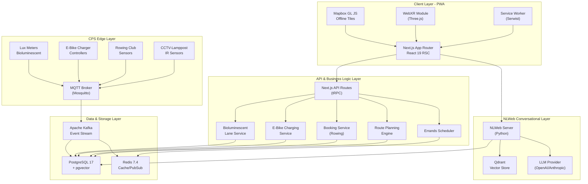

# PWA Technical Specification

[Tech Spec] **Project Planning Preamble** comprising: Guiding Questions, Written Problem Statement, Created Problem Tree, Objective Tree, SMART Objective, Risk Analysis, and Cost — alongside a 5-minute Pitch Deck aligned with 1st-UoL-Hillingdon-Hayes-Impact-Project--Planning-Sheet-2--v260211a.pdf.

# 0. Canal Corridor PWA Action Plan

## 0.1 Product Understanding

The proposed solution is a Connected Canal Corridor GovTech SuperApp as a self-contained NLWeb-enabled PWA (Progressive Web App) with additional services and solutions [such as: weekly-bookable Rowing Canoe Club sessions and multiple e-bike charging stations with cycling lanes of Bioluminescent Paints] designed for Hayes Town Centre and the 3-mile towpath along the Grand Union Canal within the Hillingdon Council area. It addresses fragmented information, safety concerns, poor lighting visibility, and underused community amenities by integrating dynamic route planning, AI-personalised errand scheduling, XR-based immersive navigation, real-time incident reporting, live weather alerts, and cyber-physical integration of solar-powered CCTV lampposts into a single scalable platform. By connecting infrastructure, environmental data, council services, local businesses, and residents into one unified SuperApp ecosystem, the solution transforms the canal corridor into a smart, safe, accessible, and economically vibrant digital urban corridor aligned with sustainable regeneration goals.

### 0.1.1 Core Product Vision

The envisioned platform product is a **GovTech SuperApp Ecosystem Platform** — transforming the previously specified Dart/Flutter native application into a **self-contained NLWeb-enabled Progressive Web App (PWA)** with expanded CPS Edge services. The platform remains a localised Gov-as-a-Product (GaaP) solution designed for the Hayes Town Centre and Grand Union Canal corridor within the London Borough of Hillingdon, targeting the "Smart Airport Hub Suburbia" context of Hayes & Harlington proximate to Heathrow Airport.

The fundamental architectural shift replaces the Flutter/Dart cross-platform mobile shell with a **Next.js 15 TypeScript PWA** integrated with **NLWeb** (https://github.com/nlweb-ai/NLWeb) — an open protocol and toolset that simplifies building conversational AI interfaces for websites using Schema.org structured data, MCP (Model Context Protocol), and LLM-powered natural language endpoints. This enables the platform to function as both a human-facing conversational web application and an AI-agent-accessible MCP server.

The refactored platform additionally introduces three **new CPS Edge services/solutions**:
- **Weekly-Bookable Rowing Canoe Club Sessions** — A session management and booking system for canal-based rowing and canoeing activities on the Paddington Arm
- **Multiple E-Bike Charging Stations** — IoT-integrated smart charging infrastructure management for e-bikes deployed at key points along the towpath corridor
- **Cycling Lanes with Bioluminescent Paints** — Photoluminescent lane marking monitoring, condition tracking, and luminosity status reporting for solar-charged glow-in-the-dark cycling path markings.


**Functional Requirements (Retained and Enhanced from Original):**

- **Dynamic Optimal Route Planning Engine** — Multi-modal route calculation (walking, running, cycling) from Hayes & Harlington station to canal corridor amenities, now served through the NLWeb conversational interface enabling natural language route queries
- **NLWeb Conversational Interface** — Replaces the Flutter-based UI with a browser-native conversational endpoint that leverages Schema.org structured data and MCP protocol, enabling users to ask natural language questions about routes, amenities, and services
- **WebXR Tour e-Guide Module** — Extended reality navigation using the browser-native WebXR API instead of Unity, with AR wayfinding markers and points of interest along the Hillingdon Trail Walk 2
- **CPS Integration Layer** — Management dashboard and data ingestion for solar-powered, IR-sensor-triggered, battery-included CCTV-lamppost infrastructure, now expanded with rowing club, e-bike charging, and bioluminescent lane monitoring
- **Weekly-Bookable Rowing Canoe Club Sessions** — Calendar-based booking system for canal rowing/canoeing with session capacity management, weather-dependent availability, and equipment allocation
- **E-Bike Charging Station Management** — Real-time monitoring of charging station availability, power levels, usage analytics, and fault reporting along the canal corridor
- **Bioluminescent Paint Cycling Lane Monitoring** — Condition tracking of photoluminescent lane markings including luminosity decay measurement, maintenance scheduling, and recharge cycle reporting
- **AI-Personalised Errands Scheduler** — Scheduling itinerary autonomy system with optimal routing via NLWeb natural language query
- **Incident Reporting System** — Real-time community-sourced incident reporting with geolocation tagging
- **Live Weather & Environment Alerting** — Met Office API integration for real-time towpath conditions
- **Community Partners Directory** — Searchable directory served through NLWeb conversational endpoints
- **Amenities Information Service** — Real-time open/close status with NLWeb natural language querying
- **Planning Sheet Auto-Documentation Engine** — Fully completed project planning documentation with preamble sub-sections
- **5-Minute Pitch Deck Generator** — Structured pitch content aligned with Brunel University Impact Challenge marking criteria

**Non-Functional Requirements:**

- **Performance** — PWA initial load under 3 seconds on 3G; route calculations completed within 2 seconds; WebXR overlay rendering at minimum 30 FPS; Lighthouse PWA score of 100
- **Offline-First Architecture** — Service worker caching with IndexedDB for offline data access along the canal towpath's variable connectivity zones
- **Scalability** — Architecture must support scaling from the initial 3-mile Hayes Towpath corridor to the full 20-mile Hillingdon Trail
- **Security** — GDPR-compliant data handling; encrypted CPS telemetry; UK Surveillance Camera Code of Practice compliance
- **Accessibility** — WCAG 2.1 AA compliance; multi-language support for Hayes community demographics (English, Punjabi, Hindi, Urdu, Polish)
- **Installability** — PWA manifest enabling home screen installation on mobile devices without app store dependency
- **Sustainability** — Alignment with Hillingdon Council Strategy 2022-2026 goals; bioluminescent paints reducing energy consumption compared to traditional lighting

**Implicit Requirements Surfaced:**

- **NLWeb Vector Store Integration** — The NLWeb layer requires a vector database (e.g., Qdrant or PostgreSQL pgvector) to store embedded representations of amenity data, community partner listings, and trail waypoints for semantic search
- **Schema.org Structured Data** — All platform content (routes, amenities, POIs, community partners, rowing sessions, charging stations) must be published in Schema.org JSON-LD format to power the NLWeb conversational layer
- **MCP Server Endpoint** — Every NLWeb instance acts as an MCP server, requiring the PWA to expose a standardised `ask` method for AI agent interoperability
- **PWA Service Worker Strategy** — Cache-first for static assets and trail data; network-first for real-time CPS telemetry and booking availability; stale-while-revalidate for amenity information
- **Bioluminescent Lane Sensor Integration** — Photoluminescent paint condition monitoring requires new IoT sensors (lux meters) integrated into the CPS lamppost network

### 0.1.2 User Instructions Interpretation

**CRITICAL DIRECTIVES CAPTURED:**

- **Technology Stack Replacement:** The user explicitly directs replacing the Dart/Flutter cross-platform app with a self-contained NLWeb-enabled PWA. This eliminates the Flutter SDK, Dart language, Unity XR engine, and ARCore/ARKit dependencies, replacing them with Next.js, TypeScript, WebXR API, and the NLWeb protocol stack
- **NLWeb Integration:** The user specifies NLWeb (https://github.com/nlweb-ai/NLWeb) as a core technology. NLWeb is an open protocol developed by Microsoft that enables natural language interfaces for websites using Schema.org data, LLMs, and vector databases, with native MCP support for AI agent accessibility
- **New CPS Edge Services:** Three additional CPS modules must be implemented:
  - Weekly-bookable Rowing Canoe Club sessions (booking + scheduling)
  - Multiple e-bike charging stations (IoT monitoring + availability)
  - Cycling lanes with bioluminescent paints (condition monitoring + luminosity tracking)
- **Tech Spec Preamble Structure:** The specification must begin with seven structured planning sub-sections: (1) Guiding Questions, (2) Written Problem Statement, (3) Created Problem Tree, (4) Objective Tree, (5) SMART Objective, (6) Risk Analysis, (7) Cost
- **5-Minute Pitch Deck:** A structured pitch presentation must be included, aligned with the enclosed Planning Sheet 2 (v260211a) which specifies persona creation, storyboard, marking criteria (Understanding the problem, Quality of the idea, Research and local insight, Feasibility and scalability, Pitch delivery), and judge question preparation
- **Deployment Context:** Brunel University of London Impact Challenge (2nd-25th February 2026) in partnership with Hillingdon Council, team "Urban Change Collective"

**User Example (preserved exactly):** "refactor it to replace the Dart Flutter App by a self-contained NLWeb-enabled PWA (Progressive Web App) with additional CPS Edge services/solutions of weekly-bookable Rowing Canoe Club sessions and multiple e-bike charging stations with cycling lanes of Bioluminescent Paints"

**User Example (preserved exactly):** "start the Tech Spec preamble with sub-sections on: 1- Guiding Questions 2- Written Problem Statement 3- Created Problem Tree 4- Objective Tree 5- SMART Objective 6- Risk Analysis 7- Cost; alongside a (5 minutes) Pitch Deck"

### 0.1.3 Product Type Classification

- **Product Category:** GovTech NLWeb-Enabled PWA — a self-contained, installable progressive web application with conversational AI interface, real-time CPS IoT integration, WebXR capabilities, and expanded recreational/sustainable transport edge services
- **Target Users:**
  - **Residents** — 15,000 Hayes Town Ward residents accessing safe routes, booking rowing sessions, locating e-bike charging, and navigating bioluminescent cycling lanes
  - **Visitors** — Tourists, Elizabeth Line commuters, and leisure users discovering the Hayes Towpath via natural language queries through the NLWeb interface
  - **Field Workers** — Council maintenance staff and Canal & River Trust volunteers managing CPS assets, rowing club sessions, e-bike stations, and lane condition monitoring
  - **AI Agents** — External AI assistants and MCP-compatible agents querying the platform's structured data endpoints
- **Scale Expectations:** Production-ready MVP scoped to the 3-mile Hayes Towpath corridor with PWA installability and offline capability, designed for extensibility to the full 20-mile Hillingdon Trail
- **Maintenance and Evolution:** The PWA architecture eliminates app store approval dependencies, enabling continuous deployment of updates. NLWeb's Schema.org foundation ensures long-term data portability and AI ecosystem interoperability


## 0.2 Background Research


### 0.2.1 Technology Research

Web search research conducted includes:

- **NLWeb Protocol & Architecture:** <cite index="3-3">NLWeb simplifies the process of building conversational interfaces for websites.</cite> <cite index="3-4">It natively supports MCP (Model Context Protocol), allowing the same natural language APIs to serve both humans and AI agents.</cite> <cite index="5-25">Vector stores supported include Qdrant, Snowflake, Milvus, Azure AI Search, Elasticsearch, Postgres, and Cloudflare AutoRAG, with LLM support for OpenAI, DeepSeek, Gemini, Anthropic, Inception, and HuggingFace.</cite> <cite index="11-10">Microsoft's goal is for NLWeb to be the fastest and easiest way to effectively turn your website into an AI app.</cite> This protocol directly replaces the Flutter UI layer with a conversational-first web interface built on existing Schema.org structured data.

- **PWA Offline-First Architecture:** <cite index="26-6,26-7">Progressive Web Apps (PWAs) are web applications that deliver native-like experiences to users, combining the best of both web and mobile applications.</cite> <cite index="23-8,23-9">Service workers are a virtual proxy between the browser and the network, making it possible to properly cache the assets of a website and make them available when the user's device is offline.</cite> This is critical for the Hayes Towpath's variable mobile connectivity. The PWA approach uses Cache API for static assets and IndexedDB for structured offline data.

- **Next.js 15 PWA Integration:** <cite index="44-7,44-8">For offline support in Next.js PWAs, Serwist (a Workbox fork) with Next.js is a recommended option for service worker integration.</cite> <cite index="48-1">Next.js 15 introduces React 19 support, caching improvements, and a stable release for Turbopack in development.</cite> The framework provides built-in PWA manifest support via `app/manifest.ts` and server-side rendering for optimal first-load performance.

- **Bioluminescent / Photoluminescent Cycling Lanes:** <cite index="13-1,13-2">Bioluminescent paint is particularly effective for marking pedestrian walkways and bicycle lanes, providing clear guidance without the harsh glare of traditional lighting.</cite> <cite index="21-10">Photoluminescent signage is an economical solution — 50 times less expensive than street lighting.</cite> <cite index="14-2,14-3">LuminoKrom has been adopted in many countries, with pilot projects and permanent installations in European countries such as France, Belgium and Switzerland.</cite> This technology directly supports the canal corridor's poor-lighting challenges documented in the original specification.

- **E-Bike Charging Infrastructure UK:** <cite index="41-1">Collaborations between organisations like Sustrans and Bosch have led to the installation of e-bike charging points along the National Cycle Network.</cite> <cite index="33-21,33-22">With the rapid growth of e-bike use across the UK, Falco designs, manufactures and installs a complete range of e-bike charging stands, racks, lockers and shelters.</cite> Smart charging stations with IoT monitoring and RFID/app-based access control are now standard in UK council deployments.

- **Smart City Corridor Platforms:** The original research on Chattanooga's MLK Smart Corridor, Singapore's ODP, and Omniflow solar-powered smart lampposts remains relevant and is carried forward. These reference architectures inform the expanded CPS edge services for rowing, e-bike, and bioluminescent lane monitoring.

### 0.2.2 Architecture Pattern Research

- **NLWeb as Conversational Web Layer:** <cite index="5-24">NLWeb is to MCP/A2A what HTML is to HTTP.</cite> The protocol provides a standardised `ask` method for natural language queries, returning JSON responses in Schema.org format. <cite index="9-14,9-15,9-16">NLWeb architecture enables natural language interfaces by combining structured web data with AI models. The system is technology-agnostic, supporting various LLMs, vector databases, and deployment platforms.</cite> For the canal corridor platform, NLWeb replaces the Flutter UI with a conversational-first approach where users query amenities, routes, and services in natural language.

- **PWA SuperApp Pattern:** The original Flutter-based SuperApp micro-frontend pattern translates to a Next.js App Router modular architecture where each service domain (route planning, WebXR guide, CPS dashboard, rowing booking, e-bike stations, bioluminescent lanes) operates as an independent route group within the PWA shell. Service workers provide the offline-first capability that the Flutter offline cache service previously delivered.

- **Expanded CPS Edge-Fog-Cloud Model:** The original edge-fog-cloud continuum model for CCTV-lampposts is extended with three new edge node types: rowing session sensors (occupancy/weather), e-bike charging station controllers (power/availability), and bioluminescent lane lux sensors (luminosity/condition). All new CPS devices publish to the existing MQTT/Kafka telemetry pipeline.

- **WebXR Replacing Unity:** The browser-native WebXR Device API replaces Unity AR Foundation for the XR Tour e-Guide module. This eliminates the Unity/Flutter platform channel bridge, reduces application size, and enables AR experiences directly within the PWA without requiring a separate native rendering engine.

### 0.2.3 Dependency and Tool Research

**Latest Stable Versions of Proposed Technologies:**

| Technology | Version | Purpose |
|-----------|---------|---------|
| Next.js | 15.x | PWA framework with App Router and RSC |
| React | 19.x | UI component library |
| TypeScript | 5.7.x | Type-safe development (client and server) |
| NLWeb | Latest (Python) | Conversational AI interface protocol |
| PostgreSQL | 17.x + pgvector | Relational DB with vector embeddings |
| Redis | 7.4.x | Caching and real-time pub/sub |
| Apache Kafka | 3.9.x | CPS telemetry event streaming |
| MQTT (Mosquitto) | 2.0.x | IoT/CPS lightweight messaging |
| Qdrant | Latest | Vector store for NLWeb semantic search |
| Docker | 27.x | Containerisation |
| Kubernetes | 1.32.x | Container orchestration |
| Terraform | 1.10.x | Infrastructure as Code |
| Serwist | Latest | Service worker tooling for Next.js PWA |

**Development Tool Recommendations:**

- **IDE:** VS Code with TypeScript, ESLint, and Tailwind CSS IntelliSense extensions
- **API Design:** OpenAPI 3.1 specification with Swagger UI
- **Mapping:** Mapbox GL JS for vector tile rendering with offline tile caching
- **WebXR:** Three.js + WebXR Device API for browser-native AR overlays
- **Weather API:** Met Office DataPoint API (UK-specific)
- **NLWeb Vector Store:** Qdrant (lightweight, self-hostable) or PostgreSQL pgvector extension
- **Testing:** Vitest for unit tests, Playwright for E2E and PWA testing, Cypress for integration
- **CI/CD:** GitHub Actions with Lighthouse CI for PWA score monitoring


## 0.1 Product Understanding


### 0.1.1 Core Product Vision

Our 1st envisioned platform product is a **refactored Connected Canal Corridor Amenities Information GovTech SuperApp Ecosystem Platform** — transforming the previously specified Dart/Flutter native application into a **self-contained NLWeb-enabled Progressive Web App (PWA)** with expanded CPS Edge services. The platform is a localised eGov-as-a-Product (eGaaP) solution for the Hayes Town Centre and Grand Union Canal corridor within the London Borough of Hillingdon.

The architectural shift replaces Flutter/Dart with a **Next.js 15 TypeScript PWA** integrated with **NLWeb** (https://github.com/nlweb-ai/NLWeb) — an open protocol enabling conversational AI interfaces using Schema.org structured data, MCP (Model Context Protocol), and LLM-powered natural language endpoints. The platform functions as both a human-facing conversational web app and an AI-agent-accessible MCP server.

Three **new CPS Edge services** are introduced:
- **Weekly-Bookable Rowing Canoe Club Sessions** — Session management and booking for canal rowing/canoeing on the Paddington Arm
- **Multiple E-Bike Charging Stations** — IoT-integrated smart charging infrastructure management along the towpath corridor
- **Cycling Lanes with Bioluminescent Paints** — Photoluminescent lane marking monitoring, luminosity status reporting, and maintenance cycle tracking

The Tech Spec begins with a structured **project planning preamble** (Guiding Questions, Written Problem Statement, Problem Tree, Objective Tree, SMART Objective, Risk Analysis, Cost) alongside a 5-minute Pitch Deck for the Brunel University Impact Challenge.

**Functional Requirements:**

- **NLWeb Conversational Interface** — Replaces Flutter UI with conversational endpoint leveraging Schema.org and MCP for natural language queries about routes, amenities, and services
- **Dynamic Optimal Route Planning Engine** — Multi-modal route calculation served through NLWeb conversational queries
- **WebXR Tour e-Guide Module** — Browser-native WebXR API replacing Unity for AR wayfinding along Hillingdon Trail Walk 2
- **CPS Integration Layer** — Expanded dashboard for CCTV-lampposts, rowing club sensors, e-bike charging, and bioluminescent lane monitoring
- **Rowing Club Booking System** — Calendar-based session booking with capacity management and weather-dependent availability
- **E-Bike Charging Management** — Real-time monitoring of station availability, power levels, usage analytics, and fault reporting
- **Bioluminescent Lane Monitoring** — Luminosity decay measurement, maintenance scheduling, and recharge cycle reporting
- **AI-Personalised Errands Scheduler** — Scheduling itinerary system with optimal routing via NLWeb query
- **Incident Reporting, Weather Alerting, Community Directory, Amenities Service** — Retained and enhanced from original spec with NLWeb endpoints

**Non-Functional Requirements:**

- **Performance** — PWA initial load under 3s on 3G; route calculations within 2s; Lighthouse PWA score of 100
- **Offline-First** — Service worker caching with IndexedDB for variable connectivity zones along the towpath
- **Scalability** — Extensible from 3-mile Hayes Towpath to full 20-mile Hillingdon Trail
- **Security** — GDPR-compliant; UK Surveillance Camera Code compliance; encrypted CPS telemetry
- **Accessibility** — WCAG 2.1 AA; multi-language (English, Punjabi, Hindi, Urdu, Polish)
- **Installability** — PWA manifest for home screen installation without app store dependency

**Implicit Requirements Surfaced:**

- **NLWeb Vector Store** — Requires Qdrant or pgvector for semantic search over amenity data
- **Schema.org JSON-LD** — All content must be published in structured format to power NLWeb
- **MCP Server Endpoint** — PWA exposes standardised `ask` method for AI agent interoperability
- **Bioluminescent Sensor Integration** — Lux meters integrated into CPS lamppost network for lane monitoring

### 0.1.2 User Instructions Interpretation

**CRITICAL DIRECTIVES CAPTURED:**

- **Technology Stack Replacement:** Replace Dart/Flutter with a self-contained NLWeb-enabled PWA — eliminating Flutter SDK, Dart, Unity XR, ARCore/ARKit in favour of Next.js, TypeScript, WebXR API, and NLWeb protocol
- **NLWeb Integration:** User specifies NLWeb (https://github.com/nlweb-ai/NLWeb) as core technology — an open protocol by Microsoft enabling natural language interfaces using Schema.org, LLMs, and vector databases with native MCP support
- **Three New CPS Edge Services:** Weekly-bookable rowing sessions, e-bike charging stations, bioluminescent cycling lanes
- **Tech Spec Preamble:** Seven structured planning sub-sections required before technical content
- **5-Minute Pitch Deck:** Aligned with Brunel Impact Challenge Planning Sheet 2 (v260211a)
- **Deployment Context:** Brunel University of London Impact Challenge (Feb 2026), Hillingdon Council partnership, team "Urban Change Collective"

**User Example (preserved exactly):** "refactor it to replace the Dart Flutter App by a self-contained NLWeb-enabled PWA (Progressive Web App) with additional CPS Edge services/solutions of weekly-bookable Rowing Canoe Club sessions and multiple e-bike charging stations with cycling lanes of Bioluminescent Paints"

**User Example (preserved exactly):** "start the Tech Spec preamble with sub-sections on: 1- Guiding Questions 2- Written Problem Statement 3- Created Problem Tree 4- Objective Tree 5- SMART Objective 6- Risk Analysis 7- Cost; alongside a (5 minutes) Pitch Deck"

### 0.1.3 Product Type Classification

- **Product Category:** GovTech NLWeb-Enabled PWA — installable progressive web app with conversational AI, real-time CPS IoT integration, WebXR, and recreational/sustainable transport edge services
- **Target Users:** Residents (15,000 Hayes Ward), visitors and commuters, council field workers, and external AI agents via MCP
- **Scale Expectations:** Production-ready MVP for 3-mile Hayes Towpath, extensible to full 20-mile Hillingdon Trail
- **Maintenance:** PWA architecture eliminates app store dependencies; NLWeb Schema.org foundation ensures long-term AI ecosystem interoperability


## 0.3 Technical Architecture Design


### 0.3.1 Technology Stack Selection

| Layer | Technology | Version | Rationale |
|-------|-----------|---------|-----------|
| **Primary Language** | TypeScript | 5.7.x | Type safety across client/server; replaces Dart with broader ecosystem support |
| **PWA Framework** | Next.js | 15.x | App Router with React Server Components, built-in PWA manifest via `app/manifest.ts`, Turbopack for fast dev builds |
| **UI Library** | React | 19.x | Server Components for reduced client JS; Suspense for streaming; concurrent rendering |
| **Styling** | Tailwind CSS | 4.x | Utility-first responsive design; optimised CSS output for PWA performance budget |
| **NLWeb Protocol** | NLWeb (Python) | Latest | Microsoft's open protocol for conversational AI over Schema.org data with native MCP support |
| **NLWeb LLM** | OpenAI / Anthropic | Latest | LLM backend for NLWeb natural language processing |
| **Vector Store** | Qdrant | Latest | Lightweight, self-hostable vector database for NLWeb semantic search embeddings |
| **Primary Database** | PostgreSQL | 17.x + pgvector | Relational data (bookings, users, amenities) with vector extension for alternative embedding storage |
| **Cache / Real-time** | Redis | 7.4.x | Session caching, real-time pub/sub for CPS telemetry alerts |
| **Event Streaming** | Apache Kafka | 3.9.x | CPS telemetry ingestion from MQTT edge devices at scale |
| **IoT Messaging** | MQTT (Mosquitto) | 2.0.x | Lightweight pub/sub for edge sensors (rowing, e-bike, lux meters) |
| **Mapping** | Mapbox GL JS | 3.x | Vector tile rendering with offline tile pack support for towpath maps |
| **XR Engine** | Three.js + WebXR API | Latest | Browser-native AR replacing Unity; no native dependencies |
| **Service Workers** | Serwist | Latest | Workbox fork optimised for Next.js PWA offline caching strategies |
| **API Layer** | Next.js API Routes + tRPC | Latest | Type-safe API endpoints with end-to-end TypeScript type inference |
| **Auth** | NextAuth.js | 5.x | OAuth 2.0 / OIDC with council SSO integration |
| **Weather API** | Met Office DataPoint | v2 | UK-specific hyperlocal weather for Hayes corridor |
| **Containerisation** | Docker | 27.x | Consistent build/deploy across environments |
| **Orchestration** | Kubernetes | 1.32.x | Production container orchestration on Azure AKS |
| **IaC** | Terraform | 1.10.x | Infrastructure as Code for Azure cloud resources |
| **CI/CD** | GitHub Actions | N/A | Automated build, test, Lighthouse CI, and deploy pipelines |

### 0.3.2 Architecture Pattern

**Overall Pattern:** Modular PWA Monolith with NLWeb Conversational Layer and CPS Edge-Fog-Cloud Continuum

The architecture follows a **modular monolith** pattern for the Next.js PWA application (replacing the Flutter micro-frontend shell) with a dedicated **NLWeb Python sidecar** service providing the conversational AI layer.



**Data Flow Architecture:**

- **User Queries → NLWeb:** Natural language questions are routed to the NLWeb Python sidecar, which performs semantic search against Qdrant embeddings, retrieves matching Schema.org entities from PostgreSQL, and generates conversational responses via LLM
- **PWA UI → API Routes:** Structured interactions (booking rowing sessions, checking e-bike availability) use typed tRPC API routes for CRUD operations
- **CPS Telemetry → Kafka:** Edge devices (CCTV sensors, rowing occupancy, e-bike chargers, lux meters) publish via MQTT to Mosquitto, bridged to Kafka for durable event processing and storage
- **Offline → Service Worker:** The Serwist service worker implements cache-first (static assets, trail maps), network-first (real-time telemetry, booking availability), and stale-while-revalidate (amenity info) strategies

### 0.3.3 Integration Points

| Integration | Protocol | Purpose |
|------------|----------|---------|
| NLWeb ↔ LLM Provider | HTTPS REST | Natural language processing and response generation |
| NLWeb ↔ Qdrant | gRPC / HTTP | Vector similarity search for semantic queries |
| NLWeb ↔ MCP Clients | MCP Protocol | AI agent interoperability via standardised `ask` endpoint |
| PWA ↔ Met Office DataPoint | HTTPS REST | Real-time weather data for towpath conditions |
| PWA ↔ Mapbox | HTTPS + Tile Protocol | Vector tile maps with offline tile pack support |
| CPS Edge ↔ MQTT Broker | MQTT v5 | Lightweight telemetry from IoT sensors |
| MQTT Broker ↔ Kafka | Kafka Connect | Bridge IoT messages to event streaming |
| PWA ↔ Council SSO | OAuth 2.0 / OIDC | Staff authentication for admin dashboard |
| E-Bike Stations ↔ API | HTTPS REST + WebSocket | Real-time charging status and fault alerts |
| Rowing Sensors ↔ API | MQTT → Kafka → API | Session occupancy and weather conditions |
| Lux Sensors ↔ API | MQTT → Kafka → API | Bioluminescent paint luminosity readings |

**Authentication & Authorization:**
- **Public Users:** Anonymous access to NLWeb conversational queries, route planning, and amenity browsing; optional account creation for rowing session booking
- **Registered Users:** Email/OAuth login via NextAuth.js for booking management, personalised errands, and incident reporting
- **Council Staff:** Council SSO (OIDC) for admin dashboard access to CPS monitoring, booking management, and maintenance scheduling
- **AI Agents:** API key-based authentication for MCP endpoint access


## 0.4 Repository Structure Planning


### 0.4.1 Proposed Repository Structure

```
/
├── src/                                    # Next.js PWA application source
│   ├── app/                               # Next.js App Router (pages and layouts)
│   │   ├── layout.tsx                     # Root layout with PWA meta tags
│   │   ├── manifest.ts                   # PWA manifest configuration
│   │   ├── page.tsx                       # Landing page with NLWeb chat widget
│   │   ├── (auth)/                        # Authentication route group
│   │   │   ├── login/page.tsx            # Login page
│   │   │   └── register/page.tsx         # Registration page
│   │   ├── (dashboard)/                   # Council staff admin dashboard
│   │   │   ├── layout.tsx                # Dashboard layout with sidebar
│   │   │   ├── cps/page.tsx              # CPS telemetry overview
│   │   │   ├── rowing/page.tsx           # Rowing session management
│   │   │   ├── ebike/page.tsx            # E-bike station monitoring
│   │   │   └── bioluminescent/page.tsx   # Lane condition dashboard
│   │   ├── routes/                        # Route planning module
│   │   │   ├── page.tsx                  # Route search and results
│   │   │   └── [routeId]/page.tsx        # Individual route detail
│   │   ├── webxr/                         # WebXR tour e-guide
│   │   │   └── page.tsx                  # AR wayfinding experience
│   │   ├── rowing/                        # Public rowing booking
│   │   │   ├── page.tsx                  # Session calendar and booking
│   │   │   └── [sessionId]/page.tsx      # Session detail and confirmation
│   │   ├── ebike/                         # Public e-bike station finder
│   │   │   └── page.tsx                  # Station map and availability
│   │   ├── cycling-lanes/                 # Bioluminescent lane status
│   │   │   └── page.tsx                  # Lane condition map
│   │   ├── incidents/                     # Incident reporting
│   │   │   └── page.tsx                  # Report and view incidents
│   │   ├── errands/                       # AI-personalised errands
│   │   │   └── page.tsx                  # Errand scheduler interface
│   │   ├── community/                     # Community partners directory
│   │   │   └── page.tsx                  # Searchable directory
│   │   └── api/                           # API route handlers
│   │       ├── trpc/[trpc]/route.ts      # tRPC catch-all handler
│   │       ├── nlweb/route.ts            # NLWeb proxy endpoint
│   │       ├── mcp/route.ts              # MCP server endpoint
│   │       └── webhooks/                  # External webhook receivers
│   │           ├── weather/route.ts      # Met Office alerts
│   │           └── telemetry/route.ts    # CPS telemetry ingress
│   ├── components/                        # Shared React components
│   │   ├── ui/                            # Base UI primitives (buttons, cards, inputs)
│   │   ├── chat/                          # NLWeb conversational widget
│   │   │   ├── ChatWidget.tsx            # Main chat interface component
│   │   │   └── MessageBubble.tsx         # Individual message display
│   │   ├── map/                           # Mapbox map components
│   │   │   ├── CanalMap.tsx              # Main corridor map
│   │   │   └── RouteOverlay.tsx          # Route visualisation layer
│   │   ├── xr/                            # WebXR components
│   │   │   └── ARWayfinder.tsx           # AR navigation overlay
│   │   ├── booking/                       # Rowing booking components
│   │   │   ├── SessionCalendar.tsx       # Weekly calendar view
│   │   │   └── BookingForm.tsx           # Session booking form
│   │   ├── ebike/                         # E-bike station components
│   │   │   ├── StationCard.tsx           # Station status card
│   │   │   └── ChargingStatus.tsx        # Real-time charging indicator
│   │   └── bioluminescent/                # Lane monitoring components
│   │       ├── LuminosityGauge.tsx       # Lux level visualisation
│   │       └── LaneConditionMap.tsx      # Lane segment status map
│   ├── lib/                               # Shared libraries and utilities
│   │   ├── trpc/                          # tRPC client and server setup
│   │   │   ├── client.ts                 # tRPC React client
│   │   │   ├── server.ts                # tRPC server initialisation
│   │   │   └── routers/                  # tRPC procedure routers
│   │   │       ├── index.ts             # Root router composition
│   │   │       ├── routes.ts            # Route planning procedures
│   │   │       ├── rowing.ts            # Rowing booking procedures
│   │   │       ├── ebike.ts             # E-bike station procedures
│   │   │       ├── bioluminescent.ts    # Lane monitoring procedures
│   │   │       ├── incidents.ts         # Incident reporting procedures
│   │   │       ├── errands.ts           # Errand scheduling procedures
│   │   │       └── cps.ts              # CPS telemetry procedures
│   │   ├── db/                            # Database access layer
│   │   │   ├── client.ts                # Prisma/Drizzle client
│   │   │   ├── schema.ts               # Database schema definitions
│   │   │   └── migrations/              # Database migration files
│   │   ├── auth/                          # Authentication configuration
│   │   │   └── config.ts               # NextAuth.js setup
│   │   ├── nlweb/                         # NLWeb integration helpers
│   │   │   ├── client.ts               # NLWeb API client
│   │   │   └── schemas.ts              # Schema.org type definitions
│   │   ├── cps/                           # CPS telemetry processing
│   │   │   ├── mqtt-handler.ts          # MQTT message processing
│   │   │   └── kafka-consumer.ts        # Kafka event consumer
│   │   ├── weather/                       # Met Office API client
│   │   │   └── client.ts               # Weather data fetching
│   │   └── utils/                         # General utilities
│   │       ├── constants.ts             # Application constants
│   │       ├── exceptions.ts            # Custom error types
│   │       └── validators.ts            # Shared validation schemas (Zod)
│   ├── hooks/                             # Custom React hooks
│   │   ├── useNLWeb.ts                   # NLWeb chat interaction hook
│   │   ├── useGeolocation.ts             # GPS position hook
│   │   ├── useOffline.ts                 # Offline status detection
│   │   └── useWebXR.ts                   # WebXR session management
│   ├── styles/                            # Global styles
│   │   └── globals.css                   # Tailwind base + custom styles
│   └── workers/                           # Service worker source
│       └── sw.ts                         # Serwist service worker config
├── nlweb-server/                          # NLWeb Python sidecar service
│   ├── config.yaml                       # NLWeb configuration
│   ├── schema_data/                      # Schema.org JSON-LD data files
│   │   ├── amenities.jsonld             # Amenity structured data
│   │   ├── routes.jsonld                # Trail route data
│   │   ├── rowing_sessions.jsonld       # Rowing session data
│   │   ├── ebike_stations.jsonld        # E-bike station data
│   │   └── cycling_lanes.jsonld         # Bioluminescent lane data
│   ├── requirements.txt                  # Python dependencies
│   └── Dockerfile                        # NLWeb container definition
├── tests/                                 # Test suite
│   ├── unit/                             # Unit tests
│   │   ├── components/                  # React component tests
│   │   ├── lib/                         # Library function tests
│   │   └── api/                         # API route handler tests
│   ├── integration/                      # Integration tests
│   │   ├── nlweb/                       # NLWeb conversational tests
│   │   ├── booking/                     # Rowing booking flow tests
│   │   └── cps/                         # CPS telemetry pipeline tests
│   ├── e2e/                              # End-to-end Playwright tests
│   │   ├── pwa.spec.ts                  # PWA install and offline tests
│   │   ├── routing.spec.ts             # Route planning E2E tests
│   │   └── booking.spec.ts             # Rowing booking E2E tests
│   └── fixtures/                         # Test data and mocks
│       ├── amenities.json               # Mock amenity data
│       ├── telemetry.json               # Mock CPS telemetry
│       └── sessions.json                # Mock rowing sessions
├── docs/                                  # Documentation
│   ├── architecture/                     # Architecture decision records
│   │   └── adr-001-nlweb-pwa.md        # NLWeb PWA architecture decision
│   ├── api/                              # API documentation
│   │   └── openapi.yaml                # OpenAPI 3.1 specification
│   ├── preamble/                         # Project planning preamble
│   │   ├── guiding-questions.md         # Guiding Questions
│   │   ├── problem-statement.md         # Written Problem Statement
│   │   ├── problem-tree.md             # Created Problem Tree
│   │   ├── objective-tree.md           # Objective Tree
│   │   ├── smart-objectives.md         # SMART Objectives
│   │   ├── risk-analysis.md            # Risk Analysis
│   │   └── cost-analysis.md            # Cost Analysis
│   ├── pitch-deck/                       # 5-Minute Pitch Deck
│   │   ├── slides.md                    # Slide content and speaker notes
│   │   └── assets/                      # Pitch deck visual assets
│   └── guides/                           # Developer and user guides
│       ├── setup.md                     # Development environment setup
│       └── deployment.md               # Deployment guide
├── scripts/                               # Utility scripts
│   ├── setup.sh                          # Dev environment bootstrap
│   ├── seed-db.sh                        # Database seeding
│   ├── seed-nlweb.sh                     # NLWeb vector store seeding
│   └── deploy.sh                         # Deployment automation
├── config/                                # Environment configurations
│   ├── development/                      # Dev environment configs
│   ├── staging/                          # Staging configs
│   └── production/                       # Production configs
├── infrastructure/                        # IaC definitions
│   ├── terraform/                        # Terraform modules
│   │   ├── main.tf                      # Root Terraform config
│   │   ├── aks.tf                       # Azure Kubernetes Service
│   │   ├── postgres.tf                  # Azure Database for PostgreSQL
│   │   └── redis.tf                     # Azure Cache for Redis
│   └── k8s/                              # Kubernetes manifests
│       ├── deployment.yaml              # App deployment
│       ├── nlweb-deployment.yaml        # NLWeb sidecar deployment
│       └── ingress.yaml                 # Ingress controller config
├── .github/                               # GitHub configuration
│   └── workflows/                        # CI/CD workflows
│       ├── ci.yml                       # Build, lint, test pipeline
│       ├── lighthouse.yml               # PWA Lighthouse CI checks
│       └── deploy.yml                   # Deployment pipeline
├── package.json                           # Node.js dependencies
├── tsconfig.json                          # TypeScript configuration
├── tailwind.config.ts                     # Tailwind CSS configuration
├── next.config.ts                         # Next.js configuration
├── drizzle.config.ts                      # Database ORM configuration
├── Dockerfile                             # PWA app container definition
├── docker-compose.yml                     # Local dev orchestration
├── .env.example                           # Environment variable template
├── .gitignore                             # Git ignore rules
├── .eslintrc.json                         # ESLint configuration
├── .prettierrc                            # Prettier code formatting
└── README.md                              # Project documentation
```

### 0.4.2 File Path Specifications

**Core Application Files:**
- `src/app/layout.tsx` — Root PWA layout with meta tags, service worker registration, and NLWeb chat widget
- `src/app/manifest.ts` — PWA manifest (name, icons, theme, start_url, display: standalone)
- `src/app/page.tsx` — Landing page with hero, NLWeb conversational entry point, and corridor map
- `src/lib/trpc/routers/*.ts` — Type-safe API procedure definitions for each service domain
- `src/lib/db/schema.ts` — Drizzle ORM schema covering all entities (users, sessions, stations, lanes, incidents)
- `src/lib/nlweb/client.ts` — TypeScript client wrapping the NLWeb Python sidecar API

**New CPS Edge Service Files:**
- `src/lib/trpc/routers/rowing.ts` — Rowing session CRUD, booking, capacity checks, weather-gating
- `src/lib/trpc/routers/ebike.ts` — Station status queries, usage analytics, fault reporting
- `src/lib/trpc/routers/bioluminescent.ts` — Lux readings, maintenance scheduling, lane segment status
- `src/components/booking/SessionCalendar.tsx` — Weekly calendar with available rowing slots
- `src/components/ebike/StationCard.tsx` — Real-time e-bike charging station status display
- `src/components/bioluminescent/LuminosityGauge.tsx` — Photoluminescent lane brightness indicator

**NLWeb Sidecar Files:**
- `nlweb-server/config.yaml` — NLWeb configuration (LLM provider, vector store, Schema.org data paths)
- `nlweb-server/schema_data/*.jsonld` — Structured data files indexed for conversational search

**Entry Points:**
- `src/app/layout.tsx` — Application shell entry point (Next.js App Router)
- `src/workers/sw.ts` — Service worker entry point (Serwist)
- `src/app/api/trpc/[trpc]/route.ts` — tRPC API entry point
- `src/app/api/mcp/route.ts` — MCP server endpoint for AI agent access


## 0.5 Implementation Specifications


### 0.5.1 Core Components to Implement

**Component A: NLWeb Conversational Engine**
- **Purpose:** Provides the primary conversational AI interface replacing Flutter UI, handling natural language queries about routes, amenities, bookings, and CPS status via Schema.org structured data and LLM processing
- **Location:** `nlweb-server/` (Python sidecar) + `src/lib/nlweb/client.ts` (TypeScript proxy) + `src/components/chat/ChatWidget.tsx` (React UI)
- **Key Interfaces:** `POST /api/nlweb` (ask endpoint), `POST /api/mcp` (MCP server endpoint), `useNLWeb()` React hook
- **Dependencies:** Qdrant vector store, LLM provider (OpenAI/Anthropic), PostgreSQL Schema.org data

**Component B: PWA Shell & Service Worker**
- **Purpose:** Installable progressive web app shell with offline-first caching, background sync, and push notifications for the canal corridor's variable connectivity zones
- **Location:** `src/app/layout.tsx` (shell), `src/app/manifest.ts` (PWA config), `src/workers/sw.ts` (service worker)
- **Key Interfaces:** Cache API strategies, IndexedDB offline storage, Web Push API
- **Dependencies:** Serwist library, Next.js App Router

**Component C: Route Planning Engine**
- **Purpose:** Multi-modal optimal route calculation (walking, running, cycling) with NLWeb natural language query support and Mapbox visualisation
- **Location:** `src/lib/trpc/routers/routes.ts` (API), `src/app/routes/page.tsx` (UI), `src/components/map/RouteOverlay.tsx`
- **Key Interfaces:** `routes.calculate` tRPC procedure, `routes.getById` procedure
- **Dependencies:** Mapbox Directions API, PostgreSQL waypoint data, Met Office weather conditions

**Component D: Rowing Canoe Club Booking System**
- **Purpose:** Weekly session scheduling, capacity management, weather-gating, and equipment allocation for canal rowing and canoeing on the Paddington Arm
- **Location:** `src/lib/trpc/routers/rowing.ts` (API), `src/app/rowing/page.tsx` (UI), `src/components/booking/`
- **Key Interfaces:** `rowing.listSessions`, `rowing.book`, `rowing.cancel`, `rowing.checkWeather` tRPC procedures
- **Dependencies:** PostgreSQL (sessions, bookings), Met Office API (weather gates), MQTT (occupancy sensors)

**Component E: E-Bike Charging Station Service**
- **Purpose:** Real-time monitoring and management of multiple e-bike charging stations along the canal corridor, including availability tracking, power level reporting, usage analytics, and fault alerting
- **Location:** `src/lib/trpc/routers/ebike.ts` (API), `src/app/ebike/page.tsx` (UI), `src/components/ebike/`
- **Key Interfaces:** `ebike.listStations`, `ebike.getStatus`, `ebike.reportFault` tRPC procedures; WebSocket for real-time updates
- **Dependencies:** MQTT/Kafka (charger telemetry), PostgreSQL (station registry), Redis (real-time status cache)

**Component F: Bioluminescent Lane Monitoring Service**
- **Purpose:** Photoluminescent cycling lane condition tracking — luminosity decay measurement from embedded lux sensors, maintenance cycle scheduling, and recharge status reporting for solar-charged glow-in-the-dark lane markings
- **Location:** `src/lib/trpc/routers/bioluminescent.ts` (API), `src/app/cycling-lanes/page.tsx` (UI), `src/components/bioluminescent/`
- **Key Interfaces:** `bioluminescent.getLaneStatus`, `bioluminescent.getReadings`, `bioluminescent.scheduleMaintenance` tRPC procedures
- **Dependencies:** MQTT/Kafka (lux meter telemetry), PostgreSQL (lane segments, readings), Redis (real-time luminosity cache)

**Component G: WebXR Tour e-Guide**
- **Purpose:** Browser-native AR wayfinding along Hillingdon Trail Walk 2, replacing Unity AR Foundation with WebXR Device API and Three.js for point-of-interest overlays
- **Location:** `src/app/webxr/page.tsx` (UI), `src/components/xr/ARWayfinder.tsx`, `src/hooks/useWebXR.ts`
- **Key Interfaces:** WebXR Session API, `useWebXR()` hook for session management
- **Dependencies:** Three.js, GPS geolocation, POI data from PostgreSQL

**Component H: CPS Telemetry Aggregation Layer**
- **Purpose:** Unified ingestion pipeline for all CPS edge device telemetry — CCTV-lampposts, rowing sensors, e-bike chargers, and lux meters — via MQTT→Kafka→PostgreSQL
- **Location:** `src/lib/cps/mqtt-handler.ts`, `src/lib/cps/kafka-consumer.ts`, `src/app/(dashboard)/cps/page.tsx`
- **Key Interfaces:** MQTT topic subscriptions, Kafka consumer groups, `cps.getTelemetry` tRPC procedure
- **Dependencies:** Mosquitto MQTT broker, Apache Kafka, PostgreSQL, Redis pub/sub

### 0.5.2 Data Models and Schemas

**Core Entities:**

```mermaid
erDiagram
    USER ||--o{ BOOKING : makes
    USER ||--o{ INCIDENT : reports
    USER ||--o{ ERRAND : schedules
    ROWING_SESSION ||--o{ BOOKING : has
    ROWING_SESSION }o--|| WEATHER_CONDITION : depends_on
    EBIKE_STATION ||--o{ CHARGING_LOG : records
    EBIKE_STATION ||--o{ FAULT_REPORT : has
    LANE_SEGMENT ||--o{ LUX_READING : measures
    LANE_SEGMENT ||--o{ MAINTENANCE_RECORD : tracks
    ROUTE ||--o{ WAYPOINT : contains
    AMENITY ||--o{ OPERATING_HOURS : has
    CPS_DEVICE ||--o{ TELEMETRY_EVENT : emits

    USER {
        uuid id PK
        string email
        string name
        string role
        timestamp created_at
    }
    ROWING_SESSION {
        uuid id PK
        date session_date
        time start_time
        int duration_minutes
        int max_capacity
        int current_bookings
        string equipment_type
        boolean weather_cleared
        string status
    }
    BOOKING {
        uuid id PK
        uuid user_id FK
        uuid session_id FK
        string status
        timestamp booked_at
    }
    EBIKE_STATION {
        uuid id PK
        string name
        float latitude
        float longitude
        int total_ports
        int available_ports
        float power_level_pct
        string status
    }
    LANE_SEGMENT {
        uuid id PK
        string segment_name
        float start_lat
        float start_lng
        float end_lat
        float end_lng
        float length_meters
        date last_painted
        string paint_type
        string condition
    }
    LUX_READING {
        uuid id PK
        uuid segment_id FK
        float lux_value
        timestamp measured_at
    }
}
```

**Validation Rules:**
- Rowing bookings rejected when `current_bookings >= max_capacity` or `weather_cleared = false`
- E-bike station `status` transitions: `operational` → `degraded` → `offline` → `maintenance`
- Lux readings below 0.5 lux trigger automatic maintenance alerts for bioluminescent lane segments
- All timestamps stored in UTC; displayed in Europe/London timezone

### 0.5.3 API Specifications

**tRPC Router Procedures (Type-Safe):**

| Router | Procedure | Method | Purpose |
|--------|-----------|--------|---------|
| `rowing` | `listSessions` | query | List available rowing sessions by week |
| `rowing` | `book` | mutation | Book a rowing session (capacity-checked) |
| `rowing` | `cancel` | mutation | Cancel an existing booking |
| `rowing` | `checkWeather` | query | Weather gate check for session viability |
| `ebike` | `listStations` | query | List all e-bike charging stations with status |
| `ebike` | `getStatus` | query | Real-time status for a specific station |
| `ebike` | `reportFault` | mutation | Submit fault report for a station |
| `bioluminescent` | `getLaneStatus` | query | Current condition of all lane segments |
| `bioluminescent` | `getReadings` | query | Historical lux readings for a segment |
| `bioluminescent` | `scheduleMaintenance` | mutation | Schedule repainting for a segment |
| `routes` | `calculate` | query | Calculate optimal route between points |
| `incidents` | `create` | mutation | Submit geolocated incident report |
| `errands` | `schedule` | mutation | Create personalised errand itinerary |
| `cps` | `getTelemetry` | query | Aggregated CPS device telemetry |

**NLWeb Endpoints:**

| Endpoint | Method | Purpose |
|----------|--------|---------|
| `/api/nlweb` | POST | Natural language query processing |
| `/api/mcp` | POST | MCP-compliant AI agent access |

**Authentication:** Public queries require no auth; mutations require JWT via NextAuth.js; admin routes require council SSO OIDC token; MCP endpoint requires API key header.

### 0.5.4 User Interface Design

No Figma screens were provided for this project. The UI design follows the functional requirements derived from the original Flutter specification, now translated to a PWA context:

- **Conversational-First Landing:** Hero section with NLWeb chat widget as primary interaction; corridor map below fold
- **Route Planning View:** Mapbox GL map with multi-modal route overlays; natural language route input
- **Rowing Booking Calendar:** Weekly grid with session slots, capacity indicators, and weather status badges
- **E-Bike Station Map:** Mapbox markers with real-time availability pop-ups and charging level indicators
- **Bioluminescent Lane Map:** Colour-coded lane segments (green=bright, amber=fading, red=maintenance needed) overlaid on corridor map
- **WebXR View:** Full-screen AR camera feed with Three.js POI overlays and directional markers
- **Admin Dashboard:** Tabbed interface for CPS telemetry, booking management, station monitoring, and lane maintenance


## 0.6 Scope Definition


### 0.6.1 Explicitly In Scope

**Core Platform:**
- Next.js 15 PWA application with App Router, React 19 Server Components, and Tailwind CSS
- PWA manifest, service worker (Serwist), and offline-first caching strategies
- NLWeb Python sidecar with Qdrant vector store and LLM integration
- MCP server endpoint for AI agent interoperability
- Schema.org JSON-LD structured data for all platform content
- tRPC type-safe API layer for all service domains

**Retained Features (Refactored from Flutter):**
- Dynamic Optimal Route Planning Engine with Mapbox GL JS
- WebXR Tour e-Guide replacing Unity AR with Three.js + WebXR API
- CPS Integration Layer for CCTV-lamppost telemetry
- AI-Personalised Errands Scheduler
- Real-time Incident Reporting with geolocation
- Met Office weather integration and alerting
- Community Partners Directory with NLWeb search
- Amenities Information Service with open/close status

**New CPS Edge Services:**
- Weekly-bookable Rowing Canoe Club session management (calendar, booking, capacity, weather-gating, equipment allocation)
- Multiple E-Bike Charging Station monitoring (real-time availability, power levels, usage analytics, fault reporting)
- Bioluminescent Paint Cycling Lane monitoring (lux sensor readings, luminosity decay tracking, maintenance scheduling, recharge cycle reporting)

**Infrastructure:**
- Docker containerisation for PWA app and NLWeb sidecar
- Docker Compose for local development orchestration
- Kubernetes manifests for production deployment
- Terraform IaC for Azure cloud resources (AKS, PostgreSQL, Redis)
- GitHub Actions CI/CD with Lighthouse PWA scoring

**Data Layer:**
- PostgreSQL 17 with pgvector for relational data and vector embeddings
- Redis for caching, session management, and real-time pub/sub
- Apache Kafka for CPS telemetry event streaming
- MQTT broker (Mosquitto) for IoT edge device messaging
- Qdrant vector database for NLWeb semantic search

**Project Planning Preamble (Per User Directive):**
- Guiding Questions documentation
- Written Problem Statement
- Problem Tree diagram
- Objective Tree diagram
- SMART Objectives definition
- Risk Analysis matrix
- Cost breakdown estimate

**5-Minute Pitch Deck:**
- Structured presentation aligned with Brunel Impact Challenge criteria
- Persona creation and storyboard
- Judge question preparation

**Testing:**
- Unit tests for core business logic (Vitest)
- Integration tests for NLWeb, booking flows, and CPS pipeline
- E2E tests for PWA installation, offline behaviour, and critical user journeys (Playwright)
- Lighthouse CI automated PWA score validation

**Documentation:**
- README with setup instructions
- Architecture Decision Records
- OpenAPI 3.1 specification
- Developer setup and deployment guides

### 0.6.2 Explicitly Out of Scope

**Technology Exclusions (Replaced by Refactoring):**
- Dart language and Flutter SDK — fully replaced by TypeScript and Next.js
- Unity XR engine and AR Foundation — replaced by Three.js + WebXR API
- ARCore / ARKit native SDKs — replaced by browser-native WebXR
- Native app store distribution (Google Play, Apple App Store) — replaced by PWA installability
- Flutter-specific state management (Riverpod/Bloc) — replaced by React state and tRPC

**Feature Exclusions:**
- Full 20-mile Hillingdon Trail coverage — MVP scoped to 3-mile Hayes Towpath corridor only
- Advanced AI model training or fine-tuning — NLWeb uses pre-trained LLM providers
- Real-time video streaming from CCTV cameras — only telemetry metadata (motion events, status)
- Payment processing for rowing bookings — initial version uses free booking; payment integration deferred
- E-bike rental/sharing management — scope limited to charging station monitoring, not fleet management
- Custom bioluminescent paint formulation or procurement — scope limited to monitoring existing installations
- Multi-tenancy for other London boroughs — single-tenant Hillingdon deployment only
- Comprehensive load testing and performance benchmarking beyond Lighthouse CI
- Internationalisation (i18n) framework implementation — content initially in English; multi-language support documented as future enhancement
- Native mobile push notifications — Web Push API only within PWA capability
- Advanced analytics dashboards with historical trend analysis — basic real-time monitoring only in MVP
- Automated drone inspection of bioluminescent lanes — manual maintenance scheduling only


## 0.7 Deliverable Mapping


### 0.7.1 File Creation Plan

| File Path | Purpose | Content Type | Priority |
|-----------|---------|--------------|----------|
| `src/app/layout.tsx` | Root PWA layout with service worker registration | Source | High |
| `src/app/manifest.ts` | PWA manifest configuration (icons, theme, display) | Config | High |
| `src/app/page.tsx` | Landing page with NLWeb chat and corridor map | Source | High |
| `src/workers/sw.ts` | Serwist service worker with caching strategies | Source | High |
| `src/lib/db/schema.ts` | Drizzle ORM schema for all entities | Source | High |
| `src/lib/db/client.ts` | Database client initialisation | Source | High |
| `src/lib/trpc/server.ts` | tRPC server setup and context | Source | High |
| `src/lib/trpc/client.ts` | tRPC React client configuration | Source | High |
| `src/lib/trpc/routers/index.ts` | Root router composing all domain routers | Source | High |
| `src/lib/trpc/routers/routes.ts` | Route planning API procedures | Source | High |
| `src/lib/trpc/routers/rowing.ts` | Rowing booking API procedures | Source | High |
| `src/lib/trpc/routers/ebike.ts` | E-bike station API procedures | Source | High |
| `src/lib/trpc/routers/bioluminescent.ts` | Lane monitoring API procedures | Source | High |
| `src/lib/trpc/routers/incidents.ts` | Incident reporting API procedures | Source | High |
| `src/lib/trpc/routers/errands.ts` | Errand scheduling API procedures | Source | Medium |
| `src/lib/trpc/routers/cps.ts` | CPS telemetry API procedures | Source | High |
| `src/lib/nlweb/client.ts` | NLWeb sidecar API client wrapper | Source | High |
| `src/lib/nlweb/schemas.ts` | Schema.org TypeScript type definitions | Source | High |
| `src/lib/auth/config.ts` | NextAuth.js authentication setup | Source | High |
| `src/lib/cps/mqtt-handler.ts` | MQTT telemetry message processing | Source | High |
| `src/lib/cps/kafka-consumer.ts` | Kafka event consumer for CPS pipeline | Source | High |
| `src/lib/weather/client.ts` | Met Office DataPoint API client | Source | Medium |
| `src/lib/utils/constants.ts` | Application-wide constants | Source | Medium |
| `src/lib/utils/exceptions.ts` | Custom error types | Source | Medium |
| `src/lib/utils/validators.ts` | Zod validation schemas | Source | High |
| `src/components/chat/ChatWidget.tsx` | NLWeb conversational chat component | Source | High |
| `src/components/chat/MessageBubble.tsx` | Chat message display component | Source | High |
| `src/components/map/CanalMap.tsx` | Mapbox GL corridor map component | Source | High |
| `src/components/map/RouteOverlay.tsx` | Route visualisation layer | Source | High |
| `src/components/xr/ARWayfinder.tsx` | WebXR AR navigation overlay | Source | Medium |
| `src/components/booking/SessionCalendar.tsx` | Weekly rowing session calendar | Source | High |
| `src/components/booking/BookingForm.tsx` | Rowing session booking form | Source | High |
| `src/components/ebike/StationCard.tsx` | E-bike station status card | Source | High |
| `src/components/ebike/ChargingStatus.tsx` | Real-time charging level indicator | Source | High |
| `src/components/bioluminescent/LuminosityGauge.tsx` | Lux level visualisation gauge | Source | High |
| `src/components/bioluminescent/LaneConditionMap.tsx` | Lane segment condition map | Source | High |
| `src/hooks/useNLWeb.ts` | NLWeb chat interaction React hook | Source | High |
| `src/hooks/useGeolocation.ts` | GPS position tracking hook | Source | Medium |
| `src/hooks/useOffline.ts` | Offline status detection hook | Source | Medium |
| `src/hooks/useWebXR.ts` | WebXR session management hook | Source | Medium |
| `src/app/routes/page.tsx` | Route planning page | Source | High |
| `src/app/rowing/page.tsx` | Rowing booking page | Source | High |
| `src/app/ebike/page.tsx` | E-bike station finder page | Source | High |
| `src/app/cycling-lanes/page.tsx` | Bioluminescent lane status page | Source | High |
| `src/app/webxr/page.tsx` | WebXR AR tour page | Source | Medium |
| `src/app/incidents/page.tsx` | Incident reporting page | Source | Medium |
| `src/app/errands/page.tsx` | Errand scheduler page | Source | Medium |
| `src/app/community/page.tsx` | Community partners directory | Source | Medium |
| `src/app/(dashboard)/layout.tsx` | Admin dashboard layout | Source | Medium |
| `src/app/(dashboard)/cps/page.tsx` | CPS telemetry overview | Source | Medium |
| `src/app/api/trpc/[trpc]/route.ts` | tRPC catch-all API handler | Source | High |
| `src/app/api/nlweb/route.ts` | NLWeb proxy endpoint | Source | High |
| `src/app/api/mcp/route.ts` | MCP server endpoint | Source | High |
| `nlweb-server/config.yaml` | NLWeb sidecar configuration | Config | High |
| `nlweb-server/schema_data/amenities.jsonld` | Amenity Schema.org data | Data | High |
| `nlweb-server/schema_data/routes.jsonld` | Route Schema.org data | Data | High |
| `nlweb-server/schema_data/rowing_sessions.jsonld` | Rowing session data | Data | High |
| `nlweb-server/schema_data/ebike_stations.jsonld` | E-bike station data | Data | High |
| `nlweb-server/schema_data/cycling_lanes.jsonld` | Lane segment data | Data | High |
| `nlweb-server/requirements.txt` | NLWeb Python dependencies | Config | High |
| `nlweb-server/Dockerfile` | NLWeb container definition | Config | High |
| `tests/unit/components/` | React component unit tests | Test | Medium |
| `tests/unit/lib/` | Library function unit tests | Test | Medium |
| `tests/integration/nlweb/` | NLWeb conversational tests | Test | Medium |
| `tests/integration/booking/` | Rowing booking flow tests | Test | Medium |
| `tests/e2e/pwa.spec.ts` | PWA install and offline E2E tests | Test | High |
| `tests/e2e/booking.spec.ts` | Rowing booking E2E tests | Test | Medium |
| `docs/preamble/` | Project planning preamble docs | Documentation | High |
| `docs/pitch-deck/slides.md` | 5-minute pitch deck content | Documentation | High |
| `docs/architecture/adr-001-nlweb-pwa.md` | Architecture decision record | Documentation | Medium |
| `docs/api/openapi.yaml` | OpenAPI 3.1 specification | Documentation | Medium |
| `infrastructure/terraform/*.tf` | Azure IaC definitions | Config | Medium |
| `infrastructure/k8s/*.yaml` | Kubernetes deployment manifests | Config | Medium |
| `.github/workflows/ci.yml` | CI build/test pipeline | Config | High |
| `.github/workflows/lighthouse.yml` | PWA Lighthouse CI checks | Config | High |
| `package.json` | Node.js dependency manifest | Config | High |
| `tsconfig.json` | TypeScript compiler configuration | Config | High |
| `next.config.ts` | Next.js framework configuration | Config | High |
| `docker-compose.yml` | Local dev orchestration | Config | High |
| `Dockerfile` | PWA app container definition | Config | High |
| `.env.example` | Environment variable template | Config | High |
| `README.md` | Project documentation and setup | Documentation | High |

### 0.7.2 Implementation Phases

**Phase 1 — Foundation:**
- Project scaffolding with Next.js 15 App Router, TypeScript, Tailwind CSS
- PWA manifest and Serwist service worker configuration
- PostgreSQL database schema and Drizzle ORM client setup
- tRPC server/client initialisation with root router
- Docker Compose local development environment
- Authentication scaffolding with NextAuth.js
- CI pipeline with GitHub Actions

**Phase 2 — Core Logic:**
- NLWeb Python sidecar setup with Qdrant vector store
- Schema.org JSON-LD data files for all platform content
- Route planning engine with Mapbox integration
- Rowing session booking system with capacity and weather-gating
- E-bike charging station monitoring with real-time status
- Bioluminescent lane condition tracking with lux sensor data
- CPS telemetry pipeline (MQTT → Kafka → PostgreSQL)

**Phase 3 — Interfaces:**
- NLWeb conversational chat widget (primary UI)
- MCP server endpoint for AI agent access
- Mapbox GL corridor map with route overlays
- Rowing booking calendar and form components
- E-bike station finder with availability cards
- Bioluminescent lane condition map with luminosity gauges
- WebXR AR wayfinding experience
- Admin dashboard for CPS, bookings, stations, and lanes

**Phase 4 — Testing:**
- Unit tests for tRPC routers, validators, and utility functions
- Integration tests for NLWeb queries, booking flows, and CPS pipeline
- E2E tests for PWA installation, offline behaviour, and critical journeys
- Lighthouse CI integration for automated PWA score enforcement

**Phase 5 — Documentation & Deliverables:**
- Project planning preamble (7 sub-sections)
- 5-minute pitch deck with speaker notes
- README, architecture decisions, and API documentation
- Deployment guide and developer setup instructions


## 0.8 References


### 0.8.1 Project Attachments

| Attachment | File Name | Summary |
|-----------|-----------|---------|
| **Attachment 1** | `target_tech_spec.pdf` | The original Technical Specification for the Connected Canal Corridor Amenities Information GovTech SuperApp Ecosystem Platform — a Dart/Flutter-based cross-platform application with Unity XR, CPS edge-fog-cloud architecture, and AI-personalised services for the Hayes Town Centre Grand Union Canal corridor. This document serves as the refactoring baseline, with all features being migrated from Flutter/Dart to the NLWeb-enabled PWA architecture. |
| **Attachment 2** | `1st-UoL-Hillingdon-Hayes-Impact-Project--Planning-Sheet-2--v260211a.pdf` | The Brunel University of London Impact Challenge Planning Sheet 2 (version 260211a) — a project planning template requiring persona creation, storyboard development, pitch deck preparation (5 minutes), and alignment with marking criteria (Understanding the problem, Quality of the idea, Research and local insight, Feasibility and scalability, Pitch delivery). This document drives the Tech Spec preamble structure and pitch deck requirements. |

### 0.8.2 External URLs and Resources

| Resource | URL | Purpose |
|----------|-----|---------|
| **NLWeb GitHub Repository** | https://github.com/nlweb-ai/NLWeb | Core technology — open protocol for conversational AI interfaces using Schema.org and MCP |
| **NLWeb Documentation** | https://github.com/nlweb-ai/NLWeb/blob/main/docs/ | Protocol documentation, configuration guides, and deployment instructions |
| **Schema.org** | https://schema.org/ | Structured data vocabulary used by NLWeb for content representation |
| **Model Context Protocol (MCP)** | https://modelcontextprotocol.io/ | AI agent interoperability protocol natively supported by NLWeb |
| **Next.js 15 Documentation** | https://nextjs.org/docs | PWA framework documentation — App Router, RSC, API routes |
| **Serwist (Service Worker)** | https://serwist.pages.dev/ | Workbox fork for Next.js PWA service worker implementation |
| **Qdrant Vector Database** | https://qdrant.tech/ | Vector store documentation for NLWeb semantic search |
| **Mapbox GL JS** | https://docs.mapbox.com/mapbox-gl-js/ | Map rendering library for corridor visualisation |
| **WebXR Device API** | https://developer.mozilla.org/en-US/docs/Web/API/WebXR_Device_API | Browser-native AR API replacing Unity AR Foundation |
| **Met Office DataPoint** | https://www.metoffice.gov.uk/services/data/datapoint | UK weather API for towpath conditions and rowing weather-gating |
| **LuminoKrom (Bioluminescent Paint)** | https://www.olikrom.com/en/nos-produits/luminokrom-en/ | Reference for photoluminescent cycling lane paint technology |
| **Falco E-Bike Charging** | https://www.falco.co.uk/ | UK e-bike charging station infrastructure reference |
| **tRPC** | https://trpc.io/ | Type-safe API framework for Next.js |
| **Drizzle ORM** | https://orm.drizzle.team/ | TypeScript ORM for PostgreSQL schema management |
| **Vitest** | https://vitest.dev/ | Unit testing framework |
| **Playwright** | https://playwright.dev/ | E2E testing framework for PWA and browser testing |

### 0.8.3 Figma Assets

No Figma screens or URLs were provided for this project. UI design specifications are derived from the functional requirements documented in the original `target_tech_spec.pdf` Flutter application, translated to the PWA context.

### 0.8.4 Research Sources

| Topic | Research Finding | Relevance |
|-------|-----------------|-----------|
| NLWeb Protocol | Microsoft open-source protocol combining Schema.org + LLMs + vector databases for conversational web | Core technology replacing Flutter UI |
| PWA Offline-First | Service workers with Cache API and IndexedDB provide native-like offline capability | Critical for towpath variable connectivity |
| Bioluminescent Cycling Lanes | LuminoKrom photoluminescent paint adopted across European countries; 50x less expensive than street lighting | Validates bioluminescent lane feasibility |
| E-Bike Charging UK | Sustrans/Bosch collaborations on National Cycle Network; Falco charging infrastructure | Informs station monitoring requirements |
| Next.js 15 PWA | Serwist integration recommended for service workers; built-in manifest support | Framework selection validation |
| WebXR Browser Support | WebXR Device API supported in Chrome, Edge, and Samsung Internet; Safari partial | Validates Unity replacement feasibility |


## 0.9 Execution Patterns


### 0.9.1 Implementation Guidelines

**TypeScript / Next.js Best Practices:**
- Use strict TypeScript (`"strict": true`) with no `any` types in production code
- Leverage React Server Components (RSC) by default; use `"use client"` directive only when browser APIs are needed (e.g., WebXR, geolocation, service worker)
- Follow Next.js App Router conventions: `page.tsx` for routes, `layout.tsx` for shared layouts, `loading.tsx` for Suspense boundaries, `error.tsx` for error boundaries
- Implement tRPC procedures with Zod input validation for type-safe API contracts end-to-end

**Naming Conventions:**
- Files: `kebab-case` for directories and non-component files; `PascalCase` for React component files
- Variables/functions: `camelCase` throughout TypeScript codebase
- Database columns: `snake_case` in PostgreSQL schema
- Environment variables: `UPPER_SNAKE_CASE` prefixed by domain (e.g., `NLWEB_LLM_API_KEY`, `CPS_MQTT_BROKER_URL`)
- tRPC routers: domain-scoped (e.g., `rowing.listSessions`, `ebike.getStatus`)

**Error Handling Strategy:**
- tRPC procedures throw `TRPCError` with appropriate HTTP-equivalent codes (`NOT_FOUND`, `BAD_REQUEST`, `UNAUTHORIZED`)
- NLWeb sidecar errors are caught by the TypeScript proxy and returned as structured error responses
- CPS telemetry pipeline uses dead-letter queues in Kafka for failed message processing
- Service worker implements graceful offline fallback pages for network errors
- All errors are logged with structured JSON format for observability

**Logging Standards:**
- Use structured JSON logging (Pino for Next.js API routes, Python `structlog` for NLWeb sidecar)
- Log levels: `debug` for development, `info` for production operations, `warn` for degraded states, `error` for failures
- Critical CPS telemetry events logged with sensor ID, device type, and timestamp
- NLWeb queries logged with anonymised query text, response latency, and vector search metrics

**NLWeb Integration Pattern:**
- Schema.org JSON-LD files are pre-generated from PostgreSQL data via a scheduled sync job
- Qdrant vector embeddings are refreshed when Schema.org data changes (event-driven via Kafka)
- The NLWeb Python sidecar runs as a separate container behind the same ingress, proxied via Next.js API route at `/api/nlweb`
- MCP endpoint at `/api/mcp` is a thin passthrough to the NLWeb sidecar's native MCP handler

**PWA Caching Strategies:**
- **Cache-First:** Static assets (JS, CSS, fonts), offline fallback page, Mapbox tile packs, and trail waypoint data
- **Network-First:** Real-time CPS telemetry, rowing session availability, e-bike charging status, and lux readings
- **Stale-While-Revalidate:** Amenity information, community directory, weather forecasts, and NLWeb conversational responses
- **Background Sync:** Offline-submitted incident reports and booking requests queued for retry when connectivity resumes

### 0.9.2 Quality Standards

**Code Style:**
- ESLint with `eslint-config-next` and `@typescript-eslint/recommended` ruleset
- Prettier for consistent formatting with trailing commas, single quotes, and 2-space indentation
- Python code in NLWeb sidecar follows PEP 8 with `black` formatter and `ruff` linter

**Documentation Requirements:**
- All exported functions and components include JSDoc comments with `@param` and `@returns` tags
- tRPC routers include procedure-level descriptions for auto-generated API documentation
- Architecture Decision Records (ADRs) document significant technical choices (NLWeb selection, PWA over native, etc.)
- README includes quick-start instructions, environment variable documentation, and architecture overview

**Testing Coverage Targets:**
- **Core business logic** (tRPC routers, validators, utility functions): 80% line coverage
- **NLWeb integration:** Snapshot tests for Schema.org data format and integration tests for query-response cycles
- **PWA behaviour:** E2E tests for service worker installation, offline mode, and manifest-based installation
- **CPS pipeline:** Integration tests for MQTT→Kafka→PostgreSQL event flow
- **Critical user journeys:** E2E tests for rowing booking, e-bike station lookup, and NLWeb chat interaction

**Security Standards:**
- OWASP Top 10 mitigations applied throughout the application
- All user inputs validated via Zod schemas before processing
- CSRF protection via NextAuth.js session tokens
- Content Security Policy (CSP) headers configured for WebXR and Mapbox external resource loading
- CPS telemetry encrypted in transit (TLS 1.3) and at rest (AES-256)
- GDPR-compliant data handling: user consent, data minimisation, right to erasure support
- UK Surveillance Camera Code of Practice compliance for CCTV-lamppost telemetry
- API rate limiting via Redis-based sliding window counters
- Dependency vulnerability scanning via `npm audit` and GitHub Dependabot

**Performance Budgets:**
- Lighthouse PWA score: 100 (enforced via CI)
- Lighthouse Performance score: ≥ 90
- First Contentful Paint: ≤ 1.5s on 4G
- Time to Interactive: ≤ 3.0s on 3G
- Total JS bundle (initial): ≤ 200 KB gzipped
- Service worker cache size: ≤ 50 MB (including offline tile packs)


