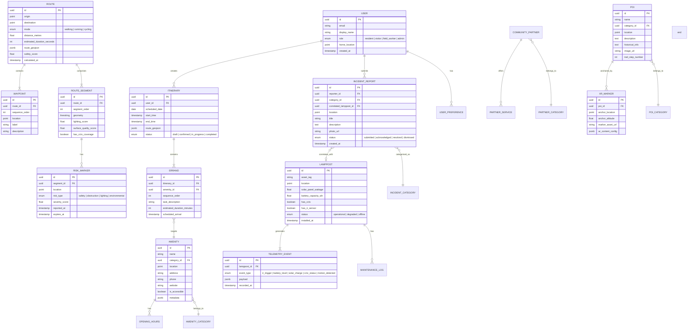

# Canal Corridor Amenities Information Govtech (IT/CT/OT) Assurance

# 0. Action Plan
## 0.1 Product Understanding

### 0.1.1 Core Product Vision

The 1st envisioned platform product is a **Connected Canal Corridor Amenities Information GovTech SuperApp Ecosystem Platform** — a localised Gov-as-a-Product (GaaP) solution designed for the Hayes Town Centre and Grand Union Canal corridor within the London Borough of Hillingdon. The platform targets a "Smart Airport Hub Suburbia" context, recognising that Hayes & Harlington is proximate to Heathrow Airport and serves as a gateway to the wider London area via the Elizabeth Line.

The platform operates as an XR (eXtended Reality) Tour e-Guide SuperApp meta-ecosystem, delivering dynamic optimal route planning from Hayes & Harlington station to amenities, community partners, and AI-enabled personalised errands along the 3-mile Hillingdon Signposted Trail (Hayes Towpath) on the Paddington Arm of the Grand Union Canal — from Bulls Bridge junction in Southall (near UB2 4NH) to Yeading Lane/Grand Union Village (near UB4 0ES).

**Functional Requirements:**

- **Dynamic Optimal Route Planning Engine** — Multi-modal route calculation (walking, running, cycling) from Hayes & Harlington station to canal corridor amenities, community partners, and personalised errand destinations, factoring in open times, risk markers, live traffic, weather alerting, lighting requirements, and incident reporting
- **XR Tour e-Guide Module** — Extended reality overlay for immersive navigation along the towpath with AR wayfinding markers, points of interest, historical heritage information, and wildlife/nature spotting guides aligned with the Hillingdon Trail Walk 2 guide
- **CPS (Cyber-Physical Systems) Integration Layer** — Management dashboard and data ingestion for solar-powered, IR-sensor-triggered, battery-included CCTV-lamppost infrastructure deployed alongside the signposted towpath
- **AI-Personalised Errands Scheduler** — Scheduling itinerary autonomy system that recommends and chains errands (shopping, community activities, leisure) with optimal routing based on user preferences
- **Incident Reporting System** — Real-time community-sourced incident reporting (safety concerns, path obstructions, lighting failures, environmental hazards) with geolocation tagging
- **Live Weather & Environment Alerting** — Integration with Met Office or equivalent weather API for real-time alerts affecting towpath conditions
- **Community Partners Directory** — Searchable directory of Hayes Town community groups, local businesses, faith centres, leisure facilities, and social infrastructure as documented in the supporting materials
- **Amenities Information Service** — Real-time open/close status, service availability, and accessibility information for canal corridor and town centre amenities
- **Planning Sheet Auto-Documentation Engine** — Fully completed project planning documentation covering problem statements, problem/objective trees, SMART objectives, SWOT analysis, risk analysis, cost-benefit analysis, implementation plan, stakeholder engagement plan, and business model canvas — all populated with accurate, cited references from the enclosed supporting documents

**Non-Functional Requirements:**

- **Performance** — Route calculations completed within 2 seconds; XR overlay rendering at minimum 30 FPS on mid-range mobile devices; real-time CPS data ingestion latency under 500ms
- **Scalability** — Architecture must support scaling from the initial 3-mile Hayes Towpath corridor to the full 20-mile Hillingdon Trail and potentially borough-wide deployment
- **Security** — GDPR-compliant data handling for UK residents; encrypted CPS telemetry streams; secure incident reporting with moderation capabilities; CCTV data processing in compliance with the UK Surveillance Camera Code of Practice
- **Accessibility** — WCAG 2.1 AA compliance; multi-language support addressing language barriers in the ethnically diverse Hayes community (50.4% Asian, 24.2% White, 13.1% Black populations per 2021 Census data from supporting documents)
- **Availability** — 99.5% uptime for core route planning and incident reporting services; graceful offline mode for XR navigation with cached map data
- **Sustainability** — Platform design must align with Hillingdon Council Strategy 2022-2026 goals for carbon-neutral operations and sustainable transportation promotion

**Implicit Requirements Surfaced:**

- **Offline-First Architecture** — Canal towpath sections may have limited mobile connectivity, requiring pre-cached route data and XR assets
- **Low-Light UX Adaptations** — Supporting documents note poor lighting along the canal; the app must provide high-contrast/night mode navigation
- **Diverse Community Engagement** — The platform must serve field workers (council/maintenance), residents (15,000 in Hayes Town Ward), and visitors equally, with appropriate role-based interfaces
- **Integration with Existing Council Infrastructure** — Alignment with Hillingdon Council's digital-enabled strategy and existing regeneration initiatives

### 0.1.2 User Instructions Interpretation

**CRITICAL DIRECTIVES CAPTURED:**

- **Technology Stack:** The user specifies a Govtech/IT/CT/OT metacognitive wisdom framework with CMMI (Capability Maturity Model Integration) assurance — this implies enterprise-grade process maturity, structured governance, and quality assurance throughout
- **Architecture Pattern:** SuperApp meta-ecosystem strategy — indicating a micro-frontend/modular architecture where the main app serves as a platform hosting multiple service modules (route planning, XR guide, incident reporting, CPS dashboard)
- **CPS Integration:** Solar-powered CCTV-lampposts with IR sensors and batteries must be integrated as cyber-physical assets with bidirectional data flow (sensor telemetry in, control commands out)
- **Trail Reference Document:** The enclosed `13591_Hillingdon_Trail___walk_2___Hayes_Towpath_web.pdf` must be used as the canonical source for the 8-step walking directions from Bulls Bridge to Yeading Lane, including landmarks (railway bridge, Uxbridge Road, Spikes Bridge, Brookside Open Space, Hayes Bypass, Yeading Brook)
- **Planning Sheet Completion:** ALL blank sections of the enclosed `1st-UoL-Hillingdon-Hayes-Impact-Project--Planning-Sheet--BLANK-to-be-filled-v260208a.pdf` must be fully documented with accurate, relevant, and in-text cited references drawn from the supporting documents
- **Deployment Context:** This is aligned with the Brunel University of London Impact Challenge (2nd-25th February 2026) in partnership with Hillingdon Council, with the team named "Urban Change Collective"

**User Example (preserved exactly):** "Dynamic Optimal Route Planning (considering Open Times, Risk Markers, Live Traffic & Weather Alerting, Lighting Requirements, Incident Reporting, ... etc) from Station to Amenities, Community Partners, and/or AI-enabled Personalized Errands with Scheduling Itinerary Autonomy"

**User Example (preserved exactly):** "CPS (Cyber-Physical Systems) integration of Solar-powered (IR Sensors-triggered and Batteries-included) CCTV-Lampposts alongside the Signposted Towpath"

### 0.1.3 Product Type Classification

- **Product Category:** GovTech SuperApp — a cross-platform mobile application with web administration dashboard, IoT/CPS back-end integration layer, and XR rendering capabilities
- **Target Users:**
  - **Field Workers** — Council maintenance staff, Canal & River Trust volunteers, Hillingdon Canal Partnership workers requiring operational dashboards and route/asset management
  - **Residents** — 15,000 Hayes Town Ward residents seeking safe, well-lit, and enjoyable routes for commuting and leisure along the canal corridor
  - **Visitors** — Tourists, Elizabeth Line commuters, and leisure users discovering the Hayes Towpath for walking, running, and cycling
- **Scale Expectations:** Production-ready MVP scoped to the 3-mile Hayes Towpath corridor, designed for extensibility to the full 20-mile Hillingdon Trail and other borough corridors
- **Maintenance and Evolution:** The platform is designed for long-term council ownership with modular architecture enabling incremental feature additions (e.g., additional trail segments, expanded community partner integrations, advanced AI scheduling capabilities) in alignment with the council's ongoing regeneration programme

## 0.2 Background Research

### 0.2.1 Technology Research

Web search research conducted includes:

- **Smart City Corridor Platforms:** &lt;cite index="17-3"&gt;Chattanooga's MLK Smart Corridor serves as a test bed for research in smart city developments and connected vehicles in a real-world environment.&lt;/cite&gt; &lt;cite index="17-22"&gt;The wireless communication infrastructure and network of sensors in combination with data analytics provide a means of monitoring and controlling city resources and infrastructure in real time.&lt;/cite&gt; This model directly informs our canal corridor sensor network architecture.

- **GovTech Open Platforms:** &lt;cite index="11-1,11-2"&gt;Singapore's ODP is a government-developed smart city operating system for managing various urban functions through real-time data integration, driving Smart Nation ambitions by enabling seamless integration of sensors and systems.&lt;/cite&gt; &lt;cite index="18-1,18-2"&gt;The use of open platforms can help prepare cities for future technology advances, and published APIs allow third parties to integrate their systems with open platforms and cities' data.&lt;/cite&gt;

- **Solar-Powered Smart Lampposts with CCTV:** &lt;cite index="19-5,19-6"&gt;Omniflow's smart lamp posts enable added security with CCTV cameras, emergency buttons, public Wi-Fi, and environmental sensors. Their "Omniled" light posts are self-sustainable, powered by integrated solar panels and a wind turbine with energy storage.&lt;/cite&gt; &lt;cite index="22-2"&gt;The smart street lighting system can be implemented as a critical component providing extended capabilities such as public safety monitoring, camera surveillance, traffic management, environmental protection, and weather monitoring.&lt;/cite&gt;

- **IoT Smart Lighting Integration:** &lt;cite index="24-1,24-2,24-3"&gt;Modern intelligent street lighting systems are more than lighting — they are IoT platforms. Smart poles can host 5G antennas, EV chargers, Wi-Fi hotspots, and environmental sensors, enhancing traffic management, air quality monitoring, and public information systems.&lt;/cite&gt; &lt;cite index="24-5"&gt;The global market for intelligent street lighting systems is projected to reach $23 billion by 2030.&lt;/cite&gt;

- **XR Development Frameworks:** &lt;cite index="29-19,29-20"&gt;VR immerses users fully in a digital world, AR overlays digital content on the real world, and MR allows real-time interaction between digital and physical elements. Platforms like Unity and Unreal Engine are suitable for VR, AR, and MR projects.&lt;/cite&gt; &lt;cite index="38-1"&gt;Key app platforms and frameworks include Unity AR Foundation, ARKit, ARCore, OpenXR, Azure Spatial Anchors, and WebXR API.&lt;/cite&gt;

- **Dynamic Route Planning Algorithms:** &lt;cite index="42-2"&gt;Input data for routing algorithms should be divided into three categories: road information (congestion, incidents, weather), destination information (purpose of travel), and mobile information (vehicle-and traveller-related features).&lt;/cite&gt; &lt;cite index="45-9"&gt;Dynamic route optimization updates plans in real time based on live traffic, weather, and order changes.&lt;/cite&gt;

- **Cross-Platform Mobile Frameworks:** &lt;cite index="49-5,49-6,49-7,49-8"&gt;Flutter is an open-source UI SDK released by Google in 2018 for cross-platform applications. React Native is a mobile development framework created by Facebook released in 2015 for mobile, web, and desktop apps.&lt;/cite&gt; &lt;cite index="50-8"&gt;Animation and graphics workloads represent Flutter's clearest advantage due to its custom rendering engine, while React Native excels in scenarios requiring deep platform integration.&lt;/cite&gt;

### 0.2.2 Architecture Pattern Research

- **SuperApp Meta-Ecosystem Pattern:** A SuperApp architecture combines multiple services under a single platform entry point, using a modular micro-frontend approach where each service domain (route planning, XR guide, CPS dashboard, incident reporting) operates as an independently deployable module within the host application shell. This pattern is proven by platforms such as WeChat, Grab, and Gojek.

- **Cyber-Physical Systems Integration Pattern:** The CPS layer follows an edge-fog-cloud continuum model where solar-powered CCTV-lampposts act as edge nodes with local IR-sensor processing, fog nodes aggregate corridor-level data, and the cloud back-end performs analytics and AI inference. &lt;cite index="27-7"&gt;This system integrates smart poles equipped with LED lamp technology, smart sensors, communication network and monitoring unit, leveraging current IoT advancements.&lt;/cite&gt;

- **Dynamic Route Planning Architecture:** &lt;cite index="44-3"&gt;A hybrid path planning model combines Global Route Planning (GRP) at strategic level with Local Route Planning (LRP) at tactical level to balance efficiency and flexibility.&lt;/cite&gt; For our pedestrian/cycling corridor, we apply a modified A\* algorithm with multi-criteria cost functions incorporating distance, lighting conditions, incident risk scores, weather exposure, and time-of-day factors.

- **Scalability Approach:** Event-driven microservices architecture using message queuing for CPS telemetry processing, with horizontal scaling of route computation services during peak usage (commute hours, weekend leisure periods).

- **Reference Architectures:** Kansas City's smart streetcar corridor demonstrates how &lt;cite index="14-8,14-9"&gt;modems clamped to lampposts provide free wireless Internet while updated traffic lights use advanced computing to keep vehicles moving.&lt;/cite&gt; Columbus's Smart City Challenge demonstrated &lt;cite index="12-7"&gt;development of apps to efficiently route trucks and logistics vehicles to avoid traffic, as well as smartphone apps to provide information about transit options for visitors.&lt;/cite&gt;

### 0.2.3 Dependency and Tool Research

**Latest Stable Versions of Proposed Technologies:**

| Technology | Version | Purpose |
| --- | --- | --- |
| Flutter | 3.27.x | Cross-platform SuperApp shell and XR-lite UI |
| Dart | 3.6.x | Primary client-side language |
| Node.js | 22.x LTS | Backend API services |
| TypeScript | 5.7.x | Backend type-safe development |
| PostgreSQL | 17.x | Primary relational database |
| Redis | 7.4.x | Caching and real-time pub/sub |
| Apache Kafka | 3.9.x | CPS telemetry event streaming |
| Unity | 6000.x (Unity 6) | XR rendering engine for AR/MR features |
| ARCore/ARKit | Latest | Mobile AR platform SDKs |
| Docker | 27.x | Containerisation |
| Kubernetes | 1.32.x | Container orchestration |
| Terraform | 1.10.x | Infrastructure as Code |
| MQTT (Mosquitto) | 2.0.x | IoT/CPS lightweight messaging protocol |

**Development Tool Recommendations:**

- **IDE:** VS Code with Flutter/Dart extensions, Android Studio for XR debugging
- **API Design:** OpenAPI 3.1 specification with Swagger UI
- **Mapping:** Mapbox GL JS / Mapbox SDK for Flutter for custom-styled canal corridor maps
- **Weather API:** Met Office DataPoint API (UK-specific) or OpenWeatherMap
- **Testing Frameworks:** Flutter Test + Integration Test, Jest for Node.js services, Cypress for web admin dashboard

**CI/CD Pipeline Pattern:**

- GitHub Actions for automated build, test, and deployment
- Multi-stage Docker builds for backend services
- Fastlane for mobile app store distribution
- ArgoCD for Kubernetes deployment management

## 0.3 Technical Architecture Design

### 0.3.1 Technology Stack Selection

Our 1st envisioned platform understands that the technology stack must support a GovTech SuperApp meta-ecosystem with CPS integration, XR capabilities, and real-time route planning. The following selections are justified by the product requirements and background research conducted.

**Primary Client-Side Language:** Dart 3.6.x

- **Rationale:** Dart is the native language for Flutter, enabling single-codebase development for iOS, Android, and web platforms with strong type safety, null safety, and AOT compilation for production performance.

**Cross-Platform Framework:** Flutter 3.27.x

- **Rationale:** Flutter's custom rendering engine (Skia/Impeller) provides consistent UI across platforms, critical for XR-lite overlays and complex map-based route visualisation. Its widget architecture aligns with the SuperApp micro-frontend pattern where each service module is a self-contained Flutter module.

**XR Rendering Engine:** Unity 6 (6000.x) with AR Foundation

- **Rationale:** Unity provides the most mature XR development pipeline for mobile AR experiences, with AR Foundation abstracting ARCore (Android) and ARKit (iOS) differences. Unity scenes are embedded within the Flutter shell via platform channels for the immersive towpath tour experience.

**Backend Language/Runtime:** TypeScript 5.7.x on Node.js 22.x LTS

- **Rationale:** TypeScript provides enterprise-grade type safety for complex business logic (route algorithms, scheduling optimisation), while Node.js event-driven architecture handles concurrent CPS telemetry streams efficiently. The LTS version ensures long-term council infrastructure stability.

**Primary Database:** PostgreSQL 17.x with PostGIS Extension

- **Rationale:** PostGIS provides spatial query capabilities essential for geolocation-based route planning, proximity searches for amenities, and geofencing for CPS lamppost zones along the canal corridor. PostgreSQL's maturity and ACID compliance meet GovTech reliability requirements.

**Real-Time Cache/Pub-Sub:** Redis 7.4.x

- **Rationale:** Redis serves dual purposes — caching frequently accessed route segments and amenity data for sub-2-second response times, and providing pub/sub channels for real-time incident alert propagation to connected clients.

**Event Streaming:** Apache Kafka 3.9.x

- **Rationale:** CPS telemetry from CCTV-lampposts (IR sensor triggers, battery levels, solar charge status, video analytics alerts) requires durable, high-throughput event streaming. Kafka's partitioned log model ensures no telemetry data loss and supports replay for analytics.

**IoT Messaging Protocol:** MQTT via Eclipse Mosquitto 2.0.x

- **Rationale:** MQTT's lightweight publish/subscribe model is optimised for solar-powered edge devices with constrained bandwidth and intermittent connectivity — ideal for the canal corridor's variable network coverage.

**Mapping Platform:** Mapbox GL with Custom Canal Corridor Tiles

- **Rationale:** Mapbox provides vector tile rendering with offline support (essential for the towpath's connectivity gaps) and custom styling to highlight the Hillingdon Trail waypoints, risk markers, and CPS lamppost locations.

**Infrastructure:** Docker 27.x + Kubernetes 1.32.x + Terraform 1.10.x

- **Rationale:** Container orchestration enables horizontal scaling of route computation services during peak demand while maintaining cost efficiency during off-peak hours. Terraform ensures reproducible infrastructure aligned with CMMI assurance requirements.

### 0.3.2 Architecture Pattern

**Overall Pattern:** SuperApp Meta-Ecosystem with Event-Driven Microservices Backend

The architecture follows a layered SuperApp model where the Flutter-based mobile shell hosts modular "mini-apps" for each service domain, backed by an event-driven microservices API layer and a CPS edge-fog-cloud data pipeline.

```mermaid
flowchart TB
    subgraph ClientLayer["Client Layer - SuperApp Shell"]
        AppShell["Flutter SuperApp Shell"]
        RouteModule["Route Planning Module"]
        XRModule["XR Tour e-Guide Module"]
        IncidentModule["Incident Reporting Module"]
        ErrandsModule["AI Errands Scheduler"]
        CommunityModule["Community Partners Directory"]
    end

    subgraph APIGateway["API Gateway Layer"]
        Gateway["Kong API Gateway"]
        AuthService["Auth Service - OAuth 2.0 / OIDC"]
    end

    subgraph ServiceLayer["Microservices Layer"]
        RouteSvc["Route Planning Service"]
        AmenitySvc["Amenities Information Service"]
        IncidentSvc["Incident Reporting Service"]
        WeatherSvc["Weather Alerting Service"]
        SchedulerSvc["AI Scheduling Service"]
        CPSDashSvc["CPS Dashboard Service"]
        DocGenSvc["Planning Document Generator"]
    end

    subgraph DataLayer["Data Layer"]
        PGDatabase["PostgreSQL 17 + PostGIS"]
        RedisCache["Redis 7.4 Cache"]
        KafkaStream["Apache Kafka 3.9"]
    end

    subgraph CPSLayer["CPS Edge Layer - Canal Corridor"]
        MQTTBroker["MQTT Broker - Mosquitto"]
        LamppostEdge["Solar CCTV-Lamppost Nodes"]
        IRSensors["IR Sensor Array"]
        SolarCtrl["Solar/Battery Controller"]
    end

    subgraph ExternalAPIs["External Integrations"]
        MetOffice["Met Office DataPoint API"]
        MapboxAPI["Mapbox Directions API"]
        TfLAPI["TfL Unified API"]
    end

    AppShell --> RouteModule
    AppShell --> XRModule
    AppShell --> IncidentModule
    AppShell --> ErrandsModule
    AppShell --> CommunityModule

    RouteModule --> Gateway
    XRModule --> Gateway
    IncidentModule --> Gateway
    ErrandsModule --> Gateway
    CommunityModule --> Gateway

    Gateway --> AuthService
    Gateway --> RouteSvc
    Gateway --> AmenitySvc
    Gateway --> IncidentSvc
    Gateway --> WeatherSvc
    Gateway --> SchedulerSvc
    Gateway --> CPSDashSvc
    Gateway --> DocGenSvc

    RouteSvc --> PGDatabase
    RouteSvc --> RedisCache
    AmenitySvc --> PGDatabase
    IncidentSvc --> PGDatabase
    IncidentSvc --> KafkaStream
    WeatherSvc --> MetOffice
    RouteSvc --> MapboxAPI
    RouteSvc --> TfLAPI
    SchedulerSvc --> PGDatabase
    CPSDashSvc --> KafkaStream

    LamppostEdge --> MQTTBroker
    IRSensors --> LamppostEdge
    SolarCtrl --> LamppostEdge
    MQTTBroker --> KafkaStream
    KafkaStream --> CPSDashSvc
```



**Justification:** The SuperApp shell pattern enables a unified user experience while allowing each service module to be developed, tested, and deployed independently. The event-driven backend decouples CPS telemetry ingestion from API request handling, preventing sensor data bursts from impacting user-facing latency.

**Component Interaction Model:**

- **Synchronous:** Client-to-API interactions for route queries, amenity lookups, and errand scheduling use REST/GraphQL over HTTPS
- **Asynchronous:** CPS telemetry flows through MQTT to Kafka, consumed by the CPS Dashboard Service and Incident Correlation Engine
- **Real-Time Push:** WebSocket connections from the API Gateway deliver live incident alerts, weather warnings, and CPS status updates to connected clients

**Data Flow Architecture:**

- **Route Planning Flow:** Client request → API Gateway → Route Planning Service (queries PostGIS for corridor graph, Redis for cached segments, Mapbox for base directions, TfL for live transit) → Multi-criteria optimisation → Response with annotated route
- **CPS Telemetry Flow:** IR Sensor trigger → Lamppost edge processor → MQTT publish → Kafka topic → CPS Dashboard Service (real-time) + Analytics pipeline (batch)
- **Incident Reporting Flow:** User report with geolocation → API Gateway → Incident Service → PostgreSQL storage + Kafka event → Route Planning Service (risk marker update) + CPS Dashboard (correlation)

**Security Architecture:**

- OAuth 2.0 / OpenID Connect for user authentication with role-based access (field worker, resident, visitor, admin)
- MQTT TLS for CPS communication encryption
- API Gateway rate limiting and DDoS protection
- GDPR-compliant data anonymisation for CCTV analytics — no facial recognition, only aggregate occupancy and motion detection
- UK Surveillance Camera Code of Practice compliance for all CPS video processing

### 0.3.3 Integration Points

**External Services to Integrate:**

| Service | Purpose | Protocol | Data Format |
| --- | --- | --- | --- |
| Met Office DataPoint API | Real-time weather alerts for towpath conditions | REST/HTTPS | JSON |
| Mapbox Directions API | Base route calculations and map tile serving | REST/HTTPS | GeoJSON |
| TfL Unified API | Live transit data for Hayes & Harlington station | REST/HTTPS | JSON |
| Canal & River Trust Open Data | Canal condition updates and stoppage notices | REST/HTTPS | JSON/XML |
| Hillingdon Council Open Data | Amenity listings, planning information, council events | REST/HTTPS | JSON |
| UK Police Data API | Crime statistics for route risk scoring | REST/HTTPS | JSON |
| OpenCharge Map API | EV charging points near canal corridor (for cycling e-bikes) | REST/HTTPS | JSON |

**API Contracts to Implement:**

- RESTful API following OpenAPI 3.1 specification
- GraphQL endpoint for flexible amenity and community partner queries
- WebSocket endpoint for real-time push notifications (incidents, weather, CPS alerts)
- MQTT topics for CPS device communication (`corridor/lamppost/{id}/telemetry`, `corridor/lamppost/{id}/command`)

**Authentication and Authorisation Approach:**

- **Residents/Visitors:** Anonymous access for basic route planning and trail information; optional registration for personalised features (saved routes, errand scheduling, incident reporting)
- **Field Workers:** Council-issued credentials with multi-factor authentication; elevated permissions for CPS dashboard, incident management, and maintenance workflows
- **Admin:** Full platform administration with audit logging; accessible only via web dashboard with IP allowlisting

## 0.4 Repository Structure Planning

### 0.4.1 Proposed Repository Structure

The repository follows a monorepo structure organised by architectural layer, reflecting the SuperApp meta-ecosystem pattern with clear separation between the client shell, backend microservices, CPS integration layer, and shared infrastructure.

```plaintext
/
├── src/
│   ├── client/                                    # Flutter SuperApp Client
│   │   ├── lib/
│   │   │   ├── main.dart                          # Application entry point
│   │   │   ├── app.dart                           # SuperApp shell initialisation
│   │   │   ├── core/                              # Core shared infrastructure
│   │   │   │   ├── config/
│   │   │   │   │   ├── app_config.dart            # Environment configuration
│   │   │   │   │   ├── theme_config.dart          # Theme and accessibility settings
│   │   │   │   │   └── route_config.dart          # App navigation routes
│   │   │   │   ├── services/
│   │   │   │   │   ├── api_client.dart            # HTTP/GraphQL client
│   │   │   │   │   ├── auth_service.dart          # OAuth 2.0 / OIDC handler
│   │   │   │   │   ├── websocket_service.dart     # Real-time push connection
│   │   │   │   │   ├── offline_cache_service.dart # Offline-first data caching
│   │   │   │   │   └── location_service.dart      # GPS and geolocation
│   │   │   │   ├── models/
│   │   │   │   │   ├── user_model.dart            # User profile and roles
│   │   │   │   │   ├── geolocation_model.dart     # Coordinate and bbox models
│   │   │   │   │   └── api_response_model.dart    # Generic API response wrapper
│   │   │   │   ├── widgets/
│   │   │   │   │   ├── canal_map_widget.dart       # Shared Mapbox map component
│   │   │   │   │   ├── weather_banner_widget.dart  # Live weather alert banner
│   │   │   │   │   └── accessibility_wrapper.dart  # WCAG 2.1 AA wrapper
│   │   │   │   └── utils/
│   │   │   │       ├── constants.dart             # App-wide constants
│   │   │   │       ├── extensions.dart            # Dart extension methods
│   │   │   │       └── validators.dart            # Input validation helpers
│   │   │   ├── modules/                           # SuperApp Feature Modules
│   │   │   │   ├── route_planning/                # Dynamic Route Planning Module
│   │   │   │   │   ├── models/
│   │   │   │   │   │   ├── route_model.dart       # Route data model with waypoints
│   │   │   │   │   │   ├── risk_marker_model.dart # Risk/safety marker model
│   │   │   │   │   │   └── amenity_model.dart     # Amenity point model
│   │   │   │   │   ├── services/
│   │   │   │   │   │   ├── route_service.dart     # Route API integration
│   │   │   │   │   │   └── traffic_service.dart   # Live traffic data
│   │   │   │   │   ├── controllers/
│   │   │   │   │   │   └── route_controller.dart  # Route state management
│   │   │   │   │   └── views/
│   │   │   │   │       ├── route_map_screen.dart   # Map-based route display
│   │   │   │   │       ├── route_detail_screen.dart # Step-by-step directions
│   │   │   │   │       └── route_preferences_screen.dart # User route preferences
│   │   │   │   ├── xr_guide/                      # XR Tour e-Guide Module
│   │   │   │   │   ├── models/
│   │   │   │   │   │   ├── poi_model.dart         # Point of interest data
│   │   │   │   │   │   └── xr_marker_model.dart   # AR marker anchor model
│   │   │   │   │   ├── services/
│   │   │   │   │   │   ├── ar_session_service.dart # AR session management
│   │   │   │   │   │   └── poi_service.dart        # POI data retrieval
│   │   │   │   │   ├── controllers/
│   │   │   │   │   │   └── xr_controller.dart     # XR state management
│   │   │   │   │   └── views/
│   │   │   │   │       ├── xr_camera_screen.dart   # AR camera overlay view
│   │   │   │   │       ├── poi_detail_screen.dart  # POI detail sheet
│   │   │   │   │       └── trail_guide_screen.dart # Hillingdon Trail info
│   │   │   │   ├── incident_reporting/            # Incident Reporting Module
│   │   │   │   │   ├── models/
│   │   │   │   │   │   └── incident_model.dart    # Incident report data model
│   │   │   │   │   ├── services/
│   │   │   │   │   │   └── incident_service.dart  # Incident submission API
│   │   │   │   │   ├── controllers/
│   │   │   │   │   │   └── incident_controller.dart
│   │   │   │   │   └── views/
│   │   │   │   │       ├── report_incident_screen.dart # Incident form
│   │   │   │   │       └── incident_feed_screen.dart   # Live incident feed
│   │   │   │   ├── ai_errands/                    # AI Personalised Errands Module
│   │   │   │   │   ├── models/
│   │   │   │   │   │   ├── errand_model.dart      # Errand task data model
│   │   │   │   │   │   └── itinerary_model.dart   # Scheduled itinerary model
│   │   │   │   │   ├── services/
│   │   │   │   │   │   └── scheduler_service.dart # AI scheduling API
│   │   │   │   │   ├── controllers/
│   │   │   │   │   │   └── errands_controller.dart
│   │   │   │   │   └── views/
│   │   │   │   │       ├── errands_list_screen.dart    # Errand management
│   │   │   │   │       └── itinerary_screen.dart       # Daily itinerary view
│   │   │   │   ├── community/                     # Community Partners Directory
│   │   │   │   │   ├── models/
│   │   │   │   │   │   └── partner_model.dart     # Community partner model
│   │   │   │   │   ├── services/
│   │   │   │   │   │   └── community_service.dart # Partner data API
│   │   │   │   │   ├── controllers/
│   │   │   │   │   │   └── community_controller.dart
│   │   │   │   │   └── views/
│   │   │   │   │       ├── partners_list_screen.dart  # Searchable directory
│   │   │   │   │       └── partner_detail_screen.dart # Partner profile
│   │   │   │   └── cps_dashboard/                 # CPS Dashboard Module (Field Workers)
│   │   │   │       ├── models/
│   │   │   │       │   ├── lamppost_model.dart    # CCTV-lamppost asset model
│   │   │   │       │   └── telemetry_model.dart   # Sensor telemetry data model
│   │   │   │       ├── services/
│   │   │   │       │   └── cps_service.dart       # CPS telemetry API
│   │   │   │       ├── controllers/
│   │   │   │       │   └── cps_controller.dart
│   │   │   │       └── views/
│   │   │   │           ├── cps_overview_screen.dart    # Corridor asset map
│   │   │   │           └── lamppost_detail_screen.dart # Individual lamppost status
│   │   │   └── unity_bridge/                      # Unity XR Engine Bridge
│   │   │       └── unity_ar_bridge.dart           # Platform channel to Unity
│   │   ├── android/                               # Android platform config
│   │   ├── ios/                                   # iOS platform config
│   │   ├── web/                                   # Web platform config
│   │   ├── pubspec.yaml                           # Flutter dependencies
│   │   └── analysis_options.yaml                  # Dart lint rules
│   ├── server/                                    # Backend Microservices
│   │   ├── gateway/                               # API Gateway Configuration
│   │   │   ├── kong.yml                           # Kong gateway declarative config
│   │   │   └── plugins/                           # Custom gateway plugins
│   │   │       ├── rate_limiter.ts                # Rate limiting configuration
│   │   │       └── cors_handler.ts                # CORS policy handler
│   │   ├── services/                              # Individual Microservices
│   │   │   ├── route-planning/                    # Route Planning Service
│   │   │   │   ├── src/
│   │   │   │   │   ├── index.ts                   # Service entry point
│   │   │   │   │   ├── models/
│   │   │   │   │   │   ├── route.model.ts         # Route entity
│   │   │   │   │   │   ├── waypoint.model.ts      # Waypoint entity
│   │   │   │   │   │   └── risk-marker.model.ts   # Risk/safety marker entity
│   │   │   │   │   ├── services/
│   │   │   │   │   │   ├── pathfinding.service.ts # A* multi-criteria algorithm
│   │   │   │   │   │   ├── lighting.service.ts    # Lighting condition evaluator
│   │   │   │   │   │   └── traffic.service.ts     # Live traffic integration
│   │   │   │   │   ├── controllers/
│   │   │   │   │   │   └── route.controller.ts    # REST endpoint handlers
│   │   │   │   │   └── integrations/
│   │   │   │   │       ├── mapbox.client.ts       # Mapbox Directions API client
│   │   │   │   │       ├── tfl.client.ts          # TfL API client
│   │   │   │   │       └── met-office.client.ts   # Met Office API client
│   │   │   │   ├── package.json                   # Service dependencies
│   │   │   │   ├── tsconfig.json                  # TypeScript config
│   │   │   │   └── Dockerfile                     # Service container
│   │   │   ├── amenities/                         # Amenities Information Service
│   │   │   │   ├── src/
│   │   │   │   │   ├── index.ts
│   │   │   │   │   ├── models/
│   │   │   │   │   │   └── amenity.model.ts       # Amenity entity with open times
│   │   │   │   │   ├── services/
│   │   │   │   │   │   └── amenity.service.ts     # Amenity CRUD and search
│   │   │   │   │   └── controllers/
│   │   │   │   │       └── amenity.controller.ts  # REST endpoint handlers
│   │   │   │   ├── package.json
│   │   │   │   └── Dockerfile
│   │   │   ├── incidents/                         # Incident Reporting Service
│   │   │   │   ├── src/
│   │   │   │   │   ├── index.ts
│   │   │   │   │   ├── models/
│   │   │   │   │   │   └── incident.model.ts      # Incident entity
│   │   │   │   │   ├── services/
│   │   │   │   │   │   ├── incident.service.ts    # Incident CRUD
│   │   │   │   │   │   └── correlation.service.ts # CPS incident correlation
│   │   │   │   │   └── controllers/
│   │   │   │   │       └── incident.controller.ts
│   │   │   │   ├── package.json
│   │   │   │   └── Dockerfile
│   │   │   ├── weather/                           # Weather Alerting Service
│   │   │   │   ├── src/
│   │   │   │   │   ├── index.ts
│   │   │   │   │   ├── services/
│   │   │   │   │   │   └── weather.service.ts     # Met Office integration
│   │   │   │   │   └── controllers/
│   │   │   │   │       └── weather.controller.ts
│   │   │   │   ├── package.json
│   │   │   │   └── Dockerfile
│   │   │   ├── scheduler/                         # AI Scheduling Service
│   │   │   │   ├── src/
│   │   │   │   │   ├── index.ts
│   │   │   │   │   ├── models/
│   │   │   │   │   │   ├── errand.model.ts        # Errand entity
│   │   │   │   │   │   └── itinerary.model.ts     # Itinerary entity
│   │   │   │   │   ├── services/
│   │   │   │   │   │   ├── scheduler.service.ts   # Itinerary optimisation
│   │   │   │   │   │   └── preference.service.ts  # User preference learning
│   │   │   │   │   └── controllers/
│   │   │   │   │       └── scheduler.controller.ts
│   │   │   │   ├── package.json
│   │   │   │   └── Dockerfile
│   │   │   ├── cps/                               # CPS Dashboard Service
│   │   │   │   ├── src/
│   │   │   │   │   ├── index.ts
│   │   │   │   │   ├── models/
│   │   │   │   │   │   ├── lamppost.model.ts      # Lamppost asset entity
│   │   │   │   │   │   └── telemetry.model.ts     # Telemetry event entity
│   │   │   │   │   ├── services/
│   │   │   │   │   │   ├── telemetry.service.ts   # Kafka consumer for telemetry
│   │   │   │   │   │   └── asset.service.ts       # Lamppost asset management
│   │   │   │   │   └── controllers/
│   │   │   │   │       └── cps.controller.ts
│   │   │   │   ├── package.json
│   │   │   │   └── Dockerfile
│   │   │   ├── community/                         # Community Partners Service
│   │   │   │   ├── src/
│   │   │   │   │   ├── index.ts
│   │   │   │   │   ├── models/
│   │   │   │   │   │   └── partner.model.ts       # Community partner entity
│   │   │   │   │   ├── services/
│   │   │   │   │   │   └── partner.service.ts     # Partner CRUD and search
│   │   │   │   │   └── controllers/
│   │   │   │   │       └── partner.controller.ts
│   │   │   │   ├── package.json
│   │   │   │   └── Dockerfile
│   │   │   ├── auth/                              # Authentication Service
│   │   │   │   ├── src/
│   │   │   │   │   ├── index.ts
│   │   │   │   │   ├── services/
│   │   │   │   │   │   └── auth.service.ts        # OAuth 2.0 / OIDC handler
│   │   │   │   │   └── controllers/
│   │   │   │   │       └── auth.controller.ts
│   │   │   │   ├── package.json
│   │   │   │   └── Dockerfile
│   │   │   └── doc-generator/                     # Planning Document Generator
│   │   │       ├── src/
│   │   │       │   ├── index.ts
│   │   │       │   ├── templates/                 # Document templates
│   │   │       │   │   ├── planning-sheet.template.ts
│   │   │       │   │   ├── swot-analysis.template.ts
│   │   │       │   │   └── business-canvas.template.ts
│   │   │       │   ├── services/
│   │   │       │   │   └── generator.service.ts   # Template rendering engine
│   │   │       │   └── controllers/
│   │   │       │       └── generator.controller.ts
│   │   │       ├── package.json
│   │   │       └── Dockerfile
│   │   └── shared/                                # Shared Backend Libraries
│   │       ├── database/
│   │       │   ├── connection.ts                  # PostgreSQL connection pool
│   │       │   ├── migrations/                    # Database migration scripts
│   │       │   └── seeds/                         # Seed data (amenities, partners, trail waypoints)
│   │       ├── middleware/
│   │       │   ├── auth.middleware.ts             # JWT validation middleware
│   │       │   ├── error-handler.middleware.ts    # Global error handler
│   │       │   └── logger.middleware.ts           # Request logging
│   │       ├── utils/
│   │       │   ├── geo.utils.ts                   # Geospatial utility functions
│   │       │   ├── validation.utils.ts            # Schema validation helpers
│   │       │   └── crypto.utils.ts                # Encryption utilities
│   │       └── types/
│   │           └── common.types.ts                # Shared TypeScript interfaces
│   └── cps/                                       # CPS Edge Layer
│       ├── firmware/                              # Lamppost firmware (reference)
│       │   ├── ir_sensor_handler.c                # IR sensor trigger logic
│       │   ├── mqtt_publisher.c                   # MQTT telemetry publisher
│       │   └── solar_battery_monitor.c            # Power management
│       ├── edge-processor/                        # Edge computing scripts
│       │   ├── motion_detector.py                 # Video analytics motion detection
│       │   └── occupancy_counter.py               # Towpath occupancy estimation
│       └── config/
│           └── mqtt_topics.yml                    # MQTT topic definitions
├── tests/                                         # Test Suite
│   ├── client/
│   │   ├── unit/                                  # Flutter widget and logic tests
│   │   │   ├── route_planning/
│   │   │   ├── xr_guide/
│   │   │   ├── incident_reporting/
│   │   │   └── ai_errands/
│   │   └── integration/                           # Flutter integration tests
│   │       └── app_test.dart
│   ├── server/
│   │   ├── unit/                                  # Service unit tests
│   │   │   ├── route-planning/
│   │   │   ├── amenities/
│   │   │   ├── incidents/
│   │   │   └── cps/
│   │   ├── integration/                           # API integration tests
│   │   │   └── api.integration.test.ts
│   │   └── e2e/                                   # End-to-end tests
│   │       └── user-journey.e2e.test.ts
│   └── fixtures/                                  # Test data and mocks
│       ├── trail_waypoints.json                   # Hayes Towpath waypoint fixtures
│       ├── amenities.json                         # Sample amenity data
│       ├── telemetry_events.json                  # Sample CPS telemetry
│       └── mock_weather.json                      # Mock Met Office responses
├── docs/                                          # Documentation
│   ├── api/
│   │   └── openapi.yaml                           # OpenAPI 3.1 specification
│   ├── architecture/
│   │   ├── system-overview.md                     # Architecture overview
│   │   ├── cps-integration.md                     # CPS layer documentation
│   │   └── data-flow.md                           # Data flow diagrams
│   ├── guides/
│   │   ├── developer-setup.md                     # Development environment guide
│   │   ├── deployment-guide.md                    # Deployment procedures
│   │   └── user-guide.md                          # End-user documentation
│   └── planning/                                  # Project Planning Outputs
│       ├── planning-sheet-completed.md            # Completed planning sheet
│       ├── problem-tree.md                        # Problem and objective trees
│       ├── swot-analysis.md                       # SWOT analysis
│       └── business-model-canvas.md               # Business model canvas
├── assets/                                        # Static Assets
│   ├── trail-data/
│   │   ├── hayes_towpath_route.geojson            # Canonical trail GeoJSON
│   │   ├── waypoints.json                         # 8-step walk waypoints from trail guide
│   │   └── poi_database.json                      # Points of interest database
│   ├── xr/
│   │   ├── ar_markers/                            # AR anchor marker images
│   │   └── 3d_models/                             # 3D models for XR overlays
│   ├── maps/
│   │   └── offline_tiles/                         # Pre-cached map tiles for offline mode
│   └── images/
│       ├── community_partners/                    # Partner logos and images
│       └── trail_photos/                          # Trail photograph assets
├── scripts/                                       # Utility Scripts
│   ├── setup.sh                                   # Development environment setup
│   ├── seed-database.sh                           # Database seeding script
│   ├── generate-trail-data.ts                     # Trail GeoJSON generator
│   └── deploy.sh                                  # Deployment orchestration
├── config/                                        # Environment Configuration
│   ├── development/
│   │   ├── .env.development                       # Dev environment variables
│   │   └── docker-compose.dev.yml                 # Dev service orchestration
│   ├── staging/
│   │   ├── .env.staging                           # Staging environment variables
│   │   └── k8s/                                   # Staging K8s manifests
│   └── production/
│       ├── .env.production                        # Production environment variables
│       └── k8s/                                   # Production K8s manifests
├── infrastructure/                                # Infrastructure as Code
│   ├── terraform/
│   │   ├── main.tf                                # Root Terraform configuration
│   │   ├── modules/
│   │   │   ├── networking/                        # VPC and networking
│   │   │   ├── database/                          # PostgreSQL provisioning
│   │   │   ├── kubernetes/                        # K8s cluster provisioning
│   │   │   └── monitoring/                        # Observability stack
│   │   └── environments/
│   │       ├── staging.tfvars                     # Staging variables
│   │       └── production.tfvars                  # Production variables
│   └── helm/                                      # Helm charts for K8s services
│       ├── superapp-gateway/
│       ├── route-planning/
│       ├── cps-service/
│       └── shared-infra/
├── .github/                                       # GitHub Configuration
│   ├── workflows/
│   │   ├── ci.yml                                 # Continuous integration
│   │   ├── cd-staging.yml                         # Deploy to staging
│   │   ├── cd-production.yml                      # Deploy to production
│   │   └── security-scan.yml                      # Security vulnerability scan
│   ├── CODEOWNERS                                 # Code ownership
│   └── pull_request_template.md                   # PR template
├── docker-compose.yml                             # Local development orchestration
├── .gitignore                                     # Git ignore rules
├── .env.example                                   # Environment variables template
├── README.md                                      # Project documentation
├── CONTRIBUTING.md                                # Contribution guidelines
└── LICENSE                                        # Licence file
```

### 0.4.2 File Path Specifications

**Core Application Files:**

| File Path | Purpose |
| --- | --- |
| src/client/lib/main.dart | Flutter SuperApp entry point — initialises services, theme, and router |
| src/client/lib/app.dart | SuperApp shell with bottom navigation hosting feature modules |
| src/client/lib/modules/route_planning/services/route_service.dart | Client-side route API integration with offline caching |
| src/client/lib/modules/xr_guide/services/ar_session_service.dart | AR session lifecycle management via Unity bridge |
| src/client/lib/modules/incident_reporting/services/incident_service.dart | Incident submission with photo upload and geolocation |
| src/server/services/route-planning/src/services/pathfinding.service.ts | Modified A* algorithm with multi-criteria cost functions |
| src/server/services/cps/src/services/telemetry.service.ts | Kafka consumer processing lamppost telemetry events |
| src/server/services/scheduler/src/services/scheduler.service.ts | AI-powered errand itinerary optimisation |

**Configuration Files:**

| File Path | Purpose |
| --- | --- |
| src/client/pubspec.yaml | Flutter/Dart dependency manifest |
| src/server/services/*/package.json | Node.js service dependency manifests |
| src/server/gateway/kong.yml | API Gateway routing, rate limiting, and CORS config |
| src/cps/config/mqtt_topics.yml | MQTT topic hierarchy for CPS communication |
| config/development/.env.development | Development environment secrets and endpoints |
| .env.example | Template documenting all required environment variables |

**Entry Points:**

| File Path | Purpose |
| --- | --- |
| src/client/lib/main.dart | Mobile/web application launch |
| src/server/services/*/src/index.ts | Individual microservice startup |
| docker-compose.yml | Full local development environment orchestration |
| infrastructure/terraform/main.tf | Cloud infrastructure provisioning entry point |

## 0.5 Implementation Specifications

### 0.5.1 Core Components and Modules to Implement

**Component A: Dynamic Route Planning Engine**

- **Purpose:** Computes optimal multi-modal routes (walking, running, cycling) from Hayes & Harlington station to canal corridor destinations, incorporating real-time environmental, safety, and temporal factors
- **Location:** `src/server/services/route-planning/src/`
- **Key Interfaces:**
  - `PathfindingService.calculateRoute(origin, destination, mode, preferences)` — Main route calculation with multi-criteria A\* algorithm
  - `LightingService.evaluateCorridorLighting(segments, timeOfDay)` — Assesses lighting conditions per route segment using CPS lamppost data
  - `TrafficService.getLiveConditions(bbox)` — Retrieves real-time traffic and pedestrian density
  - `RouteController.getOptimalRoute(req, res)` — REST endpoint handler
- **Dependencies:** PostGIS for spatial graph queries, Mapbox Directions API for base routing, Met Office API for weather, Redis for cached segments, CPS telemetry for lighting status

**Component B: XR Tour e-Guide Engine**

- **Purpose:** Delivers augmented reality navigation overlays along the Hayes Towpath with points of interest, heritage information, wildlife guides, and directional wayfinding markers corresponding to the 8 stages of the Hillingdon Trail Walk 2
- **Location:** `src/client/lib/modules/xr_guide/`
- **Key Interfaces:**
  - `ARSessionService.initializeSession(trailSegment)` — Bootstraps AR session for a trail segment
  - `POIService.getNearbyPOIs(location, radius)` — Fetches proximate points of interest
  - `XRController.onMarkerDetected(markerId)` — Handles AR marker recognition events
- **Dependencies:** Unity 6 via platform channel bridge, ARCore/ARKit via AR Foundation, Mapbox for 2D fallback, offline POI cache

**Component C: CPS Integration Layer**

- **Purpose:** Ingests, processes, and visualises telemetry from the solar-powered CCTV-lamppost network including IR sensor triggers, battery/solar charge levels, CCTV operational status, and motion detection analytics
- **Location:** `src/server/services/cps/src/` and `src/cps/`
- **Key Interfaces:**
  - `TelemetryService.consumeStream(kafkaTopic)` — Kafka consumer for real-time telemetry
  - `AssetService.getLamppostStatus(lamppostId)` — Individual asset status query
  - `AssetService.getCorridorOverview(corridorId)` — Aggregate corridor health view
  - `CPSController.getAssetDashboard(req, res)` — REST endpoint for CPS dashboard
- **Dependencies:** Kafka for event streaming, MQTT Broker for device communication, PostgreSQL for asset registry, Redis for real-time status cache

**Component D: AI Personalised Errands Scheduler**

- **Purpose:** Recommends and sequences personalised errand itineraries based on user preferences, amenity open times, route optimisation, and community partner offerings along the canal corridor
- **Location:** `src/server/services/scheduler/src/`
- **Key Interfaces:**
  - `SchedulerService.generateItinerary(userId, errands, constraints)` — Creates optimised errand sequence
  - `PreferenceService.updatePreferences(userId, feedback)` — Learns from user behaviour
  - `SchedulerController.createItinerary(req, res)` — REST endpoint handler
- **Dependencies:** Route Planning Service for path costs, Amenities Service for open times, PostgreSQL for user preferences

**Component E: Incident Reporting System**

- **Purpose:** Enables community-sourced incident reporting with geolocation tagging, photo evidence, categorisation (safety, obstruction, lighting failure, environmental hazard), and real-time propagation to CPS dashboard and route risk scoring
- **Location:** `src/server/services/incidents/src/`
- **Key Interfaces:**
  - `IncidentService.submitReport(incidentData)` — Creates and validates incident report
  - `CorrelationService.correlateWithCPS(incident, telemetryEvents)` — Cross-references user reports with CPS data
  - `IncidentController.createIncident(req, res)` — REST endpoint handler
- **Dependencies:** Kafka for event publishing, Route Planning Service for risk marker updates, CPS Service for correlation

**Component F: Community Partners Directory**

- **Purpose:** Provides a searchable, categorised directory of Hayes Town community groups, local businesses, faith centres, leisure facilities, and social infrastructure sourced from the Community Groups document
- **Location:** `src/server/services/community/src/`
- **Key Interfaces:**
  - `PartnerService.searchPartners(query, category, location)` — Full-text and geospatial search
  - `PartnerService.getPartnerById(partnerId)` — Individual partner profile
  - `PartnerController.listPartners(req, res)` — REST endpoint handler
- **Dependencies:** PostgreSQL with full-text search, PostGIS for proximity queries

**Component G: Planning Document Generator**

- **Purpose:** Auto-generates the completed planning sheet documentation including problem statements, objective trees, SWOT analysis, risk matrices, cost-benefit analyses, implementation plans, and business model canvases — all populated with in-text cited references from the enclosed supporting documents
- **Location:** `src/server/services/doc-generator/src/`
- **Key Interfaces:**
  - `GeneratorService.generatePlanningSheet(projectContext)` — Produces complete planning document
  - `GeneratorService.generateSWOT(domainData)` — SWOT analysis generation
  - `GeneratorService.generateBusinessCanvas(projectData)` — Business model canvas rendering
- **Dependencies:** Document templates, reference data extracted from attached PDFs

### 0.5.2 Data Models and Schemas

**Core Entity Definitions:**



**Validation Rules and Constraints:**

- All geospatial coordinates must be WGS84 (EPSG:4326) within the Hayes corridor bounding box (approx. lat: 51.49-51.52, lon: -0.37 to -0.42)
- Risk marker severity scores normalised to 0.0-1.0 range
- Telemetry events must include a valid lamppost asset tag reference
- Incident reports require either geolocation OR manual address entry
- Itinerary errands must reference amenities with confirmed opening hours for the scheduled time

**Database Schema Notes:**

- PostGIS extension enabled for all spatial columns (POINT, LINESTRING, POLYGON types)
- TimescaleDB hypertable for `telemetry_events` (time-series optimised partitioning)
- Full-text search indices on `amenity.name`, `community_partner.name`, `poi.description`
- Spatial indices (GiST) on all geometry columns for efficient proximity queries

### 0.5.3 API Specifications

**Route Planning API:**

| Method | Path | Description | Auth |
| --- | --- | --- | --- |
| POST | /api/v1/routes/calculate | Calculate optimal route with preferences | Optional |
| GET | /api/v1/routes/{id} | Retrieve saved route details | Optional |
| GET | /api/v1/routes/segments/{segmentId}/lighting | Get lighting status for segment | Public |
| GET | /api/v1/routes/risk-markers?bbox={bbox} | Get risk markers in bounding box | Public |

**Amenities API:**

| Method | Path | Description | Auth |
| --- | --- | --- | --- |
| GET | /api/v1/amenities | List amenities with filters | Public |
| GET | /api/v1/amenities/{id} | Get amenity details with open times | Public |
| GET | /api/v1/amenities/nearby?lat={lat}&lon={lon}&radius={r} | Proximity search | Public |

**Incident Reporting API:**

| Method | Path | Description | Auth |
| --- | --- | --- | --- |
| POST | /api/v1/incidents | Submit new incident report | Required |
| GET | /api/v1/incidents | List incidents with filters | Public |
| PATCH | /api/v1/incidents/{id}/status | Update incident status | Field Worker |
| GET | /api/v1/incidents/feed | WebSocket real-time incident feed | Optional |

**CPS Dashboard API:**

| Method | Path | Description | Auth |
| --- | --- | --- | --- |
| GET | /api/v1/cps/lampposts | List all lamppost assets | Field Worker |
| GET | /api/v1/cps/lampposts/{id} | Get lamppost details and latest telemetry | Field Worker |
| GET | /api/v1/cps/corridor/{id}/status | Corridor-wide health overview | Field Worker |
| GET | /api/v1/cps/telemetry/stream | WebSocket real-time telemetry stream | Field Worker |

**AI Scheduling API:**

| Method | Path | Description | Auth |
| --- | --- | --- | --- |
| POST | /api/v1/itineraries | Generate personalised itinerary | Required |
| GET | /api/v1/itineraries/{id} | Retrieve itinerary details | Required |
| PATCH | /api/v1/itineraries/{id} | Modify itinerary (reorder, add, remove errands) | Required |
| POST | /api/v1/itineraries/{id}/optimise | Re-optimise with current conditions | Required |

**Community Partners API:**

| Method | Path | Description | Auth |
| --- | --- | --- | --- |
| GET | /api/v1/partners | List community partners with filters | Public |
| GET | /api/v1/partners/{id} | Get partner profile | Public |
| GET | /api/v1/partners/categories | List partner categories | Public |

**Authentication Endpoints:**

| Method | Path | Description |
| --- | --- | --- |
| POST | /api/v1/auth/register | User registration |
| POST | /api/v1/auth/login | OAuth 2.0 token exchange |
| POST | /api/v1/auth/refresh | Token refresh |
| GET | /api/v1/auth/profile | Get current user profile |

**Rate Limiting:**

- Public endpoints: 100 requests/minute per IP
- Authenticated endpoints: 300 requests/minute per user
- Route calculation: 20 requests/minute per user (computationally intensive)
- CPS telemetry stream: Dedicated connection pool, exempt from general rate limits

### 0.5.4 User Interface Design

No Figma screens were provided for this project. The UI design is derived from the functional requirements and product type classification. The SuperApp shell follows a standard mobile-first pattern with the following primary screens:

**SuperApp Shell Navigation:**

- **Home Screen:** Map-centric view of the canal corridor with quick-access cards for route planning, XR guide launch, incident reporting, and community directory
- **Route Planning Screen:** Interactive Mapbox map with origin/destination selection, mode toggle (walk/run/cycle), and real-time condition overlays (lighting, risk markers, weather)
- **XR Camera Screen:** Full-screen AR camera view with overlaid wayfinding markers, POI information cards, and trail step progress indicator aligned to the 8 stages of the Hayes Towpath walk
- **Incident Report Form:** Streamlined form with location auto-detect, category picker, photo capture, description field, and severity indicator
- **CPS Dashboard (Field Worker):** Corridor map with colour-coded lamppost status indicators, battery/solar gauges, and telemetry event timeline
- **Itinerary Screen:** Daily schedule view with sequenced errands, estimated travel times between stops, and one-tap navigation launch
- **Community Directory:** Searchable, filterable list/grid of community partners with category tabs (Sports & Leisure, Faith, Youth, Health, Arts & Culture, Environment per the Community Groups document)

**Accessibility Requirements:**

- WCAG 2.1 AA compliance across all screens
- High-contrast/night mode for low-light towpath navigation
- Screen reader compatibility with semantic Flutter widget tree
- Touch targets minimum 44x44dp
- Multi-language support prioritising English, Punjabi, Hindi, Urdu, and Polish (reflecting Hayes community demographics)

## 0.6 Scope Definition

### 0.6.1 Explicitly In Scope

**Core Platform Features (MVP):**

- Dynamic optimal route planning engine with multi-criteria A\* pathfinding for walking, running, and cycling from Hayes & Harlington station to canal corridor destinations
- Integration of open times, risk markers, live traffic conditions, weather alerting, lighting requirements, and incident reporting data into route cost calculations
- XR Tour e-Guide module with AR wayfinding overlays aligned to the 8 stages of the Hillingdon Trail Walk 2 (Hayes Towpath) from Bulls Bridge junction (UB2 4NH) to Yeading Lane/Grand Union Village (UB4 0ES)
- CPS (Cyber-Physical Systems) integration layer for solar-powered, IR-sensor-triggered, battery-included CCTV-lamppost infrastructure alongside the signposted towpath
- AI-personalised errands scheduler with scheduling itinerary autonomy
- Incident reporting system with geolocation tagging, photo evidence, and real-time propagation
- Community partners directory sourced from the enclosed Community Groups document
- Amenities information service with real-time open/close status
- Live weather and environmental alerting via Met Office DataPoint API integration

**Planning Documentation (All BLANK Sections Completed):**

- Problem statement with in-text cited references from supporting documents
- Problem tree and objective tree analysis
- SMART objectives derived from the Hillingdon Council Strategy 2022-2026
- SWOT analysis specific to the canal corridor regeneration context
- Risk analysis matrix with mitigation strategies
- Cost-benefit analysis for CPS infrastructure deployment
- Implementation plan with stakeholder engagement strategy
- Business model canvas for the eGaaP (eGov-as-a-Product) platform
- All planning sheet sections fully populated with accurate references from the enclosed 8 supporting documents

**Infrastructure and DevOps:**

- Complete monorepo structure with Flutter client, Node.js/TypeScript microservices, and CPS edge layer
- Docker containerisation for all backend services
- Docker Compose for local development orchestration
- CI/CD pipeline configuration via GitHub Actions
- Kubernetes manifests for staging and production environments
- Terraform infrastructure-as-code for cloud provisioning
- PostgreSQL with PostGIS and TimescaleDB extensions
- Apache Kafka for CPS event streaming
- MQTT Broker (Mosquitto) for IoT device communication
- Redis for caching and real-time pub/sub

**Security and Compliance:**

- OAuth 2.0 / OpenID Connect authentication with role-based access control (resident, visitor, field worker, admin)
- GDPR-compliant data handling for UK residents
- UK Surveillance Camera Code of Practice compliance for CPS CCTV
- API rate limiting and DDoS protection via Kong API Gateway
- MQTT TLS encryption for CPS edge-to-cloud communication
- No facial recognition — occupancy counting and motion detection only

**Testing:**

- Unit tests for core business logic (pathfinding, scheduling, CPS telemetry processing)
- Widget tests for critical Flutter UI components
- Integration tests for API endpoints
- End-to-end tests for primary user journeys (route planning, incident reporting)
- Test fixtures based on real Hayes Towpath data

**Documentation:**

- OpenAPI 3.1 specification for all REST endpoints
- Architecture overview and data flow documentation
- Developer setup guide
- Deployment guide
- End-user guide
- Completed project planning documents with cited references

### 0.6.2 Explicitly Out of Scope

**Excluded from Initial MVP:**

- **Full 20-mile Hillingdon Trail coverage** — MVP is scoped to the 3-mile Hayes Towpath segment only; architecture is designed for future extension but additional trail segments are not implemented
- **Advanced AI/ML model training** — The AI errands scheduler uses rule-based optimisation with configurable preference weights; deep learning personalisation models are deferred to subsequent phases
- **Production-grade CCTV video storage and retrieval** — The CPS layer processes real-time telemetry and motion analytics but does not implement long-term video archival or playback infrastructure
- **Physical lamppost hardware procurement and installation** — The platform provides the software integration layer; physical CPS hardware deployment is managed separately by council infrastructure teams
- **Native smartwatch or wearable companion app** — Cross-platform mobile and web are in scope; dedicated wearable interfaces are deferred
- **Advanced analytics dashboard** — Basic CPS dashboard for field workers is included; advanced predictive analytics, trend analysis, and reporting dashboards are out of scope for MVP
- **Multi-borough federation** — The platform serves the London Borough of Hillingdon only; cross-borough data federation protocols are not implemented
- **Comprehensive internationalisation (i18n)** — Multi-language UI strings for the 5 priority languages (English, Punjabi, Hindi, Urdu, Polish) are included; full i18n framework with cultural locale adaptations is deferred
- **Payment processing** — No in-app payment or transaction capabilities; the platform is a free public service
- **Social features** — No user-to-user messaging, social feeds, or community forums; the platform is information and navigation focused
- **Detailed accessibility audit certification** — WCAG 2.1 AA design compliance is implemented; formal third-party accessibility audit and certification is excluded
- **Load testing and performance benchmarking** — Basic performance targets are defined; systematic load testing infrastructure and benchmarking suites are deferred to pre-production phases
- **Canal & River Trust operational integration** — While the platform references Canal & River Trust data, direct system integration with their internal operational platforms is out of scope

## 0.7 Deliverable Mapping

### 0.7.1 File Creation Plan

**Client-Side SuperApp (Flutter/Dart):**

| File Path | Purpose | Content Type | Priority |
| --- | --- | --- | --- |
| src/client/lib/main.dart | Application entry point and service initialisation | Source | High |
| src/client/lib/app.dart | SuperApp shell with navigation and module hosting | Source | High |
| src/client/lib/core/config/app_config.dart | Environment configuration and feature flags | Source | High |
| src/client/lib/core/config/theme_config.dart | Theme definitions including high-contrast/night mode | Source | Medium |
| src/client/lib/core/config/route_config.dart | Client-side navigation route definitions | Source | High |
| src/client/lib/core/services/api_client.dart | HTTP/GraphQL client with retry and offline handling | Source | High |
| src/client/lib/core/services/auth_service.dart | OAuth 2.0 / OIDC authentication handler | Source | High |
| src/client/lib/core/services/websocket_service.dart | WebSocket connection for real-time push events | Source | High |
| src/client/lib/core/services/offline_cache_service.dart | Offline-first data caching for towpath connectivity gaps | Source | High |
| src/client/lib/core/services/location_service.dart | GPS positioning and geofencing | Source | High |
| src/client/lib/core/models/user_model.dart | User profile and role model | Source | High |
| src/client/lib/core/models/geolocation_model.dart | Coordinate and bounding box models | Source | High |
| src/client/lib/core/widgets/canal_map_widget.dart | Shared Mapbox map component with corridor styling | Source | High |
| src/client/lib/core/widgets/weather_banner_widget.dart | Live weather alert banner widget | Source | Medium |
| src/client/lib/core/utils/constants.dart | App-wide constants (API URLs, defaults) | Source | High |
| src/client/lib/modules/route_planning/models/route_model.dart | Route data model with waypoints and segments | Source | High |
| src/client/lib/modules/route_planning/models/risk_marker_model.dart | Risk/safety marker data model | Source | High |
| src/client/lib/modules/route_planning/services/route_service.dart | Route calculation API integration | Source | High |
| src/client/lib/modules/route_planning/controllers/route_controller.dart | Route planning state management | Source | High |
| src/client/lib/modules/route_planning/views/route_map_screen.dart | Map-based route display with overlays | Source | High |
| src/client/lib/modules/route_planning/views/route_detail_screen.dart | Step-by-step turn-by-turn directions | Source | High |
| src/client/lib/modules/xr_guide/models/poi_model.dart | Point of interest data model | Source | High |
| src/client/lib/modules/xr_guide/models/xr_marker_model.dart | AR marker anchor model | Source | High |
| src/client/lib/modules/xr_guide/services/ar_session_service.dart | AR session lifecycle via Unity bridge | Source | High |
| src/client/lib/modules/xr_guide/views/xr_camera_screen.dart | Full-screen AR camera with overlays | Source | High |
| src/client/lib/modules/xr_guide/views/trail_guide_screen.dart | Hillingdon Trail Walk 2 information | Source | Medium |
| src/client/lib/modules/incident_reporting/models/incident_model.dart | Incident report data model | Source | High |
| src/client/lib/modules/incident_reporting/services/incident_service.dart | Incident submission with photo upload | Source | High |
| src/client/lib/modules/incident_reporting/views/report_incident_screen.dart | Incident report form UI | Source | High |
| src/client/lib/modules/incident_reporting/views/incident_feed_screen.dart | Live incident feed list | Source | Medium |
| src/client/lib/modules/ai_errands/models/errand_model.dart | Errand task data model | Source | Medium |
| src/client/lib/modules/ai_errands/models/itinerary_model.dart | Scheduled itinerary model | Source | Medium |
| src/client/lib/modules/ai_errands/services/scheduler_service.dart | AI scheduling API integration | Source | Medium |
| src/client/lib/modules/ai_errands/views/itinerary_screen.dart | Daily itinerary view | Source | Medium |
| src/client/lib/modules/community/models/partner_model.dart | Community partner data model | Source | Medium |
| src/client/lib/modules/community/services/community_service.dart | Partner directory API integration | Source | Medium |
| src/client/lib/modules/community/views/partners_list_screen.dart | Searchable partner directory | Source | Medium |
| src/client/lib/modules/cps_dashboard/models/lamppost_model.dart | CCTV-lamppost asset model | Source | High |
| src/client/lib/modules/cps_dashboard/models/telemetry_model.dart | Sensor telemetry data model | Source | High |
| src/client/lib/modules/cps_dashboard/services/cps_service.dart | CPS telemetry API integration | Source | High |
| src/client/lib/modules/cps_dashboard/views/cps_overview_screen.dart | Corridor asset status map | Source | High |
| src/client/lib/unity_bridge/unity_ar_bridge.dart | Platform channel bridge to Unity XR engine | Source | High |
| src/client/pubspec.yaml | Flutter dependency manifest | Config | High |
| src/client/analysis_options.yaml | Dart lint rules | Config | Medium |

**Backend Microservices (Node.js/TypeScript):**

| File Path | Purpose | Content Type | Priority |
| --- | --- | --- | --- |
| src/server/services/route-planning/src/index.ts | Route Planning Service entry point | Source | High |
| src/server/services/route-planning/src/services/pathfinding.service.ts | Multi-criteria A* pathfinding algorithm | Source | High |
| src/server/services/route-planning/src/services/lighting.service.ts | Lighting condition evaluator using CPS data | Source | High |
| src/server/services/route-planning/src/services/traffic.service.ts | Live traffic and pedestrian density | Source | High |
| src/server/services/route-planning/src/controllers/route.controller.ts | Route API endpoint handlers | Source | High |
| src/server/services/route-planning/src/integrations/mapbox.client.ts | Mapbox Directions API client | Source | High |
| src/server/services/route-planning/src/integrations/tfl.client.ts | TfL Unified API client | Source | Medium |
| src/server/services/route-planning/src/integrations/met-office.client.ts | Met Office DataPoint API client | Source | High |
| src/server/services/route-planning/src/models/route.model.ts | Route entity definition | Source | High |
| src/server/services/amenities/src/index.ts | Amenities Service entry point | Source | Medium |
| src/server/services/amenities/src/services/amenity.service.ts | Amenity CRUD and geospatial search | Source | Medium |
| src/server/services/amenities/src/models/amenity.model.ts | Amenity entity with opening hours | Source | Medium |
| src/server/services/incidents/src/index.ts | Incident Service entry point | Source | High |
| src/server/services/incidents/src/services/incident.service.ts | Incident CRUD and event publishing | Source | High |
| src/server/services/incidents/src/services/correlation.service.ts | CPS telemetry correlation engine | Source | Medium |
| src/server/services/weather/src/index.ts | Weather Service entry point | Source | High |
| src/server/services/weather/src/services/weather.service.ts | Met Office integration and alert processing | Source | High |
| src/server/services/scheduler/src/index.ts | AI Scheduling Service entry point | Source | Medium |
| src/server/services/scheduler/src/services/scheduler.service.ts | Itinerary optimisation engine | Source | Medium |
| src/server/services/cps/src/index.ts | CPS Dashboard Service entry point | Source | High |
| src/server/services/cps/src/services/telemetry.service.ts | Kafka consumer for lamppost telemetry | Source | High |
| src/server/services/cps/src/services/asset.service.ts | Lamppost asset management | Source | High |
| src/server/services/community/src/index.ts | Community Partners Service entry point | Source | Medium |
| src/server/services/community/src/services/partner.service.ts | Partner directory CRUD and search | Source | Medium |
| src/server/services/auth/src/index.ts | Authentication Service entry point | Source | High |
| src/server/services/auth/src/services/auth.service.ts | OAuth 2.0 / OIDC token management | Source | High |
| src/server/services/doc-generator/src/index.ts | Document Generator Service entry point | Source | Medium |
| src/server/services/doc-generator/src/services/generator.service.ts | Template rendering engine | Source | Medium |
| src/server/services/doc-generator/src/templates/planning-sheet.template.ts | Planning sheet document template | Source | Medium |
| src/server/shared/database/connection.ts | PostgreSQL connection pool | Source | High |
| src/server/shared/database/migrations/ | Database migration scripts directory | Source | High |
| src/server/shared/database/seeds/ | Seed data for amenities, partners, trail waypoints | Source | High |
| src/server/shared/middleware/auth.middleware.ts | JWT validation middleware | Source | High |
| src/server/shared/middleware/error-handler.middleware.ts | Global error handler | Source | High |
| src/server/shared/utils/geo.utils.ts | Geospatial utility functions | Source | High |
| src/server/gateway/kong.yml | Kong API Gateway declarative configuration | Config | High |

**CPS Edge Layer:**

| File Path | Purpose | Content Type | Priority |
| --- | --- | --- | --- |
| src/cps/firmware/ir_sensor_handler.c | IR sensor trigger logic (reference firmware) | Source | High |
| src/cps/firmware/mqtt_publisher.c | MQTT telemetry publisher (reference firmware) | Source | High |
| src/cps/firmware/solar_battery_monitor.c | Solar/battery power management | Source | High |
| src/cps/edge-processor/motion_detector.py | Video analytics motion detection | Source | Medium |
| src/cps/edge-processor/occupancy_counter.py | Towpath occupancy estimation | Source | Medium |
| src/cps/config/mqtt_topics.yml | MQTT topic hierarchy definitions | Config | High |

**Tests:**

| File Path | Purpose | Content Type | Priority |
| --- | --- | --- | --- |
| tests/server/unit/route-planning/pathfinding.test.ts | Pathfinding algorithm unit tests | Test | High |
| tests/server/unit/cps/telemetry.test.ts | CPS telemetry processing tests | Test | High |
| tests/server/unit/incidents/incident.test.ts | Incident service unit tests | Test | High |
| tests/server/integration/api.integration.test.ts | API integration test suite | Test | High |
| tests/server/e2e/user-journey.e2e.test.ts | End-to-end user journey tests | Test | Medium |
| tests/client/unit/route_planning/ | Route planning widget and logic tests | Test | High |
| tests/client/unit/xr_guide/ | XR guide module tests | Test | Medium |
| tests/client/integration/app_test.dart | Flutter integration test suite | Test | Medium |
| tests/fixtures/trail_waypoints.json | Hayes Towpath 8-step waypoint fixtures | Test Data | High |
| tests/fixtures/amenities.json | Sample amenity seed data | Test Data | Medium |
| tests/fixtures/telemetry_events.json | Sample CPS telemetry events | Test Data | High |

**Documentation:**

| File Path | Purpose | Content Type | Priority |
| --- | --- | --- | --- |
| README.md | Project overview and quick start guide | Documentation | High |
| CONTRIBUTING.md | Contribution guidelines and standards | Documentation | Medium |
| docs/api/openapi.yaml | OpenAPI 3.1 specification | Documentation | High |
| docs/architecture/system-overview.md | Architecture diagrams and narrative | Documentation | High |
| docs/architecture/cps-integration.md | CPS layer technical documentation | Documentation | High |
| docs/architecture/data-flow.md | Data flow documentation | Documentation | Medium |
| docs/guides/developer-setup.md | Development environment setup guide | Documentation | High |
| docs/guides/deployment-guide.md | Deployment procedures | Documentation | Medium |
| docs/guides/user-guide.md | End-user documentation | Documentation | Medium |
| docs/planning/planning-sheet-completed.md | Completed planning sheet with all BLANK sections filled | Documentation | High |
| docs/planning/problem-tree.md | Problem and objective tree analysis | Documentation | High |
| docs/planning/swot-analysis.md | SWOT analysis for canal corridor platform | Documentation | High |
| docs/planning/business-model-canvas.md | eGaaP business model canvas | Documentation | Medium |

**Infrastructure and Configuration:**

| File Path | Purpose | Content Type | Priority |
| --- | --- | --- | --- |
| docker-compose.yml | Local development service orchestration | Config | High |
| config/development/.env.development | Development environment variables | Config | High |
| config/development/docker-compose.dev.yml | Dev-specific Docker Compose overrides | Config | Medium |
| .env.example | Environment variable template and documentation | Config | High |
| .gitignore | Git ignore rules | Config | High |
| infrastructure/terraform/main.tf | Root Terraform configuration | IaC | Medium |
| infrastructure/terraform/modules/database/ | PostgreSQL provisioning module | IaC | Medium |
| infrastructure/terraform/modules/kubernetes/ | K8s cluster provisioning | IaC | Medium |
| infrastructure/helm/superapp-gateway/ | API Gateway Helm chart | IaC | Medium |
| .github/workflows/ci.yml | Continuous integration workflow | CI/CD | High |
| .github/workflows/cd-staging.yml | Staging deployment workflow | CI/CD | Medium |
| scripts/setup.sh | Development environment setup script | Script | High |
| scripts/seed-database.sh | Database seeding with Hayes Towpath data | Script | High |
| scripts/generate-trail-data.ts | Trail GeoJSON generator from PDF waypoints | Script | Medium |

**Static Assets:**

| File Path | Purpose | Content Type | Priority |
| --- | --- | --- | --- |
| assets/trail-data/hayes_towpath_route.geojson | Canonical trail route GeoJSON | Data | High |
| assets/trail-data/waypoints.json | 8-step walk waypoints from trail guide PDF | Data | High |
| assets/trail-data/poi_database.json | Points of interest database | Data | High |
| assets/maps/offline_tiles/ | Pre-cached map tiles for offline navigation | Data | Medium |
| assets/xr/ar_markers/ | AR anchor marker image assets | Asset | Medium |

### 0.7.2 Implementation Phases

**Phase 1 — Foundation:**

- Core repository structure and configuration files
- Docker Compose local development environment with PostgreSQL, Redis, Kafka, Mosquitto
- Flutter SuperApp shell with navigation scaffold
- Kong API Gateway configuration
- Authentication service with OAuth 2.0 flow
- Shared backend libraries (database connection, middleware, utilities)
- CI pipeline setup

**Phase 2 — Core Logic:**

- Route Planning Service with multi-criteria A\* pathfinding
- CPS Dashboard Service with Kafka telemetry consumer
- Amenities Information Service with PostGIS proximity search
- Incident Reporting Service with event publishing
- Weather Alerting Service with Met Office integration
- Database migrations and seed data for Hayes Towpath corridor

**Phase 3 — Interfaces:**

- Route Planning Module UI (map screen, detail view, preferences)
- XR Tour e-Guide Module with Unity AR bridge
- Incident Reporting Module UI (report form, live feed)
- CPS Dashboard Module UI (corridor overview, lamppost detail)
- Community Partners Directory UI
- AI Errands Scheduler UI (itinerary view)
- WebSocket real-time push for incidents and CPS alerts

**Phase 4 — Testing:**

- Unit tests for pathfinding, telemetry processing, and scheduling algorithms
- Widget tests for critical Flutter screens
- API integration tests for all service endpoints
- End-to-end tests for primary user journeys
- Test fixture creation from real Hayes Towpath data

**Phase 5 — Documentation:**

- Completed planning sheet (all BLANK sections filled with cited references)
- OpenAPI 3.1 specification
- Architecture and data flow documentation
- Developer setup and deployment guides
- End-user guide
- README and CONTRIBUTING files

## 0.8 References

### 0.8.1 Project Attachments

The following 8 attachments were provided by the user and form the documentary basis for this technical specification. Each has been analysed and its contents are referenced throughout the planning documentation.

| # | File Name | Format | Size | Content Summary |
| --- | --- | --- | --- | --- |
| 1 | 1st-UoL-Hillingdon-Hayes-Impact-Project--Brief-v260208a.pdf | PDF | 113 KB | The official Brunel University of London (UoL) Impact Challenge project brief, outlining the challenge context within the London Borough of Hillingdon, Hayes Town Centre regeneration scope, team formation requirements, and deliverable expectations for the 2nd-25th February 2026 period. Establishes the partnership between Brunel University and Hillingdon Council. |
| 2 | 1st-UoL-Hillingdon-Hayes-Impact-Project--Marking-Criteria-Scoring-Sheet-v260208a.pdf | PDF | 139 KB | The marking criteria and scoring rubric for the Impact Challenge, defining assessment dimensions including problem analysis, solution design, stakeholder engagement, feasibility, innovation, and presentation quality. Provides the evaluation framework that the platform deliverables must satisfy. |
| 3 | 1st-UoL-Hillingdon-Hayes-Impact-Project--Community-Groups.pdf | PDF | 143 KB | A comprehensive directory of community groups and organisations active in Hayes Town and the wider Hillingdon borough, categorised by type (sports and leisure, faith, youth, health and wellbeing, arts and culture, environment, community support). This document directly feeds the Community Partners Directory module of the SuperApp. |
| 4 | 1st-UoL-Hillingdon-Hayes-Impact-Project--Council-Strategy-2022-to-2026.pdf | PDF | 232 KB | The London Borough of Hillingdon's Council Strategy 2022-2026, detailing strategic priorities including thriving, healthy, and safe communities; a green and sustainable borough; and a digital-enabled council. Provides the policy framework and SMART objectives context for aligning the platform with council goals. |
| 5 | 13591_Hillingdon_Trail___walk_2___Hayes_Towpath_web.pdf | PDF | 474 KB | The official Hillingdon Trail Walk 2 (Hayes Towpath) guide, providing the canonical 8-step walking route description from Bulls Bridge junction to Yeading Lane along the Paddington Arm of the Grand Union Canal (3 miles). Contains landmarks, waypoints, directional instructions, and historical/natural heritage information that populates the XR Tour e-Guide module and route planning seed data. |
| 6 | 1st-UoL-Hillingdon-Hayes-Impact-Project--Revised-RRP-Annual-Update-2025-vLDS.pdf | PDF | 651 KB | The Revised Regeneration and Resilience Programme (RRP) Annual Update for 2025, providing detailed data on Hayes Town Centre regeneration progress, demographic statistics, economic indicators, deprivation indices, housing developments, and infrastructure investment. Contains the quantitative evidence base for problem statements, SWOT analysis, and cost-benefit analysis in the planning documentation. |
| 7 | 1st-UoL-Hillingdon-Hayes-Impact-Project--Planning-Sheet--BLANK-to-be-filled-v260208a.pdf | PDF | 1.39 MB | The BLANK project planning sheet template requiring completion across all sections: problem statement, problem tree, objective tree, SMART objectives, SWOT analysis, risk analysis, cost-benefit analysis, implementation plan, stakeholder engagement plan, and business model canvas. All blank sections must be fully documented with accurate, relevant, and in-text cited references drawn from the other supporting documents. |
| 8 | 1st-UoL-Hillingdon-Hayes-Impact-Project--Supporting-Information-Regeneration-v260208a.pdf | PDF | 1.54 MB | Comprehensive supporting information on the Hayes Town Centre regeneration programme, including detailed maps, demographic data from the 2021 Census, Indices of Multiple Deprivation analysis, transport connectivity data (Elizabeth Line), commercial and residential development plans, public realm improvement schemes, and community infrastructure assessments. Serves as the primary evidence source for planning sheet completion. |

### 0.8.2 External Research Sources

The following web research was conducted to inform technology selection, architecture patterns, and best practices:

| Topic | Key Source | Relevance |
| --- | --- | --- |
| Smart City Corridor Infrastructure | Chattanooga MLK Smart Corridor documentation | Reference architecture for sensor-enabled urban corridors |
| GovTech Open Platforms | Singapore Open Digital Platform (ODP) case study | Model for government smart city operating systems |
| Solar-Powered Smart Lampposts | Omniflow smart lamppost product specifications | CPS hardware reference for solar-IR-CCTV integration |
| IoT Smart Lighting Systems | Industry analysis of intelligent street lighting | Market context and capability mapping for smart poles |
| XR Development Frameworks | Unity/Unreal Engine AR Foundation documentation | Technology selection for XR Tour e-Guide module |
| Dynamic Route Planning | Route optimisation algorithm research literature | Multi-criteria pathfinding algorithm design |
| Cross-Platform Mobile Frameworks | Flutter vs React Native comparative analysis | Client framework selection justification |
| Smart City Reference Architectures | Kansas City smart streetcar corridor, Columbus Smart City Challenge | Urban technology deployment patterns |

### 0.8.3 Figma Assets

No Figma screens or URLs were provided for this project. UI design is derived from functional requirements and industry-standard GovTech SuperApp patterns.

## 0.9 Execution Patterns

### 0.9.1 Implementation Guidelines

**Flutter/Dart Client-Side Standards:**

- Follow the official Dart style guide and Flutter best practices for widget composition
- Use Riverpod for state management across all feature modules, ensuring unidirectional data flow and testability
- Implement the repository pattern to abstract data sources (API, local cache, offline storage) behind unified interfaces
- All feature modules must be self-contained packages within the `modules/` directory, communicating through well-defined service interfaces rather than direct cross-module dependencies
- Use `freezed` code generation for immutable data models with union types for state representation
- Mapbox integration must use vector tile rendering with custom style layers for the canal corridor theme

**Node.js/TypeScript Backend Standards:**

- Follow the TypeScript strict mode configuration (`strict: true`) with no implicit `any` types permitted
- Each microservice must expose health check (`/health`) and readiness (`/ready`) endpoints for Kubernetes probes
- Use Zod for runtime request/response schema validation at controller boundaries
- Implement structured JSON logging via Pino logger with correlation IDs propagated across service calls
- Database queries must use parameterised queries exclusively — no string concatenation for SQL construction
- All external API integrations (Mapbox, TfL, Met Office) must implement circuit breaker patterns with configurable timeout and retry policies

**CPS Edge Layer Standards:**

- Firmware code must handle power management gracefully — telemetry publishing frequency reduces during low battery states
- MQTT messages must conform to the defined topic hierarchy in `src/cps/config/mqtt_topics.yml`
- Edge processors must operate within the compute constraints of the lamppost embedded system (ARM-based, limited RAM)
- All CPS data must include UTC timestamps and asset identifiers for traceability

**Error Handling:**

- Client-side: Display user-friendly error messages with retry options; log technical details to remote crash reporting
- Backend: Return RFC 7807 Problem Details JSON responses for all error conditions
- CPS: Implement store-and-forward for telemetry during connectivity loss; retry queue on MQTT reconnection
- All unhandled exceptions must be caught by global error handlers and logged with full context

**Logging Standards:**

- Structured JSON log format across all services
- Log levels: ERROR for failures, WARN for degraded operations, INFO for significant events, DEBUG for development diagnostics
- Correlation IDs must be generated at the API Gateway and propagated through all downstream service calls
- CPS telemetry events are logged separately from application logs to enable independent retention policies
- No personally identifiable information (PII) in log output — user IDs only, no names or email addresses

### 0.9.2 Quality Standards

**Code Style and Linting:**

- Dart: Enforce `analysis_options.yaml` with `flutter_lints` package rules; zero lint warnings permitted in CI
- TypeScript: ESLint with `@typescript-eslint/recommended` ruleset and Prettier for formatting
- C (firmware): Follow MISRA C guidelines for safety-critical embedded code
- Python (edge processors): Follow PEP 8 with `ruff` linter enforcement
- All code must pass static analysis before merge — enforced via CI pipeline checks

**Documentation Requirements:**

- All public classes, methods, and interfaces must have dartdoc (Dart) or TSDoc (TypeScript) documentation comments
- API endpoints must be documented in the OpenAPI 3.1 specification with request/response examples
- Architecture decisions must be recorded as Architecture Decision Records (ADRs) in `docs/architecture/`
- The completed planning sheet must include in-text citations in Harvard referencing style, drawing from the 8 enclosed supporting documents

**Test Coverage Targets:**

- Core business logic (pathfinding algorithm, telemetry processing, scheduling optimisation): minimum 90% line coverage
- API controllers and middleware: minimum 80% line coverage
- Flutter UI widgets: minimum 70% widget test coverage for critical screens (route map, XR camera, incident form)
- Integration tests: All API endpoints covered with happy path and primary error scenarios
- End-to-end tests: Core user journeys (plan route, report incident, view CPS dashboard) fully automated

**Security Best Practices:**

- OWASP Top 10 awareness for all API development — injection prevention, authentication integrity, sensitive data protection
- Dependency vulnerability scanning via GitHub Dependabot and Snyk in CI pipeline
- CCTV data processing must comply with UK Surveillance Camera Code of Practice — no facial recognition, data minimisation, purpose limitation
- GDPR compliance: data subject access requests, right to erasure, data portability for user-generated content (incident reports, itineraries, preferences)
- MQTT TLS 1.3 mandatory for all CPS communication channels
- API keys and secrets managed via environment variables — never committed to repository; `.env.example` documents required variables without values
- Content Security Policy (CSP) headers on web dashboard to prevent XSS attacks

**Performance Targets:**

- Route calculation response time: under 2 seconds for 95th percentile requests
- Map tile loading: under 1 second for cached tiles, under 3 seconds for first load
- XR overlay rendering: minimum 30 FPS on devices released within the last 3 years
- CPS telemetry ingestion: under 500ms end-to-end latency from MQTT publish to dashboard update
- API Gateway: under 50ms added latency for authentication and rate limiting overhead
- Offline mode: all cached route data and XR assets available within 200ms of local storage retrieval
